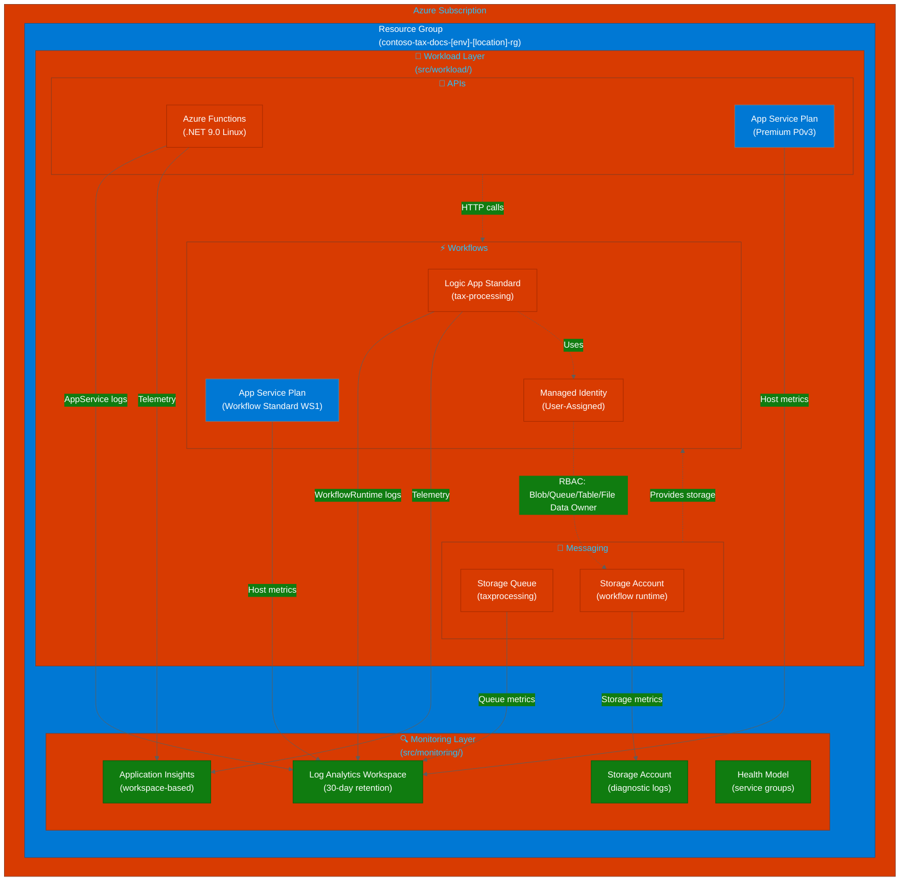

# Azure Logic Apps Standard - Monitoring Solution

A production-ready Infrastructure as Code (IaC) solution for implementing comprehensive observability in Azure Logic Apps Standard using Bicep. This project demonstrates Azure Monitor best practices with pre-configured diagnostic settings, centralized Log Analytics, workspace-based Application Insights, and a modular architecture designed for enterprise workflow orchestration.

[](https://azure.microsoft.com)
[](https://learn.microsoft.com/azure/azure-resource-manager/bicep/)
[](https://learn.microsoft.com/azure/logic-apps/)

## Table of Contents

- [Project Overview](#project-overview)
  - [Purpose](#purpose)
  - [Key Features](#key-features)
  - [Target Audience](#target-audience)
  - [Benefits](#benefits)
- [Architecture](#architecture)
  - [Solution Layers](#solution-layers)
  - [Architecture Diagram](#architecture-diagram)
  - [Data Flow](#data-flow)
- [Prerequisites](#prerequisites)
- [Deployment](#deployment)
  - [Manual Bicep Deployment](#manual-bicep-deployment)
  - [Troubleshooting](#troubleshooting-common-deployment-issues)
- [Usage](#usage)
- [Project Structure](#project-structure)
- [Monitoring Best Practices](#monitoring-best-practices)
- [Contributing](#contributing)
- [Security](#security)
- [Additional Resources](#additional-resources)
- [Support](#support)

## Project Overview

### Purpose

Azure Logic Apps Standard provides a powerful serverless workflow engine, but effective production monitoring requires more than default Application Insights integration. This solution fills critical observability gaps by providing:

**Centralized telemetry aggregation**: All resources (Logic Apps, Azure Functions, Storage Queues, App Service Plans) send diagnostic logs and metrics to a single Log Analytics workspace, enabling unified querying and correlation across your entire workflow ecosystem.

**Pre-configured diagnostic settings**: Every deployed resource automatically captures the right logs and metrics without manual portal configuration. This includes WorkflowRuntime logs for execution traces, AppService logs for hosting diagnostics, and Storage metrics for queue monitoring.

**Repeatable infrastructure**: Bicep templates ensure consistent monitoring configuration across dev, staging, and production environments. Deploy once, replicate everywhere with environment-specific parameters.

### Key Features

- **Workspace-Based Application Insights**: Unified query experience across Logic Apps and supporting services with 30-day log retention
- **Comprehensive Diagnostic Settings**: Automatic configuration for all resources capturing WorkflowRuntime, AppService, Storage Queue, and infrastructure metrics
- **Managed Identity Security**: User-Assigned Identity for Logic Apps with RBAC roles (Storage Blob Data Owner, Queue Data Contributor) eliminates connection string management
- **Multi-Tier Architecture**: Separation of monitoring infrastructure, messaging layer, and application workloads for modular deployment and reusability
- **Azure Functions Integration**: Pre-configured API layer (.NET 9.0) with Application Insights telemetry for custom operations
- **Storage Queue Monitoring**: Diagnostic settings on Storage Queue services for message tracking and dead-letter queue analysis
- **Health Model Support**: Azure Monitor health model implementation (preview) for service group organization
- **Dual Storage Architecture**: Separate storage accounts for workflow runtime and diagnostic logs to optimize performance and cost

### Target Audience

- **Beginner developers**: Deploy your first production-ready Logic Apps monitoring solution in under 30 minutes
- **Azure architects**: Evaluate a Well-Architected Framework-aligned approach for workflow observability
- **DevOps engineers**: Implement repeatable Infrastructure as Code for Logic Apps Standard environments
- **Platform engineers**: Standardize monitoring patterns across multiple Logic Apps deployments

### Benefits

**Fills gaps beyond default Application Insights**:
- Default Logic Apps monitoring only captures basic execution metrics; this solution adds WorkflowRuntime logs with detailed action-level traces, error messages, and execution context
- Storage Queue operations (enqueue/dequeue) are not monitored by default; diagnostic settings capture queue metrics and operation logs for message flow visibility
- App Service Plan metrics (CPU, memory, worker utilization) require manual configuration; automatically enabled here for capacity planning

**Logic Apps-specific monitoring capabilities**:
- Pre-configured queries for common troubleshooting scenarios (failed runs, slow executions, action failures)
- Correlation between Logic App executions and Azure Functions API calls via Application Insights distributed tracing
- Message tracking from Storage Queue through Logic App workflow execution

**Cost optimization**:
- 30-day log retention balances compliance needs with storage costs
- Separate storage accounts allow different retention policies (hot storage for runtime, cool storage for diagnostic archives)
- Metrics-based alerting reduces log query costs

**Infrastructure-as-Code repeatability**:
- Deploy identical monitoring configuration across multiple environments with parameter changes only
- Version control for monitoring infrastructure ensures audit trails and change management
- Modular Bicep structure allows reuse of monitoring patterns in other Azure projects

**Well-Architected Framework alignment**:
- **Reliability**: Diagnostic settings survive resource redeployments
- **Security**: Managed Identity eliminates credential exposure
- **Operational Excellence**: Automated monitoring removes manual configuration errors
- **Performance**: Workspace-based insights enable cross-resource queries
- **Cost Optimization**: Configurable retention and sampling strategies

## Architecture

### Solution Layers

This solution implements a three-tier architecture that separates concerns and enables modular deployment:

**Infrastructure Orchestration Layer** (`infra/main.bicep`): Top-level deployment coordinator that creates the resource group and sequences module deployments. This layer ensures monitoring infrastructure deploys before workloads, satisfying diagnostic settings dependencies.

**Monitoring Layer** (`src/monitoring/`): Observability infrastructure including Log Analytics workspace (30-day retention), workspace-based Application Insights, storage account for diagnostic logs, and Azure Monitor health model. All workload resources reference these centralized monitoring components.

**Workload Layer** (`src/workload/`): Application resources including Logic Apps Standard (Workflow Standard SKU with elastic scaling), Azure Functions (.NET 9.0 on Linux Premium plan), and Storage Account with queue services. Each resource has diagnostic settings configured to send telemetry to the monitoring layer.

**Deployment Sequence Rationale**: Monitoring resources must exist before workloads deploy because diagnostic settings require valid Log Analytics workspace and storage account resource IDs. The modular structure supports partial deployments (monitoring-only for testing) and allows workload updates without redeploying monitoring infrastructure.

### Architecture Diagram


```mermaid
%%{init: {'theme':'base', 'themeVariables': { 'primaryColor':'#0078D4', 'primaryTextColor':'#fff', 'primaryBorderColor':'#7C7C7C', 'lineColor':'#605E5C', 'secondaryColor':'#107C10', 'tertiaryColor':'#D83B01'}}}%%
graph TB
    subgraph Azure["Azure Subscription"]
        subgraph RG["Resource Group<br/>(contoso-tax-docs-[env]-[location]-rg)"]
            
            subgraph Monitoring["🔍 Monitoring Layer<br/>(src/monitoring/)"]
                LAW["Log Analytics Workspace<br/>(30-day retention)"]
                AI["Application Insights<br/>(workspace-based)"]
                LogStorage["Storage Account<br/>(diagnostic logs)"]
                Health["Health Model<br/>(service groups)"]
            end
            
            subgraph Workload["🚀 Workload Layer<br/>(src/workload/)"]
                subgraph Messaging["💬 Messaging"]
                    WStorage["Storage Account<br/>(workflow runtime)"]
                    Queue["Storage Queue<br/>(taxprocessing)"]
                end
                
                subgraph APIs["🔌 APIs"]
                    Function["Azure Functions<br/>(.NET 9.0 Linux)"]
                    FuncPlan["App Service Plan<br/>(Premium P0v3)"]
                end
                
                subgraph Workflows["⚡ Workflows"]
                    LogicApp["Logic App Standard<br/>(tax-processing)"]
                    MI["Managed Identity<br/>(User-Assigned)"]
                    LAPlan["App Service Plan<br/>(Workflow Standard WS1)"]
                end
            end
        end
    end
    
    %% Data flow arrows
    LogicApp -->|WorkflowRuntime logs| LAW
    LogicApp -->|Telemetry| AI
    Function -->|AppService logs| LAW
    Function -->|Telemetry| AI
    Queue -->|Queue metrics| LAW
    WStorage -->|Storage metrics| LogStorage
    LAPlan -->|Host metrics| LAW
    FuncPlan -->|Host metrics| LAW
    
    %% Authentication flows
    MI -.->|RBAC: Blob/Queue/Table/File Data Owner| WStorage
    LogicApp -.->|Uses| MI
    
    %% Dependencies
    Messaging -.->|Provides storage| Workflows
    APIs -.->|HTTP calls| Workflows
    
    classDef monitoringStyle fill:#107C10,stroke:#0B5A0B,color:#fff
    classDef workloadStyle fill:#D83B01,stroke:#A32A00,color:#fff
    classDef infraStyle fill:#0078D4,stroke:#005A9E,color:#fff
    
    class LAW,AI,LogStorage,Health monitoringStyle
    class LogicApp,Function,WStorage,Queue,MI workloadStyle
    class RG infraStyle
```

> **Note**: The diagram shows the logical architecture. Detailed sub-modules (individual Bicep files for each resource) are omitted for clarity. See [Project Structure](#project-structure) for complete module hierarchy.

### Data Flow

The observability pipeline follows this flow:

1. **Workflow Execution**: Logic App Standard executes workflows triggered by Storage Queue messages or HTTP requests. The Logic App uses Managed Identity to authenticate to Storage Queue (no connection strings).

2. **Telemetry Generation**: During execution, the Logic App generates WorkflowRuntime logs (action traces, errors, input/output data) and metrics (runs started, runs succeeded/failed, execution duration). Application Insights SDK captures distributed traces.

3. **Diagnostic Settings Routing**: Pre-configured diagnostic settings on the Logic App resource automatically send logs to Log Analytics workspace and storage account. Metrics are sent to Azure Monitor metrics store.

4. **Log Aggregation**: Log Analytics workspace receives logs from all resources (Logic Apps, Azure Functions, Storage Queues, App Service Plans) and indexes them for querying. Retention is set to 30 days.

5. **Application Insights Correlation**: Workspace-based Application Insights shares the Log Analytics workspace, enabling unified queries that correlate Logic App executions with Azure Functions HTTP calls using distributed tracing context (`operation_Id`).

6. **Query and Alert**: Operators run KQL queries in Log Analytics to troubleshoot failures or monitor SLAs. Azure Monitor alerts can trigger notifications when thresholds are breached (e.g., failure rate > 5%).

## Prerequisites

### Azure Requirements

- **Azure subscription** with Contributor role (minimum) on subscription or target resource group
- **Resource providers registered**:
  - `Microsoft.Logic` (Logic Apps)
  - `Microsoft.Insights` (Application Insights, diagnostic settings)
  - `Microsoft.OperationalInsights` (Log Analytics)
  - `Microsoft.Web` (App Service Plans, Azure Functions)
  - `Microsoft.Storage` (Storage Accounts)
  - `Microsoft.ManagedIdentity` (User-Assigned Managed Identity)
  - `Microsoft.Authorization` (Role assignments)

Verify registration status:
```bash
az provider show --namespace Microsoft.Logic --query "registrationState"
```

### Local Tools

- **Azure CLI**: Version 2.50 or higher ([Install](https://learn.microsoft.com/cli/azure/install-azure-cli))
- **Bicep CLI**: Version 0.20 or higher (included with Azure CLI 2.20+)
- **PowerShell**: Version 7.0 or higher ([Install](https://learn.microsoft.com/powershell/scripting/install/installing-powershell))
- **Azure Developer CLI (azd)**: Optional but recommended for streamlined deployments ([Install](https://learn.microsoft.com/azure/developer/azure-developer-cli/install-azd))

Verify installed versions:
```bash
az --version
bicep --version
pwsh --version
```

### Knowledge Prerequisites

- ✓ **Required**: Basic understanding of Azure Logic Apps Standard and workflow concepts
- ✓ **Required**: Familiarity with Azure Resource Manager deployments (resource groups, resources)
- ○ **Helpful**: Experience with Bicep or ARM templates for Infrastructure as Code
- ○ **Helpful**: Knowledge of KQL (Kusto Query Language) for Log Analytics queries
- ○ **Helpful**: Understanding of Azure Monitor concepts (diagnostic settings, metrics, logs)

### Configuration Files

Before deployment, you'll configure:
- **`infra/main.parameters.json`**: Environment-specific parameters (location, environment name)
- **Environment variables**: `AZURE_LOCATION` (Azure region) and `AZURE_ENV_NAME` (dev/uat/prod)

## Deployment

### Manual Bicep Deployment

**Step 1: Configure Parameters**

The `infra/main.parameters.json` file uses environment variables for flexibility. Set these before deployment:

```powershell
# Set environment variables (PowerShell)
$env:AZURE_LOCATION = "eastus"          # Your preferred Azure region
$env:AZURE_ENV_NAME = "dev"             # Environment: dev, uat, or prod
```

**Available parameters**:
- `location` (required): Azure region (e.g., "eastus", "westus2", "westeurope")
- `envName` (required): Environment suffix (allowed values: "dev", "uat", "prod")
- `solutionName` (optional): Base name prefix (default: "tax-docs", 3-20 characters)

**Parameter defaults** (in `infra/main.bicep`):
- Log Analytics retention: 30 days
- Application Insights type: workspace-based
- Logic App SKU: Workflow Standard (WS1)
- Azure Functions SKU: Premium P0v3 (.NET 9.0 on Linux)
- Storage replication: Locally redundant (LRS)
- TLS version: 1.2 minimum

---

**Step 2: Login and Create Resource Group**

The Bicep template creates the resource group automatically, but verify your Azure subscription first:

```bash
# Login to Azure
az login

# List available subscriptions
az account list --output table

# Set active subscription (if you have multiple)
az account set --subscription "<subscription-id-or-name>"

# Verify current subscription
az account show --query "{Name:name, SubscriptionId:id, TenantId:tenantId}" --output table
```

---

**Step 3: Deploy Infrastructure**

Deploy all resources with a single subscription-level deployment:

```bash
# Deploy to subscription scope (creates resource group + all resources)
az deployment sub create \
  --name "logicapp-monitoring-$(Get-Date -Format 'yyyyMMddHHmm')" \
  --location $env:AZURE_LOCATION \
  --template-file infra/main.bicep \
  --parameters infra/main.parameters.json \
  --parameters location=$env:AZURE_LOCATION envName=$env:AZURE_ENV_NAME
```

**What this does**:
1. Creates resource group: `contoso-tax-docs-[envName]-[location]-rg`
2. Deploys monitoring layer: Log Analytics workspace, Application Insights, storage account for logs
3. Deploys messaging layer: Storage account with `taxprocessing` queue
4. Deploys API layer: Azure Functions app with App Service Plan
5. Deploys workflow layer: Logic App Standard with Managed Identity and RBAC role assignments
6. Configures diagnostic settings on all resources

**Deployment time**: Approximately 5-8 minutes

---

**Step 4: Verify Deployment**

```bash
# Set resource group name (matches naming convention)
$rgName = "contoso-tax-docs-$env:AZURE_ENV_NAME-$env:AZURE_LOCATION-rg"

# List all deployed resources
az resource list \
  --resource-group $rgName \
  --output table

# Check Logic App status and health
az logicapp show \
  --name (az resource list -g $rgName --resource-type Microsoft.Web/sites --query "[?kind=='functionapp,workflowapp'].name" -o tsv) \
  --resource-group $rgName \
  --query "{Name:name, State:state, DefaultHostName:defaultHostName}" \
  --output table

# Verify Application Insights connection
az monitor app-insights component show \
  --resource-group $rgName \
  --query "[].{Name:name, ApplicationId:appId, ConnectionString:connectionString}" \
  --output table

# Verify Log Analytics workspace
az monitor log-analytics workspace show \
  --resource-group $rgName \
  --workspace-name (az resource list -g $rgName --resource-type Microsoft.OperationalInsights/workspaces --query "[0].name" -o tsv) \
  --query "{Name:name, CustomerId:customerId, RetentionInDays:retentionInDays}" \
  --output table
```

**Expected output**:
- Logic App state: `Running`
- Application Insights: Valid connection string returned
- Log Analytics: Workspace with 30-day retention configured
- 10-12 resources total (resource group, Log Analytics, Application Insights, 2 storage accounts, 2 App Service Plans, Logic App, Function App, Managed Identity, role assignments)

---

**Step 5: Post-Deployment Configuration**

The Bicep deployment handles most configuration automatically. Optional manual steps:

**Configure Alert Action Groups** (for notifications):
```bash
# Create action group for email notifications
az monitor action-group create \
  --name "LogicAppAlerts" \
  --resource-group $rgName \
  --short-name "LA-Alert" \
  --email-receiver name="DevOps Team" email="devops@yourcompany.com"
```

**Verify Diagnostic Settings** (already configured by Bicep):
```bash
# List diagnostic settings on Logic App
$logicAppId = az resource list -g $rgName --resource-type Microsoft.Web/sites --query "[?kind=='functionapp,workflowapp'].id" -o tsv
az monitor diagnostic-settings list --resource $logicAppId --output table
```

**Access Workflow Definition** (optional - deploy custom workflows):
- Navigate to Azure Portal → Logic App → Workflows
- Upload workflows from `tax-docs/tax-processing/workflow.json`
- Configure connections in `tax-docs/connections.json`

---

### Troubleshooting Common Deployment Issues

<details>
<summary><strong>Issue: "Resource provider not registered"</strong></summary>

**Symptom**: Deployment fails with error similar to:
```
The subscription is not registered to use namespace 'Microsoft.Logic'
```

**Solution**:
```bash
# Register required providers
az provider register --namespace Microsoft.Logic
az provider register --namespace Microsoft.Insights
az provider register --namespace Microsoft.OperationalInsights
az provider register --namespace Microsoft.Web
az provider register --namespace Microsoft.Storage
az provider register --namespace Microsoft.ManagedIdentity

# Wait for registration to complete (takes 1-2 minutes)
az provider show --namespace Microsoft.Logic --query "registrationState"
# Expected: "Registered"
```

**Prevention**: Register providers before deployment in new subscriptions.
</details>

<details>
<summary><strong>Issue: "Insufficient permissions"</strong></summary>

**Symptom**: Deployment fails with authorization or forbidden errors:
```
The client does not have authorization to perform action 'Microsoft.Resources/deployments/write'
```

**Solution**:
```bash
# Check your current role assignments
az role assignment list --assignee (az account show --query "user.name" -o tsv) --output table

# Required minimum: Contributor role on subscription or resource group
# If missing, request access from subscription owner
```

**Common causes**:
- Reader role only (insufficient for deployments)
- Custom roles without deployment permissions
- Conditional access policies blocking role assignments

**Workaround**: Ask subscription owner to grant Contributor role or create resource group with pre-assigned permissions.
</details>

<details>
<summary><strong>Issue: "Deployment timeout"</strong></summary>

**Symptom**: Deployment exceeds Azure timeout limits (typically 1 hour for resource group deployments)

**Solution**:
```bash
# Use --no-wait flag for asynchronous deployment
az deployment sub create \
  --name "logicapp-monitoring" \
  --location $env:AZURE_LOCATION \
  --template-file infra/main.bicep \
  --parameters infra/main.parameters.json \
  --no-wait

# Check deployment status
az deployment sub show \
  --name "logicapp-monitoring" \
  --query "{Name:name, ProvisioningState:properties.provisioningState, Timestamp:properties.timestamp}" \
  --output table

# View detailed operation status
az deployment operation sub list \
  --name "logicapp-monitoring" \
  --query "[].{Resource:properties.targetResource.resourceName, State:properties.provisioningState}" \
  --output table
```

**Note**: This deployment typically completes in 5-8 minutes. Timeouts are rare unless Azure region is experiencing issues.
</details>

<details>
<summary><strong>Issue: "Storage account name already exists"</strong></summary>

**Symptom**: Deployment fails with:
```
Storage account name must be globally unique
```

**Cause**: The `uniqueString()` function generated a name collision (extremely rare but possible).

**Solution**:
```bash
# Override solutionName parameter to generate different unique suffix
az deployment sub create \
  --name "logicapp-monitoring" \
  --location $env:AZURE_LOCATION \
  --template-file infra/main.bicep \
  --parameters infra/main.parameters.json \
  --parameters solutionName="taxdocs2"
```

**Prevention**: Use organization-specific prefixes in `solutionName` parameter (e.g., "contoso-tax").
</details>

<details>
<summary><strong>Issue: "Role assignment failed for Managed Identity"</strong></summary>

**Symptom**: Deployment succeeds but Logic App fails to access Storage Queue:
```
Logic App cannot authenticate to storage account
```

**Cause**: RBAC role assignments can take 5-10 minutes to propagate.

**Solution**:
```bash
# Wait 5 minutes, then verify role assignments
$miPrincipalId = az identity show \
  --resource-group $rgName \
  --name (az resource list -g $rgName --resource-type Microsoft.ManagedIdentity/userAssignedIdentities --query "[0].name" -o tsv) \
  --query "principalId" -o tsv

$storageId = az storage account show \
  --resource-group $rgName \
  --name (az resource list -g $rgName --resource-type Microsoft.Storage/storageAccounts --query "[?contains(name, 'taxdocs')].name" -o tsv) \
  --query "id" -o tsv

# Check role assignments
az role assignment list \
  --assignee $miPrincipalId \
  --scope $storageId \
  --output table

# Expected roles: Storage Blob Data Owner, Storage Queue Data Contributor, Storage Table Data Contributor, Storage File Data Contributor
```

**Workaround**: Re-run deployment if roles are missing (Bicep is idempotent).
</details>

<details>
<summary><strong>Issue: "Bicep compilation errors"</strong></summary>

**Symptom**: `az deployment` fails during template validation with Bicep syntax errors.

**Solution**:
```bash
# Validate Bicep template before deployment
az bicep build --file infra/main.bicep

# Check for linting warnings
bicep build infra/main.bicep

# Update Bicep CLI to latest version
az bicep upgrade
```

**Common causes**:
- Outdated Bicep CLI version (update with `az bicep upgrade`)
- Modified template syntax (revert changes or fix errors shown in output)
</details>

---

## Usage

### Example 1: Query Logic App Execution History

**Scenario**: Troubleshoot failed workflow runs in the last 24 hours

**Query** (Run in Log Analytics workspace):
```kql
// Failed Logic App workflow runs with error details
AzureDiagnostics
| where ResourceProvider == "MICROSOFT.LOGIC"
| where Category == "WorkflowRuntime"
| where status_s == "Failed"
| project 
    TimeGenerated,
    ResourceGroup = resource_rg_s,
    WorkflowName = resource_workflowName_s,
    RunId = resource_runId_s,
    ActionName = resource_actionName_s,
    Status = status_s,
    ErrorCode = error_code_s,
    ErrorMessage = error_message_s
| order by TimeGenerated desc
| take 50
```

**How to run**:
1. Navigate to Azure Portal → Log Analytics workspace (named `tax-docs-[uniqueId]-law`)
2. Select **Logs** from left navigation
3. Paste query into query editor
4. Click **Run**
5. Export results to CSV if needed

**Expected output**: Table showing recent failures with workflow names, run IDs, action names, and detailed error messages

<details>
<summary>View example output</summary>

| TimeGenerated | ResourceGroup | WorkflowName | RunId | ActionName | Status | ErrorCode | ErrorMessage |
|---------------|---------------|--------------|-------|------------|--------|-----------|--------------|
| 2025-12-04 10:23:45 | contoso-tax-docs-dev-eastus-rg | tax-processing | 08584...1ab | Parse_JSON | Failed | InvalidTemplate | Invalid JSON schema |
| 2025-12-04 09:15:22 | contoso-tax-docs-dev-eastus-rg | tax-processing | 08584...2cd | HTTP_Call | Failed | ConnectionTimeout | Request timeout after 30s |

</details>

---

### Example 2: Monitor Workflow Execution Duration

**Scenario**: Identify slow-running workflows to optimize performance

```kql
// Workflow execution duration percentiles
AzureDiagnostics
| where ResourceProvider == "MICROSOFT.LOGIC"
| where Category == "WorkflowRuntime"
| where status_s == "Succeeded"
| extend DurationSeconds = todouble(duration_s)
| summarize 
    Count = count(),
    AvgDuration = avg(DurationSeconds),
    P50 = percentile(DurationSeconds, 50),
    P90 = percentile(DurationSeconds, 90),
    P95 = percentile(DurationSeconds, 95),
    P99 = percentile(DurationSeconds, 99),
    MaxDuration = max(DurationSeconds)
    by resource_workflowName_s
| order by P95 desc
```

**Thresholds to monitor**:
- P95 > 60 seconds: Investigate workflow design for optimization opportunities
- P99 > 120 seconds: Possible timeout risks or external API latency issues
- MaxDuration significantly higher than P99: Look for outliers or error scenarios

**Optimization techniques**:
- Parallelize independent actions using `foreach` with concurrency
- Use async HTTP actions to avoid blocking
- Batch small operations instead of iterating individually

---

### Example 3: Create Custom Alert Rule for Failed Workflows

**Scenario**: Get email notification when Logic App failures exceed threshold

```bash
# Step 1: Create action group (if not already created)
az monitor action-group create \
  --name "LogicAppAlerts" \
  --resource-group $rgName \
  --short-name "LA-Alert" \
  --email-receiver name="DevOps Team" email="devops@yourcompany.com"

# Step 2: Get Logic App resource ID
$logicAppId = az resource list \
  --resource-group $rgName \
  --resource-type Microsoft.Web/sites \
  --query "[?kind=='functionapp,workflowapp'].id" \
  --output tsv

# Step 3: Create metric alert for failed runs
az monitor metrics alert create \
  --name "HighLogicAppFailureRate" \
  --resource-group $rgName \
  --scopes $logicAppId \
  --condition "count RunsFailed > 5" \
  --window-size 5m \
  --evaluation-frequency 1m \
  --action (az monitor action-group show -n LogicAppAlerts -g $rgName --query id -o tsv) \
  --description "Alert when Logic App fails more than 5 times in 5 minutes" \
  --severity 2
```

**Alert configuration**:
- **Severity 2** (Warning): Requires investigation but not critical
- **Window size 5 minutes**: Short window for fast detection
- **Evaluation frequency 1 minute**: Check every minute
- **Threshold 5 failures**: Adjust based on your SLA

<details>
<summary>View complete alert configuration JSON</summary>

```json
{
  "name": "HighLogicAppFailureRate",
  "description": "Alert when Logic App fails more than 5 times in 5 minutes",
  "severity": 2,
  "enabled": true,
  "scopes": [
    "/subscriptions/<sub-id>/resourceGroups/<rg>/providers/Microsoft.Web/sites/<logic-app-name>"
  ],
  "evaluationFrequency": "PT1M",
  "windowSize": "PT5M",
  "criteria": {
    "allOf": [
      {
        "criterionType": "StaticThresholdCriterion",
        "name": "FailedRuns",
        "metricName": "RunsFailed",
        "metricNamespace": "Microsoft.Web/sites",
        "operator": "GreaterThan",
        "threshold": 5,
        "timeAggregation": "Total"
      }
    ],
    "odata.type": "Microsoft.Azure.Monitor.SingleResourceMultipleMetricCriteria"
  },
  "actions": [
    {
      "actionGroupId": "/subscriptions/<sub-id>/resourceGroups/<rg>/providers/microsoft.insights/actionGroups/LogicAppAlerts"
    }
  ]
}
```
</details>

**Additional alert recommendations**:
- **Execution duration > 120 seconds** (P95): Performance degradation
- **RunsStarted < 10 in 1 hour**: Possible trigger issues
- **Storage Queue message count > 1000**: Backlog accumulation

---

### Example 4: Access Storage Queue Diagnostic Logs

**Scenario**: Track message flow through Storage Queue to Logic App

```kql
// Storage Queue operations with message counts
StorageQueueLogs
| where AccountName contains "taxdocs"
| where OperationName in ("PutMessage", "GetMessages", "DeleteMessage")
| summarize 
    MessagesPut = countif(OperationName == "PutMessage"),
    MessagesRetrieved = countif(OperationName == "GetMessages"),
    MessagesDeleted = countif(OperationName == "DeleteMessage")
    by bin(TimeGenerated, 5m), QueueName = Uri
| order by TimeGenerated desc
```

**Configure diagnostic settings** (already done by Bicep, verification only):
```bash
# Verify Queue Service diagnostic settings
$storageId = az storage account show \
  --resource-group $rgName \
  --name (az resource list -g $rgName --resource-type Microsoft.Storage/storageAccounts --query "[?contains(name, 'taxdocs')].name" -o tsv) \
  --query "id" -o tsv

az monitor diagnostic-settings list \
  --resource "$storageId/queueServices/default" \
  --output table
```

**Expected diagnostic settings**:
- **Logs**: `StorageRead`, `StorageWrite`, `StorageDelete`
- **Metrics**: `Transaction`, `Capacity`
- **Destination**: Log Analytics workspace

---

### Example 5: Correlate Logic App with Azure Functions Calls

**Scenario**: Trace distributed transactions from Logic App HTTP action to Azure Functions

```kql
// Distributed tracing across Logic App and Functions
let logicAppRequests = AzureDiagnostics
| where ResourceProvider == "MICROSOFT.LOGIC"
| where Category == "WorkflowRuntime"
| where resource_actionName_s == "HTTP_Call_To_Function"
| extend OperationId = tostring(properties_d.correlation.clientTrackingId)
| project TimeGenerated, OperationId, WorkflowName = resource_workflowName_s, RunId = resource_runId_s;
let functionRequests = AppRequests
| where AppRoleName contains "api"
| project TimeGenerated, OperationId = OperationId, FunctionName = Name, Duration = DurationMs, Success;
logicAppRequests
| join kind=inner functionRequests on OperationId
| project 
    TimeGenerated,
    WorkflowName,
    FunctionName,
    FunctionDuration = Duration,
    FunctionSuccess = Success,
    CorrelationId = OperationId
| order by TimeGenerated desc
```

**Use case**: Identify whether workflow failures originate in Logic App or downstream Functions

---

### Example 6: Monitor App Service Plan Capacity

**Scenario**: Track CPU and memory utilization to optimize scaling

```bash
# Query App Service Plan metrics via Azure CLI
az monitor metrics list \
  --resource $(az resource list -g $rgName --resource-type Microsoft.Web/serverfarms --query "[?contains(name, 'asp')].id" -o tsv) \
  --metric "CpuPercentage" "MemoryPercentage" \
  --start-time (Get-Date).AddHours(-24).ToString("yyyy-MM-ddTHH:mm:ssZ") \
  --end-time (Get-Date).ToString("yyyy-MM-ddTHH:mm:ssZ") \
  --interval PT1H \
  --aggregation Average \
  --output table
```

**Scaling thresholds**:
- **CPU > 70%** for 15 minutes: Scale out (add instances)
- **CPU < 20%** for 1 hour: Scale in (reduce instances)
- **Memory > 85%**: Investigate memory leaks or upgrade SKU

**KQL query alternative**:
```kql
AzureMetrics
| where ResourceProvider == "MICROSOFT.WEB"
| where ResourceId contains "serverfarms"
| where MetricName in ("CpuPercentage", "MemoryPercentage")
| summarize AvgValue = avg(Average) by MetricName, bin(TimeGenerated, 1h)
| render timechart
```

---

## Project Structure

```
Azure-LogicApps-Monitoring/
├── infra/                          # Infrastructure-as-Code root
│   ├── main.bicep                  # Main deployment orchestrator (subscription scope)
│   └── main.parameters.json        # Environment-specific parameters (location, envName)
├── src/
│   ├── monitoring/                 # Monitoring layer (deploys first)
│   │   ├── main.bicep              # Monitoring orchestrator module
│   │   ├── app-insights.bicep      # Workspace-based Application Insights
│   │   ├── log-analytics-workspace.bicep  # Log Analytics (30-day retention) + storage account
│   │   └── azure-monitor-health-model.bicep  # Service group health model
│   └── workload/                   # Application workload layer (deploys second)
│       ├── main.bicep              # Workload orchestrator module
│       ├── logic-app.bicep         # Logic App Standard + Managed Identity + RBAC
│       ├── azure-function.bicep    # Azure Functions (.NET 9.0 Linux Premium)
│       └── messaging/
│           └── main.bicep          # Storage Account + Queue Service + taxprocessing queue
├── tax-docs/                       # Logic App workflow definitions
│   ├── connections.json            # Managed API connections configuration
│   ├── host.json                   # Logic App host configuration (extension bundle)
│   ├── local.settings.json         # Local development settings (not deployed)
│   └── tax-processing/
│       └── workflow.json           # Stateful workflow definition (empty template)
├── azure.yaml                      # Azure Developer CLI (azd) configuration
├── host.json                       # Functions runtime configuration
├── README.md                       # This file
├── CONTRIBUTING.md                 # Contribution guidelines (empty placeholder)
├── SECURITY.md                     # Security policies (empty placeholder)
├── LICENSE.md                      # Project license (empty placeholder)
└── CODE_OF_CONDUCT.md              # Community code of conduct (placeholder)
```

**Key Directories**:
- **`infra/`**: Top-level orchestrator for subscription-scoped deployments; creates resource group and calls monitoring/workload modules
- **`src/monitoring/`**: Observability infrastructure deployed first; provides Log Analytics workspace and Application Insights for diagnostic settings
- **`src/workload/`**: Application resources deployed second; all resources reference monitoring outputs for diagnostic configuration
- **`tax-docs/`**: Logic App workflow definitions for deployment (currently contains empty template; customize for your scenarios)

**Modular Design Pattern**:
Each `.bicep` file is a reusable module with clearly defined parameters and outputs. The orchestrator modules (`infra/main.bicep`, `src/monitoring/main.bicep`, `src/workload/main.bicep`) coordinate deployments and pass outputs between layers. This enables:
- Partial deployments (monitoring-only, workload-only)
- Module reuse in other projects
- Independent updates without full redeployment
- Environment-specific customization via parameters

---

## Monitoring Best Practices

This solution implements Azure Well-Architected Framework principles:

### Reliability

- **Health probes**: Application Insights availability tests can be added for Logic App HTTP endpoints
- **Diagnostic settings survivability**: Configured via Bicep, survive resource redeployments
- **Retry policies**: Logic Apps support built-in retry policies on actions (configure in workflow definition)
- **Dead-letter queue**: Storage Queue supports automatic dead-letter for poison messages (enable in queue properties)

### Performance Efficiency

- **Metrics tracked**:
  - **Logic Apps**: `RunsStarted`, `RunsSucceeded`, `RunsFailed`, `RunLatency`, `ActionLatency`
  - **Azure Functions**: `FunctionExecutionCount`, `FunctionExecutionUnits`, `Http5xx`, `ResponseTime`
  - **Storage Queue**: `QueueMessageCount`, `QueueCapacity`, `Transactions`
  - **App Service Plans**: `CpuPercentage`, `MemoryPercentage`, `DiskQueueLength`

- **Scaling triggers**:
  - Logic Apps: Elastic scaling enabled (0-20 workers based on queue depth)
  - Azure Functions: Premium plan with auto-scale rules (configure in portal or Bicep)
  - Storage Queue: Monitor `QueueMessageCount` for backlog thresholds

### Security

- **Managed Identities**: 
  - Logic Apps use **User-Assigned Managed Identity** for Storage Queue authentication
  - Azure Functions use **System-Assigned Managed Identity** for Application Insights
  - Eliminates connection strings and credential management

- **RBAC Roles Applied**:
  - `Storage Blob Data Owner` (Logic App → Storage Account)
  - `Storage Queue Data Contributor` (Logic App → Queue Service)
  - `Storage Table Data Contributor` (Logic App → Table Service)
  - `Storage File Data Contributor` (Logic App → File Service)

- **Diagnostic logs capture**:
  - Authentication attempts (successful and failed)
  - RBAC permission checks
  - Network access patterns

- **Secrets storage**:
  - Application Insights connection strings secured with `@secure()` decorator in Bicep outputs
  - Not exposed in deployment logs or portal
  - Pass to application settings only

### Cost Optimization

- **Log retention**: 30 days balances compliance with storage costs (configurable in `log-analytics-workspace.bicep`)
- **Sampling strategies**: Application Insights adaptive sampling enabled by default (adjusts ingestion based on traffic)
- **Dual storage accounts**: 
  - **Workflow runtime storage**: Hot tier, Standard LRS for performance
  - **Diagnostic logs storage**: Can be changed to Cool tier in production for long-term retention cost savings
- **Metric-based alerts**: Reduce log query costs by using Azure Monitor metrics instead of KQL queries where possible
- **Dashboard recommendations**: Use Azure Workbooks (free) instead of custom dashboards for cost-effective visualization

### Operational Excellence

- **Infrastructure-as-Code**: All resources defined in version-controlled Bicep templates
- **Automated monitoring configuration**: No manual portal clicks required for diagnostic settings
- **Consistent tagging**: All resources tagged with `Solution`, `Environment`, `ManagedBy`, `Owner`, `ApplicationName`, `BusinessUnit`, `DeploymentDate`
- **Parameterized deployments**: Environment-specific values isolated in parameters files
- **Module reusability**: Monitoring modules can be imported into other Logic Apps projects

**Runbooks for Common Scenarios**:
1. **Workflow failure spike**: Use [Example 1 query](#example-1-query-logic-app-execution-history) → identify error pattern → check recent deployments or external API changes
2. **Performance degradation**: Use [Example 2 query](#example-2-monitor-workflow-execution-duration) → check P95 duration trend → optimize slow actions or scale resources
3. **Queue backlog**: Query `QueueMessageCount` metric → verify Logic App is running → check for failures → scale out if needed

---

## Contributing

We welcome contributions! Please see [CONTRIBUTING.md](CONTRIBUTING.md) for:
- Code of conduct
- How to submit issues and pull requests
- Development setup instructions
- Testing requirements

> **Note**: CONTRIBUTING.md is currently a placeholder. If you'd like to contribute, please open an issue to discuss your proposed changes.

---

## Security

Security is critical for monitoring infrastructure. Please review [SECURITY.md](SECURITY.md) for:
- Reporting security vulnerabilities
- Security best practices for deployments
- Credential and secret management guidelines

### Key Security Considerations

- ⚠️ **Never commit secrets**: Do not commit connection strings, storage account keys, or Application Insights instrumentation keys to version control
- ✓ **Use Managed Identities**: Logic Apps use User-Assigned Managed Identity with RBAC roles; Azure Functions use System-Assigned Identity
- ✓ **Least-privilege access**: 
  - Developers: Reader role on resource group (view resources and logs)
  - DevOps: Contributor role for deployments
  - Logic Apps: Only required storage roles (Blob/Queue/Table/File Data Contributor)
- ✓ **Enable audit logging**: Diagnostic settings capture all RBAC changes and authentication attempts in Log Analytics
- ✓ **Rotate access keys**: If using storage account keys (not recommended), rotate every 90 days
- ✓ **Use Azure Key Vault**: For application secrets referenced by Logic Apps (not implemented in this template; add as needed)

### Security Best Practices Applied

Based on workspace analysis:
- **Managed Identity**: User-Assigned Identity for Logic Apps eliminates storage connection strings
- **RBAC Enforcement**: Comprehensive role assignments for storage access (Blob/Queue/Table/File Data Owner/Contributor)
- **TLS 1.2 Minimum**: All storage accounts and Application Insights enforce TLS 1.2+
- **Secure Outputs**: Application Insights connection strings use `@secure()` decorator to prevent logging
- **Network Access**: Public network access enabled for ease of use (restrict to VNet in production if required)
- **Diagnostic Logging**: All resources send audit logs to Log Analytics for security monitoring

> **Note**: SECURITY.md is currently a placeholder. For production deployments, implement additional controls like Private Endpoints, Key Vault integration, and network restrictions.

---

## Additional Resources

- [Azure Logic Apps Standard Documentation](https://learn.microsoft.com/azure/logic-apps/logic-apps-overview)
- [Azure Monitor Best Practices](https://learn.microsoft.com/azure/azure-monitor/best-practices)
- [Bicep Language Documentation](https://learn.microsoft.com/azure/azure-resource-manager/bicep/)
- [Well-Architected Framework for Azure](https://learn.microsoft.com/azure/architecture/framework/)
- [KQL Query Language Reference](https://learn.microsoft.com/azure/data-explorer/kusto/query/)
- [Logic Apps Monitoring and Diagnostics](https://learn.microsoft.com/azure/logic-apps/monitor-logic-apps-log-analytics)
- [Application Insights for Logic Apps](https://learn.microsoft.com/azure/logic-apps/create-single-tenant-workflows-visual-studio-code#enable-application-insights)
- [Managed Identity for Logic Apps](https://learn.microsoft.com/azure/logic-apps/create-managed-service-identity)

---

## Support

For questions and support:

- 📝 **Create an issue**: [GitHub Issues](https://github.com/Evilazaro/Azure-LogicApps-Monitoring/issues) (preferred for bug reports and feature requests)
- 💬 **Review existing issues**: Check if your question has already been answered
- 📖 **Documentation**: See [Additional Resources](#additional-resources) for official Microsoft documentation

**Before opening an issue**:
1. Verify your deployment followed all steps in [Deployment](#deployment)
2. Check [Troubleshooting](#troubleshooting-common-deployment-issues) for common issues
3. Include deployment logs and error messages in issue description
4. Specify your environment (Azure region, subscription type, Bicep version)

---

## Glossary

<details>
<summary>Click to expand Azure-specific terms</summary>

- **Application Insights**: Azure Monitor service for application performance monitoring and telemetry collection
- **Bicep**: Domain-specific language for declarative Azure resource deployment (alternative to ARM JSON templates)
- **Diagnostic Settings**: Azure configuration that routes resource logs and metrics to destinations (Log Analytics, Storage, Event Hub)
- **KQL (Kusto Query Language)**: Query language for searching and analyzing data in Log Analytics and Application Insights
- **Log Analytics Workspace**: Centralized log aggregation service for querying logs from multiple Azure resources
- **Logic Apps Standard**: Single-tenant Logic Apps runtime hosted on App Service Plan (vs. multi-tenant Consumption plan)
- **Managed Identity**: Azure AD identity automatically managed by Azure for authenticating to Azure services without credentials
- **RBAC (Role-Based Access Control)**: Azure permission model using roles (e.g., Contributor, Reader) assigned to identities
- **WorkflowRuntime Logs**: Detailed execution traces from Logic Apps including action inputs/outputs, errors, and correlation IDs
- **Workspace-Based Application Insights**: Application Insights integrated with Log Analytics workspace for unified querying

</details>

---

**Repository**: [Azure-LogicApps-Monitoring](https://github.com/Evilazaro/Azure-LogicApps-Monitoring)  
**Branch**: refactor/Shared  
**Last Updated**: December 4, 2025
