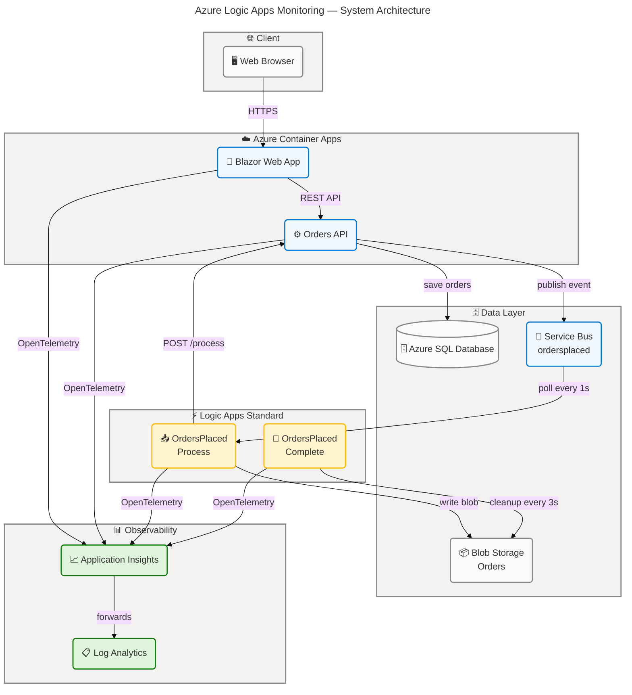

# Azure Logic Apps Monitoring


A cloud-native order processing solution demonstrating how .NET 10 Aspire applications integrate with Azure Logic Apps Standard workflows for event-driven processing, full-stack observability, and infrastructure-as-code deployment on Azure.

## Overview

**Overview**

This solution provides a production-grade reference implementation for platform engineers and cloud architects who need to build resilient, observable, event-driven systems on Azure. It captures the complete order lifecycle—from placement and validation through asynchronous Logic Apps orchestration, state management in Azure Blob Storage, and automated cleanup—while showcasing the integration of .NET Aspire with Azure Logic Apps Standard, managed identity authentication, and structured OpenTelemetry observability.

The system connects a Blazor Server frontend (`eShop.Web.App`) and a REST API (`eShop.Orders.API`) deployed as Azure Container Apps to a Logic Apps Standard workflow engine via Azure Service Bus. When a user places an order, the Orders API persists it to Azure SQL Database and publishes a message to a Service Bus topic. A stateful Logic App workflow polls the topic every second, calls the Orders API to process each message, and writes outcomes to Azure Blob Storage. A second recurrence-based workflow cleans up processed blobs every three seconds. Every component exports OpenTelemetry traces, custom metrics, and logs to Application Insights and a Log Analytics Workspace.

## Table of Contents

- [Quick Start](#quick-start)
- [Architecture](#architecture)
- [Features](#features)
- [Requirements](#requirements)
- [Configuration](#configuration)
- [Usage](#usage)
- [Contributing](#contributing)
- [License](#license)

## Quick Start

Deploy the complete solution to Azure with the Azure Developer CLI (`azd`). The `azd up` command provisions all infrastructure and deploys the application in a single step.

> [!NOTE]
> The `preprovision` hook runs automatically during `azd up` and validates all prerequisites: .NET SDK version, `azd` version, Azure CLI version, Bicep CLI version, and Azure resource provider registrations. Run `dotnet --version`, `azd version`, and `az version` to check installed versions before proceeding.

**1. Clone the repository**

```bash
git clone https://github.com/Evilazaro/Azure-LogicApps-Monitoring.git
cd Azure-LogicApps-Monitoring
```

**2. Authenticate with Azure**

```bash
azd auth login
```

**3. Initialize the environment**

```bash
azd env new my-orders-env
azd env set AZURE_LOCATION eastus
azd env set AZURE_ENV_NAME dev
```

**4. Provision infrastructure and deploy**

```bash
azd up
```

`azd up` runs the full deployment lifecycle in sequence:

1. `preprovision.ps1` — runs `dotnet clean/restore/build/test` and validates all prerequisite tool versions and Azure resource provider registrations
2. Bicep IaC (`infra/main.bicep`) — provisions VNet, SQL Database, Service Bus, Container Apps Environment, Logic Apps Standard, ACR, private endpoints, and DNS zones
3. Container image build — compiles and containerizes `eShop.Orders.API` and `eShop.Web.App`, then pushes images to Azure Container Registry
4. `deploy-workflow.ps1` — deploys Logic Apps Standard workflows from `workflows/OrdersManagement/` (`predeploy` hook, runs before Container Apps deployment)
5. Container Apps deployment — deploys `eShop.Orders.API` and `eShop.Web.App` to the Azure Container Apps environment
6. `postprovision.ps1` — grants the managed identity `db_owner` access on the SQL Database and writes all `.NET user-secrets` to every project for local development

**5. Verify the deployment**

The Blazor web app URL is printed at the end of `azd up`. Open it in a browser to access the order management interface.

**6. Generate sample orders (optional)**

```powershell
.\hooks\Generate-Orders.ps1
```

**Running locally (no Azure subscription required)**

```bash
dotnet run --project app.AppHost
```

The .NET Aspire dashboard is available at `https://localhost:17267`. In local mode the AppHost substitutes Azure Service Bus with an emulator and SQL Server with a Docker container — no Azure subscription required. All project user secrets are populated by `postprovision.ps1` after the first `azd up`.

## Architecture

The system is organized into five logical layers: a client browser, Azure Container Apps (frontend + API), Azure platform services (SQL, Service Bus, Blob Storage), Azure Logic Apps Standard (two stateful workflows), and observability (Application Insights + Log Analytics). The `.NET Aspire AppHost` (`app.AppHost`) orchestrates the identical topology locally during development, replacing Azure Container Apps, Service Bus, and SQL Server with local equivalents.


```mermaid
---
title: "Azure Logic Apps Monitoring — System Architecture"
config:
  theme: base
  look: classic
  layout: dagre
  themeVariables:
    fontSize: '16px'
  flowchart:
    htmlLabels: true
---
flowchart TB
    accTitle: Azure Logic Apps Monitoring System Architecture
    accDescr: End-to-end order processing flow from a Blazor web browser through Azure Container Apps and Service Bus to Logic Apps Standard workflows, Azure SQL Database, Blob Storage, and Application Insights with OpenTelemetry observability.

    %% ═══════════════════════════════════════════════════════════════════════════
    %% AZURE / FLUENT ARCHITECTURE PATTERN v1.1
    %% (Semantic + Structural + Font + Accessibility Governance)
    %% ═══════════════════════════════════════════════════════════════════════════
    %% PHASE 1 - FLUENT UI: All styling uses approved Fluent UI palette only
    %% PHASE 2 - GROUPS: Every subgraph has semantic color via style directive
    %% PHASE 3 - COMPONENTS: Every node has semantic classDef + icon prefix
    %% PHASE 4 - ACCESSIBILITY: accTitle/accDescr present, WCAG AA contrast
    %% PHASE 5 - STANDARD: Governance block present, classDefs centralized
    %% ═══════════════════════════════════════════════════════════════════════════

    subgraph client["🌐 Client"]
        browser("🖥️ Web Browser"):::neutral
    end

    subgraph aca["☁️ Azure Container Apps"]
        webapp("🎨 Blazor Web App"):::core
        ordersapi("⚙️ Orders API"):::core
    end

    subgraph datalayer["🗄️ Data Layer"]
        sql[("🗄️ Azure SQL Database")]:::neutral
        sbus("📨 Service Bus<br/>ordersplaced"):::core
        blob("📦 Blob Storage<br/>Orders"):::neutral
    end

    subgraph logic["⚡ Logic Apps Standard"]
        wf1("📥 OrdersPlaced<br/>Process"):::warning
        wf2("🔄 OrdersPlaced<br/>Complete"):::warning
    end

    subgraph obs["📊 Observability"]
        ai("📈 Application Insights"):::success
        la("📋 Log Analytics"):::success
    end

    browser -->|"HTTPS"| webapp
    webapp -->|"REST API"| ordersapi
    ordersapi -->|"save orders"| sql
    ordersapi -->|"publish event"| sbus
    sbus -->|"poll every 1s"| wf1
    wf1 -->|"POST /process"| ordersapi
    wf1 -->|"write blob"| blob
    wf2 -->|"cleanup every 3s"| blob
    webapp & ordersapi -->|"OpenTelemetry"| ai
    wf1 & wf2 -->|"OpenTelemetry"| ai
    ai -->|"forwards"| la

    style client fill:#F3F2F1,stroke:#8A8886,stroke-width:2px,color:#323130
    style aca fill:#F3F2F1,stroke:#8A8886,stroke-width:2px,color:#323130
    style datalayer fill:#F3F2F1,stroke:#8A8886,stroke-width:2px,color:#323130
    style logic fill:#F3F2F1,stroke:#8A8886,stroke-width:2px,color:#323130
    style obs fill:#F3F2F1,stroke:#8A8886,stroke-width:2px,color:#323130

    classDef neutral fill:#FAFAFA,stroke:#8A8886,stroke-width:2px,color:#323130
    classDef core fill:#EFF6FC,stroke:#0078D4,stroke-width:2px,color:#323130
    classDef warning fill:#FFF4CE,stroke:#FFB900,stroke-width:2px,color:#323130
    classDef success fill:#DFF6DD,stroke:#107C10,stroke-width:2px,color:#323130
```

**End-to-end order flow:**

1. A user places an order through the **Blazor Web App** served by Azure Container Apps (`eShop.Web.App`).
2. The **Orders API** validates the order, persists it to **Azure SQL Database** via EF Core, and publishes a JSON message to the **Service Bus** topic `ordersplaced`.
3. The **`OrdersPlacedProcess`** Logic App workflow polls the topic every second, validates the message content type as `application/json`, and calls `POST /api/Orders/process` on the Orders API via HTTP.
4. On success (HTTP 201), the workflow writes a result blob to `/ordersprocessedsuccessfully/{MessageId}`. On any other status code, it writes to `/ordersprocessedwitherrors/{MessageId}`.
5. The **`OrdersPlacedCompleteProcess`** Logic App recurrence workflow runs every three seconds, lists blobs in the success folder, and deletes them to complete the cleanup cycle.
6. All components export OpenTelemetry traces, metrics, and logs to **Application Insights**, which forwards data to the **Log Analytics Workspace** for long-term retention and querying.

**Provisioned Azure resources:**

| Component                     | Azure Service            | SKU / Configuration                       | Role                                                                                                        |
| ----------------------------- | ------------------------ | ----------------------------------------- | ----------------------------------------------------------------------------------------------------------- |
| 🌐 Virtual Network            | Azure VNet               | `10.0.0.0/16`, 4 subnets                  | Network isolation — Container Apps, data, Logic Apps, and web app subnets                                   |
| ☁️ Container Apps Environment | Azure Container Apps     | VNet-integrated with Log Analytics        | Hosts Orders API and Blazor Web App                                                                         |
| ⚙️ Orders API                 | Azure Container App      | External HTTPS ingress, port 8080         | REST API for order management (`/api/orders`)                                                               |
| 🎨 Blazor Web App             | Azure Container App      | External HTTPS, sticky sessions (SignalR) | Interactive order management UI                                                                             |
| ⚡ Logic Apps Standard        | Logic Apps Standard      | WS1 WorkflowStandard, up to 20 workers    | Two stateful workflows for order processing and cleanup                                                     |
| 📨 Service Bus                | Azure Service Bus        | Standard SKU                              | Topic `ordersplaced`, subscription `orderprocessingsub`, 14-day message TTL                                 |
| 🗄️ SQL Database               | Azure SQL Database       | General Purpose, Gen5, 2 vCores           | Order persistence; Entra ID-only auth, private endpoint                                                     |
| 📦 Blob Storage               | Azure Storage Account    | Standard_LRS, StorageV2                   | Processing results (`/ordersprocessedsuccessfully`, `/ordersprocessedwitherrors`) and Logic Apps file share |
| 📊 Application Insights       | Azure Monitor            | Workspace-based                           | Distributed traces, custom metrics, and structured logs                                                     |
| 📋 Log Analytics Workspace    | Azure Log Analytics      | —                                         | Long-term telemetry retention; diagnostic settings for all resources                                        |
| 🔑 Managed Identity           | User-Assigned            | 15+ role assignments                      | Passwordless authentication across SQL, Service Bus, Blob Storage, and ACR                                  |
| 🐳 Container Registry         | Azure Container Registry | Premium SKU, admin disabled               | Stores and distributes Docker images for Container Apps                                                     |

## Features

**Overview**

Azure Logic Apps Monitoring delivers a complete event-driven order processing pipeline built on modern Azure PaaS services. It is designed for architects and engineering teams who need a production-grade reference for integrating .NET 10 Aspire with Azure Logic Apps Standard, covering managed identity authentication, private endpoint networking, and structured observability — all deployable from a single `azd up` command.

The solution is structured with clear separation of concerns: the `eShop.Orders.API` project owns data persistence and Service Bus messaging, Azure Logic Apps Standard owns asynchronous workflow orchestration, and `eShop.Web.App` provides a real-time Blazor Server interface. Four test projects cover every layer, and Bicep IaC modules handle all infrastructure with consistent tagging, managed identity role assignments, and private DNS zone integration.

| Feature                            | Description                                                                                                                                                                                                             | Status    |
| ---------------------------------- | ----------------------------------------------------------------------------------------------------------------------------------------------------------------------------------------------------------------------- | --------- |
| 🔄 Event-Driven Order Processing   | Orders placed via REST API are saved to Azure SQL and published to Service Bus topic `ordersplaced`; Logic Apps consumes and processes them asynchronously                                                              | ✅ Stable |
| ⚡ Logic Apps Standard Workflows   | Two stateful workflows: `OrdersPlacedProcess` (1-second Service Bus poll) and `OrdersPlacedCompleteProcess` (3-second recurrence blob cleanup)                                                                          | ✅ Stable |
| 📊 End-to-End OpenTelemetry        | Distributed traces, custom metrics (`eShop.orders.placed`, `eShop.orders.processing.duration`, `eShop.orders.processing.errors`, `eShop.orders.deleted`), and structured logs exported to Application Insights via OTLP | ✅ Stable |
| 🔒 Managed Identity Authentication | All Azure service connections — SQL Database, Service Bus, Blob Storage, Container Registry — authenticate via a single user-assigned managed identity; no passwords or connection string secrets in code               | ✅ Stable |
| 🌐 Blazor Server Frontend          | Interactive order management UI built with Microsoft Fluent UI components 4.14.0, supporting single and batch order placement, listing, and deletion with real-time SignalR updates                                     | ✅ Stable |
| 🏗️ Infrastructure as Code          | Complete Bicep IaC (`infra/`) covering VNet, four subnets, SQL Server and Database, Service Bus, Container Apps Environment, Logic Apps Standard, ACR Premium, private endpoints, and DNS zones                         | ✅ Stable |
| 🧪 Automated Testing               | Four test projects — `app.AppHost.Tests`, `eShop.Orders.API.Tests`, `eShop.Web.App.Tests`, `app.ServiceDefaults.Tests` — covering integration, controllers, services, health checks, and repositories                   | ✅ Stable |

## Requirements

**Overview**

The solution targets Azure and requires a set of local development tools for building, testing, and deploying. All prerequisite validation is automated: the `preprovision.ps1` hook checks tool versions (including .NET SDK 10.0.100, `azd` ≥ 1.11.0, Azure CLI ≥ 2.60.0, and Bicep CLI ≥ 0.30.0), verifies Azure resource provider registrations (`Microsoft.App`, `Microsoft.ServiceBus`, `Microsoft.Storage`, `Microsoft.Web`, `Microsoft.ContainerRegistry`, and others), and reports any missing items before infrastructure provisioning begins.

For local development without an Azure subscription, .NET Aspire's AppHost substitutes Azure Container Apps, Service Bus, and SQL Server with local emulators, allowing full end-to-end testing on a developer workstation. Production deployment requires an Azure subscription with Contributor-level permissions to a resource group that will contain approximately 20 Azure resource types, including ACR Premium, SQL General Purpose (Gen5 2 vCores), and Logic Apps Standard (WS1 App Service Plan).

| Requirement                       | Minimum Version                                                           | Purpose                                                                      |
| --------------------------------- | ------------------------------------------------------------------------- | ---------------------------------------------------------------------------- |
| ☁️ Azure Subscription             | Active with Contributor role                                              | Provision all Azure resources in the target resource group                   |
| 🔧 Azure Developer CLI (`azd`)    | ≥ 1.11.0                                                                  | Lifecycle management: provision, deploy, and tear down the full solution     |
| 🛠️ .NET SDK                       | 10.0.100                                                                  | Build, run, and test all projects in the solution (`app.sln`)                |
| 💻 Azure CLI (`az`)               | ≥ 2.60.0                                                                  | Supplementary operations: ACR login, Logic App deployment, SQL configuration |
| 📦 Bicep CLI                      | ≥ 0.30.0                                                                  | Compile and validate `infra/main.bicep` IaC templates                        |
| 🔑 User-Assigned Managed Identity | Provisioned by Bicep                                                      | Passwordless authentication to SQL, Service Bus, Blob Storage, and ACR       |
| 🗂️ Azure Resource Providers       | Microsoft.App, Web, ServiceBus, Storage, Sql, ContainerRegistry, Insights | Required for all deployed service types                                      |

> [!WARNING]
> This solution provisions approximately 20 Azure resources, including ACR Premium SKU, SQL Database (General Purpose Gen5 2 vCores), Container Apps Environment with VNet integration, and Logic Apps Standard (WS1 WorkflowStandard App Service Plan with up to 20 workers). Review the [Azure pricing calculator](https://azure.microsoft.com/en-us/pricing/calculator/) before deploying to a production subscription to estimate monthly costs.

## Configuration

**Overview**

Configuration follows two distinct paths: local development settings are managed by .NET Aspire's orchestration using `appsettings.*.json` files and `dotnet user-secrets`, with the `postprovision.ps1` hook populating all secrets automatically after `azd up`. Production configuration is injected by the Azure Container Apps environment via app settings and environment variables exported from Bicep output parameters — no manual secret management is required in the standard `azd up` deployment flow.

For advanced scenarios — such as pointing the solution to a pre-existing Azure Service Bus namespace, SQL Server, or Application Insights instance — override the corresponding `Azure:*` keys in the Aspire AppHost user secrets. The `app.AppHost/AppHost.cs` reads these keys and calls `RunAsExisting()` or `AsExisting()` on the respective Aspire resource builder, bypassing provisioning for those specific resources.

**`azd` environment variables** (set via `azd env set` before `azd up`):

| Variable                     | Default  | Description                                                                                                      |
| ---------------------------- | -------- | ---------------------------------------------------------------------------------------------------------------- |
| 📍 `AZURE_LOCATION`          | Required | Azure region for all resources (e.g., `eastus`, `westeurope`)                                                    |
| 🏷️ `AZURE_ENV_NAME`          | Required | Environment label applied to resource names and tags: `dev`, `test`, `staging`, or `prod`                        |
| 👤 `DEPLOYER_PRINCIPAL_TYPE` | `User`   | Bicep role assignment principal type: `User` for interactive deployments, `ServicePrincipal` for CI/CD pipelines |
| 🩺 `DEPLOY_HEALTH_MODEL`     | `true`   | Provisions the Azure Monitor Health Model alongside the solution when set to `true`                              |

**AppHost user secrets** (set via `dotnet user-secrets set` in `app.AppHost/`):

```json
{
  "Azure": {
    "ResourceGroup": "rg-orders-dev-eastus",
    "ServiceBus": {
      "HostName": "<namespace>.servicebus.windows.net"
    },
    "SqlServer": {
      "Name": "<sql-server-name>",
      "DatabaseName": "OrdersDatabase"
    },
    "ApplicationInsights": {
      "Name": "<app-insights-name>"
    },
    "ClientId": "<managed-identity-client-id>",
    "TenantId": "<azure-tenant-id>"
  }
}
```

**Orders API key configuration** (resolved from user secrets or environment variables):

| Setting              | Configuration Key                      | Description                                                                  |
| -------------------- | -------------------------------------- | ---------------------------------------------------------------------------- |
| ⚙️ SQL Connection    | `ConnectionStrings:OrderDb`            | EF Core SQL Server connection string; uses AD Default auth in Azure          |
| 📨 Service Bus Host  | `Azure:ServiceBus:HostName`            | Service Bus namespace hostname in Azure; `localhost` activates emulator mode |
| 📧 Topic Name        | `Azure:ServiceBus:TopicName`           | Service Bus topic (default: `ordersplaced`)                                  |
| 🔔 Subscription Name | `Azure:ServiceBus:SubscriptionName`    | Service Bus subscription (default: `orderprocessingsub`)                     |
| 📊 App Insights      | `ApplicationInsights:ConnectionString` | Application Insights connection string for telemetry export                  |

**Logic Apps environment variables** (set automatically by `deploy-workflow.ps1`):

| Variable                                 | Source       | Description                                                                 |
| ---------------------------------------- | ------------ | --------------------------------------------------------------------------- |
| ⚡ `ORDERS_API_URL`                      | Bicep output | Base URL of the deployed Orders API Container App                           |
| 📨 `servicebus-ConnectionRuntimeUrl`     | Bicep output | Managed API connection runtime URL for Service Bus                          |
| 🗄️ `azureblob-ConnectionRuntimeUrl`      | Bicep output | Managed API connection runtime URL for Azure Blob Storage                   |
| 🔑 `MANAGED_IDENTITY_NAME`               | Bicep output | Name of the user-assigned managed identity for Logic Apps API connections   |
| 🏷️ `AZURE_STORAGE_ACCOUNT_NAME_WORKFLOW` | Bicep output | Storage account name used for Logic Apps state (file share `workflowstate`) |

> [!TIP]
> To run the full solution locally without any Azure subscription, set `Azure:SqlServer:Name` to `OrdersDatabase` in the `app.AppHost` user secrets. The Aspire AppHost will provision a SQL Server container with a persistent data volume, and Service Bus will automatically run in emulator mode because the configured hostname resolves to `localhost`.

## Usage

### Orders API Endpoints Reference

| Method      | Endpoint               | Description                                                                                                              |
| ----------- | ---------------------- | ------------------------------------------------------------------------------------------------------------------------ |
| ➕ `POST`   | `/api/orders`          | Place a single order; saves to SQL and publishes a message to Service Bus topic `ordersplaced`                           |
| 📦 `POST`   | `/api/orders/batch`    | Place up to 50 orders concurrently (parallel limit: 10, total timeout: 5 min, exponential backoff retries)               |
| ⚙️ `POST`   | `/api/orders/process`  | Mark an order as processed; called by `OrdersPlacedProcess` Logic App workflow (HTTP 201 = success, writes success blob) |
| 📋 `GET`    | `/api/orders`          | Retrieve all orders                                                                                                      |
| 🔍 `GET`    | `/api/orders/{id}`     | Retrieve a single order by ID; returns 404 if not found                                                                  |
| 🗑️ `DELETE` | `/api/orders/{id}`     | Delete a single order by ID; returns 204 on success                                                                      |
| 🗑️ `DELETE` | `/api/orders/batch`    | Delete a set of orders by IDs in a single request                                                                        |
| 📨 `GET`    | `/api/orders/messages` | List messages peeked from the Service Bus topic                                                                          |
| 💚 `GET`    | `/health`              | Aggregate health check: DB connectivity + Service Bus connectivity (tagged `ready`)                                      |
| 🟢 `GET`    | `/alive`               | Liveness probe (tagged `live`); used by Container Apps health probes                                                     |

### Placing an Order via REST API

Submit a new order by sending a `POST` request to the `/api/orders` endpoint. Every order requires at least one product with a positive price and quantity.

```bash
curl -X POST https://<orders-api-url>/api/orders \
  -H "Content-Type: application/json" \
  -d '{
    "id": "ORDER-001",
    "customerId": "CUST-123",
    "date": "2026-03-17T00:00:00Z",
    "deliveryAddress": "123 Cloud Street, Seattle, WA 98101",
    "total": 149.99,
    "products": [
      {
        "id": "PROD-001",
        "orderId": "ORDER-001",
        "productId": "SKU-789",
        "productDescription": "Azure Architecture T-Shirt",
        "quantity": 2,
        "price": 74.99
      }
    ]
  }'
```

**Expected response:**

```bash
HTTP/1.1 201 Created
Location: /api/orders/ORDER-001
```

### Placing a Batch of Orders

```bash
curl -X POST https://<orders-api-url>/api/orders/batch \
  -H "Content-Type: application/json" \
  -d '[<array-of-order-objects>]'
```

Batch processing handles up to 50 orders per batch with a concurrency limit of 10 parallel operations, exponential backoff retries, and a 5-minute total processing timeout.

### Generating Sample Orders Automatically

```powershell
.\hooks\Generate-Orders.ps1
```

### Using the Blazor Web App

Navigate to the web app URL printed at the end of `azd up`. The application provides the following routes:

- `/` — Home page with solution overview and navigation to all features
- `/placeorder` — Form to place a single order using the Fluent UI card layout, with dynamic product list (add or remove products)
- `/listallorders` — Browse all orders with select/deselect all, batch delete with a progress indicator, and a deletion status panel showing transaction ID, timestamp, and count
- `/vieworder` — Look up a specific order by its ID

### Querying Orders via REST API

```bash
# Retrieve all orders
curl -X GET https://<orders-api-url>/api/orders

# Retrieve a specific order by ID
curl -X GET https://<orders-api-url>/api/orders/ORDER-001

# Delete a specific order
curl -X DELETE https://<orders-api-url>/api/orders/ORDER-001
```

### Running Locally with .NET Aspire

```bash
dotnet run --project app.AppHost
```

The .NET Aspire dashboard is available at `https://localhost:17267`. In local mode the AppHost auto-provisions Service Bus as an emulator (`RunAsEmulator()`) and SQL Server as a Docker container with a persistent data volume — no Azure subscription required. Service endpoints and port bindings are listed in the dashboard resource view.

> [!NOTE]
> After a successful `azd up`, `postprovision.ps1` populates all project user secrets. These secrets enable a hybrid local-Azure mode: set `Azure:ServiceBus:HostName` and `Azure:SqlServer:Name` in the AppHost user secrets to connect local Aspire runs to pre-existing Azure resources instead of containers.

### Running Tests Locally

```bash
dotnet test app.sln
```

The solution includes four test projects run by `Microsoft.Testing.Platform`:

- `app.AppHost.Tests` — Aspire integration tests verifying resource topology, Azure credentials, SQL/Service Bus configuration, and resource naming
- `eShop.Orders.API.Tests` — Unit and integration tests for API controllers, order service metrics, message handlers, EF Core repositories, and health checks
- `eShop.Web.App.Tests` — Tests for the typed `OrdersAPIService` HTTP client, component models, and shared design system
- `app.ServiceDefaults.Tests` — Tests for `CommonTypes` models, OpenTelemetry configuration, and `ServiceBusClient` factory behavior

### Monitoring with Application Insights

After `azd up`, open the Azure portal and navigate to the Application Insights resource named by the `APPLICATION_INSIGHTS_NAME` output. The following custom metrics are exported via the `eShop.Orders.API` meter:

- `eShop.orders.placed` — counter of orders successfully placed
- `eShop.orders.processing.duration` — histogram of order processing time in milliseconds
- `eShop.orders.processing.errors` — counter of processing errors
- `eShop.orders.deleted` — counter of orders deleted

Custom distributed activity sources `eShop.Orders.API` and `eShop.Web.App` provide full end-to-end trace correlation across the Blazor frontend, Orders API, Service Bus messaging, and Logic Apps HTTP calls. Health endpoints are exposed at `/health` (all checks) and `/alive` (liveness only).

### Inspecting Logic Apps Workflow Runs

In the Azure portal, open the Logic App resource (named by the `LOGIC_APP_NAME` output) and navigate to **Workflows**. Both workflows expose run history:

- **`OrdersPlacedProcess`** — Shows each Service Bus message consumed, the HTTP POST to the Orders API, and the resulting blob write
- **`OrdersPlacedCompleteProcess`** — Shows each recurrence trigger, the blob listing, and per-blob deletion operations

## Contributing

**Overview**

Contributions are welcome for bug fixes, test coverage improvements, documentation updates, and new features that align with the project's event-driven architecture. The project follows the standard GitHub pull request workflow, with all changes targeting the `main` branch and requiring the full test suite to pass before merge. All contributions must respect the existing code quality standards, Bicep IaC conventions, and the `app.ServiceDefaults` cross-cutting design.

The codebase is organized as a multi-project .NET Aspire solution with clear separation of responsibilities: `app.AppHost` for orchestration, `app.ServiceDefaults` for shared cross-cutting concerns (OpenTelemetry, health checks, resilience, Service Bus client), `eShop.Orders.API` for data and messaging, `eShop.Web.App` for the Blazor frontend, and `infra/` for all Bicep IaC organized in a `shared/workload` module pattern. The Azure Logic Apps workflows are authored in `workflows/OrdersManagement/OrdersManagementLogicApp/` and deployed via `hooks/deploy-workflow.ps1`.

**Steps to contribute:**

1. Fork the repository and create a feature branch from `main`.
2. Install all prerequisites (see [Requirements](#requirements)).
3. Restore, build, and test the full solution:

   ```bash
   dotnet restore app.sln
   dotnet build app.sln
   dotnet test app.sln
   ```

4. Make your changes with clear, evidence-based commit messages describing the problem and solution.
5. Open a pull request against `main` with a description of the change, affected components, and any Bicep IaC changes.

## License

This project is licensed under the [MIT License](LICENSE).

## Developed by

**Evilazaro Alves | Principal Cloud Solution Architect | Cloud Platforms and AI Apps | Microsoft**
