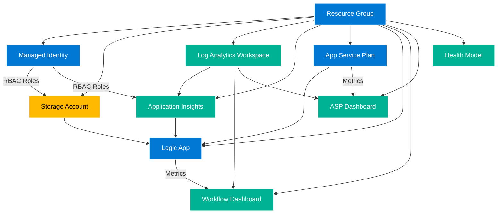
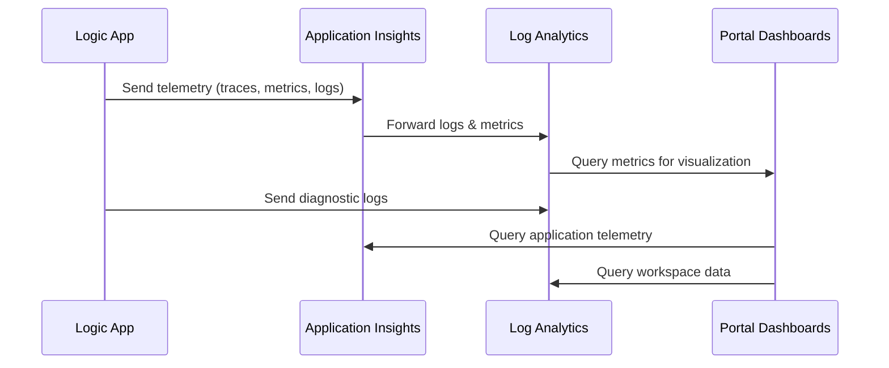

Evilazaro: @workspace
Generate a fully formatted **Markdown README.md** file for the open-source project **Azure-LogicApps-Monitoring**.

### Context:
This project demonstrates Monitoring and Observability capabilities of **Azure Monitor** for **Azure Logic Apps and Workflows**. Target audience: developers and cloud architects learning best practices for monitoring Logic Apps using Azure Monitor.

### Sources:
- Analyze project files from @workspace as the primary reference
- Supplement with official Microsoft documentation and GitHub README best practices

### Requirements:
Follow GitHub best practices for open-source README files. Use a **professional yet beginner-friendly tone** (avoid jargon, explain acronyms on first use like "RBAC (Role-Based Access Control)"). Ensure proper Markdown formatting for headings, tables, links, and code blocks.

**Code Block Formatting Rules:**
- Always close code blocks with triple backticks (```).
- Add a blank line before and after each code block.
- Group related commands within a single code block when they form a logical sequence.
- Use separate code blocks for different steps or contexts.

Include the following sections **in this exact order**:

1. **Project Overview**: 2-3 sentences describing the project's purpose and scope.

2. **Badges**: Add realistic placeholders using https://shields.io for:
   - Build Status
   - License (MIT)
   - Contributions
   Example: `https://img.shields.io/badge/build-passing-brightgreen`

3. **Features Section**:
   - Organize by **Feature Groups**:
     - Comprehensive Monitoring
     - Metrics & Telemetry
     - Security & Compliance
     - Infrastructure as Code
   - For each Feature Group:
     - Add the **Feature Group Name** as a subheading (###)
     - Include a **Feature Group Description** (1-2 sentences explaining its importance)
     - Use a Markdown table with columns: `Feature | Description`

4. **Prerequisites**: List required tools and services (e.g., Azure CLI, azd, Azure subscription requirements).

5. **Installation & Setup**: Provide step-by-step deployment using **Azure Developer CLI (azd)** commands. Include authentication if needed.
   - Present each step with a heading (e.g., "### Step 1: Clone the Repository")
   - Use separate code blocks for each step
   - **Always properly close each code block with triple backticks**
   - Add blank lines between prose and code blocks

6. **Usage Examples**: Show how to:
   - Deploy the Logic App
   - View logs in Log Analytics
   - Access dashboards
   - Query metrics
   - **Ensure all code blocks are properly closed**

7. **Architecture**:
   - Add **Mermaid diagrams** with **standard colors applied**:
     - **System Architecture**: Flowchart showing all solution components and their relationships
       - Use `classDef` in Mermaid to define standard colors for nodes:
         - Components: `fill:#0078D4,stroke:#ffffff,color:#ffffff`
         - Services: `fill:#00B294,stroke:#ffffff,color:#ffffff`
         - Data Stores: `fill:#FFB900,stroke:#ffffff,color:#000000`
     - **Data Flow**: SequenceDiagram showing telemetry flow: Logic App → Application Insights → Log Analytics → Dashboard
       - Apply consistent color styling for participants using Mermaid's `class` and `classDef`.
   - Include **Key Components Table**: Columns = `Component | Description | Purpose | Key Features`
   - Include **Deployed RBAC Roles Table**: Columns = `Role Name | Role Description | Documentation Link`

8. **File Structure**:
   - Show project folder hierarchy in a code block
   - Add **Key Files Explained** section:
     - Use a Markdown table with columns: `File | Name | Path | Description`

9. **Additional Resources**: Links to Azure Logic Apps, Azure Monitor, Bicep documentation

10. **Support**: How to get help (GitHub issues, discussions)

### Output:
- Use beginner-friendly language, professional tone, and GitHub open-source best practices.

Workspace: Collecting workspace information# Azure Logic Apps Monitoring

A comprehensive Infrastructure as Code (IaC) solution demonstrating best practices for monitoring and observability of Azure Logic Apps using Azure Monitor. This project provides a complete reference implementation for developers and cloud architects learning to implement production-ready monitoring for Azure Logic Apps and Workflows.

## Badges


## Features

### Comprehensive Monitoring

Complete observability solution with integrated monitoring across all infrastructure layers, providing real-time insights into application health and performance.

| Feature | Description |
|---------|-------------|
| **Application Insights Integration** | Full telemetry collection for Logic Apps workflows with automatic instrumentation |
| **Log Analytics Workspace** | Centralized log aggregation with 30-day retention and KQL (Kusto Query Language) querying capabilities |
| **Azure Monitor Health Model** | Service group hierarchy for organized resource health tracking at tenant level |
| **Diagnostic Settings** | Automated log and metric collection configured for all Azure resources |

### Metrics & Telemetry

Production-ready dashboards and metrics collection for comprehensive workflow monitoring and performance analysis.

| Feature | Description |
|---------|-------------|
| **Workflow Metrics Dashboards** | Pre-configured Azure Portal dashboards with 9 workflow-specific metric charts |
| **App Service Plan Dashboards** | Dedicated dashboards for compute resource monitoring with 6 platform metric visualizations |
| **Workflow Runtime Telemetry** | Tracks actions, triggers, runs, failures, and execution duration with automatic capture |
| **Platform Metrics** | CPU, memory, network I/O, and HTTP queue length monitoring for App Service Plans |

### Security & Compliance

Enterprise-grade security implementation using managed identities and RBAC (Role-Based Access Control) with least-privilege access principles.

| Feature | Description |
|---------|-------------|
| **User-Assigned Managed Identity** | Eliminates credential management with Azure AD (Azure Active Directory) integrated authentication |
| **Granular RBAC Roles** | 11 role assignments across Storage Account and Application Insights following least-privilege model |
| **Secure Storage Access** | Comprehensive permissions for blob, file, queue, and table storage using managed identity |
| **Metrics Publisher Role** | Dedicated role assignment for Application Insights telemetry publishing |

### Infrastructure as Code

Complete Bicep-based deployment with modular architecture, parameterization, and production-ready resource naming conventions.

| Feature | Description |
|---------|-------------|
| **Modular Bicep Templates** | Organized folder structure with separation of concerns across monitoring, shared, and data modules |
| **Azure Developer CLI Support** | Single-command deployment using `azd up` with environment variable support |
| **Resource Tagging** | Standardized tags for cost tracking, ownership, and lifecycle management |
| **Unique Resource Naming** | Deterministic resource names using `uniqueString()` to prevent naming conflicts |

## Prerequisites

Before deploying this solution, ensure you have:

- **Azure Subscription**: An active Azure subscription with appropriate permissions to create resources
- **Azure CLI**: Version 2.50.0 or later ([Install Azure CLI](https://docs.microsoft.com/cli/azure/install-azure-cli))
- **Azure Developer CLI (azd)**: Version 1.0.0 or later ([Install azd](https://learn.microsoft.com/azure/developer/azure-developer-cli/install-azd))
- **Git**: For cloning the repository
- **Permissions**: Contributor or Owner role at subscription level for resource deployment

## Installation & Setup

### Step 1: Clone the Repository

```bash
git clone https://github.com/your-org/Azure-LogicApps-Monitoring.git
cd Azure-LogicApps-Monitoring
```

### Step 2: Authenticate with Azure

```bash
azd auth login
```

### Step 3: Initialize Azure Developer CLI Environment

```bash
azd init
```

When prompted, provide:
- **Environment name**: A unique name for your deployment (e.g., `dev`, `prod`)
- **Azure subscription**: Select your target subscription
- **Azure location**: Choose your preferred region (e.g., `eastus2`)

### Step 4: Deploy the Solution

```bash
azd up
```

This command will:
- Provision all Azure resources (Resource Group, Storage Account, Log Analytics, Application Insights, Logic App)
- Configure RBAC role assignments
- Set up diagnostic settings
- Deploy monitoring dashboards

The deployment typically takes 5-7 minutes to complete.

## Usage Examples

### Deploy the Logic App Workflow

After infrastructure deployment, you can deploy custom workflows to the Logic App:

```bash
# Navigate to your Logic App in Azure Portal
# Logic App name format: {solutionName}-{uniqueString}-logicapp

# Use the Logic App Designer to create or import workflows
# Workflows will automatically send telemetry to Application Insights
```

### View Logs in Log Analytics

```bash
# Get Log Analytics Workspace ID from deployment output
az monitor log-analytics workspace show \
  --resource-group contoso-tax-docs-rg \
  --workspace-name tax-docs-{uniqueString}-law \
  --query customerId -o tsv

# Query workflow execution logs using Azure CLI
az monitor log-analytics query \
  --workspace <WORKSPACE_ID> \
  --analytics-query "AzureDiagnostics | where ResourceProvider == 'MICROSOFT.WEB' and Category == 'WorkflowRuntime' | take 100"
```

### Access Monitoring Dashboards

The solution deploys two pre-configured dashboards:

**Workflow Metrics Dashboard**:

```bash
# Navigate to Azure Portal → Dashboards → {solutionName}-dashboard
# View real-time metrics for:
# - Workflow Actions Failure Rate
# - Workflow Runs Completed/Dispatched/Started
# - Workflow Triggers Completed/Failure Rate
# - Job Execution Duration
```

**App Service Plan Dashboard**:

```bash
# Navigate to Azure Portal → Dashboards → {appServicePlan}-dashboard
# Monitor compute resources:
# - CPU Percentage
# - Memory Percentage
# - Data In/Out
# - HTTP Queue Length
```

### Query Application Insights Metrics

```bash
# View Application Insights connection string
az monitor app-insights component show \
  --app tax-docs-{uniqueString}-appinsights \
  --resource-group contoso-tax-docs-rg \
  --query connectionString -o tsv

# Query custom metrics in Azure Portal
# Navigate to Application Insights → Logs
# Sample KQL query:
```

```kql
requests
| where timestamp > ago(24h)
| where cloud_RoleName contains "logicapp"
| summarize count() by bin(timestamp, 1h), name
| render timechart
```

## Architecture

### System Architecture

The following diagram illustrates the complete solution architecture with all components and their relationships:


```mermaid
flowchart TD
    classDef component fill:#0078D4,stroke:#ffffff,color:#ffffff
    classDef service fill:#00B294,stroke:#ffffff,color:#ffffff
    classDef dataStore fill:#FFB900,stroke:#ffffff,color:#000000

    RG[Resource Group]:::component
    MI[Managed Identity]:::component
    SA[Storage Account]:::dataStore
    LAW[Log Analytics Workspace]:::service
    AI[Application Insights]:::service
    ASP[App Service Plan]:::component
    LA[Logic App]:::component
    DASH1[Workflow Dashboard]:::service
    DASH2[ASP Dashboard]:::service
    HM[Health Model]:::service

    RG --> MI
    RG --> SA
    RG --> LAW
    RG --> AI
    RG --> ASP
    RG --> LA
    RG --> DASH1
    RG --> DASH2
    RG --> HM

    MI -->|RBAC Roles| SA
    MI -->|RBAC Roles| AI
    LAW --> AI
    AI --> LA
    ASP --> LA
    SA --> LA
    LAW --> DASH1
    LAW --> DASH2
    LA -->|Metrics| DASH1
    ASP -->|Metrics| DASH2
```

### Data Flow

The following sequence diagram shows how telemetry flows from Logic Apps to monitoring dashboards:


```mermaid
sequenceDiagram
    participant LA as Logic App
    participant AI as Application Insights
    participant LAW as Log Analytics
    participant DASH as Portal Dashboards

    LA->>AI: Send telemetry (traces, metrics, logs)
    AI->>LAW: Forward logs & metrics
    LAW->>DASH: Query metrics for visualization
    LA->>LAW: Send diagnostic logs
    DASH->>AI: Query application telemetry
    DASH->>LAW: Query workspace data
```

### Key Components

| Component | Description | Purpose | Key Features |
|-----------|-------------|---------|--------------|
| **Resource Group** | Logical container for all solution resources | Organizes resources for lifecycle management | Tagged for cost tracking, owner identification |
| **User-Assigned Managed Identity** | Azure AD identity for secure authentication | Eliminates credential management in code | Assigned 11 RBAC roles across services |
| **Storage Account** | General-purpose v2 storage with LRS replication | Stores Logic App workflow state and artifacts | Hot tier, HTTPS-only, supports blob/file/queue/table |
| **Log Analytics Workspace** | Centralized log repository with KQL querying | Aggregates logs from all resources | 30-day retention, system-assigned identity |
| **Application Insights** | APM (Application Performance Management) service | Collects workflow telemetry and performance data | Integrated with Log Analytics workspace |
| **App Service Plan** | Compute infrastructure for Logic Apps | Provides workflow execution environment | Workflow Standard tier (WS1), elastic scaling enabled |
| **Logic App** | Serverless workflow orchestration engine | Executes business process workflows | System-assigned identity, diagnostic logging enabled |
| **Azure Dashboards** | Pre-configured monitoring visualizations | Provides real-time metrics visibility | 15 metric charts across 2 dashboards |
| **Health Model** | Azure Monitor service group hierarchy | Organizes resources for health monitoring | Tenant-scoped service group structure |

### Deployed RBAC Roles

| Role Name | Role Description | Documentation Link |
|-----------|------------------|-------------------|
| **Storage Account Contributor** | Full management of storage account resources | [Role Documentation](https://learn.microsoft.com/azure/role-based-access-control/built-in-roles#storage-account-contributor) |
| **Storage Blob Data Owner** | Full access to blob containers and data including ACL assignment | [Role Documentation](https://learn.microsoft.com/azure/role-based-access-control/built-in-roles#storage-blob-data-owner) |
| **Storage Queue Data Contributor** | Read, write, and delete Azure Storage queues and messages | [Role Documentation](https://learn.microsoft.com/azure/role-based-access-control/built-in-roles#storage-queue-data-contributor) |
| **Storage Table Data Contributor** | Read, write, and delete access to Azure Storage tables and entities | [Role Documentation](https://learn.microsoft.com/azure/role-based-access-control/built-in-roles#storage-table-data-contributor) |
| **Storage File Data Privileged Contributor** | Full access to Azure File shares including ACL modifications | [Role Documentation](https://learn.microsoft.com/azure/role-based-access-control/built-in-roles#storage-file-data-privileged-contributor) |
| **Storage File Data SMB MI Admin** | Allows setting NTFS permissions on files/directories with managed identity | [Role Documentation](https://learn.microsoft.com/azure/role-based-access-control/built-in-roles#storage-file-data-smb-mi-admin) |
| **Storage File Data SMB Share Contributor** | Read, write, and delete access on file share data via SMB protocol | [Role Documentation](https://learn.microsoft.com/azure/role-based-access-control/built-in-roles#storage-file-data-smb-share-contributor) |
| **Storage File Data SMB Share Elevated Contributor** | Read, write, delete, and modify ACLs on files/directories via SMB | [Role Documentation](https://learn.microsoft.com/azure/role-based-access-control/built-in-roles#storage-file-data-smb-share-elevated-contributor) |
| **Monitoring Metrics Publisher** | Enables publishing metrics to Azure Monitor for custom telemetry | [Role Documentation](https://learn.microsoft.com/azure/role-based-access-control/built-in-roles#monitoring-metrics-publisher) |

## File Structure

```
Azure-LogicApps-Monitoring/
├── .azure/                           # Azure Developer CLI configuration
│   ├── .gitignore
│   ├── config.json
│   └── dev/
│       ├── .env
│       └── config.json
├── infra/                            # Infrastructure as Code (Bicep)
│   ├── main.bicep                    # Main subscription-scoped template
│   └── main.parameters.json          # Deployment parameters
├── src/                              # Source modules
│   ├── logic-app.bicep               # Logic App and App Service Plan
│   ├── monitoring/                   # Monitoring components
│   │   ├── main.bicep
│   │   ├── app-insights.bicep        # Application Insights configuration
│   │   ├── azure-monitor-health-model.bicep
│   │   └── log-analytics-workspace.bicep
│   └── shared/                       # Shared infrastructure
│       ├── main.bicep
│       └── data/
│           └── main.bicep            # Storage Account configuration
├── .gitignore
├── azure.yaml                        # Azure Developer CLI project definition
├── CODE_OF_CONDUCT.md
├── CONTRIBUTING.md
├── LICENSE.md
├── README.md
└── SECURITY.md
```

### Key Files Explained

| File | Name | Path | Description |
|------|------|------|-------------|
| **Main Infrastructure Template** | main.bicep | main.bicep | Subscription-scoped orchestration template that deploys resource group, shared resources, and workload modules |
| **Deployment Parameters** | main.parameters.json | main.parameters.json | Parameter file for main template with location configuration using environment variables |
| **Logic App Module** | logic-app.bicep | logic-app.bicep | Deploys App Service Plan (WS1 tier), Logic App with diagnostic settings, and two monitoring dashboards |
| **Monitoring Orchestration** | main.bicep | main.bicep | Orchestrates deployment of health model, Log Analytics workspace, and Application Insights |
| **Application Insights** | app-insights.bicep | app-insights.bicep | Configures Application Insights with workspace integration, RBAC roles, and diagnostic settings |
| **Log Analytics** | log-analytics-workspace.bicep | log-analytics-workspace.bicep | Provisions Log Analytics workspace with PerGB2018 pricing tier and 30-day retention |
| **Health Model** | azure-monitor-health-model.bicep | azure-monitor-health-model.bicep | Creates tenant-scoped service group hierarchy for resource health organization |
| **Shared Resources** | main.bicep | main.bicep | Deploys managed identity, data module (storage), and monitoring module with output aggregation |
| **Storage Module** | main.bicep | main.bicep | Creates storage account with Standard_LRS SKU and assigns 9 RBAC roles to managed identity |
| **Project Definition** | azure.yaml | azure.yaml | Azure Developer CLI project manifest defining solution name |

## Additional Resources

- **[Azure Logic Apps Documentation](https://learn.microsoft.com/azure/logic-apps/)** - Official documentation for Azure Logic Apps, including triggers, actions, and workflow design
- **[Azure Monitor Overview](https://learn.microsoft.com/azure/azure-monitor/overview)** - Complete guide to Azure Monitor capabilities, metrics, and logging
- **[Application Insights for Logic Apps](https://learn.microsoft.com/azure/logic-apps/monitor-workflows-collect-diagnostic-data)** - Best practices for monitoring Logic Apps with Application Insights
- **[Bicep Language Documentation](https://learn.microsoft.com/azure/azure-resource-manager/bicep/)** - Infrastructure as Code reference for Bicep templates and modules
- **[Azure Developer CLI Reference](https://learn.microsoft.com/azure/developer/azure-developer-cli/reference)** - Command reference for azd CLI tool
- **[Log Analytics Query Language (KQL)](https://learn.microsoft.com/azure/data-explorer/kusto/query/)** - Query language documentation for analyzing logs

## Support

### Getting Help

If you encounter issues or have questions about this project:

- **GitHub Issues**: Report bugs or request features via [GitHub Issues](https://github.com/your-org/Azure-LogicApps-Monitoring/issues)
- **GitHub Discussions**: Ask questions and engage with the community in [GitHub Discussions](https://github.com/your-org/Azure-LogicApps-Monitoring/discussions)
- **Azure Support**: For Azure-specific issues, consult the [Azure Support Center](https://azure.microsoft.com/support/)

### Contributing

We welcome contributions! Please see our CONTRIBUTING.md guide for:
- Code contribution guidelines
- Pull request process
- Coding standards and best practices
- How to report security vulnerabilities (see SECURITY.md)

### Code of Conduct

This project adheres to the [Microsoft Open Source Code of Conduct](https://opensource.microsoft.com/codeofconduct/). Please review CODE_OF_CONDUCT.md for community guidelines.

---

**License**: This project is licensed under the MIT License - see the LICENSE.md file for details.