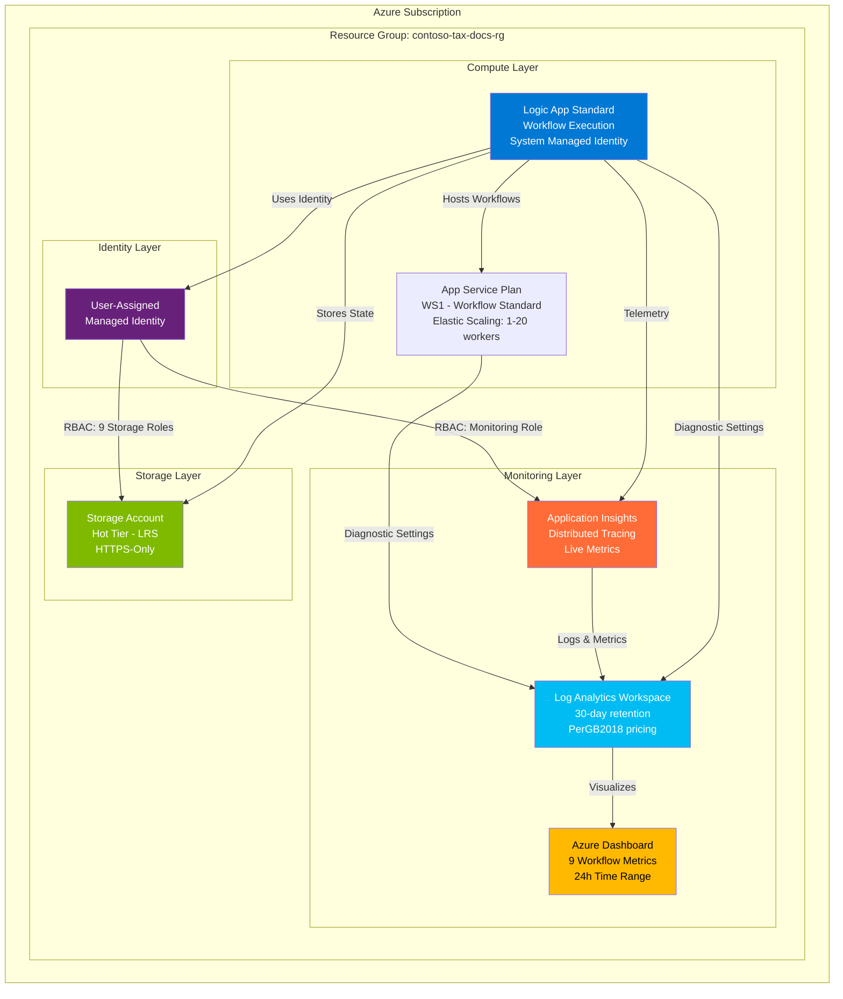

# Azure Logic Apps Monitoring

[](LICENSE.md)
[](https://azure.microsoft.com/services/logic-apps/)
[](https://azure.microsoft.com/services/monitor/)
[](https://learn.microsoft.com/azure/azure-resource-manager/bicep/)
[](CODE_OF_CONDUCT.md)

> A comprehensive reference implementation demonstrating enterprise-grade monitoring and observability for Azure Logic Apps (Standard) using Azure Monitor, Application Insights, and Log Analytics.

## 📋 Table of Contents

- [Overview](#overview)
- [Features](#features)
- [Architecture](#architecture)
- [File Structure](#file-structure)
- [Prerequisites](#prerequisites)
- [Installation & Setup](#installation--setup)
- [Usage Examples](#usage-examples)
- [Monitoring Capabilities](#monitoring-capabilities)
- [Best Practices](#best-practices)
- [Troubleshooting](#troubleshooting)
- [Contributing](#contributing)
- [Security](#security)
- [License](#license)

## Overview

**Azure Logic Apps Monitoring** is an open-source infrastructure-as-code (IaC) solution that demonstrates how to implement comprehensive monitoring and observability for Azure Logic Apps (Standard). This project provides a production-ready template following Azure Well-Architected Framework principles and Azure Monitor best practices.

### Why This Project?

- ✅ **Complete Observability**: Pre-configured monitoring stack with Application Insights, Log Analytics, and custom dashboards
- ✅ **Production-Ready**: Enterprise-grade monitoring with diagnostic settings, distributed tracing, and RBAC
- ✅ **Infrastructure as Code**: Fully automated deployment using Azure Bicep with modular architecture
- ✅ **Security First**: Managed identities, least-privilege RBAC, and secure-by-default configurations
- ✅ **Best Practices**: Implements Azure Monitor best practices and Logic Apps monitoring patterns

### Use Cases

- 📊 Enterprise workflow monitoring and alerting
- 🔄 Event-driven business process automation with observability
- 🔍 Integration patterns requiring end-to-end tracing
- 📚 Learning Azure Monitor capabilities for Logic Apps
- 🏗️ Reference architecture for production deployments
- 👨‍💻 DevOps teams establishing monitoring baselines

## Features

### 🔍 Comprehensive Monitoring

- **Application Insights Integration**: Distributed tracing, dependency tracking, and live metrics streaming
- **Log Analytics Workspace**: Centralized logging with 30-day retention and KQL query support
- **Custom Dashboards**: Pre-built Azure Portal dashboard with 9 workflow metric tiles
- **Diagnostic Settings**: Automated log and metric collection from all resources
- **Immediate Purge**: Cost-optimized data retention with immediate purge capability

### 📊 Metrics & Telemetry

Monitor critical workflow metrics in real-time:
- **Workflow run completion and failure rates** - Track execution success patterns
- **Action-level success and failure tracking** - Pinpoint bottlenecks in workflows
- **Execution duration and performance metrics** - Identify slow-running operations
- **Trigger execution and failure rates** - Monitor trigger reliability
- **Queue depth and dispatched workflow monitoring** - Prevent backlog buildup

### 🔐 Security & Compliance

- **Managed Identities**: System-assigned and user-assigned identities for passwordless authentication
- **RBAC Integration**: Least-privilege role assignments on storage, monitoring, and compute resources (10 roles)
- **Secure Storage**: HTTPS-only storage accounts with TLS 1.2+ enforcement
- **Audit Logging**: Complete audit trail via Azure Monitor diagnostic settings
- **Zero Secrets**: Connection string authentication using managed identities

### 🏗️ Infrastructure as Code

- **Modular Bicep Architecture**: Reusable templates organized by concern (shared, monitoring, workload)
- **Parameter-Driven**: Configurable deployment with environment-specific parameters
- **Azure Developer CLI Support**: Simplified deployment with `azd` commands
- **Idempotent Deployments**: Safe to re-run with incremental updates
- **Resource Naming**: Collision-resistant naming using `uniqueString()`

## Architecture

### Solution Architecture


```mermaid
graph TB
    subgraph "Azure Subscription"
        subgraph "Resource Group: contoso-tax-docs-rg"
            subgraph "Compute Layer"
                ASP[App Service Plan<br/>WS1 - Workflow Standard<br/>Elastic Scaling: 1-20 workers]
                LA[Logic App Standard<br/>Workflow Execution<br/>System Managed Identity]
            end
            
            subgraph "Storage Layer"
                SA[Storage Account<br/>Hot Tier - LRS<br/>HTTPS-Only]
            end
            
            subgraph "Monitoring Layer"
                LAW[Log Analytics Workspace<br/>30-day retention<br/>PerGB2018 pricing]
                AI[Application Insights<br/>Distributed Tracing<br/>Live Metrics]
                DASH[Azure Dashboard<br/>9 Workflow Metrics<br/>24h Time Range]
            end
            
            subgraph "Identity Layer"
                UMI[User-Assigned<br/>Managed Identity]
            end
        end
    end
    
    LA -->|Hosts Workflows| ASP
    LA -->|Stores State| SA
    LA -->|Diagnostic Settings| LAW
    LA -->|Telemetry| AI
    AI -->|Logs & Metrics| LAW
    ASP -->|Diagnostic Settings| LAW
    LAW -->|Visualizes| DASH
    UMI -->|RBAC: 9 Storage Roles| SA
    UMI -->|RBAC: Monitoring Role| AI
    LA -->|Uses Identity| UMI
    
    style LA fill:#0078D4,color:#fff
    style AI fill:#FF6C37,color:#fff
    style LAW fill:#00BCF2,color:#fff
    style SA fill:#7FBA00,color:#fff
    style DASH fill:#FFB900,color:#000
    style UMI fill:#68217A,color:#fff
```

### Key Components

| Component | Purpose | Key Features |
|-----------|---------|--------------|
| **Logic App (Standard)** | Workflow execution engine | System-assigned identity, Application Insights integration, WorkflowRuntime logging |
| **App Service Plan (WS1)** | Compute hosting | Elastic scaling (1-20 workers), zone-redundant capable, AllMetrics diagnostics |
| **Storage Account** | Workflow state persistence | Hot tier, HTTPS-only, managed identity access, 9 RBAC roles |
| **Log Analytics Workspace** | Centralized log aggregation | 30-day retention, KQL query support, PerGB2018 pricing |
| **Application Insights** | APM and distributed tracing | Connection string auth, live metrics, dependency tracking |
| **Azure Dashboard** | Metrics visualization | 9 pre-configured tiles, 24h default range, shared time filtering |
| **User-Assigned Managed Identity** | Security principal | RBAC roles on storage and monitoring, passwordless auth |

### Data Flow

1. **Execution**: Logic App workflows execute on the App Service Plan
2. **Persistence**: Workflow state persists to Storage Account via managed identity (no connection strings)
3. **Logging**: Diagnostic settings stream logs and metrics to Log Analytics Workspace
4. **Tracing**: Application Insights captures telemetry and distributed traces with correlation IDs
5. **Visualization**: Azure Dashboard renders real-time metrics from Logic App and App Service Plan
6. **Governance**: All resources tagged for cost tracking and compliance

### Deployed RBAC Roles

**Storage Account** (9 roles assigned to user-managed identity):
- Storage Account Contributor
- Storage Blob Data Owner
- Storage Queue Data Contributor
- Storage Table Data Contributor
- Storage File Data Privileged Contributor
- Storage File Data SMB MI Admin
- Storage File Data SMB Share Contributor
- Storage File Data SMB Share Elevated Contributor
- Monitoring Metrics Publisher

**Application Insights** (1 role):
- Monitoring Metrics Publisher

## File Structure

```
Azure-LogicApps-Monitoring/
├── .gitignore                          # Git ignore patterns
├── azure.yaml                          # Azure Developer CLI configuration
├── CODE_OF_CONDUCT.md                  # Community guidelines
├── CONTRIBUTING.md                     # Contribution instructions
├── LICENSE.md                          # MIT License
├── README.md                           # This file
├── SECURITY.md                         # Security policy
├── infra/                              # Infrastructure as Code
│   ├── main.bicep                      # Subscription-level orchestrator
│   └── main.parameters.json            # Deployment parameters
└── src/                                # Bicep modules
    ├── logic-app.bicep                 # Logic App + App Service Plan + Dashboard
    ├── monitoring/                     # Monitoring infrastructure
    │   ├── main.bicep                  # Monitoring orchestrator
    │   ├── app-insights.bicep          # Application Insights + RBAC + diagnostics
    │   └── log-analytics-workspace.bicep # Log Analytics Workspace
    └── shared/                         # Shared infrastructure
        ├── main.bicep                  # Shared orchestrator (identity + data + monitoring)
        └── data/                       # Data infrastructure
            └── main.bicep              # Storage Account + 9 RBAC roles
```

### Module Descriptions

| Module | Scope | Resources Deployed | Purpose |
|--------|-------|-------------------|---------|
| [`infra/main.bicep`](infra/main.bicep) | Subscription | Resource Group | Top-level orchestrator creating resource group and invoking child modules |
| [`src/shared/main.bicep`](src/shared/main.bicep) | Resource Group | User-Assigned Managed Identity | Provisions identity, invokes data and monitoring modules |
| [`src/shared/data/main.bicep`](src/shared/data/main.bicep) | Resource Group | Storage Account + 9 Role Assignments | State persistence with comprehensive RBAC |
| [`src/monitoring/main.bicep`](src/monitoring/main.bicep) | Resource Group | N/A | Orchestrator for monitoring resources |
| [`src/monitoring/log-analytics-workspace.bicep`](src/monitoring/log-analytics-workspace.bicep) | Resource Group | Log Analytics Workspace | Centralized logging with 30-day retention |
| [`src/monitoring/app-insights.bicep`](src/monitoring/app-insights.bicep) | Resource Group | Application Insights + Role Assignment + Diagnostic Settings | APM, tracing, and metrics publishing |
| [`src/logic-app.bicep`](src/logic-app.bicep) | Resource Group | App Service Plan + Logic App + 2 Diagnostic Settings + Dashboard | Workflow execution environment and visualization |

## Prerequisites

### Required Tools

- **Azure CLI** (`2.50.0` or later): [Installation Guide](https://learn.microsoft.com/cli/azure/install-azure-cli)
- **Azure Developer CLI (azd)** (`1.5.0` or later): [Installation Guide](https://learn.microsoft.com/azure/developer/azure-developer-cli/install-azd)
- **Active Azure Subscription**: [Create a free account](https://azure.microsoft.com/free/)
- **Azure Permissions**: `Contributor` or `Owner` role on target subscription (required for RBAC assignments)

### Optional (Recommended)

- **Visual Studio Code**: [Download](https://code.visualstudio.com/)
- **Azure Logic Apps Extension**: [Marketplace](https://marketplace.visualstudio.com/items?itemName=ms-azuretools.vscode-logicapps)
- **Bicep Extension**: [Marketplace](https://marketplace.visualstudio.com/items?itemName=ms-azuretools.vscode-bicep)

### Verify Installation

```bash
# Check Azure CLI version
az --version

# Check Azure Developer CLI version
azd version

# Verify Azure subscription access
az account show

# Verify you have Contributor/Owner permissions
az role assignment list \
  --assignee $(az account show --query user.name -o tsv) \
  --scope /subscriptions/$(az account show --query id -o tsv) \
  --query "[?roleDefinitionName=='Owner' || roleDefinitionName=='Contributor']" \
  -o table
```

## Installation & Setup

### Step 1: Clone the Repository

```bash
git clone https://github.com/your-org/Azure-LogicApps-Monitoring.git
cd Azure-LogicApps-Monitoring
```

### Step 2: Authenticate with Azure

```bash
# Azure CLI authentication
az login

# Azure Developer CLI authentication
azd auth login
```

### Step 3: Set Target Subscription

If you have multiple subscriptions:

```bash
# List available subscriptions
az account list --output table

# Set active subscription
az account set --subscription "<Your-Subscription-ID-or-Name>"

# Verify selection
az account show --query "{Name:name, ID:id, State:state}" --output table
```

### Step 4: Configure Deployment Parameters

Review and customize [`infra/main.parameters.json`](infra/main.parameters.json):

```json
{
  "$schema": "https://schema.management.azure.com/schemas/2015-01-01/deploymentParameters.json#",
  "contentVersion": "1.0.0.0",
  "parameters": {
    "location": {
      "value": "eastus"
    }
  }
}
```

**Supported Regions**: `eastus`, `westus2`, `westeurope`, `southeastasia`, `australiaeast`, `centralus`

> **Note**: If using Azure Developer CLI, you can use the `${AZURE_LOCATION}` variable or set the `AZURE_LOCATION` environment variable.

### Step 5: Customize Resource Tags (Optional)

Edit [`infra/main.bicep`](infra/main.bicep) to update tags for governance and cost tracking:

```bicep
var tags = {
  Solution: 'tax-docs'
  Environment: 'Production'          // Change to 'Development', 'Staging', etc.
  ManagedBy: 'Bicep'
  CostCenter: 'Engineering'          // Update with your cost center
  Owner: 'Platform-Team'             // Update with your team name
  ApplicationName: 'Tax-Docs-Processing'
  BusinessUnit: 'Tax'
}
```

### Step 6: Deploy the Infrastructure

**Option A: Using Azure Developer CLI (Recommended)**

```bash
# Initialize the azd environment (one-time setup)
azd init

# Provision all Azure resources
azd provision
```

**Option B: Using Azure CLI (Subscription Scope)**

```bash
# Deploy at subscription scope (creates resource group and all resources)
az deployment sub create \
  --location eastus \
  --template-file infra/main.bicep \
  --parameters @infra/main.parameters.json
```

**Option C: Deploy to Existing Resource Group**

```bash
# Create resource group
az group create \
  --name contoso-tax-docs-rg \
  --location eastus \
  --tags Solution=tax-docs Environment=Production

# Deploy shared infrastructure
az deployment group create \
  --resource-group contoso-tax-docs-rg \
  --template-file src/shared/main.bicep \
  --parameters name=tax-docs

# Deploy workload (Logic App + Dashboard)
az deployment group create \
  --resource-group contoso-tax-docs-rg \
  --template-file src/logic-app.bicep \
  --parameters name=tax-docs \
    workspaceId="<log-analytics-workspace-id>" \
    storageAccountName="<storage-account-name>" \
    appInsightsInstrumentationKey="<instrumentation-key>" \
    appInsightsConnectionString="<connection-string>"
```

### Step 7: Verify Deployment

```bash
# List deployed resources
az resource list \
  --resource-group contoso-tax-docs-rg \
  --output table

# Get Logic App details
az logicapp show \
  --resource-group contoso-tax-docs-rg \
  --name $(az resource list \
    --resource-group contoso-tax-docs-rg \
    --resource-type "Microsoft.Web/sites" \
    --query "[?kind=='functionapp,workflowapp'].name" -o tsv)

# Verify diagnostic settings are enabled
az monitor diagnostic-settings list \
  --resource $(az logicapp show \
    --resource-group contoso-tax-docs-rg \
    --name $(az resource list \
      --resource-group contoso-tax-docs-rg \
      --resource-type "Microsoft.Web/sites" \
      --query "[?kind=='functionapp,workflowapp'].name" -o tsv) \
    --query id -o tsv) \
  --output table
```

**Expected Deployment Time**: 5-7 minutes

**Expected Resources**:
- 1 Resource Group
- 1 User-Assigned Managed Identity
- 1 Storage Account (with 9 role assignments)
- 1 Log Analytics Workspace
- 1 Application Insights (with 1 role assignment + diagnostic settings)
- 1 App Service Plan (with diagnostic settings)
- 1 Logic App (Standard) (with diagnostic settings)
- 1 Azure Dashboard

## Usage Examples

### Viewing Metrics in Azure Portal

1. Navigate to: [Azure Portal](https://portal.azure.com) → Resource Groups → `contoso-tax-docs-rg`
2. Select the Logic App resource (name pattern: `tax-docs-*-logicapp`)
3. View **Overview**, **Workflow runs**, and **Metrics** tabs

### Accessing the Pre-Built Dashboard

The deployment creates a custom Azure Dashboard with 9 workflow metric tiles.

**Steps**:
1. Navigate to: [Azure Portal](https://portal.azure.com) → Resource Groups → `contoso-tax-docs-rg`
2. Filter resources by type: **Dashboard**
3. Open: `tax-docs-dashboard`

**Dashboard Tiles** (24-hour time range, shared time filtering enabled):

| Row | Metric | Aggregation | Chart Type |
|-----|--------|-------------|------------|
| 1, Col 1-2 | Workflow Actions Failure Rate | Sum | Line Chart |
| 1, Col 3 | Workflow Job Execution Duration | Average | Line Chart |
| 2, Col 1 | Workflow Runs Completed | Sum | Line Chart |
| 2, Col 2 | Workflow Runs Dispatched | Sum | Line Chart |
| 2, Col 3 | Workflow Runs Failure Rate | Sum | Line Chart |
| 3, Col 1 | Workflow Runs Started | Sum | Line Chart |
| 3, Col 2 | Workflow Triggers Completed | Sum | Line Chart |
| 3, Col 3 | Workflow Triggers Failure Rate | Sum | Line Chart |

> **Tip**: Use the shared time range filter (top toolbar) to adjust the time window for all tiles simultaneously.

### Querying Logs with KQL

Navigate to: Log Analytics Workspace → Logs blade

**Example 1: View Recent Workflow Runtime Logs**

```kusto
AzureDiagnostics
| where ResourceType == "MICROSOFT.WEB/SITES"
| where Category == "WorkflowRuntime"
| where TimeGenerated > ago(24h)
| project TimeGenerated, OperationName, ResultDescription, status_s, CorrelationId
| order by TimeGenerated desc
| take 100
```

**Example 2: Analyze Failed Workflow Runs**

```kusto
AzureDiagnostics
| where Category == "WorkflowRuntime"
| where status_s == "Failed"
| extend ErrorCode = tostring(parse_json(properties_s).error.code)
| extend ErrorMessage = tostring(parse_json(properties_s).error.message)
| summarize FailureCount = count() by workflowName_s, ErrorCode, bin(TimeGenerated, 1h)
| order by FailureCount desc
```

**Example 3: Top 10 Slowest Workflow Runs**

```kusto
AzureDiagnostics
| where Category == "WorkflowRuntime"
| where OperationName == "WorkflowRunCompleted"
| extend Duration = todouble(duration_d)
| top 10 by Duration desc
| project TimeGenerated, workflowName_s, Duration, status_s, CorrelationId
```

**Example 4: Workflow Execution Timeline**

```kusto
AzureDiagnostics
| where Category == "WorkflowRuntime"
| where TimeGenerated > ago(1h)
| project TimeGenerated, workflowName_s, OperationName, status_s
| render timechart
```

**Example 5: Trigger Success Rate by Workflow**

```kusto
AzureDiagnostics
| where Category == "WorkflowRuntime"
| where OperationName has "Trigger"
| summarize Total = count(), 
            Failures = countif(status_s == "Failed")
            by workflowName_s
| extend SuccessRate = round((Total - Failures) * 100.0 / Total, 2)
| order by SuccessRate asc
```

### Accessing Application Insights

**Get Connection String**:
```bash
az monitor app-insights component show \
  --resource-group contoso-tax-docs-rg \
  --app $(az resource list \
    --resource-group contoso-tax-docs-rg \
    --resource-type "Microsoft.Insights/components" \
    --query "[0].name" -o tsv) \
  --query "connectionString" -o tsv
```

**View Live Metrics Stream**:
1. Navigate to: Application Insights resource → Live Metrics
2. Run a workflow to see real-time telemetry (1-second granularity)

**Query Application Insights Logs**:
```kusto
traces
| where timestamp > ago(24h)
| where cloud_RoleName contains "tax-docs"
| order by timestamp desc
| take 100
```

**Query Dependencies** (external calls):
```kusto
dependencies
| where timestamp > ago(24h)
| where success == false
| project timestamp, name, target, duration, resultCode
| order by timestamp desc
```

### Creating Custom Alerts

**Example 1: Alert on High Workflow Failure Rate**

```bash
# Get Logic App resource ID
LOGIC_APP_ID=$(az logicapp show \
  --resource-group contoso-tax-docs-rg \
  --name $(az resource list \
    --resource-group contoso-tax-docs-rg \
    --resource-type "Microsoft.Web/sites" \
    --query "[?kind=='functionapp,workflowapp'].name" -o tsv) \
  --query id -o tsv)

# Create metric alert
az monitor metrics alert create \
  --name "High-Workflow-Failure-Rate" \
  --resource-group contoso-tax-docs-rg \
  --scopes "$LOGIC_APP_ID" \
  --condition "avg WorkflowRunsFailureRate > 10" \
  --window-size 5m \
  --evaluation-frequency 1m \
  --description "Alert when workflow failure rate exceeds 10% over 5 minutes" \
  --severity 2
```

**Example 2: Alert on Slow Execution**

```bash
az monitor metrics alert create \
  --name "Slow-Workflow-Execution" \
  --resource-group contoso-tax-docs-rg \
  --scopes "$LOGIC_APP_ID" \
  --condition "avg WorkflowJobExecutionDuration > 30000" \
  --window-size 5m \
  --evaluation-frequency 1m \
  --description "Alert when average execution duration exceeds 30 seconds" \
  --severity 3
```

**Example 3: Alert on Trigger Failures**

```bash
az monitor metrics alert create \
  --name "High-Trigger-Failure-Rate" \
  --resource-group contoso-tax-docs-rg \
  --scopes "$LOGIC_APP_ID" \
  --condition "avg WorkflowTriggersFailureRate > 5" \
  --window-size 10m \
  --evaluation-frequency 5m \
  --description "Alert when trigger failure rate exceeds 5% over 10 minutes" \
  --severity 2
```

### Exporting Logs for Compliance

```bash
# Get workspace and storage IDs
WORKSPACE_ID=$(az monitor log-analytics workspace show \
  --resource-group contoso-tax-docs-rg \
  --workspace-name $(az resource list \
    --resource-group contoso-tax-docs-rg \
    --resource-type "Microsoft.OperationalInsights/workspaces" \
    --query "[0].name" -o tsv) \
  --query id -o tsv)

STORAGE_ID=$(az storage account show \
  --name $(az resource list \
    --resource-group contoso-tax-docs-rg \
    --resource-type "Microsoft.Storage/storageAccounts" \
    --query "[0].name" -o tsv) \
  --query id -o tsv)

# Create data export rule
az monitor log-analytics workspace data-export create \
  --resource-group contoso-tax-docs-rg \
  --workspace-name $(az resource list \
    --resource-group contoso-tax-docs-rg \
    --resource-type "Microsoft.OperationalInsights/workspaces" \
    --query "[0].name" -o tsv) \
  --name "ExportToStorage" \
  --tables "AzureDiagnostics" \
  --destination "$STORAGE_ID"
```

## Monitoring Capabilities

### Available Metrics

| Metric | Description | Aggregation | Alert Threshold | Dashboard Tile |
|--------|-------------|-------------|-----------------|----------------|
| `WorkflowRunsCompleted` | Total completed workflow runs | Sum | N/A (info only) | Row 2, Col 1 |
| `WorkflowRunsFailureRate` | Percentage of failed runs | Average/Sum | > 5% | Row 2, Col 3 |
| `WorkflowActionsFailureRate` | Percentage of failed actions | Average/Sum | > 10% | Row 1, Col 1-2 |
| `WorkflowJobExecutionDuration` | Average execution time (milliseconds) | Average | > 30,000ms | Row 1, Col 3 |
| `WorkflowTriggersCompleted` | Total trigger executions | Sum | N/A (info only) | Row 3, Col 2 |
| `WorkflowRunsDispatched` | Queued workflow runs | Sum | > 1000 (backlog) | Row 2, Col 2 |
| `WorkflowTriggersFailureRate` | Percentage of failed triggers | Average/Sum | > 5% | Row 3, Col 3 |
| `WorkflowRunsStarted` | Total workflow starts | Sum | N/A (info only) | Row 3, Col 1 |

### Diagnostic Settings

All resources emit diagnostic data to Log Analytics:

**Logic App** ([`src/logic-app.bicep`](src/logic-app.bicep)):
- **Logs**: `WorkflowRuntime` (enabled)
- **Metrics**: `AllMetrics` (enabled)
- **Retention**: Workspace-level (30 days)
- **Destination**: Log Analytics Workspace

**App Service Plan** ([`src/logic-app.bicep`](src/logic-app.bicep)):
- **Metrics**: `AllMetrics` (enabled)
- **Retention**: Workspace-level (30 days)
- **Destination**: Log Analytics Workspace

**Application Insights** ([`src/monitoring/app-insights.bicep`](src/monitoring/app-insights.bicep)):
- **Logs**: `allLogs` category group (enabled)
- **Metrics**: `AllMetrics` (enabled)
- **Retention**: Workspace-level (30 days)
- **Destination**: Log Analytics Workspace

### Application Insights Features

- **Distributed Tracing**: End-to-end request correlation with `operation_Id`
- **Dependency Tracking**: External service calls (HTTP, SQL, Azure services)
- **Live Metrics Stream**: Real-time performance monitoring (1-second granularity)
- **Smart Detection**: Automatic anomaly detection for failures and performance degradation
- **Custom Events**: Workflow-specific telemetry and business metrics
- **Connection String Auth**: Secure telemetry ingestion without instrumentation keys
- **Performance Counters**: CPU, memory, and thread metrics from App Service Plan

### Log Analytics Workspace Configuration

**Pricing Tier**: PerGB2018 (pay-as-you-go)  
**Retention**: 30 days  
**Features**:
- Immediate purge on 30 days (cost optimization via [`immediatePurgeDataOn30Days: true`](src/monitoring/log-analytics-workspace.bicep))
- KQL query support with IntelliSense
- Cross-resource queries (query multiple workspaces and resources)
- Alerting and automation via Azure Monitor
- Export capabilities for compliance and archival

## Best Practices

This project implements Azure Monitor and Logic Apps monitoring best practices as documented by Microsoft.

### Azure Monitor Best Practices

✅ **Centralized Logging**: All resources send logs to a single Log Analytics workspace ([`src/monitoring/log-analytics-workspace.bicep`](src/monitoring/log-analytics-workspace.bicep))  
✅ **Diagnostic Settings**: Enabled on all resources for comprehensive telemetry ([`src/logic-app.bicep`](src/logic-app.bicep), [`src/monitoring/app-insights.bicep`](src/monitoring/app-insights.bicep))  
✅ **Application Insights**: Integrated for distributed tracing and dependency tracking ([`src/monitoring/app-insights.bicep`](src/monitoring/app-insights.bicep))  
✅ **Custom Dashboards**: Pre-built visualizations for key metrics ([`src/logic-app.bicep`](src/logic-app.bicep) - `workflowsDashboard` resource)  
✅ **Retention Policies**: 30-day retention aligned with compliance requirements ([`src/monitoring/log-analytics-workspace.bicep`](src/monitoring/log-analytics-workspace.bicep))  
✅ **Cost Optimization**: PerGB2018 pricing tier with immediate purge for cost control ([`src/monitoring/log-analytics-workspace.bicep`](src/monitoring/log-analytics-workspace.bicep))  
✅ **Shared Time Filtering**: Dashboard supports unified time range selection across all tiles

**References**:
- [Azure Monitor Best Practices](https://learn.microsoft.com/azure/azure-monitor/best-practices)
- [Log Analytics Workspace Design](https://learn.microsoft.com/azure/azure-monitor/logs/workspace-design)
- [Design a Log Analytics workspace architecture](https://learn.microsoft.com/azure/azure-monitor/logs/workspace-design)
- [Azure Monitor cost optimization](https://learn.microsoft.com/azure/azure-monitor/best-practices-cost)

### Logic Apps Monitoring Best Practices

✅ **Workflow Runtime Logs**: Enabled for all workflow executions ([`src/logic-app.bicep`](src/logic-app.bicep) - diagnostic settings)  
✅ **Metric Collection**: All workflow metrics sent to Log Analytics ([`src/logic-app.bicep`](src/logic-app.bicep))  
✅ **Application Insights Integration**: Connection string authentication for secure telemetry ([`src/logic-app.bicep`](src/logic-app.bicep) - `APPLICATIONINSIGHTS_CONNECTION_STRING` app setting)  
✅ **Dashboard Visualization**: 9 key metrics displayed in Azure Portal dashboard ([`src/logic-app.bicep`](src/logic-app.bicep) - dashboard resource)  
✅ **Alert-Ready Metrics**: Pre-configured metrics suitable for alerting rules (documented in [Monitoring Capabilities](#monitoring-capabilities))  
✅ **Correlation IDs**: Tracked for end-to-end tracing across distributed systems (available in `AzureDiagnostics` table)  
✅ **Elastic Scaling**: App Service Plan configured for auto-scaling (1-20 workers) to handle variable loads

**References**:
- [Monitor Logic Apps](https://learn.microsoft.com/azure/logic-apps/monitor-logic-apps)
- [Set up Azure Monitor logs for Logic Apps](https://learn.microsoft.com/azure/logic-apps/monitor-workflows-collect-diagnostic-data)
- [View metrics for workflow runs](https://learn.microsoft.com/azure/logic-apps/view-workflow-metrics)
- [Enable Application Insights for Logic Apps](https://learn.microsoft.com/azure/logic-apps/monitor-logic-apps-application-insights)

### Security Best Practices

✅ **Managed Identities**: System-assigned and user-assigned identities for passwordless auth ([`src/shared/main.bicep`](src/shared/main.bicep), [`src/logic-app.bicep`](src/logic-app.bicep))  
✅ **RBAC**: Least-privilege role assignments on all resources ([`src/shared/data/main.bicep`](src/shared/data/main.bicep) - 9 storage roles, [`src/monitoring/app-insights.bicep`](src/monitoring/app-insights.bicep) - monitoring role)  
✅ **HTTPS-Only**: Storage account enforces TLS 1.2+ ([`src/shared/data/main.bicep`](src/shared/data/main.bicep) - `supportsHttpsTrafficOnly: true`)  
✅ **Secure Connections**: Application Insights uses connection strings instead of instrumentation keys ([`src/monitoring/app-insights.bicep`](src/monitoring/app-insights.bicep))  
✅ **Audit Logging**: Complete audit trail via diagnostic settings (enabled on all resources)  
✅ **No Hardcoded Secrets**: Storage account key retrieved dynamically at deployment time only

**References**:
- [Security baseline for Logic Apps](https://learn.microsoft.com/security/benchmark/azure/baselines/logic-apps-security-baseline)
- [Azure Monitor security controls](https://learn.microsoft.com/azure/azure-monitor/security-controls-policy)
- [Use managed identities in Azure Logic Apps](https://learn.microsoft.com/azure/logic-apps/create-managed-service-identity)
- [Azure Storage security recommendations](https://learn.microsoft.com/azure/storage/blobs/security-recommendations)

### Infrastructure as Code Best Practices

✅ **Modular Architecture**: Separate modules for shared, monitoring, and workload resources ([`src/shared/main.bicep`](src/shared/main.bicep), [`src/monitoring/main.bicep`](src/monitoring/main.bicep), [`src/logic-app.bicep`](src/logic-app.bicep))  
✅ **Parameter-Driven**: Environment-specific configurations via parameter files ([`infra/main.parameters.json`](infra/main.parameters.json))  
✅ **Idempotent Deployments**: Safe to re-run without side effects (Bicep native behavior)  
✅ **Resource Naming**: Unique names using `uniqueString()` to avoid collisions (all modules use `uniqueString(resourceGroup().id, name)`)  
✅ **Tagging Strategy**: Consistent tags for cost tracking and governance ([`infra/main.bicep`](infra/main.bicep) - tags variable)  
✅ **Output Values**: Modules expose outputs for inter-module dependencies (e.g., connection strings, resource IDs)

**References**:
- [Bicep Best Practices](https://learn.microsoft.com/azure/azure-resource-manager/bicep/best-practices)
- [Azure naming conventions](https://learn.microsoft.com/azure/cloud-adoption-framework/ready/azure-best-practices/resource-naming)
- [Structure your Bicep code for collaboration](https://learn.microsoft.com/azure/azure-resource-manager/bicep/best-practices#structure-your-bicep-code-for-collaboration)
- [Bicep modules](https://learn.microsoft.com/azure/azure-resource-manager/bicep/modules)

## Troubleshooting

### Common Issues

| Issue | Cause | Solution |
|-------|-------|----------|
| **Deployment fails: "Resource already exists"** | Name collision due to `uniqueString()` in same subscription/resource group | Delete resource group and redeploy, or modify `solutionName` parameter in [`infra/main.bicep`](infra/main.bicep) |
| **Logic App not logging to Log Analytics** | Diagnostic settings not applied or propagation delay | Verify diagnostic settings in Azure Portal (`az monitor diagnostic-settings list`); wait 5-10 minutes for initial logs |
| **Dashboard shows "No data"** | Insufficient time for metrics aggregation or no workflow runs executed | Run at least one workflow; wait 5-10 minutes for metrics to populate and propagate |
| **Storage account access denied** | RBAC role assignment pending propagation | Wait 1-2 minutes for Azure RBAC to propagate; verify managed identity roles (`az role assignment list --assignee <principalId>`) |
| **Application Insights not receiving telemetry** | Connection string misconfigured in app settings | Check `APPLICATIONINSIGHTS_CONNECTION_STRING` in Logic App app settings (`az webapp config appsettings list`) |
| **Deployment fails: "Authorization failed"** | Insufficient permissions on subscription | Ensure you have `Contributor` or `Owner` role on subscription for RBAC assignments |
| **Storage account name too long** | Generated name exceeds 24 characters | The [`src/shared/data/main.bicep`](src/shared/data/main.bicep) uses `take(toLower(replace(...)), 24)` to truncate; verify resource naming logic |
| **Dashboard tiles show errors** | Logic App resource ID changed or resource deleted | Update dashboard definition in [`src/logic-app.bicep`](src/logic-app.bicep) with correct resource ID |

### Diagnostic Checklist

Before opening an issue, verify:

- [ ] User-assigned identity exists and has `principalId` ([`src/shared/main.bicep`](src/shared/main.bicep))
- [ ] User-assigned identity has all 9 required roles on storage account ([`src/shared/data/main.bicep`](src/shared/data/main.bicep))
- [ ] Application Insights connection string is set in Logic App app settings ([`src/logic-app.bicep`](src/logic-app.bicep) - `APPLICATIONINSIGHTS_CONNECTION_STRING`)
- [ ] Log Analytics workspace is receiving data (query `Heartbeat` table)
- [ ] Diagnostic settings are configured on Logic App and App Service Plan ([`src/logic-app.bicep`](src/logic-app.bicep))
- [ ] All resources are in "Succeeded" provisioning state (`az resource list --output table`)
- [ ] Storage account has HTTPS-only enabled ([`src/shared/data/main.bicep`](src/shared/data/main.bicep) - `supportsHttpsTrafficOnly: true`)
- [ ] App Service Plan has correct SKU (WS1 - WorkflowStandard) ([`src/logic-app.bicep`](src/logic-app.bicep))
- [ ] Dashboard resource deployed successfully (`az resource list --resource-type "Microsoft.Portal/dashboards"`)

### Enable Verbose Logging

```bash
# Enable debug output for subscription-level deployment
az deployment sub create \
  --location eastus \
  --template-file infra/main.bicep \
  --parameters @infra/main.parameters.json \
  --debug \
  --verbose

# View deployment operations
az deployment sub operation list \
  --name main \
  --output table
```

### Validate Bicep Syntax

```bash
# Validate all Bicep files before deployment
az bicep build --file infra/main.bicep
az bicep build --file src/logic-app.bicep
az bicep build --file src/monitoring/main.bicep
az bicep build --file src/shared/main.bicep
az bicep build --file src/shared/data/main.bicep
az bicep build --file src/monitoring/app-insights.bicep
az bicep build --file src/monitoring/log-analytics-workspace.bicep
```

### Query Deployment Logs

```bash
# Get deployment error details
az deployment sub show \
  --name main \
  --query properties.error

# Check resource provisioning state
az resource list \
  --resource-group contoso-tax-docs-rg \
  --query "[].{Name:name, Type:type, State:provisioningState}" \
  --output table

# Get deployment outputs
az deployment sub show \
  --name main \
  --query properties.outputs
```

### Test RBAC Permissions

```bash
# Get user-assigned identity principal ID
IDENTITY_PRINCIPAL_ID=$(az identity show \
  --resource-group contoso-tax-docs-rg \
  --name $(az resource list \
    --resource-group contoso-tax-docs-rg \
    --resource-type "Microsoft.ManagedIdentity/userAssignedIdentities" \
    --query "[0].name" -o tsv) \
  --query principalId -o tsv)

# List all role assignments for the identity
az role assignment list \
  --assignee $IDENTITY_PRINCIPAL_ID \
  --all \
  --output table
```

### Support Resources

- 📚 [Azure Logic Apps Documentation](https://learn.microsoft.com/azure/logic-apps/)
- 📊 [Azure Monitor Documentation](https://learn.microsoft.com/azure/azure-monitor/)
- 🏗️ [Bicep Documentation](https://learn.microsoft.com/azure/azure-resource-manager/bicep/)
- 💬 [Microsoft Q&A - Azure Logic Apps](https://learn.microsoft.com/answers/tags/133/azure-logic-apps)
- 💬 [Microsoft Q&A - Azure Monitor](https://learn.microsoft.com/answers/topics/azure-monitor.html)
- 🐛 [GitHub Issues](https://github.com/your-org/Azure-LogicApps-Monitoring/issues)
- 🆘 [Azure Support](https://azure.microsoft.com/support/options/)

## Contributing

We welcome contributions from the community! Please read our [Contributing Guide](CONTRIBUTING.md) for details on:

- 🐛 Reporting bugs
- 💡 Requesting features
- 📝 Submitting pull requests
- 📐 Coding standards and conventions
- ✅ Testing requirements
- 🤝 Code of Conduct

### Quick Start for Contributors

1. **Fork the repository** on GitHub
2. **Clone your fork** locally:
   ```bash
   git clone https://github.com/your-username/Azure-LogicApps-Monitoring.git
   cd Azure-LogicApps-Monitoring
   ```
3. **Create a feature branch**:
   ```bash
   git checkout -b feature/add-cpu-metric
   ```
4. **Make your changes** and test locally
5. **Validate Bicep syntax**:
   ```bash
   az bicep build --file <your-file>.bicep
   ```
6. **Commit with conventional commits**:
   ```bash
   git commit -m "feat: add CPU utilization metric to dashboard"
   ```
7. **Push to your fork**:
   ```bash
   git push origin feature/add-cpu-metric
   ```
8. **Open a Pull Request** on GitHub

### Development Workflow

```bash
# Install Bicep CLI (if not already installed)
az bicep install

# Upgrade to latest version
az bicep upgrade

# Validate changes
az bicep build --file infra/main.bicep

# Test deployment (dry-run with what-if)
az deployment sub what-if \
  --location eastus \
  --template-file infra/main.bicep \
  --parameters @infra/main.parameters.json

# Deploy to test environment
az deployment sub create \
  --location eastus \
  --template-file infra/main.bicep \
  --parameters location=eastus
```

### Commit Message Convention

This project follows [Conventional Commits](https://www.conventionalcommits.org/):

- `feat:` - New feature
- `fix:` - Bug fix
- `docs:` - Documentation only
- `style:` - Code style changes (formatting, etc.)
- `refactor:` - Code refactoring
- `test:` - Adding or updating tests
- `chore:` - Maintenance tasks

**Example**:
```bash
git commit -m "feat(dashboard): add memory usage metric tile"
git commit -m "fix(monitoring): correct diagnostic settings retention"
git commit -m "docs: update installation prerequisites"
```

## Security

### Reporting Security Vulnerabilities

Please see our [Security Policy](SECURITY.md) for reporting security vulnerabilities.

**DO NOT** create public GitHub issues for security vulnerabilities.

### Responsible Disclosure

If you discover a security vulnerability, please email **security@yourcompany.com** instead of using the issue tracker.

We will respond within **48 hours** and work with you to:
- Confirm the vulnerability
- Determine the severity
- Develop and test a fix
- Coordinate disclosure timing

### Security Best Practices

This project implements security best practices as recommended by Microsoft:

- ✅ Managed identities instead of service principals or keys
- ✅ Least-privilege RBAC on all resources
- ✅ HTTPS-only enforcement on storage accounts
- ✅ Connection string authentication for Application Insights
- ✅ Diagnostic logging enabled for audit trails
- ✅ No hardcoded secrets in code or configuration
- ✅ System-assigned identity for Log Analytics Workspace

**References**:
- [Azure Security Baseline for Logic Apps](https://learn.microsoft.com/security/benchmark/azure/baselines/logic-apps-security-baseline)
- [Azure Security Best Practices](https://learn.microsoft.com/azure/security/fundamentals/best-practices-and-patterns)

## License

This project is licensed under the **MIT License** - see the [LICENSE.md](LICENSE.md) file for details.

### MIT License Summary

- ✅ Commercial use
- ✅ Modification
- ✅ Distribution
- ✅ Private use
- ⚠️ Liability and warranty disclaimers

---

## Acknowledgments

- **Microsoft Azure Team**: For comprehensive Logic Apps and Azure Monitor services
- **Azure Bicep Team**: For Infrastructure-as-Code tooling and best practices
- **Community Contributors**: Thank you for your feedback, bug reports, and improvements
- **Microsoft Docs Team**: For excellent documentation and guidance

### Related Projects

- [Azure Bicep](https://github.com/Azure/bicep) - Infrastructure as Code for Azure
- [Azure Developer CLI](https://github.com/Azure/azure-dev) - Developer-centric CLI for Azure
- [Azure Logic Apps](https://github.com/Azure/logicapps) - Serverless workflow automation

### Learn More

- 📖 [Azure Well-Architected Framework](https://learn.microsoft.com/azure/well-architected/)
- 🏗️ [Azure Architecture Center](https://learn.microsoft.com/azure/architecture/)
- 🎓 [Microsoft Learn - Logic Apps](https://learn.microsoft.com/training/browse/?products=azure-logic-apps)
- 🎓 [Microsoft Learn - Azure Monitor](https://learn.microsoft.com/training/browse/?products=azure-monitor)

---

**Built with ❤️ by the Azure community**

[](https://github.com/your-org/Azure-LogicApps-Monitoring/stargazers)
[](https://github.com/your-org/Azure-LogicApps-Monitoring/network/members)
[](https://github.com/your-org/Azure-LogicApps-Monitoring/issues)
[](https://github.com/your-org/Azure-LogicApps-Monitoring/pulls)
[](https://github.com/your-org/Azure-LogicApps-Monitoring/graphs/contributors)

[⬆ Back to Top](#azure-logic-apps-monitoring)