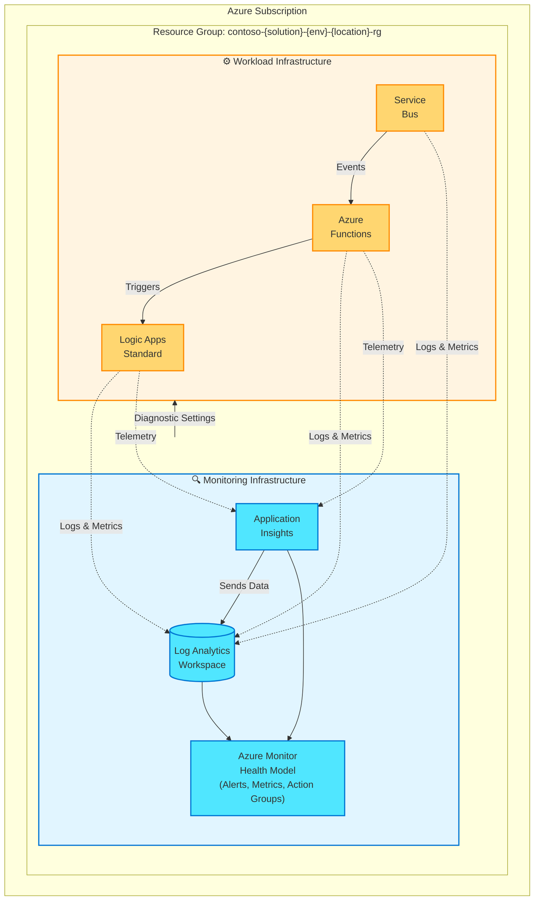

# Azure Logic Apps Monitoring Solution

A comprehensive, production-ready monitoring infrastructure for Azure Logic Apps Standard using Azure Monitor, Application Insights, Log Analytics, and Azure Service Bus. This solution provides complete observability, health tracking, and diagnostic capabilities for Logic Apps workloads.

## 📋 Table of Contents

- [Project Overview](#project-overview)
- [Architecture](#architecture)
- [Key Features](#key-features)
- [Prerequisites](#prerequisites)
- [Project Structure](#project-structure)
- [Deployment](#deployment)
- [Usage](#usage)
- [Monitoring and Observability](#monitoring-and-observability)
- [Contributing](#contributing)
- [License](#license)

## 🎯 Project Overview

This project provides a complete Infrastructure as Code (IaC) solution for deploying and monitoring Azure Logic Apps Standard with enterprise-grade observability. It's designed for platform engineers, DevOps teams, and cloud architects who need to implement robust monitoring for Logic Apps workloads in Azure.

### Target Audience

- **Platform Engineers**: Building and maintaining Azure Logic Apps infrastructure
- **DevOps Teams**: Implementing CI/CD pipelines with comprehensive monitoring
- **Cloud Architects**: Designing scalable, observable Logic Apps solutions
- **Site Reliability Engineers**: Ensuring reliability and performance of Logic Apps workloads

### Use Cases

- Tax document processing workflows
- Enterprise integration patterns
- Event-driven architectures
- Business process automation with full observability

## 🏗️ Architecture

The solution consists of three main layers:

### 1. Monitoring Layer (`src/monitoring/`)

The foundation of observability, providing:

- **Log Analytics Workspace**: Centralized log aggregation and analysis
- **Application Insights**: Application performance monitoring (APM) with distributed tracing
- **Azure Monitor Health Model**: Proactive health monitoring and alerting
- **Storage Account**: Long-term log retention and archival

### 2. Workload Layer (`src/workload/`)

The application components being monitored:

- **Logic Apps Standard**: Workflow orchestration engine
- **Azure Functions**: API endpoints and custom logic
- **Service Bus**: Reliable message queuing and event routing

### 3. Infrastructure Layer (`infra/`)

The deployment orchestration:

- **Resource Group**: Logical container for all resources
- **Bicep Modules**: Reusable, parameterized infrastructure templates
- **Tagging Strategy**: Consistent resource organization and cost tracking

### Architecture Diagram


```mermaid
graph TB
    subgraph Azure["Azure Subscription"]
        subgraph RG["Resource Group: contoso-{solution}-{env}-{location}-rg"]
            subgraph Monitoring["🔍 Monitoring Infrastructure"]
                LAW[("Log Analytics<br/>Workspace")]
                AI["Application<br/>Insights"]
                AHM["Azure Monitor<br/>Health Model<br/>(Alerts, Metrics, Action Groups)"]
                
                AI -->|Sends Data| LAW
                LAW --> AHM
                AI --> AHM
            end
            
            subgraph Workload["⚙️ Workload Infrastructure"]
                LA["Logic Apps<br/>Standard"]
                AF["Azure<br/>Functions"]
                SB["Service<br/>Bus"]
                
                SB -->|Events| AF
                AF -->|Triggers| LA
            end
            
            Monitoring -->|Diagnostic Settings| Workload
            LA -.->|Logs & Metrics| LAW
            LA -.->|Telemetry| AI
            AF -.->|Logs & Metrics| LAW
            AF -.->|Telemetry| AI
            SB -.->|Logs & Metrics| LAW
        end
    end
    
    style Monitoring fill:#e1f5ff,stroke:#0078d4,stroke-width:2px
    style Workload fill:#fff4e1,stroke:#ff8c00,stroke-width:2px
    style LAW fill:#50e6ff,stroke:#0078d4,stroke-width:2px
    style AI fill:#50e6ff,stroke:#0078d4,stroke-width:2px
    style AHM fill:#50e6ff,stroke:#0078d4,stroke-width:2px
    style LA fill:#ffd670,stroke:#ff8c00,stroke-width:2px
    style AF fill:#ffd670,stroke:#ff8c00,stroke-width:2px
    style SB fill:#ffd670,stroke:#ff8c00,stroke-width:2px
```

### Data Flow

1. **Log Collection**: Logic Apps and Functions emit logs and metrics
2. **Aggregation**: Diagnostic settings route data to Log Analytics and Application Insights
3. **Analysis**: Kusto queries analyze logs, metrics track performance
4. **Alerting**: Azure Monitor triggers alerts based on health model rules
5. **Visualization**: Application Insights provides dashboards and insights

## ✨ Key Features

- **🔍 Complete Observability**: End-to-end tracing from Logic Apps through Functions to Service Bus
- **📊 Real-time Metrics**: Performance counters, throughput, and error rates
- **🚨 Proactive Alerting**: Health-based monitoring with automated notifications
- **📈 Custom Dashboards**: Pre-configured Application Insights workbooks
- **🔐 Secure by Default**: Managed identities, private endpoints, and key vault integration
- **♻️ Reusable Modules**: Bicep templates for rapid deployment across environments
- **🏷️ Comprehensive Tagging**: Cost tracking and resource organization
- **📝 Audit Logging**: Complete activity logs and diagnostic data retention

## 📦 Prerequisites

### Required Tools

| Tool | Version | Purpose | Installation |
|------|---------|---------|--------------|
| **Azure CLI** | 2.50+ | Azure resource management | [Install](https://docs.microsoft.com/cli/azure/install-azure-cli) |
| **Bicep CLI** | 0.20+ | Infrastructure templates | `az bicep install` |
| **PowerShell** | 7.0+ | Script execution | [Install](https://docs.microsoft.com/powershell/scripting/install/installing-powershell) |
| **VS Code** | Latest | Development environment | [Install](https://code.visualstudio.com/) |

### Recommended VS Code Extensions

```bash
code --install-extension ms-azuretools.vscode-bicep
code --install-extension ms-azuretools.vscode-azurelogicapps
code --install-extension ms-azuretools.vscode-azurefunctions
```

### Azure Resources Required

- **Azure Subscription**: Active subscription with Contributor or Owner role
- **Resource Provider Registration**: 
  - Microsoft.Logic
  - Microsoft.Web
  - Microsoft.Insights
  - Microsoft.OperationalInsights
  - Microsoft.ServiceBus

### Verify Prerequisites

```powershell
# Verify Azure CLI installation
az --version

# Verify Bicep installation
az bicep version

# Login to Azure
az login

# Set your subscription
az account set --subscription "<your-subscription-id>"

# Register required resource providers
az provider register --namespace Microsoft.Logic
az provider register --namespace Microsoft.Web
az provider register --namespace Microsoft.Insights
az provider register --namespace Microsoft.OperationalInsights
az provider register --namespace Microsoft.ServiceBus

# Verify registration status
az provider show --namespace Microsoft.Logic --query "registrationState"
```

## 📁 Project Structure

```
Azure-LogicApps-Monitoring/
├── infra/                          # Main infrastructure deployment
│   ├── main.bicep                  # Root orchestration template
│   └── main.parameters.json        # Environment-specific parameters
├── src/
│   ├── monitoring/                 # Monitoring infrastructure
│   │   ├── main.bicep              # Monitoring module orchestrator
│   │   ├── log-analytics-workspace.bicep
│   │   ├── app-insights.bicep
│   │   └── azure-monitor-health-model.bicep
│   └── workload/                   # Application workload
│       ├── main.bicep              # Workload module orchestrator
│       ├── logic-app.bicep
│       ├── azure-function.bicep
│       └── messaging/
│           └── main.bicep          # Service Bus configuration
├── tax-docs/                       # Sample Logic App workflow
│   ├── connections.json
│   ├── host.json
│   ├── local.settings.json
│   └── tax-processing/
│       └── workflow.json
├── azure.yaml                      # Azure Developer CLI config
├── host.json                       # Logic Apps host configuration
└── README.md                       # This file
```

## 🚀 Deployment

### Quick Start (5 minutes)

```powershell
# 1. Clone the repository
git clone https://github.com/Evilazaro/Azure-LogicApps-Monitoring.git
cd Azure-LogicApps-Monitoring

# 2. Set deployment parameters
$solutionName = "tax-docs"
$location = "eastus"
$envName = "dev"

# 3. Deploy the entire solution
az deployment sub create `
  --location $location `
  --template-file ./infra/main.bicep `
  --parameters solutionName=$solutionName location=$location envName=$envName
```

### Detailed Deployment Steps

#### Step 1: Prepare Parameters

Create or modify `infra/main.parameters.json`:

```json
{
  "$schema": "https://schema.management.azure.com/schemas/2019-04-01/deploymentParameters.json#",
  "contentVersion": "1.0.0.0",
  "parameters": {
    "solutionName": {
      "value": "tax-docs"
    },
    "location": {
      "value": "eastus"
    },
    "envName": {
      "value": "dev"
    }
  }
}
```

#### Step 2: Validate Bicep Templates

```powershell
# Validate the main template
az deployment sub validate `
  --location eastus `
  --template-file ./infra/main.bicep `
  --parameters ./infra/main.parameters.json

# Preview changes (What-If)
az deployment sub what-if `
  --location eastus `
  --template-file ./infra/main.bicep `
  --parameters ./infra/main.parameters.json
```

#### Step 3: Deploy Infrastructure

```powershell
# Deploy to Azure
az deployment sub create `
  --name "logicapp-monitoring-$(Get-Date -Format 'yyyyMMdd-HHmmss')" `
  --location eastus `
  --template-file ./infra/main.bicep `
  --parameters ./infra/main.parameters.json `
  --verbose

# Capture outputs
$deployment = az deployment sub show `
  --name "logicapp-monitoring-$(Get-Date -Format 'yyyyMMdd-HHmmss')" `
  --query properties.outputs `
  -o json | ConvertFrom-Json

$resourceGroupName = $deployment.RESOURCE_GROUP_NAME.value
$logicAppName = $deployment.LOGIC_APP_NAME.value
$appInsightsName = $deployment.AZURE_APPLICATION_INSIGHTS_NAME.value
```

#### Step 4: Deploy Logic App Workflows

```powershell
# Navigate to your Logic App folder
cd tax-docs

# Deploy the Logic App workflow
az logicapp deployment source config-zip `
  --resource-group $resourceGroupName `
  --name $logicAppName `
  --src "$(Get-Location).zip"
```

#### Step 5: Verify Deployment

```powershell
# Check resource group
az group show --name $resourceGroupName

# List all resources
az resource list --resource-group $resourceGroupName --output table

# Check Logic App status
az logicapp show `
  --resource-group $resourceGroupName `
  --name $logicAppName `
  --query "{Name:name, State:state, DefaultHostName:defaultHostName}" `
  --output table

# Verify Application Insights connection
az monitor app-insights component show `
  --resource-group $resourceGroupName `
  --app $appInsightsName
```

### Environment-Specific Deployments

#### Development Environment

```powershell
az deployment sub create `
  --location eastus `
  --template-file ./infra/main.bicep `
  --parameters solutionName=tax-docs location=eastus envName=dev
```

#### UAT Environment

```powershell
az deployment sub create `
  --location eastus `
  --template-file ./infra/main.bicep `
  --parameters solutionName=tax-docs location=eastus envName=uat
```

#### Production Environment

```powershell
az deployment sub create `
  --location eastus `
  --template-file ./infra/main.bicep `
  --parameters solutionName=tax-docs location=eastus envName=prod
```

### Deploy Individual Modules

#### Deploy Only Monitoring Infrastructure

```powershell
az deployment group create `
  --resource-group $resourceGroupName `
  --template-file ./src/monitoring/main.bicep `
  --parameters name=tax-docs envName=dev location=eastus tags='{}'
```

#### Deploy Only Workload Infrastructure

```powershell
az deployment group create `
  --resource-group $resourceGroupName `
  --template-file ./src/workload/main.bicep `
  --parameters name=tax-docs envName=dev location=eastus `
    workspaceId=$workspaceId storageAccountId=$storageAccountId `
    appInsightsConnectionString=$connectionString `
    appInsightsInstrumentationKey=$instrumentationKey tags='{}'
```

## 💡 Usage

### Monitoring Logic Apps

#### View Live Metrics

```powershell
# Open Application Insights Live Metrics
az monitor app-insights component show `
  --resource-group $resourceGroupName `
  --app $appInsightsName `
  --query "appId" -o tsv | ForEach-Object {
    Start-Process "https://portal.azure.com/#@/resource/subscriptions/<subscription-id>/resourceGroups/$resourceGroupName/providers/microsoft.insights/components/$appInsightsName/livedatastream"
  }
```

#### Query Workflow Runs

```powershell
# Get Logic App workflow runs
az logicapp workflow show `
  --resource-group $resourceGroupName `
  --name $logicAppName `
  --workflow-name tax-processing

# List recent runs
az rest --method get `
  --uri "https://management.azure.com/subscriptions/<subscription-id>/resourceGroups/$resourceGroupName/providers/Microsoft.Web/sites/$logicAppName/hostruntime/runtime/webhooks/workflow/api/management/workflows/tax-processing/runs?api-version=2018-11-01"
```

### Querying Logs with KQL

#### Access Log Analytics

```powershell
# Get Log Analytics Workspace ID
$workspaceId = az monitor log-analytics workspace show `
  --resource-group $resourceGroupName `
  --workspace-name "contoso-tax-docs-dev-eastus-law" `
  --query "customerId" -o tsv
```

#### Common Kusto Queries

**1. Logic App Execution Summary**

```kql
// Run this query in Log Analytics
AzureDiagnostics
| where ResourceProvider == "MICROSOFT.WEB"
| where Category == "FunctionAppLogs" or Category == "WorkflowRuntime"
| where TimeGenerated > ago(24h)
| summarize 
    TotalRuns = count(),
    SuccessfulRuns = countif(status_s == "Succeeded"),
    FailedRuns = countif(status_s == "Failed"),
    AverageDuration = avg(duration_d)
  by bin(TimeGenerated, 1h)
| project TimeGenerated, TotalRuns, SuccessfulRuns, FailedRuns, AverageDuration
| render timechart
```

**2. Error Analysis**

```kql
AzureDiagnostics
| where ResourceProvider == "MICROSOFT.WEB"
| where Level == "Error"
| where TimeGenerated > ago(24h)
| project TimeGenerated, Resource, OperationName, ResultDescription, Message = column_ifexists("message_s", "")
| order by TimeGenerated desc
| take 50
```

**3. Performance Metrics**

```kql
requests
| where cloud_RoleName contains "tax-docs"
| where timestamp > ago(24h)
| summarize 
    RequestCount = count(),
    AvgDuration = avg(duration),
    P95Duration = percentile(duration, 95),
    FailureRate = countif(success == false) * 100.0 / count()
  by bin(timestamp, 5m)
| render timechart
```

**4. Dependency Tracking**

```kql
dependencies
| where cloud_RoleName contains "tax-docs"
| where timestamp > ago(24h)
| summarize 
    CallCount = count(),
    AvgDuration = avg(duration),
    FailureCount = countif(success == false)
  by name, type
| order by CallCount desc
```

#### Execute Queries via CLI

```powershell
# Run a Kusto query
az monitor log-analytics query `
  --workspace $workspaceId `
  --analytics-query "AzureDiagnostics | where TimeGenerated > ago(1h) | take 10" `
  --output table
```

### Viewing Metrics

#### Application Insights Metrics

```powershell
# Get request metrics
az monitor metrics list `
  --resource "/subscriptions/<subscription-id>/resourceGroups/$resourceGroupName/providers/microsoft.insights/components/$appInsightsName" `
  --metric "requests/count" `
  --start-time "2025-12-04T00:00:00Z" `
  --end-time "2025-12-04T23:59:59Z" `
  --interval PT1H `
  --aggregation Count

# Get failure rate
az monitor metrics list `
  --resource "/subscriptions/<subscription-id>/resourceGroups/$resourceGroupName/providers/microsoft.insights/components/$appInsightsName" `
  --metric "requests/failed" `
  --aggregation Count
```

#### Logic App Metrics

```powershell
# Get workflow run metrics
az monitor metrics list `
  --resource "/subscriptions/<subscription-id>/resourceGroups/$resourceGroupName/providers/Microsoft.Web/sites/$logicAppName" `
  --metric "WorkflowRunsCompleted" `
  --aggregation Total `
  --interval PT1H

# Get workflow success rate
az monitor metrics list `
  --resource "/subscriptions/<subscription-id>/resourceGroups/$resourceGroupName/providers/Microsoft.Web/sites/$logicAppName" `
  --metric "WorkflowRunsSucceeded" `
  --aggregation Total
```

### Setting Up Alerts

```powershell
# Create an action group
az monitor action-group create `
  --name "logic-app-alerts" `
  --resource-group $resourceGroupName `
  --short-name "LA-Alerts" `
  --email-receiver `
    name="Admin" `
    email-address="admin@contoso.com"

# Create a metric alert for failed runs
az monitor metrics alert create `
  --name "logic-app-failures" `
  --resource-group $resourceGroupName `
  --scopes "/subscriptions/<subscription-id>/resourceGroups/$resourceGroupName/providers/Microsoft.Web/sites/$logicAppName" `
  --condition "count WorkflowRunsFailed > 5" `
  --window-size 5m `
  --evaluation-frequency 1m `
  --action "logic-app-alerts" `
  --description "Alert when Logic App has more than 5 failures in 5 minutes"
```

### Accessing Dashboards

```powershell
# Open Application Insights dashboard
Start-Process "https://portal.azure.com/#@/resource/subscriptions/<subscription-id>/resourceGroups/$resourceGroupName/providers/microsoft.insights/components/$appInsightsName/overview"

# Open Logic App monitor
Start-Process "https://portal.azure.com/#@/resource/subscriptions/<subscription-id>/resourceGroups/$resourceGroupName/providers/Microsoft.Web/sites/$logicAppName/logicApp"
```

## 📊 Monitoring and Observability

### Key Metrics to Track

| Metric | Description | Threshold |
|--------|-------------|-----------|
| **Workflow Runs Completed** | Total workflow executions | N/A |
| **Workflow Success Rate** | Percentage of successful runs | > 95% |
| **Workflow Duration** | Average execution time | < 30s |
| **Failed Requests** | HTTP 5xx errors | < 1% |
| **Dependency Failures** | External service failures | < 2% |
| **Availability** | Service uptime | > 99.9% |

### Health Checks

The solution includes automated health monitoring for:

- Logic App runtime availability
- Application Insights data ingestion
- Log Analytics workspace connectivity
- Service Bus queue depths
- Azure Function health status

### Troubleshooting Common Issues

#### Issue: No logs in Application Insights

```powershell
# Verify Application Insights connection
az monitor app-insights component show `
  --resource-group $resourceGroupName `
  --app $appInsightsName `
  --query "instrumentationKey"

# Check diagnostic settings
az monitor diagnostic-settings list `
  --resource "/subscriptions/<subscription-id>/resourceGroups/$resourceGroupName/providers/Microsoft.Web/sites/$logicAppName"
```

#### Issue: Logic App workflows not appearing

```powershell
# Check Logic App status
az logicapp show `
  --resource-group $resourceGroupName `
  --name $logicAppName

# Restart Logic App
az logicapp restart `
  --resource-group $resourceGroupName `
  --name $logicAppName
```

## 🤝 Contributing

We welcome contributions from the community! Please see our [CONTRIBUTING.md](CONTRIBUTING.md) file for detailed guidelines.

### How to Contribute

1. **Fork the repository**
   ```powershell
   git clone https://github.com/Evilazaro/Azure-LogicApps-Monitoring.git
   cd Azure-LogicApps-Monitoring
   ```

2. **Create a feature branch**
   ```powershell
   git checkout -b feature/your-feature-name
   ```

3. **Make your changes**
   - Follow Bicep best practices
   - Add comments to complex logic
   - Update documentation

4. **Test your changes**
   ```powershell
   # Validate Bicep templates
   az bicep build --file ./infra/main.bicep
   
   # Run what-if deployment
   az deployment sub what-if `
     --location eastus `
     --template-file ./infra/main.bicep `
     --parameters ./infra/main.parameters.json
   ```

5. **Submit a pull request**
   ```powershell
   git add .
   git commit -m "feat: add your feature description"
   git push origin feature/your-feature-name
   ```

### Contribution Guidelines

- Use semantic commit messages (feat, fix, docs, style, refactor, test, chore)
- Ensure all Bicep templates pass validation
- Add tests for new functionality
- Update README.md with new features or changes
- Follow the existing code style and structure

### Code of Conduct

Please read our [CODE_OF_CONDUCT.md](CODE_OF_CONDUCT.md) before contributing.

## 📄 License

This project is licensed under the terms specified in [LICENSE.md](LICENSE.md).

## 📚 Additional Resources

### Azure Documentation

- [Azure Logic Apps Standard](https://docs.microsoft.com/azure/logic-apps/logic-apps-overview)
- [Application Insights](https://docs.microsoft.com/azure/azure-monitor/app/app-insights-overview)
- [Log Analytics Workspace](https://docs.microsoft.com/azure/azure-monitor/logs/log-analytics-overview)
- [Azure Monitor](https://docs.microsoft.com/azure/azure-monitor/overview)
- [Bicep Documentation](https://docs.microsoft.com/azure/azure-resource-manager/bicep/overview)

### Learn More

- [Logic Apps Monitoring Best Practices](https://docs.microsoft.com/azure/logic-apps/monitor-logic-apps)
- [Kusto Query Language (KQL)](https://docs.microsoft.com/azure/data-explorer/kusto/query/)
- [Azure Monitor Alerts](https://docs.microsoft.com/azure/azure-monitor/alerts/alerts-overview)

## 🆘 Support

For issues and questions:

- **Bug Reports**: Open an issue on [GitHub Issues](https://github.com/Evilazaro/Azure-LogicApps-Monitoring/issues)
- **Feature Requests**: Submit via [GitHub Discussions](https://github.com/Evilazaro/Azure-LogicApps-Monitoring/discussions)
- **Security Issues**: See [SECURITY.md](SECURITY.md)

## 🔄 Roadmap

- [ ] Add Terraform alternative templates
- [ ] Implement automated testing pipeline
- [ ] Add more Logic App workflow samples
- [ ] Create custom Application Insights workbooks
- [ ] Add deployment via Azure DevOps YAML pipelines
- [ ] Integrate with Azure Key Vault for secrets management

---

**Built with ❤️ by the Platform Engineering Team**

*Last Updated: December 4, 2025*
