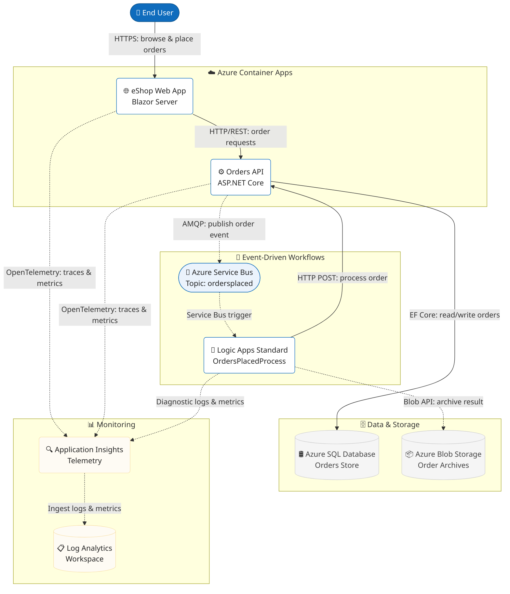

# Azure Logic Apps Monitoring


**Azure Logic Apps Monitoring** is a cloud-native reference solution that demonstrates how to build, orchestrate, and monitor event-driven order management workflows on Azure.

The solution addresses the challenge of integrating stateful business workflows with scalable microservices: a Blazor Server front-end and an ASP.NET Core REST API handle order placement, Azure Service Bus decouples producers from consumers, and Azure Logic Apps Standard drives the downstream processing workflow — all observable through Application Insights and Log Analytics.

The technology stack combines **.NET 10** and **.NET Aspire 13** for microservice orchestration, **Azure Logic Apps Standard** for low-code workflow automation, **Azure SQL Database** for persistent storage, **Azure Container Apps** for hosting, and **OpenTelemetry** for end-to-end distributed tracing.

## Table of Contents

- [Features](#features)
- [Architecture](#architecture)
- [Technologies Used](#technologies-used)
- [Quick Start](#quick-start)
- [Configuration](#configuration)
- [Deployment](#deployment)
- [Usage](#usage)
- [Contributing](#contributing)
- [License](#license)

## Features

- 🛒 **Order placement** — REST API that persists orders to Azure SQL Database with EF Core, complete with retry-on-failure and connection resiliency.
- 📨 **Event-driven processing** — Orders published to Azure Service Bus trigger Logic Apps Standard workflows without tight coupling between services.
- 🔁 **Automated workflow orchestration** — Logic Apps Standard processes each order, calls back the API, and archives results to Azure Blob Storage.
- 🌐 **Blazor Server UI** — Interactive server-side rendered front-end built with Microsoft Fluent UI components for order browsing and placement.
- 🔍 **End-to-end observability** — OpenTelemetry distributed tracing, metrics, and structured logging exported to Application Insights and Log Analytics.
- ☁️ **Cloud-native hosting** — Azure Container Apps hosts both microservices with managed identity authentication and VNet integration.
- 🔒 **Passwordless authentication** — All Azure resource access (SQL, Service Bus, Blob Storage) uses User-Assigned Managed Identity; no secrets in configuration.
- 🚀 **One-command deployment** — `azd up` provisions and deploys the entire solution including infrastructure (Bicep) and application containers.

## Architecture

### Architecture Summary

The Azure Logic Apps Monitoring solution is an event-driven eShop order management platform. **End users** interact with the Blazor Server web application, which communicates with the Orders API to place and retrieve orders. The Orders API persists data to Azure SQL Database and publishes order events to Azure Service Bus. An Azure Logic Apps Standard workflow subscribes to those events, calls the Orders API to process each order, and archives the result to Azure Blob Storage. The Blazor web application, Orders API, and Logic Apps Standard all emit telemetry to Application Insights, which forwards logs and metrics to a central Log Analytics workspace.


```mermaid
---
config:
  primaryColor: "#0f6cbd"
  primaryTextColor: "#FFFFFF"
  primaryBorderColor: "#0f548c"
  secondaryColor: "#ebf3fc"
  secondaryTextColor: "#242424"
  secondaryBorderColor: "#0f6cbd"
  tertiaryColor: "#f5f5f5"
  tertiaryTextColor: "#424242"
  tertiaryBorderColor: "#d1d1d1"
  noteBkgColor: "#fefbf4"
  noteTextColor: "#242424"
  noteBorderColor: "#f9e2ae"
  lineColor: "#616161"
  background: "#FFFFFF"
  edgeLabelBackground: "#FFFFFF"
  clusterBkg: "#fafafa"
  clusterBorder: "#e0e0e0"
  titleColor: "#242424"
  errorBkgColor: "#fdf3f4"
  errorTextColor: "#b10e1c"
  fontFamily: "Segoe UI, Verdana, sans-serif"
  fontSize: 16
  align: center
  description: "High-level architecture diagram showing actors, primary flows, and major components."
---
flowchart TB

%% ── Actors ──────────────────────────────────────────────────────────────
    User(["👤 End User"])

%% ── Azure Container Apps Environment ────────────────────────────────────
    subgraph ACA["☁️ Azure Container Apps"]
        direction TB
        WebApp("🌐 eShop Web App<br/>Blazor Server")
        OrdersAPI("⚙️ Orders API<br/>ASP.NET Core")
    end

%% ── Event-Driven Workflows ──────────────────────────────────────────────
    subgraph Workflows["📨 Event-Driven Workflows"]
        direction TB
        ServiceBus(["🚌 Azure Service Bus<br/>Topic: ordersplaced"])
        LogicApp("🔁 Logic Apps Standard<br/>OrdersPlacedProcess")
    end

%% ── Data & Storage ──────────────────────────────────────────────────────
    subgraph DataStorage["🗄️ Data & Storage"]
        direction TB
        SqlDb[("🛢️ Azure SQL Database<br/>Orders Store")]
        BlobStorage[("📦 Azure Blob Storage<br/>Order Archives")]
    end

%% ── Monitoring ──────────────────────────────────────────────────────────
    subgraph Monitoring["📊 Monitoring"]
        direction TB
        AppInsights("🔍 Application Insights<br/>Telemetry")
        LogAnalytics[("📋 Log Analytics<br/>Workspace")]
    end

%% ── Interactions ────────────────────────────────────────────────────────
    User -->|"HTTPS: browse & place orders"| WebApp
    WebApp -->|"HTTP/REST: order requests"| OrdersAPI
    OrdersAPI -->|"EF Core: read/write orders"| SqlDb
    OrdersAPI -.->|"AMQP: publish order event"| ServiceBus
    ServiceBus -.->|"Service Bus trigger"| LogicApp
    LogicApp -->|"HTTP POST: process order"| OrdersAPI
    LogicApp -.->|"Blob API: archive result"| BlobStorage
    WebApp -.->|"OpenTelemetry: traces & metrics"| AppInsights
    OrdersAPI -.->|"OpenTelemetry: traces & metrics"| AppInsights
    LogicApp -.->|"Diagnostic logs & metrics"| AppInsights
    AppInsights -.->|"Ingest logs & metrics"| LogAnalytics

%% ── Style Classes ───────────────────────────────────────────────────────
    classDef actor fill:#0f6cbd,stroke:#0f548c,color:#FFFFFF
    classDef service fill:#FFFFFF,stroke:#0f6cbd,color:#242424
    classDef external fill:#ebf3fc,stroke:#0f6cbd,color:#242424
    classDef datastore fill:#f5f5f5,stroke:#d1d1d1,color:#424242
    classDef monitoring fill:#fefbf4,stroke:#f9e2ae,color:#242424

    class User actor
    class WebApp,OrdersAPI,LogicApp service
    class ServiceBus external
    class SqlDb,BlobStorage datastore
    class AppInsights,LogAnalytics monitoring
```

## Technologies Used

| Technology                     | Type                   | Purpose                                                             |
| ------------------------------ | ---------------------- | ------------------------------------------------------------------- |
| .NET 10                        | Runtime                | Target framework for all C# projects                                |
| ASP.NET Core 10                | Framework              | REST API and server-side rendering                                  |
| Blazor Server                  | UI Framework           | Interactive order management front-end                              |
| Microsoft Fluent UI v4         | UI Component Library   | Accessible component library for Blazor                             |
| .NET Aspire 13                 | Orchestration          | Local development orchestration and Azure Container Apps deployment |
| Entity Framework Core 10       | ORM                    | Database access layer with Azure SQL Server provider                |
| Azure Logic Apps Standard      | Workflow Engine        | Event-driven order processing workflows                             |
| Azure Service Bus              | Messaging              | Pub/sub messaging backbone (topic: `ordersplaced`)                  |
| Azure SQL Database             | Relational Database    | Persistent order storage                                            |
| Azure Blob Storage             | Object Storage         | Order archive for successfully processed and failed orders          |
| Azure Container Apps           | Container Hosting      | Production hosting for Orders API and Web App                       |
| Azure Container Registry       | Image Registry         | Private Docker image store                                          |
| Application Insights           | Telemetry              | Distributed tracing, metrics, and logging                           |
| Log Analytics Workspace        | Log Management         | Centralized log aggregation and query                               |
| OpenTelemetry                  | Observability          | Vendor-neutral tracing, metrics, and logging instrumentation        |
| Azure Developer CLI (azd)      | Deployment             | One-command infrastructure provisioning and application deployment  |
| Bicep                          | Infrastructure as Code | Azure resource definitions and parameter management                 |
| User-Assigned Managed Identity | Authentication         | Passwordless authentication for all Azure resource access           |

## Quick Start

### Prerequisites

| Prerequisite                                                                                             | Minimum Version | Notes                                    |
| -------------------------------------------------------------------------------------------------------- | --------------- | ---------------------------------------- |
| [.NET SDK](https://dotnet.microsoft.com/download/dotnet/10.0)                                            | 10.0.100        | Required to build and run the projects   |
| [Azure CLI](https://learn.microsoft.com/cli/azure/install-azure-cli)                                     | 2.60.0          | Required for Azure authentication        |
| [Azure Developer CLI (azd)](https://learn.microsoft.com/azure/developer/azure-developer-cli/install-azd) | 1.11.0          | Required for provisioning and deployment |
| [Docker Desktop](https://www.docker.com/products/docker-desktop/)                                        | Latest          | Required for local container builds      |
| Azure subscription                                                                                       | —               | Required for cloud deployment            |

### Installation

1. Clone the repository:

```bash
git clone https://github.com/Evilazaro/Azure-LogicApps-Monitoring.git
cd Azure-LogicApps-Monitoring
```

2. Authenticate with Azure:

```bash
azd auth login
az login
```

3. Create a new `azd` environment:

```bash
azd env new <your-environment-name>
```

4. Provision infrastructure and deploy the application in one step:

```bash
azd up
```

### Minimal Working Example

After `azd up` completes, place a test order using the HTTP file included with the Orders API:

```bash
# Set the Orders API base URL from azd environment output
ORDERS_API_URL=$(azd env get-value ORDERS_API_ENDPOINT)

curl -X POST "$ORDERS_API_URL/api/Orders" \
  -H "Content-Type: application/json" \
  -d '{
        "id": "order-001",
        "customerName": "Alice",
        "products": [{ "name": "Widget", "quantity": 2, "price": 9.99 }],
        "total": 19.98
      }'
# Expected: HTTP 201 Created with the order body
```

> [!TIP]
> Use the `hooks/Generate-Orders.ps1` (PowerShell) or `hooks/Generate-Orders.sh` (Bash) script to generate a batch of sample orders automatically.

## Configuration

All configuration is driven by environment variables and `appsettings.json` files per service. The table below lists the key options.

| Option                                  | Default                 | Description                                                                    |
| --------------------------------------- | ----------------------- | ------------------------------------------------------------------------------ |
| `ConnectionStrings__OrderDb`            | _(required)_            | Azure SQL Database connection string for the Orders API                        |
| `ConnectionStrings__messaging`          | _(optional)_            | Service Bus emulator connection string for local development                   |
| `Azure__ServiceBus__HostName`           | _(optional)_            | Service Bus namespace FQDN for production (enables Service Bus client)         |
| `Azure__ServiceBus__TopicName`          | `ordersplaced`          | Service Bus topic name for order events                                        |
| `Azure__TenantId`                       | _(optional)_            | Azure AD tenant ID for local development credential override                   |
| `Azure__ClientId`                       | _(optional)_            | Azure AD client ID for local development credential override                   |
| `APPLICATIONINSIGHTS_CONNECTION_STRING` | _(optional)_            | Application Insights connection string; auto-injected in Azure Container Apps  |
| `OTEL_EXPORTER_OTLP_ENDPOINT`           | _(optional)_            | OpenTelemetry collector endpoint for local development                         |
| `services__orders-api__https__0`        | _(required by Web App)_ | Orders API HTTPS base address; auto-populated by .NET Aspire service discovery |

### Example: override Service Bus topic name

```json
{
  "Azure": {
    "ServiceBus": {
      "HostName": "my-servicebus.servicebus.windows.net",
      "TopicName": "ordersplaced"
    }
  }
}
```

> [!NOTE]
> In Azure Container Apps, all connection strings and managed identity configuration are automatically injected by the .NET Aspire and `azd` provisioning pipeline. You do not need to set these values manually for cloud deployments.

> [!WARNING]
> Never commit real connection strings, API keys, or credentials to source control. Use `azd env set` or Azure Key Vault for secrets in all non-local environments.

## Deployment

Deploy the full solution to Azure using the Azure Developer CLI.

1. Authenticate with your Azure account:

```bash
azd auth login
az login
```

2. Create and select an environment (repeat for each target environment, e.g., `dev`, `staging`, `prod`):

```bash
azd env new <environment-name>
```

3. Set the target Azure location:

```bash
azd env set AZURE_LOCATION eastus
```

4. Provision all Azure infrastructure and deploy application containers:

```bash
azd up
```

5. (Optional) Re-deploy application code only after an infrastructure provisioning run:

```bash
azd deploy
```

6. (Optional) Tear down all provisioned resources:

```bash
azd down
```

> [!IMPORTANT]
> The `azd up` command runs the lifecycle hooks in the `hooks/` directory automatically. The `postprovision.ps1` / `postprovision.sh` scripts configure Managed Identity role assignments and SQL authentication. Ensure the deploying principal has **Contributor** and **User Access Administrator** permissions on the target subscription.

> [!NOTE]
> Logic Apps Standard workflows are deployed as part of the `infra/workload/logic-app.bicep` module. After infrastructure provisioning, the workflow definitions in `workflows/OrdersManagement/OrdersManagementLogicApp/` are deployed to the provisioned Logic App.

## Usage

### Placing an Order via the Web UI

1. Open the eShop Web App URL from the `azd up` output.
2. Navigate to the **Orders** page.
3. Fill in the order form and select **Place Order**.
4. The order is persisted to Azure SQL Database and an event is published to Azure Service Bus.
5. The Logic Apps Standard workflow picks up the event, calls the Orders API `/api/Orders/process` endpoint, and archives the result to Azure Blob Storage.

### Placing an Order via the REST API

```bash
POST /api/Orders
Content-Type: application/json

{
  "id": "order-002",
  "customerName": "Bob",
  "products": [
    { "name": "Gadget", "quantity": 1, "price": 49.99 }
  ],
  "total": 49.99
}
```

```json
// HTTP 201 Created
{
  "id": "order-002",
  "customerName": "Bob",
  "products": [{ "name": "Gadget", "quantity": 1, "price": 49.99 }],
  "total": 49.99,
  "status": "Placed"
}
```

### Retrieving an Order

```bash
GET /api/Orders/{id}
Accept: application/json
```

```json
// HTTP 200 OK
{
  "id": "order-002",
  "customerName": "Bob",
  "status": "Processed"
}
```

### Viewing API Documentation

The Orders API exposes a Swagger UI at `/swagger` in the `Development` environment. Use it to explore all available endpoints and schemas interactively.

### Monitoring and Observability

- **Application Insights**: Navigate to the Application Insights resource in the Azure Portal to view live metrics, end-to-end transaction traces, and failure analysis.
- **Log Analytics**: Run KQL queries against the Log Analytics workspace to aggregate logs across all services:

```kql
AppTraces
| where AppRoleName in ("orders-api", "web-app")
| order by TimeGenerated desc
| take 50
```

## Contributing

Community contributions are welcome and encouraged. To contribute to this project:

1. Open an [issue](https://github.com/Evilazaro/Azure-LogicApps-Monitoring/issues) to report a bug or propose a new feature before submitting a pull request.
2. Fork the repository and create a feature branch from `main`.
3. Make your changes, add or update tests as appropriate, and ensure the build passes locally with `dotnet build app.sln`.
4. Submit a pull request against the `main` branch with a clear description of the change and its motivation.

> [!NOTE]
> There is no `CONTRIBUTING.md` or `CODE_OF_CONDUCT.md` file in this repository yet. Please follow standard open-source contribution etiquette: be respectful, provide context, and keep pull requests focused.

## License

This project is released under the **MIT License**. See the [LICENSE](LICENSE) file for full terms.
