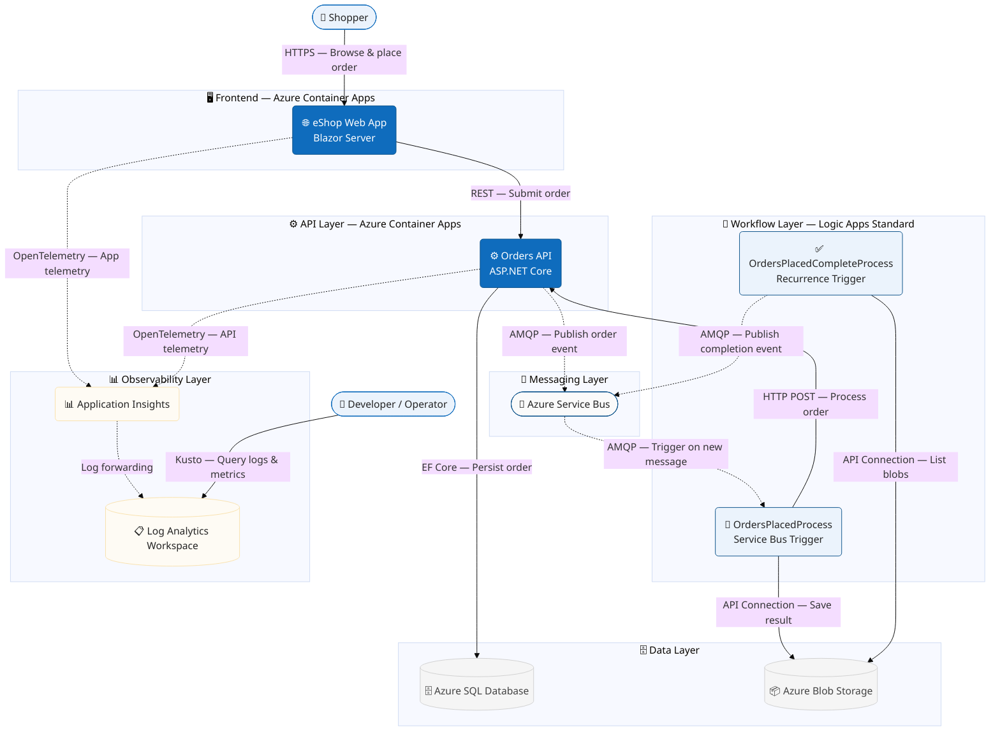

# Azure Logic Apps Monitoring Solution


**Azure Logic Apps Monitoring** is a reference solution that demonstrates how to build, deploy, and monitor event-driven order-processing workflows using **Azure Logic Apps Standard**, .NET Aspire, and Azure Container Apps. The solution provides a complete, production-ready example that teams can adapt to implement their own workflow automation with comprehensive observability built in.

Order management systems often struggle to provide end-to-end visibility into asynchronous workflows. This solution addresses that challenge by integrating Azure Service Bus, Logic Apps Standard, Application Insights, and Log Analytics into a unified architecture where every step of the order lifecycle — from placement to processing to archival — is traceable, auditable, and observable through a centralized monitoring stack.

The technology stack combines **ASP.NET Core** (Web API and Blazor Server), **Azure Logic Apps Standard** (workflow engine), **Azure Service Bus** (messaging), **Azure SQL Database** (persistence), **Azure Blob Storage** (archival), and **Application Insights with Log Analytics** (observability). Infrastructure is defined in **Bicep** and deployed through the **Azure Developer CLI (azd)**, while local development is orchestrated by **.NET Aspire**.

## Table of Contents

- [Features](#features)
- [Architecture](#architecture)
- [Technologies Used](#technologies-used)
- [Quick Start](#quick-start)
- [Configuration](#configuration)
- [Deployment](#deployment)
- [Usage](#usage)
- [Contributing](#contributing)
- [License](#license)

## Features

- 🔄 **Event-driven order processing** using Azure Service Bus and Logic Apps Standard workflows
- 📊 **End-to-end observability** with Application Insights, OpenTelemetry distributed tracing, and Log Analytics
- 🌐 **Blazor Server frontend** for interactive order management through a modern, component-based UI
- ⚙️ **RESTful Orders API** backed by Entity Framework Core, Azure SQL Database, and connection resiliency
- 📦 **Automated order archival** to Azure Blob Storage for successfully processed and failed orders
- 🔐 **Passwordless authentication** using User Assigned Managed Identity across all Azure services
- 🏗️ **Infrastructure as Code** with Bicep templates and one-command deployment via `azd up`
- 🧑‍💻 **Local development** orchestrated by .NET Aspire with Service Bus emulator support
- 🔒 **VNet-integrated** architecture with private endpoints for secure service-to-service communication
- ✅ **Automated post-provisioning** hooks that configure SQL managed identity and .NET user secrets

## Architecture

The diagram below shows the high-level architecture, identifying the actors, the primary order-processing flow, and the observability path.


```mermaid
---
config:
  description: "High-level architecture diagram showing actors, primary flows, and major components."
  theme: base
  align: center
  fontFamily: "Segoe UI, Verdana, sans-serif"
  fontSize: 16
  textColor: "#242424"
  primaryColor: "#0f6cbd"
  primaryTextColor: "#FFFFFF"
  primaryBorderColor: "#0f548c"
  secondaryColor: "#ebf3fc"
  secondaryTextColor: "#242424"
  secondaryBorderColor: "#0f6cbd"
  tertiaryColor: "#f5f5f5"
  tertiaryTextColor: "#424242"
  tertiaryBorderColor: "#d1d1d1"
  noteBkgColor: "#fefbf4"
  noteTextColor: "#242424"
  noteBorderColor: "#f9e2ae"
  lineColor: "#616161"
  background: "#FFFFFF"
  edgeLabelBackground: "#FFFFFF"
  clusterBkg: "#fafafa"
  clusterBorder: "#e0e0e0"
  titleColor: "#242424"
  errorBkgColor: "#fdf3f4"
  errorTextColor: "#b10e1c"
---
flowchart TB

%% ─── Actors ─────────────────────────────────────────────────────────────────
  Shopper(["🧑 Shopper"])
  DevOps(["🔧 Developer / Operator"])

%% ─── Frontend Layer ──────────────────────────────────────────────────────────
  subgraph FrontendLayer["🖥️ Frontend — Azure Container Apps"]
    WebApp("🌐 eShop Web App<br/>Blazor Server")
  end

%% ─── API Layer ───────────────────────────────────────────────────────────────
  subgraph APILayer["⚙️ API Layer — Azure Container Apps"]
    OrdersAPI("⚙️ Orders API<br/>ASP.NET Core")
  end

%% ─── Data Layer ──────────────────────────────────────────────────────────────
  subgraph DataLayer["🗄️ Data Layer"]
    SQLDb[("🗄️ Azure SQL Database")]
    BlobStorage[("📦 Azure Blob Storage")]
  end

%% ─── Messaging Layer ─────────────────────────────────────────────────────────
  subgraph MessagingLayer["📨 Messaging Layer"]
    ServiceBus(["📨 Azure Service Bus"])
  end

%% ─── Workflow Layer ──────────────────────────────────────────────────────────
  subgraph WorkflowLayer["🔄 Workflow Layer — Logic Apps Standard"]
    LA_Process("🔄 OrdersPlacedProcess<br/>Service Bus Trigger")
    LA_Complete("✅ OrdersPlacedCompleteProcess<br/>Recurrence Trigger")
  end

%% ─── Observability Layer ─────────────────────────────────────────────────────
  subgraph ObservabilityLayer["📊 Observability Layer"]
    AppInsights("📊 Application Insights")
    LogAnalytics[("📋 Log Analytics Workspace")]
  end

%% ─── Interactions ────────────────────────────────────────────────────────────
  Shopper --> |"HTTPS — Browse & place order"| WebApp
  WebApp --> |"REST — Submit order"| OrdersAPI
  OrdersAPI --> |"EF Core — Persist order"| SQLDb
  OrdersAPI -.-> |"AMQP — Publish order event"| ServiceBus
  ServiceBus -.-> |"AMQP — Trigger on new message"| LA_Process
  LA_Process --> |"HTTP POST — Process order"| OrdersAPI
  LA_Process --> |"API Connection — Save result"| BlobStorage
  LA_Complete --> |"API Connection — List blobs"| BlobStorage
  LA_Complete -.-> |"AMQP — Publish completion event"| ServiceBus
  WebApp -.-> |"OpenTelemetry — App telemetry"| AppInsights
  OrdersAPI -.-> |"OpenTelemetry — API telemetry"| AppInsights
  AppInsights -.-> |"Log forwarding"| LogAnalytics
  DevOps --> |"Kusto — Query logs & metrics"| LogAnalytics

%% ─── Styles (Fluent UI v9 semantic tokens) ───────────────────────────────────
  classDef actor fill:#ebf3fc,stroke:#0f6cbd,color:#242424
  classDef service fill:#0f6cbd,stroke:#0f548c,color:#FFFFFF
  classDef datastore fill:#f5f5f5,stroke:#d1d1d1,color:#424242
  classDef messaging fill:#fafafa,stroke:#0f548c,color:#242424
  classDef workflow fill:#ebf3fc,stroke:#0f548c,color:#242424
  classDef observability fill:#fefbf4,stroke:#f9e2ae,color:#242424

  class Shopper,DevOps actor
  class WebApp,OrdersAPI service
  class SQLDb,BlobStorage datastore
  class ServiceBus messaging
  class LA_Process,LA_Complete workflow
  class AppInsights,LogAnalytics observability
```

### How the flow works

A **Shopper** places an order through the Blazor Web App, which calls the Orders API over REST. The API persists the order in Azure SQL Database and asynchronously publishes an order event to Azure Service Bus. The **OrdersPlacedProcess** Logic App workflow consumes the Service Bus message, calls the Orders API to process the order, and writes the result to Azure Blob Storage — either to `ordersprocessedsuccessfully` or `errors`. A second workflow, **OrdersPlacedCompleteProcess**, runs on a recurrence trigger every few seconds, lists blobs from the success container, and publishes completion events back to Service Bus. **Developers and Operators** monitor the entire flow through Application Insights and Log Analytics.

## Technologies Used

| Technology                | Type                   | Purpose                                               |
| ------------------------- | ---------------------- | ----------------------------------------------------- |
| .NET 10 / C#              | Runtime & Language     | Core application runtime for all services             |
| ASP.NET Core              | Framework              | Orders REST API and Blazor Server Web App             |
| Blazor Server             | UI Framework           | Interactive server-side rendered web frontend         |
| .NET Aspire 13            | Orchestration          | Local development and Azure Container Apps deployment |
| Azure Logic Apps Standard | Workflow Engine        | Event-driven order processing workflows               |
| Azure Service Bus         | Messaging              | Asynchronous order event transport over AMQP          |
| Azure SQL Database        | Database               | Persistent order storage via Entity Framework Core 10 |
| Azure Blob Storage        | Storage                | Processed and failed order archival                   |
| Azure Container Apps      | Hosting                | Scalable container runtime for the API and Web App    |
| Azure Container Registry  | Registry               | Container image storage                               |
| Application Insights      | Observability          | Distributed tracing, metrics, and telemetry           |
| Log Analytics Workspace   | Observability          | Centralized log aggregation and Kusto queries         |
| Bicep                     | Infrastructure as Code | Declarative Azure resource provisioning               |
| Azure Developer CLI (azd) | Deployment Tooling     | One-command provision and deploy lifecycle            |
| Azure CLI                 | CLI                    | Azure resource management and authentication          |
| Microsoft Fluent UI v4    | Component Library      | UI components for the Blazor Web App                  |
| Entity Framework Core 10  | ORM                    | SQL Server data access with migration support         |
| OpenTelemetry             | Telemetry Standard     | Distributed tracing across all services               |

## Quick Start

### Prerequisites

| Prerequisite              | Minimum Version | Reference                                                                                            |
| ------------------------- | --------------- | ---------------------------------------------------------------------------------------------------- |
| PowerShell                | 7.0+            | [Install PowerShell](https://learn.microsoft.com/powershell/scripting/install/installing-powershell) |
| .NET SDK                  | 10.0.100        | [Install .NET 10](https://dotnet.microsoft.com/download/dotnet/10.0)                                 |
| Azure CLI                 | 2.60.0+         | [Install Azure CLI](https://learn.microsoft.com/cli/azure/install-azure-cli)                         |
| Azure Developer CLI (azd) | 1.11.0+         | [Install azd](https://learn.microsoft.com/azure/developer/azure-developer-cli/install-azd)           |
| Bicep CLI                 | 0.30.0+         | [Install Bicep](https://learn.microsoft.com/azure/azure-resource-manager/bicep/install)              |
| Docker Desktop            | Latest          | [Install Docker](https://www.docker.com/products/docker-desktop)                                     |

> [!TIP]
> Run the workstation validation script to confirm all prerequisites are installed and configured correctly before proceeding.

### Installation

1. **Validate your developer workstation:**

   ```powershell
   ./hooks/check-dev-workstation.ps1
   ```

2. **Clone the repository:**

   ```bash
   git clone https://github.com/Evilazaro/Azure-LogicApps-Monitoring.git
   cd Azure-LogicApps-Monitoring
   ```

3. **Authenticate with Azure:**

   ```bash
   azd auth login
   az login
   ```

4. **Create a new azd environment:**

   ```bash
   azd env new <your-environment-name>
   ```

5. **Provision infrastructure and deploy services:**

   ```bash
   azd up
   ```

### Minimal Working Example — Local Development

Run the full solution locally using .NET Aspire:

```bash
dotnet run --project app.AppHost
```

The Aspire Dashboard opens automatically. The following services are available through the dashboard:

- **Aspire Dashboard:** `https://localhost:15888`
- **eShop Web App:** URL listed for `web-app` in the dashboard
- **Orders API — Swagger UI:** URL listed for `orders-api`, with `/swagger` appended

## Configuration

The following settings control runtime behavior. Configure them using `azd env set`, environment variables, or .NET user secrets (`dotnet user-secrets set`).

| Option                                  | Default                | Description                                                                   |
| --------------------------------------- | ---------------------- | ----------------------------------------------------------------------------- |
| `Azure__TenantId`                       | _(empty)_              | Azure AD tenant ID used for local development authentication                  |
| `Azure__ClientId`                       | _(empty)_              | Client ID of the User Assigned Managed Identity                               |
| `Azure__ServiceBus__HostName`           | _(empty)_              | Service Bus namespace hostname — e.g., `sb-orders-dev.servicebus.windows.net` |
| `Azure__AllowResourceGroupCreation`     | `false`                | Set to `true` to allow azd to create a new resource group during provisioning |
| `ConnectionStrings__OrderDb`            | _(injected by Aspire)_ | SQL Server connection string for the Orders database                          |
| `APPLICATIONINSIGHTS_CONNECTION_STRING` | _(injected by Aspire)_ | Application Insights connection string for telemetry                          |

> [!NOTE]
> The post-provisioning hook (`hooks/postprovision.ps1`) automatically populates .NET user secrets for all three projects after `azd up` completes. Manual configuration is only required for custom or advanced scenarios.

**Example — override the Service Bus hostname for local development:**

```powershell
dotnet user-secrets set "Azure:ServiceBus:HostName" "sb-orders-dev.servicebus.windows.net" `
  --project app.AppHost
```

## Deployment

> [!IMPORTANT]
> Complete the [Quick Start](#quick-start) prerequisites and workstation validation before deploying to Azure.

1. **Log in to Azure with both CLIs:**

   ```bash
   azd auth login
   az login --tenant <your-tenant-id>
   ```

2. **Create or select an azd environment:**

   ```bash
   azd env new <environment-name>
   # To select an existing environment instead:
   azd env select <environment-name>
   ```

3. **Set the target Azure region and subscription:**

   ```bash
   azd env set AZURE_LOCATION <azure-region>       # e.g. eastus
   azd env set AZURE_SUBSCRIPTION_ID <sub-id>
   ```

4. **Provision infrastructure and deploy all services in one step:**

   ```bash
   azd up
   ```

   `azd up` runs the complete lifecycle: provisions Bicep infrastructure at subscription scope, builds and pushes container images to Azure Container Registry, deploys to Azure Container Apps, and executes the post-provisioning hooks that configure SQL managed identity and user secrets.

5. **Deploy the Logic App workflows** to the provisioned Logic Apps Standard instance. Open the `workflows/OrdersManagement` folder in VS Code with the Azure Logic Apps extension installed, and publish the `OrdersManagementLogicApp` project to the provisioned Logic App resource.

6. **Verify the deployment** by opening the URLs shown in the azd output and confirming the Orders API health endpoint returns `200 OK`:

   ```bash
   curl https://<orders-api-url>/health
   ```

> [!WARNING]
> The `infra/main.bicep` template deploys resources at the **subscription** scope. Ensure the deploying identity has the **Contributor** and **User Access Administrator** roles on the target subscription before running `azd up`.

## Usage

### Placing an order via the web app

Open the **eShop Web App** URL in a browser, fill in the order form, and submit. The app calls the Orders API, which persists the order and publishes a Service Bus message. The Logic App workflow picks up the message and processes the order within seconds.

### Placing an order via the API

Use the Swagger UI at `/swagger` or call the API directly:

```bash
curl -X POST https://<orders-api-url>/api/Orders \
  -H "Content-Type: application/json" \
  -d '{
    "customerId": "customer-001",
    "productId": "product-42",
    "quantity": 2
  }'
```

Expected response (`201 Created`):

```json
{
  "id": "f3a2b1c0-...",
  "customerId": "customer-001",
  "productId": "product-42",
  "quantity": 2,
  "status": "Placed"
}
```

### Monitoring order processing in Log Analytics

Query processed orders using Kusto Query Language in the Log Analytics workspace:

```kusto
AppTraces
| where AppRoleName in ("orders-api", "web-app")
| where SeverityLevel >= 2
| order by TimeGenerated desc
| take 50
```

### Generating test orders

Use the helper script to generate a batch of sample orders against a running environment:

```powershell
./hooks/Generate-Orders.ps1
```

## Contributing

Contributions are welcome. To contribute to this project:

1. **Open an issue** on [GitHub Issues](https://github.com/Evilazaro/Azure-LogicApps-Monitoring/issues) to report a bug or propose a feature before submitting a pull request.
2. **Fork the repository** and create a feature branch from `main`.
3. **Make your changes**, ensuring the solution builds and all tests pass:

   ```bash
   dotnet build app.sln
   dotnet test app.sln
   ```

4. **Open a pull request** against `main` with a clear description of the problem and the solution.

> [!NOTE]
> By contributing, you agree that your contributions will be licensed under the MIT License that covers this project.

## License

This project is licensed under the **MIT License**. See the [LICENSE](LICENSE) file for full terms.
