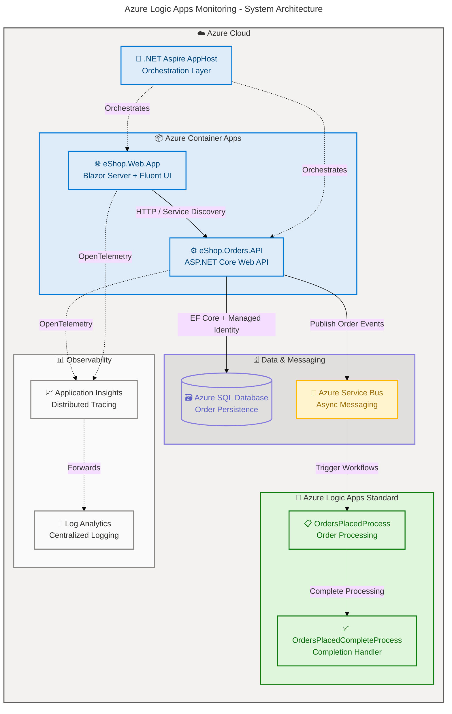

# Azure Logic Apps Monitoring

[](https://github.com/Evilazaro/Azure-LogicApps-Monitoring/actions/workflows/ci-dotnet.yml)
[](https://github.com/Evilazaro/Azure-LogicApps-Monitoring/actions/workflows/azure-dev.yml)


An enterprise-grade order management platform built with **.NET Aspire**, **Azure Logic Apps Standard**, and **Azure Container Apps**. This solution demonstrates a cloud-native architecture that combines distributed microservices with serverless workflow automation for end-to-end order processing, observability, and monitoring.

## 🔭 Overview

**Overview**

This project provides a production-ready reference architecture for building monitored, event-driven applications on Azure. It showcases how .NET Aspire orchestration, Azure Logic Apps Standard workflows, and Azure Container Apps work together to deliver a resilient, observable order management system.

> 💡 **Why This Matters**: Organizations building cloud-native applications need proven patterns for combining microservices with workflow automation. This solution provides a battle-tested architecture that handles order lifecycle management with built-in observability, fault tolerance, and zero-downtime deployments.

> 📌 **How It Works**: The platform uses .NET Aspire as the orchestration layer to coordinate an ASP.NET Core REST API backend, a Blazor Server frontend, Azure Service Bus for async messaging, Azure SQL for persistence, and Azure Logic Apps Standard for automated workflow processing — all deployed to Azure Container Apps with full OpenTelemetry instrumentation.

## 📑 Table of Contents

- [🏗️ Architecture](#️-architecture)
- [✨ Features](#-features)
- [📋 Requirements](#-requirements)
- [🚀 Quick Start](#-quick-start)
- [⚙️ Configuration](#️-configuration)
- [☁️ Deployment](#️-deployment)
- [📁 Project Structure](#-project-structure)
- [🧪 Testing](#-testing)
- [🔧 Troubleshooting](#-troubleshooting)
- [🤝 Contributing](#-contributing)
- [📄 License](#-license)

## 🏗️ Architecture

**Overview**

The solution follows a distributed microservices architecture orchestrated by .NET Aspire and deployed to Azure Container Apps, with Azure Logic Apps Standard handling automated workflow processing.


```mermaid
---
title: "Azure Logic Apps Monitoring - System Architecture"
config:
  theme: base
  look: classic
  layout: dagre
  themeVariables:
    fontSize: '16px'
  flowchart:
    htmlLabels: true
---
flowchart TB
    accTitle: Azure Logic Apps Monitoring System Architecture
    accDescr: Shows the distributed architecture with Blazor frontend, REST API, Azure services including Container Apps, SQL Database, Service Bus, Logic Apps workflows, and observability through Application Insights and Log Analytics

    %% ═══════════════════════════════════════════════════════════════════════════
    %% AZURE / FLUENT ARCHITECTURE PATTERN v1.1
    %% (Semantic + Structural + Font + Accessibility Governance)
    %% ═══════════════════════════════════════════════════════════════════════════

    subgraph azure["☁️ Azure Cloud"]
        direction TB

        subgraph containerApps["📦 Azure Container Apps"]
            direction LR
            webApp["🌐 eShop.Web.App<br/>Blazor Server + Fluent UI"]:::core
            ordersApi["⚙️ eShop.Orders.API<br/>ASP.NET Core Web API"]:::core
        end

        subgraph data["🗄️ Data & Messaging"]
            direction LR
            sqlDb[("🗃️ Azure SQL Database<br/>Order Persistence")]:::data
            serviceBus["📨 Azure Service Bus<br/>Async Messaging"]:::warning
        end

        subgraph workflows["🔄 Azure Logic Apps Standard"]
            direction LR
            ordersPlaced["📋 OrdersPlacedProcess<br/>Order Processing"]:::success
            ordersComplete["✅ OrdersPlacedCompleteProcess<br/>Completion Handler"]:::success
        end

        subgraph observability["📊 Observability"]
            direction LR
            appInsights["📈 Application Insights<br/>Distributed Tracing"]:::neutral
            logAnalytics["📝 Log Analytics<br/>Centralized Logging"]:::neutral
        end

        aspire["🎯 .NET Aspire AppHost<br/>Orchestration Layer"]:::core
    end

    webApp -->|"HTTP / Service Discovery"| ordersApi
    ordersApi -->|"EF Core + Managed Identity"| sqlDb
    ordersApi -->|"Publish Order Events"| serviceBus
    serviceBus -->|"Trigger Workflows"| ordersPlaced
    ordersPlaced -->|"Complete Processing"| ordersComplete
    aspire -.->|"Orchestrates"| webApp
    aspire -.->|"Orchestrates"| ordersApi
    ordersApi -.->|"OpenTelemetry"| appInsights
    webApp -.->|"OpenTelemetry"| appInsights
    appInsights -.->|"Forwards"| logAnalytics

    %% ============================================
    %% SUBGRAPH STYLING (5 subgraphs = 5 directives)
    %% ============================================
    style azure fill:#F3F2F1,stroke:#605E5C,stroke-width:2px,color:#323130
    style containerApps fill:#DEECF9,stroke:#0078D4,stroke-width:2px,color:#323130
    style data fill:#E1DFDD,stroke:#8378DE,stroke-width:2px,color:#323130
    style workflows fill:#DFF6DD,stroke:#107C10,stroke-width:2px,color:#323130
    style observability fill:#FAFAFA,stroke:#8A8886,stroke-width:2px,color:#323130

    %% Centralized classDef declarations (5 semantic + 2 structural)
    classDef neutral fill:#FAFAFA,stroke:#8A8886,stroke-width:2px,color:#323130
    classDef core fill:#DEECF9,stroke:#0078D4,stroke-width:2px,color:#004578
    classDef success fill:#DFF6DD,stroke:#107C10,stroke-width:2px,color:#0B6A0B
    classDef warning fill:#FFF4CE,stroke:#FFB900,stroke-width:2px,color:#986F0B
    classDef danger fill:#FDE7E9,stroke:#E81123,stroke-width:2px,color:#A4262C
    classDef data fill:#E1DFDD,stroke:#8378DE,stroke-width:2px,color:#5B5FC7
    classDef external fill:#F3F2F1,stroke:#605E5C,stroke-width:2px,color:#323130
```

**Component Roles:**

| Component                   | Role                                      | Technology                         |
| --------------------------- | ----------------------------------------- | ---------------------------------- |
| 🌐 **eShop.Web.App**        | Interactive frontend for order management | Blazor Server + Fluent UI 4.14     |
| ⚙️ **eShop.Orders.API**     | REST API for CRUD operations on orders    | ASP.NET Core Web API + Swagger     |
| 🗃️ **Azure SQL Database**   | Persistent storage for order data         | EF Core 10.0 with Managed Identity |
| 📨 **Azure Service Bus**    | Asynchronous event-driven messaging       | Topics and Subscriptions           |
| 📋 **Azure Logic Apps**     | Automated order processing workflows      | Logic Apps Standard (serverless)   |
| 📈 **Application Insights** | Distributed tracing and metrics           | OpenTelemetry + Azure Monitor      |
| 🎯 **.NET Aspire AppHost**  | Service orchestration and discovery       | Aspire 13.1.0                      |

## ✨ Features

**Overview**

The platform provides a comprehensive set of capabilities for building, deploying, and monitoring cloud-native order management systems on Azure.

> 💡 **Why This Matters**: Each feature addresses a real-world enterprise challenge — from resilient messaging to zero-downtime deployments — reducing the effort to build production-grade distributed applications from months to days.

> 📌 **How It Works**: Features are layered across the stack: the Aspire orchestrator handles service discovery and configuration, the API layer manages domain logic with resilience patterns, and the infrastructure layer automates provisioning with Bicep templates.

| Feature                          | Description                                                                                               | Status    |
| -------------------------------- | --------------------------------------------------------------------------------------------------------- | --------- |
| 🎯 **.NET Aspire Orchestration** | Centralized service discovery, configuration, and health management across all microservices              | ✅ Stable |
| 🌐 **Blazor Server Frontend**    | Interactive order management UI with Microsoft Fluent UI components and real-time updates via SignalR     | ✅ Stable |
| ⚙️ **REST API with Swagger**     | Full CRUD API for orders with OpenAPI documentation and auto-generated client support                     | ✅ Stable |
| 📨 **Event-Driven Messaging**    | Azure Service Bus topics and subscriptions for decoupled, asynchronous order event processing             | ✅ Stable |
| 🔄 **Logic Apps Workflows**      | Automated order processing pipelines using Azure Logic Apps Standard with Service Bus triggers            | ✅ Stable |
| 🗃️ **Azure SQL with EF Core**    | Code-first database with automatic migrations, retry policies (5 retries), and Managed Identity auth      | ✅ Stable |
| 📊 **Full Observability**        | OpenTelemetry distributed tracing, metrics, and logging with Application Insights and Log Analytics       | ✅ Stable |
| 🔒 **Managed Identity Auth**     | Zero-secret authentication across all Azure services using DefaultAzureCredential                         | ✅ Stable |
| 🛡️ **Resilience Patterns**       | Retry policies, circuit breakers, exponential backoff, and timeout handling for HTTP and database calls   | ✅ Stable |
| 🏗️ **Infrastructure as Code**    | Complete Azure provisioning with Bicep templates including VNet, identity, monitoring, and workloads      | ✅ Stable |
| 🚀 **CI/CD Pipelines**           | GitHub Actions with OIDC authentication, CodeQL scanning, cross-platform builds, and automated deployment | ✅ Stable |
| 🐳 **Local Dev with Emulators**  | Service Bus emulator and SQL Server container for offline development without Azure dependencies          | ✅ Stable |

## 📋 Requirements

**Overview**

Before getting started, ensure your development environment meets the following prerequisites. All tools are required for both local development and Azure deployment workflows.

> ⚠️ **Important**: The project targets **.NET 10.0**, which requires the latest .NET SDK. Docker is required for local development to run service emulators (SQL Server, Service Bus).

| Requirement                                                                                                 | Minimum Version | Purpose                                    |
| ----------------------------------------------------------------------------------------------------------- | --------------- | ------------------------------------------ |
| 🛠️ [.NET SDK](https://dotnet.microsoft.com/download)                                                        | 10.0.100        | Runtime and build toolchain                |
| ☁️ [Azure CLI](https://learn.microsoft.com/cli/azure/install-azure-cli)                                     | 2.60.0          | Azure resource management                  |
| 🚀 [Azure Developer CLI (azd)](https://learn.microsoft.com/azure/developer/azure-developer-cli/install-azd) | 1.11.0          | Infrastructure provisioning and deployment |
| 🐳 [Docker](https://www.docker.com/products/docker-desktop/)                                                | Latest          | Local emulators (SQL Server, Service Bus)  |
| 🔑 Azure Subscription                                                                                       | N/A             | Required for cloud deployment              |

> 💡 **Tip**: Run `./hooks/check-dev-workstation.ps1` (Windows) or `./hooks/check-dev-workstation.sh` (macOS/Linux) to validate your development environment has all required tools installed.

## 🚀 Quick Start

### 1. Clone the Repository

```bash
git clone https://github.com/Evilazaro/Azure-LogicApps-Monitoring.git
cd Azure-LogicApps-Monitoring
```

### 2. Run Locally with .NET Aspire

Start the full application stack locally using the Aspire AppHost. This automatically provisions local SQL Server and Service Bus emulators via Docker.

```bash
dotnet restore
dotnet run --project app.AppHost/app.AppHost.csproj
```

The Aspire dashboard opens at `https://localhost:15888`, providing a unified view of all services, logs, traces, and metrics.

### 3. Deploy to Azure

Provision the Azure infrastructure and deploy the application in a single command.

```bash
azd auth login
azd env new my-logicapps-env
azd up
```

> 📌 **Note**: The `azd up` command runs preprovision hooks (build, test, workstation validation), provisions all Azure resources via Bicep, configures SQL managed identity, deploys Logic App workflows, and deploys the application to Azure Container Apps.

### 4. Access the Application

After deployment, access the endpoints:

- **Web App**: The Blazor frontend URL is displayed in the `azd up` output
- **Orders API**: The REST API URL with Swagger UI at `/swagger`
- **Aspire Dashboard**: Available locally during development at `https://localhost:15888`

## ⚙️ Configuration

**Overview**

The solution uses a layered configuration approach that seamlessly switches between local development and Azure deployment modes. Configuration is driven by environment variables and `appsettings.json` files, with sensitive values stored in Azure Key Vault or .NET user secrets.

> 💡 **Why This Matters**: A clean separation between local and cloud configuration eliminates environment-specific bugs and allows developers to work fully offline with emulators while maintaining parity with the production environment.

> 📌 **How It Works**: The Aspire AppHost reads `Azure:*` configuration keys to determine the deployment mode. When Azure keys are present, it connects to real Azure services using Managed Identity. When absent, it falls back to local emulators (Docker containers).

### Azure Resource Configuration

Set these configuration values to connect to existing Azure resources. When omitted, the application runs in local emulator mode.

| Key                                    | Description                                 | Example                                |
| -------------------------------------- | ------------------------------------------- | -------------------------------------- |
| ⚙️ `Azure:ResourceGroup`               | Azure resource group name                   | `rg-orders-dev-eastus2`                |
| 📈 `Azure:ApplicationInsights:Name`    | Application Insights resource name          | `appi-orders-dev`                      |
| 📨 `Azure:ServiceBus:HostName`         | Service Bus namespace FQDN                  | `sb-orders-dev.servicebus.windows.net` |
| 📨 `Azure:ServiceBus:TopicName`        | Service Bus topic for orders                | `ordersplaced`                         |
| 📨 `Azure:ServiceBus:SubscriptionName` | Topic subscription name                     | `orderprocessingsub`                   |
| 🗃️ `Azure:SqlServer:Name`              | Azure SQL Server name                       | `sql-orders-dev`                       |
| 🗃️ `Azure:SqlServer:DatabaseName`      | Database name                               | `OrderDb`                              |
| 🔑 `Azure:TenantId`                    | Azure AD tenant (local dev only)            | `xxxxxxxx-xxxx-xxxx-xxxx-xxxxxxxxxxxx` |
| 🔑 `Azure:ClientId`                    | App registration client ID (local dev only) | `xxxxxxxx-xxxx-xxxx-xxxx-xxxxxxxxxxxx` |

### OpenTelemetry Configuration

| Key                                        | Description              | Example                  |
| ------------------------------------------ | ------------------------ | ------------------------ |
| 📊 `OTEL_EXPORTER_OTLP_ENDPOINT`           | OTLP collector endpoint  | `http://localhost:4317`  |
| 📊 `APPLICATIONINSIGHTS_CONNECTION_STRING` | Azure Monitor connection | `InstrumentationKey=...` |

### Local Development Mode

When Azure configuration keys are not set, the application automatically uses local emulators:

```bash
# No Azure config needed — just run the AppHost
dotnet run --project app.AppHost/app.AppHost.csproj
```

- **SQL Server**: Runs as a Docker container with a persistent data volume
- **Service Bus**: Runs the Azure Service Bus emulator in Docker
- **Telemetry**: Exports to the Aspire dashboard OTLP collector

## ☁️ Deployment

### Azure Developer CLI (Recommended)

The fastest way to deploy the entire solution to Azure.

```bash
# Authenticate and create environment
azd auth login
azd env new <environment-name>

# Provision infrastructure and deploy application
azd up
```

### Deployment Pipeline Flow

The `azd up` command executes the following lifecycle:

1. **Preprovision** — Builds solution, runs tests, validates workstation
2. **Provision** — Deploys Azure infrastructure via Bicep templates
3. **Postprovision** — Configures secrets, generates sample data
4. **Predeploy** — Deploys Logic App workflow definitions
5. **Deploy** — Deploys application to Azure Container Apps

### Infrastructure Resources

The Bicep templates provision the following Azure resources:

| Resource                           | Purpose                                                   |
| ---------------------------------- | --------------------------------------------------------- |
| 📦 **Resource Group**              | `rg-{name}-{env}-{location}` container for all resources  |
| 🔑 **Managed Identity**            | Zero-secret auth for all service-to-service communication |
| 🌐 **Virtual Network**             | Network isolation with subnet segmentation                |
| 📊 **Log Analytics Workspace**     | Centralized log collection and KQL queries                |
| 📈 **Application Insights**        | APM with distributed tracing and live metrics             |
| 🗃️ **Azure SQL Server + Database** | Relational storage with Entra ID authentication           |
| 📨 **Service Bus Namespace**       | Topics and subscriptions for event-driven messaging       |
| 📦 **Container Registry**          | Private Docker image storage                              |
| 🐳 **Container Apps Environment**  | Managed Kubernetes hosting platform                       |
| 🔄 **Logic Apps Standard**         | Serverless workflow engine with VNet integration          |
| 🔗 **API Connections**             | Service Bus and Blob Storage connectors for Logic Apps    |

### CI/CD with GitHub Actions

The repository includes two GitHub Actions workflows:

| Workflow                        | Trigger        | Purpose                                                    |
| ------------------------------- | -------------- | ---------------------------------------------------------- |
| 🔍 **CI - .NET Build and Test** | Push, PR       | Cross-platform build, test, code analysis, CodeQL scanning |
| 🚀 **CD - Azure Deploy**        | Push to `main` | Full pipeline: CI → Provision → SQL Config → Deploy        |

> 💡 **Tip**: Run `azd pipeline config --provider github` to configure OIDC federated credentials for passwordless CI/CD authentication.

## 📁 Project Structure

```
📦 Azure-LogicApps-Monitoring/
├── 🎯 app.AppHost/                    # .NET Aspire orchestrator
│   ├── AppHost.cs                     # Service registration and configuration
│   └── app.AppHost.csproj             # Aspire hosting dependencies
├── 🔧 app.ServiceDefaults/            # Shared cross-cutting concerns
│   ├── Extensions.cs                  # OpenTelemetry, health checks, resilience
│   └── CommonTypes.cs                 # Shared domain models (Order, OrderProduct)
├── 📂 src/
│   ├── ⚙️ eShop.Orders.API/           # REST API service
│   │   ├── 🎮 Controllers/            # API endpoints (OrdersController)
│   │   ├── 💼 Services/               # Business logic (OrderService)
│   │   ├── 🗄️ Repositories/           # Data access (OrderRepository)
│   │   ├── 📨 Handlers/               # Service Bus message handlers
│   │   ├── 💚 HealthChecks/           # Custom health checks (DB, Service Bus)
│   │   ├── 🗃️ data/                   # EF Core context and entity models
│   │   └── 🔄 Migrations/             # Database schema migrations
│   ├── 🌐 eShop.Web.App/              # Blazor Server frontend
│   │   ├── 📄 Components/Pages/       # Razor pages (Home, ListAllOrders, PlaceOrder)
│   │   └── 🧩 Shared/                 # Layout and shared components
│   └── 🧪 tests/                      # Unit and integration tests
│       ├── eShop.Orders.API.Tests/    # API controller, service, handler tests
│       ├── eShop.Web.App.Tests/       # Frontend model and service tests
│       ├── app.AppHost.Tests/         # Integration and configuration tests
│       └── app.ServiceDefaults.Tests/ # Shared library tests
├── 🔄 workflows/
│   └── OrdersManagement/             # Azure Logic Apps workflow definitions
│       ├── 📋 OrdersPlacedProcess/    # Order processing workflow
│       └── ✅ OrdersPlacedCompleteProcess/ # Completion workflow
├── 🏗️ infra/                          # Bicep infrastructure templates
│   ├── main.bicep                     # Entry point orchestrator
│   ├── shared/                        # Identity, monitoring, networking, data
│   └── workload/                      # Container Apps, Logic Apps, messaging
├── 🪝 hooks/                          # azd lifecycle scripts (PS1 + SH)
├── 🚀 .github/workflows/              # CI/CD pipeline definitions
└── ☁️ azure.yaml                      # Azure Developer CLI configuration
```

## 🧪 Testing

The solution includes comprehensive test coverage across all layers.

### Run All Tests

```bash
dotnet test --configuration Debug --verbosity minimal
```

### Run with Coverage

```bash
dotnet test --configuration Debug --coverage --coverage-output-format cobertura --coverage-output coverage.cobertura.xml
```

### Test Projects

| Test Project                   | Scope          | Key Tests                                                                                                        |
| ------------------------------ | -------------- | ---------------------------------------------------------------------------------------------------------------- |
| 🧪 `eShop.Orders.API.Tests`    | API layer      | Controller endpoints, service logic, message handlers, health checks, repositories                               |
| 🧪 `eShop.Web.App.Tests`       | Frontend layer | Models, API service client, shared components                                                                    |
| 🧪 `app.AppHost.Tests`         | Integration    | Aspire host startup, Azure credentials, configuration validation, resource naming, Service Bus/SQL configuration |
| 🧪 `app.ServiceDefaults.Tests` | Shared library | Common types validation, extension method behavior                                                               |

## 🔧 Troubleshooting

| Issue                                | Cause                          | Resolution                                                            |
| ------------------------------------ | ------------------------------ | --------------------------------------------------------------------- |
| ❌ Docker containers fail to start   | Docker Desktop not running     | Start Docker Desktop and retry `dotnet run`                           |
| ❌ SQL connection timeout            | Database migration in progress | Wait for migration to complete (up to 10 retries with 3s delay)       |
| ❌ Service Bus connection error      | Emulator not ready             | AppHost waits for Service Bus via `WaitFor()` — check Docker logs     |
| ❌ `azd up` fails at preprovision    | Build or test failure          | Run `dotnet build` and `dotnet test` locally to diagnose              |
| ❌ Managed Identity auth failure     | Missing role assignments       | Run `./hooks/sql-managed-identity-config.ps1` to configure SQL access |
| ❌ Logic App workflow not triggering | Workflow not deployed          | Run `./hooks/deploy-workflow.ps1` to deploy workflow definitions      |
| ⚠️ OpenTelemetry traces missing      | Connection string not set      | Verify `APPLICATIONINSIGHTS_CONNECTION_STRING` in App Settings        |

> 💡 **Tip**: Use the Aspire dashboard at `https://localhost:15888` during local development to inspect distributed traces, logs, and metrics across all services in real time.

## 🤝 Contributing

**Overview**

Contributions are welcome and encouraged. Whether you are fixing a bug, adding a feature, or improving documentation, your contribution helps make this project better for the community.

> 💡 **Why This Matters**: Open-source contributions accelerate innovation and ensure the solution stays current with the latest Azure and .NET Aspire best practices.

> 📌 **How to Contribute**: Fork the repository, create a feature branch, make your changes with tests, and submit a pull request. All PRs trigger the CI pipeline automatically for validation.

### Steps

1. Fork the repository
2. Create a feature branch: `git checkout -b feature/my-feature`
3. Make changes and add tests
4. Run the test suite: `dotnet test`
5. Commit with a descriptive message: `git commit -m "feat: add order export endpoint"`
6. Push to your fork: `git push origin feature/my-feature`
7. Open a Pull Request against `main`

### Development Guidelines

- Follow [.editorconfig](https://editorconfig.org/) formatting rules (enforced by CI)
- Add unit tests for new functionality
- Use [Conventional Commits](https://www.conventionalcommits.org/) for commit messages
- Ensure all CI checks pass before requesting review

## 📄 License

This project is licensed under the [MIT License](LICENSE).

Copyright &copy; 2026 Evilázaro Alves
