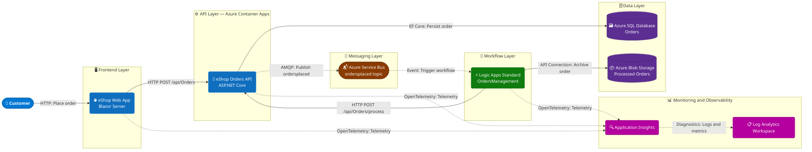

# Azure Logic Apps Monitoring Solution

[](LICENSE)
[](https://dotnet.microsoft.com)
[](https://learn.microsoft.com/azure/logic-apps/logic-apps-overview)
[](https://learn.microsoft.com/azure/developer/azure-developer-cli/)

## Description

The **Azure Logic Apps Monitoring Solution** is a reference implementation of a cloud-native eShop order management platform that demonstrates end-to-end integration and observability patterns on Azure. The solution orchestrates two microservices — a Blazor Server web application and an ASP.NET Core Orders API — deployed to Azure Container Apps, connected to Azure Logic Apps Standard workflows that process orders received from Azure Service Bus.

This solution addresses the challenge of monitoring event-driven workflows in distributed systems. By combining Azure Logic Apps Standard with Application Insights and a Log Analytics Workspace, operators gain full visibility into workflow execution, service-to-service call chains, and data flow from order placement through to archival in Azure Blob Storage — all without managing credentials through User Assigned Managed Identity.

The technology stack centers on **.NET 10**, Azure Logic Apps Standard, Azure Container Apps, Azure Service Bus, Entity Framework Core 9 with Azure SQL Database, and Bicep-based Infrastructure as Code provisioned end-to-end with the Azure Developer CLI (`azd`).

## Table of Contents

- [Features](#features)
- [Architecture](#architecture)
- [Technologies Used](#technologies-used)
- [Quick Start](#quick-start)
- [Configuration](#configuration)
- [Deployment](#deployment)
- [Usage](#usage)
- [Contributing](#contributing)
- [License](#license)

## Features

- 🛒 **Blazor Server web application** for browsing and placing eShop orders
- 🔌 **RESTful Orders API** (ASP.NET Core) with Swagger/OpenAPI documentation and health checks
- ⚡ **Logic Apps Standard workflows** (`OrdersPlacedProcess`, `OrdersPlacedCompleteProcess`) for automated order processing
- 📨 **Event-driven architecture** via Azure Service Bus `ordersplaced` topic and subscriptions
- 🗄️ **Azure SQL Database** persistence via Entity Framework Core 9 with resilience and retry policies
- 📦 **Azure Blob Storage** archival of successfully processed orders
- 📊 **Full observability** with Application Insights (OpenTelemetry) and Log Analytics Workspace
- 🐳 **Cloud-native hosting** on Azure Container Apps with Azure Container Registry
- 🔐 **Passwordless authentication** using User Assigned Managed Identity across all Azure services
- 🏗️ **Infrastructure as Code** with Bicep modules for every resource tier (network, identity, monitoring, data, workload)
- 🔄 **Local development** orchestrated by .NET Aspire with Service Bus emulator support
- 🧪 **Test projects** for AppHost integration, ServiceDefaults, and Orders API unit tests

## Architecture


```mermaid
---
config:
  htmlLabels: true
  fontFamily: "Segoe UI, Verdana, sans-serif"
---
flowchart LR
    %% ── Actors ───────────────────────────────────────────────────────────
    Customer(["👤 Customer"])

    %% ── Frontend Layer ───────────────────────────────────────────────────
    subgraph FrontendLayer["🖥️ Frontend Layer"]
        WebApp("🌐 eShop Web App<br/>Blazor Server")
    end

    %% ── API Layer ────────────────────────────────────────────────────────
    subgraph APILayer["⚙️ API Layer — Azure Container Apps"]
        OrdersAPI("🔌 eShop Orders API<br/>ASP.NET Core")
    end

    %% ── Messaging Layer ──────────────────────────────────────────────────
    subgraph MessagingLayer["📨 Messaging Layer"]
        ServiceBus(["📬 Azure Service Bus<br/>ordersplaced topic"])
    end

    %% ── Workflow Layer ───────────────────────────────────────────────────
    subgraph WorkflowLayer["🔄 Workflow Layer"]
        LogicApp("⚡ Logic Apps Standard<br/>OrdersManagement")
    end

    %% ── Data Layer ───────────────────────────────────────────────────────
    subgraph DataLayer["🗄️ Data Layer"]
        SQLDatabase[("🗃️ Azure SQL Database<br/>Orders")]
        BlobStorage[("📦 Azure Blob Storage<br/>Processed Orders")]
    end

    %% ── Monitoring Layer ─────────────────────────────────────────────────
    subgraph MonitoringLayer["📊 Monitoring and Observability"]
        AppInsights("🔍 Application Insights")
        LogAnalytics("📋 Log Analytics Workspace")
    end

    %% ── Interactions ─────────────────────────────────────────────────────
    Customer -->|"HTTP: Place order"| WebApp
    WebApp -->|"HTTP POST /api/Orders"| OrdersAPI
    OrdersAPI -->|"EF Core: Persist order"| SQLDatabase
    OrdersAPI -.->|"AMQP: Publish ordersplaced"| ServiceBus
    ServiceBus -.->|"Event: Trigger workflow"| LogicApp
    LogicApp -->|"HTTP POST /api/Orders/process"| OrdersAPI
    LogicApp -->|"API Connection: Archive order"| BlobStorage
    OrdersAPI -.->|"OpenTelemetry: Telemetry"| AppInsights
    WebApp -.->|"OpenTelemetry: Telemetry"| AppInsights
    LogicApp -.->|"OpenTelemetry: Telemetry"| AppInsights
    AppInsights -.->|"Diagnostics: Logs and metrics"| LogAnalytics

    %% ── Styles ───────────────────────────────────────────────────────────
    classDef actor fill:#0078D4,stroke:#005A9E,color:#FFFFFF,font-weight:bold
    classDef service fill:#106EBE,stroke:#0078D4,color:#FFFFFF
    classDef messaging fill:#8A3B00,stroke:#6B2E00,color:#FFFFFF
    classDef workflow fill:#107C10,stroke:#0C5E0C,color:#FFFFFF
    classDef datastore fill:#5C2E91,stroke:#442070,color:#FFFFFF
    classDef monitoring fill:#B4009E,stroke:#8B007A,color:#FFFFFF

    class Customer actor
    class WebApp,OrdersAPI service
    class ServiceBus messaging
    class LogicApp workflow
    class SQLDatabase,BlobStorage datastore
    class AppInsights,LogAnalytics monitoring
```

## Technologies Used

| Technology                     | Type          | Purpose                                               |
| ------------------------------ | ------------- | ----------------------------------------------------- |
| .NET 10.0                      | Runtime       | API and web application platform                      |
| ASP.NET Core                   | Framework     | Orders API REST backend                               |
| Blazor Server                  | Framework     | eShop Web App interactive UI                          |
| .NET Aspire                    | Orchestration | Local development orchestration and service discovery |
| Entity Framework Core 9        | ORM           | Azure SQL Database data access with resilience        |
| Microsoft Fluent UI v9         | UI Library    | Web App component library                             |
| Azure Logic Apps Standard      | Workflow      | Event-driven order processing workflows               |
| Azure Container Apps           | PaaS          | Hosting for all microservices                         |
| Azure Container Registry       | Service       | Container image storage and distribution              |
| Azure Service Bus (Standard)   | Messaging     | Decoupled order event delivery                        |
| Azure SQL Database             | Database      | Persistent order storage                              |
| Azure Blob Storage             | Storage       | Processed order archival                              |
| Application Insights           | Monitoring    | Distributed tracing and telemetry                     |
| Log Analytics Workspace        | Monitoring    | Centralized logs, metrics, and diagnostics            |
| Azure Virtual Network          | Networking    | Private network isolation for all services            |
| User Assigned Managed Identity | Security      | Passwordless authentication across Azure services     |
| Bicep                          | IaC           | Azure infrastructure provisioning                     |
| Azure Developer CLI (azd)      | Tooling       | End-to-end provisioning and deployment automation     |

## Quick Start

### Prerequisites

| Tool                                                                                                     | Minimum Version | Purpose                     |
| -------------------------------------------------------------------------------------------------------- | --------------- | --------------------------- |
| [Azure CLI](https://learn.microsoft.com/cli/azure/install-azure-cli)                                     | 2.60.0          | Azure resource management   |
| [Azure Developer CLI (azd)](https://learn.microsoft.com/azure/developer/azure-developer-cli/install-azd) | 1.11.0          | Deployment automation       |
| [.NET SDK](https://dotnet.microsoft.com/download/dotnet/10.0)                                            | 10.0.100        | Build and run .NET projects |
| [Docker](https://www.docker.com/products/docker-desktop)                                                 | Latest          | Container image builds      |

### Installation and Local Run

1. Clone the repository:

   ```bash
   git clone https://github.com/Evilazaro/Azure-LogicApps-Monitoring.git
   cd Azure-LogicApps-Monitoring
   ```

2. Restore dependencies:

   ```bash
   dotnet restore app.sln
   ```

3. Start the .NET Aspire AppHost for local development:

   ```bash
   dotnet run --project app.AppHost
   ```

4. Open the .NET Aspire Dashboard URL printed to the console to view running services, logs, and traces.

> [!NOTE]
> In local development mode, the Orders API connects to Service Bus only when `Azure:ServiceBus:HostName` is configured in user secrets. Without it, Service Bus publishing is skipped automatically.

## Configuration

The following options control infrastructure deployment via Bicep parameters (`infra/main.parameters.json`) and `azd` environment variables.

| Option                  | Default      | Description                                                                                  |
| ----------------------- | ------------ | -------------------------------------------------------------------------------------------- |
| `solutionName`          | `orders`     | Base name prefix applied to all Azure resource names                                         |
| `location`              | _(required)_ | Azure region for all resources (e.g., `eastus`, `westeurope`)                                |
| `envName`               | _(required)_ | Environment identifier: `dev`, `test`, `staging`, or `prod`                                  |
| `deployerPrincipalType` | `User`       | Deployer identity type: `User` for interactive login, `ServicePrincipal` for CI/CD           |
| `deployHealthModel`     | `true`       | Deploy Azure Monitor Health Model (requires tenant-level permissions; set `false` for CI/CD) |

**Example — override parameters for a CI/CD pipeline:**

```bash
azd env set AZURE_LOCATION eastus
azd env set AZURE_ENV_NAME staging
```

Or pass parameters directly to Bicep:

```bash
az deployment sub create \
  --location eastus \
  --template-file infra/main.bicep \
  --parameters location=eastus envName=dev solutionName=myshop deployHealthModel=false
```

> [!IMPORTANT]
> Set `deployerPrincipalType` to `ServicePrincipal` when deploying from GitHub Actions or other CI/CD systems to ensure correct RBAC role assignments.

## Deployment

Follow these steps to provision all Azure resources and deploy the application:

1. Authenticate with Azure:

   ```bash
   azd auth login
   ```

2. Create a new `azd` environment and set the target region:

   ```bash
   azd env new <env-name>
   azd env set AZURE_LOCATION <region>
   ```

3. Provision all infrastructure and deploy services in a single command:

   ```bash
   azd up
   ```

   `azd up` runs the full lifecycle: resource group creation, shared infrastructure (identity, monitoring, networking, SQL), workload infrastructure (Service Bus, Container Apps, Logic Apps), and application container deployments.

4. After deployment completes, `azd` outputs the public URLs for the eShop Web App and Orders API. Copy the Orders API URL and set it in the Logic App environment variable `ORDERS_API_URL` if not already resolved by the provisioning hooks.

5. To tear down all resources:

   ```bash
   azd down
   ```

> [!WARNING]
> `azd down` deletes all provisioned Azure resources, including the SQL Database and Blob Storage. Ensure any required data is backed up before running this command.

## Usage

### Access the eShop Web App

Open the Web App URL from `azd` output in a browser to browse and place orders.

### Explore the Orders API

The Orders API exposes a Swagger UI for interactive exploration:

```
https://<orders-api-url>/swagger
```

**Create an order via the API:**

```bash
curl -X POST https://<orders-api-url>/api/Orders \
  -H "Content-Type: application/json" \
  -d '{
    "customerId": "customer-001",
    "products": [
      { "productId": "prod-123", "quantity": 2, "unitPrice": 29.99 }
    ]
  }'
```

Expected response (HTTP 201):

```json
{
  "id": "3fa85f64-5717-4562-b3fc-2c963f66afa6",
  "customerId": "customer-001",
  "status": "Placed",
  "totalAmount": 59.98
}
```

### Generate Test Orders

Use the included PowerShell script to generate a batch of randomized orders for load testing and Logic Apps monitoring demonstration:

```powershell
.\hooks\Generate-Orders.ps1 -OrderCount 500 -MinProducts 1 -MaxProducts 5
```

This produces `infra/data/ordersBatch.json` compatible with Azure Logic Apps workflow triggers.

### Check Service Health

```bash
curl https://<orders-api-url>/health
```

Expected response:

```json
{ "status": "Healthy" }
```

### Monitor Workflows

Navigate to your resource group in the [Azure Portal](https://portal.azure.com) and open the **Logic App** resource to view workflow run history, trigger and action statuses, and linked Application Insights telemetry.

## Contributing

Contributions are welcome. To submit a change:

1. Fork the repository on GitHub.
2. Create a feature branch:

   ```bash
   git checkout -b feature/my-change
   ```

3. Commit your changes and open a pull request against the `main` branch. Include a clear description of the problem solved and steps to verify the change.
4. For bugs or feature requests, open an [issue](https://github.com/Evilazaro/Azure-LogicApps-Monitoring/issues) with a descriptive title and reproduction steps.

> [!TIP]
> Run `dotnet test app.sln` before opening a pull request to verify all existing tests pass.

## License

This project is licensed under the **MIT License**. See the [LICENSE](LICENSE) file for full terms.
