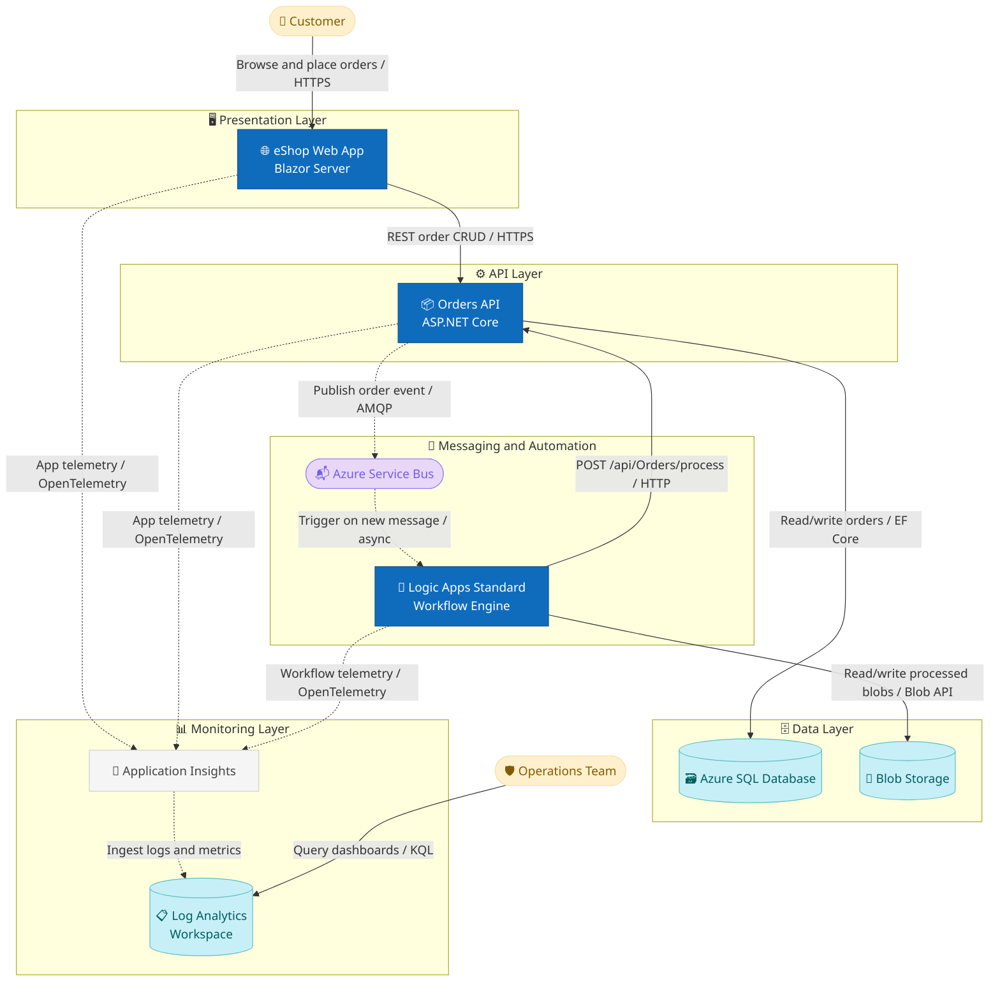

# Azure Logic Apps Monitoring

[](https://github.com/Evilazaro/Azure-LogicApps-Monitoring/actions/workflows/ci-dotnet.yml) [](https://github.com/Evilazaro/Azure-LogicApps-Monitoring/actions/workflows/azure-dev.yml) [](LICENSE) [](https://dotnet.microsoft.com/)

**Azure Logic Apps Monitoring** is a production-ready reference solution that demonstrates how to build, deploy, and monitor order-processing workflows using Azure Logic Apps Standard, ASP.NET Core, Blazor Server, and comprehensive Azure observability tooling — all orchestrated through .NET Aspire.

The solution addresses the challenge of building reliable, observable event-driven order pipelines on Azure. It pairs an eShop frontend and REST API with Azure Logic Apps Standard workflows that consume Service Bus messages, invoke the Orders API, and persist results to Azure Blob Storage — while Application Insights and Log Analytics provide end-to-end telemetry and operational dashboards.

The technology foundation combines .NET 10, Azure Container Apps, Azure SQL Database, Azure Service Bus, and Azure Blob Storage for the application tier, with Bicep and Azure Developer CLI (`azd`) managing infrastructure as code. GitHub Actions pipelines automate CI/CD with OIDC-based authentication and zero stored secrets.

## Table of Contents

- [Features](#features)
- [Architecture](#architecture)
- [Technologies Used](#technologies-used)
- [Quick Start](#quick-start)
- [Configuration](#configuration)
- [Deployment](#deployment)
- [Usage](#usage)
- [Contributing](#contributing)
- [License](#license)

## Features

- 📦 **RESTful Orders API** built with ASP.NET Core, persisting data to Azure SQL Database via Entity Framework Core with connection resiliency and automatic retry on failure
- 🌐 **Blazor Server frontend** for order browsing and management, using Microsoft Fluent UI v9 components with secure session management
- 🔄 **Logic Apps Standard workflows** that process incoming Service Bus messages, invoke the Orders API, and write outcomes to Azure Blob Storage
- 📬 **Event-driven messaging** via Azure Service Bus, decoupling order placement from order processing with AMQP transport
- 🔭 **End-to-end observability** with Application Insights OpenTelemetry instrumentation, distributed tracing, and Log Analytics dashboards
- 🏗️ **Infrastructure as Code** with modular Bicep templates deploying networking, identity, monitoring, messaging, and compute in a defined dependency order
- 🚀 **One-command deployment** using Azure Developer CLI (`azd up`) with automatic post-provisioning SQL managed identity configuration
- 🔐 **Zero-secret authentication** leveraging User-Assigned Managed Identity and OIDC federated credentials for all Azure resource access
- 🧪 **Multi-project test suite** covering AppHost, Orders API, and Web App with cross-platform CI on Ubuntu, Windows, and macOS
- ⚡ **Order generation tooling** via `Generate-Orders.ps1` for local testing and demonstration scenarios with up to 10,000 randomized orders

## Architecture

### Architecture Summary

Azure Logic Apps Monitoring is an event-driven order management platform. Customers interact with the **eShop Web App** (Blazor Server) to browse and place orders, which are forwarded to the **Orders API** (ASP.NET Core) for persistence in **Azure SQL Database**. The Orders API publishes order events to **Azure Service Bus**, triggering the **Logic Apps Standard** workflow engine. Logic Apps processes each order by calling the Orders API and writing results to **Azure Blob Storage**. All services emit OpenTelemetry telemetry to **Application Insights**, which feeds **Log Analytics Workspace** for centralized KQL-based querying by the **Operations Team**.


```mermaid
---
config:
  primaryColor: "#0f6cbd"
  primaryTextColor: "#FFFFFF"
  primaryBorderColor: "#0f548c"
  secondaryColor: "#ebf3fc"
  secondaryTextColor: "#242424"
  secondaryBorderColor: "#0f6cbd"
  tertiaryColor: "#f5f5f5"
  tertiaryTextColor: "#424242"
  tertiaryBorderColor: "#d1d1d1"
  noteBkgColor: "#fefbf4"
  noteTextColor: "#242424"
  noteBorderColor: "#f9e2ae"
  lineColor: "#616161"
  background: "#FFFFFF"
  edgeLabelBackground: "#FFFFFF"
  clusterBkg: "#fafafa"
  clusterBorder: "#e0e0e0"
  titleColor: "#242424"
  errorBkgColor: "#fdf3f4"
  errorTextColor: "#b10e1c"
  fontFamily: "Segoe UI, Verdana, sans-serif"
  fontSize: 16
  align: center
  description: "High-level architecture diagram showing actors, primary flows, and major components."
---
flowchart TB

  %% ── Actors ──────────────────────────────────────────────────────
  Customer(["👤 Customer"])
  OpsTeam(["🛡️ Operations Team"])

  %% ── Presentation Layer ───────────────────────────────────────────
  subgraph Presentation["🖥️ Presentation Layer"]
    WebApp["🌐 eShop Web App<br/>Blazor Server"]
  end

  %% ── API Layer ────────────────────────────────────────────────────
  subgraph APILayer["⚙️ API Layer"]
    OrdersAPI["📦 Orders API<br/>ASP.NET Core"]
  end

  %% ── Data Layer ───────────────────────────────────────────────────
  subgraph DataLayer["🗄️ Data Layer"]
    AzureSQL[("🗃️ Azure SQL Database")]
    BlobStorage[("📁 Blob Storage")]
  end

  %% ── Messaging and Automation ─────────────────────────────────────
  subgraph MessagingLayer["📨 Messaging and Automation"]
    ServiceBus(["📬 Azure Service Bus"])
    LogicApp["🔄 Logic Apps Standard<br/>Workflow Engine"]
  end

  %% ── Monitoring Layer ─────────────────────────────────────────────
  subgraph MonitoringLayer["📊 Monitoring Layer"]
    AppInsights["🔭 Application Insights"]
    LogAnalytics[("📋 Log Analytics<br/>Workspace")]
  end

  %% ── Interactions ─────────────────────────────────────────────────
  Customer -->|"Browse and place orders / HTTPS"| WebApp
  WebApp -->|"REST order CRUD / HTTPS"| OrdersAPI
  OrdersAPI -->|"Read/write orders / EF Core"| AzureSQL
  OrdersAPI -.->|"Publish order event / AMQP"| ServiceBus
  ServiceBus -.->|"Trigger on new message / async"| LogicApp
  LogicApp -->|"POST /api/Orders/process / HTTP"| OrdersAPI
  LogicApp -->|"Read/write processed blobs / Blob API"| BlobStorage
  WebApp -.->|"App telemetry / OpenTelemetry"| AppInsights
  OrdersAPI -.->|"App telemetry / OpenTelemetry"| AppInsights
  LogicApp -.->|"Workflow telemetry / OpenTelemetry"| AppInsights
  AppInsights -.->|"Ingest logs and metrics"| LogAnalytics
  OpsTeam -->|"Query dashboards / KQL"| LogAnalytics

  %% ── Class Definitions ────────────────────────────────────────────
  classDef actor fill:#fef0cd,stroke:#f9e2ae,color:#835b00
  classDef component fill:#0f6cbd,stroke:#0f548c,color:#FFFFFF
  classDef datastore fill:#c7eff8,stroke:#5dc0c0,color:#005e5e
  classDef external fill:#e9d7f7,stroke:#9b8af4,color:#7160e8
  classDef monitoring fill:#f5f5f5,stroke:#d1d1d1,color:#424242

  class Customer,OpsTeam actor
  class WebApp,OrdersAPI,LogicApp component
  class AzureSQL,BlobStorage,LogAnalytics datastore
  class ServiceBus external
  class AppInsights monitoring
```

> Solid arrows (`-->`) represent synchronous interactions; dashed arrows (`-.->`) represent asynchronous or event-driven interactions.

## Technologies Used

| Technology                | Type                   | Purpose                                                           |
| ------------------------- | ---------------------- | ----------------------------------------------------------------- |
| .NET 10 SDK               | Framework              | Runtime and SDK for all application projects                      |
| ASP.NET Core              | Framework              | Orders REST API with OpenAPI/Swagger documentation                |
| Blazor Server             | UI Framework           | eShop Web App with interactive server-side rendering              |
| Entity Framework Core 9   | ORM                    | Azure SQL Database access, migrations, and connection resiliency  |
| Microsoft Fluent UI v9    | UI Library             | Web App component library                                         |
| .NET Aspire               | Orchestration          | Local development orchestration and service discovery             |
| Azure Logic Apps Standard | Workflow Engine        | Automated order processing workflows                              |
| Azure Service Bus         | Messaging              | Asynchronous order event transport over AMQP                      |
| Azure SQL Database        | Relational Database    | Persistent order and product data storage                         |
| Azure Blob Storage        | Object Storage         | Processed and failed order artifact persistence                   |
| Application Insights      | APM / Monitoring       | Application telemetry, distributed tracing, and live metrics      |
| Log Analytics Workspace   | Log Aggregation        | Centralized log ingestion and KQL-based querying                  |
| Azure Container Apps      | Compute                | Hosts the Orders API and Web App containers                       |
| Azure Container Registry  | Container Registry     | Stores and serves container images for deployment                 |
| Bicep                     | Infrastructure as Code | Modular Azure infrastructure templates                            |
| Azure Developer CLI (azd) | CLI Tooling            | Provision infrastructure and deploy applications with one command |
| GitHub Actions            | CI/CD                  | Automated build, test, CodeQL scanning, and deployment pipelines  |

## Quick Start

### Prerequisites

| Tool                      | Minimum Version | Download                                                                                                                               |
| ------------------------- | --------------- | -------------------------------------------------------------------------------------------------------------------------------------- |
| .NET SDK                  | 10.0.100        | [dotnet.microsoft.com](https://dotnet.microsoft.com/download)                                                                          |
| Azure CLI                 | 2.60.0          | [learn.microsoft.com/cli/azure](https://learn.microsoft.com/cli/azure/install-azure-cli)                                               |
| Azure Developer CLI (azd) | 1.11.0          | [learn.microsoft.com/azure/developer/azure-developer-cli](https://learn.microsoft.com/azure/developer/azure-developer-cli/install-azd) |
| Docker                    | Latest stable   | [docs.docker.com/get-docker](https://docs.docker.com/get-docker/)                                                                      |
| PowerShell                | 7.0             | [learn.microsoft.com/powershell](https://learn.microsoft.com/powershell/scripting/install/installing-powershell)                       |

### Installation Steps

1. Clone the repository:

   ```bash
   git clone https://github.com/Evilazaro/Azure-LogicApps-Monitoring.git
   cd Azure-LogicApps-Monitoring
   ```

2. Validate your development workstation prerequisites:

   ```powershell
   ./hooks/check-dev-workstation.ps1
   ```

3. Authenticate with Azure:

   ```bash
   azd auth login
   ```

4. Create a new azd environment:

   ```bash
   azd env new <your-env-name>
   ```

5. Provision infrastructure and deploy the application:

   ```bash
   azd up
   ```

> [!NOTE]
> `azd up` automatically runs `./hooks/postprovision.ps1` after provisioning completes. This script configures .NET user secrets for local development and sets up Azure SQL managed identity access.

### Minimal Working Example

After deployment, place a test order by sending the following request to the Orders API:

```bash
curl -X POST https://<orders-api-url>/api/Orders \
  -H "Content-Type: application/json" \
  -d '{
    "id": "550e8400-e29b-41d4-a716-446655440000",
    "products": [
      { "id": "prod-001", "name": "Widget A", "price": 29.99, "quantity": 2 }
    ],
    "total": 59.98,
    "customerEmail": "buyer@example.com"
  }'
# Expected response: 201 Created with the order object
```

## Configuration

Configure the following options using .NET user secrets (local development) or environment variables (Azure deployment).

| Option                                  | Default | Description                                                                                  |
| --------------------------------------- | ------- | -------------------------------------------------------------------------------------------- |
| `ConnectionStrings__OrderDb`            | —       | SQL Server connection string for the Orders database                                         |
| `Azure__ServiceBus__HostName`           | —       | Azure Service Bus namespace hostname (e.g., `mybus.servicebus.windows.net`)                  |
| `Azure__TenantId`                       | —       | Azure AD tenant ID for local development authentication                                      |
| `Azure__ClientId`                       | —       | Azure AD client ID for local development authentication                                      |
| `ApplicationInsights__ConnectionString` | —       | Application Insights instrumentation connection string                                       |
| `services__orders-api__https__0`        | —       | Orders API base URL used by the Web App (set automatically by .NET Aspire service discovery) |

> [!TIP]
> Running `azd up` or `azd provision` followed by `azd deploy` automatically populates all required secrets via `postprovision.ps1`. Manual configuration is only necessary when bypassing `azd`.

### Example Override

Set a configuration value directly using .NET user secrets:

```bash
dotnet user-secrets set "Azure:ServiceBus:HostName" "mybus.servicebus.windows.net" \
  --project src/eShop.Orders.API/eShop.Orders.API.csproj
```

## Deployment

### Automated CI/CD (Recommended)

1. Fork the repository to your GitHub account.

2. Configure federated credentials in Azure Entra ID for passwordless OIDC authentication:

   ```powershell
   ./hooks/configure-federated-credential.ps1
   ```

3. Set the following GitHub repository variables in **Settings → Secrets and variables → Actions → Variables**:

   | Variable                | Description                                     |
   | ----------------------- | ----------------------------------------------- |
   | `AZURE_CLIENT_ID`       | Service principal or app registration client ID |
   | `AZURE_TENANT_ID`       | Azure AD tenant ID                              |
   | `AZURE_SUBSCRIPTION_ID` | Target Azure subscription ID                    |

4. Push a commit to the `main` branch to trigger the `azure-dev.yml` workflow. The pipeline provisions infrastructure, configures SQL managed identity, and deploys the application automatically.

> [!IMPORTANT]
> The Bicep templates deploy at subscription scope. Ensure you have `Contributor` or `Owner` rights on the target Azure subscription before triggering the workflow.

### Manual Deployment

1. Authenticate with both the Azure CLI and Azure Developer CLI:

   ```bash
   az login
   azd auth login
   ```

2. Create and configure an azd environment:

   ```bash
   azd env new dev
   azd env set AZURE_LOCATION eastus2
   ```

3. Provision the Azure infrastructure:

   ```bash
   azd provision
   ```

4. Deploy the application containers:

   ```bash
   azd deploy
   ```

> [!NOTE]
> To tear down all provisioned Azure resources, run `azd down`. This removes the resource group and all resources within it.

## Usage

### Generating Sample Orders

Use `Generate-Orders.ps1` to produce a batch of randomized sample orders for end-to-end testing and demonstration:

```powershell
./hooks/Generate-Orders.ps1 -OrderCount 100 -OutputPath ./infra/data/ordersBatch.json
```

Expected output:

```
[INFO] Generating 100 orders...
[INFO] Progress: 50 / 100 orders generated
[INFO] Progress: 100 / 100 orders generated
[INFO] Orders written to ./infra/data/ordersBatch.json
```

### Placing a Single Order via the API

Send a `POST` request to the Orders API to place an order. The API publishes the event to Azure Service Bus, triggering the `OrdersPlacedProcess` Logic App workflow:

```bash
POST https://<orders-api-url>/api/Orders
Content-Type: application/json

{
  "id": "550e8400-e29b-41d4-a716-446655440000",
  "products": [
    { "id": "prod-001", "name": "Widget A", "price": 29.99, "quantity": 1 }
  ],
  "total": 29.99,
  "customerEmail": "buyer@example.com"
}
```

The API returns `201 Created` with the created order object. The Logic App workflow then processes the order and writes the result to Azure Blob Storage under `/ordersprocessedsuccessfully/`.

### Retrieving All Orders

```bash
GET https://<orders-api-url>/api/Orders
Accept: application/json
# Returns 200 OK with a JSON array of all orders
```

### Monitoring Workflows in Application Insights

Navigate to your Application Insights resource in the Azure portal and use the **Logs** blade to run KQL queries. Example — count successfully placed orders per 5-minute window:

```kql
requests
| where cloud_RoleName == "orders-api"
| where resultCode == "201"
| summarize OrdersPlaced = count() by bin(timestamp, 5m)
| render timechart
```

Example — view Logic App workflow run telemetry:

```kql
traces
| where cloud_RoleName == "orders-api"
| where message contains "process"
| order by timestamp desc
| take 50
```

## Contributing

Community contributions are welcome. To submit a bug report or feature request, open an issue in the [GitHub Issues](https://github.com/Evilazaro/Azure-LogicApps-Monitoring/issues) tracker and include reproduction steps, environment details, and the expected versus actual behavior.

To contribute code changes:

1. Fork the repository.
2. Create a feature branch from `main`:

   ```bash
   git checkout -b feature/your-feature-name
   ```

3. Commit your changes following the existing code style and add tests for any new functionality.
4. Open a pull request against the `main` branch, describing the change and linking any related issues.

> [!NOTE]
> All pull requests must pass the CI pipeline (`ci-dotnet.yml`) — including build, test across Ubuntu/Windows/macOS, and CodeQL security scanning — before they can be merged.

## License

This project is licensed under the **MIT License**. See the [LICENSE](LICENSE) file for full details.
