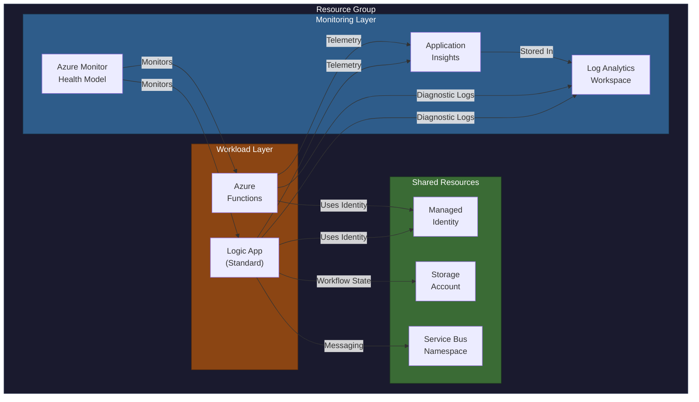
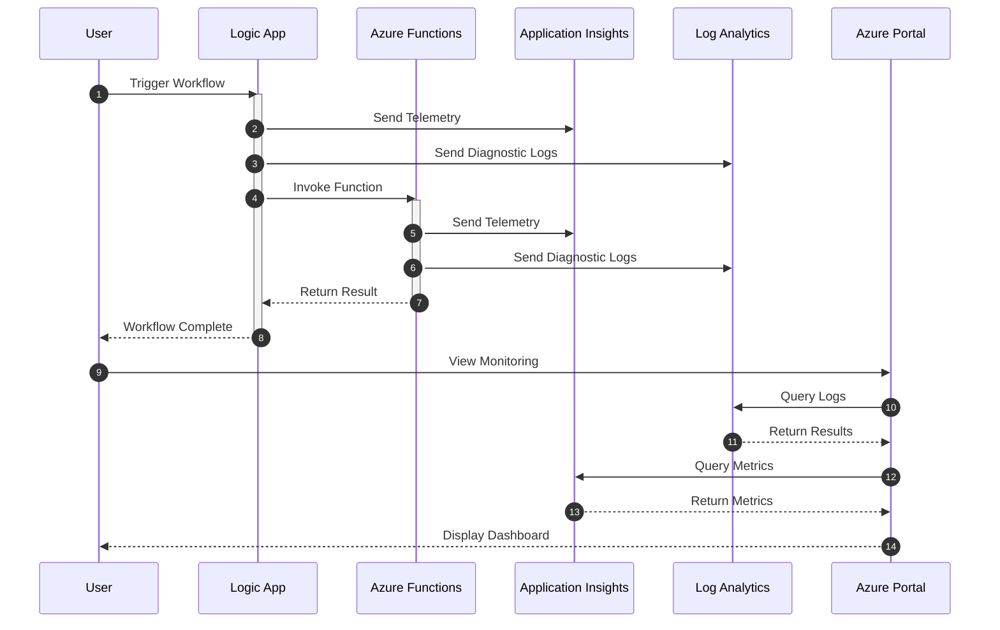

# Azure Logic Apps Monitoring

This project demonstrates Azure Monitor best practices for Logic Apps using Infrastructure as Code (IaC) with Bicep templates. It provides a comprehensive monitoring solution for beginner-to-intermediate developers and architects who want to implement observability patterns for Standard Logic Apps workflows.


## Prerequisites

Before deploying this solution, ensure you have the following:

- **Azure Subscription** with appropriate permissions to create resources
- **Azure Developer CLI (azd)** version 1.5.0 or later - [Installation Guide](https://learn.microsoft.com/azure/developer/azure-developer-cli/install-azd)
- **Azure CLI** version 2.50.0 or later - [Installation Guide](https://learn.microsoft.com/cli/azure/install-azure-cli)
- **Bicep CLI** version 0.20.0 or later (installed with Azure CLI)
- **VS Code** (recommended) with the following extensions:
  - Azure Logic Apps (Standard) extension
  - Bicep extension
  - Azure Account extension

## File Structure

```
Azure-LogicApps-Monitoring/
├── .azure/                          # Azure Developer CLI configuration
│   ├── config.json                  # Environment configuration
│   └── dev/                         # Development environment settings
├── infra/                           # Infrastructure as Code
│   ├── main.bicep                   # Root infrastructure template
│   ├── main.parameters.json         # Deployment parameters
│   └── main.json                    # Compiled ARM template
├── src/                             # Bicep modules
│   ├── monitoring/                  # Monitoring infrastructure
│   │   ├── main.bicep              # Monitoring orchestration
│   │   ├── log-analytics-workspace.bicep
│   │   ├── app-insights.bicep
│   │   └── azure-monitor-health-model.bicep
│   ├── shared/                      # Shared resources
│   │   ├── main.bicep              # Shared resources orchestration
│   │   ├── data/                   # Storage accounts
│   │   ├── identity/               # Managed identities
│   │   └── messaging/              # Service Bus resources
│   └── workload/                    # Application workload
│       ├── main.bicep              # Workload orchestration
│       ├── logic-app.bicep         # Logic App (Standard)
│       └── azure-function.bicep    # Azure Functions
├── tax-docs/                        # Sample Logic App workflow
│   ├── tax-processing/             # Tax processing workflow
│   │   └── workflow.json           # Workflow definition
│   ├── Artifacts/                  # Integration artifacts
│   │   ├── Maps/                   # Transform maps
│   │   ├── Rules/                  # Business rules
│   │   └── Schemas/                # XML/JSON schemas
│   └── connections.json            # API connections
├── azure.yaml                       # Azure Developer CLI project definition
└── README.md                        # This file
```

## Architecture

### System Architecture

The following diagram illustrates the high-level architecture of the monitoring solution:


```mermaid
flowchart TB
    subgraph rg["Resource Group"]
        subgraph monitoring["Monitoring Layer"]
            law["Log Analytics<br/>Workspace"]
            ai["Application<br/>Insights"]
            ahm["Azure Monitor<br/>Health Model"]
        end
        
        subgraph shared["Shared Resources"]
            mi["Managed<br/>Identity"]
            sa["Storage<br/>Account"]
            sb["Service Bus<br/>Namespace"]
        end
        
        subgraph workload["Workload Layer"]
            la["Logic App<br/>(Standard)"]
            af["Azure<br/>Functions"]
        end
    end
    
    la -->|Diagnostic Logs| law
    la -->|Telemetry| ai
    af -->|Diagnostic Logs| law
    af -->|Telemetry| ai
    la -->|Uses Identity| mi
    af -->|Uses Identity| mi
    la -->|Workflow State| sa
    la -->|Messaging| sb
    ahm -->|Monitors| la
    ahm -->|Monitors| af
    ai -->|Stored In| law
    
    style monitoring fill:#2E5C8A,stroke:#1A3A52,color:#FFFFFF
    style shared fill:#3A6B35,stroke:#1F3A1E,color:#FFFFFF
    style workload fill:#8B4513,stroke:#5C2D0A,color:#FFFFFF
    style rg fill:#1A1A2E,stroke:#16213E,color:#FFFFFF
```

### Data Flow

This sequence diagram shows how monitoring data flows through the system:


```mermaid
sequenceDiagram
    autonumber
    participant User
    participant LA as Logic App
    participant AF as Azure Functions
    participant AI as Application Insights
    participant LAW as Log Analytics
    participant Portal as Azure Portal
    
    User->>LA: Trigger Workflow
    activate LA
    LA->>AI: Send Telemetry
    LA->>LAW: Send Diagnostic Logs
    LA->>AF: Invoke Function
    activate AF
    AF->>AI: Send Telemetry
    AF->>LAW: Send Diagnostic Logs
    AF-->>LA: Return Result
    deactivate AF
    LA-->>User: Workflow Complete
    deactivate LA
    
    User->>Portal: View Monitoring
    Portal->>LAW: Query Logs
    LAW-->>Portal: Return Results
    Portal->>AI: Query Metrics
    AI-->>Portal: Return Metrics
    Portal-->>User: Display Dashboard
```

### Key Components

| Component | Description | Purpose | Key Features |
|-----------|-------------|---------|--------------|
| **Log Analytics Workspace** | Centralized log aggregation service | Collects and analyzes diagnostic logs and metrics from all resources | Custom retention policies, KQL queries, workbooks, cross-resource analysis |
| **Application Insights** | Application Performance Management (APM) service | Monitors application performance, availability, and usage patterns | Distributed tracing, dependency tracking, live metrics, smart detection |
| **Azure Monitor Health Model** | Proactive health monitoring | Tracks resource health and availability | Health status monitoring, alert rules, action groups, metric alerts |
| **Logic App (Standard)** | Workflow orchestration engine | Executes business process workflows | Stateful/stateless workflows, built-in connectors, custom actions |
| **Azure Functions** | Serverless compute platform | Executes event-driven code | HTTP triggers, timer triggers, integration with Logic Apps |
| **Managed Identity** | Azure AD identity for resources | Enables secure authentication without credentials | System-assigned identity, RBAC integration, keyless authentication |
| **Storage Account** | Blob and file storage | Stores workflow state and artifacts | Workflow history, checkpoint data, integration artifacts |
| **Service Bus** | Enterprise messaging service | Enables reliable message-based communication | Queues, topics, dead-letter handling, session support |

### RBAC Roles

| Role Name | Description | Documentation Link |
|-----------|-------------|--------------------|
| **Storage Blob Data Contributor** | Read, write, and delete Azure Storage containers and blobs | [Learn More](https://learn.microsoft.com/azure/role-based-access-control/built-in-roles#storage-blob-data-contributor) |
| **Azure Service Bus Data Owner** | Full access to Azure Service Bus resources | [Learn More](https://learn.microsoft.com/azure/role-based-access-control/built-in-roles#azure-service-bus-data-owner) |
| **Monitoring Metrics Publisher** | Enables publishing metrics to Azure Monitor | [Learn More](https://learn.microsoft.com/azure/role-based-access-control/built-in-roles#monitoring-metrics-publisher) |

## Features

### Comprehensive Monitoring

This solution implements a full-stack observability approach that captures metrics, logs, and traces across all components. The monitoring infrastructure provides real-time visibility into workflow execution, performance bottlenecks, and system health.

**Benefits and Best Practices Applied:**
- **Centralized Logging**: All diagnostic logs flow into a single Log Analytics Workspace, enabling cross-resource correlation
- **Retention Management**: Configurable log retention policies balance cost and compliance requirements
- **Query Optimization**: Pre-configured KQL queries accelerate troubleshooting and analysis
- **Workspace-based Application Insights**: Modern architecture that unifies telemetry storage and querying

| Feature | Description | Implementation | Configuration |
|---------|-------------|----------------|---------------|
| **Log Analytics Workspace** | Centralized repository for all logs and metrics | Deployed via [src/monitoring/log-analytics-workspace.bicep](src/monitoring/log-analytics-workspace.bicep) | 30-day retention, Pay-As-You-Go pricing tier |
| **Application Insights** | APM solution for workflow telemetry | Deployed via [src/monitoring/app-insights.bicep](src/monitoring/app-insights.bicep) | Workspace-based, integrated with Log Analytics |
| **Diagnostic Settings** | Automated log forwarding configuration | Configured in [src/workload/logic-app.bicep](src/workload/logic-app.bicep) | Captures WorkflowRuntime and FunctionAppLogs categories |
| **Health Model** | Proactive resource health monitoring | Deployed via [src/monitoring/azure-monitor-health-model.bicep](src/monitoring/azure-monitor-health-model.bicep) | Metric alerts and action groups |

### Metrics & Telemetry

The solution captures comprehensive performance metrics and execution telemetry to enable data-driven optimization. Real-time metrics help identify performance degradation before it impacts users.

**Benefits and Best Practices Applied:**
- **End-to-End Tracing**: Distributed tracing across Logic Apps and Azure Functions provides complete request visibility
- **Custom Metrics**: Extensible telemetry framework supports business-specific metrics
- **Performance Baselines**: Historical metric data enables anomaly detection and capacity planning
- **Live Monitoring**: Real-time metric streams support operational troubleshooting

| Feature | Description | Metrics Captured | Query Location |
|---------|-------------|------------------|----------------|
| **Workflow Execution Metrics** | Track workflow runs, success rates, and durations | RunsStarted, RunsCompleted, RunsFailed, RunDuration | Application Insights > Metrics |
| **Action-Level Telemetry** | Monitor individual action performance | ActionStarted, ActionCompleted, ActionFailed, ActionDuration | Log Analytics > Logs |
| **Dependency Tracking** | Monitor external service calls | HTTP requests, Service Bus operations, Storage operations | Application Insights > Application Map |
| **Resource Utilization** | Track compute and storage consumption | CPU percentage, memory usage, request count, storage used | Azure Monitor > Metrics |

### Security & Compliance

The solution implements defense-in-depth security patterns with managed identities, RBAC, and network isolation capabilities. All authentication uses Azure AD (Entra ID) identities without storing credentials.

**Benefits and Best Practices Applied:**
- **Zero Credentials**: Managed identities eliminate the need for connection strings or keys
- **Least Privilege**: RBAC assignments grant only required permissions to each resource
- **Audit Trail**: All access and operations are logged for compliance and forensics
- **Secure by Default**: Templates enforce TLS 1.2+, HTTPS-only, and secure storage configurations

| Feature | Description | Implementation | Security Benefit |
|---------|-------------|----------------|------------------|
| **Managed Identity** | System-assigned identity for keyless authentication | Deployed via [src/shared/identity/main.bicep](src/shared/identity/main.bicep) | Eliminates credential storage and rotation |
| **RBAC Integration** | Fine-grained access control | Configured in workload and shared modules | Enforces least-privilege access |
| **Diagnostic Log Encryption** | At-rest encryption for all logs | Enabled in Log Analytics Workspace | Protects sensitive telemetry data |
| **Network Isolation** | (Planned) Virtual network integration | Not yet implemented | Restricts traffic to private endpoints |

### Infrastructure as Code

The entire solution deploys through Bicep templates, enabling repeatable, version-controlled infrastructure deployments. Modular architecture supports customization and multi-environment strategies.

**Benefits and Best Practices Applied:**
- **Modular Design**: Reusable Bicep modules enable component-level deployment and testing
- **Parameter-Driven**: Environment-specific values externalized for dev/uat/prod workflows
- **Idempotent Deployments**: Safe to re-run deployments without causing resource duplication
- **Type Safety**: Bicep's strongly-typed language prevents common configuration errors

| Feature | Description | Location | Deployment Scope |
|---------|-------------|----------|------------------|
| **Modular Templates** | Separated concerns for monitoring, shared, and workload resources | [src/monitoring](src/monitoring), [src/shared](src/shared), [src/workload](src/workload) | Resource group level |
| **Azure Developer CLI Support** | Simplified deployment workflow with azd commands | [azure.yaml](azure.yaml) | Project level |
| **Parameter Files** | Environment-specific configuration | [infra/main.parameters.json](infra/main.parameters.json) | Multi-environment |
| **Dependency Management** | Explicit resource dependencies for proper sequencing | Defined in all .bicep files | Deployment order |

## Installation & Setup

### Clone the Repository

Clone this repository to your local development environment:

```bash
git clone https://github.com/your-org/Azure-LogicApps-Monitoring.git
cd Azure-LogicApps-Monitoring
```

### Login to Azure

Authenticate with Azure using the Azure Developer CLI:

```bash
azd auth login
```

**Expected Output**: A browser window will open for Azure authentication. After successful login, you'll see a confirmation message in the terminal.

### Initialize Environment

Initialize a new environment for your deployment:

```bash
azd init
```

**Expected Output**: You'll be prompted to enter an environment name (e.g., "dev", "uat", "prod"). The CLI will create configuration files in the `.azure/{environment-name}` directory.

### Provision Infrastructure

Deploy all Azure resources to your subscription:

```bash
azd provision
```

**Expected Output**: The CLI will:
1. Prompt you to select an Azure subscription
2. Prompt you to select an Azure region
3. Display the resources being created
4. Show deployment progress
5. Display resource group name and deployed resources upon completion

The deployment typically takes 5-10 minutes. You can monitor progress in the Azure Portal under "Deployments" in your resource group.

## Usage Examples

### Viewing Dashboards

#### Azure Portal Navigation

1. Navigate to the [Azure Portal](https://portal.azure.com)
2. Select **Resource Groups** from the left navigation menu
3. Click on your resource group (name format: `rg-{environmentName}`)
4. Locate the **Log Analytics Workspace** resource
5. Click **Logs** in the left menu to open the query editor
6. Select **Workbooks** to view pre-configured dashboards

#### CLI Command

Open the Azure Portal directly to your resource group:

```bash
az group show --name rg-<your-environment-name> --query id -o tsv | xargs -I {} az portal dashboard show --resource-group-id {}
```

### Log Analytics Queries

#### Track Workflow Execution Status

This query retrieves the status of all workflow runs in the last 24 hours:

```kql
AzureDiagnostics
| where ResourceProvider == "MICROSOFT.WEB"
| where Category == "WorkflowRuntime"
| where OperationName == "Microsoft.Logic/workflows/workflowRunCompleted"
| extend workflowName = tostring(split(resource_workflowName_s, '/')[1])
| extend status = tostring(status_s)
| extend startTime = startTime_t
| extend endTime = endTime_t
| extend duration = datetime_diff('second', endTime, startTime)
| where startTime >= ago(24h)
| project 
    TimeGenerated,
    workflowName,
    status,
    duration,
    resource_runId_s
| order by TimeGenerated desc
```

**Purpose**: Identify failed workflows, track completion rates, and analyze execution patterns.

#### Track Performance Metrics

This query analyzes workflow action durations to identify performance bottlenecks:

```kql
AzureDiagnostics
| where ResourceProvider == "MICROSOFT.WEB"
| where Category == "WorkflowRuntime"
| where OperationName has "ActionCompleted"
| extend workflowName = tostring(split(resource_workflowName_s, '/')[1])
| extend actionName = resource_actionName_s
| extend duration = todouble(resource_duration_d)
| where TimeGenerated >= ago(24h)
| summarize 
    avg(duration) as AvgDuration,
    max(duration) as MaxDuration,
    min(duration) as MinDuration,
    count() as ExecutionCount
    by workflowName, actionName
| where AvgDuration > 1000  // Actions taking more than 1 second
| order by AvgDuration desc
```

**Purpose**: Optimize workflow performance by identifying slow actions and setting performance baselines.

#### Monitor Failed Actions with Error Details

This query provides detailed error information for failed workflow actions:

```kql
AzureDiagnostics
| where ResourceProvider == "MICROSOFT.WEB"
| where Category == "WorkflowRuntime"
| where status_s == "Failed"
| extend workflowName = tostring(split(resource_workflowName_s, '/')[1])
| extend actionName = resource_actionName_s
| extend errorCode = error_code_s
| extend errorMessage = error_message_s
| where TimeGenerated >= ago(7d)
| project 
    TimeGenerated,
    workflowName,
    actionName,
    errorCode,
    errorMessage,
    resource_runId_s
| order by TimeGenerated desc
```

**Purpose**: Troubleshoot workflow failures by examining error patterns and root causes.

## Additional Resources

- **Azure Logic Apps Documentation**: [https://learn.microsoft.com/azure/logic-apps/](https://learn.microsoft.com/azure/logic-apps/)
- **Monitor Logic Apps Overview**: [https://learn.microsoft.com/azure/logic-apps/monitor-logic-apps-overview](https://learn.microsoft.com/azure/logic-apps/monitor-logic-apps-overview)
- **Azure Monitor Documentation**: [https://learn.microsoft.com/azure/azure-monitor/](https://learn.microsoft.com/azure/azure-monitor/)
- **Application Insights for Logic Apps**: [https://learn.microsoft.com/azure/logic-apps/monitor-workflows-collect-diagnostic-data](https://learn.microsoft.com/azure/logic-apps/monitor-workflows-collect-diagnostic-data)
- **Bicep Documentation**: [https://learn.microsoft.com/azure/azure-resource-manager/bicep/](https://learn.microsoft.com/azure/azure-resource-manager/bicep/)
- **Azure Developer CLI**: [https://learn.microsoft.com/azure/developer/azure-developer-cli/](https://learn.microsoft.com/azure/developer/azure-developer-cli/)
- **KQL Query Language**: [https://learn.microsoft.com/azure/data-explorer/kusto/query/](https://learn.microsoft.com/azure/data-explorer/kusto/query/)
- **Logic Apps Monitoring Best Practices**: [https://learn.microsoft.com/azure/logic-apps/monitor-logic-apps](https://learn.microsoft.com/azure/logic-apps/monitor-logic-apps)

---

**License**: This project is licensed under the MIT License - see the [LICENSE.md](LICENSE.md) file for details.

**Contributing**: Contributions are welcome! Please read [CONTRIBUTING.md](CONTRIBUTING.md) for details on our code of conduct and the process for submitting pull requests.

**Security**: For security concerns, please review our [SECURITY.md](SECURITY.md) policy.