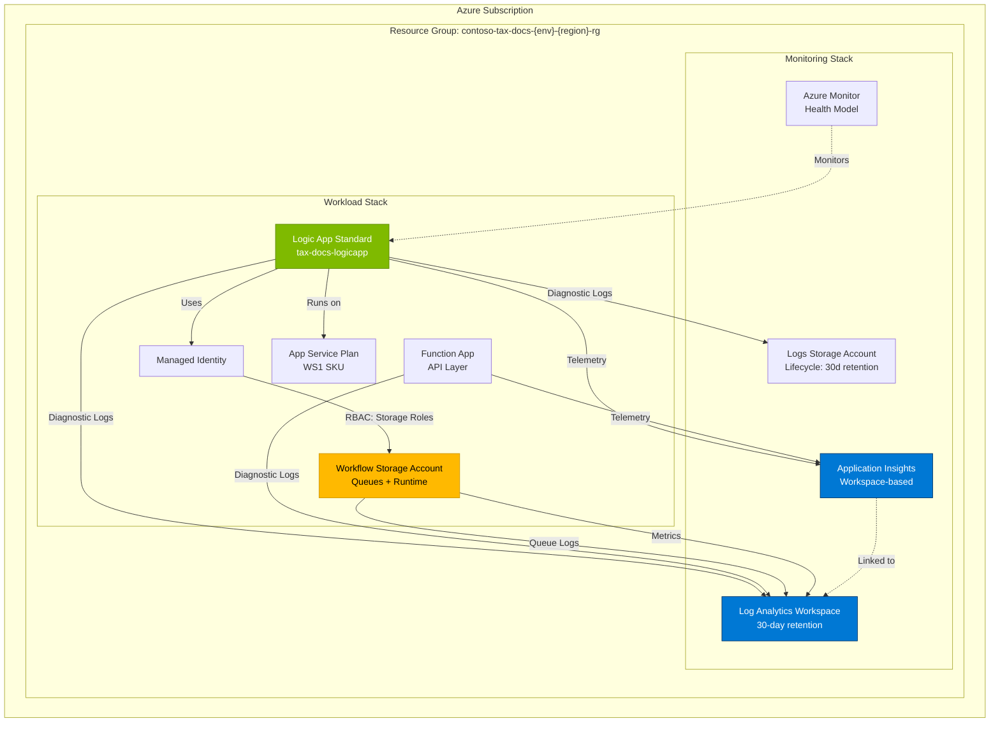
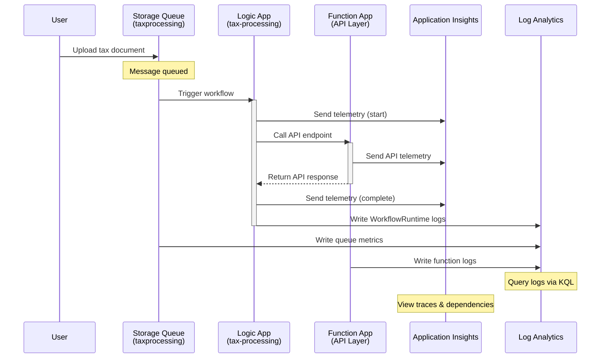

# Azure Logic Apps Monitoring Solution

A comprehensive, production-ready monitoring infrastructure for Azure Logic Apps Standard using Application Insights, Log Analytics, and Azure Monitor. This solution demonstrates enterprise-grade observability patterns aligned with the [Azure Well-Architected Framework](https://learn.microsoft.com/en-us/azure/well-architected/) operational excellence pillar.

[](LICENSE.md)
[](https://azure.microsoft.com/en-us/products/logic-apps/)
[](https://learn.microsoft.com/en-us/azure/azure-resource-manager/bicep/)

## 📋 Table of Contents

- Project Overview
- Target Audience
- Features
- Architecture
- Dataflow
- Prerequisites
- Installation & Deployment
- Usage Examples
- Contributing
- License
- References

## Project Overview

This open-source project delivers a complete monitoring solution for Azure Logic Apps Standard, implementing Azure Monitor best practices through Infrastructure as Code (IaC). It automates the deployment of observability infrastructure including Log Analytics workspaces, Application Insights, diagnostic settings, and storage accounts for long-term log retention.

**What This Solution Provides:**
- ✅ End-to-end observability for Logic Apps workflows
- ✅ Automated infrastructure deployment via Bicep templates
- ✅ Production-ready configurations following Azure best practices
- ✅ Cost-optimized log retention with lifecycle policies
- ✅ Security-first approach with managed identities and TLS enforcement

**Use Case:** Tax document processing workflow that demonstrates monitoring patterns applicable to any Logic Apps Standard implementation.

## Target Audience

This solution is designed for:

- **Platform Engineers** managing Logic Apps infrastructure and seeking observability automation
- **DevOps Teams** implementing monitoring solutions for workflow orchestration
- **Cloud Architects** designing enterprise-grade monitoring architectures
- **Developers** learning Azure Monitor best practices through practical examples
- **Organizations** adopting Logic Apps Standard for business-critical processes

**Skill Level:** Beginner to intermediate knowledge of Azure services recommended. Familiarity with Infrastructure as Code concepts helpful but not required.

## Features

### 🔍 Comprehensive Monitoring Stack

Implements [Azure Monitor best practices](https://learn.microsoft.com/en-us/azure/azure-monitor/best-practices) with:

- **Application Insights** for distributed tracing and performance telemetry
  - *Well-Architected Pillar:* Performance Efficiency
  - *Benefit:* Real-time application performance monitoring with automatic dependency tracking
- **Log Analytics Workspace** with configurable retention (default: 30 days)
  - *Well-Architected Pillar:* Operational Excellence
  - *Benefit:* Centralized log aggregation with powerful KQL query capabilities
- **Diagnostic Settings** for all Azure resources
  - *Well-Architected Pillar:* Reliability
  - *Benefit:* Comprehensive resource-level telemetry for troubleshooting
- **Storage Accounts** for long-term log archival
  - *Well-Architected Pillar:* Cost Optimization
  - *Benefit:* Lifecycle policies automatically tier cold logs to reduce costs

### 🏗️ Infrastructure as Code

Fully automated deployment using [Bicep templates](https://learn.microsoft.com/en-us/azure/azure-resource-manager/bicep/):

- Modular architecture for easy customization (see `infra/main.bicep`)
- Environment-based configuration (dev/uat/prod) via main.parameters.json
- Consistent resource naming and tagging strategy
- Idempotent deployments supporting CI/CD pipelines

### 🔒 Production-Ready Security

Aligned with [Azure Security Best Practices](https://learn.microsoft.com/en-us/azure/security/fundamentals/best-practices-and-patterns):

- **Managed Identity** authentication for secure, credential-free access (see `src/workload/logic-app.bicep`)
- **TLS 1.2+** enforcement across all resources
- **Network Security** with Azure Services bypass for firewall rules
- **Role-Based Access Control (RBAC)** with least-privilege permissions

### 📊 Observable Workflows

Complete visibility into Logic Apps execution:

- **Workflow Runtime Logs** capture execution details, failures, and performance metrics
- **Storage Queue Monitoring** tracks message processing for queue-triggered workflows
- **Function App Telemetry** for API integrations (see `src/workload/azure-function.bicep`)
- **Health Model Integration** with Azure Monitor for service topology visualization

## Architecture


```mermaid
graph TB
    subgraph "Azure Subscription"
        subgraph "Resource Group: contoso-tax-docs-{env}-{region}-rg"
            subgraph "Monitoring Stack"
                LAW[Log Analytics Workspace<br/>30-day retention]
                AI[Application Insights<br/>Workspace-based]
                LogsSA[Logs Storage Account<br/>Lifecycle: 30d retention]
                Health[Azure Monitor<br/>Health Model]
            end
            
            subgraph "Workload Stack"
                LA[Logic App Standard<br/>tax-docs-logicapp]
                ASP[App Service Plan<br/>WS1 SKU]
                FA[Function App<br/>API Layer]
                WorkflowSA[Workflow Storage Account<br/>Queues + Runtime]
                MI[Managed Identity]
            end
        end
    end
    
    LA -->|Telemetry| AI
    LA -->|Diagnostic Logs| LAW
    LA -->|Diagnostic Logs| LogsSA
    FA -->|Telemetry| AI
    FA -->|Diagnostic Logs| LAW
    WorkflowSA -->|Queue Logs| LAW
    WorkflowSA -->|Metrics| LAW
    
    MI -->|RBAC: Storage Roles| WorkflowSA
    LA -->|Uses| MI
    LA -->|Runs on| ASP
    
    AI -.->|Linked to| LAW
    Health -.->|Monitors| LA
    
    style LAW fill:#0078D4,stroke:#003366,color:#fff
    style AI fill:#0078D4,stroke:#003366,color:#fff
    style LA fill:#7FBA00,stroke:#5A8700,color:#fff
    style WorkflowSA fill:#FFB900,stroke:#CC9300,color:#000
```

**Key Components:**

- **Monitoring Stack** (`src/monitoring/main.bicep`): Centralized observability infrastructure
- **Workload Stack** (`src/workload/main.bicep`): Logic Apps and supporting services
- **Managed Identity**: Enables secure, passwordless authentication to Azure resources

## Dataflow


```mermaid
sequenceDiagram
    participant User
    participant Queue as Storage Queue<br/>(taxprocessing)
    participant LA as Logic App<br/>(tax-processing)
    participant FA as Function App<br/>(API Layer)
    participant AI as Application Insights
    participant LAW as Log Analytics

    User->>Queue: Upload tax document
    Note over Queue: Message queued
    Queue->>LA: Trigger workflow
    activate LA
    LA->>AI: Send telemetry (start)
    LA->>FA: Call API endpoint
    activate FA
    FA->>AI: Send API telemetry
    FA-->>LA: Return API response
    deactivate FA
    LA->>AI: Send telemetry (complete)
    LA->>LAW: Write WorkflowRuntime logs
    deactivate LA
    
    Queue->>LAW: Write queue metrics
    FA->>LAW: Write function logs
    
    Note over LAW: Query logs via KQL
    Note over AI: View traces & dependencies
```

**Monitoring Flow:**

1. **Workflow Trigger**: Storage queue message initiates Logic App execution
2. **Telemetry Collection**: Application Insights captures distributed traces
3. **Log Aggregation**: Diagnostic settings route logs to Log Analytics
4. **Query & Analysis**: Platform teams use KQL queries for insights
5. **Alerting** (not shown): Configure alerts based on log queries or metrics

## Prerequisites

### Required Tools

| Tool | Minimum Version | Purpose | Installation Guide |
|------|----------------|---------|-------------------|
| [Azure CLI](https://learn.microsoft.com/en-us/cli/azure/install-azure-cli) | 2.50.0 | Azure resource management | [Install Guide](https://learn.microsoft.com/en-us/cli/azure/install-azure-cli) |
| [Azure Developer CLI](https://learn.microsoft.com/en-us/azure/developer/azure-developer-cli/install-azd) | 1.5.0 | Simplified deployment orchestration | [Install Guide](https://learn.microsoft.com/en-us/azure/developer/azure-developer-cli/install-azd) |
| [Visual Studio Code](https://code.visualstudio.com/) | Latest | IDE for development | [Download](https://code.visualstudio.com/download) |
| [Git](https://git-scm.com/) | 2.x | Version control | [Download](https://git-scm.com/downloads) |

**VS Code Extensions (Recommended):**
- [Azure Logic Apps (Standard)](https://marketplace.visualstudio.com/items?itemName=ms-azuretools.vscode-azurelogicapps)
- [Azure Functions](https://marketplace.visualstudio.com/items?itemName=ms-azuretools.vscode-azurefunctions)
- [Bicep](https://marketplace.visualstudio.com/items?itemName=ms-azuretools.vscode-bicep)

### Azure Requirements

- **Active Azure Subscription** with Owner or Contributor permissions
- **Resource Providers** registered:
  ```bash
  # Check and register required providers
  az provider register --namespace Microsoft.Logic
  az provider register --namespace Microsoft.Web
  az provider register --namespace Microsoft.Storage
  az provider register --namespace Microsoft.Insights
  az provider register --namespace Microsoft.OperationalInsights
  az provider register --namespace Microsoft.Management
  ```

### Local Development (Optional)

For testing workflows locally:

- [Azure Functions Core Tools](https://learn.microsoft.com/en-us/azure/azure-functions/functions-run-local) v4.x
- [Azurite](https://learn.microsoft.com/en-us/azure/storage/common/storage-use-azurite) for storage emulation

## Installation & Deployment

### Step 1: Clone the Repository

```bash
git clone https://github.com/yourusername/Azure-LogicApps-Monitoring.git
cd Azure-LogicApps-Monitoring
```

### Step 2: Authenticate with Azure

```bash
# Login to Azure
az login

# Set your subscription (if you have multiple)
az account set --subscription "your-subscription-name-or-id"

# Verify your subscription
az account show --output table
```

### Step 3: Configure Environment Variables

Create environment-specific configuration in the .azure directory:

```bash
# Create dev environment configuration
mkdir -p .azure/dev

# Set environment variables
cat > .azure/dev/.env << EOF
AZURE_ENV_NAME=dev
AZURE_LOCATION=eastus
EOF
```

**Supported Environments:**
- `dev`: Development environment with relaxed settings
- `uat`: User acceptance testing with production-like configuration
- `prod`: Production environment with strict governance

### Step 4: Deploy Infrastructure

#### Option A: Using Azure Developer CLI (Recommended)

```bash
# Initialize Azure Developer CLI environment
azd auth login
azd init

# Set deployment parameters
azd env new dev
azd env set AZURE_LOCATION eastus
azd env set AZURE_ENV_NAME dev

# Deploy all infrastructure and application
azd up
```

The `azd up` command will:
1. Provision all Azure resources via Bicep templates
2. Configure diagnostic settings and monitoring
3. Deploy the Logic App workflow definitions
4. Output connection details for monitoring

#### Option B: Using Azure CLI with Bicep

```bash
# Deploy infrastructure
az deployment sub create \
  --name "tax-docs-monitoring-$(date +%Y%m%d-%H%M%S)" \
  --location eastus \
  --template-file ./infra/main.bicep \
  --parameters ./infra/main.parameters.json \
  --parameters envName=dev location=eastus
```

**Expected Deployment Time:** 5-10 minutes

### Step 5: Verify Deployment

Retrieve deployment outputs to confirm successful provisioning:

```bash
# Get deployment outputs
az deployment sub show \
  --name "your-deployment-name" \
  --query "properties.outputs" \
  --output table
```

**Key Outputs:**

| Output Variable | Description | Usage |
|----------------|-------------|-------|
| `LOGIC_APP_NAME` | Name of deployed Logic App | Access workflows in Azure Portal |
| `AZURE_APPLICATION_INSIGHTS_NAME` | Application Insights instance | View telemetry and traces |
| `AZURE_LOG_ANALYTICS_WORKSPACE_NAME` | Log Analytics workspace | Run KQL queries |
| `RESOURCE_GROUP_NAME` | Resource group name | Manage resources |

### Step 6: Deploy Workflow Code

Deploy the Logic App workflow definitions from the tax-docs directory:

```bash
cd tax-docs

# Deploy using Azure Functions Core Tools
func azure functionapp publish <LOGIC_APP_NAME>
```

**Alternatively**, use the VS Code Azure Logic Apps extension:
1. Right-click the tax-docs folder in VS Code
2. Select **"Deploy to Logic App..."**
3. Choose your deployed Logic App

## Usage Examples

### Accessing Monitoring Data

#### 1. View Application Insights Telemetry

Navigate to Application Insights in the Azure Portal:

```bash
# Open Application Insights in browser
az monitor app-insights component show \
  --app <AZURE_APPLICATION_INSIGHTS_NAME> \
  --resource-group <RESOURCE_GROUP_NAME> \
  --query "appId" -o tsv
```

**Key Metrics Dashboard:**
- **Application Map**: Visualize dependencies between Logic Apps, Function Apps, and external services
- **Live Metrics**: Real-time telemetry stream for active workflows
- **Failures**: Exception tracking and failure analysis
- **Performance**: Response times and throughput metrics

#### 2. Query Workflow Execution Logs

Access Log Analytics workspace to run KQL queries. Navigate to:
**Azure Portal → Log Analytics Workspace → Logs**

##### Example 1: Workflow Execution Summary

```kql
// Query: Summarize workflow executions by status (last 24 hours)
WorkflowRuntime
| where TimeGenerated > ago(24h)
| where OperationName contains "workflow"
| summarize 
    TotalRuns = count(),
    SuccessfulRuns = countif(Status == "Succeeded"),
    FailedRuns = countif(Status == "Failed"),
    AvgDurationMs = avg(DurationMs)
    by WorkflowName
| extend SuccessRate = round((SuccessfulRuns * 100.0) / TotalRuns, 2)
| project WorkflowName, TotalRuns, SuccessfulRuns, FailedRuns, SuccessRate, AvgDurationMs
| order by TotalRuns desc
```

**Sample Output:**

| WorkflowName | TotalRuns | SuccessfulRuns | FailedRuns | SuccessRate | AvgDurationMs |
|--------------|-----------|----------------|------------|-------------|---------------|
| tax-processing | 1,247 | 1,198 | 49 | 96.07% | 2,345.67 |

##### Example 2: Failed Workflow Investigations

```kql
// Query: Analyze workflow failures with error details
WorkflowRuntime
| where TimeGenerated > ago(1h)
| where Status == "Failed"
| project 
    TimeGenerated,
    WorkflowName,
    RunId = tostring(Properties.runId),
    ErrorCode = tostring(Properties.error.code),
    ErrorMessage = tostring(Properties.error.message),
    TriggerName = tostring(Properties.trigger.name)
| order by TimeGenerated desc
| take 20
```

**Sample Output:**

| TimeGenerated | WorkflowName | RunId | ErrorCode | ErrorMessage | TriggerName |
|---------------|--------------|-------|-----------|--------------|-------------|
| 2025-01-15T14:23:45Z | tax-processing | 08584567... | ActionFailed | HTTP 500 from API | manual |
| 2025-01-15T14:20:12Z | tax-processing | 08584566... | Timeout | Action timeout after 120s | recurrence |

##### Example 3: Storage Queue Monitoring

```kql
// Query: Monitor storage queue operations for workflow triggers
StorageQueueLogs
| where TimeGenerated > ago(1h)
| where AccountName contains "taxdocs"
| where QueueName == "taxprocessing"
| summarize 
    MessageCount = count(),
    AvgLatencyMs = avg(DurationMs)
    by OperationName, bin(TimeGenerated, 5m)
| render timechart
```

**Sample Output:**

| TimeGenerated | OperationName | MessageCount | AvgLatencyMs |
|---------------|---------------|--------------|--------------|
| 2025-01-15T14:00:00Z | GetMessages | 45 | 12.34 |
| 2025-01-15T14:05:00Z | GetMessages | 52 | 11.89 |
| 2025-01-15T14:10:00Z | DeleteMessage | 48 | 8.76 |

##### Example 4: End-to-End Workflow Performance

```kql
// Query: Trace workflow execution with action-level details
WorkflowRuntime
| where TimeGenerated > ago(4h)
| where WorkflowName == "tax-processing"
| extend RunId = tostring(Properties.runId)
| summarize 
    StartTime = min(TimeGenerated),
    EndTime = max(TimeGenerated),
    ActionCount = dcount(tostring(Properties.actionName)),
    TotalDuration = sum(DurationMs)
    by RunId, Status
| extend E2EDurationSeconds = (EndTime - StartTime) / 1s
| project StartTime, RunId, Status, ActionCount, E2EDurationSeconds, TotalDuration
| order by StartTime desc
| take 10
```

**Sample Output:**

| StartTime | RunId | Status | ActionCount | E2EDurationSeconds | TotalDuration |
|-----------|-------|--------|-------------|-------------------|---------------|
| 2025-01-15T14:30:00Z | 08584570 | Succeeded | 5 | 3.24 | 2,876.45 |
| 2025-01-15T14:28:15Z | 08584569 | Succeeded | 5 | 2.98 | 2,654.32 |

#### 3. Monitor Function App APIs

Query Function App telemetry for API-level insights:

```kql
// Query: Function App API performance and errors
AppRequests
| where TimeGenerated > ago(1h)
| where Cloud_RoleName contains "api"
| summarize 
    RequestCount = count(),
    AvgDuration = avg(DurationMs),
    P95Duration = percentile(DurationMs, 95),
    FailureCount = countif(Success == false)
    by OperationName
| extend FailureRate = round((FailureCount * 100.0) / RequestCount, 2)
| project OperationName, RequestCount, AvgDuration, P95Duration, FailureCount, FailureRate
| order by RequestCount desc
```

### Local Development Workflow

Test Logic Apps locally before deploying:

```bash
# Navigate to Logic App project
cd tax-docs

# Start Azurite storage emulator
azurite --silent --location ./__azurite__ --debug ./__debug__

# Start Logic App runtime
func start
```

**Access Local Designer:**
- Open `http://localhost:7071/` in your browser
- Use VS Code Azure Logic Apps extension to edit workflows visually

### Configuring Alerts

Create alert rules based on KQL queries:

```bash
# Example: Create alert for workflow failures
az monitor scheduled-query create \
  --name "LogicApp-HighFailureRate" \
  --resource-group <RESOURCE_GROUP_NAME> \
  --scopes "/subscriptions/<subscription-id>/resourceGroups/<rg>/providers/Microsoft.OperationalInsights/workspaces/<workspace-name>" \
  --condition "count 'Placeholder' > 10" \
  --condition-query "WorkflowRuntime | where Status == 'Failed' | summarize count()" \
  --description "Alert when workflow failure count exceeds threshold" \
  --evaluation-frequency 5m \
  --window-size 15m \
  --severity 2
```

**Recommended Alerts:**
1. **High Failure Rate**: Trigger when >5% of workflows fail in 15 minutes
2. **Slow Performance**: Alert when P95 latency exceeds baseline by 50%
3. **Queue Backlog**: Notify when message age exceeds threshold
4. **API Errors**: Trigger on HTTP 5xx error rate spike

## Contributing

We welcome contributions from the community! Whether you're fixing bugs, improving documentation, or proposing new features, your input is valuable.

### How to Contribute

1. **Fork the repository** and create a feature branch:
   ```bash
   git checkout -b feature/your-feature-name
   ```

2. **Make your changes** following our coding standards:
   - Use descriptive parameter names in Bicep templates
   - Add `@description` annotations for all parameters
   - Include validation constraints (`@minLength`, `@maxLength`, etc.)
   - Follow [Bicep best practices](https://learn.microsoft.com/en-us/azure/azure-resource-manager/bicep/best-practices)

3. **Test your changes** in a development environment:
   ```bash
   azd env new test
   azd up
   ```

4. **Commit with clear messages**:
   ```bash
   git commit -m "feat: Add alert rules for workflow failures"
   ```
   Follow [Conventional Commits](https://www.conventionalcommits.org/) specification.

5. **Push to your fork** and open a Pull Request:
   ```bash
   git push origin feature/your-feature-name
   ```

### Contribution Guidelines

- **Code Quality**: Ensure Bicep templates pass linting (`az bicep build`)
- **Documentation**: Update README.md for significant changes
- **Testing**: Validate deployments in dev environment before submitting PR
- **Security**: Never commit secrets, connection strings, or credentials

### Reporting Issues

Found a bug or have a feature request?

1. Check [existing issues](https://github.com/yourusername/Azure-LogicApps-Monitoring/issues) to avoid duplicates
2. Open a new issue with:
   - Clear, descriptive title
   - Steps to reproduce (for bugs)
   - Expected vs. actual behavior
   - Environment details (Azure CLI version, region, etc.)

### Code of Conduct

Please review our Code of Conduct before contributing. We are committed to fostering an inclusive and respectful community.

## License

This project is licensed under the **MIT License**. See the LICENSE.md file for full details.

### MIT License Summary

You are free to:
- ✅ Use this solution commercially
- ✅ Modify and distribute the code
- ✅ Include in private or open-source projects

Conditions:
- 📄 Include the original license and copyright notice
- ⚠️ Software is provided "as is" without warranty

## References

### Official Microsoft Documentation

#### Azure Logic Apps
- [Logic Apps Standard Overview](https://learn.microsoft.com/en-us/azure/logic-apps/single-tenant-overview-compare)
- [Create workflows in Visual Studio Code](https://learn.microsoft.com/en-us/azure/logic-apps/create-single-tenant-workflows-visual-studio-code)
- [Monitor Logic Apps](https://learn.microsoft.com/en-us/azure/logic-apps/monitor-logic-apps)

#### Azure Monitor & Observability
- [Application Insights Overview](https://learn.microsoft.com/en-us/azure/azure-monitor/app/app-insights-overview)
- [Log Analytics Workspace Design](https://learn.microsoft.com/en-us/azure/azure-monitor/logs/workspace-design)
- [Kusto Query Language (KQL) Tutorial](https://learn.microsoft.com/en-us/azure/data-explorer/kusto/query/)
- [Azure Monitor Best Practices](https://learn.microsoft.com/en-us/azure/azure-monitor/best-practices)

#### Infrastructure as Code
- [Bicep Documentation](https://learn.microsoft.com/en-us/azure/azure-resource-manager/bicep/)
- [Azure Developer CLI (azd)](https://learn.microsoft.com/en-us/azure/developer/azure-developer-cli/)
- [Bicep Best Practices](https://learn.microsoft.com/en-us/azure/azure-resource-manager/bicep/best-practices)

#### Azure Well-Architected Framework
- [Operational Excellence Pillar](https://learn.microsoft.com/en-us/azure/well-architected/operational-excellence/)
- [Reliability Pillar](https://learn.microsoft.com/en-us/azure/well-architected/reliability/)
- [Cost Optimization Pillar](https://learn.microsoft.com/en-us/azure/well-architected/cost-optimization/)

### Community Resources

- **GitHub Repository**: [Azure-LogicApps-Monitoring](https://github.com/yourusername/Azure-LogicApps-Monitoring)
- **Report Issues**: [GitHub Issues](https://github.com/yourusername/Azure-LogicApps-Monitoring/issues)
- **Feature Requests**: [GitHub Discussions](https://github.com/yourusername/Azure-LogicApps-Monitoring/discussions)
- **Security Concerns**: See SECURITY.md for responsible disclosure

### Related Projects

- [Azure Monitor Community Queries](https://github.com/microsoft/Application-Insights-Workbooks)
- [Azure Bicep Samples](https://github.com/Azure/bicep)
- [Logic Apps Templates](https://github.com/Azure/logicapps)

---

**Maintained by:** Platform Engineering Community  
**Project Version:** 1.0.0  
**Last Updated:** January 2025  

**⭐ If you find this project helpful, please consider starring the repository!**