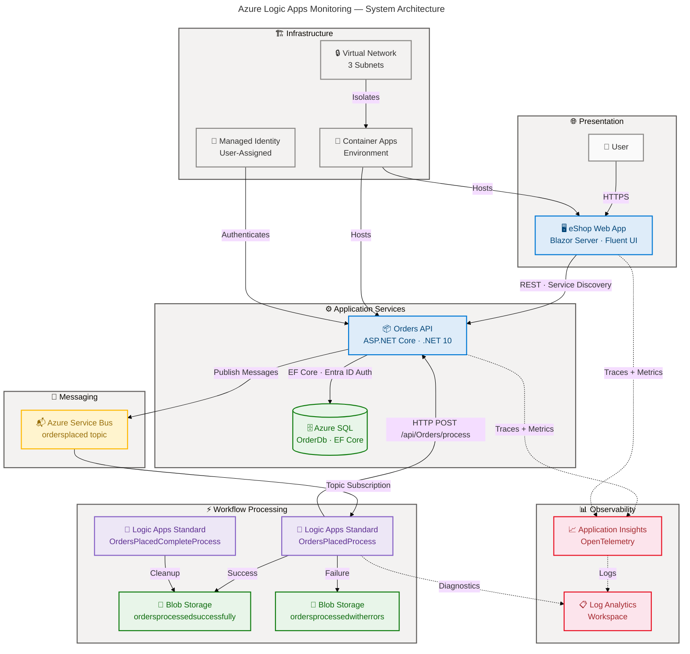

# Azure Logic Apps Monitoring

[](LICENSE)
[](https://dotnet.microsoft.com/)
[](https://learn.microsoft.com/dotnet/aspire/)
[](https://learn.microsoft.com/azure/developer/azure-developer-cli/)
[](https://learn.microsoft.com/azure/azure-resource-manager/bicep/)
[](https://github.com/Evilazaro/Azure-LogicApps-Monitoring/actions)

An enterprise-grade reference architecture demonstrating end-to-end order monitoring with **Azure Logic Apps Standard**, **.NET Aspire**, and **Azure Container Apps**. This project showcases event-driven order processing, distributed tracing with OpenTelemetry, and infrastructure-as-code deployment using the Azure Developer CLI (`azd`).

> 💡 **Who is this for?** Platform engineers and cloud architects building production-grade, event-driven applications on Azure who need a proven pattern for integrating Logic Apps workflows with containerized microservices.

## Overview

**Overview**

Azure Logic Apps Monitoring is a reference architecture designed for platform engineers and cloud architects who need a battle-tested pattern for building event-driven order processing systems on Azure. It demonstrates how to combine the visual workflow capabilities of Azure Logic Apps Standard with containerized .NET microservices, providing both low-code automation and full-code control in a single deployable solution.

The solution integrates .NET Aspire 13.1 for local development orchestration with the Azure Developer CLI (`azd`) for one-command cloud deployment. Orders flow from a Blazor Server UI through an ASP.NET Core API to Azure Service Bus, are processed by Logic Apps workflows, and audited in Blob Storage — with every step traced end-to-end through OpenTelemetry and Application Insights. All infrastructure is defined as code using Bicep with VNet isolation, private endpoints, and user-assigned managed identity for zero-secret authentication.

## Table of Contents

- [Overview](#overview)
- [Architecture](#architecture)
- [Features](#features)
- [Requirements](#requirements)
- [Quick Start](#quick-start)
- [Demo](#demo)
- [Configuration](#configuration)
- [Project Structure](#project-structure)
- [Deployment](#deployment)
- [Usage](#usage)
- [Testing](#testing)
- [Contributing](#contributing)
- [License](#license)

## Architecture

**Overview**

The system follows an event-driven architecture where orders placed through the Blazor Server frontend flow through an ASP.NET Core API, are published to Azure Service Bus, and are asynchronously processed by Azure Logic Apps Standard workflows. All components report telemetry to Application Insights via OpenTelemetry, and infrastructure is provisioned as code using Bicep.

> 📌 **How It Works**: Orders are submitted via the web app, persisted in Azure SQL, published to a Service Bus topic, consumed by Logic Apps workflows that call back into the API for processing, and results are stored in Azure Blob Storage for auditability.


```mermaid
---
title: "Azure Logic Apps Monitoring — System Architecture"
config:
  theme: base
  look: classic
  layout: dagre
  themeVariables:
    fontSize: '16px'
  flowchart:
    htmlLabels: true
---
flowchart TB
    accTitle: Azure Logic Apps Monitoring Architecture
    accDescr: Event-driven order monitoring architecture showing Blazor frontend, Orders API, Azure Service Bus, Logic Apps workflows, Azure SQL, Blob Storage, and observability with Application Insights

    %% ═══════════════════════════════════════════════════════════════════════════
    %% AZURE / FLUENT ARCHITECTURE PATTERN v1.1
    %% PHASE 1 - STRUCTURAL: Direction explicit, flat topology, nesting ≤ 3
    %% PHASE 2 - SEMANTIC: Colors justified, max 5 semantic classes, neutral-first
    %% PHASE 3 - FONT: Dark text on light backgrounds, contrast ≥ 4.5:1
    %% PHASE 4 - ACCESSIBILITY: accTitle/accDescr present, icons on all nodes
    %% PHASE 5 - STANDARD: Governance block present, classDefs centralized
    %% ═══════════════════════════════════════════════════════════════════════════

    subgraph userLayer["🌐 Presentation"]
        direction LR
        user["👤 User"]:::neutral
        webapp["🖥️ eShop Web App<br/>Blazor Server · Fluent UI"]:::core
    end

    subgraph apiLayer["⚙️ Application Services"]
        direction LR
        ordersApi["📦 Orders API<br/>ASP.NET Core · .NET 10"]:::core
        sqlDb[("🗄️ Azure SQL<br/>OrderDb · EF Core")]:::data
    end

    subgraph messagingLayer["📨 Messaging"]
        direction LR
        serviceBus["📬 Azure Service Bus<br/>ordersplaced topic"]:::messaging
    end

    subgraph workflowLayer["⚡ Workflow Processing"]
        direction LR
        logicApp["🔄 Logic Apps Standard<br/>OrdersPlacedProcess"]:::workflow
        logicAppCleanup["🧹 Logic Apps Standard<br/>OrdersPlacedCompleteProcess"]:::workflow
        blobSuccess["📁 Blob Storage<br/>ordersprocessedsuccessfully"]:::data
        blobErrors["📁 Blob Storage<br/>ordersprocessedwitherrors"]:::data
    end

    subgraph observability["📊 Observability"]
        direction LR
        appInsights["📈 Application Insights<br/>OpenTelemetry"]:::monitoring
        logAnalytics["📋 Log Analytics<br/>Workspace"]:::monitoring
    end

    subgraph infraLayer["🏗️ Infrastructure"]
        direction LR
        containerApps["🐳 Container Apps<br/>Environment"]:::infra
        vnet["🔒 Virtual Network<br/>3 Subnets"]:::infra
        identity["🔑 Managed Identity<br/>User-Assigned"]:::infra
    end

    user -->|"HTTPS"| webapp
    webapp -->|"REST · Service Discovery"| ordersApi
    ordersApi -->|"EF Core · Entra ID Auth"| sqlDb
    ordersApi -->|"Publish Messages"| serviceBus
    serviceBus -->|"Topic Subscription"| logicApp
    logicApp -->|"HTTP POST /api/Orders/process"| ordersApi
    logicApp -->|"Success"| blobSuccess
    logicApp -->|"Failure"| blobErrors
    logicAppCleanup -->|"Cleanup"| blobSuccess

    ordersApi -.->|"Traces + Metrics"| appInsights
    webapp -.->|"Traces + Metrics"| appInsights
    logicApp -.->|"Diagnostics"| logAnalytics
    appInsights -.->|"Logs"| logAnalytics

    containerApps -->|"Hosts"| ordersApi
    containerApps -->|"Hosts"| webapp
    vnet -->|"Isolates"| containerApps
    identity -->|"Authenticates"| ordersApi

    style userLayer fill:#F3F2F1,stroke:#605E5C,stroke-width:2px
    style apiLayer fill:#F3F2F1,stroke:#605E5C,stroke-width:2px
    style messagingLayer fill:#F3F2F1,stroke:#605E5C,stroke-width:2px
    style workflowLayer fill:#F3F2F1,stroke:#605E5C,stroke-width:2px
    style observability fill:#F3F2F1,stroke:#605E5C,stroke-width:2px
    style infraLayer fill:#F3F2F1,stroke:#605E5C,stroke-width:2px

    classDef core fill:#DEECF9,stroke:#0078D4,stroke-width:2px,color:#004578
    classDef data fill:#E8F5E9,stroke:#107C10,stroke-width:2px,color:#0B6A0B
    classDef messaging fill:#FFF4CE,stroke:#FFB900,stroke-width:2px,color:#986F0B
    classDef workflow fill:#EDE7F6,stroke:#8661C5,stroke-width:2px,color:#5C2D91
    classDef monitoring fill:#FCE4EC,stroke:#E81123,stroke-width:2px,color:#A4262C
    classDef infra fill:#F3F2F1,stroke:#8A8886,stroke-width:2px,color:#323130
    classDef neutral fill:#FAFAFA,stroke:#8A8886,stroke-width:2px,color:#323130
```

**Component Roles**

| Component             | Technology                           | Responsibility                                                       |
| --------------------- | ------------------------------------ | -------------------------------------------------------------------- |
| 🖥️ **eShop Web App**  | Blazor Server, Fluent UI             | Interactive order management UI with real-time updates               |
| 📦 **Orders API**     | ASP.NET Core (.NET 10)               | RESTful CRUD for orders, Service Bus publishing, distributed tracing |
| 🗄️ **Azure SQL**      | SQL Server, EF Core                  | Order persistence with Entra ID authentication                       |
| 📬 **Service Bus**    | Azure Service Bus (Standard)         | Asynchronous messaging via `ordersplaced` topic                      |
| 🔄 **Logic Apps**     | Azure Logic Apps Standard            | Event-driven order processing and error handling workflows           |
| 📁 **Blob Storage**   | Azure Storage                        | Audit trail for processed/failed orders                              |
| 📈 **App Insights**   | Application Insights + OpenTelemetry | Distributed tracing, custom metrics, and log aggregation             |
| 🐳 **Container Apps** | Azure Container Apps                 | Serverless container hosting with auto-scaling                       |

## Features

**Overview**

This reference architecture provides a production-ready pattern for monitoring and processing orders using Azure Logic Apps integrated with containerized .NET microservices. The solution emphasizes observability, security, and developer experience.

> 💡 **Why This Matters**: Combines the visual workflow orchestration of Logic Apps with the performance and type-safety of .NET Aspire, giving teams both low-code automation and full-code control in a single deployable solution.

> 📌 **How It Works**: .NET Aspire orchestrates local development with emulators for Service Bus and SQL, while `azd` provisions identical Azure infrastructure from Bicep templates — ensuring dev/prod parity.

| Feature                          | Description                                                                                                                                     | Status    |
| -------------------------------- | ----------------------------------------------------------------------------------------------------------------------------------------------- | --------- |
| ⚡ **Event-Driven Processing**   | Orders published to Service Bus topic, consumed by Logic Apps workflows that process and audit results                                          | ✅ Stable |
| 📊 **Distributed Tracing**       | End-to-end OpenTelemetry tracing across API, web app, and Service Bus with `TraceId`/`SpanId` propagation                                       | ✅ Stable |
| 📈 **Custom Metrics**            | Application-level counters: `eShop.orders.placed`, `eShop.orders.processing.duration`, `eShop.orders.processing.errors`, `eShop.orders.deleted` | ✅ Stable |
| 🚀 **.NET Aspire Orchestration** | Local development with Service Bus emulator, SQL container, and Aspire Dashboard for real-time telemetry                                        | ✅ Stable |
| 🔒 **Zero-Secret Security**      | User-assigned managed identity with Entra ID authentication for SQL, Service Bus, Storage, and ACR                                              | ✅ Stable |
| 🏗️ **Infrastructure as Code**    | Complete Bicep templates with VNet isolation, private endpoints, and RBAC role assignments                                                      | ✅ Stable |
| 📦 **Batch Operations**          | High-throughput batch order placement with `SemaphoreSlim(10)` concurrency control and 50-item batches                                          | ✅ Stable |
| 🛡️ **Resilience Patterns**       | HTTP retry (3 attempts, exponential backoff), circuit breaker, 600s total timeout, independent Service Bus timeouts                             | ✅ Stable |
| 🔧 **Cross-Platform Hooks**      | PowerShell and Bash scripts for provisioning, deployment, secret management, and workstation validation                                         | ✅ Stable |
| 🔄 **CI/CD Pipelines**           | GitHub Actions workflows for .NET CI and Azure Developer CLI deployment with federated credentials                                              | ✅ Stable |

## Requirements

**Overview**

The project requires specific tooling for local development and Azure deployment. All prerequisites can be validated automatically using the included workstation check script.

> ⚠️ **Important**: Run the workstation validation script before starting development to verify all required tools are installed and properly configured.

| Requirement                                                                                                   | Version | Purpose                                              |
| ------------------------------------------------------------------------------------------------------------- | ------- | ---------------------------------------------------- |
| ⚙️ [.NET SDK](https://dotnet.microsoft.com/download)                                                          | 10.0+   | Application runtime and build toolchain              |
| 🛠️ [Azure Developer CLI (`azd`)](https://learn.microsoft.com/azure/developer/azure-developer-cli/install-azd) | 1.11.0+ | Infrastructure provisioning and deployment           |
| ☁️ [Azure CLI](https://learn.microsoft.com/cli/azure/install-azure-cli)                                       | 2.60.0+ | Azure resource management and authentication         |
| 🏗️ [Bicep CLI](https://learn.microsoft.com/azure/azure-resource-manager/bicep/install)                        | 0.30.0+ | Infrastructure template compilation                  |
| 💻 [PowerShell](https://learn.microsoft.com/powershell/scripting/install/installing-powershell)               | 7.0+    | Cross-platform automation scripts                    |
| 🐳 [Docker Desktop](https://www.docker.com/products/docker-desktop/)                                          | Latest  | Local SQL Server and Service Bus emulator containers |

**Azure Subscription Requirements**

- An active Azure subscription with sufficient quota
- Required resource providers registered: `Microsoft.App`, `Microsoft.Web`, `Microsoft.Sql`, `Microsoft.ServiceBus`, `Microsoft.Storage`, `Microsoft.Insights`

Validate your workstation automatically:

```powershell
./hooks/check-dev-workstation.ps1
```

## Quick Start

**Overview**

Get the project running locally in under 10 minutes using .NET Aspire, which provides emulators for Azure Service Bus and containerized SQL Server — no Azure subscription required for local development.

**1. Clone the repository**

```bash
git clone https://github.com/Evilazaro/Azure-LogicApps-Monitoring.git
cd Azure-LogicApps-Monitoring
```

**2. Restore dependencies and build**

```bash
dotnet restore app.sln
dotnet build app.sln
```

**3. Run with .NET Aspire**

```bash
dotnet run --project app.AppHost
```

This starts the Aspire Dashboard, Orders API, Web App, SQL container, and Service Bus emulator. Open the Aspire Dashboard URL shown in the terminal output to view all services.

**4. Access the application**

| Service             | URL                       | Description                         |
| ------------------- | ------------------------- | ----------------------------------- |
| 📊 Aspire Dashboard | `https://localhost:17267` | Service orchestration and telemetry |
| 🖥️ Web App          | Shown in dashboard        | Order management UI                 |
| 📦 Orders API       | Shown in dashboard        | REST API with Swagger               |

> 💡 **Tip**: The Aspire Dashboard provides real-time distributed traces, metrics, and structured logs for all services. Use it to observe the full order lifecycle from placement through processing.

**Expected Output**

After running `dotnet run --project app.AppHost`, you should see output similar to:

```text
info: Aspire.Hosting.DistributedApplication[0]
      Aspire version: 13.1.0
info: Aspire.Hosting.DistributedApplication[0]
      Distributed application starting.
info: Aspire.Hosting.DistributedApplication[0]
      Dashboard running at: https://localhost:17267
```

## Demo

**Overview**

The application provides an interactive Blazor Server web interface styled with Microsoft Fluent UI for managing orders. The .NET Aspire Dashboard serves as the primary observability experience, offering real-time distributed traces, metrics, and structured logs across all services.

> 💡 **Try it locally**: Run `dotnet run --project app.AppHost` and open the Aspire Dashboard to observe the full order lifecycle — from placement through Service Bus publishing to Logic Apps workflow processing — with correlated distributed traces.

**Interactive Pages**

- **Home Dashboard** — Feature overview with technology stack cards and navigation
- **Place Order** — Submit individual orders with customer details and product line items
- **Batch Orders** — High-throughput order submission for load testing and demo scenarios
- **View Orders** — Browse all orders with details, powered by paginated API queries
- **Order Details** — Inspect individual order records including products and processing status

**Observability Dashboard**

The Aspire Dashboard at `https://localhost:17267` provides:

- 📊 **Distributed Traces** — End-to-end request traces across Web App → API → SQL → Service Bus
- 📈 **Live Metrics** — Custom counters for `eShop.orders.placed`, `eShop.orders.processing.duration`, and error rates
- 📋 **Structured Logs** — Correlated log entries from all services with severity filtering
- ⚙️ **Resource Overview** — Health status of all orchestrated services and containers

## Configuration

**Overview**

The application uses a layered configuration model with `appsettings.json` files, environment variables, and .NET user secrets. .NET Aspire automatically wires service discovery and connection strings in local development; Azure deployment uses managed identity for all service-to-service authentication.

> 📌 **Note**: In local development mode, Aspire uses containerized SQL Server and the Service Bus emulator. In Azure mode, all connections use user-assigned managed identity with Entra ID authentication — no connection string secrets are needed.

**Application Settings**

| Setting                                    | Default       | Description                                  |
| ------------------------------------------ | ------------- | -------------------------------------------- |
| ☁️ `Azure:AllowResourceGroupCreation`      | `false`       | Whether `azd` can create new resource groups |
| 📋 `Logging:LogLevel:Default`              | `Information` | Default logging verbosity                    |
| 📋 `Logging:LogLevel:Microsoft.AspNetCore` | `Warning`     | ASP.NET Core logging verbosity               |

**Environment Variables (Azure Deployment)**

| Variable                                   | Source                | Description                           |
| ------------------------------------------ | --------------------- | ------------------------------------- |
| 🔐 `AZURE_CLIENT_ID`                       | Managed Identity      | Client ID for Entra ID authentication |
| 🔐 `AZURE_TENANT_ID`                       | App Configuration     | Tenant for identity resolution        |
| 📈 `APPLICATIONINSIGHTS_CONNECTION_STRING` | App Insights          | Telemetry ingestion endpoint          |
| 📬 `SERVICE_BUS_HOST`                      | Service Bus namespace | Messaging endpoint FQDN               |
| 🗄️ `SQL_SERVER_FQDN`                       | Azure SQL             | Database server hostname              |

**OpenTelemetry Configuration**

Telemetry is configured in `app.ServiceDefaults/Extensions.cs` with exporters for both OTLP (Aspire Dashboard) and Azure Monitor:

```csharp
// Tracing instrumentation (Extensions.cs:105-115)
tracing
    .AddAspNetCoreInstrumentation()
    .AddHttpClientInstrumentation()
    .AddSqlClientInstrumentation()
    .AddSource("Azure.Messaging.ServiceBus")
    .AddSource("eShop.Orders.API");

// Custom metrics (Extensions.cs:120-125)
metrics
    .AddAspNetCoreInstrumentation()
    .AddHttpClientInstrumentation()
    .AddRuntimeInstrumentation()
    .AddMeter("eShop.Orders.API")
    .AddMeter("eShop.Web.App");
```

**Database Configuration**

Entity Framework Core is configured with Azure SQL resilience settings in `src/eShop.Orders.API/Program.cs`:

```csharp
// Program.cs:40-55
builder.Services.AddDbContext<OrderDbContext>(options =>
{
    options.UseSqlServer(connectionString, sqlOptions =>
    {
        sqlOptions.EnableRetryOnFailure(
            maxRetryCount: 5,
            maxRetryDelay: TimeSpan.FromSeconds(30),
            errorNumbersToAdd: null);
        sqlOptions.CommandTimeout(120);
    });
});
```

## Project Structure

```text
Azure-LogicApps-Monitoring/
├── app.AppHost/                    # .NET Aspire orchestrator
│   ├── AppHost.cs                  # Service registration & resource wiring
│   ├── infra/                      # Container Apps deployment templates
│   └── Properties/                 # Launch profiles
├── app.ServiceDefaults/            # Shared cross-cutting concerns
│   ├── Extensions.cs               # OpenTelemetry, health checks, resilience
│   └── CommonTypes.cs              # Shared domain models (Order, OrderProduct)
├── src/
│   ├── eShop.Orders.API/           # ASP.NET Core REST API
│   │   ├── Controllers/            # Order CRUD & batch endpoints
│   │   ├── Data/                   # EF Core DbContext & migrations
│   │   ├── Handlers/               # Service Bus message publishing
│   │   ├── HealthChecks/           # Database & Service Bus health probes
│   │   ├── Repositories/           # Data access layer
│   │   └── Services/               # Business logic & custom metrics
│   ├── eShop.Web.App/              # Blazor Server frontend
│   │   ├── Components/Pages/       # Razor pages (Home, PlaceOrder, ListOrders)
│   │   ├── Components/Services/    # Typed HTTP client for Orders API
│   │   └── wwwroot/                # Static assets
│   └── tests/                      # Unit & integration test projects
│       ├── app.AppHost.Tests/
│       ├── app.ServiceDefaults.Tests/
│       ├── eShop.Orders.API.Tests/
│       └── eShop.Web.App.Tests/
├── workflows/OrdersManagement/     # Logic Apps Standard workflows
│   └── OrdersManagementLogicApp/
│       ├── OrdersPlacedProcess/    # Service Bus trigger → process order → blob audit
│       └── OrdersPlacedCompleteProcess/ # Recurring cleanup of processed blobs
├── infra/                          # Bicep infrastructure-as-code
│   ├── main.bicep                  # Subscription-level entry point
│   ├── shared/                     # Network, Identity, Monitoring, Data modules
│   └── workload/                   # Container Apps, Service Bus, Logic Apps
├── hooks/                          # Cross-platform deployment scripts (PS1 + SH)
└── .github/workflows/              # CI/CD pipelines
```

## Deployment

**Overview**

The project uses the Azure Developer CLI (`azd`) for one-command deployment of all infrastructure and application components. Bicep templates provision a VNet-isolated environment with private endpoints, managed identity, and complete monitoring.

> ⚠️ **Important**: Ensure all [requirements](#requirements) are met before deploying. The `preprovision` hook automatically validates prerequisites, runs tests, and generates code coverage reports.

**1. Authenticate with Azure**

```bash
azd auth login
az login
```

**2. Initialize the environment**

```bash
azd init
```

When prompted, provide an environment name (e.g., `dev`, `staging`, `prod`) and select your target Azure subscription and location.

**3. Provision and deploy**

```bash
azd up
```

This single command executes the full deployment pipeline:

| Phase                 | Script/Action               | Description                                                                |
| --------------------- | --------------------------- | -------------------------------------------------------------------------- |
| 🔍 **Pre-provision**  | `hooks/preprovision.ps1`    | Validates tools, builds solution, runs tests with coverage                 |
| 🏗️ **Provision**      | `infra/main.bicep`          | Creates resource group, VNet, SQL, Service Bus, Container Apps, Logic Apps |
| ⚙️ **Post-provision** | `hooks/postprovision.ps1`   | Configures ACR auth, SQL managed identity, .NET user secrets               |
| 📦 **Pre-deploy**     | `hooks/deploy-workflow.ps1` | Packages and deploys Logic Apps workflows with connection parameters       |
| 🚀 **Deploy**         | `azd deploy`                | Builds container images, pushes to ACR, deploys to Container Apps          |

**Provisioned Azure Resources**

| Resource                          | SKU/Tier                         | Purpose                         |
| --------------------------------- | -------------------------------- | ------------------------------- |
| 🔒 Virtual Network                | 3 subnets (API, Data, Workflows) | Network isolation               |
| 🔑 User-Assigned Managed Identity | 20+ RBAC roles                   | Zero-secret authentication      |
| 🗄️ Azure SQL Server + Database    | GP_Gen5_2 (32 GB)                | Order persistence               |
| 📬 Azure Service Bus              | Standard                         | Event messaging                 |
| 🐳 Container Apps Environment     | Consumption                      | API and web app hosting         |
| 📦 Azure Container Registry       | Basic                            | Container image storage         |
| 🔄 Logic Apps Standard            | WorkflowStandard (elastic)       | Order processing workflows      |
| 📈 Application Insights           | Workspace-based                  | Distributed tracing and metrics |
| 📋 Log Analytics Workspace        | 30-day retention                 | Centralized log aggregation     |
| 💾 Storage Accounts               | Standard_LRS                     | Workflow state and audit blobs  |

**Generate Sample Data**

After deployment, generate test orders to exercise the full pipeline:

```powershell
./hooks/Generate-Orders.ps1 -NumberOfOrders 100
```

## Usage

**Overview**

The application exposes a Blazor Server web interface for order management and a REST API for programmatic access. All endpoints support distributed tracing through OpenTelemetry.

**Web Interface**

The eShop Web App provides the following pages:

| Page             | Route               | Description                                    |
| ---------------- | ------------------- | ---------------------------------------------- |
| 🏠 Home          | `/`                 | Dashboard with feature overview and navigation |
| 📝 Place Order   | `/placeorder`       | Submit a single order                          |
| 📦 Batch Orders  | `/placeordersbatch` | Submit multiple orders at once                 |
| 📋 View Orders   | `/listallorders`    | Browse all orders with details                 |
| 🔍 Order Details | `/vieworder/{id}`   | View a specific order                          |

**REST API Endpoints**

The Orders API exposes these endpoints (accessible via Swagger at the API root):

```http
POST   /api/orders            # Place a single order
POST   /api/orders/batch      # Place orders in batch
POST   /api/orders/process    # Process order (used by Logic Apps)
GET    /api/orders            # List all orders
GET    /api/orders/{id}       # Get order by ID
DELETE /api/orders/{id}       # Delete an order
DELETE /api/orders/batch      # Batch delete orders
GET    /api/orders/messages   # List Service Bus messages
```

**Example: Place an Order via API**

```bash
curl -X POST https://<orders-api-url>/api/orders \
  -H "Content-Type: application/json" \
  -d '{
    "customerId": "customer-001",
    "deliveryAddress": "123 Main Street",
    "products": [
      {
        "productId": "PROD-001",
        "productDescription": "Widget",
        "quantity": 2,
        "price": 29.99
      }
    ]
  }'
```

**Order Processing Flow**

1. **Place Order** → Web app or API call creates order in Azure SQL
2. **Publish Event** → Order details published to `ordersplaced` Service Bus topic
3. **Trigger Workflow** → Logic Apps `OrdersPlacedProcess` workflow receives the message
4. **Process Order** → Workflow calls `POST /api/orders/process` on the Orders API
5. **Audit Result** → Success → blob in `ordersprocessedsuccessfully`; failure → blob in `ordersprocessedwitherrors`
6. **Cleanup** → `OrdersPlacedCompleteProcess` workflow periodically deletes processed audit blobs

**Health Endpoints**

```http
GET /health    # Comprehensive health check (DB + Service Bus)
GET /alive     # Liveness probe
```

## Testing

The solution includes four test projects covering all application layers:

```bash
# Run all tests
dotnet test app.sln

# Run with code coverage
dotnet test app.sln --collect:"XPlat Code Coverage" --results-directory ./TestResults
```

| Test Project                   | Scope                                         |
| ------------------------------ | --------------------------------------------- |
| 🏗️ `app.AppHost.Tests`         | Aspire orchestration and resource wiring      |
| ⚙️ `app.ServiceDefaults.Tests` | OpenTelemetry configuration and health checks |
| 📦 `eShop.Orders.API.Tests`    | API controllers, services, and repositories   |
| 🖥️ `eShop.Web.App.Tests`       | Blazor components and API service client      |

> 💡 **Tip**: The `preprovision` hook automatically runs all tests with TRX report generation and code coverage before every deployment via `azd up`.

## Contributing

**Overview**

Contributions are welcome from developers interested in extending Azure Logic Apps integration patterns, improving observability coverage, or hardening infrastructure templates. This project follows standard GitHub workflows with automated CI validation on all pull requests.

The repository uses cross-platform hooks for workstation validation and automated testing, so contributors can verify their changes locally before submitting. All pull requests trigger the GitHub Actions CI pipeline which builds the solution, runs the full test suite, and generates code coverage reports to ensure quality.

1. Fork the repository
2. Create a feature branch: `git checkout -b feature/your-feature`
3. Validate your workstation: `./hooks/check-dev-workstation.ps1`
4. Make your changes and add tests
5. Run the full test suite: `dotnet test app.sln`
6. Commit your changes: `git commit -m "feat: description of change"`
7. Push to your branch: `git push origin feature/your-feature`
8. Open a Pull Request

**CI Pipeline**

All pull requests are validated by the GitHub Actions CI pipeline (`.github/workflows/ci-dotnet.yml`) which builds the solution, runs tests, and generates code coverage reports.

## License

This project is licensed under the [MIT License](LICENSE).

Copyright (c) 2025 Evilázaro Alves.
