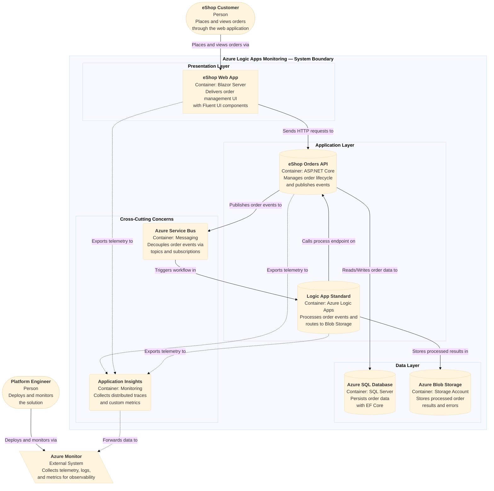

# Azure Logic Apps Monitoring


> [!NOTE]
> Replace the badge URLs above with actual CI/CD pipeline URLs once configured in your repository.

**Azure Logic Apps Monitoring** is a comprehensive solution that provides end-to-end observability for Azure Logic Apps Standard workflows. The solution implements an eShop order management system to demonstrate real-world monitoring patterns with distributed tracing, metrics collection, and automated order processing pipelines.

This project solves the challenge of monitoring complex, event-driven Logic App workflows by integrating **Application Insights** telemetry, structured logging, and health checks across a distributed microservices architecture. It provides a complete reference implementation showing how to instrument, deploy, and observe Logic App workflows alongside containerized APIs and web applications.

The solution leverages **.NET Aspire** for local orchestration, **Azure Container Apps** for production hosting, **Azure Service Bus** for messaging, **Azure SQL Database** for persistence, and **Bicep** templates for infrastructure-as-code deployment — all tied together with **OpenTelemetry** for full observability.

## Table of Contents

- [Features](#features)
- [Architecture](#architecture)
- [Technologies Used](#technologies-used)
- [Quick Start](#quick-start)
- [Configuration](#configuration)
- [Deployment](#deployment)
- [Usage](#usage)
- [Contributing](#contributing)
- [License](#license)

## Features

| Feature                      | Description                                                                                                                                                        |
| ---------------------------- | ------------------------------------------------------------------------------------------------------------------------------------------------------------------ |
| 📦 Order Management API      | RESTful API for placing, retrieving, and deleting customer orders with full CRUD operations.                                                                       |
| 🔄 Logic App Workflows       | Azure Logic Apps Standard workflows (`OrdersPlacedProcess`, `OrdersPlacedCompleteProcess`) that process orders from Service Bus and route results to Blob Storage. |
| 📊 Distributed Observability | End-to-end distributed tracing and metrics via OpenTelemetry with Azure Monitor and Application Insights integration.                                              |
| 🌐 Blazor Server UI          | Interactive web application built with Fluent UI for Blazor to manage and monitor orders in real time.                                                             |
| 🚌 Event-Driven Messaging    | Azure Service Bus topic/subscription pattern for decoupled, reliable order event processing.                                                                       |
| 🏗️ Infrastructure as Code    | Complete Bicep templates deploying networking, identity, monitoring, messaging, container apps, and Logic Apps.                                                    |
| 🩺 Health Checks             | Kubernetes and Azure Container Apps compatible health and liveness endpoints (`/health`, `/alive`).                                                                |
| 🔐 Managed Identity          | Passwordless authentication across all services using User Assigned Managed Identity.                                                                              |
| 🚀 .NET Aspire Orchestration | Local development orchestration with automatic service discovery, resilience policies, and resource management.                                                    |

## Architecture

The **Azure Logic Apps Monitoring** solution follows a C4-model style container architecture. The system boundary encompasses a presentation layer (Blazor web app), an application layer (Orders API), a data layer (Azure SQL, Blob Storage), and cross-cutting infrastructure (Service Bus, Application Insights, Logic Apps). External actors interact through the web UI, while Logic App workflows automate order processing triggered by Service Bus messages.


```mermaid
---
config:
  theme: base
  flowchart:
    htmlLabels: true
  themeVariables:
    fontSize: 16px
---
flowchart TB
    %% C4 Container Diagram — Azure Logic Apps Monitoring Solution

    %% ============================================================
    %% PERSONS / ACTORS
    %% ============================================================
    User([<b>eShop Customer</b><br>Person<br>Places and views orders<br>through the web application])
    Admin([<b>Platform Engineer</b><br>Person<br>Deploys and monitors<br>the solution])

    %% ============================================================
    %% EXTERNAL SYSTEMS
    %% ============================================================
    AzureMonitor[\<b>Azure Monitor</b><br>External System<br>Collects telemetry, logs,<br>and metrics for observability\]

    %% ============================================================
    %% SYSTEM BOUNDARY
    %% ============================================================
    subgraph SystemBoundary [<b>Azure Logic Apps Monitoring — System Boundary</b>]
        direction TB

        %% ========================================================
        %% PRESENTATION LAYER
        %% ========================================================
        subgraph Presentation [<b>Presentation Layer</b>]
            direction LR
            WebApp[<b>eShop Web App</b><br>Container: Blazor Server<br>Delivers order management UI<br>with Fluent UI components]
        end

        %% ========================================================
        %% APPLICATION LAYER
        %% ========================================================
        subgraph Application [<b>Application Layer</b>]
            direction LR
            OrdersAPI[(<b>eShop Orders API</b><br>Container: ASP.NET Core<br>Manages order lifecycle<br>and publishes events)]
            LogicApp[(<b>Logic App Standard</b><br>Container: Azure Logic Apps<br>Processes order events and<br>routes to Blob Storage)]
        end

        %% ========================================================
        %% DATA LAYER
        %% ========================================================
        subgraph Data [<b>Data Layer</b>]
            direction LR
            SqlDb[(<b>Azure SQL Database</b><br>Container: SQL Server<br>Persists order data<br>with EF Core)]
            BlobStorage[(<b>Azure Blob Storage</b><br>Container: Storage Account<br>Stores processed order<br>results and errors)]
        end

        %% ========================================================
        %% CROSS-CUTTING CONCERNS
        %% ========================================================
        subgraph CrossCutting [<b>Cross-Cutting Concerns</b>]
            direction LR
            ServiceBus(<b>Azure Service Bus</b><br>Container: Messaging<br>Decouples order events via<br>topics and subscriptions)
            AppInsights(<b>Application Insights</b><br>Container: Monitoring<br>Collects distributed traces<br>and custom metrics)
        end
    end

    %% ============================================================
    %% RELATIONSHIPS
    %% ============================================================

    %% Actor interactions
    User -- "Places and views orders via" --> WebApp
    Admin -- "Deploys and monitors via" --> AzureMonitor

    %% Presentation to Application
    WebApp -- "Sends HTTP requests to" --> OrdersAPI

    %% Application to Data
    OrdersAPI -- "Reads/Writes order data to" --> SqlDb
    LogicApp -- "Stores processed results in" --> BlobStorage

    %% Messaging flow
    OrdersAPI -- "Publishes order events to" --> ServiceBus
    ServiceBus -- "Triggers workflow in" --> LogicApp
    LogicApp -- "Calls process endpoint on" --> OrdersAPI

    %% Observability
    OrdersAPI -. "Exports telemetry to" .-> AppInsights
    WebApp -. "Exports telemetry to" .-> AppInsights
    LogicApp -. "Exports telemetry to" .-> AppInsights
    AppInsights -. "Forwards data to" .-> AzureMonitor
```

## Technologies Used

| Technology                           | Type            | Purpose                                               |
| ------------------------------------ | --------------- | ----------------------------------------------------- |
| .NET 10.0                            | Runtime         | Application runtime for all services                  |
| ASP.NET Core                         | Framework       | REST API and web application framework                |
| Blazor Server                        | Framework       | Interactive server-side UI rendering                  |
| .NET Aspire 13.x                     | Orchestration   | Local development orchestration and service discovery |
| Entity Framework Core                | ORM             | Database access and migrations for Azure SQL          |
| Azure Logic Apps Standard            | Workflow Engine | Event-driven order processing workflows               |
| Azure Container Apps                 | Hosting         | Production container hosting environment              |
| Azure Service Bus                    | Messaging       | Asynchronous message brokering via topics             |
| Azure SQL Database                   | Database        | Relational persistence for order data                 |
| Azure Blob Storage                   | Storage         | Stores processed order results                        |
| Azure Application Insights           | Monitoring      | Distributed tracing and metrics collection            |
| OpenTelemetry                        | Observability   | Vendor-neutral telemetry instrumentation              |
| Azure Bicep                          | IaC             | Declarative infrastructure-as-code templates          |
| Azure Developer CLI (azd)            | Tooling         | End-to-end deployment and environment management      |
| Fluent UI for Blazor                 | UI Library      | Microsoft design system components for the web app    |
| Swashbuckle                          | Documentation   | OpenAPI/Swagger API documentation generation          |
| Azure.Identity                       | Library         | Managed Identity and Azure AD authentication          |
| Microsoft.Extensions.Http.Resilience | Library         | HTTP retry, timeout, and circuit breaker policies     |

## Quick Start

### Prerequisites

| Prerequisite              | Version   | Purpose                       |
| ------------------------- | --------- | ----------------------------- |
| .NET SDK                  | 10.0.100+ | Build and run the application |
| Azure CLI                 | 2.60.0+   | Azure resource management     |
| Azure Developer CLI (azd) | 1.11.0+   | Deployment orchestration      |
| Docker                    | Latest    | Local container development   |
| PowerShell                | 7.0+      | Running lifecycle hooks       |

> [!IMPORTANT]
> Run the pre-provisioning script to validate all prerequisites automatically: `./hooks/preprovision.ps1 -ValidateOnly`

### Installation Steps

1. Clone the repository:

```bash
git clone https://github.com/Evilazaro/Azure-LogicApps-Monitoring.git
cd Azure-LogicApps-Monitoring
```

2. Restore dependencies and build the solution:

```bash
dotnet restore
dotnet build --configuration Debug
```

3. Run the application locally with .NET Aspire:

```bash
dotnet run --project app.AppHost
```

4. Open the Aspire dashboard displayed in the terminal output to view all running services.

### Minimal Working Example

```bash
# Start the Aspire orchestrator
dotnet run --project app.AppHost

# In a separate terminal, place a test order via the API
curl -X POST https://localhost:17267/api/Orders \
  -H "Content-Type: application/json" \
  -d '{"id": "order-001", "total": 49.99, "products": [{"name": "Widget", "price": 49.99, "quantity": 1}]}'
```

> [!TIP]
> The `.http` file at `src/eShop.Orders.API/eShop.Orders.API.http` contains pre-configured HTTP requests for testing the API directly from VS Code with the REST Client extension.

## Configuration

| Option                                 | Default              | Description                                                                |
| -------------------------------------- | -------------------- | -------------------------------------------------------------------------- |
| `Azure:ResourceGroup`                  | _(none)_             | Azure Resource Group name for deployed resources. Required for Azure mode. |
| `Azure:TenantId`                       | _(none)_             | Azure AD Tenant ID for local development authentication.                   |
| `Azure:ClientId`                       | _(none)_             | Azure AD Client ID for local development managed identity.                 |
| `Azure:ServiceBus:HostName`            | `localhost`          | Service Bus namespace hostname. Set to `localhost` for emulator mode.      |
| `Azure:ServiceBus:TopicName`           | `ordersplaced`       | Service Bus topic name for order events.                                   |
| `Azure:ServiceBus:SubscriptionName`    | `orderprocessingsub` | Service Bus subscription name for order processing.                        |
| `Azure:ApplicationInsights:Name`       | _(none)_             | Application Insights resource name. Omit for local-only development.       |
| `ApplicationInsights:ConnectionString` | _(none)_             | Application Insights connection string for telemetry export.               |
| `ConnectionStrings:OrderDb`            | _(none)_             | SQL Server connection string for the orders database.                      |
| `ConnectionStrings:messaging`          | _(none)_             | Service Bus connection string for local emulator mode.                     |

### Configuration Override Example

```json
{
  "Azure": {
    "ResourceGroup": "rg-orders-dev-eastus",
    "TenantId": "your-tenant-id",
    "ClientId": "your-client-id",
    "ServiceBus": {
      "HostName": "sb-orders-dev.servicebus.windows.net",
      "TopicName": "ordersplaced",
      "SubscriptionName": "orderprocessingsub"
    },
    "ApplicationInsights": {
      "Name": "appi-orders-dev"
    }
  },
  "ConnectionStrings": {
    "OrderDb": "Server=tcp:sql-orders-dev.database.windows.net;Database=OrderDb;Authentication=Active Directory Managed Identity"
  }
}
```

> [!WARNING]
> Never commit secrets or connection strings to source control. Use .NET User Secrets for local development (`dotnet user-secrets set`) and Azure Key Vault for production environments.

## Deployment

1. Authenticate with Azure:

```bash
azd auth login
```

2. Create a new environment:

```bash
azd env new <environment-name>
```

3. Provision infrastructure and deploy the application:

```bash
azd up
```

> [!NOTE]
> The `preprovision` hook automatically builds the solution, runs tests, and validates your workstation before provisioning Azure resources.

4. Verify the deployment outputs, which include the Container Apps URLs and Logic App name:

```bash
azd env get-values
```

5. Generate sample order data for testing:

```powershell
./hooks/Generate-Orders.ps1 -Force -Verbose
```

6. To tear down all resources when finished:

```bash
azd down
```

> [!CAUTION]
> Running `azd down` permanently deletes all Azure resources including the SQL database. Ensure backups exist before proceeding.

## Usage

### Place an Order via the API

```bash
curl -X POST https://<orders-api-url>/api/Orders \
  -H "Content-Type: application/json" \
  -d '{
    "id": "order-123",
    "total": 129.97,
    "products": [
      {"name": "Laptop Stand", "price": 79.99, "quantity": 1},
      {"name": "USB-C Cable", "price": 24.99, "quantity": 2}
    ]
  }'
# Expected: HTTP 201 Created with the order object in the response body
```

### Retrieve All Orders

```bash
curl https://<orders-api-url>/api/Orders
# Expected: HTTP 200 OK with a JSON array of all orders
```

### Retrieve a Specific Order

```bash
curl https://<orders-api-url>/api/Orders/order-123
# Expected: HTTP 200 OK with the order object, or 404 Not Found
```

### Order Processing Flow

1. The Orders API publishes an event to the `ordersplaced` **Service Bus** topic.
2. The `OrdersPlacedProcess` **Logic App** workflow triggers on the subscription message.
3. The workflow validates the message content type and calls the Orders API `/api/Orders/process` endpoint.
4. On success (HTTP 201), the order payload is stored in Blob Storage under `/ordersprocessedsuccessfully`.
5. On failure, the payload is stored under `/ordersprocessedwitherrors`.

### View the Swagger UI

Navigate to `https://<orders-api-url>/swagger` to explore the interactive API documentation.

## Contributing

Contributions are welcome and encouraged. To contribute to **Azure Logic Apps Monitoring**:

1. Fork the repository.
2. Create a feature branch from `main`:

```bash
git checkout -b feature/your-feature-name
```

3. Make changes and ensure all tests pass:

```bash
dotnet test --configuration Debug
```

4. Submit a pull request with a clear description of the changes.

> [!TIP]
> Open an issue first to discuss significant changes before starting implementation. This ensures alignment with the project direction.

## License

This project is licensed under the **MIT License**. See the [LICENSE](LICENSE) file for full details.

Created by Evilazaro Alves | Principal Cloud Solution Architect | Cloud Platforms and AI Apps | Microsoft.
