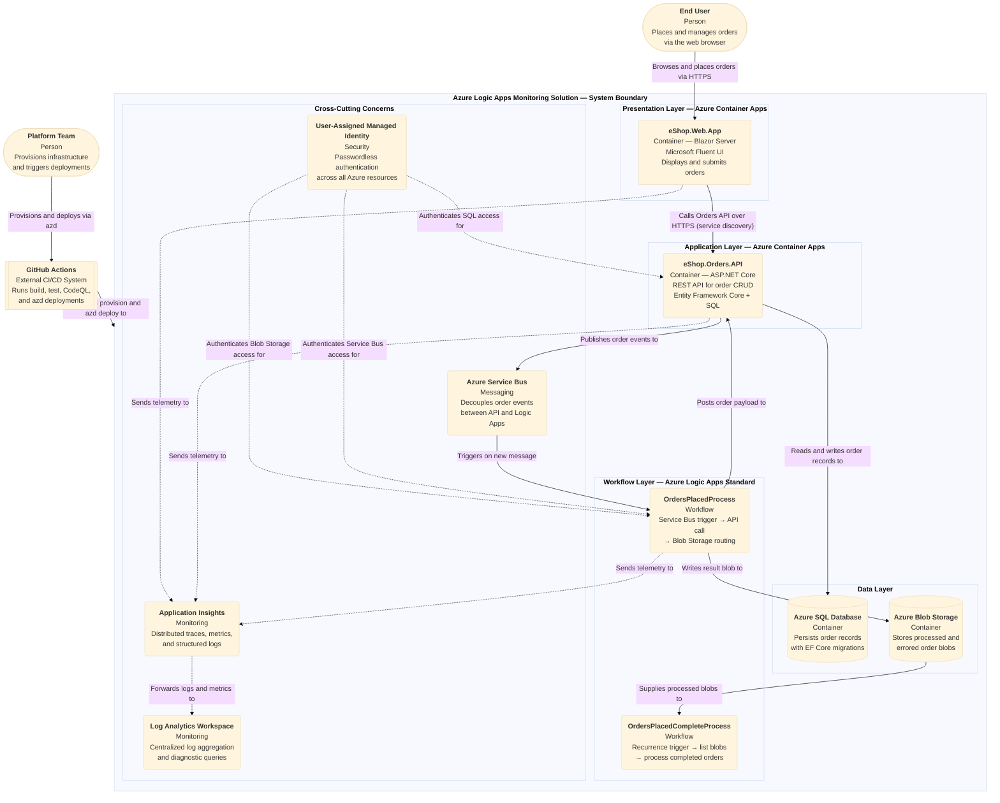

# Azure Logic Apps Monitoring

[](https://github.com/Evilazaro/Azure-LogicApps-Monitoring/actions/workflows/ci-dotnet.yml)
[](https://github.com/Evilazaro/Azure-LogicApps-Monitoring/actions/workflows/azure-dev.yml)
[](LICENSE)
[](https://dotnet.microsoft.com/download/dotnet/10.0)

**Azure Logic Apps Monitoring** is a complete, production-ready reference solution that demonstrates how to build, deploy, and monitor an event-driven order management system on **Azure** using **Azure Logic Apps Standard**, **.NET Aspire**, and **Azure Container Apps**.

The solution addresses a common enterprise challenge: reliably processing high-volume order events from a **Service Bus** queue, orchestrating calls to a backend REST API, persisting outcomes in **Azure Blob Storage**, and surfacing end-to-end observability through **Application Insights** and **Log Analytics** — all without managing credentials through the use of **Managed Identity**.

The primary technology stack includes **.NET 10**, **C#**, **ASP.NET Core**, **Blazor Server**, **Azure Logic Apps Standard**, **Azure Container Apps**, **Azure Service Bus**, **Azure SQL Database**, **Entity Framework Core**, **OpenTelemetry**, and **Bicep** for infrastructure as code.

## Table of Contents

- [Features](#features)
- [Architecture](#architecture)
- [Technologies Used](#technologies-used)
- [Quick Start](#quick-start)
- [Configuration](#configuration)
- [Deployment](#deployment)
- [Usage](#usage)
- [Contributing](#contributing)
- [License](#license)

## Features

| Feature                              | Description                                                                                                                                                     |
| ------------------------------------ | --------------------------------------------------------------------------------------------------------------------------------------------------------------- |
| 🔁 **Event-Driven Order Processing** | Triggers an Azure Logic Apps Standard workflow from an Azure Service Bus message to route and persist orders automatically.                                     |
| 🛒 **Orders REST API**               | Exposes a fully documented ASP.NET Core Web API for placing, retrieving, and deleting customer orders backed by Azure SQL Database.                             |
| 🖥️ **Blazor Web Frontend**           | Provides a Blazor Server frontend built with Microsoft Fluent UI for browsing and managing orders in real time.                                                 |
| 📊 **End-to-End Observability**      | Emits distributed traces, metrics, and structured logs via OpenTelemetry to Application Insights and Log Analytics for every component.                         |
| 🔐 **Passwordless Security**         | Uses a User-Assigned Managed Identity across all Azure resources, eliminating the need for stored credentials or connection-string secrets.                     |
| 🏗️ **Infrastructure as Code**        | Provisions the complete Azure environment — networking, identity, monitoring, messaging, compute, and storage — using modular Bicep templates.                  |
| ⚙️ **Aspire Orchestration**          | Orchestrates local and cloud-hosted services through a .NET Aspire AppHost, providing service discovery, health checks, and resilience policies automatically.  |
| 🚀 **Automated CI/CD**               | Ships a GitHub Actions pipeline with cross-platform .NET builds, CodeQL security scanning, and zero-touch Azure deployment via the Azure Developer CLI (`azd`). |
| 🧪 **Order Generation Tooling**      | Includes a PowerShell script (`Generate-Orders.ps1`) that seeds up to 10,000 randomized orders for load testing and demonstration.                              |

## Architecture

The solution follows a layered, event-driven architecture organized into three runtime boundaries: a **Presentation Layer** (Blazor Server frontend), an **Application Layer** (Orders REST API), and a **Workflow Layer** (Logic Apps Standard). All layers run on Azure Container Apps or Azure App Service within a Virtual Network, share observability infrastructure (Application Insights, Log Analytics), and communicate with Azure Service Bus and Azure SQL Database through Managed Identity.

Order events flow from the frontend through the Orders API into Azure Service Bus. The `OrdersPlacedProcess` Logic Apps workflow consumes each Service Bus message, validates the payload, calls the Orders API to persist the order, and routes the result — success or failure — to a dedicated folder in Azure Blob Storage. A second workflow, `OrdersPlacedCompleteProcess`, polls on a three-second recurrence to process the successfully stored blobs for downstream completion steps.


```mermaid
---
config:
  theme: base
  flowchart:
    htmlLabels: true
  themeVariables:
    fontSize: 16px
---
flowchart TB
    %% C4 Container Diagram — Azure Logic Apps Monitoring Solution

    %% ============================================================
    %% PERSONS / ACTORS
    %% ============================================================
    User([<b>End User</b><br>Person<br>Places and manages orders<br>via the web browser])
    PlatformTeam([<b>Platform Team</b><br>Person<br>Provisions infrastructure<br>and triggers deployments])

    %% ============================================================
    %% EXTERNAL SYSTEMS
    %% ============================================================
    GitHubActions[[<b>GitHub Actions</b><br>External CI/CD System<br>Runs build, test, CodeQL,<br>and azd deployments]]

    %% ============================================================
    %% SYSTEM BOUNDARY
    %% ============================================================
    subgraph SystemBoundary [<b>Azure Logic Apps Monitoring Solution — System Boundary</b>]
        direction TB

        %% --------------------------------------------------------
        %% PRESENTATION LAYER
        %% --------------------------------------------------------
        subgraph Presentation [<b>Presentation Layer — Azure Container Apps</b>]
            direction LR
            WebApp[<b>eShop.Web.App</b><br>Container — Blazor Server<br>Microsoft Fluent UI<br>Displays and submits orders]
        end

        %% --------------------------------------------------------
        %% APPLICATION LAYER
        %% --------------------------------------------------------
        subgraph Application [<b>Application Layer — Azure Container Apps</b>]
            direction LR
            OrdersAPI(<b>eShop.Orders.API</b><br>Container — ASP.NET Core<br>REST API for order CRUD<br>Entity Framework Core + SQL)
        end

        %% --------------------------------------------------------
        %% WORKFLOW LAYER
        %% --------------------------------------------------------
        subgraph Workflow [<b>Workflow Layer — Azure Logic Apps Standard</b>]
            direction LR
            OrdersPlacedProcess(<b>OrdersPlacedProcess</b><br>Workflow<br>Service Bus trigger → API call<br>→ Blob Storage routing)
            OrdersCompleteProcess(<b>OrdersPlacedCompleteProcess</b><br>Workflow<br>Recurrence trigger → list blobs<br>→ process completed orders)
        end

        %% --------------------------------------------------------
        %% DATA LAYER
        %% --------------------------------------------------------
        subgraph Data [<b>Data Layer</b>]
            direction LR
            SqlDb[(<b>Azure SQL Database</b><br>Container<br>Persists order records<br>with EF Core migrations)]
            BlobStorage[(<b>Azure Blob Storage</b><br>Container<br>Stores processed and<br>errored order blobs)]
        end

        %% --------------------------------------------------------
        %% CROSS-CUTTING CONCERNS
        %% --------------------------------------------------------
        subgraph CrossCutting [<b>Cross-Cutting Concerns</b>]
            direction LR
            ServiceBus(<b>Azure Service Bus</b><br>Messaging<br>Decouples order events<br>between API and Logic Apps)
            AppInsights(<b>Application Insights</b><br>Monitoring<br>Distributed traces, metrics,<br>and structured logs)
            LogAnalytics(<b>Log Analytics Workspace</b><br>Monitoring<br>Centralized log aggregation<br>and diagnostic queries)
            ManagedIdentity(<b>User-Assigned Managed Identity</b><br>Security<br>Passwordless authentication<br>across all Azure resources)
        end
    end

    %% ============================================================
    %% RELATIONSHIPS
    %% ============================================================

    User -- "Browses and places orders via HTTPS" --> WebApp
    PlatformTeam -- "Provisions and deploys via azd" --> GitHubActions

    WebApp -- "Calls Orders API over HTTPS (service discovery)" --> OrdersAPI
    OrdersAPI -- "Reads and writes order records to" --> SqlDb
    OrdersAPI -- "Publishes order events to" --> ServiceBus

    ServiceBus -- "Triggers on new message" --> OrdersPlacedProcess
    OrdersPlacedProcess -- "Posts order payload to" --> OrdersAPI
    OrdersPlacedProcess -- "Writes result blob to" --> BlobStorage
    BlobStorage -- "Supplies processed blobs to" --> OrdersCompleteProcess

    OrdersAPI -. "Sends telemetry to" .-> AppInsights
    WebApp -. "Sends telemetry to" .-> AppInsights
    OrdersPlacedProcess -. "Sends telemetry to" .-> AppInsights
    AppInsights -. "Forwards logs and metrics to" .-> LogAnalytics

    ManagedIdentity -. "Authenticates Service Bus access for" .-> OrdersPlacedProcess
    ManagedIdentity -. "Authenticates Blob Storage access for" .-> OrdersPlacedProcess
    ManagedIdentity -. "Authenticates SQL access for" .-> OrdersAPI

    GitHubActions -- "Runs azd provision and azd deploy to" --> SystemBoundary
```

## Technologies Used

| Technology                               | Type                    | Purpose                                                                           |
| ---------------------------------------- | ----------------------- | --------------------------------------------------------------------------------- |
| **C#**                                   | Language                | Primary implementation language for all .NET services                             |
| **.NET 10**                              | Runtime                 | Target framework for all application and library projects                         |
| **ASP.NET Core**                         | Framework               | Hosts the Orders REST API with controllers and OpenAPI                            |
| **Blazor Server**                        | Framework               | Renders the web frontend with interactive server-side components                  |
| **Microsoft Fluent UI for Blazor**       | UI Library              | Provides Fluent Design System components for the frontend                         |
| **.NET Aspire**                          | Orchestration Framework | Manages service discovery, health checks, resilience, and local orchestration     |
| **Entity Framework Core**                | ORM                     | Maps order domain models to Azure SQL Database tables                             |
| **OpenTelemetry**                        | Observability SDK       | Exports distributed traces and metrics to Application Insights and OTLP endpoints |
| **Azure.Messaging.ServiceBus**           | Azure SDK               | Connects to Azure Service Bus with managed identity authentication                |
| **Azure.Monitor.OpenTelemetry.Exporter** | Azure SDK               | Forwards OpenTelemetry signals to Azure Application Insights                      |
| **Azure.Identity**                       | Azure SDK               | Provides `DefaultAzureCredential` for passwordless authentication                 |
| **Azure Logic Apps Standard**            | Azure Service           | Hosts and executes event-driven order processing workflows                        |
| **Azure Container Apps**                 | Azure Service           | Runs the Orders API and Web App containers in a serverless environment            |
| **Azure Service Bus**                    | Azure Service           | Decouples order event publishing from workflow processing                         |
| **Azure SQL Database**                   | Azure Service           | Stores persistent order data with connection resiliency                           |
| **Azure Blob Storage**                   | Azure Service           | Archives processed and errored order blobs from Logic Apps workflows              |
| **Azure Application Insights**           | Azure Service           | Provides end-to-end distributed tracing and performance monitoring                |
| **Azure Log Analytics**                  | Azure Service           | Aggregates diagnostic logs from all Azure resources                               |
| **Azure Container Registry**             | Azure Service           | Stores and serves Docker container images for deployment                          |
| **Azure Virtual Network**                | Azure Service           | Isolates workloads in dedicated subnets for Container Apps and Logic Apps         |
| **User-Assigned Managed Identity**       | Azure Service           | Enables passwordless, credential-free access to all Azure resources               |
| **Bicep**                                | IaC Language            | Defines and provisions all Azure infrastructure as modular templates              |
| **Azure Developer CLI (azd)**            | Deployment Tool         | Orchestrates infrastructure provisioning and application deployment end-to-end    |
| **GitHub Actions**                       | CI/CD Platform          | Automates builds, tests, CodeQL scans, and Azure deployments                      |
| **Swashbuckle / OpenAPI**                | API Documentation       | Generates interactive Swagger UI for the Orders REST API                          |
| **PowerShell 7**                         | Scripting               | Provides pre/post-provision lifecycle hooks and order data generation             |

## Quick Start

### Prerequisites

| Prerequisite                                                                                                 | Minimum Version | Notes                                                                  |
| ------------------------------------------------------------------------------------------------------------ | --------------- | ---------------------------------------------------------------------- |
| **[.NET SDK](https://dotnet.microsoft.com/download/dotnet/10.0)**                                            | 10.0.100        | Required by `global.json`; set `rollForward: latestFeature`            |
| **[Docker Desktop](https://www.docker.com/products/docker-desktop/)**                                        | Latest          | Required for container builds and local Service Bus emulator           |
| **[Azure CLI](https://learn.microsoft.com/cli/azure/install-azure-cli)**                                     | 2.60.0          | Required for Azure authentication and resource management              |
| **[Azure Developer CLI (azd)](https://learn.microsoft.com/azure/developer/azure-developer-cli/install-azd)** | 1.11.0          | Required for provisioning and deployment                               |
| **[PowerShell](https://github.com/PowerShell/PowerShell)**                                                   | 7.0             | Required for lifecycle hooks (`preprovision.ps1`, `postprovision.ps1`) |

> [!NOTE]
> Run `.\hooks\preprovision.ps1 -ValidateOnly` to verify all prerequisites are installed before proceeding.

### Installation Steps

1. **Clone the repository** and navigate to the project root:

   ```bash
   git clone https://github.com/Evilazaro/Azure-LogicApps-Monitoring.git
   cd Azure-LogicApps-Monitoring
   ```

2. **Authenticate** with Azure using the Azure Developer CLI:

   ```bash
   azd auth login
   ```

3. **Create a new azd environment** and set the target Azure region:

   ```bash
   azd env new <your-environment-name>
   azd env set AZURE_LOCATION eastus
   ```

4. **Restore .NET dependencies** for all projects:

   ```bash
   dotnet restore app.sln
   ```

5. **Run the application locally** using .NET Aspire:

   ```bash
   dotnet run --project app.AppHost
   ```

   The Aspire dashboard opens automatically. The Orders API is available at the HTTPS endpoint shown in the dashboard, and the Web App is accessible at its external HTTP endpoint.

> [!TIP]
> The first run downloads the Service Bus emulator Docker image. Ensure Docker Desktop is running before starting the AppHost.

### Minimal Working Example

After completing the installation steps, verify the Orders API is reachable by placing a test order:

```bash
# Replace <orders-api-url> with the HTTPS endpoint shown in the Aspire dashboard
curl -X POST https://<orders-api-url>/api/Orders \
  -H "Content-Type: application/json" \
  -d '{
    "id": "00000000-0000-0000-0000-000000000001",
    "customerName": "Jane Doe",
    "total": 49.99,
    "products": [
      { "name": "Widget A", "quantity": 2, "price": 24.99 }
    ]
  }'
# Expected: HTTP 201 Created with the order object in the response body
```

## Configuration

The solution reads configuration from `appsettings.json`, `appsettings.Development.json`, and .NET user secrets. The table below lists every option required for full functionality.

| Option                                  | Default       | Description                                                                                                                  |
| --------------------------------------- | ------------- | ---------------------------------------------------------------------------------------------------------------------------- |
| `Azure:TenantId`                        | _(none)_      | Azure AD tenant ID used for local development authentication. Set via user secrets.                                          |
| `Azure:ClientId`                        | _(none)_      | Service principal or managed identity client ID for local development. Set via user secrets.                                 |
| `Azure:ResourceGroup`                   | _(none)_      | Name of the existing Azure resource group. Enables Azure resource references in AppHost.                                     |
| `Azure:AllowResourceGroupCreation`      | `false`       | When `true`, allows azd to create a new resource group automatically.                                                        |
| `Azure:ServiceBus:HostName`             | _(none)_      | Fully qualified Service Bus namespace hostname (e.g., `mynamespace.servicebus.windows.net`). Omit to use the local emulator. |
| `MESSAGING_HOST`                        | _(none)_      | Alternative Service Bus hostname environment variable consumed by ServiceDefaults.                                           |
| `ConnectionStrings:OrderDb`             | _(none)_      | ADO.NET connection string for Azure SQL Database. Injected automatically by Aspire in Azure.                                 |
| `ConnectionStrings:messaging`           | _(none)_      | Connection string for the local Service Bus emulator. Used only when `MESSAGING_HOST` is `localhost`.                        |
| `APPLICATIONINSIGHTS_CONNECTION_STRING` | _(none)_      | Application Insights connection string for telemetry export. Injected automatically in Azure Container Apps.                 |
| `OTEL_EXPORTER_OTLP_ENDPOINT`           | _(none)_      | OpenTelemetry collector endpoint for local OTLP export. Optional in development.                                             |
| `services:orders-api:https:0`           | _(none)_      | Base URL of the Orders API used by the Web App HTTP client. Injected by Aspire service discovery.                            |
| `Logging:LogLevel:Default`              | `Information` | Minimum log level for all categories not explicitly overridden.                                                              |

> [!IMPORTANT]
> Never store `Azure:TenantId`, `Azure:ClientId`, or connection strings in source-controlled files. Use `dotnet user-secrets set` for local development and azd environment variables for CI/CD.

### Example Override Snippet

```json
// appsettings.Development.json — local developer overrides only
{
  "Azure": {
    "TenantId": "<your-tenant-id>",
    "ClientId": "<your-client-id>",
    "ResourceGroup": "rg-orders-dev-eastus"
  },
  "Azure:ServiceBus:HostName": "orders-dev.servicebus.windows.net"
}
```

> [!WARNING]
> Do **not** commit the snippet above with real values. Add `appsettings.Development.json` to `.gitignore` or use user secrets instead.

## Deployment

The following steps provision all Azure infrastructure and deploy all application components to Azure Container Apps and Azure Logic Apps Standard using the Azure Developer CLI.

1. **Validate prerequisites** by running the pre-provisioning check script:

   ```powershell
   .\hooks\preprovision.ps1 -ValidateOnly
   ```

2. **Log in** to both the Azure Developer CLI and Azure CLI:

   ```bash
   azd auth login
   az login
   ```

3. **Create and configure** the azd environment (skip if already created in Quick Start):

   ```bash
   azd env new production
   azd env set AZURE_LOCATION eastus
   ```

4. **Provision and deploy** all resources in a single command:

   ```bash
   azd up
   ```

   This command runs the following phases in order:
   - Executes `hooks/preprovision.ps1` to validate the environment.
   - Runs `azd provision` to deploy the Bicep templates under `infra/`.
   - Executes `hooks/postprovision.ps1` to configure Managed Identity access on Azure SQL and inject user secrets.
   - Runs `azd deploy` to build and push container images to Azure Container Registry and update Container Apps revisions.

5. **Verify deployment** by opening the deployed Web App URL printed in the `azd up` output, or navigate to the Azure portal and inspect the Container Apps and Logic Apps resources.

6. **Seed test data** (optional) by running the order generation script:

   ```powershell
   .\hooks\Generate-Orders.ps1 -OrderCount 100
   ```

> [!NOTE]
> To deploy using the automated GitHub Actions pipeline instead of running `azd up` locally, follow the federated credential setup in `hooks/configure-federated-credential.ps1` and push to the `main` branch.

> [!CAUTION]
> Running `azd down` deletes all provisioned Azure resources, including the SQL Database and Blob Storage data. Confirm the action when prompted.

## Usage

### Placing an Order via the Web App

Open the deployed Web App URL in a browser. Use the **New Order** form to enter customer details and add products. Submit the form to call the Orders API and publish the event to Azure Service Bus, which triggers the `OrdersPlacedProcess` Logic Apps workflow automatically.

### Interacting with the Orders REST API Directly

The Orders API exposes a Swagger UI at `/swagger` for interactive testing. The following examples use `curl`.

**Place a new order:**

```bash
curl -X POST https://<orders-api-url>/api/Orders \
  -H "Content-Type: application/json" \
  -d '{
    "id": "3fa85f64-5717-4562-b3fc-2c963f66afa6",
    "customerName": "Alice Smith",
    "total": 129.95,
    "products": [
      { "name": "Gadget Pro", "quantity": 1, "price": 129.95 }
    ]
  }'
```

```json
// Expected response — HTTP 201 Created
{
  "id": "3fa85f64-5717-4562-b3fc-2c963f66afa6",
  "customerName": "Alice Smith",
  "total": 129.95,
  "status": "Placed",
  "products": [{ "name": "Gadget Pro", "quantity": 1, "price": 129.95 }]
}
```

**Retrieve all orders:**

```bash
curl https://<orders-api-url>/api/Orders
```

**Generate a batch of 50 test orders** and load them for Service Bus processing:

```powershell
.\hooks\Generate-Orders.ps1 -OrderCount 50 -MinProducts 1 -MaxProducts 4
```

### Monitoring with Application Insights

Navigate to the **Application Insights** resource in the Azure portal and open **Transaction Search** or **Performance** to view distributed traces for each order processed end-to-end across the Web App, Orders API, and Logic Apps workflows. Use **Log Analytics** workspace queries to aggregate logs across all components:

```kusto
// Query all traces from the Orders API in the last hour
traces
| where cloud_RoleName == "orders-api"
| where timestamp > ago(1h)
| order by timestamp desc
```

## Contributing

**Azure Logic Apps Monitoring** welcomes community contributions. To contribute:

1. **Fork** the repository and create a feature branch from `main`:

   ```bash
   git checkout -b feature/your-feature-name
   ```

2. **Make changes** following the existing code style enforced by `.editorconfig`.

3. **Run the CI checks** locally before opening a pull request:

   ```bash
   dotnet build app.sln
   dotnet test app.sln --configuration Release
   ```

4. **Open a pull request** against the `main` branch with a clear description of the change and the problem it solves.

5. **Report issues** by opening a GitHub Issue with a detailed description, reproduction steps, and environment details.

> [!NOTE]
> This repository does not currently include a `CONTRIBUTING.md` or `CODE_OF_CONDUCT.md`. Contributors are encouraged to follow the [GitHub Community Guidelines](https://docs.github.com/en/site-policy/github-terms/github-community-guidelines).

## License

This project is licensed under the **MIT License**. See the [LICENSE](LICENSE) file for full terms.

Created by **Evilazaro Alves** — Principal Cloud Solution Architect, Cloud Platforms and AI Apps, Microsoft.
