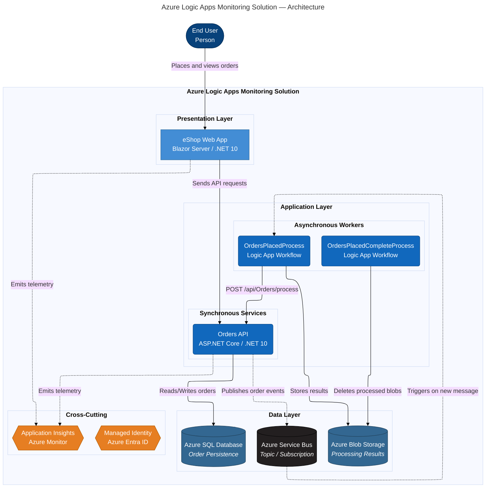

# Azure Logic Apps Monitoring Solution


> [!NOTE]
> The badges above are static placeholders. Replace them with dynamic badges from your CI/CD pipeline (e.g., GitHub Actions) when available.

## Description

The **Azure Logic Apps Monitoring Solution** is an end-to-end order management and monitoring platform that integrates .NET Aspire orchestration with Azure Logic Apps Standard workflows to process, track, and monitor e-commerce orders through an event-driven architecture (source: azure.yaml).

Organizations managing distributed order workflows often struggle to correlate events, track processing state, and maintain visibility across multiple services (source: azure.yaml). This solution addresses those challenges by combining a Blazor Server front-end, an ASP.NET Core REST API, and two Logic App Standard workflows into a single, observable system backed by Azure Service Bus, Azure SQL Database, and Azure Blob Storage (source: app.AppHost/AppHost.cs).

The technology stack centers on **.NET 10.0** with **.NET Aspire 13.x** for service orchestration, Entity Framework Core 10.0.5 for data persistence, OpenTelemetry 1.15.x with Azure Monitor for full observability, and Bicep infrastructure as code deployed via the Azure Developer CLI (source: global.json, app.ServiceDefaults/app.ServiceDefaults.csproj).

## Table of Contents

- [Description](#description)
- [Features](#features)
- [Architecture](#architecture)
- [Technologies Used](#technologies-used)
- [Quick Start](#quick-start)
- [Configuration](#configuration)
- [Deployment](#deployment)
- [Usage](#usage)
- [Contributing](#contributing)
- [License](#license)

## Features

| Feature | Description |
|---------|-------------|
| 🛒 **Order Placement** | Place individual or batch orders through the Blazor Server UI with real-time feedback (source: src/eShop.Web.App/Components/Pages/PlaceOrder.razor). |
| 📋 **Order Management** | List, view, and track orders stored in Azure SQL Database via the REST API (source: src/eShop.Orders.API/Controllers/OrdersController.cs). |
| ⚡ **Event-Driven Processing** | Service Bus topic triggers a Logic App workflow to automatically process incoming orders (source: workflows/OrdersManagement/OrdersManagementLogicApp/OrdersPlacedProcess/workflow.json). |
| 🧹 **Automated Cleanup** | Recurrence-based Logic App workflow deletes processed order blobs with concurrent execution at 20 repetitions (source: workflows/OrdersManagement/OrdersManagementLogicApp/OrdersPlacedCompleteProcess/workflow.json). |
| 📊 **Full Observability** | OpenTelemetry traces, metrics, and logs exported to Azure Monitor and Application Insights (source: app.ServiceDefaults/Extensions.cs). |
| 🔒 **Managed Identity Auth** | User-assigned managed identity for Service Bus, Blob Storage, and SQL access with no stored credentials (source: infra/shared/main.bicep). |
| 🏗️ **Infrastructure as Code** | Complete Bicep templates with VNet isolation, private endpoints, and multi-environment support (source: infra/main.bicep). |
| 🚀 **One-Command Deploy** | `azd up` provisions infrastructure and deploys all services including Logic App workflows (source: azure.yaml). |
| 🩺 **Health Checks** | Built-in database and Service Bus health endpoints at `/health` and `/alive` (source: app.ServiceDefaults/Extensions.cs). |
| 🧪 **Test Coverage** | Unit and integration tests for all projects across AppHost, ServiceDefaults, Orders API, and Web App (source: src/tests/). |

## Architecture

The solution follows an event-driven microservices architecture orchestrated by .NET Aspire and deployed to Azure Container Apps (source: azure.yaml). The Blazor Server front-end communicates with the Orders API via service discovery (source: src/eShop.Web.App/Program.cs). Orders published to **Azure Service Bus** trigger Logic App Standard workflows that process them through the API and persist results to Azure Blob Storage (source: workflows/OrdersManagement/OrdersManagementLogicApp/OrdersPlacedProcess/workflow.json). All components emit OpenTelemetry data to Application Insights for unified monitoring (source: app.ServiceDefaults/Extensions.cs).


```mermaid
---
title: "Azure Logic Apps Monitoring Solution — Architecture"
config:
  theme: base
  layout: elk
  flowchart:
    htmlLabels: true
    rankSpacing: 60
    nodeSpacing: 40
  themeVariables:
    fontSize: 16px
---
flowchart TB
    accTitle: Azure Logic Apps Monitoring Solution Architecture
    accDescr: High-level architecture showing an end user interacting with a Blazor Server web app and Orders API deployed on Azure Container Apps, with Azure Service Bus distributing events to two Logic App Standard workflows that process orders and clean up blob storage, all monitored by Application Insights.

    endUser(["End User<br/>Person"]):::person

    subgraph systemBoundary["<b>Azure Logic Apps Monitoring Solution</b>"]
        direction TB

        subgraph presentation["<b>Presentation Layer</b>"]
            webApp["eShop Web App<br/>Blazor Server / .NET 10"]:::clientSide
        end

        subgraph application["<b>Application Layer</b>"]
            direction TB

            subgraph syncServices["<b>Synchronous Services</b>"]
                ordersApi("Orders API<br/>ASP.NET Core / .NET 10"):::serverSide
            end

            subgraph asyncWorkers["<b>Asynchronous Workers</b>"]
                processWf("OrdersPlacedProcess<br/>Logic App Workflow"):::serverSide
                cleanupWf("OrdersPlacedCompleteProcess<br/>Logic App Workflow"):::serverSide
            end
        end

        subgraph crossCutting["<b>Cross-Cutting</b>"]
            appInsights{{"Application Insights<br/>Azure Monitor"}}:::crossCutting
            managedIdentity{{"Managed Identity<br/>Azure Entra ID"}}:::crossCutting
        end

        subgraph dataLayer["<b>Data Layer</b>"]
            sqlDb[("Azure SQL Database<br/><i>Order Persistence</i>")]:::dataStore
            serviceBus[("Azure Service Bus<br/><i>Topic / Subscription</i>")]:::dataQueue
            blobStorage[("Azure Blob Storage<br/><i>Processing Results</i>")]:::dataStore
        end
    end

    endUser -->|"Places and views orders"| webApp
    webApp -->|"Sends API requests"| ordersApi
    ordersApi -->|"Reads/Writes orders"| sqlDb
    ordersApi -.->|"Publishes order events"| serviceBus
    serviceBus -.->|"Triggers on new message"| processWf
    processWf -->|"POST /api/Orders/process"| ordersApi
    processWf -->|"Stores results"| blobStorage
    cleanupWf -->|"Deletes processed blobs"| blobStorage
    webApp -.->|"Emits telemetry"| appInsights
    ordersApi -.->|"Emits telemetry"| appInsights

    classDef person fill:#08427b,stroke:#052e57,color:#ffffff
    classDef external fill:#999999,stroke:#666666,color:#ffffff
    classDef clientSide fill:#438dd5,stroke:#2e6a9b,color:#ffffff
    classDef serverSide fill:#1168bd,stroke:#0b4884,color:#ffffff
    classDef crossCutting fill:#e67e22,stroke:#b35900,color:#ffffff
    classDef dataStore fill:#336791,stroke:#1f3f57,color:#ffffff
    classDef dataQueue fill:#231F20,stroke:#000000,color:#ffffff
```

## Technologies Used

| Technology | Type | Purpose |
|-----------|------|---------|
| .NET 10.0 SDK | Runtime | Application runtime and build toolchain (source: global.json). |
| .NET Aspire 13.x | Orchestration | Service orchestration, discovery, and local development (source: app.AppHost/app.AppHost.csproj). |
| Blazor Server | Front-End Framework | Interactive server-rendered UI with FluentUI 4.14.0 (source: src/eShop.Web.App/eShop.Web.App.csproj). |
| ASP.NET Core | Web Framework | RESTful Web API with Swagger/OpenAPI (source: src/eShop.Orders.API/eShop.Orders.API.csproj). |
| Entity Framework Core 10.0.5 | ORM | Data persistence in Azure SQL Database with migrations (source: src/eShop.Orders.API/eShop.Orders.API.csproj). |
| Azure Service Bus 7.20.1 | Messaging | Event-driven order distribution via topics and subscriptions (source: app.ServiceDefaults/app.ServiceDefaults.csproj). |
| Azure Logic Apps Standard | Workflow Engine | Automated order processing and cleanup workflows (source: infra/workload/logic-app.bicep). |
| Azure Container Apps | Hosting | Serverless container hosting for API and Web App (source: azure.yaml). |
| OpenTelemetry 1.15.x | Observability | Distributed tracing, metrics, and logging (source: app.ServiceDefaults/app.ServiceDefaults.csproj). |
| Azure Monitor / App Insights 1.7.0 | APM | Cloud-native telemetry aggregation and diagnostics (source: app.ServiceDefaults/app.ServiceDefaults.csproj). |
| Azure.Identity 1.21.0 | Authentication | Managed identity and credential management (source: app.ServiceDefaults/app.ServiceDefaults.csproj). |
| Bicep | IaC | Infrastructure as Code templates for Azure provisioning (source: infra/main.bicep). |
| Azure Developer CLI (azd) >= 1.11.0 | Deployment | One-command provisioning and deployment (source: azure.yaml). |
| Docker | Containerization | Local development with SQL Server and Service Bus emulators (source: azure.yaml). |

## Quick Start

### Prerequisites

| Prerequisite | Version | Installation |
|-------------|---------|-------------|
| .NET SDK | 10.0 | [Download .NET](https://dotnet.microsoft.com/download/dotnet/10.0) |
| Azure Developer CLI | >= 1.11.0 | [Install azd](https://learn.microsoft.com/azure/developer/azure-developer-cli/install-azd) |
| Docker Desktop | Latest | [Install Docker](https://www.docker.com/products/docker-desktop/) |
| Azure Subscription | — | [Create free account](https://azure.microsoft.com/free/) |

### Steps

1. **Clone** the repository:

   ```bash
   git clone https://github.com/Evilazaro/Azure-LogicApps-Monitoring.git
   cd Azure-LogicApps-Monitoring
   ```

2. **Restore** dependencies:

   ```bash
   dotnet restore app.sln
   ```

3. **Run** the application locally with .NET Aspire:

   ```bash
   dotnet run --project app.AppHost/app.AppHost.csproj
   ```

4. **Verify** the application is running by sending a health check request to the Orders API and confirming a healthy response:

   ```bash
   curl https://localhost:5001/health
   ```

   ```json
   // Expected output:
   {
     "status": "Healthy",
     "results": {
       "database": { "status": "Healthy" }
     }
   }
   ```

## Configuration

The project uses **runtime configuration** via `appsettings.json` files and environment variables (source: src/eShop.Orders.API/appsettings.json, app.AppHost/appsettings.json).

| Option | Default | Description |
|--------|---------|-------------|
| `Logging:LogLevel:Default` | `Information` | Controls the default logging verbosity for application-wide observability (source: src/eShop.Orders.API/appsettings.json). |
| `Logging:LogLevel:Microsoft.EntityFrameworkCore` | `Warning` | Controls EF Core query logging verbosity for database diagnostics (source: src/eShop.Orders.API/appsettings.json). |
| `HttpClient:OrdersAPIService:Timeout` | `00:02:00` | Maximum timeout for HTTP requests from the Web App to the Orders API (source: src/eShop.Orders.API/appsettings.json). |
| `HttpClient:OrdersAPIService:Resilience:MaxRetryAttempts` | `2` | Maximum retry attempts for failed HTTP requests supporting order management resilience (source: src/eShop.Orders.API/appsettings.json). |
| `HttpClient:OrdersAPIService:Resilience:AttemptTimeout` | `00:00:30` | Timeout per individual HTTP request attempt for per-call reliability (source: src/eShop.Orders.API/appsettings.json). |
| `Azure:AllowResourceGroupCreation` | `false` | Controls whether Aspire can automatically create Azure resource groups during local development (source: app.AppHost/appsettings.json). |
| `ConnectionStrings:OrderDb` | *(Aspire-managed)* | SQL Server connection string managed by .NET Aspire service discovery for order persistence (source: app.AppHost/AppHost.cs). |
| `ConnectionStrings:messaging` | *(Aspire-managed)* | Service Bus connection string managed by .NET Aspire for event-driven processing (source: app.AppHost/AppHost.cs). |

Override configuration using environment variables:

```bash
export Logging__LogLevel__Default=Debug
export HttpClient__OrdersAPIService__Timeout=00:05:00
```

## Deployment

The complete solution deploys to Azure using the Azure Developer CLI (source: azure.yaml).

1. **Authenticate** with Azure:

   ```bash
   azd auth login
   ```

2. **Create** a new environment:

   ```bash
   azd env new <environment-name>
   ```

3. **Provision and deploy** all resources with a single command:

   ```bash
   azd up
   ```

   The `azd up` command executes the following automated pipeline:

   - **Pre-provision** validates prerequisites, builds the solution, and runs tests (source: hooks/preprovision.ps1).
   - Infrastructure provisioning deploys VNet, managed identity, Log Analytics, Application Insights, Azure SQL, Service Bus, Container Apps, and Logic Apps Standard via Bicep (source: infra/main.bicep).
   - **Post-provision** configures SQL managed identity access and stores secrets in Key Vault (source: hooks/postprovision.ps1).
   - Pre-deploy deploys Logic App workflows to the provisioned Logic App Standard resource (source: hooks/deploy-workflow.ps1).

4. **Generate** test orders (optional):

   ```bash
   ./hooks/Generate-Orders.ps1
   ```

5. **Verify** — Navigate to the Web App URL output by `azd up` and confirm orders appear in the **List All Orders** page.

## Usage

### Place an Order via the API

The **Orders API** exposes RESTful endpoints for order management (source: src/eShop.Orders.API/Controllers/OrdersController.cs).

```bash
curl -X POST https://<orders-api-url>/api/Orders \
  -H "Content-Type: application/json" \
  -d '{
    "customerName": "Jane Doe",
    "products": [
      { "name": "Widget", "price": 9.99, "quantity": 2 }
    ]
  }'
```

```json
// Expected output:
// HTTP/1.1 201 Created
{
  "id": "a1b2c3d4-e5f6-7890-abcd-ef1234567890",
  "customerName": "Jane Doe",
  "total": 19.98,
  "status": "Placed"
}
```

### List All Orders

Retrieve all orders in the system with a single API call (source: src/eShop.Orders.API/Controllers/OrdersController.cs).

```bash
curl https://<orders-api-url>/api/Orders
```

```json
// Expected output:
[
  { "id": "a1b2c3d4-...", "customerName": "Jane Doe", "total": 19.98, "status": "Placed" }
]
```

### Check Health Status

Health checks report the status of database and Service Bus connectivity (source: app.ServiceDefaults/Extensions.cs).

```bash
curl https://<orders-api-url>/health
```

```json
// Expected output:
{
  "status": "Healthy",
  "results": {
    "database": { "status": "Healthy" },
    "servicebus": { "status": "Healthy" }
  }
}
```

### Generate Batch Test Orders

The provided hook script generates test orders in bulk for development and testing (source: hooks/Generate-Orders.ps1).

```powershell
./hooks/Generate-Orders.ps1
```

```text
# Expected output:
# Generating orders...
# Orders generated successfully.
```

## Contributing

> [!NOTE]
> Consider creating a `CONTRIBUTING.md` and `CODE_OF_CONDUCT.md` to formalize contribution guidelines.

Contributions are welcome. To contribute:

1. **Fork** the repository.
2. **Create** a feature branch (`git checkout -b feature/my-feature`).
3. **Commit** your changes (`git commit -m 'Add my feature'`).
4. **Push** to the branch (`git push origin feature/my-feature`).
5. **Open** a Pull Request.

Ensure all tests pass before submitting:

```bash
dotnet test app.sln
```

## License

This project is licensed under the **MIT License** — see the [LICENSE](LICENSE) file for details.
