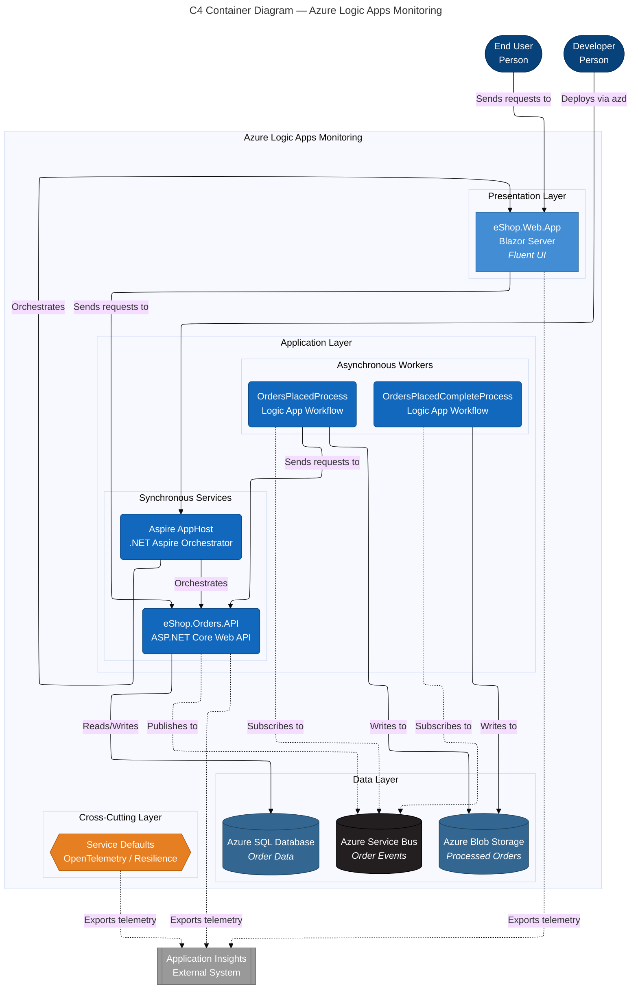

# Azure Logic Apps Monitoring


> [!NOTE]
> The build status and coverage badges above are static placeholders. Replace them with your CI/CD pipeline badges once configured.

**Azure Logic Apps Monitoring provides an end-to-end eShop order management solution with .NET Aspire orchestration, Azure Logic Apps workflows, and Azure-native observability for automated order processing and monitoring on Azure.** (source: azure.yaml)

Modern distributed applications require reliable order processing, event-driven automation, and comprehensive observability across all service boundaries. (source: azure.yaml) This solution combines a REST API for order management, a Blazor Server frontend, and Azure Logic Apps workflows that automate order processing through Azure Service Bus messaging. (source: app.AppHost/AppHost.cs)

**The technology stack centers on .NET 10.0 with ASP.NET Core, .NET Aspire 13.x for service orchestration, Entity Framework Core for Azure SQL persistence, and Azure Bicep for infrastructure as code.** (source: global.json) All services deploy to Azure Container Apps with built-in scaling, health checks, and managed identity authentication. (source: azure.yaml)

## Table of Contents

- [Features](#features)
- [Architecture](#architecture)
- [Technologies Used](#technologies-used)
- [Quick Start](#quick-start)
- [Configuration](#configuration)
- [Deployment](#deployment)
- [Usage](#usage)
- [Contributing](#contributing)
- [License](#license)

## Features

| Feature | Description |
| :--- | :--- |
| 🛒 **Orders REST API** | ASP.NET Core Web API with full CRUD operations for order management, Swagger/OpenAPI documentation, and distributed tracing. (source: src/eShop.Orders.API/Program.cs) |
| 🌐 **Blazor Server Frontend** | Interactive web application built with Microsoft Fluent UI components for placing, viewing, and managing orders. (source: src/eShop.Web.App/Program.cs) |
| ⚡ **Logic Apps Workflows** | Two automated workflows — `OrdersPlacedProcess` and `OrdersPlacedCompleteProcess` — triggered by Azure Service Bus messages to process orders and store results in Blob Storage. (source: workflows/OrdersManagement/OrdersManagementLogicApp/OrdersPlacedProcess/workflow.json) |
| 🔗 **.NET Aspire Orchestration** | Centralized service discovery, health checks, and resource management through the Aspire AppHost pattern. (source: app.AppHost/AppHost.cs) |
| 📨 **Service Bus Messaging** | Event-driven messaging with support for both the Service Bus emulator in local development and Azure-hosted namespaces in production. (source: app.AppHost/AppHost.cs) |
| 📊 **OpenTelemetry Observability** | Distributed tracing, metrics, and structured logging exported to Application Insights and OTLP collectors across all services. (source: app.ServiceDefaults/Extensions.cs) |
| 🗄️ **Azure SQL with EF Core** | Entity Framework Core with connection resiliency, retry policies, and Azure AD authentication for order data persistence. (source: src/eShop.Orders.API/Program.cs) |
| 🏗️ **Infrastructure as Code** | Complete Azure infrastructure defined in Bicep templates covering networking, identity, monitoring, messaging, and compute resources. (source: infra/main.bicep) |
| 🚀 **Azure Developer CLI** | Streamlined provisioning and deployment with `azd up`, lifecycle hooks for validation, and CI/CD pipeline generation. (source: azure.yaml) |
| 🩺 **Health Checks** | Database and Service Bus health checks with Kubernetes and Container Apps-compatible endpoints at `/health` and `/alive`. (source: app.ServiceDefaults/Extensions.cs) |
| 🔐 **Managed Identity** | User-assigned managed identity for all service-to-service authentication, eliminating secrets in code. (source: infra/workload/logic-app.bicep) |

## Architecture

**The solution follows a microservices architecture orchestrated by .NET Aspire and deployed to Azure Container Apps.** (source: azure.yaml) The Blazor Server frontend communicates with the Orders REST API, which persists data to Azure SQL Database and publishes events to Azure Service Bus. (source: src/eShop.Orders.API/Program.cs) Azure Logic Apps Standard workflows subscribe to Service Bus topics to automate order processing and archive results in Azure Blob Storage. (source: workflows/OrdersManagement/OrdersManagementLogicApp/OrdersPlacedProcess/workflow.json) Application Insights and OpenTelemetry provide end-to-end observability across all components. (source: app.ServiceDefaults/Extensions.cs)


```mermaid
---
title: C4 Container Diagram — Azure Logic Apps Monitoring
config:
  theme: base
  layout: elk
  flowchart:
    htmlLabels: true
    rankSpacing: 60
    nodeSpacing: 40
  themeVariables:
    fontSize: 16px
---
flowchart TB
    accTitle: C4 Container Diagram — Azure Logic Apps Monitoring
    accDescr: High-level architecture showing actors, application services, Azure Logic Apps workflows, and data stores.

    %% Persons
    endUser(["End User<br/>Person"]):::person
    developer(["Developer<br/>Person"]):::person

    %% External Systems
    azureMonitor[["Application Insights<br/>External System"]]:::external

    %% System Boundary
    subgraph systemBoundary["Azure Logic Apps Monitoring"]
      direction TB

      subgraph presentation["Presentation Layer"]
        direction TB
        webApp["eShop.Web.App<br/>Blazor Server<br/><i>Fluent UI</i>"]:::clientSide
      end

      subgraph application["Application Layer"]
        direction TB

        subgraph syncServices["Synchronous Services"]
          direction TB
          aspireHost("Aspire AppHost<br/>.NET Aspire Orchestrator"):::serverSide
          ordersApi("eShop.Orders.API<br/>ASP.NET Core Web API"):::serverSide
        end

        subgraph asyncWorkers["Asynchronous Workers"]
          direction TB
          ordersPlacedWorkflow("OrdersPlacedProcess<br/>Logic App Workflow"):::serverSide
          ordersCompletedWorkflow("OrdersPlacedCompleteProcess<br/>Logic App Workflow"):::serverSide
        end
      end

      subgraph crossCutting["Cross-Cutting Layer"]
        direction TB
        serviceDefaults{{"Service Defaults<br/>OpenTelemetry / Resilience"}}:::crossCutting
      end

      subgraph dataLayer["Data Layer"]
        direction TB
        sqlDatabase[("Azure SQL Database<br/><i>Order Data</i>")]:::dataStore
        serviceBus[("Azure Service Bus<br/><i>Order Events</i>")]:::dataQueue
        blobStorage[("Azure Blob Storage<br/><i>Processed Orders</i>")]:::dataStore
      end
    end

    %% Relationships
    endUser -->|"Sends requests to"| webApp
    developer -->|"Deploys via azd"| aspireHost
    webApp -->|"Sends requests to"| ordersApi
    aspireHost -->|"Orchestrates"| ordersApi
    aspireHost -->|"Orchestrates"| webApp
    ordersApi -->|"Reads/Writes"| sqlDatabase
    ordersApi -.->|"Publishes to"| serviceBus
    ordersPlacedWorkflow -.->|"Subscribes to"| serviceBus
    ordersCompletedWorkflow -.->|"Subscribes to"| serviceBus
    ordersPlacedWorkflow -->|"Sends requests to"| ordersApi
    ordersPlacedWorkflow -->|"Writes to"| blobStorage
    ordersCompletedWorkflow -->|"Writes to"| blobStorage
    ordersApi -.->|"Exports telemetry"| azureMonitor
    webApp -.->|"Exports telemetry"| azureMonitor
    serviceDefaults -.->|"Exports telemetry"| azureMonitor

    %% Styles
    classDef person fill:#08427b,stroke:#052e57,color:#ffffff
    classDef external fill:#999999,stroke:#666666,color:#ffffff
    classDef clientSide fill:#438dd5,stroke:#2e6a9b,color:#ffffff
    classDef serverSide fill:#1168bd,stroke:#0b4884,color:#ffffff
    classDef crossCutting fill:#e67e22,stroke:#b35900,color:#ffffff
    classDef dataStore fill:#336791,stroke:#1f3f57,color:#ffffff
    classDef dataQueue fill:#231F20,stroke:#000000,color:#ffffff
```

## Technologies Used

| Technology | Type | Purpose |
| :--- | :--- | :--- |
| C# / .NET 10.0 | Language / Runtime | Primary development language and runtime. (source: global.json) |
| ASP.NET Core | Framework | Web API and Blazor Server hosting. (source: src/eShop.Orders.API/eShop.Orders.API.csproj) |
| .NET Aspire 13.x | Orchestration | Service discovery, health checks, and resource management. (source: app.AppHost/app.AppHost.csproj) |
| Entity Framework Core | ORM | Azure SQL Database persistence with retry policies. (source: src/eShop.Orders.API/Program.cs) |
| Azure Container Apps | Hosting | Managed container hosting with auto-scaling. (source: azure.yaml) |
| Azure Logic Apps Standard | Workflow Engine | Automated order processing workflows. (source: infra/workload/logic-app.bicep) |
| Azure Service Bus | Messaging | Asynchronous event-driven communication. (source: app.AppHost/AppHost.cs) |
| Azure SQL Database | Database | Relational data persistence for orders. (source: src/eShop.Orders.API/Program.cs) |
| Azure Blob Storage | Storage | Archive for processed order results. (source: workflows/OrdersManagement/OrdersManagementLogicApp/OrdersPlacedProcess/workflow.json) |
| Application Insights | Monitoring | Distributed tracing, metrics, and log analytics. (source: app.ServiceDefaults/Extensions.cs) |
| OpenTelemetry | Observability | Instrumentation for traces, metrics, and logs. (source: app.ServiceDefaults/app.ServiceDefaults.csproj) |
| Azure Bicep | IaC | Declarative infrastructure provisioning. (source: infra/main.bicep) |
| Azure Developer CLI (azd) | DevOps | Deployment orchestration and lifecycle hooks. (source: azure.yaml) |
| Microsoft Fluent UI | UI Library | Blazor component library for the web frontend. (source: src/eShop.Web.App/eShop.Web.App.csproj) |
| Swagger / OpenAPI | Documentation | API documentation and testing interface. (source: src/eShop.Orders.API/eShop.Orders.API.csproj) |
| Azure.Identity | Security | Managed identity and Azure AD authentication. (source: app.ServiceDefaults/app.ServiceDefaults.csproj) |
| Azure.Messaging.ServiceBus | SDK | Service Bus client with managed identity support. (source: app.ServiceDefaults/app.ServiceDefaults.csproj) |
| Docker | Containerization | Container image building for deployment. (source: azure.yaml) |

## Quick Start

### Prerequisites

| Prerequisite | Version | Purpose |
| :--- | :--- | :--- |
| .NET SDK | 10.0 | Build and run the application. (source: global.json) |
| Azure CLI | >= 2.60.0 | Azure resource management. (source: hooks/preprovision.ps1) |
| Azure Developer CLI (azd) | >= 1.11.0 | Provisioning and deployment. (source: hooks/preprovision.ps1) |
| Docker | Latest | Container builds and local emulators. (source: azure.yaml) |
| Bicep CLI | >= 0.30.0 | Infrastructure template compilation. (source: hooks/preprovision.ps1) |

### Installation

1. Clone the repository:

   ```bash
   git clone https://github.com/Evilazaro/Azure-LogicApps-Monitoring.git
   cd Azure-LogicApps-Monitoring
   ```

2. Restore dependencies:

   ```bash
   dotnet restore
   ```

3. Build the solution:

   ```bash
   dotnet build --configuration Debug
   ```

4. Run the application locally via the Aspire AppHost:

   ```bash
   dotnet run --project app.AppHost/app.AppHost.csproj
   ```

5. Verify the installation by opening the Aspire dashboard:

   ```bash
   # The Aspire dashboard launches automatically at:
   # https://localhost:17267
   #
   # Expected output:
   #   Aspire dashboard shows resources:
   #   - orders-api    (Running)
   #   - web-app       (Running)
   ```

> [!TIP]
> Run `dotnet test` after building to execute the full test suite and confirm all components function correctly.

## Configuration

**The solution uses runtime configuration through `appsettings.json` files, .NET user secrets, and environment variables.** (source: src/eShop.Orders.API/appsettings.json)

| Option | Default | Description |
| :--- | :--- | :--- |
| `ConnectionStrings:OrderDb` | _none_ | Azure SQL Database connection string for order persistence. (source: src/eShop.Orders.API/Program.cs) |
| `ConnectionStrings:messaging` | _none_ | Service Bus connection string for local emulator development. (source: app.ServiceDefaults/Extensions.cs) |
| `Azure:TenantId` | _none_ | Azure AD tenant identifier for managed identity authentication. (source: app.AppHost/AppHost.cs) |
| `Azure:ClientId` | _none_ | Azure AD client identifier for local development authentication. (source: app.AppHost/AppHost.cs) |
| `Azure:ResourceGroup` | _none_ | Target Azure resource group name for Azure resource references. (source: app.AppHost/AppHost.cs) |
| `Azure:ServiceBus:HostName` | _none_ | Service Bus namespace hostname for production messaging. (source: src/eShop.Orders.API/Program.cs) |
| `MESSAGING_HOST` | _none_ | Alternative Service Bus hostname environment variable. (source: src/eShop.Orders.API/Program.cs) |
| `APPLICATIONINSIGHTS_CONNECTION_STRING` | _none_ | Application Insights telemetry connection string. (source: app.ServiceDefaults/Extensions.cs) |
| `OTEL_EXPORTER_OTLP_ENDPOINT` | _none_ | OpenTelemetry collector endpoint for trace and metric export. (source: app.ServiceDefaults/Extensions.cs) |
| `Logging:LogLevel:Default` | `Information` | Default logging verbosity level. (source: src/eShop.Orders.API/appsettings.json) |

Override configuration using .NET user secrets for local development:

```bash
dotnet user-secrets set "ConnectionStrings:OrderDb" \
  "Server=<server>;Database=<db>;Authentication=Active Directory Default" \
  --project src/eShop.Orders.API/eShop.Orders.API.csproj
```

> [!IMPORTANT]
> Do not store connection strings or secrets in source-controlled configuration files. Use .NET user secrets for local development and Azure Key Vault for production deployments.

## Deployment

Deploy the complete solution to Azure using the Azure Developer CLI.

1. Authenticate with Azure:

   ```bash
   azd auth login
   ```

2. Create a new environment:

   ```bash
   azd env new <environment-name>
   ```

3. Provision and deploy all resources:

   ```bash
   azd up
   ```

   > [!NOTE]
   > **The `azd up` command executes lifecycle hooks automatically:** `preprovision` validates prerequisites and runs build/test, `postprovision` configures secrets and SQL managed identity, and `predeploy` deploys Logic Apps workflows. (source: azure.yaml)

4. Verify the deployment by checking the Azure Container Apps endpoints in the `azd` output.

The Bicep templates in the `infra/` directory provision the following Azure resources:

- Resource Group with standardized tagging
- User-Assigned Managed Identity
- Log Analytics Workspace and Application Insights
- Azure SQL Server and Database
- Azure Service Bus Namespace
- Azure Container Apps Environment and Container Registry
- Azure Logic Apps Standard with App Service Plan
- Virtual Network with subnets and private endpoints

> [!CAUTION]
> Ensure the deployer principal has sufficient Azure RBAC permissions before running `azd up`. The `preprovision` hook validates all prerequisites and fails early if requirements are not met. (source: hooks/preprovision.ps1)

## Usage

### Place an Order via the Web App

Navigate to the eShop Web App and use the order placement form to submit a new order. The Web App sends the order to the Orders API, which persists it in Azure SQL and publishes an event to Azure Service Bus. (source: src/eShop.Web.App/Components/Services/OrdersAPIService.cs)

### Place an Order via the API

```bash
curl -X POST https://localhost:5001/api/orders \
  -H "Content-Type: application/json" \
  -d '{
    "id": "order-001",
    "customerName": "John Doe",
    "products": [
      { "name": "Widget", "quantity": 2, "price": 19.99 }
    ]
  }'
# Expected: HTTP 201 Created with the order details in the response body
```

### Retrieve All Orders

```bash
curl https://localhost:5001/api/orders
# Expected: HTTP 200 OK with a JSON array of all orders
```

### Generate Test Orders

Run the order generation script to populate the database with sample data:

```powershell
./hooks/Generate-Orders.ps1 -Force -Verbose
# Expected: Multiple test orders created in the database
```

> [!TIP]
> Access the Swagger UI at `/swagger` to explore and test all API endpoints interactively. (source: src/eShop.Orders.API/Program.cs)

See the [Entity Framework Core Migration Guide](src/eShop.Orders.API/MIGRATION_GUIDE.md) for details on the database architecture and migration from file-based storage.

## Contributing

> [!NOTE]
> This repository does not currently include a `CONTRIBUTING.md` or `CODE_OF_CONDUCT.md` file. Consider adding these files to establish contribution guidelines.

Contributions are welcome. To contribute:

1. Fork the repository
2. Create a feature branch (`git checkout -b feature/your-feature`)
3. Commit your changes (`git commit -m "Add your feature"`)
4. Push to the branch (`git push origin feature/your-feature`)
5. Open a Pull Request describing your changes

Report issues through the [GitHub Issues](https://github.com/Evilazaro/Azure-LogicApps-Monitoring/issues) page.

## License

**This project is licensed under the MIT License.** See the [LICENSE](LICENSE) file for details.
