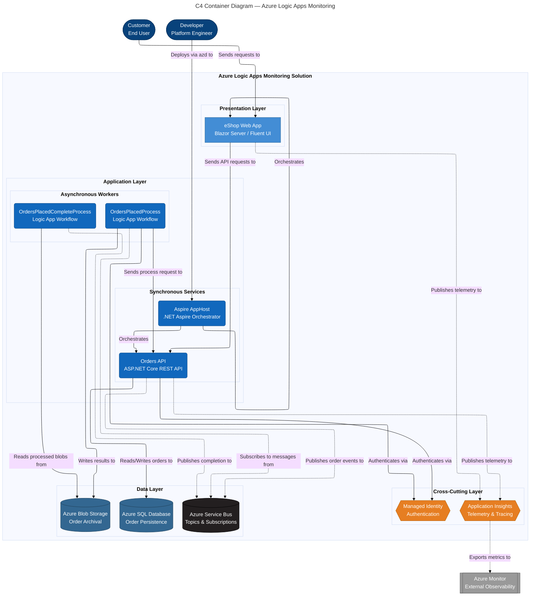

# Azure Logic Apps Monitoring

   

> [!NOTE]
> The build status and coverage badges above are static placeholders. Replace them with your CI/CD pipeline badges once configured.

## Description

**Azure Logic Apps Monitoring** is a comprehensive, production-ready solution for managing, processing, and monitoring e-commerce orders through Azure Logic Apps Standard workflows (source: azure.yaml). The solution combines a .NET Aspire-orchestrated microservices architecture with Azure-native services to deliver end-to-end order lifecycle management with full observability (source: app.AppHost/AppHost.cs).

The solution addresses the challenge of building a reliable, scalable order processing pipeline that integrates RESTful APIs, event-driven messaging, and workflow automation into a cohesive system (source: azure.yaml). **Azure Logic Apps Standard workflows** consume orders from Azure Service Bus, process them through the Orders API, and archive results in Azure Blob Storage — providing a complete event-driven architecture with built-in error handling and monitoring (source: workflows/OrdersManagement/OrdersManagementLogicApp/OrdersPlacedProcess/workflow.json).

The technology stack centers on **.NET 10**, **ASP.NET Core**, **Blazor Server** with **Fluent UI**, and **.NET Aspire** for distributed application orchestration (source: global.json). Infrastructure is defined declaratively using Azure Bicep and deployed via the Azure Developer CLI (azd) to Azure Container Apps (source: azure.yaml).

## Table of Contents

- [Description](#description)
- [Features](#features)
- [Architecture](#architecture)
- [Technologies Used](#technologies-used)
- [Quick Start](#quick-start)
- [Configuration](#configuration)
- [Deployment](#deployment)
- [Usage](#usage)
- [Contributing](#contributing)
- [License](#license)

## Features

| Feature | Description |
| --- | --- |
| 📦 **Order Management API** | RESTful API built with ASP.NET Core for creating, retrieving, and managing customer orders with full CRUD operations |
| 🌐 **Blazor Web Application** | Interactive server-side rendered web frontend using Fluent UI components for order visualization and management |
| ⚡ **Logic App Workflows** | Two Azure Logic Apps Standard workflows — OrdersPlacedProcess triggers on Service Bus messages and OrdersPlacedCompleteProcess handles cleanup of processed orders |
| 🔗 **.NET Aspire Orchestration** | Centralized service discovery, health checks, resilience patterns, and telemetry configuration across all microservices |
| 📨 **Event-Driven Messaging** | Azure Service Bus topics and subscriptions enable asynchronous, decoupled order processing between services |
| 🗄️ **Azure SQL with EF Core** | Entity Framework Core with Azure SQL Database provides ACID-compliant order persistence with retry policies and connection resiliency |
| 📊 **Full Observability** | OpenTelemetry distributed tracing, metrics, and logging exported to Application Insights and Azure Monitor |
| 🔒 **Managed Identity Auth** | User-assigned Managed Identity for all service-to-service authentication with no secrets stored in code |
| 🏗️ **Infrastructure as Code** | Comprehensive Bicep templates organized into shared and workload modules for repeatable deployments |
| 🚀 **Azure Developer CLI** | Full azd lifecycle support with preprovision, postprovision, predeploy, and postinfradelete hooks |

## Architecture

**Azure Logic Apps Monitoring** follows a microservices architecture orchestrated by .NET Aspire and deployed to Azure Container Apps (source: azure.yaml). The AppHost project serves as the central orchestrator, configuring service discovery, health checks, and Azure resource connections for the Orders API and the Blazor web application (source: app.AppHost/AppHost.cs). Azure Logic Apps Standard workflows operate independently, consuming messages from Azure Service Bus and archiving processed results to Azure Blob Storage (source: workflows/OrdersManagement/OrdersManagementLogicApp/connections.json). Application Insights with OpenTelemetry provides end-to-end distributed tracing across all components (source: app.ServiceDefaults/Extensions.cs).


```mermaid
---
title: "C4 Container Diagram — Azure Logic Apps Monitoring"
config:
  theme: base
  layout: elk
  flowchart:
    htmlLabels: true
    rankSpacing: 60
    nodeSpacing: 40
  themeVariables:
    fontSize: 16px
---
flowchart TB
    accTitle: C4 Container Diagram — Azure Logic Apps Monitoring
    accDescr: High-level architecture showing the eShop order management system with .NET Aspire orchestration, Azure Logic Apps workflows, and Azure-native services.

    %% Persons / Actors
    customer(["Customer<br/>End User"]):::person
    developer(["Developer<br/>Platform Engineer"]):::person

    %% External Systems
    azureMonitor[["Azure Monitor<br/>External Observability"]]:::external

    %% System Boundary
    subgraph systemBoundary["<b>Azure Logic Apps Monitoring Solution</b>"]
        direction TB

        %% Presentation Layer
        subgraph presentation["<b>Presentation Layer</b>"]
            webApp["eShop Web App<br/>Blazor Server / Fluent UI"]:::clientSide
        end

        %% Application Layer
        subgraph application["<b>Application Layer</b>"]
            direction TB
            subgraph syncServices["<b>Synchronous Services</b>"]
                aspireHost("Aspire AppHost<br/>.NET Aspire Orchestrator"):::serverSide
                ordersApi("Orders API<br/>ASP.NET Core REST API"):::serverSide
            end

            subgraph asyncWorkers["<b>Asynchronous Workers</b>"]
                ordersPlacedWorkflow("OrdersPlacedProcess<br/>Logic App Workflow"):::serverSide
                ordersCompleteWorkflow("OrdersPlacedCompleteProcess<br/>Logic App Workflow"):::serverSide
            end
        end

        %% Cross-Cutting Layer
        subgraph crossCutting["<b>Cross-Cutting Layer</b>"]
            appInsights{{"Application Insights<br/>Telemetry & Tracing"}}:::crossCutting
            managedIdentity{{"Managed Identity<br/>Authentication"}}:::crossCutting
        end

        %% Data Layer
        subgraph dataLayer["<b>Data Layer</b>"]
            sqlDatabase[("Azure SQL Database<br/>Order Persistence")]:::dataOperational
            serviceBus[("Azure Service Bus<br/>Topics & Subscriptions")]:::dataQueue
            blobStorage[("Azure Blob Storage<br/>Order Archival")]:::dataOperational
        end
    end

    %% Relationships
    customer -->|"Sends requests to"| webApp
    developer -->|"Deploys via azd to"| aspireHost
    webApp -->|"Sends API requests to"| ordersApi
    aspireHost -->|"Orchestrates"| ordersApi
    aspireHost -->|"Orchestrates"| webApp
    ordersApi -->|"Reads/Writes orders to"| sqlDatabase
    ordersApi -.->|"Publishes order events to"| serviceBus
    ordersPlacedWorkflow -.->|"Subscribes to messages from"| serviceBus
    ordersPlacedWorkflow -->|"Sends process request to"| ordersApi
    ordersPlacedWorkflow -->|"Writes results to"| blobStorage
    ordersCompleteWorkflow -->|"Reads processed blobs from"| blobStorage
    ordersCompleteWorkflow -.->|"Publishes completion to"| serviceBus
    ordersApi -.->|"Publishes telemetry to"| appInsights
    webApp -.->|"Publishes telemetry to"| appInsights
    appInsights -.->|"Exports metrics to"| azureMonitor
    ordersApi -->|"Authenticates via"| managedIdentity
    ordersPlacedWorkflow -->|"Authenticates via"| managedIdentity

    %% Styles
    classDef person fill:#08427b,stroke:#052e57,color:#ffffff
    classDef external fill:#999999,stroke:#666666,color:#ffffff
    classDef clientSide fill:#438dd5,stroke:#2e6a9b,color:#ffffff
    classDef serverSide fill:#1168bd,stroke:#0b4884,color:#ffffff
    classDef crossCutting fill:#e67e22,stroke:#b35900,color:#ffffff
    classDef dataOperational fill:#336791,stroke:#1f3f57,color:#ffffff
    classDef dataQueue fill:#231F20,stroke:#000000,color:#ffffff
```

## Technologies Used

| Technology | Type | Purpose |
| --- | --- | --- |
| .NET 10.0 | Runtime | Application runtime for all services |
| ASP.NET Core | Framework | RESTful API and web application framework |
| Blazor Server | Framework | Interactive server-side rendered UI |
| .NET Aspire 13.x | Orchestration | Service discovery, health checks, and telemetry |
| Entity Framework Core 10.0 | ORM | Object-relational mapping for Azure SQL Database |
| Fluent UI for Blazor | UI Library | Microsoft design system components |
| Azure Container Apps | Hosting | Managed Kubernetes hosting with auto-scaling |
| Azure Logic Apps Standard | Workflow | Event-driven order processing workflows |
| Azure SQL Database | Database | Relational order data persistence |
| Azure Service Bus | Messaging | Asynchronous topic/subscription messaging |
| Azure Blob Storage | Storage | Processed order result archival |
| Application Insights | Monitoring | Distributed tracing and performance monitoring |
| OpenTelemetry | Observability | Vendor-neutral telemetry instrumentation |
| Azure Bicep | IaC | Declarative infrastructure definitions |
| Azure Developer CLI (azd) | DevOps | Deployment lifecycle management |
| Azure.Identity | Security | Managed Identity authentication |
| Swashbuckle | Documentation | OpenAPI/Swagger API documentation |
| Docker | Containerization | Local development and container builds |

## Quick Start

### Prerequisites

| Prerequisite | Version | Installation |
| --- | --- | --- |
| .NET SDK | 10.0 | [Download](https://dotnet.microsoft.com/download/dotnet/10.0) |
| Docker | Latest | [Download](https://www.docker.com/products/docker-desktop) |
| Azure CLI | >= 2.60.0 | [Download](https://learn.microsoft.com/cli/azure/install-azure-cli) |
| Azure Developer CLI (azd) | >= 1.11.0 | [Download](https://learn.microsoft.com/azure/developer/azure-developer-cli/install-azd) |

### Installation

1. **Clone** the repository:

   ```bash
   git clone https://github.com/Evilazaro/Azure-LogicApps-Monitoring.git
   cd Azure-LogicApps-Monitoring
   ```

2. **Restore** NuGet dependencies:

   ```bash
   dotnet restore
   ```

3. **Build** the solution:

   ```bash
   dotnet build --configuration Debug
   ```

4. **Run** the application using the .NET Aspire AppHost:

   ```bash
   dotnet run --project app.AppHost
   ```

5. **Verify** the application is running by opening the Aspire Dashboard:

   ```bash
   curl -s -o /dev/null -w "%{http_code}" https://localhost:17267
   # Expected output: 200
   ```

> [!TIP]
> The Aspire Dashboard launches automatically at `https://localhost:17267` and provides a unified view of all services, health checks, and telemetry (source: app.AppHost/Properties/launchSettings.json).

## Configuration

The solution uses **runtime configuration** through `appsettings.json` files, environment variables, and user secrets (source: src/eShop.Orders.API/appsettings.json).

| Option | Default | Description |
| --- | --- | --- |
| `ConnectionStrings:OrderDb` | _(required)_ | SQL Server connection string for the Orders database with support for Azure SQL managed identity authentication |
| `ConnectionStrings:messaging` | _(optional)_ | Service Bus connection string for local emulator mode |
| `Azure:ResourceGroup` | _(empty)_ | Azure resource group name; when set, enables Azure-mode resource connections |
| `Azure:TenantId` | _(empty)_ | Azure AD tenant ID for local development authentication |
| `Azure:ClientId` | _(empty)_ | Azure AD client ID for local development managed identity |
| `Azure:ServiceBus:HostName` | `localhost` | Service Bus namespace hostname; set to `localhost` for emulator mode |
| `Azure:ServiceBus:TopicName` | `ordersplaced` | Service Bus topic name for order events |
| `Azure:ServiceBus:SubscriptionName` | `orderprocessingsub` | Service Bus subscription name for order processing |
| `APPLICATIONINSIGHTS_CONNECTION_STRING` | _(empty)_ | Application Insights connection string for telemetry export |
| `MESSAGING_HOST` | _(empty)_ | Alternative Service Bus hostname configuration key |
| `services:orders-api:https:0` | _(auto-discovered)_ | Orders API base address for the Web App HTTP client via Aspire service discovery |

**Example override** using environment variables:

```bash
export Azure__ServiceBus__HostName="my-namespace.servicebus.windows.net"
export Azure__ServiceBus__TopicName="ordersplaced"
dotnet run --project app.AppHost
```

> [!IMPORTANT]
> In production, Azure Managed Identity handles all authentication automatically (source: app.AppHost/AppHost.cs). The `Azure:TenantId` and `Azure:ClientId` settings apply only to local development scenarios (source: app.AppHost/AppHost.cs).

## Deployment

Deploy the solution to Azure using the Azure Developer CLI (azd).

1. **Authenticate** with Azure:

   ```bash
   azd auth login
   ```

2. **Create** a new environment:

   ```bash
   azd env new <environment-name>
   ```

3. **Provision and deploy** all infrastructure and services:

   ```bash
   azd up
   ```

   > [!NOTE]
   > The `azd up` command executes the full lifecycle: **preprovision** (build, test, validate) → **provision** (Bicep deployment) → **postprovision** (secrets, test data) → **predeploy** (Logic App workflow deployment) → **deploy** (Container Apps deployment) (source: azure.yaml).

4. **Verify** the deployment:

   ```bash
   azd show
   ```

5. **Tear down** the environment when no longer needed:

   ```bash
   azd down
   ```

> [!CAUTION]
> Running `azd down` permanently deletes all Azure resources provisioned for the environment (source: azure.yaml).

### Deployment Architecture

The Bicep infrastructure is organized into the following modules (source: infra/main.bicep).

- **Resource Group** — Central container for all resources
- **Shared Module** — Identity, monitoring (Log Analytics, Application Insights), networking, and SQL Server/Database
- **Workload Module** — Service Bus, Container Apps, Container Registry, and Logic Apps Standard

## Usage

### Place an Order via the API

```bash
curl -X POST https://localhost:<port>/api/Orders \
  -H "Content-Type: application/json" \
  -d '{
    "customerName": "John Doe",
    "products": [
      { "name": "Widget", "quantity": 2, "price": 9.99 }
    ]
  }'
# Expected output: HTTP 201 Created with order details JSON
```

### Retrieve All Orders

```bash
curl https://localhost:<port>/api/Orders
# Expected output: JSON array of all orders
```

### View Orders in the Web Application

Open the eShop Web App in your browser at the URL shown in the Aspire Dashboard. The Blazor Server application displays an interactive order management interface built with Fluent UI components (source: src/eShop.Web.App/Program.cs).

### Logic App Workflow Processing

The **OrdersPlacedProcess** workflow triggers automatically when a message arrives on the `ordersplaced` Service Bus topic (source: workflows/OrdersManagement/OrdersManagementLogicApp/OrdersPlacedProcess/workflow.json). The workflow:

1. **Reads** the order message from the Service Bus topic.
2. **Validates** the message content type is `application/json`.
3. **Sends** a POST request to the Orders API `/api/Orders/process` endpoint.
4. **Archives** the result to Azure Blob Storage — in the `ordersprocessedsuccessfully` container on success or the `ordersprocessederrors` container on failure.

The OrdersPlacedCompleteProcess workflow runs on a 3-second recurrence interval, listing and cleaning up processed order blobs, then publishing completion messages back to the Service Bus (source: workflows/OrdersManagement/OrdersManagementLogicApp/OrdersPlacedCompleteProcess/workflow.json).

### Explore the API Documentation

Navigate to the Swagger UI at `/swagger` on the Orders API base URL to explore all available endpoints interactively (source: src/eShop.Orders.API/Program.cs).

## Contributing

Contributions are welcome. To contribute:

1. **Fork** the repository.
2. **Create** a feature branch (`git checkout -b feature/my-feature`).
3. **Commit** your changes (`git commit -m 'Add my feature'`).
4. **Push** to the branch (`git push origin feature/my-feature`).
5. **Open** a Pull Request.

> [!NOTE]
> This repository does not currently include a `CONTRIBUTING.md` or `CODE_OF_CONDUCT.md` file. Consider adding these files to establish contribution guidelines and a code of conduct.

## License

This project is licensed under the **MIT License** — see the [LICENSE](LICENSE) file for details.

Created by Evilazaro Alves | Principal Cloud Solution Architect | Cloud Platforms and AI Apps | Microsoft (source: LICENSE).
