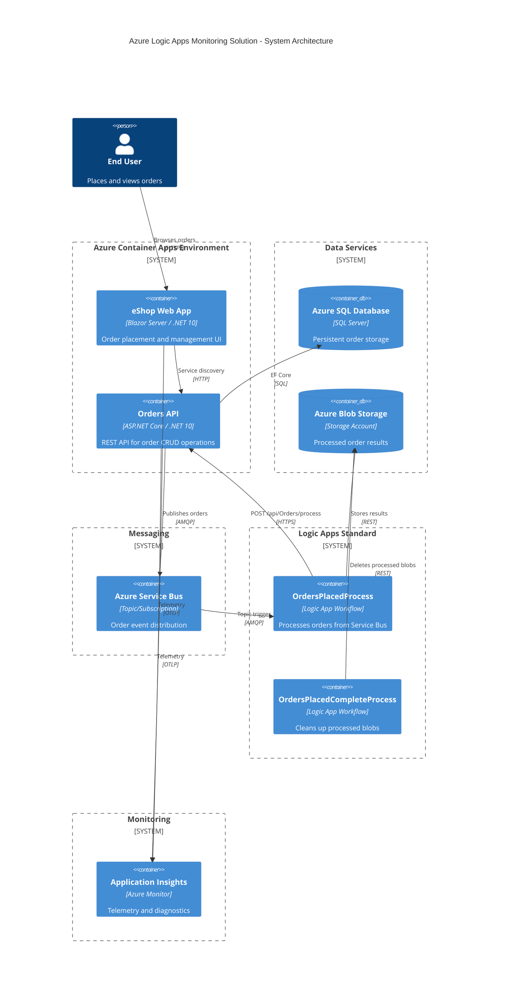

# Azure Logic Apps Monitoring Solution


> [!NOTE]
> This solution requires **.NET 10.0 SDK**, **Azure Developer CLI (azd) >= 1.11.0**, and an **Azure subscription** with permissions to create resources.

## Description

The **Azure Logic Apps Monitoring Solution** is an **end-to-end order management and monitoring platform** built on **.NET Aspire**, **Azure Logic Apps Standard**, and **Azure Container Apps**. It demonstrates how to integrate **event-driven workflows** with a **cloud-native web application** to process, track, and monitor e-commerce orders through **Azure Service Bus** messaging and **Logic App workflows** (source: [azure.yaml](azure.yaml), [app.AppHost/AppHost.cs](app.AppHost/AppHost.cs)).

The solution implements a **Blazor Server front-end** for placing and viewing orders, an **ASP.NET Core Web API** for order persistence in **Azure SQL Database**, and two **Logic App Standard workflows** that automate order processing and cleanup. The **OrdersPlacedProcess workflow** consumes messages from a **Service Bus topic**, forwards them to the **Orders API**, and stores results in **Azure Blob Storage**. The **OrdersPlacedCompleteProcess workflow** periodically cleans up successfully processed order blobs (source: [workflows/OrdersManagement/OrdersManagementLogicApp/OrdersPlacedProcess/workflow.json](workflows/OrdersManagement/OrdersManagementLogicApp/OrdersPlacedProcess/workflow.json), [workflows/OrdersManagement/OrdersManagementLogicApp/OrdersPlacedCompleteProcess/workflow.json](workflows/OrdersManagement/OrdersManagementLogicApp/OrdersPlacedCompleteProcess/workflow.json)).

**Observability** is built in from the ground up with **OpenTelemetry** instrumentation, **Azure Monitor** integration, and **Application Insights** telemetry across all services. The entire infrastructure is defined as **Bicep IaC** templates and deployed via the **Azure Developer CLI (azd)** with automated **pre-provision**, **post-provision**, and **pre-deploy hooks** for database configuration, secret management, and workflow deployment (source: [app.ServiceDefaults/Extensions.cs](app.ServiceDefaults/Extensions.cs), [infra/main.bicep](infra/main.bicep)).

## Table of Contents

- [Features](#features)
- [Architecture](#architecture)
- [Technologies Used](#technologies-used)
- [Quick Start](#quick-start)
- [Configuration](#configuration)
- [Deployment](#deployment)
- [Usage](#usage)
- [Contributing](#contributing)
- [License](#license)

## Features

| Emoji | Feature | Description |
|:-----:|---------|-------------|
| 🛒 | **Order Placement** | Place **individual** or **batch orders** through the **Blazor Server UI** with real-time feedback (source: [src/eShop.Web.App/Components/Pages/PlaceOrder.razor](src/eShop.Web.App/Components/Pages/PlaceOrder.razor)) |
| 📋 | **Order Management** | **List**, **view**, and **track** orders stored in **Azure SQL Database** via the **REST API** (source: [src/eShop.Orders.API/Controllers/OrdersController.cs](src/eShop.Orders.API/Controllers/OrdersController.cs)) |
| ⚡ | **Event-Driven Processing** | **Service Bus topic** triggers **Logic App workflow** to automatically process incoming orders (source: [workflows/OrdersManagement/OrdersManagementLogicApp/OrdersPlacedProcess/workflow.json](workflows/OrdersManagement/OrdersManagementLogicApp/OrdersPlacedProcess/workflow.json)) |
| 🧹 | **Automated Cleanup** | **Recurrence-based workflow** deletes processed order blobs with **concurrent execution** (20 repetitions) (source: [workflows/OrdersManagement/OrdersManagementLogicApp/OrdersPlacedCompleteProcess/workflow.json](workflows/OrdersManagement/OrdersManagementLogicApp/OrdersPlacedCompleteProcess/workflow.json)) |
| 📊 | **Full Observability** | **OpenTelemetry** traces, metrics, and logs exported to **Azure Monitor** and **Application Insights** (source: [app.ServiceDefaults/Extensions.cs](app.ServiceDefaults/Extensions.cs)) |
| 🔒 | **Managed Identity Auth** | **User-assigned managed identity** for **Service Bus**, **Blob Storage**, and **SQL** access — no stored credentials (source: [infra/shared/main.bicep](infra/shared/main.bicep)) |
| 🏗️ | **Infrastructure as Code** | Complete **Bicep templates** with **VNet isolation**, **private endpoints**, and **multi-environment** support (source: [infra/main.bicep](infra/main.bicep)) |
| 🚀 | **One-Command Deploy** | **`azd up`** provisions infrastructure and deploys all services including **Logic App workflows** (source: [azure.yaml](azure.yaml)) |
| 🩺 | **Health Checks** | Built-in **database** and **Service Bus** health endpoints at `/health` and `/alive` (source: [app.ServiceDefaults/Extensions.cs](app.ServiceDefaults/Extensions.cs)) |
| 🧪 | **Test Coverage** | **Unit** and **integration tests** for all projects: AppHost, ServiceDefaults, Orders API, and Web App (source: [src/tests/](src/tests/)) |

## Architecture

The solution follows an **event-driven microservices architecture** orchestrated by **.NET Aspire** and deployed to **Azure Container Apps**. The **Blazor Server front-end** communicates with the **Orders API** via **service discovery**. Orders published to **Azure Service Bus** are consumed by **Logic App Standard workflows** that process them through the API and persist results to **Azure Blob Storage**. All components emit **OpenTelemetry** data to **Application Insights** for unified monitoring (source: [app.AppHost/AppHost.cs](app.AppHost/AppHost.cs), [infra/workload/main.bicep](infra/workload/main.bicep)).


```mermaid
C4Context
    title Azure Logic Apps Monitoring Solution - System Architecture

    Person(user, "End User", "Places and views orders")

    System_Boundary(containerApps, "Azure Container Apps Environment") {
        Container(webApp, "eShop Web App", "Blazor Server / .NET 10", "Order placement and management UI")
        Container(ordersApi, "Orders API", "ASP.NET Core / .NET 10", "REST API for order CRUD operations")
    }

    System_Boundary(dataServices, "Data Services") {
        ContainerDb(sqlDb, "Azure SQL Database", "SQL Server", "Persistent order storage")
        ContainerDb(blobStorage, "Azure Blob Storage", "Storage Account", "Processed order results")
    }

    System_Boundary(messaging, "Messaging") {
        Container(serviceBus, "Azure Service Bus", "Topic/Subscription", "Order event distribution")
    }

    System_Boundary(workflows, "Logic Apps Standard") {
        Container(processWf, "OrdersPlacedProcess", "Logic App Workflow", "Processes orders from Service Bus")
        Container(cleanupWf, "OrdersPlacedCompleteProcess", "Logic App Workflow", "Cleans up processed blobs")
    }

    System_Boundary(monitoring, "Monitoring") {
        Container(appInsights, "Application Insights", "Azure Monitor", "Telemetry and diagnostics")
    }

    Rel(user, webApp, "Browses orders", "HTTPS")
    Rel(webApp, ordersApi, "Service discovery", "HTTP")
    Rel(ordersApi, sqlDb, "EF Core", "SQL")
    Rel(ordersApi, serviceBus, "Publishes orders", "AMQP")
    Rel(serviceBus, processWf, "Topic trigger", "AMQP")
    Rel(processWf, ordersApi, "POST /api/Orders/process", "HTTPS")
    Rel(processWf, blobStorage, "Stores results", "REST")
    Rel(cleanupWf, blobStorage, "Deletes processed blobs", "REST")
    Rel(webApp, appInsights, "Telemetry", "OTLP")
    Rel(ordersApi, appInsights, "Telemetry", "OTLP")
```

## Technologies Used

| Category | Technology | Version | Purpose |
|----------|-----------|---------|---------|
| **Runtime** | .NET SDK | **10.0** | Application runtime and build toolchain (source: [global.json](global.json)) |
| **Orchestration** | .NET Aspire | **13.x** | Service orchestration, discovery, and local development (source: [app.AppHost/app.AppHost.csproj](app.AppHost/app.AppHost.csproj)) |
| **Front-End** | Blazor Server | **.NET 10** | Interactive server-rendered UI with **FluentUI 4.14.0** (source: [src/eShop.Web.App/eShop.Web.App.csproj](src/eShop.Web.App/eShop.Web.App.csproj)) |
| **API** | ASP.NET Core | **.NET 10** | RESTful Web API with **Swagger/OpenAPI** (source: [src/eShop.Orders.API/eShop.Orders.API.csproj](src/eShop.Orders.API/eShop.Orders.API.csproj)) |
| **Database** | Entity Framework Core | **10.0.5** | ORM for **Azure SQL Database** with migrations (source: [src/eShop.Orders.API/eShop.Orders.API.csproj](src/eShop.Orders.API/eShop.Orders.API.csproj)) |
| **Messaging** | Azure Service Bus | **7.20.1** | Event-driven order distribution via topics (source: [app.ServiceDefaults/app.ServiceDefaults.csproj](app.ServiceDefaults/app.ServiceDefaults.csproj)) |
| **Workflows** | Azure Logic Apps Standard | **1.0** | Automated order processing and cleanup (source: [infra/workload/logic-app.bicep](infra/workload/logic-app.bicep)) |
| **Hosting** | Azure Container Apps | — | Serverless container hosting for API and Web App (source: [azure.yaml](azure.yaml)) |
| **Observability** | OpenTelemetry | **1.15.x** | Distributed tracing, metrics, and logging (source: [app.ServiceDefaults/app.ServiceDefaults.csproj](app.ServiceDefaults/app.ServiceDefaults.csproj)) |
| **Monitoring** | Azure Application Insights | **1.7.0** | Cloud-native APM and telemetry aggregation (source: [app.ServiceDefaults/app.ServiceDefaults.csproj](app.ServiceDefaults/app.ServiceDefaults.csproj)) |
| **IaC** | Bicep | — | Infrastructure as Code templates (source: [infra/main.bicep](infra/main.bicep)) |
| **Deployment** | Azure Developer CLI (azd) | **>= 1.11.0** | One-command provisioning and deployment (source: [azure.yaml](azure.yaml)) |
| **Identity** | Azure.Identity | **1.21.0** | Managed identity and credential management (source: [app.ServiceDefaults/app.ServiceDefaults.csproj](app.ServiceDefaults/app.ServiceDefaults.csproj)) |

## Quick Start

### Prerequisites

| Prerequisite | Version | Installation |
|-------------|---------|-------------|
| **.NET SDK** | **10.0** | [Download .NET](https://dotnet.microsoft.com/download/dotnet/10.0) |
| **Azure Developer CLI** | **>= 1.11.0** | [Install azd](https://learn.microsoft.com/azure/developer/azure-developer-cli/install-azd) |
| **Azure Subscription** | — | [Create free account](https://azure.microsoft.com/free/) |
| **Docker Desktop** | **Latest** | [Install Docker](https://www.docker.com/products/docker-desktop/) |

### Steps

1. **Clone** the repository:

   ```bash
   git clone https://github.com/Evilazaro/Azure-LogicApps-Monitoring.git
   cd Azure-LogicApps-Monitoring
   ```

2. **Restore** dependencies:

   ```bash
   dotnet restore app.sln
   ```

3. **Run** locally with .NET Aspire:

   ```bash
   dotnet run --project app.AppHost/app.AppHost.csproj
   ```

   The **Aspire Dashboard** opens automatically at `https://localhost:15888` showing all services, traces, and health status (source: [app.AppHost/AppHost.cs](app.AppHost/AppHost.cs)).

4. **Verify** — Open the **Web App** URL shown in the Aspire Dashboard and confirm the **Home page** loads with navigation to **Place Order** and **List All Orders** (source: [src/eShop.Web.App/Components/Pages/Home.razor](src/eShop.Web.App/Components/Pages/Home.razor)).

## Configuration

The following **runtime configuration** settings control application behavior. All settings are defined in **`appsettings.json`** files and can be overridden via **environment variables** or **Azure App Configuration** (source: [src/eShop.Orders.API/appsettings.json](src/eShop.Orders.API/appsettings.json), [src/eShop.Web.App/appsettings.json](src/eShop.Web.App/appsettings.json)).

| Setting | Feature | Default | Source |
|---------|---------|---------|--------|
| **`Logging:LogLevel:Default`** | **Application Logging** | `Information` | [src/eShop.Orders.API/appsettings.json](src/eShop.Orders.API/appsettings.json) |
| **`Logging:LogLevel:Microsoft.EntityFrameworkCore`** | **Database Query Logging** | `Warning` | [src/eShop.Orders.API/appsettings.json](src/eShop.Orders.API/appsettings.json) |
| **`HttpClient:OrdersAPIService:Timeout`** | **API Client Timeout** | `00:02:00` | [src/eShop.Orders.API/appsettings.json](src/eShop.Orders.API/appsettings.json) |
| **`HttpClient:OrdersAPIService:Resilience:MaxRetryAttempts`** | **HTTP Retry Policy** | `2` | [src/eShop.Orders.API/appsettings.json](src/eShop.Orders.API/appsettings.json) |
| **`HttpClient:OrdersAPIService:Resilience:AttemptTimeout`** | **Per-Attempt Timeout** | `00:00:30` | [src/eShop.Orders.API/appsettings.json](src/eShop.Orders.API/appsettings.json) |
| **`Azure:AllowResourceGroupCreation`** | **Aspire Azure Provisioning** | `false` | [app.AppHost/appsettings.json](app.AppHost/appsettings.json) |
| **`ConnectionStrings:ordersdb`** | **Database Connection** | *(Aspire-managed)* | [app.AppHost/AppHost.cs](app.AppHost/AppHost.cs) |
| **`ConnectionStrings:messaging`** | **Service Bus Connection** | *(Aspire-managed)* | [app.AppHost/AppHost.cs](app.AppHost/AppHost.cs) |

**Override example** using environment variables:

```bash
export Logging__LogLevel__Default=Debug
export HttpClient__OrdersAPIService__Timeout=00:05:00
```

## Deployment

Deploy the complete solution to **Azure** with a single command using the **Azure Developer CLI** (source: [azure.yaml](azure.yaml)):

1. **Authenticate** with Azure:

   ```bash
   azd auth login
   ```

2. **Provision and deploy** all resources:

   ```bash
   azd up
   ```

   This executes the following **automated pipeline** (source: [azure.yaml](azure.yaml)):
   - **Pre-provision hook**: Validates dev workstation prerequisites and runs `dotnet build` and `dotnet test` (source: [hooks/preprovision.ps1](hooks/preprovision.ps1))
   - **Infrastructure provisioning**: Deploys **VNet**, **managed identity**, **Log Analytics**, **App Insights**, **Azure SQL**, **Service Bus**, **Container Apps**, and **Logic Apps Standard** via Bicep (source: [infra/main.bicep](infra/main.bicep))
   - **Post-provision hook**: Configures **SQL managed identity** access and stores **secrets** (source: [hooks/postprovision.ps1](hooks/postprovision.ps1))
   - **Pre-deploy hook**: Deploys **Logic App workflows** to the provisioned Logic App Standard resource (source: [hooks/deploy-workflow.ps1](hooks/deploy-workflow.ps1))

3. **Generate test orders** (optional):

   ```bash
   ./hooks/Generate-Orders.ps1
   ```

4. **Verify** — Navigate to the **Web App URL** output by `azd up` and confirm orders appear in the **List All Orders** page.

## Usage

### Place an Order via the Web UI

Navigate to the **Web App** and select **Place Order** from the navigation menu. Fill in the **order details** and submit. The order is persisted to **Azure SQL** and published to **Service Bus** for asynchronous processing (source: [src/eShop.Web.App/Components/Pages/PlaceOrder.razor](src/eShop.Web.App/Components/Pages/PlaceOrder.razor)).

### Place an Order via the API

```bash
curl -X POST https://<orders-api-url>/api/Orders \
  -H "Content-Type: application/json" \
  -d '{
    "customerName": "Jane Doe",
    "products": [
      { "name": "Widget", "price": 9.99, "quantity": 2 }
    ]
  }'
```

(source: [src/eShop.Orders.API/eShop.Orders.API.http](src/eShop.Orders.API/eShop.Orders.API.http))

### List All Orders

```bash
curl https://<orders-api-url>/api/Orders
```

### View Health Status

```bash
curl https://<orders-api-url>/health
```

Returns the **health check** status for **database** and **Service Bus** connectivity (source: [app.ServiceDefaults/Extensions.cs](app.ServiceDefaults/Extensions.cs)).

### Batch Order Generation

Use the provided **hook script** to generate test orders in bulk:

```powershell
./hooks/Generate-Orders.ps1
```

(source: [hooks/Generate-Orders.ps1](hooks/Generate-Orders.ps1))

## Contributing

Contributions are **welcome**! To contribute:

1. **Fork** the repository
2. **Create** a feature branch (`git checkout -b feature/my-feature`)
3. **Commit** your changes (`git commit -m 'Add my feature'`)
4. **Push** to the branch (`git push origin feature/my-feature`)
5. **Open** a Pull Request

Please ensure all **tests pass** before submitting:

```bash
dotnet test app.sln
```

## License

This project is licensed under the **MIT License** — see the [LICENSE](LICENSE) file for details.

**Author**: [Evilazaro Alves](https://github.com/Evilazaro) — Principal Cloud Solution Architect, Microsoft (source: [LICENSE](LICENSE))
