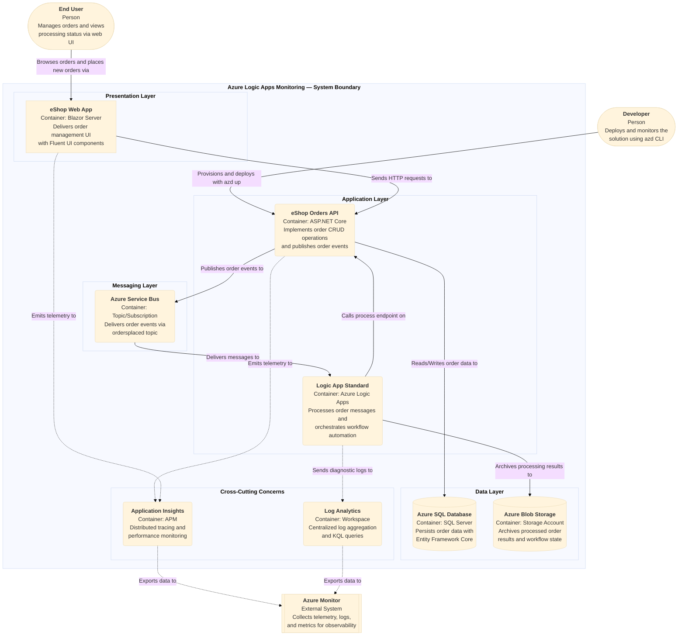

# Azure Logic Apps Monitoring Solution


> [!NOTE]
> Replace the badge URLs above with actual pipeline and coverage service URLs once CI/CD is configured.

**Azure Logic Apps Monitoring Solution** is a comprehensive, cloud-native monitoring and order management platform built on **.NET Aspire** orchestration. It demonstrates end-to-end observability for **Azure Logic Apps Standard** workflows integrated with microservices, using Application Insights, Log Analytics, and Service Bus for distributed tracing and telemetry.

This solution solves the challenge of monitoring and managing order processing workflows across distributed systems. It provides a unified platform where **Logic Apps** workflows process orders received via **Azure Service Bus**, persist them to **Azure SQL Database**, and store processing results in **Azure Blob Storage** — all with full observability through **OpenTelemetry** and **Azure Monitor**.

The technology stack centers on **.NET 10**, **Blazor Server** for the web interface, **ASP.NET Core Web API** for the backend, and **Azure Developer CLI (azd)** for infrastructure provisioning via **Bicep** templates. The architecture leverages **Azure Container Apps** for hosting and **Managed Identity** for secure, passwordless service-to-service authentication.

## Table of Contents

- [Features](#features)
- [Architecture](#architecture)
- [Technologies Used](#technologies-used)
- [Quick Start](#quick-start)
- [Configuration](#configuration)
- [Deployment](#deployment)
- [Usage](#usage)
- [Contributing](#contributing)
- [License](#license)

## Features

| Feature                            | Description                                                                                                                       |
| ---------------------------------- | --------------------------------------------------------------------------------------------------------------------------------- |
| 📦 Order Management API            | RESTful API for placing, retrieving, and deleting orders with full validation and distributed tracing.                            |
| 🌐 Blazor Web Application          | Interactive server-side rendered UI built with **Fluent UI** components for managing and viewing orders.                          |
| ⚡ Logic Apps Workflows            | Automated order processing workflows that listen to Service Bus messages, call the Orders API, and store results in Blob Storage. |
| 📊 Distributed Observability       | End-to-end tracing with OpenTelemetry, Application Insights, and Log Analytics for full-stack visibility.                         |
| 🔄 Service Bus Integration         | Asynchronous message-driven architecture using Azure Service Bus topics and subscriptions for order events.                       |
| 🏗️ Infrastructure as Code          | Complete Azure infrastructure defined in Bicep with modular templates for shared and workload resources.                          |
| 🚀 .NET Aspire Orchestration       | Local development orchestration with service discovery, health checks, and automatic dependency management.                       |
| 🔐 Managed Identity Authentication | Passwordless authentication across all Azure services using User Assigned Managed Identity.                                       |
| 🧪 Comprehensive Test Suite        | Unit and integration tests for AppHost, ServiceDefaults, Orders API, and Web App projects.                                        |
| 📈 Health Monitoring               | Kubernetes and Azure Container Apps compatible health and liveness endpoints (`/health`, `/alive`).                               |

## Architecture

The solution follows a **microservices architecture** orchestrated by .NET Aspire, deployed to **Azure Container Apps** with supporting Azure services for messaging, data persistence, and observability. Logic Apps Standard workflows automate order processing by consuming Service Bus messages, invoking the Orders API, and archiving results to Blob Storage.


```mermaid
---
config:
  theme: base
  flowchart:
    htmlLabels: true
  themeVariables:
    fontSize: 16px
---
flowchart TB
    %% C4 Container Diagram — Azure Logic Apps Monitoring Solution

    %% ============================================================
    %% PERSONS / ACTORS
    %% ============================================================
    User([<b>End User</b><br>Person<br>Manages orders and views<br>processing status via web UI])
    Developer([<b>Developer</b><br>Person<br>Deploys and monitors the<br>solution using azd CLI])

    %% ============================================================
    %% EXTERNAL SYSTEMS
    %% ============================================================
    AzureMonitor[[<b>Azure Monitor</b><br>External System<br>Collects telemetry, logs,<br>and metrics for observability]]

    %% ============================================================
    %% SYSTEM BOUNDARY
    %% ============================================================
    subgraph SystemBoundary [<b>Azure Logic Apps Monitoring — System Boundary</b>]
        direction TB

        %% ========================================================
        %% PRESENTATION LAYER
        %% ========================================================
        subgraph Presentation [<b>Presentation Layer</b>]
            direction LR
            WebApp[<b>eShop Web App</b><br>Container: Blazor Server<br>Delivers order management UI<br>with Fluent UI components]
        end

        %% ========================================================
        %% APPLICATION LAYER
        %% ========================================================
        subgraph Application [<b>Application Layer</b>]
            direction LR
            OrdersAPI(<b>eShop Orders API</b><br>Container: ASP.NET Core<br>Implements order CRUD operations<br>and publishes order events)
            LogicApp(<b>Logic App Standard</b><br>Container: Azure Logic Apps<br>Processes order messages and<br>orchestrates workflow automation)
        end

        %% ========================================================
        %% DATA LAYER
        %% ========================================================
        subgraph Data [<b>Data Layer</b>]
            direction LR
            SqlDb[(<b>Azure SQL Database</b><br>Container: SQL Server<br>Persists order data with<br>Entity Framework Core)]
            BlobStorage[(<b>Azure Blob Storage</b><br>Container: Storage Account<br>Archives processed order<br>results and workflow state)]
        end

        %% ========================================================
        %% MESSAGING LAYER
        %% ========================================================
        subgraph Messaging [<b>Messaging Layer</b>]
            direction LR
            ServiceBus(<b>Azure Service Bus</b><br>Container: Topic/Subscription<br>Delivers order events via<br>ordersplaced topic)
        end

        %% ========================================================
        %% CROSS-CUTTING CONCERNS
        %% ========================================================
        subgraph CrossCutting [<b>Cross-Cutting Concerns</b>]
            direction LR
            AppInsights(<b>Application Insights</b><br>Container: APM<br>Distributed tracing and<br>performance monitoring)
            LogAnalytics(<b>Log Analytics</b><br>Container: Workspace<br>Centralized log aggregation<br>and KQL queries)
        end
    end

    %% ============================================================
    %% RELATIONSHIPS
    %% ============================================================

    %% Actor interactions
    User -- "Browses orders and places new orders via" --> WebApp
    Developer -- "Provisions and deploys with azd up" --> OrdersAPI

    %% Presentation to Application
    WebApp -- "Sends HTTP requests to" --> OrdersAPI

    %% Application to Data
    OrdersAPI -- "Reads/Writes order data to" --> SqlDb
    LogicApp -- "Archives processing results to" --> BlobStorage

    %% Application to Messaging
    OrdersAPI -- "Publishes order events to" --> ServiceBus
    ServiceBus -- "Delivers messages to" --> LogicApp
    LogicApp -- "Calls process endpoint on" --> OrdersAPI

    %% Cross-cutting interactions
    OrdersAPI -. "Emits telemetry to" .-> AppInsights
    WebApp -. "Emits telemetry to" .-> AppInsights
    LogicApp -. "Sends diagnostic logs to" .-> LogAnalytics
    AppInsights -. "Exports data to" .-> AzureMonitor
    LogAnalytics -. "Exports data to" .-> AzureMonitor
```

## Technologies Used

| Technology                           | Type           | Purpose                                                               |
| ------------------------------------ | -------------- | --------------------------------------------------------------------- |
| .NET 10                              | Runtime        | Application runtime for all services and the Aspire AppHost           |
| ASP.NET Core                         | Framework      | Web API framework for the Orders API with OpenAPI support             |
| Blazor Server                        | Framework      | Interactive server-side rendered web UI with SignalR                  |
| .NET Aspire 13.x                     | Orchestration  | Local development orchestration, service discovery, and health checks |
| Azure Container Apps                 | Hosting        | Production container hosting with auto-scaling                        |
| Azure Logic Apps Standard            | Workflow       | Automated order processing workflows triggered by Service Bus         |
| Azure Service Bus                    | Messaging      | Asynchronous message broker with topics and subscriptions             |
| Azure SQL Database                   | Database       | Relational data persistence with Entity Framework Core                |
| Azure Blob Storage                   | Storage        | Archive storage for processed order results                           |
| Application Insights                 | Monitoring     | Distributed tracing and application performance management            |
| Log Analytics                        | Monitoring     | Centralized log aggregation and KQL-based querying                    |
| OpenTelemetry                        | Observability  | Vendor-neutral distributed tracing, metrics, and logging              |
| Azure Bicep                          | Infrastructure | Declarative Infrastructure as Code for Azure resource provisioning    |
| Azure Developer CLI (azd)            | Tooling        | End-to-end provisioning and deployment automation                     |
| Entity Framework Core                | ORM            | Object-relational mapping with SQL Server provider and retry policies |
| Fluent UI Blazor                     | UI Library     | Microsoft Fluent design system components for the web app             |
| Azure Identity                       | Security       | Managed Identity and DefaultAzureCredential authentication            |
| Swashbuckle                          | Documentation  | OpenAPI/Swagger API documentation generation                          |
| Microsoft.Extensions.Http.Resilience | Resilience     | HTTP retry policies, circuit breakers, and timeout handling           |

## Quick Start

### Prerequisites

| Prerequisite              | Version   | Purpose                                      |
| ------------------------- | --------- | -------------------------------------------- |
| .NET SDK                  | 10.0.100+ | Build and run the application                |
| Azure Developer CLI (azd) | 1.11.0+   | Provision and deploy Azure infrastructure    |
| Azure CLI                 | 2.60.0+   | Azure authentication and resource management |
| Docker                    | Latest    | Local development container support          |
| Bicep CLI                 | Latest    | Infrastructure template compilation          |

### Installation

1. Clone the repository:

```bash
git clone https://github.com/Evilazaro/Azure-LogicApps-Monitoring.git
cd Azure-LogicApps-Monitoring
```

2. Restore dependencies and build the solution:

```bash
dotnet restore
dotnet build --configuration Debug
```

3. Run the application locally with .NET Aspire:

```bash
cd app.AppHost
dotnet run
```

> [!TIP]
> The Aspire AppHost automatically starts the Orders API and Web App with service discovery. Open the Aspire dashboard URL displayed in the terminal to view all running services.

4. Verify the Orders API is running:

```bash
curl https://localhost:5001/api/Orders
```

## Configuration

| Option                                 | Default              | Description                                                      |
| -------------------------------------- | -------------------- | ---------------------------------------------------------------- |
| `Azure:TenantId`                       | —                    | Azure AD tenant ID for local development authentication          |
| `Azure:ClientId`                       | —                    | Azure AD client ID for local development authentication          |
| `Azure:ResourceGroup`                  | —                    | Azure resource group name for existing resource references       |
| `Azure:ServiceBus:HostName`            | `localhost`          | Service Bus namespace FQDN; set to `localhost` for emulator mode |
| `Azure:ServiceBus:TopicName`           | `ordersplaced`       | Service Bus topic name for order events                          |
| `Azure:ServiceBus:SubscriptionName`    | `orderprocessingsub` | Service Bus subscription name for order processing               |
| `Azure:ApplicationInsights:Name`       | —                    | Application Insights resource name for telemetry export          |
| `ApplicationInsights:ConnectionString` | —                    | Application Insights connection string for direct telemetry      |
| `ConnectionStrings:OrderDb`            | —                    | SQL Server connection string for order data persistence          |
| `ConnectionStrings:messaging`          | —                    | Service Bus connection string for local emulator mode            |
| `MESSAGING_HOST`                       | —                    | Alternative Service Bus hostname configuration                   |

> [!IMPORTANT]
> In Azure deployment, all connection strings and secrets are managed through **Managed Identity** and **Azure Key Vault**. Do not store credentials in configuration files for production environments.

### Example Override (User Secrets)

```bash
dotnet user-secrets set "Azure:ServiceBus:HostName" "my-namespace.servicebus.windows.net" --project src/eShop.Orders.API
dotnet user-secrets set "Azure:TenantId" "your-tenant-id" --project app.AppHost
```

## Deployment

1. Authenticate with Azure:

```bash
azd auth login
```

2. Create a new environment:

```bash
azd env new <environment-name>
```

3. Provision infrastructure and deploy the application:

```bash
azd up
```

> [!WARNING]
> The `preprovision` hook validates your development workstation, builds the solution, and runs tests before provisioning. Ensure all prerequisites are installed to avoid deployment failures.

4. The deployment provisions the following Azure resources:
   - Resource Group (`rg-orders-{env}-{location}`)
   - Azure Container Apps Environment with VNet integration
   - Azure SQL Server and Database with Entra ID authentication
   - Azure Service Bus namespace with topics and subscriptions
   - Azure Logic Apps Standard with workflow definitions
   - Application Insights and Log Analytics workspace
   - Azure Blob Storage for workflow state and order archives
   - User Assigned Managed Identity with RBAC assignments

5. To tear down all resources:

```bash
azd down
```

## Usage

### Place an Order via API

```bash
curl -X POST https://localhost:5001/api/Orders \
  -H "Content-Type: application/json" \
  -d '{
    "id": "order-001",
    "total": 99.99,
    "products": [
      {
        "name": "Widget",
        "quantity": 2,
        "price": 49.99
      }
    ]
  }'
```

Expected response (HTTP 201):

```json
{
  "id": "order-001",
  "total": 99.99,
  "status": "Placed",
  "products": [
    {
      "name": "Widget",
      "quantity": 2,
      "price": 49.99
    }
  ]
}
```

### Generate Test Orders

Use the provided hook script to generate sample orders for testing:

```powershell
./hooks/Generate-Orders.ps1 --force --verbose
```

```bash
./hooks/Generate-Orders.sh --force --verbose
```

### Order Processing Workflow

Once an order is placed, the **Logic Apps** workflows process it automatically:

1. The Orders API publishes an event to the `ordersplaced` Service Bus topic.
2. The `OrdersPlacedProcess` Logic App workflow triggers on new Service Bus messages.
3. The workflow calls the Orders API `/api/Orders/process` endpoint.
4. On success (HTTP 201), the workflow archives the order to Blob Storage under `/ordersprocessedsuccessfully`.
5. The `OrdersPlacedCompleteProcess` workflow runs on a recurrence schedule, listing and finalizing processed orders.

## Contributing

Contributions are welcome. To contribute to this project:

1. Fork the repository.
2. Create a feature branch from `main`.
3. Make your changes and ensure all tests pass:

```bash
dotnet test --configuration Debug --verbosity minimal
```

4. Submit a pull request with a clear description of your changes.

> [!TIP]
> Run the preprovision hook locally to validate your workstation setup before submitting changes: `./hooks/preprovision.ps1 -ValidateOnly`

## License

This project is licensed under the **MIT License**. See the [LICENSE](LICENSE) file for details.

Created by **Evilazaro Alves** | Principal Cloud Solution Architect | Cloud Platforms and AI Apps | Microsoft.
