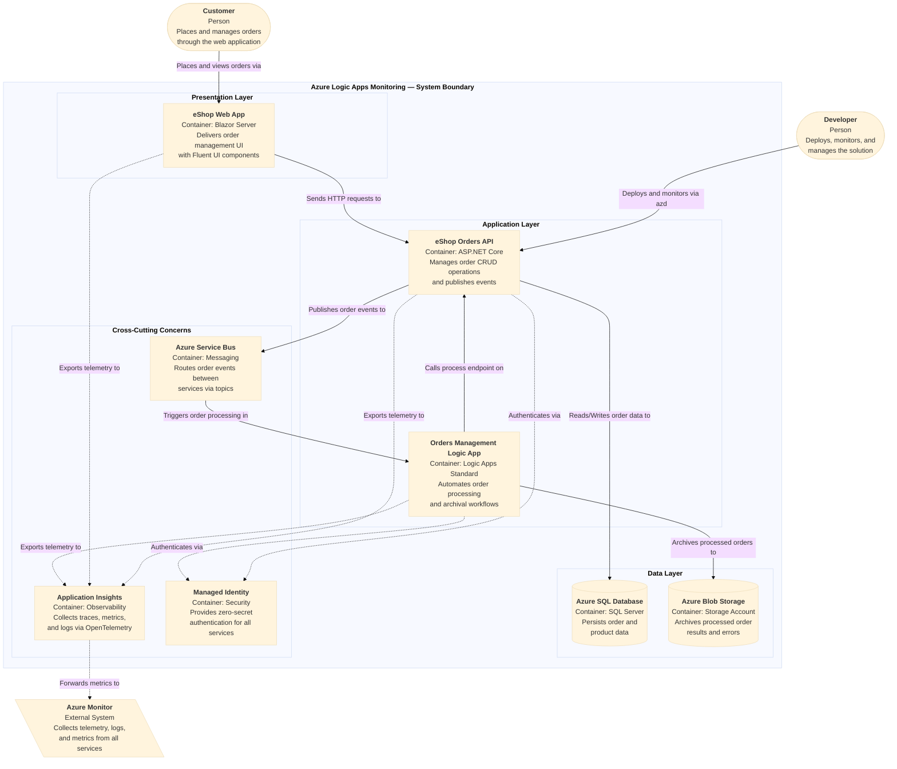

# Azure Logic Apps Monitoring Solution


> [!NOTE]
> Replace the badges above with actual pipeline URLs once your CI/CD pipeline is configured.

**Azure Logic Apps Monitoring** is a comprehensive monitoring and order-processing solution built on **.NET Aspire** orchestration. It demonstrates an end-to-end distributed system that integrates **Azure Logic Apps Standard** workflows with a microservices-based eShop application deployed to **Azure Container Apps**.

This solution solves the challenge of monitoring and automating order processing workflows at scale. It uses **Azure Service Bus** for event-driven messaging, **Azure Logic Apps** for workflow automation and error handling, and **Application Insights** with **OpenTelemetry** for full-stack observability across all services.

The technology stack leverages **.NET 10**, **Blazor Server** with **Fluent UI** for the frontend, **ASP.NET Core** Web API with **Entity Framework Core** for the backend, and **Azure Bicep** for declarative infrastructure provisioning via the **Azure Developer CLI** (`azd`).

## Table of Contents

- [Features](#features)
- [Architecture](#architecture)
- [Technologies Used](#technologies-used)
- [Quick Start](#quick-start)
- [Configuration](#configuration)
- [Deployment](#deployment)
- [Usage](#usage)
- [Contributing](#contributing)
- [License](#license)

## Features

| Feature                      | Description                                                                                                        |
| ---------------------------- | ------------------------------------------------------------------------------------------------------------------ |
| 🛒 Order Management API      | RESTful API for placing, retrieving, and deleting customer orders with full CRUD operations.                       |
| 🌐 Blazor Web Frontend       | Interactive server-side rendered web application with **Fluent UI** components for order management.               |
| ⚡ Logic Apps Workflows      | Automated order processing workflows that validate, process, and archive orders via **Azure Logic Apps Standard**. |
| 📨 Event-Driven Messaging    | Asynchronous order event publishing and consumption through **Azure Service Bus** topics and subscriptions.        |
| 📊 Full-Stack Observability  | Distributed tracing, metrics, and logging with **OpenTelemetry** and **Azure Application Insights**.               |
| 🏗️ .NET Aspire Orchestration | Service discovery, health checks, and resilience patterns managed by the **.NET Aspire** AppHost.                  |
| 🔐 Managed Identity Security | Zero-secret authentication using **Azure Managed Identity** for all service-to-service communication.              |
| 🚀 Infrastructure as Code    | Declarative Azure infrastructure provisioning with **Bicep** templates and automated lifecycle hooks.              |
| 🧪 Comprehensive Testing     | Unit and integration test suites for the AppHost, ServiceDefaults, Orders API, and Web App projects.               |

## Architecture

The **Azure Logic Apps Monitoring Solution** follows a microservices architecture orchestrated by .NET Aspire. The system processes customer orders through an API layer, publishes events to a message bus, and automates downstream workflows using Logic Apps Standard. All services communicate securely via Managed Identity and export telemetry to a centralized observability platform.


```mermaid
---
config:
  theme: base
  flowchart:
    htmlLabels: true
  themeVariables:
    fontSize: 16px
---
flowchart TB
    %% C4 Container Diagram — Azure Logic Apps Monitoring Solution

    %% ============================================================
    %% PERSONS / ACTORS
    %% ============================================================
    Customer([<b>Customer</b><br>Person<br>Places and manages orders<br>through the web application])
    Developer([<b>Developer</b><br>Person<br>Deploys, monitors, and<br>manages the solution])

    %% ============================================================
    %% EXTERNAL SYSTEMS
    %% ============================================================
    AzureMonitor[\<b>Azure Monitor</b><br>External System<br>Collects telemetry, logs,<br>and metrics from all services\]

    %% ============================================================
    %% SYSTEM BOUNDARY
    %% ============================================================
    subgraph SystemBoundary [<b>Azure Logic Apps Monitoring — System Boundary</b>]
        direction TB

        %% ========================================================
        %% PRESENTATION LAYER
        %% ========================================================
        subgraph Presentation [<b>Presentation Layer</b>]
            direction LR
            WebApp[<b>eShop Web App</b><br>Container: Blazor Server<br>Delivers order management UI<br>with Fluent UI components]
        end

        %% ========================================================
        %% APPLICATION LAYER
        %% ========================================================
        subgraph Application [<b>Application Layer</b>]
            direction LR
            OrdersAPI[<b>eShop Orders API</b><br>Container: ASP.NET Core<br>Manages order CRUD operations<br>and publishes events]
            LogicApp[<b>Orders Management Logic App</b><br>Container: Logic Apps Standard<br>Automates order processing<br>and archival workflows]
        end

        %% ========================================================
        %% DATA LAYER
        %% ========================================================
        subgraph Data [<b>Data Layer</b>]
            direction LR
            SqlDB[(<b>Azure SQL Database</b><br>Container: SQL Server<br>Persists order and<br>product data)]
            BlobStorage[(<b>Azure Blob Storage</b><br>Container: Storage Account<br>Archives processed order<br>results and errors)]
        end

        %% ========================================================
        %% CROSS-CUTTING CONCERNS
        %% ========================================================
        subgraph CrossCutting [<b>Cross-Cutting Concerns</b>]
            direction LR
            ServiceBus[<b>Azure Service Bus</b><br>Container: Messaging<br>Routes order events between<br>services via topics]
            AppInsights[<b>Application Insights</b><br>Container: Observability<br>Collects traces, metrics,<br>and logs via OpenTelemetry]
            ManagedIdentity[<b>Managed Identity</b><br>Container: Security<br>Provides zero-secret<br>authentication for all services]
        end
    end

    %% ============================================================
    %% RELATIONSHIPS
    %% ============================================================

    %% Actor interactions
    Customer -- "Places and views orders via" --> WebApp
    Developer -- "Deploys and monitors via azd" --> OrdersAPI

    %% Presentation to Application
    WebApp -- "Sends HTTP requests to" --> OrdersAPI

    %% Application to Data
    OrdersAPI -- "Reads/Writes order data to" --> SqlDB
    LogicApp -- "Archives processed orders to" --> BlobStorage

    %% Messaging interactions
    OrdersAPI -- "Publishes order events to" --> ServiceBus
    ServiceBus -- "Triggers order processing in" --> LogicApp
    LogicApp -- "Calls process endpoint on" --> OrdersAPI

    %% Observability
    OrdersAPI -. "Exports telemetry to" .-> AppInsights
    WebApp -. "Exports telemetry to" .-> AppInsights
    LogicApp -. "Exports telemetry to" .-> AppInsights
    AppInsights -. "Forwards metrics to" .-> AzureMonitor

    %% Security
    OrdersAPI -. "Authenticates via" .-> ManagedIdentity
    LogicApp -. "Authenticates via" .-> ManagedIdentity
```

## Technologies Used

| Technology                           | Type            | Purpose                                                         |
| ------------------------------------ | --------------- | --------------------------------------------------------------- |
| .NET 10                              | Runtime         | Application runtime for all services                            |
| ASP.NET Core                         | Framework       | Web API framework for the Orders API                            |
| Blazor Server                        | Framework       | Interactive server-side UI rendering for the Web App            |
| .NET Aspire 13.x                     | Orchestrator    | Service orchestration, discovery, health checks, and resilience |
| Entity Framework Core                | ORM             | Database access and migrations for Azure SQL                    |
| Microsoft Fluent UI                  | UI Library      | Component library for the Blazor frontend                       |
| Azure Logic Apps Standard            | Workflow Engine | Automated order processing and archival workflows               |
| Azure Service Bus                    | Messaging       | Asynchronous event-driven communication between services        |
| Azure SQL Database                   | Database        | Persistent storage for orders and product data                  |
| Azure Blob Storage                   | Storage         | Archival of processed order results                             |
| Azure Container Apps                 | Hosting         | Serverless container hosting for API and Web App                |
| Azure Application Insights           | Observability   | Distributed tracing, metrics, and log aggregation               |
| OpenTelemetry                        | Telemetry       | Vendor-neutral instrumentation for traces and metrics           |
| Azure Managed Identity               | Security        | Passwordless authentication for all Azure services              |
| Azure Bicep                          | IaC             | Declarative infrastructure provisioning templates               |
| Azure Developer CLI (azd)            | Tooling         | End-to-end deployment lifecycle management                      |
| Swashbuckle                          | API Docs        | OpenAPI/Swagger documentation generation                        |
| Azure.Identity                       | Library         | Managed Identity credential provider                            |
| Microsoft.Extensions.Http.Resilience | Library         | HTTP retry policies and circuit breakers                        |

## Quick Start

### Prerequisites

| Prerequisite              | Minimum Version | Purpose                         |
| ------------------------- | --------------- | ------------------------------- |
| .NET SDK                  | 10.0.100        | Build and run the application   |
| Azure CLI                 | 2.60.0          | Azure resource management       |
| Azure Developer CLI (azd) | 1.11.0          | Deployment lifecycle automation |
| Docker                    | Latest          | Local container emulation       |

> [!IMPORTANT]
> Ensure all prerequisites are installed and available on your system `PATH` before proceeding.

### Installation Steps

1. Clone the repository:

```bash
git clone https://github.com/Evilazaro/Azure-LogicApps-Monitoring.git
cd Azure-LogicApps-Monitoring
```

2. Restore dependencies and build the solution:

```bash
dotnet restore --verbosity minimal
dotnet build --configuration Debug --verbosity minimal
```

3. Run the application locally using the .NET Aspire AppHost:

```bash
dotnet run --project app.AppHost/app.AppHost.csproj
```

4. Open the Aspire Dashboard at the URL shown in the terminal output to view all services, health checks, and telemetry.

### Minimal Working Example

```bash
# Start the Aspire AppHost (orchestrates all services)
dotnet run --project app.AppHost/app.AppHost.csproj

# In a separate terminal, place a test order via the Orders API
curl -X POST https://localhost:<port>/api/Orders \
  -H "Content-Type: application/json" \
  -d '{"id":"order-001","total":99.99,"products":[{"name":"Widget","price":99.99,"quantity":1}]}'
```

> [!TIP]
> The actual port is dynamically assigned by Aspire. Check the dashboard or terminal output for the Orders API endpoint URL.

## Configuration

| Option                                  | Default      | Description                                                 |
| --------------------------------------- | ------------ | ----------------------------------------------------------- |
| `ConnectionStrings:OrderDb`             | _(required)_ | SQL Server connection string for order persistence          |
| `ConnectionStrings:messaging`           | _(optional)_ | Service Bus connection string for local emulator            |
| `Azure:ServiceBus:HostName`             | _(optional)_ | Azure Service Bus fully qualified namespace                 |
| `APPLICATIONINSIGHTS_CONNECTION_STRING` | _(optional)_ | Application Insights connection string for telemetry export |
| `Azure:TenantId`                        | _(optional)_ | Azure AD tenant ID for local development authentication     |
| `Azure:ClientId`                        | _(optional)_ | Azure AD client ID for local development authentication     |
| `OTEL_EXPORTER_OTLP_ENDPOINT`           | _(optional)_ | OpenTelemetry collector endpoint for trace export           |
| `MESSAGING_HOST`                        | `localhost`  | Service Bus namespace hostname or `localhost` for emulator  |

### Configuration Override Example

Override settings via `appsettings.Development.json` or user secrets:

```json
{
  "ConnectionStrings": {
    "OrderDb": "Server=localhost;Database=OrdersDb;Trusted_Connection=True;TrustServerCertificate=True"
  },
  "Azure": {
    "ServiceBus": {
      "HostName": "my-namespace.servicebus.windows.net"
    },
    "TenantId": "<your-tenant-id>",
    "ClientId": "<your-client-id>"
  }
}
```

> [!WARNING]
> Never commit secrets or connection strings to source control. Use `dotnet user-secrets` for local development and **Azure Key Vault** for production deployments.

## Deployment

1. Authenticate with Azure:

```bash
azd auth login
```

2. Create a new deployment environment:

```bash
azd env new <environment-name>
```

3. Provision infrastructure and deploy the application:

```bash
azd up
```

> [!NOTE]
> The `azd up` command executes lifecycle hooks that build the solution, run tests, provision **Bicep** infrastructure, and configure post-deployment secrets automatically.

4. Verify the deployment by navigating to the Azure Container Apps URLs shown in the deployment output.

5. Generate sample order data for testing (runs automatically via `postprovision` hook, or manually):

```bash
./hooks/Generate-Orders.ps1 -Force -Verbose
```

6. To tear down all deployed resources:

```bash
azd down
```

### Infrastructure Layout

The `infra/` directory contains all **Bicep** templates organized as follows:

| Path               | Purpose                                                         |
| ------------------ | --------------------------------------------------------------- |
| `infra/main.bicep` | Entry point orchestrator                                        |
| `infra/shared/`    | Identity, monitoring, networking, and data resources            |
| `infra/workload/`  | Service Bus, Container Apps, Container Registry, and Logic Apps |

## Usage

### Place an Order via the API

```bash
curl -X POST https://<orders-api-url>/api/Orders \
  -H "Content-Type: application/json" \
  -d '{
    "id": "order-123",
    "total": 149.97,
    "products": [
      { "name": "Keyboard", "price": 79.99, "quantity": 1 },
      { "name": "Mouse", "price": 69.98, "quantity": 2 }
    ]
  }'
```

Expected response (HTTP 201 Created):

```json
{
  "id": "order-123",
  "total": 149.97,
  "status": "Placed",
  "products": [
    { "name": "Keyboard", "price": 79.99, "quantity": 1 },
    { "name": "Mouse", "price": 69.98, "quantity": 2 }
  ]
}
```

### Order Processing Workflow

Once an order is placed, the system executes the following automated workflow:

1. The **Orders API** publishes an order event to **Azure Service Bus**.
2. The **OrdersPlacedProcess** Logic App workflow triggers on new Service Bus messages.
3. The workflow validates the message content type and calls the Orders API `/api/Orders/process` endpoint.
4. On success (HTTP 201), the order payload is archived to the `ordersprocessedsuccessfully` blob container.
5. On failure, the order payload is archived to the `ordersprocessedwitherrors` blob container.
6. The **OrdersPlacedCompleteProcess** workflow runs on a recurrence schedule, lists processed blobs, and cleans up completed entries.

### Run Tests

```bash
dotnet test --configuration Debug --verbosity minimal
```

### View API Documentation

Access the Swagger UI at `https://<orders-api-url>/swagger` when the Orders API is running to explore all available endpoints interactively.

## Contributing

Contributions are welcome and encouraged. To contribute:

1. Fork the repository.
2. Create a feature branch from `main`.
3. Make your changes and ensure all tests pass with `dotnet test`.
4. Submit a pull request with a clear description of the changes.

> [!TIP]
> Open an issue first to discuss significant changes before investing development time.

## License

This project is licensed under the **MIT License**. See the [LICENSE](LICENSE) file for full details.
