# Azure Logic Apps Monitoring

[](https://opensource.org/licenses/MIT)
[](https://dotnet.microsoft.com/)
[](https://azure.microsoft.com/services/logic-apps/)

A cloud-native order management and monitoring solution built with .NET Aspire, Azure Logic Apps Standard, and modern Azure services. This reference architecture demonstrates enterprise-grade patterns for automated order processing, real-time monitoring, and distributed tracing.

## 📋 Table of Contents

- [Overview](#overview)
- [Architecture](#architecture)
- [Features](#features)
- [Prerequisites](#prerequisites)
- [Getting Started](#getting-started)
- [Project Structure](#project-structure)
- [Configuration](#configuration)
- [Deployment](#deployment)
- [Local Development](#local-development)
- [Monitoring & Observability](#monitoring--observability)
- [Contributing](#contributing)
- [License](#license)

## Overview

This solution provides a complete reference implementation for monitoring Azure Logic Apps workflows with:

- **Automated Order Processing**: Logic Apps workflows process orders through Azure Service Bus
- **Real-time Monitoring**: Application Insights and Log Analytics integration
- **Cloud-Native Architecture**: Azure Container Apps with .NET Aspire orchestration
- **Managed Identity Security**: Passwordless authentication to Azure services
- **Enterprise Patterns**: Event-driven architecture with comprehensive error handling

## Architecture

```mermaid
flowchart TB
    subgraph AzureResourceGroup["☁️ Azure Resource Group"]
        direction TB
        
        subgraph Frontend["🖥️ Frontend Layer"]
            WebApp["📱 Web App<br/>(Blazor / Fluent UI)"]
        end
        
        subgraph Backend["⚙️ Backend Services"]
            OrdersAPI["🔌 Orders API<br/>(ASP.NET Core)"]
            SQLDatabase[("🗄️ Azure SQL<br/>Database")]
        end
        
        subgraph Messaging["📨 Messaging Layer"]
            ServiceBus["📬 Azure Service Bus<br/>(Topics/Subscriptions)"]
        end
        
        subgraph Workflows["🔄 Workflow Engine"]
            LogicApps["⚡ Logic Apps Standard<br/>(Order Processing)"]
            BlobStorage["📦 Azure Blob Storage<br/>(Order Archives)"]
        end
        
        subgraph Monitoring["📊 Observability"]
            AppInsights["🔍 Application Insights"]
            LogAnalytics["📈 Log Analytics Workspace"]
        end
    end
    
    subgraph Orchestration["🎯 Local Development"]
        Aspire["🚀 .NET Aspire<br/>(Service Discovery)"]
    end
    
    WebApp -->|"HTTP/REST"| OrdersAPI
    OrdersAPI -->|"Persist Orders"| SQLDatabase
    OrdersAPI -->|"Publish Events"| ServiceBus
    ServiceBus -->|"Trigger Workflows"| LogicApps
    LogicApps -->|"Process Orders"| OrdersAPI
    LogicApps -->|"Archive Results"| BlobStorage
    
    WebApp -.->|"Telemetry"| AppInsights
    OrdersAPI -.->|"Telemetry"| AppInsights
    LogicApps -.->|"Diagnostics"| LogAnalytics
    AppInsights -.->|"Logs"| LogAnalytics
    
    Aspire -.->|"Orchestrates"| WebApp
    Aspire -.->|"Orchestrates"| OrdersAPI

    style AzureResourceGroup fill:#E3F2FD,stroke:#1565C0,stroke-width:2px
    style Frontend fill:#E8F5E9,stroke:#2E7D32,stroke-width:2px
    style Backend fill:#FFF3E0,stroke:#EF6C00,stroke-width:2px
    style Messaging fill:#F3E5F5,stroke:#7B1FA2,stroke-width:2px
    style Workflows fill:#E0F7FA,stroke:#00838F,stroke-width:2px
    style Monitoring fill:#FFEBEE,stroke:#C62828,stroke-width:2px
    style Orchestration fill:#FAFAFA,stroke:#616161,stroke-width:2px
    
    style WebApp fill:#C8E6C9,stroke:#2E7D32
    style OrdersAPI fill:#FFE0B2,stroke:#EF6C00
    style SQLDatabase fill:#FFE0B2,stroke:#EF6C00
    style ServiceBus fill:#E1BEE7,stroke:#7B1FA2
    style LogicApps fill:#B2EBF2,stroke:#00838F
    style BlobStorage fill:#B2EBF2,stroke:#00838F
    style AppInsights fill:#FFCDD2,stroke:#C62828
    style LogAnalytics fill:#FFCDD2,stroke:#C62828
    style Aspire fill:#F5F5F5,stroke:#616161
```



### Key Components

| Component | Technology | Description |
|-----------|------------|-------------|
| **Web App** | Blazor / Fluent UI | Order management dashboard with real-time tracking |
| **Orders API** | ASP.NET Core Minimal API | RESTful API with Entity Framework Core |
| **Message Broker** | Azure Service Bus | Asynchronous order processing with topics |
| **Workflow Engine** | Logic Apps Standard | Automated order processing workflows |
| **Database** | Azure SQL Database | Order persistence with managed identity auth |
| **Monitoring** | Application Insights | Distributed tracing and telemetry |
| **Orchestration** | .NET Aspire | Local development and service discovery |

## Features

- 🔄 **Real-time Order Tracking** - Monitor order status with live updates
- ☁️ **Azure-Powered Infrastructure** - Built on enterprise-grade Azure services
- ⚙️ **Automated Workflows** - Logic Apps process thousands of orders per minute
- 📊 **Advanced Analytics** - Application Insights dashboards and telemetry
- 🎨 **Modern UI/UX** - Fluent Design System with responsive layouts
- 🔐 **Secure by Default** - Managed identity authentication throughout
- 🚀 **Infrastructure as Code** - Complete Bicep templates for deployment

## Prerequisites

### Required Tools

| Tool | Minimum Version | Installation |
|------|-----------------|--------------|
| .NET SDK | 10.0+ | [Download](https://dotnet.microsoft.com/download/dotnet/10.0) |
| Azure CLI | 2.60.0+ | [Install](https://docs.microsoft.com/cli/azure/install-azure-cli) |
| Azure Developer CLI (azd) | Latest | [Install](https://learn.microsoft.com/azure/developer/azure-developer-cli/install-azd) |
| Bicep CLI | 0.30.0+ | [Install](https://learn.microsoft.com/azure/azure-resource-manager/bicep/install) |
| PowerShell | 7.0+ | [Install](https://docs.microsoft.com/powershell/scripting/install/installing-powershell) |

### Optional Tools

- **sqlcmd** - For SQL managed identity configuration
- **Docker** - For local container development
- **Visual Studio Code** - Recommended IDE with C# Dev Kit

### Azure Requirements

- Active Azure subscription
- Permissions to create resources and assign RBAC roles
- Required resource providers registered:
  - `Microsoft.App`
  - `Microsoft.ServiceBus`
  - `Microsoft.Storage`
  - `Microsoft.Web`
  - `Microsoft.ContainerRegistry`
  - `Microsoft.Insights`
  - `Microsoft.OperationalInsights`
  - `Microsoft.ManagedIdentity`

## Getting Started

### 1. Clone the Repository

```bash
git clone https://github.com/Evilazaro/Azure-LogicApps-Monitoring.git
cd Azure-LogicApps-Monitoring
```

### 2. Authenticate with Azure

```bash
az login
azd auth login
```

### 3. Initialize the Environment

```bash
azd init
```

### 4. Provision and Deploy

```bash
azd up
```

This command will:

1. Run pre-provisioning validations
2. Create Azure resources using Bicep templates
3. Configure managed identity permissions
4. Deploy applications to Azure Container Apps
5. Set up Logic Apps workflows

## Project Structure

```
├── app.AppHost/              # .NET Aspire orchestration host
│   ├── AppHost.cs            # Service definitions and configuration
│   └── infra/                # AppHost-specific infrastructure
├── app.ServiceDefaults/      # Shared service configuration
│   ├── Extensions.cs         # OpenTelemetry and health check setup
│   └── CommonTypes.cs        # Shared data types
├── src/
│   ├── eShop.Orders.API/     # Orders REST API
│   └── eShop.Web.App/        # Blazor web application
├── workflows/                # Logic Apps workflow definitions
├── infra/                    # Bicep infrastructure templates
│   ├── main.bicep            # Main deployment orchestration
│   ├── shared/               # Shared infrastructure (identity, monitoring, data)
│   └── workload/             # Workload-specific resources
├── hooks/                    # Azure Developer CLI hooks
│   ├── preprovision.*        # Pre-deployment validations
│   ├── postprovision.*       # Post-deployment configuration
│   └── deploy-workflow.*     # Logic Apps deployment
└── docs/                     # Documentation
```

## Configuration

### Environment Variables

The solution uses Azure Developer CLI environment variables. Key variables set during provisioning:

| Variable | Description |
|----------|-------------|
| `AZURE_SUBSCRIPTION_ID` | Azure subscription GUID |
| `AZURE_RESOURCE_GROUP` | Resource group name |
| `AZURE_LOCATION` | Azure region |
| `MANAGED_IDENTITY_CLIENT_ID` | Managed identity for authentication |
| `APPLICATIONINSIGHTS_CONNECTION_STRING` | App Insights connection |
| `MESSAGING_SERVICEBUSHOSTNAME` | Service Bus hostname |
| `ORDERSDATABASE_SQLSERVERFQDN` | SQL Server FQDN |

### User Secrets

For local development, secrets are managed via .NET User Secrets:

```bash
# Clear existing secrets
./hooks/clean-secrets.sh

# Set secrets after provisioning (automatic via postprovision hook)
dotnet user-secrets set "ConnectionStrings:SqlDatabase" "<connection-string>" --project app.AppHost
```

## Deployment

### Using Azure Developer CLI (Recommended)

```bash
# Full deployment
azd up

# Infrastructure only
azd provision

# Application deployment only
azd deploy
```

### Manual Bicep Deployment

```bash
az deployment sub create \
  --location westus3 \
  --template-file infra/main.bicep \
  --parameters envName=dev location=westus3
```

### Deployment Options

| Environment | Command | Description |
|-------------|---------|-------------|
| Development | `azd up --environment dev` | Development environment |
| Staging | `azd up --environment staging` | Pre-production testing |
| Production | `azd up --environment prod` | Production deployment |

## Local Development

### Running with .NET Aspire

```bash
cd app.AppHost
dotnet run
```

This starts:

- Aspire Dashboard (<https://localhost:18888>)
- Orders API
- Web Application
- Local service discovery

### Generate Test Data

```powershell
# PowerShell
./hooks/Generate-Orders.ps1 -OrderCount 100

# Bash
./hooks/Generate-Orders.sh --count 100
```

### Database Migrations

```bash
cd src/eShop.Orders.API
dotnet ef database update
```

## Monitoring & Observability

### Application Insights

- **Live Metrics**: Real-time performance monitoring
- **Distributed Tracing**: End-to-end request tracking
- **Application Map**: Visual dependency mapping
- **Failure Analysis**: Exception tracking and diagnostics

### Log Analytics

- **Container Logs**: Azure Container Apps logging
- **Logic Apps Runs**: Workflow execution history
- **Custom Queries**: KQL queries for advanced analysis

### Aspire Dashboard

Access the .NET Aspire Dashboard for local development:

- **Traces**: Distributed trace visualization
- **Metrics**: Real-time metrics
- **Logs**: Structured log aggregation

## API Endpoints

| Endpoint | Method | Description |
|----------|--------|-------------|
| `/api/orders` | GET | List all orders |
| `/api/orders` | POST | Create new order |
| `/api/orders/{id}` | GET | Get order by ID |
| `/api/orders/{id}` | DELETE | Delete order |

## Contributing

1. Fork the repository
2. Create a feature branch (`git checkout -b feature/amazing-feature`)
3. Commit changes (`git commit -m 'Add amazing feature'`)
4. Push to branch (`git push origin feature/amazing-feature`)
5. Open a Pull Request

### Development Guidelines

- Follow C# coding conventions
- Include XML documentation for public APIs
- Add unit tests for new functionality
- Update documentation as needed

## Troubleshooting

### Common Issues

**Pre-provisioning fails with missing tools**

```bash
./hooks/preprovision.sh --auto-install
```

**SQL Database connection issues**

```bash
./hooks/sql-managed-identity-config.sh \
  --sql-server-name <server> \
  --database-name <database> \
  --principal-name <identity-name>
```

**Clear and reset user secrets**

```bash
./hooks/clean-secrets.sh --force
```

## Additional Resources

- [Azure Logic Apps Documentation](https://docs.microsoft.com/azure/logic-apps/)
- [.NET Aspire Documentation](https://learn.microsoft.com/dotnet/aspire/)
- [Azure Container Apps](https://docs.microsoft.com/azure/container-apps/)
- [Azure Service Bus](https://docs.microsoft.com/azure/service-bus-messaging/)
- [Entity Framework Core](https://docs.microsoft.com/ef/core/)

## License

This project is licensed under the MIT License - see the LICENSE file for details.

---

<div align="center">

**[⬆ Back to Top](#azure-logic-apps-monitoring)**

Built with ❤️ using Azure and .NET

</div>
