# Azure Logic Apps Monitoring

[](https://github.com/Evilazaro/Azure-LogicApps-Monitoring/actions)
[](LICENSE)
[](https://dotnet.microsoft.com/)
[](https://azure.microsoft.com/products/container-apps/)
[](https://learn.microsoft.com/azure/developer/azure-developer-cli/)

**Azure Logic Apps Monitoring** is a production-ready reference solution that pairs a .NET Aspire–orchestrated eShop application with Azure Logic Apps Standard to deliver end-to-end order monitoring, asynchronous messaging, and observability across Azure Container Apps, Service Bus, SQL Database, and Application Insights.

## Overview

**Overview**

Development teams building event-driven e-commerce or order-management platforms on Azure frequently have to wire together multiple services—REST APIs, frontends, messaging, databases, and observability—by hand, with no coherent local development story. This solution eliminates that cost by providing a fully orchestrated, one-command deployment that mirrors production topology locally using .NET Aspire and reaches Azure with a single `azd up`.

The project ships two runnable applications (an ASP.NET Core Orders API and a Blazor Web App), a Azure Logic Apps Standard workflow that processes order events received via Service Bus, and a Bicep-based infrastructure layer that provisions every required Azure resource deterministically. A four-stage lifecycle hook system (pre/post provision, pre-deploy) ensures that infrastructure validation, database migration, and Logic Apps connection setup always execute at the right time with no manual steps.

## 📋 Table of Contents

- [Overview](#overview)
- [Architecture](#architecture)
- [Features](#features)
- [Requirements](#requirements)
- [Getting Started](#getting-started)
- [Deployment](#deployment)
- [Configuration](#configuration)
- [Usage](#usage)
- [Contributing](#contributing)
- [License](#license)

## Architecture

**Overview**

The solution uses a layered, event-driven architecture in which .NET Aspire acts as the local and deployment orchestrator, bridging a Blazor frontend, an ASP.NET Core REST API, and an Azure Logic Apps Standard workflow through an Azure Service Bus topic. All components are deployed to Azure Container Apps and governed by a shared Bicep infrastructure layer.

The data flow begins when a user places an order through the Blazor Web App, which calls the Orders API. The API persists the order to Azure SQL Database, then publishes an `ordersplaced` event to the Service Bus topic. Two Logic Apps workflows—`OrdersPlacedProcess` and `OrdersPlacedCompleteProcess`—subscribe to that topic, orchestrate downstream processing, and emit telemetry to Application Insights and Log Analytics for end-to-end traceability.

```mermaid
---
title: "Azure Logic Apps Monitoring — Solution Architecture"
config:
  theme: base
  look: classic
  layout: dagre
  themeVariables:
    fontSize: '15px'
  flowchart:
    htmlLabels: true
---
flowchart TD
    accTitle: Azure Logic Apps Monitoring Solution Architecture
    accDescr: Shows the end-to-end flow from Blazor frontend through Orders API and Service Bus to Logic Apps workflows with observability layer

    %% ═══════════════════════════════════════════════════════════════════════════
    %% AZURE / FLUENT ARCHITECTURE PATTERN v1.1
    %% (Semantic + Structural + Font + Accessibility Governance)
    %% ═══════════════════════════════════════════════════════════════════════════
    %% PHASE 1 - STRUCTURAL: Direction explicit, flat topology, nesting ≤ 3
    %% PHASE 2 - SEMANTIC: Colors justified, max 5 semantic classes, neutral-first
    %% PHASE 3 - FONT: Dark text on light backgrounds, contrast ≥ 4.5:1
    %% PHASE 4 - ACCESSIBILITY: accTitle/accDescr present, icons on all nodes
    %% PHASE 5 - STANDARD: Governance block present, classDefs centralized
    %% ═══════════════════════════════════════════════════════════════════════════

    classDef azure fill:#DEECF9,stroke:#0078D4,stroke-width:2px,color:#004578
    classDef logic fill:#F0E6FF,stroke:#7B2FBE,stroke-width:2px,color:#3B0075
    classDef data  fill:#F3F2F1,stroke:#8A8886,stroke-width:2px,color:#323130
    classDef obs   fill:#DFF6DD,stroke:#107C10,stroke-width:2px,color:#0B6A0B
    classDef neutral fill:#FAFAFA,stroke:#8A8886,stroke-width:2px,color:#323130

    subgraph frontend["🌐 Frontend"]
        direction TB
        web["🖥️ eShop.Web.App<br/>(Blazor Server)"]:::azure
    end

    subgraph api["⚙️ Backend API"]
        direction TB
        orders["🛒 eShop.Orders.API<br/>(ASP.NET Core)"]:::azure
    end

    subgraph data["🗄️ Data Layer"]
        direction TB
        sql[("💾 Azure SQL<br/>Database")]:::data
    end

    subgraph messaging["📨 Messaging"]
        direction TB
        sb["📬 Azure Service Bus<br/>Topic: ordersplaced"]:::azure
    end

    subgraph logicapps["⚡ Logic Apps Standard"]
        direction TB
        wf1["🔄 OrdersPlacedProcess"]:::logic
        wf2["✅ OrdersPlacedCompleteProcess"]:::logic
    end

    subgraph observability["📊 Observability"]
        direction TB
        ai["📈 Application Insights"]:::obs
        la["📋 Log Analytics<br/>Workspace"]:::obs
    end

    web -->|"REST calls"| orders
    orders -->|"persist"| sql
    orders -->|"publish event"| sb
    sb -->|"trigger"| wf1
    sb -->|"trigger"| wf2
    orders -->|"telemetry"| ai
    wf1 -->|"telemetry"| ai
    wf2 -->|"telemetry"| ai
    ai -->|"logs"| la

    style frontend   fill:#EFF6FC,stroke:#0078D4,stroke-width:1px
    style api        fill:#EFF6FC,stroke:#0078D4,stroke-width:1px
    style data       fill:#F3F2F1,stroke:#605E5C,stroke-width:1px
    style messaging  fill:#EFF6FC,stroke:#0078D4,stroke-width:1px
    style logicapps  fill:#F0E6FF,stroke:#7B2FBE,stroke-width:1px
    style observability fill:#DFF6DD,stroke:#107C10,stroke-width:1px
```



**Component Roles:**

| 🏷️ Component           | 📂 Path                       | 🎯 Responsibility                                         |
| ---------------------- | ----------------------------- | --------------------------------------------------------- |
| 🖥️ eShop.Web.App       | `src/eShop.Web.App/`          | Blazor Server frontend for order placement and management |
| 🛒 eShop.Orders.API    | `src/eShop.Orders.API/`       | ASP.NET Core REST API for order CRUD and event publishing |
| ⚡ OrdersManagement    | `workflows/OrdersManagement/` | Logic Apps Standard workflows for order event processing  |
| 🏗️ app.AppHost         | `app.AppHost/`                | .NET Aspire orchestrator for local and Azure deployment   |
| 🔧 app.ServiceDefaults | `app.ServiceDefaults/`        | Shared observability, health checks, and service defaults |
| 🏗️ infra/              | `infra/`                      | Bicep IaC templates for all Azure resources               |

## Features

**Overview**

This solution provides a complete, production-ready reference for building monitored, event-driven Azure applications without writing bespoke glue code. Every integration—Service Bus connections, Managed Identity authentication, Application Insights instrumentation—is pre-wired so teams can focus on business logic.

The architecture delivers six core capabilities that together eliminate the most common pain points when building Azure-native applications: lack of local parity with production, manual secret management, missing observability, and complex Logic Apps deployment pipelines.

| 🚀 Feature                   | 📋 Description                                                                                | ✅ Status |
| ---------------------------- | --------------------------------------------------------------------------------------------- | --------- |
| 🏗️ .NET Aspire Orchestration | Single-command local and Azure orchestration via `app.AppHost` with full service discovery    | ✅ Stable |
| ⚡ Logic Apps Monitoring     | Two Standard workflows process Service Bus events with full telemetry to Application Insights | ✅ Stable |
| 🔒 Zero-Secret Security      | Managed Identity used for all Azure service authentication — no credentials in code           | ✅ Stable |
| 📊 End-to-End Observability  | Application Insights + Log Analytics with distributed tracing across all services             | ✅ Stable |
| 🏃 Local Emulation           | Service Bus emulator and SQL Server Docker container replace Azure services locally           | ✅ Stable |
| 🔄 CI/CD Pipeline            | GitHub Actions workflow via `azd pipeline config` with OIDC federated credentials             | ✅ Stable |
| 🌐 Container App Deployment  | Azure Container Apps with auto-scaling, ingress TLS, and revision management                  | ✅ Stable |

> 💡 **Why Managed Identity?** Every Azure service connection (SQL, Service Bus, Application Insights) uses Managed Identity via `DefaultAzureCredential`. This means zero secrets are stored in code, configuration files, or Key Vault — authentication works identically in local development and production.

> 📌 **Local vs. Azure Parity:** `.NET Aspire` detects the execution context automatically. In local development mode, `AddAzureServiceBus(...).RunAsEmulator()` starts a containerised emulator, while `AddAzureSqlServer(...).RunAsContainer()` starts SQL Server. In Azure publish mode, the same code connects to real Azure resources with no changes.

## Requirements

**Overview**

This project targets developers and platform engineers who build and operate Azure-native solutions. The prerequisites cover local development tooling, Azure access, and optional Docker for container-based emulators.

Meeting these requirements before running the Quick Start saves time: the `preprovision` hook validates key prerequisites automatically and fails fast with actionable messages if anything is missing.

| 🛠️ Requirement               | 📋 Version          | 🔗 Install                                                                                 |
| ---------------------------- | ------------------- | ------------------------------------------------------------------------------------------ |
| ☁️ Azure Subscription        | Active subscription | [Create free account](https://azure.microsoft.com/free/)                                   |
| 🔑 Azure CLI                 | ≥ 2.60.0            | [Install Azure CLI](https://learn.microsoft.com/cli/azure/install-azure-cli)               |
| 📦 Azure Developer CLI (azd) | ≥ 1.11.0            | [Install azd](https://learn.microsoft.com/azure/developer/azure-developer-cli/install-azd) |
| ⚙️ .NET SDK                  | 10.0.100            | [Install .NET](https://dotnet.microsoft.com/download/dotnet/10.0)                          |
| 🐳 Docker Desktop            | ≥ 4.0               | [Install Docker](https://www.docker.com/products/docker-desktop/)                          |
| 🔗 Git                       | ≥ 2.40              | [Install Git](https://git-scm.com/downloads)                                               |

> ⚠️ **.NET SDK version is pinned.** The `global.json` file pins the SDK to `10.0.100`. Run `dotnet --version` to confirm before proceeding. Mismatched SDK versions cause subtle build failures.

## Getting Started

**Overview**

The fastest path to a running application is a three-command sequence that authenticates, initialises an environment, and deploys everything to Azure. Local development requires Docker Desktop to run the Service Bus and SQL emulators.

Use the Quick Start below to get the full solution running end-to-end in under 15 minutes.

### Clone the Repository

```bash
git clone https://github.com/Evilazaro/Azure-LogicApps-Monitoring.git
cd Azure-LogicApps-Monitoring
```

### Local Development

Start the full application stack locally using .NET Aspire:

```bash
dotnet restore
dotnet build --configuration Debug
dotnet run --project app.AppHost/app.AppHost.csproj
```

Expected output:

```text
Building...
info: Aspire.Hosting[0]
      Starting Aspire host...
info: Aspire.Hosting[0]
      Now listening on: http://localhost:15888
info: Aspire.Hosting[0]
      Login to the dashboard at http://localhost:15888
```

Open the Aspire Dashboard at `http://localhost:15888` to observe running services, logs, and traces.

> 💡 **Aspire Dashboard**: The dashboard provides real-time service health, structured logs, and distributed traces for all components — no external monitoring setup needed for local development.

## Deployment

**Overview**

Deployment to Azure is managed by the Azure Developer CLI (`azd`), which orchestrates infrastructure provisioning via Bicep and application deployment via .NET Aspire publish. A four-stage lifecycle hook system handles prerequisites, Logic Apps workflow deployment, and post-provision secret configuration automatically.

The deployment lifecycle follows the order: `preprovision` (build + test) → Bicep provisioning → `postprovision` (secrets + test data) → `predeploy` (Logic Apps connections) → application push to Container Apps.

### Step 1 — Authenticate

```bash
azd auth login
```

### Step 2 — Initialise Environment

```bash
azd env new <environment-name>
```

Replace `<environment-name>` with a short identifier such as `dev` or `staging`.

### Step 3 — Provision and Deploy

```bash
azd up
```

`azd up` runs the full lifecycle: `preprovision` → Bicep → `postprovision` → `predeploy` → container push. Typical completion time is 10–15 minutes.

Expected output after successful deployment:

```text
SUCCESS: Your up workflow to provision and deploy to Azure completed in 12 minutes 34 seconds.

Outputs:
- AZURE_CONTAINER_APPS_ENVIRONMENT_NAME: cae-orders-dev-eastus
- APPLICATION_INSIGHTS_NAME:             appi-orders-dev-eastus
- LOGIC_APP_NAME:                        logic-orders-dev-eastus
- ORDERS_API_URL:                        https://orders-api.yellowfield-abc.eastus.azurecontainerapps.io
```

### Step 4 — Verify Deployment

```bash
azd show
```

### Tear Down

```bash
azd down --purge
```

> ⚠️ **Cost Notice:** Running this solution incurs Azure charges for Container Apps, Service Bus, SQL Database, Storage, and Logic Apps. Run `azd down --purge` to delete all resources and stop billing after evaluation.

## Configuration

**Overview**

All configuration follows a layered model: `appsettings.json` provides defaults, `appsettings.Development.json` overrides for local development, and .NET Aspire injects connection strings and environment variables at runtime. No credentials are stored in configuration files — all Azure service connections use Managed Identity.

In Azure deployment mode, `azd` sets environment variables from Bicep outputs. In local development mode, .NET Aspire automatically wires connection strings from emulator containers. The only user-managed configuration is the `Azure:*` section needed when connecting to pre-existing Azure resources.

### `appsettings.Development.json` — Local Overrides

```json
{
  "Azure": {
    "TenantId": "",
    "ClientId": "",
    "ResourceGroup": "",
    "ServiceBus": {
      "HostName": "localhost",
      "TopicName": "ordersplaced",
      "SubscriptionName": "orderprocessingsub"
    },
    "SqlServer": {
      "Name": "OrdersDatabase",
      "DatabaseName": "OrderDb"
    },
    "ApplicationInsights": {
      "Name": ""
    }
  }
}
```

> 📌 **Local Mode Detection:** When `Azure:ServiceBus:HostName` is `localhost`, the AppHost starts the Service Bus emulator container. When set to a real namespace FQDN (e.g., `mybus.servicebus.windows.net`), it connects to Azure.

### Key Environment Variables (set by `azd` after provisioning)

| ⚙️ Variable                             | 📋 Description                           | 📍 Source       |
| --------------------------------------- | ---------------------------------------- | --------------- |
| `APPLICATIONINSIGHTS_CONNECTION_STRING` | Application Insights ingestion endpoint  | 🏗️ Bicep output |
| `MESSAGING_SERVICEBUSHOSTNAME`          | Service Bus namespace hostname           | 🏗️ Bicep output |
| `ORDERSDATABASE_SQLSERVERFQDN`          | Azure SQL Server FQDN                    | 🏗️ Bicep output |
| `MANAGED_IDENTITY_CLIENT_ID`            | User-assigned managed identity client ID | 🏗️ Bicep output |
| `AZURE_CONTAINER_APPS_ENVIRONMENT_NAME` | Container Apps environment name          | 🏗️ Bicep output |
| `LOGIC_APP_NAME`                        | Deployed Logic App name                  | 🏗️ Bicep output |

### Logic Apps Connection Configuration

The Logic Apps connections file is located at `workflows/OrdersManagement/OrdersManagementLogicApp/connections.json`. The `predeploy` hook updates this file automatically using the Bicep outputs before deploying workflow definitions.

## Usage

**Overview**

Once deployed, the solution provides an HTTP API for order management and a Blazor frontend for visual order placement. The Orders API exposes a Swagger UI for interactive testing in both development and production environments.

All API requests and Logic Apps executions are traceable through the Application Insights dashboard, with end-to-end correlation IDs linking the Blazor action through the API and Service Bus event to the Logic Apps run.

### Place an Order via the API

```bash
curl -X POST https://<orders-api-url>/api/orders \
  -H "Content-Type: application/json" \
  -d '{
    "customerId": "cust-001",
    "items": [
      { "productId": "prod-100", "quantity": 2, "unitPrice": 29.99 }
    ]
  }'
```

Expected response:

```json
{
  "orderId": "ord-abc123",
  "customerId": "cust-001",
  "status": "Placed",
  "totalAmount": 59.98,
  "createdAt": "2026-02-19T10:30:00Z"
}
```

### View API Documentation

Navigate to `https://<orders-api-url>/swagger` to access the Swagger UI with interactive API documentation.

### Generate Test Orders

Use the included test data hook to generate sample orders in a provisioned environment:

```bash
./hooks/Generate-Orders.ps1 -Force -Verbose
```

On Linux/macOS:

```bash
./hooks/Generate-Orders.sh --force --verbose
```

### Monitor Executions

Open the Azure Portal and navigate to your Logic App to view run history, trigger details, and action outcomes. Alternatively, open the Application Insights workspace and use Live Metrics to observe real-time telemetry.

## Contributing

**Overview**

Contributions to this project are welcome from developers who want to extend the monitoring patterns, add new workflow scenarios, improve infrastructure templates, or enhance documentation. The project follows standard GitHub flow with feature branches and pull requests.

Every contribution runs through a build, test, and validation gate enforced by the `preprovision` hook. Automated tests cover the AppHost orchestration, ServiceDefaults extensions, the Orders API, and the Web App to ensure no regressions are introduced.

### Development Workflow

1. Fork the repository and create a feature branch:

```bash
git checkout -b feature/your-feature-name
```

2. Make your changes and run tests:

```bash
dotnet test --configuration Debug --verbosity minimal
```

3. Commit using conventional commit messages:

```bash
git commit -m "feat: add new Logic Apps monitoring workflow"
```

4. Push and open a pull request against `main`.

### Project Structure

| 📂 Directory                  | 🎯 Purpose                                             |
| ----------------------------- | ------------------------------------------------------ |
| `app.AppHost/`                | .NET Aspire orchestration entry point                  |
| `app.ServiceDefaults/`        | Shared service defaults and observability extensions   |
| `src/eShop.Orders.API/`       | Orders REST API with EF Core and Service Bus publisher |
| `src/eShop.Web.App/`          | Blazor Server frontend with Fluent UI components       |
| `src/tests/`                  | Unit and integration tests for all projects            |
| `workflows/OrdersManagement/` | Logic Apps Standard project and workflow definitions   |
| `infra/`                      | Bicep IaC templates (shared and workload modules)      |
| `hooks/`                      | `azd` lifecycle scripts (PowerShell and shell)         |
| `prompts/`                    | Documentation generation prompts                       |

### Code Standards

- All public APIs must carry XML documentation comments.
- New Azure service connections must use Managed Identity (`DefaultAzureCredential`).
- All code blocks in documentation must include a language specifier.
- Infrastructure changes must be validated with `azd provision --preview` before submission.

> 📌 **Reporting Issues:** Open a GitHub Issue at [github.com/Evilazaro/Azure-LogicApps-Monitoring/issues](https://github.com/Evilazaro/Azure-LogicApps-Monitoring/issues) with reproduction steps, expected behaviour, and actual behaviour. Include the output of `azd version` and `dotnet --version`.

## License

This project is licensed under the MIT License. See the [`LICENSE`](LICENSE) file for full terms.
