# Azure Logic Apps Monitoring

[](https://github.com/Evilazaro/Azure-LogicApps-Monitoring/actions)
[](./LICENSE)
[](https://dotnet.microsoft.com/)
[](https://learn.microsoft.com/dotnet/aspire/)
[](https://learn.microsoft.com/azure/developer/azure-developer-cli/)
[](https://learn.microsoft.com/azure/azure-resource-manager/bicep/)

End-to-end order monitoring solution built with **.NET Aspire** orchestration, demonstrating how **Azure Logic Apps Standard** integrates with Azure Service Bus, Azure SQL Database, and Application Insights to provide full observability across distributed microservices workflows.

## Features

**Overview**

This solution delivers a production-ready reference architecture for monitoring Azure Logic Apps Standard workflows within an event-driven microservices system. It combines a Blazor Server UI, an ASP.NET Core Orders API, and two Logic App workflows — all orchestrated by .NET Aspire and deployed to Azure Container Apps via the Azure Developer CLI. Every component emits telemetry to Application Insights, enabling end-to-end distributed tracing and diagnostics.

| Feature                        | Description                                                                                 | Source                            |
| ------------------------------ | ------------------------------------------------------------------------------------------- | --------------------------------- |
| .NET Aspire Orchestration      | Multi-service startup, service discovery, and dependency coordination                       | `app.AppHost/AppHost.cs`          |
| Orders REST API                | ASP.NET Core Web API with Entity Framework Core, Swagger/OpenAPI, and Azure SQL resilience  | `src/eShop.Orders.API/Program.cs` |
| Blazor Server UI               | Interactive frontend using Microsoft Fluent UI components with session management           | `src/eShop.Web.App/Program.cs`    |
| Event-Driven Messaging         | Azure Service Bus with `ordersplaced` topic and `orderprocessingsub` subscription           | `app.AppHost/AppHost.cs`          |
| Logic Apps Standard Monitoring | `OrdersPlacedProcess` and `OrdersPlacedCompleteProcess` workflows triggered via Service Bus | `workflows/OrdersManagement/`     |
| Distributed Observability      | Application Insights + Log Analytics for all services including Logic Apps                  | `app.AppHost/AppHost.cs`          |
| Passwordless SQL Access        | Managed Identity (Entra ID) authentication for Azure SQL — no secrets in code               | `app.AppHost/AppHost.cs`          |
| Infrastructure as Code         | Bicep templates for shared and workload modules with environment-aware parameters           | `infra/main.bicep`                |
| One-Command Deployment         | Full provision and deploy via `azd up` with lifecycle hooks for automated configuration     | `azure.yaml`                      |
| Test Projects                  | Four dedicated test projects covering AppHost, ServiceDefaults, Orders API, and Web App     | `src/tests/`                      |

## Architecture

```mermaid
---
title: Azure Logic Apps Monitoring Solution
config:
  theme: base
  themeVariables:
    fontSize: '16px'
  flowchart:
    htmlLabels: false
---
flowchart TB
    accTitle: Azure Logic Apps Monitoring Solution Architecture
    accDescr: Full-stack .NET Aspire application with eShop Web App and Orders API integrated with Azure Service Bus, Logic Apps Standard, Azure SQL Database, and Application Insights for end-to-end order monitoring

    classDef external fill:#FFF4CE,stroke:#986F0B,stroke-width:2px,color:#3B2C00
    classDef neutral fill:#FAFAFA,stroke:#8A8886,stroke-width:2px,color:#323130
    classDef info fill:#E7F3FF,stroke:#0F6CBD,stroke-width:2px,color:#002E5D
    classDef success fill:#DFF6DD,stroke:#107C10,stroke-width:2px,color:#054B16

    User["👤 User\nBrowser"]:::external

    subgraph aspire["🏗️ .NET Aspire AppHost — Orchestration Layer"]
        direction LR
        WebApp["⚡ eShop Web App\nBlazor Server\nMicrosoft Fluent UI"]:::neutral
        OrdersAPI["⚙️ eShop Orders API\nASP.NET Core\nEntity Framework Core"]:::neutral
        WebApp -->|REST API| OrdersAPI
    end

    subgraph azure["☁️ Azure Cloud — Managed Services"]
        direction TB
        subgraph messaging["📨 Messaging"]
            ServiceBus["🔄 Azure Service Bus\nordersplaced topic\norderprocessingsub"]:::info
        end
        subgraph data["🗄️ Data"]
            SqlDB[("🗃️ Azure SQL Database\nOrderDb")]:::info
        end
        subgraph workflows["🔁 Logic Apps Standard"]
            WF1["📋 OrdersPlacedProcess"]:::success
            WF2["✅ OrdersPlacedCompleteProcess"]:::success
        end
        subgraph monitoring["📊 Observability"]
            AppInsights["🔍 Application Insights\nLog Analytics Workspace"]:::info
        end
    end

    User -->|HTTPS| WebApp
    OrdersAPI -->|SQL| SqlDB
    OrdersAPI -->|Publish event| ServiceBus
    ServiceBus -->|Trigger| WF1
    ServiceBus -->|Trigger| WF2
    WebApp -.->|Telemetry| AppInsights
    OrdersAPI -.->|Telemetry| AppInsights
    WF1 -.->|Telemetry| AppInsights
    WF2 -.->|Telemetry| AppInsights

    style aspire fill:#F3F2F1,stroke:#8A8886,stroke-width:3px,color:#323130
    style azure fill:#FFFFFF,stroke:#0F6CBD,stroke-width:3px,color:#002E5D
    style messaging fill:#EDEBE9,stroke:#8A8886,stroke-width:2px,color:#323130
    style data fill:#EDEBE9,stroke:#8A8886,stroke-width:2px,color:#323130
    style workflows fill:#EDEBE9,stroke:#8A8886,stroke-width:2px,color:#323130
    style monitoring fill:#EDEBE9,stroke:#8A8886,stroke-width:2px,color:#323130
```



## Quick Start

### Prerequisites

**Overview**

All tools listed below are required before provisioning or running the solution locally. The .NET SDK version is pinned in [`global.json`](./global.json) to `10.0.100`, and the Azure Developer CLI minimum version is enforced in [`azure.yaml`](./azure.yaml).

| Tool                                                                                                     | Minimum Version | Purpose                                               |
| -------------------------------------------------------------------------------------------------------- | --------------- | ----------------------------------------------------- |
| [.NET SDK](https://dotnet.microsoft.com/download)                                                        | 10.0.100        | Build and run all projects                            |
| [Azure Developer CLI (azd)](https://learn.microsoft.com/azure/developer/azure-developer-cli/install-azd) | 1.11.0          | Provision and deploy to Azure                         |
| [Azure CLI](https://learn.microsoft.com/cli/azure/install-azure-cli)                                     | 2.60.0          | Authenticate and manage Azure resources               |
| [Docker](https://docs.docker.com/get-docker/)                                                            | Latest          | Run local service emulators (SQL Server, Service Bus) |
| [PowerShell](https://github.com/PowerShell/PowerShell)                                                   | 7.0             | Execute lifecycle hook scripts                        |

### Installation

**Clone the repository:**

```bash
git clone https://github.com/Evilazaro/Azure-LogicApps-Monitoring.git
cd Azure-LogicApps-Monitoring
```

**Restore dependencies:**

```bash
dotnet restore
```

### Running Locally

Start all services with .NET Aspire (Docker is required for SQL Server and Service Bus emulators):

```bash
dotnet run --project app.AppHost/app.AppHost.csproj
```

**Expected output:**

```
Building...
✓ Container 'azure-sql-edge' started successfully
✓ Container 'servicebus-emulator' started successfully
✓ Project 'orders-api' started on https://localhost:5001
✓ Project 'web-app' started on https://localhost:5002
✓ Aspire Dashboard running on https://localhost:15888
```

Open `https://localhost:5002` to access the eShop Web App and `https://localhost:15888` for the .NET Aspire dashboard.

### Deploying to Azure

**Authenticate and provision all Azure resources in one command:**

```bash
azd auth login
azd env new <environment-name>
azd up
```

`azd up` executes lifecycle hooks automatically:

1. `preprovision.ps1` — validates workstation prerequisites
2. Bicep provisioning — deploys shared (identity, monitoring, networking, SQL) and workload (Service Bus, Container Apps, Logic Apps) modules
3. `postprovision.ps1` — configures Managed Identity SQL access and .NET user secrets

**Expected output:**

```
(✓) Done: Deploying service orders-api
(✓) Done: Deploying service web-app
SUCCESS: Your application was provisioned and deployed to Azure in 8 minutes 42 seconds.
```

## Configuration

**Overview**

The solution uses .NET user secrets for local development and environment variables injected by `azd` for Azure deployments. No credentials or connection strings are stored in source files. Azure SQL and Service Bus authentication uses Managed Identity (Entra ID) in production.

| Configuration Key                   | Location                   | Description                                         |
| ----------------------------------- | -------------------------- | --------------------------------------------------- |
| `Azure:TenantId`                    | User secrets / environment | Azure AD tenant for local dev Managed Identity      |
| `Azure:ClientId`                    | User secrets / environment | Service principal client ID for local dev access    |
| `Azure:ResourceGroup`               | User secrets / environment | Resource group name for existing Azure resources    |
| `Azure:ServiceBus:HostName`         | User secrets / environment | Service Bus namespace FQDN (blank = local emulator) |
| `Azure:ServiceBus:TopicName`        | User secrets / environment | Topic name (default: `ordersplaced`)                |
| `Azure:ServiceBus:SubscriptionName` | User secrets / environment | Subscription name (default: `orderprocessingsub`)   |
| `Azure:SqlServer:Name`              | User secrets / environment | SQL Server name (blank = local container)           |
| `Azure:SqlServer:DatabaseName`      | User secrets / environment | Database name (default: `OrderDb`)                  |
| `Azure:ApplicationInsights:Name`    | User secrets / environment | Application Insights resource name                  |

After running `azd up`, the `postprovision.ps1` hook automatically populates all user secrets for the AppHost, Orders API, and Web App projects.

## Project Structure

```text
├── app.AppHost/               # .NET Aspire orchestration host
│   ├── AppHost.cs             # Service registration, Azure resource wiring
│   └── infra/                 # azd service provisioning templates
├── app.ServiceDefaults/       # Shared service defaults (health checks, telemetry)
├── src/
│   ├── eShop.Orders.API/      # ASP.NET Core REST API (orders, EF Core, Service Bus)
│   ├── eShop.Web.App/         # Blazor Server UI (Microsoft Fluent UI)
│   └── tests/                 # Unit and integration test projects (4 suites)
├── workflows/
│   └── OrdersManagement/      # Logic Apps Standard workflows
│       └── OrdersManagementLogicApp/
│           ├── OrdersPlacedProcess/          # Workflow triggered on new orders
│           └── OrdersPlacedCompleteProcess/  # Workflow for completed orders
├── infra/
│   ├── main.bicep             # Root Bicep template (subscription scope)
│   ├── shared/                # Identity, monitoring, networking, SQL modules
│   └── workload/              # Service Bus, Container Apps, Logic Apps modules
├── hooks/                     # azd lifecycle scripts (preprovision, postprovision, etc.)
├── azure.yaml                 # Azure Developer CLI configuration
└── global.json                # .NET SDK version pin (10.0.100)
```

## Contributing

**Overview**

Contributions are welcome via pull requests. Please open an issue first for significant changes to discuss the proposed approach. All changes must include relevant tests and must not break the existing `azd` deployment pipeline or Aspire orchestration.

**Steps to contribute:**

1. Fork the repository and create a feature branch from `main`.
2. Restore dependencies with `dotnet restore`.
3. Make your changes with appropriate test coverage.
4. Verify the solution builds and tests pass:

```bash
dotnet build
dotnet test
```

5. Open a pull request describing your changes and referencing any related issues.

## License

[MIT](./LICENSE) — Copyright (c) 2025 Evilázaro Alves
