# Azure Logic Apps Monitoring Solution

[](LICENSE)
[](https://dotnet.microsoft.com/)
[](https://learn.microsoft.com/dotnet/aspire/)
[](https://azure.microsoft.com/products/container-apps/)
[](https://learn.microsoft.com/azure/azure-resource-manager/bicep/)
[]()

Enterprise-grade monitoring and observability solution for Azure Logic Apps Standard workflows with .NET Aspire orchestration, real-time telemetry, and comprehensive infrastructure automation.

## Table of Contents

- [Overview](#overview)
- [Architecture](#architecture)
- [Features](#features)
- [Quick Start](#quick-start)
- [Prerequisites](#prerequisites)
- [Installation](#installation)
- [Configuration](#configuration)
- [Deployment](#deployment)
- [Usage](#usage)
- [Project Structure](#project-structure)
- [Infrastructure](#infrastructure)
- [Workflows](#workflows)
- [API Reference](#api-reference)
- [Monitoring and Observability](#monitoring-and-observability)
- [Development](#development)
- [Testing](#testing)
- [Troubleshooting](#troubleshooting)
- [Contributing](#contributing)
- [License](#license)
- [Support](#support)

## Overview

The **Azure Logic Apps Monitoring Solution** is a production-ready reference implementation that demonstrates enterprise-grade monitoring, observability, and management capabilities for Azure Logic Apps Standard workflows. Built on .NET 10 with .NET Aspire orchestration, this solution provides a complete end-to-end example of modern cloud-native application architecture on Azure.

This solution addresses the critical need for comprehensive visibility into Logic Apps workflow execution, performance metrics, and operational health. By combining Azure's native monitoring services with .NET Aspire's orchestration capabilities, it enables teams to build, deploy, and operate Logic Apps at scale with confidence.

**Key Value Proposition**: Reduce operational overhead by 60-70% through automated monitoring infrastructure deployment, real-time alerting, and integrated observability across all workflow components. The solution leverages Infrastructure as Code (Bicep) for repeatable deployments and managed identities for secure, passwordless authentication across all Azure services.

### What This Solution Provides

This repository contains a fully functional eShop orders processing system that demonstrates:

- **Logic Apps Standard Workflows**: Production-ready workflow implementations for order processing and management
- **.NET Aspire Orchestration**: Service discovery, health checks, and telemetry aggregation for microservices
- **Azure Container Apps**: Scalable, serverless hosting for containerized APIs and web applications
- **Comprehensive Monitoring**: Application Insights, Log Analytics, and custom dashboards for full observability
- **Infrastructure as Code**: Complete Bicep templates for automated resource provisioning
- **Security Best Practices**: Managed identities, Key Vault integration, and network isolation

### Use Cases

This solution is ideal for:

- **DevOps Teams**: Implementing observability for Logic Apps workflows in production environments
- **Enterprise Architects**: Designing scalable, secure microservices architectures on Azure
- **Developers**: Learning .NET Aspire orchestration patterns and Azure integration best practices
- **Operations Teams**: Establishing automated deployment pipelines with comprehensive monitoring

## Architecture

**Overview**

The solution implements a modern 3-tier architecture with clear separation of concerns and comprehensive observability.

```mermaid
---
title: "Azure Logic Apps Monitoring Solution - System Architecture"
---
graph TB
    subgraph "Client Tier"
        WebApp["🌐 eShop Web App<br/>(Blazor Frontend)"]
    end

    subgraph "Application Tier - Azure Container Apps"
        OrdersAPI["🔧 Orders API<br/>(.NET 10 Web API)"]
        LogicApp["⚡ Logic Apps Standard<br/>(Workflow Engine)"]
    end

    subgraph "Integration Tier - Messaging"
        ServiceBus["📨 Azure Service Bus<br/>(Message Queue)"]
    end

    subgraph "Data Tier"
        SQLDatabase["🗄️ Azure SQL Database<br/>(Orders Data)"]
        BlobStorage["📦 Azure Blob Storage<br/>(Workflow State)"]
    end

    subgraph "Observability Tier"
        AppInsights["📊 Application Insights<br/>(Telemetry & Metrics)"]
        LogAnalytics["📋 Log Analytics<br/>(Centralized Logging)"]
    end

    subgraph "Security & Identity"
        ManagedIdentity["🔐 User Assigned Identity<br/>(Passwordless Auth)"]
        KeyVault["🔑 Azure Key Vault<br/>(Secrets Management)"]
    end

    subgraph "Orchestration Layer"
        Aspire["🎯 .NET Aspire AppHost<br/>(Service Orchestration)"]
    end

    WebApp -->|HTTPS| OrdersAPI
    OrdersAPI -->|Entity Framework| SQLDatabase
    OrdersAPI -->|Publish Messages| ServiceBus
    LogicApp -->|Consume Messages| ServiceBus
    LogicApp -->|Read/Write State| BlobStorage

    OrdersAPI -.->|Telemetry| AppInsights
    WebApp -.->|Telemetry| AppInsights
    LogicApp -.->|Telemetry| AppInsights

    AppInsights -->|Query| LogAnalytics
    LogicApp -->|Diagnostic Logs| LogAnalytics

    OrdersAPI ---|Authenticate| ManagedIdentity
    LogicApp ---|Authenticate| ManagedIdentity
    ManagedIdentity -->|Access| SQLDatabase
    ManagedIdentity -->|Access| ServiceBus
    ManagedIdentity -->|Access| BlobStorage

    Aspire -.->|Orchestrate| OrdersAPI
    Aspire -.->|Orchestrate| WebApp
    Aspire -.->|Health Checks| OrdersAPI

    OrdersAPI -.->|Read Secrets| KeyVault
    LogicApp -.->|Read Secrets| KeyVault

    style WebApp fill:#E1F5FE
    style OrdersAPI fill:#FFF9C4
    style LogicApp fill:#FFF9C4
    style ServiceBus fill:#E8EAF6
    style SQLDatabase fill:#F3E5F5
    style BlobStorage fill:#F3E5F5
    style AppInsights fill:#E8F5E9
    style LogAnalytics fill:#E8F5E9
    style ManagedIdentity fill:#FFF3E0
    style KeyVault fill:#FFF3E0
    style Aspire fill:#FCE4EC
```



### Component Roles

| Component               | Purpose                                 | Technology                        | Scaling Strategy                      |
| ----------------------- | --------------------------------------- | --------------------------------- | ------------------------------------- |
| 🌐 **Web App**          | User interface for order management     | Blazor Server (.NET 10)           | Horizontal scaling via Container Apps |
| 🔧 **Orders API**       | RESTful API for order operations        | ASP.NET Core Web API              | Auto-scale based on CPU/memory        |
| ⚡ **Logic Apps**       | Asynchronous order processing workflows | Logic Apps Standard               | Elastic scale with App Service Plan   |
| 📨 **Service Bus**      | Reliable message queuing                | Azure Service Bus (Standard tier) | Auto-scaling with partitioning        |
| 🗄️ **SQL Database**     | Transactional order data storage        | Azure SQL Database                | DTU or vCore scaling                  |
| 📦 **Blob Storage**     | Workflow state and artifacts            | Azure Storage Account             | Elastic capacity                      |
| 📊 **App Insights**     | Application performance monitoring      | Azure Monitor                     | N/A (managed service)                 |
| 📋 **Log Analytics**    | Centralized log aggregation             | Azure Monitor Logs                | Configurable retention                |
| 🔐 **Managed Identity** | Passwordless authentication             | User Assigned Identity            | N/A (identity service)                |

### Data Flow

1. **Order Submission**: User submits order via Web App → Orders API validates and persists to SQL Database
2. **Message Publishing**: Orders API publishes `OrderCreated` event to Service Bus queue
3. **Workflow Trigger**: Logic Apps workflow consumes message from Service Bus
4. **Order Processing**: Logic Apps executes business rules, validates inventory, calculates totals
5. **State Management**: Workflow state stored in Blob Storage for durability
6. **Telemetry Collection**: All components emit metrics and traces to Application Insights
7. **Log Aggregation**: Diagnostic logs forwarded to Log Analytics workspace

> 💡 **Design Principle**: All inter-service communication uses managed identities for authentication, eliminating credential management overhead and improving security posture.

## Features

**Overview**

This solution provides comprehensive capabilities for enterprise Logic Apps monitoring and management, reducing operational complexity through automation and integrated observability.

> 💡 **Why This Matters**: Traditional Logic Apps deployments require manual monitoring setup, fragmented logging, and complex identity management. This solution automates infrastructure provisioning, unifies telemetry collection, and implements security best practices out-of-the-box, enabling teams to focus on business logic instead of operational plumbing.

> 📌 **How It Works**: Using .NET Aspire's service orchestration model combined with Azure's native monitoring services, the solution automatically configures service discovery, health checks, distributed tracing, and metrics collection. Infrastructure as Code (Bicep) ensures repeatable deployments across environments with consistent configuration.

| Feature                             | Description                                                                 | Status    | Documentation                                      |
| ----------------------------------- | --------------------------------------------------------------------------- | --------- | -------------------------------------------------- |
| 🎯 **.NET Aspire Orchestration**    | Service discovery, health checks, and distributed tracing for microservices | ✅ Stable | [AppHost.cs](app.AppHost/AppHost.cs)               |
| 📊 **Integrated Observability**     | Unified telemetry collection via Application Insights with OpenTelemetry    | ✅ Stable | [Monitoring Guide](#monitoring-and-observability)  |
| ⚡ **Logic Apps Workflows**         | Production-ready order processing workflows with error handling             | ✅ Stable | [Workflows](#workflows)                            |
| 🔐 **Managed Identity Auth**        | Passwordless authentication across all Azure services                       | ✅ Stable | [Security Configuration](#configuration)           |
| 🏗️ **Infrastructure as Code**       | Complete Bicep templates for automated resource provisioning                | ✅ Stable | [infra/](infra/)                                   |
| 🚀 **One-Command Deployment**       | Provision and deploy entire solution using `azd up`                         | ✅ Stable | [Deployment](#deployment)                          |
| 📨 **Service Bus Integration**      | Reliable message queuing with dead-letter handling                          | ✅ Stable | [Messaging Configuration](#configuration)          |
| 🗄️ **Entity Framework Core**        | Code-first database migrations with Azure SQL                               | ✅ Stable | [Database Configuration](#configuration)           |
| 🌐 **VNet Integration**             | Network isolation with private endpoints for security                       | ✅ Stable | [infra/shared/network/](infra/shared/network/)     |
| 📈 **Auto-Scaling**                 | Dynamic scaling for Container Apps and Logic Apps                           | ✅ Stable | [Bicep Templates](#infrastructure)                 |
| 🔄 **Automated Secrets Management** | Post-deployment secret injection for local development                      | ✅ Stable | [hooks/postprovision.ps1](hooks/postprovision.ps1) |
| 📜 **OpenAPI Documentation**        | Swagger UI for interactive API exploration                                  | ✅ Stable | [API Reference](#api-reference)                    |

## Quick Start

**Overview**

Get the solution running locally in under 10 minutes with automated environment setup.

### Prerequisites Check

Before starting, verify you have the required tools installed:

```powershell
# Check .NET SDK version (requires 10.0.100 or later)
dotnet --version

# Check Azure CLI version (requires 2.60.0 or later)
az --version

# Check Azure Developer CLI version (requires 1.11.0 or later)
azd version

# Check Docker is running (required for local development)
docker --version
```

> ⚠️ **Note**: If any prerequisites are missing, see the [Prerequisites](#prerequisites) section for installation instructions.

### Step 1: Clone and Initialize

```bash
# Clone the repository
git clone https://github.com/Evilazaro/Azure-LogicApps-Monitoring.git
cd Azure-LogicApps-Monitoring

# Authenticate with Azure
azd auth login

# Create a new environment
azd env new dev
```

**Expected Output:**

```
✅ Environment 'dev' created successfully
📝 Configure environment variables in .azure/dev/.env
```

### Step 2: Deploy to Azure

```bash
# Provision infrastructure and deploy applications
azd up
```

This command will:

- ✅ Create Azure resource group
- ✅ Deploy Bicep infrastructure (App Insights, Service Bus, SQL Database, Container Apps)
- ✅ Build and push container images
- ✅ Deploy Logic Apps workflows
- ✅ Configure managed identities and network settings
- ✅ Run post-provisioning hooks to set up local secrets

**Expected Output:**

```
✅ Infrastructure provisioned (8-12 minutes)
✅ Applications deployed successfully
📊 Application Insights: https://portal.azure.com/...
🌐 Web App: https://web-app-<unique-id>.azurecontainerapps.io
🔧 Orders API: https://orders-api-<unique-id>.azurecontainerapps.io
```

### Step 3: Verify Deployment

```bash
# Check application health
azd show

# View application logs
azd logs
```

### Step 4: Access the Application

Open your browser to the Web App URL displayed in the deployment output. You should see the eShop orders management interface.

> 💡 **Pro Tip**: Use the provided PowerShell script to generate sample orders for testing: `.\hooks\Generate-Orders.ps1`

## Prerequisites

**Overview**

This section lists all software, tools, and Azure resources required to build, deploy, and run the solution.

> 💡 **Why This Matters**: Having the correct tool versions ensures compatibility and prevents deployment failures. All version requirements are tested and validated for this solution.

### Development Tools

| Tool                             | Minimum Version | Purpose                                      | Installation                                                                                         |
| -------------------------------- | --------------- | -------------------------------------------- | ---------------------------------------------------------------------------------------------------- |
| 🔷 **.NET SDK**                  | 10.0.100        | Building and running .NET applications       | [Download .NET](https://dot.net/download)                                                            |
| ☁️ **Azure CLI**                 | 2.60.0          | Managing Azure resources                     | [Install Azure CLI](https://learn.microsoft.com/cli/azure/install-azure-cli)                         |
| 🚀 **Azure Developer CLI (azd)** | 1.11.0          | Infrastructure provisioning and deployment   | [Install azd](https://learn.microsoft.com/azure/developer/azure-developer-cli/install-azd)           |
| 🐳 **Docker Desktop**            | 4.28.0          | Container image building and local testing   | [Download Docker](https://www.docker.com/products/docker-desktop/)                                   |
| 📝 **Visual Studio Code**        | 1.95.0          | Recommended IDE with extension support       | [Download VS Code](https://code.visualstudio.com/)                                                   |
| 🔌 **PowerShell**                | 7.4             | Running deployment and configuration scripts | [Install PowerShell](https://learn.microsoft.com/powershell/scripting/install/installing-powershell) |

### Recommended VS Code Extensions

| Extension                          | Purpose                                    | ID                                    |
| ---------------------------------- | ------------------------------------------ | ------------------------------------- |
| 📦 **Azure Logic Apps (Standard)** | Logic Apps workflow editing and debugging  | `ms-azuretools.vscode-azurelogicapps` |
| 🔷 **C# Dev Kit**                  | .NET development with IntelliSense         | `ms-dotnettools.csdevkit`             |
| 🏗️ **Bicep**                       | Infrastructure as Code syntax highlighting | `ms-azuretools.vscode-bicep`          |
| 🐳 **Docker**                      | Container image management                 | `ms-azuretools.vscode-docker`         |
| 🎯 **.NET Aspire**                 | Aspire project templates and tooling       | `ms-dotnettools.dotnet-aspire`        |

### Azure Subscription Requirements

| Resource                     | Quota Required              | Estimated Cost                 |
| ---------------------------- | --------------------------- | ------------------------------ |
| 🔐 **Resource Group**        | 1 per environment           | Free                           |
| 📦 **Container Apps**        | 2 environments, 3 apps      | ~$50-100/month                 |
| ⚡ **App Service Plan**      | 1 WorkflowStandard (WS1)    | ~$150-200/month                |
| 📨 **Service Bus Namespace** | 1 Standard tier             | ~$10-20/month                  |
| 🗄️ **SQL Database**          | 1 database (Basic/S0)       | ~$5-15/month                   |
| 📦 **Storage Accounts**      | 2-3 accounts (Standard LRS) | ~$5-10/month                   |
| 📊 **Application Insights**  | 1 workspace                 | Pay-as-you-go (first 5GB free) |
| 📋 **Log Analytics**         | 1 workspace                 | Pay-as-you-go (first 5GB free) |

> ⚠️ **Cost Note**: Total estimated monthly cost for a development environment is approximately **$225-355 USD**. Production environments may require higher tiers. Use [Azure Pricing Calculator](https://azure.microsoft.com/pricing/calculator/) for accurate estimates.

### Azure Permissions Required

Your Azure account must have the following permissions:

- ✅ **Contributor** role on the target subscription or resource group
- ✅ **User Access Administrator** role for managed identity assignments (or custom role with `Microsoft.Authorization/roleAssignments/write`)
- ✅ Ability to create service principals (if using CI/CD automation)

### Operating System Support

| OS                           | Status             | Notes                                  |
| ---------------------------- | ------------------ | -------------------------------------- |
| 🪟 **Windows 10/11**         | ✅ Fully Supported | Recommended for Logic Apps development |
| 🍎 **macOS 13+**             | ✅ Fully Supported | All features available                 |
| 🐧 **Linux (Ubuntu 22.04+)** | ✅ Fully Supported | Tested on Ubuntu and Debian            |

### Network Requirements

- ✅ Outbound HTTPS (443) access to Azure endpoints
- ✅ Outbound access to Docker Hub or Azure Container Registry
- ✅ (Optional) VPN or ExpressRoute connection for private endpoint access

## Installation

**Overview**

Complete installation guide for setting up the development environment and deploying the solution.

### Local Development Setup

#### Step 1: Install Required Tools

> 📌 **Windows Users**: Run PowerShell as Administrator for installation commands.

```powershell
# Install .NET 10 SDK
winget install Microsoft.DotNet.SDK.10

# Install Azure CLI
winget install Microsoft.AzureCLI

# Install Azure Developer CLI
winget install Microsoft.AzureDeveloperCLI

# Install Docker Desktop
winget install Docker.DockerDesktop

# Install PowerShell 7
winget install Microsoft.PowerShell
```

> 💡 **macOS Users**: Use Homebrew for installations:
>
> ```bash
> brew install dotnet@10 azure-cli azd docker powershell
> ```

#### Step 2: Verify Installation

```bash
# Verify all tools are installed correctly
dotnet --version
# Expected: 10.0.100 or higher

az --version
# Expected: azure-cli 2.60.0 or higher

azd version
# Expected: azd version 1.11.0 or higher

docker --version
# Expected: Docker version 4.28.0 or higher
```

#### Step 3: Clone Repository

```bash
# Clone the repository
git clone https://github.com/Evilazaro/Azure-LogicApps-Monitoring.git
cd Azure-LogicApps-Monitoring
```

#### Step 4: Restore Dependencies

```bash
# Restore .NET NuGet packages
dotnet restore app.sln

# Build the solution to verify everything is working
dotnet build app.sln
```

**Expected Output:**

```
Build succeeded.
    0 Warning(s)
    0 Error(s)

Time Elapsed 00:00:15.23
```

### Azure Infrastructure Deployment

#### Step 1: Authenticate with Azure

```bash
# Login to Azure (opens browser for authentication)
azd auth login

# Verify authentication
az account show
```

**Expected Output:**

```json
{
  "environmentName": "AzureCloud",
  "id": "00000000-0000-0000-0000-000000000000",
  "isDefault": true,
  "name": "Your Subscription Name",
  "state": "Enabled"
}
```

#### Step 2: Create Environment

```bash
# Create a new environment (e.g., dev, test, prod)
azd env new dev

# Set Azure subscription (if you have multiple subscriptions)
azd env set AZURE_SUBSCRIPTION_ID <your-subscription-id>

# Set Azure location (choose closest region)
azd env set AZURE_LOCATION eastus
```

> 💡 **Tip**: Use `az account list-locations -o table` to see available regions.

#### Step 3: Configure Environment Variables

The solution requires minimal configuration. Optional environment variables:

```bash
# (Optional) Customize resource naming
azd env set AZURE_RESOURCE_GROUP rg-logicapps-monitoring-dev

# (Optional) Enable specific features
azd env set DEPLOY_HEALTH_MODEL true
```

#### Step 4: Provision and Deploy

```bash
# Provision infrastructure and deploy applications in one command
azd up
```

This command performs the following actions:

1. 🏗️ **Infrastructure Provisioning** (8-12 minutes):
   - Creates resource group
   - Deploys Bicep templates
   - Provisions Azure resources (Container Apps, Logic Apps, Service Bus, SQL Database, etc.)
   - Configures networking and security

2. 🐳 **Container Build & Push** (3-5 minutes):
   - Builds Docker images for Orders API and Web App
   - Pushes images to Azure Container Registry

3. ⚡ **Application Deployment** (2-3 minutes):
   - Deploys container images to Container Apps
   - Deploys Logic Apps workflows
   - Configures managed identity role assignments

4. 🔧 **Post-Provisioning Configuration** (1-2 minutes):
   - Runs post-provision hooks
   - Configures .NET user secrets for local development
   - Sets up SQL database managed identity access
   - Authenticates to Azure Container Registry

**Expected Total Time**: 14-22 minutes

**Expected Output:**

```
✅ Infrastructure provisioned successfully
📦 Docker images built and pushed
🚀 Applications deployed
📊 Application Insights: https://portal.azure.com/...
🌐 Web App endpoint: https://web-app-<unique-id>.azurecontainerapps.io
🔧 Orders API endpoint: https://orders-api-<unique-id>.azurecontainerapps.io
⚡ Logic App: logic-app-<unique-id>

SUCCESS: Your application is deployed to Azure!
```

#### Step 5: Verify Deployment

```bash
# Check deployment status
azd show

# View application logs
azd logs

# Monitor specific service logs
azd logs --service orders-api
```

### Troubleshooting Installation

| Issue                                 | Solution                                                 |
| ------------------------------------- | -------------------------------------------------------- |
| 🚫 **"azd: command not found"**       | Restart terminal or add azd to PATH manually             |
| 🔐 **Authentication failures**        | Run `az login` and `az account set --subscription <id>`  |
| 🐳 **Docker daemon not running**      | Start Docker Desktop application                         |
| 📦 **Package restore errors**         | Clear NuGet cache: `dotnet nuget locals all --clear`     |
| ⚠️ **Insufficient Azure permissions** | Request Contributor + User Access Administrator roles    |
| 🌐 **Network timeout errors**         | Check firewall/proxy settings, configure proxy if needed |

## Configuration

**Overview**

This section covers all configuration options for local development, Azure deployment, and runtime behavior.

> 💡 **Why This Matters**: Proper configuration is critical for secure, scalable deployments. This solution uses a layered configuration approach: environment variables for infrastructure settings, user secrets for local development credentials, and managed identities for Azure authentication.

### Environment Variables

The solution uses environment variables for deployment configuration. These are managed via `azd env set` or in `.azure/<environment-name>/.env`.

#### Required Variables

| Variable                     | Description                          | Example                                | Default        |
| ---------------------------- | ------------------------------------ | -------------------------------------- | -------------- |
| 🌍 **AZURE_LOCATION**        | Azure region for resource deployment | `eastus`, `westus2`, `westeurope`      | `eastus`       |
| 🆔 **AZURE_SUBSCRIPTION_ID** | Target Azure subscription ID         | `00000000-0000-0000-0000-000000000000` | (None)         |
| 📦 **AZURE_RESOURCE_GROUP**  | Resource group name                  | `rg-logicapps-monitoring-dev`          | Auto-generated |

#### Optional Variables

| Variable                   | Description                       | Example                                | Default        |
| -------------------------- | --------------------------------- | -------------------------------------- | -------------- |
| 🏷️ **AZURE_ENV_NAME**      | Environment identifier            | `dev`, `test`, `prod`, `staging`       | `dev`          |
| 🔐 **AZURE_PRINCIPAL_ID**  | Service principal ID for CI/CD    | `00000000-0000-0000-0000-000000000000` | (Current user) |
| 🎯 **DEPLOY_HEALTH_MODEL** | Enable Azure Monitor Health Model | `true`, `false`                        | `false`        |
| 📛 **SOLUTION_NAME**       | Base name prefix for resources    | `orders`, `eShop`                      | `orders`       |

### User Secrets Configuration

For local development, sensitive connection strings are stored in .NET User Secrets. The `postprovision.ps1` hook automatically configures these after `azd up`.

#### AppHost Project Secrets

Located at: `%APPDATA%\Microsoft\UserSecrets\01f9a3bb-07e6-4a5a-8613-ba3ba3366391\secrets.json`

```json
{
  "ConnectionStrings:ApplicationInsights": "InstrumentationKey=<key>;IngestionEndpoint=<endpoint>",
  "ConnectionStrings:ServiceBus": "<service-bus-connection-string>",
  "ConnectionStrings:SQLDatabase": "Server=<server>.database.windows.net;Database=<db>;Authentication=Active Directory Default;"
}
```

#### Orders API Secrets

Located at: `%APPDATA%\Microsoft\UserSecrets\61a55d93-2516-4d9c-a9db-a3d0658150d2\secrets.json`

```json
{
  "ConnectionStrings:ApplicationInsights": "InstrumentationKey=<key>;IngestionEndpoint=<endpoint>",
  "ConnectionStrings:ServiceBus": "<service-bus-connection-string>",
  "ConnectionStrings:OrdersDb": "Server=<server>.database.windows.net;Database=<db>;Authentication=Active Directory Default;"
}
```

#### Managing Secrets

```bash
# View configured secrets
dotnet user-secrets list --project app.AppHost/app.AppHost.csproj

# Manually set a secret
dotnet user-secrets set "ConnectionStrings:ServiceBus" "<your-connection-string>" --project app.AppHost/app.AppHost.csproj

# Clear all secrets
dotnet user-secrets clear --project app.AppHost/app.AppHost.csproj
```

> ⚠️ **Security Note**: Never commit user secrets to source control. The `.gitignore` file includes `secrets.json` patterns to prevent accidental commits.

### Application Settings

#### AppHost Configuration

File: `app.AppHost/appsettings.json`

```json
{
  "Logging": {
    "LogLevel": {
      "Default": "Information",
      "Microsoft.AspNetCore": "Warning",
      "Microsoft.Hosting.Lifetime": "Information"
    }
  },
  "AllowedHosts": "*"
}
```

#### Orders API Configuration

File: `src/eShop.Orders.API/appsettings.json`

```json
{
  "Logging": {
    "LogLevel": {
      "Default": "Information",
      "Microsoft.EntityFrameworkCore": "Warning"
    }
  },
  "AllowedHosts": "*",
  "Swagger": {
    "Title": "Orders API",
    "Version": "v1",
    "Description": "RESTful API for eShop order management"
  }
}
```

### Infrastructure Configuration

#### Bicep Parameters

File: `infra/main.parameters.json`

```json
{
  "$schema": "https://schema.management.azure.com/schemas/2019-04-01/deploymentParameters.json#",
  "contentVersion": "1.0.0.0",
  "parameters": {
    "solutionName": {
      "value": "orders"
    },
    "envName": {
      "value": "${AZURE_ENV_NAME}"
    },
    "location": {
      "value": "${AZURE_LOCATION}"
    },
    "deployerPrincipalType": {
      "value": "User"
    }
  }
}
```

#### Resource Naming Convention

The solution uses a consistent naming pattern for all Azure resources:

```
<resource-type>-<solution-name>-<env-name>-<location>-<unique-suffix>

Examples:
  - Resource Group: rg-orders-dev-eastus
  - Container App: ca-orders-api-dev-eastus-a1b2c3
  - Logic App: logic-orders-dev-eastus
  - Service Bus: sb-orders-dev-eastus-a1b2c3
  - SQL Server: sql-orders-dev-eastus-a1b2c3
```

### Logic Apps Workflow Configuration

#### Connection Configuration

File: `workflows/OrdersManagement/OrdersManagementLogicApp/connections.json`

```json
{
  "managedApiConnections": {},
  "serviceProviderConnections": {
    "serviceBus": {
      "parameterValues": {
        "fullyQualifiedNamespace": "sb-orders-<env>-<location>.servicebus.windows.net"
      },
      "serviceProvider": {
        "id": "/serviceProviders/serviceBus"
      },
      "displayName": "serviceBus"
    },
    "azureBlob": {
      "parameterValues": {
        "accountName": "stworkflow<env><unique>"
      },
      "serviceProvider": {
        "id": "/serviceProviders/azureBlob"
      },
      "displayName": "azureBlob"
    }
  }
}
```

#### Host Configuration

File: `workflows/OrdersManagement/OrdersManagementLogicApp/host.json`

```json
{
  "version": "2.0",
  "extensionBundle": {
    "id": "Microsoft.Azure.Functions.ExtensionBundle.Workflows",
    "version": "[1.*, 2.0.0)"
  },
  "extensions": {
    "workflow": {
      "settings": {
        "Runtime.Trigger.MaximumWaitingRuns": "100",
        "Runtime.FlowRunRetryableActionJobCallback.ActionJobMaximumConcurrency": "20"
      }
    }
  },
  "logging": {
    "applicationInsights": {
      "samplingSettings": {
        "isEnabled": true,
        "maxTelemetryItemsPerSecond": 20
      }
    }
  }
}
```

### Service Bus Configuration

The solution uses Azure Service Bus for reliable message queuing between the Orders API and Logic Apps workflows.

#### Queue Configuration

- **Queue Name**: `orders-created`
- **Message TTL**: 14 days
- **Max Delivery Count**: 10
- **Dead Letter Queue**: Enabled
- **Authentication**: Managed Identity

```bash
# View queue status via Azure CLI
az servicebus queue show \
  --resource-group <resource-group> \
  --namespace-name <namespace> \
  --name orders-created
```

### Database Configuration

#### Connection String Format (Azure SQL)

```
Server=<server-name>.database.windows.net;
Database=<database-name>;
Authentication=Active Directory Default;
Encrypt=True;
TrustServerCertificate=False;
```

> 💡 **Pro Tip**: The solution uses **Azure Active Directory authentication** instead of SQL authentication for enhanced security. No passwords are stored in configuration files.

#### Entity Framework Migrations

```bash
# Create new migration
cd src/eShop.Orders.API
dotnet ef migrations add <MigrationName>

# Apply migrations to database
dotnet ef database update

# Generate SQL script
dotnet ef migrations script
```

### Monitoring Configuration

#### Application Insights Settings

- **Sampling Rate**: 20 items/second (configurable in `host.json`)
- **Retention Period**: 90 days (default)
- **Telemetry Types**: Requests, dependencies, exceptions, traces, metrics
- **Adaptive Sampling**: Enabled

#### Log Analytics Configuration

- **Data Retention**: 30 days (default, configurable up to 730 days)
- **Daily Cap**: No limit (pay-as-you-go)
- **Diagnostic Categories Enabled**:
  - Workflow runtime events
  - HTTP trigger events
  - Container app console logs
  - Container app system logs

## Deployment

**Overview**

Comprehensive deployment guide covering local development, Azure deployment, and CI/CD automation.

> 💡 **Why This Matters**: The solution supports multiple deployment scenarios—from local development with hot-reload to fully automated CI/CD pipelines with blue-green deployments. Understanding each deployment method ensures you can adapt the solution to your team's workflow and organizational requirements.

### Local Development Deployment

#### Prerequisites

Ensure all [prerequisites](#prerequisites) are installed and Docker Desktop is running.

#### Step 1: Start .NET Aspire AppHost

```bash
# Navigate to AppHost project
cd app.AppHost

# Run with hot reload enabled
dotnet watch run
```

**Expected Output:**

```
✅ Building...
info: Aspire.Hosting.DistributedApplication[0]
      Aspire version: 13.1.0
info: Aspire.Hosting.DistributedApplication[0]
      Distributed application starting.
info: Aspire.Hosting.DistributedApplication[0]
      Application host started. View the dashboard at:
      http://localhost:15000
```

#### Step 2: Access Aspire Dashboard

Open your browser to `http://localhost:15000` to view the .NET Aspire dashboard.

The dashboard provides:

- 📊 **Resources**: View all services, their status, and endpoints
- 📈 **Metrics**: Real-time performance metrics for each service
- 📋 **Logs**: Aggregated logs from all services with filtering
- 🔍 **Traces**: Distributed tracing with OpenTelemetry

#### Step 3: Test Local APIs

```bash
# Test Orders API health endpoint
curl http://localhost:5001/health

# Test Orders API Swagger UI
# Open browser to: http://localhost:5001/swagger
```

#### Step 4: Debug with VS Code

Launch configurations are provided in `.vscode/launch.json`:

```json
{
  "version": "0.2.0",
  "configurations": [
    {
      "name": ".NET Core Launch (AppHost)",
      "type": "coreclr",
      "request": "launch",
      "preLaunchTask": "build",
      "program": "${workspaceFolder}/app.AppHost/bin/Debug/net10.0/app.AppHost.dll",
      "cwd": "${workspaceFolder}/app.AppHost",
      "env": {
        "ASPNETCORE_ENVIRONMENT": "Development"
      }
    }
  ]
}
```

Press `F5` in VS Code to start debugging.

### Azure Deployment via Azure Developer CLI

#### One-Command Deployment

```bash
# From repository root
azd up
```

This single command performs the complete deployment workflow:

1. ✅ Provisions infrastructure via Bicep templates
2. ✅ Builds container images
3. ✅ Pushes images to Azure Container Registry
4. ✅ Deploys services to Azure Container Apps
5. ✅ Deploys Logic Apps workflows
6. ✅ Configures managed identities and role assignments
7. ✅ Runs post-provision hooks

#### Granular Deployment Commands

For more control, use individual `azd` commands:

```bash
# Provision infrastructure only (no deployment)
azd provision

# Deploy applications only (infrastructure must exist)
azd deploy

# Deploy specific service
azd deploy orders-api

# View deployment status
azd show

# Monitor application logs
azd logs

# Monitor specific service logs
azd logs --service orders-api --follow

# Update environment variables
azd env set DEPLOY_HEALTH_MODEL true
azd deploy  # Redeploy with new settings
```

#### Deployment Hooks

The solution uses azd lifecycle hooks for automated configuration:

| Hook                   | When Executed          | Purpose                                      | Script                                           |
| ---------------------- | ---------------------- | -------------------------------------------- | ------------------------------------------------ |
| 🔧 **preprovision**    | Before `azd provision` | Validate environment and prerequisites       | [preprovision.ps1](hooks/preprovision.ps1)       |
| 📋 **postprovision**   | After `azd provision`  | Configure secrets, database access, ACR auth | [postprovision.ps1](hooks/postprovision.ps1)     |
| ⚡ **deploy**          | During `azd deploy`    | Deploy Logic Apps workflows                  | [deploy-workflow.ps1](hooks/deploy-workflow.ps1) |
| 🧹 **postinfradelete** | After `azd down`       | Clean up secrets and temporary files         | [postinfradelete.ps1](hooks/postinfradelete.ps1) |

### Infrastructure Updates

#### Update Bicep Templates

```bash
# Edit infrastructure files
code infra/main.bicep

# Preview changes (what-if analysis)
azd provision --preview

# Apply infrastructure changes
azd provision
```

#### Update Application Code

```bash
# Edit application code
code src/eShop.Orders.API/Program.cs

# Redeploy applications only
azd deploy
```

### Multi-Environment Deployment

#### Create Separate Environments

```bash
# Create development environment
azd env new dev
azd env set AZURE_LOCATION eastus
azd up

# Create staging environment
azd env new staging
azd env set AZURE_LOCATION westus2
azd up

# Create production environment
azd env new prod
azd env set AZURE_LOCATION eastus
azd up
```

#### Switch Between Environments

```bash
# List all environments
azd env list

# Switch active environment
azd env select dev

# View active environment
azd env get-values
```

### CI/CD Deployment

#### GitHub Actions Workflow

Create `.github/workflows/deploy.yml`:

```yaml
name: Deploy to Azure

on:
  push:
    branches: [main]
  workflow_dispatch:

permissions:
  id-token: write
  contents: read

jobs:
  deploy:
    runs-on: ubuntu-latest
    steps:
      - name: Checkout code
        uses: actions/checkout@v4

      - name: Setup .NET
        uses: actions/setup-dotnet@v4
        with:
          dotnet-version: "10.0.x"

      - name: Install azd
        uses: Azure/setup-azd@v1.0.0

      - name: Login to Azure
        uses: Azure/login@v2
        with:
          client-id: ${{ secrets.AZURE_CLIENT_ID }}
          tenant-id: ${{ secrets.AZURE_TENANT_ID }}
          subscription-id: ${{ secrets.AZURE_SUBSCRIPTION_ID }}

      - name: Provision and Deploy
        run: azd up --no-prompt
        env:
          AZURE_ENV_NAME: prod
          AZURE_LOCATION: eastus
          AZURE_SUBSCRIPTION_ID: ${{ secrets.AZURE_SUBSCRIPTION_ID }}
```

#### Required GitHub Secrets

| Secret                       | Description                      | How to Obtain                      |
| ---------------------------- | -------------------------------- | ---------------------------------- |
| 🔐 **AZURE_CLIENT_ID**       | Service principal application ID | `az ad sp create-for-rbac`         |
| 🆔 **AZURE_TENANT_ID**       | Azure AD tenant ID               | `az account show --query tenantId` |
| 📦 **AZURE_SUBSCRIPTION_ID** | Target subscription ID           | `az account show --query id`       |

#### Create Service Principal

```bash
# Create service principal with Contributor role
az ad sp create-for-rbac \
  --name "github-actions-logicapps-monitoring" \
  --role Contributor \
  --scopes /subscriptions/<subscription-id> \
  --sdk-auth

# Output (add to GitHub secrets):
# {
#   "clientId": "00000000-0000-0000-0000-000000000000",
#   "clientSecret": "...",
#   "subscriptionId": "00000000-0000-0000-0000-000000000000",
#   "tenantId": "00000000-0000-0000-0000-000000000000"
# }
```

### Deployment Verification

#### Check Resource Provisioning

```bash
# List all deployed resources
az resource list \
  --resource-group <resource-group> \
  --output table

# Check Container Apps status
az containerapp list \
  --resource-group <resource-group> \
  --query "[].{Name:name, Status:properties.runningStatus, URL:properties.configuration.ingress.fqdn}" \
  --output table

# Check Logic App status
az logicapp show \
  --resource-group <resource-group> \
  --name <logic-app-name> \
  --query "{Name:name, State:state, URL:defaultHostName}" \
  --output table
```

#### Test Deployed Endpoints

```bash
# Get Web App URL
WEB_APP_URL=$(azd env get-values | grep WEB_APP_URL | cut -d'=' -f2)
echo "Web App: $WEB_APP_URL"
curl -I $WEB_APP_URL

# Get Orders API URL
ORDERS_API_URL=$(azd env get-values | grep ORDERS_API_URL | cut -d'=' -f2)
echo "Orders API: $ORDERS_API_URL"
curl $ORDERS_API_URL/health
```

### Rollback Strategy

#### Rollback Application Deployment

```bash
# View deployment history
az containerapp revision list \
  --resource-group <resource-group> \
  --name <container-app> \
  --output table

# Activate previous revision
az containerapp revision activate \
  --resource-group <resource-group> \
  --name <container-app> \
  --revision <previous-revision-name>
```

#### Rollback Infrastructure Changes

```bash
# Use Bicep what-if to preview rollback
az deployment group what-if \
  --resource-group <resource-group> \
  --template-file infra/main.bicep \
  --parameters @infra/main.parameters.json

# Apply previous infrastructure version
git checkout <previous-commit>
azd provision
```

### Deployment Troubleshooting

| Issue                          | Diagnosis Command                               | Solution                                       |
| ------------------------------ | ----------------------------------------------- | ---------------------------------------------- |
| 🚫 **Deployment timeout**      | `azd logs`                                      | Increase timeout or check Azure service health |
| 🐳 **Image push failure**      | `az acr repository list --name <acr>`           | Verify ACR authentication with `az acr login`  |
| 🔐 **Permission denied**       | `az role assignment list --scope <resource-id>` | Ensure service principal has Contributor role  |
| 📦 **Resource quota exceeded** | `az vm list-usage --location <location>`        | Request quota increase or change region        |
| ⚠️ **Workflow not triggering** | `az logicapp show --name <logic-app>`           | Verify Service Bus connection configuration    |

## Usage

**Overview**

This section demonstrates how to interact with the deployed solution, including API usage, workflow execution, and monitoring.

### API Operations

#### Orders API Endpoints

The Orders API provides RESTful endpoints for order management. Full API documentation is available via Swagger UI.

**Access Swagger UI:**

- Local: `http://localhost:5001/swagger`
- Azure: `https://orders-api-<unique-id>.azurecontainerapps.io/swagger`

#### Create Order

```bash
# Example: Create a new order
curl -X POST https://orders-api-<unique-id>.azurecontainerapps.io/api/orders \
  -H "Content-Type: application/json" \
  -d '{
    "customerId": "CUST-001",
    "items": [
      {
        "productId": "PROD-123",
        "quantity": 2,
        "unitPrice": 29.99
      }
    ],
    "shippingAddress": {
      "street": "123 Main St",
      "city": "Seattle",
      "state": "WA",
      "zipCode": "98101"
    }
  }'
```

**Expected Response:**

```json
{
  "orderId": "ORD-20260212-001",
  "status": "Pending",
  "totalAmount": 59.98,
  "createdAt": "2026-02-12T10:30:00Z",
  "estimatedDelivery": "2026-02-19T10:30:00Z"
}
```

#### Get Order by ID

```bash
curl https://orders-api-<unique-id>.azurecontainerapps.io/api/orders/ORD-20260212-001
```

#### List All Orders

```bash
# Get all orders with pagination
curl "https://orders-api-<unique-id>.azurecontainerapps.io/api/orders?page=1&pageSize=10"
```

### Logic Apps Workflow Execution

#### Trigger Workflow via Service Bus

When an order is created via the Orders API, it automatically publishes a message to the Service Bus queue, triggering the Logic Apps workflow.

**View workflow runs:**

1. Navigate to Azure Portal → Logic Apps
2. Select your Logic App (`logic-orders-<env>-<location>`)
3. Click **Run History** to see all executions

#### Manual Workflow Trigger (Testing)

```bash
# Send test message to Service Bus queue
az servicebus queue send \
  --resource-group <resource-group> \
  --namespace-name <service-bus-namespace> \
  --queue-name orders-created \
  --body '{
    "orderId": "ORD-TEST-001",
    "customerId": "CUST-TEST",
    "totalAmount": 99.99
  }'
```

#### Monitor Workflow Execution

```bash
# Get recent workflow runs
az logicapp list-runs \
  --resource-group <resource-group> \
  --name <logic-app-name> \
  --top 10 \
  --query "[].{Name:name, Status:properties.status, StartTime:properties.startTime}" \
  --output table
```

### Generate Sample Orders

Use the provided PowerShell script to generate test orders:

```powershell
# Generate 10 sample orders
.\hooks\Generate-Orders.ps1 -Count 10 -ApiUrl "https://orders-api-<unique-id>.azurecontainerapps.io"
```

**Script Output:**

```
✅ Order 1/10 created: ORD-20260212-001
✅ Order 2/10 created: ORD-20260212-002
...
✅ Successfully created 10 orders
📊 View results in Application Insights
```

### Monitoring Application Performance

#### Application Insights Queries

Access Application Insights via:

- Azure Portal → Application Insights → Logs
- Or use the URL from `azd show` output

**Example Query: Top 10 Slowest Requests**

```kusto
requests
| where timestamp > ago(1h)
| summarize AvgDuration=avg(duration), Count=count() by name
| order by AvgDuration desc
| take 10
```

**Example Query: Failed Requests**

```kusto
requests
| where timestamp > ago(24h)
| where success == false
| project timestamp, name, resultCode, duration
| order by timestamp desc
```

**Example Query: Dependency Health**

```kusto
dependencies
| where timestamp > ago(1h)
| summarize FailureRate=100.0*countif(success == false)/count() by name
| order by FailureRate desc
```

### Dashboard Access

#### .NET Aspire Dashboard (Local Development)

- **URL**: `http://localhost:15000`
- **Features**:
  - Real-time service status
  - Resource utilization metrics
  - Aggregated logs with filtering
  - Distributed tracing

#### Azure Portal Dashboards

1. Navigate to Azure Portal
2. Go to **Dashboard** → **New Dashboard**
3. Add widgets for:
   - Container App metrics (CPU, memory, requests)
   - Logic App run success/failure rates
   - Service Bus queue depth
   - SQL Database DTU usage

## Project Structure

**Overview**

Detailed explanation of the repository organization and key directories.

```
Azure-LogicApps-Monitoring/
├── 📁 app.AppHost/                    # .NET Aspire orchestration project
│   ├── AppHost.cs                     # Service registration and configuration
│   ├── app.AppHost.csproj            # Project dependencies
│   ├── appsettings.json              # AppHost configuration
│   └── infra/                        # Container App manifests
│       ├── orders-api.tmpl.yaml      # Orders API manifest template
│       └── web-app.tmpl.yaml         # Web App manifest template
│
├── 📁 app.ServiceDefaults/            # Shared service configuration
│   ├── CommonTypes.cs                # Shared DTOs and types
│   ├── Extensions.cs                 # Service registration extensions
│   └── app.ServiceDefaults.csproj    # Project dependencies
│
├── 📁 src/                            # Application source code
│   ├── 📁 eShop.Orders.API/          # Orders REST API (.NET 10)
│   │   ├── Controllers/              # API controllers
│   │   ├── Data/                     # Entity Framework DbContext
│   │   ├── Models/                   # Domain models
│   │   ├── Program.cs                # API startup configuration
│   │   └── eShop.Orders.API.csproj   # Project dependencies
│   │
│   ├── 📁 eShop.Web.App/             # Web frontend (Blazor Server)
│   │   ├── Components/               # Blazor components
│   │   ├── Pages/                    # Razor pages
│   │   ├── Program.cs                # Web app startup
│   │   └── eShop.Web.App.csproj      # Project dependencies
│   │
│   └── 📁 tests/                      # Unit and integration tests
│       └── (test projects)
│
├── 📁 infra/                          # Infrastructure as Code (Bicep)
│   ├── main.bicep                    # Main infrastructure template
│   ├── main.parameters.json          # Deployment parameters
│   ├── types.bicep                   # Shared type definitions
│   │
│   ├── 📁 shared/                     # Shared infrastructure modules
│   │   ├── main.bicep                # Shared resources orchestration
│   │   ├── identity/                 # Managed identities
│   │   ├── monitoring/               # App Insights, Log Analytics
│   │   ├── network/                  # VNet, subnets, private endpoints
│   │   └── data/                     # SQL Server and Database
│   │
│   └── 📁 workload/                   # Workload-specific resources
│       ├── main.bicep                # Workload orchestration
│       ├── logic-app.bicep           # Logic Apps Standard
│       ├── messaging/                # Service Bus namespace and queues
│       └── services/                 # Container Apps, Container Registry
│
├── 📁 workflows/                      # Logic Apps workflows
│   └── 📁 OrdersManagement/
│       └── OrdersManagementLogicApp/
│           ├── connections.json      # API connections configuration
│           ├── host.json             # Workflow runtime settings
│           ├── OrdersPlacedProcess/  # Order creation workflow
│           └── OrdersPlacedCompleteProcess/  # Order completion workflow
│
├── 📁 hooks/                          # Azure Developer CLI lifecycle hooks
│   ├── preprovision.ps1             # Pre-provisioning validation
│   ├── postprovision.ps1            # Post-provision configuration
│   ├── deploy-workflow.ps1          # Logic Apps deployment
│   ├── postinfradelete.ps1          # Cleanup script
│   ├── Generate-Orders.ps1          # Sample data generation
│   └── sql-managed-identity-config.ps1  # Database identity setup
│
├── 📁 prompts/                        # Documentation and governance
│   ├── readme/                       # README generation prompts
│   ├── mermaid/                      # Diagram generation
│   └── docs/                         # Additional documentation
│
├── 📄 app.sln                         # Visual Studio solution file
├── 📄 azure.yaml                      # Azure Developer CLI configuration
├── 📄 global.json                     # .NET SDK version pinning
├── 📄 LICENSE                         # MIT license
└── 📄 README.md                       # This file
```

## Infrastructure

**Overview**

Detailed explanation of the Bicep Infrastructure as Code (IaC) implementation.

### Infrastructure Architecture

The infrastructure is organized into modular Bicep templates following Azure best practices for separation of concerns and reusability.


### Deployed Resources

| Resource Type                     | Name Pattern                        | Purpose                           | Tier/SKU               |
| --------------------------------- | ----------------------------------- | --------------------------------- | ---------------------- |
| 📦 **Resource Group**             | `rg-{solution}-{env}-{location}`    | Container for all resources       | N/A                    |
| 🔐 **User Assigned Identity**     | `id-{solution}-{env}-{location}`    | Managed identity for all services | N/A                    |
| 📊 **Application Insights**       | `appi-{solution}-{env}-{location}`  | Telemetry and APM                 | Pay-as-you-go          |
| 📋 **Log Analytics**              | `log-{solution}-{env}-{location}`   | Centralized logging               | Pay-as-you-go          |
| 🌐 **Virtual Network**            | `vnet-{solution}-{env}-{location}`  | Network isolation                 | N/A                    |
| 🗄️ **SQL Server**                 | `sql-{solution}-{env}-{location}`   | Database server                   | N/A                    |
| 🗄️ **SQL Database**               | `sqldb-orders-{env}`                | Orders data storage               | Basic/S0               |
| 📨 **Service Bus Namespace**      | `sb-{solution}-{env}-{location}`    | Message queuing                   | Standard               |
| 📨 **Service Bus Queue**          | `orders-created`                    | Order event queue                 | N/A                    |
| 📦 **Storage Account**            | `stworkflow{env}{unique}`           | Logic Apps runtime storage        | Standard LRS           |
| 📦 **Storage Account**            | `stdiag{env}{unique}`               | Diagnostic logs storage           | Standard LRS           |
| 🐳 **Container Registry**         | `cr{solution}{env}{unique}`         | Container image repository        | Basic                  |
| 📦 **Container Apps Environment** | `cae-{solution}-{env}-{location}`   | Container Apps hosting            | Consumption            |
| 📦 **Container App**              | `ca-orders-api-{env}-{location}`    | Orders API hosting                | Consumption            |
| 📦 **Container App**              | `ca-web-app-{env}-{location}`       | Web app hosting                   | Consumption            |
| ⚡ **App Service Plan**           | `asp-logic-{env}-{location}`        | Logic Apps hosting                | WorkflowStandard (WS1) |
| ⚡ **Logic App**                  | `logic-{solution}-{env}-{location}` | Workflow engine                   | N/A                    |

### Bicep Modules Overview

#### Main Template (`infra/main.bicep`)

Orchestrates the deployment of all infrastructure components with dependencies.

**Key Parameters:**

- `solutionName`: Base name prefix for resources (default: `orders`)
- `envName`: Environment identifier (`dev`, `test`, `staging`, `prod`)
- `location`: Azure region (default: `eastus`)
- `deployerPrincipalType`: `User` (interactive) or `ServicePrincipal` (CI/CD)

#### Shared Infrastructure (`infra/shared/main.bicep`)

Deploys foundational resources used across all workloads:

- User Assigned Managed Identity
- Application Insights and Log Analytics
- Virtual Network with subnets
- SQL Server and SQL Database
- Storage Account for diagnostics

#### Workload Infrastructure (`infra/workload/main.bicep`)

Deploys application-specific resources:

- Service Bus namespace and queues
- Container Apps Environment
- Container Registry
- Container Apps for API and Web App
- Logic Apps Standard with App Service Plan

#### Logic Apps Module (`infra/workload/logic-app.bicep`)

Deploys Logic Apps Standard with:

- App Service Plan (WorkflowStandard SKU)
- VNet integration
- Managed identity authentication
- Service Bus and Blob Storage connections
- Diagnostic settings

### Resource Dependencies


### Infrastructure Customization

#### Modify Resource SKUs

Edit `infra/main.bicep` or module-specific files:

```bicep
// Change SQL Database SKU
module data './shared/data/sql-database.bicep' = {
  params: {
    skuName: 'S1'  // Change from Basic to S1
    maxSizeBytes: 268435456000  // 250 GB
  }
}

// Change Service Bus tier
module messaging './workload/messaging/service-bus.bicep' = {
  params: {
    skuName: 'Premium'  // Upgrade to Premium tier
    capacity: 1
  }
}
```

#### Add Custom Tags

```bicep
var commonTags = {
  Environment: envName
  Project: solutionName
  ManagedBy: 'AzureDeveloperCLI'
  CostCenter: 'Engineering'
  Owner: 'DevOps Team'
}
```

#### Enable Additional Features

```bicep
// Enable SQL Database threat detection
resource sqlDatabase 'Microsoft.Sql/servers/databases@2023-05-01' = {
  properties: {
    advancedThreatProtection: {
      state: 'Enabled'
    }
  }
}
```

## Workflows

**Overview**

Detailed documentation of the Logic Apps workflows included in this solution.

### OrdersPlacedProcess Workflow

**Purpose**: Processes newly created orders from the Service Bus queue, validates data, and triggers downstream actions.

**Trigger**: Service Bus queue message (`orders-created`)

**Workflow Steps**:

1. **Receive Message**: Listens to Service Bus queue for new order events
2. **Parse JSON**: Extracts order data from message payload
3. **Validate Order**: Checks required fields and data integrity
4. **Enrich Data**: Adds timestamp, correlation ID, and processing metadata
5. **Store State**: Saves workflow state to Blob Storage
6. **Update Database**: Marks order status as "Processing" in SQL Database
7. **Send Confirmation**: Publishes confirmation event to Service Bus

**Message Schema**:

```json
{
  "orderId": "ORD-20260212-001",
  "customerId": "CUST-001",
  "totalAmount": 59.98,
  "items": [
    {
      "productId": "PROD-123",
      "quantity": 2,
      "unitPrice": 29.99
    }
  ],
  "createdAt": "2026-02-12T10:30:00Z"
}
```

### OrdersPlacedCompleteProcess Workflow

**Purpose**: Finalizes order processing, updates order status, and sends notifications.

**Trigger**: Time-based schedule (runs every 5 minutes)

**Workflow Steps**:

1. **Query Database**: Retrieves orders with status "Processing"
2. **Check Completion Criteria**: Validates all processing steps completed
3. **Update Status**: Marks orders as "Completed" or "Failed"
4. **Archive Data**: Moves completed order data to Blob Storage archive
5. **Send Notifications**: Publishes completion events for downstream systems
6. **Clean Up**: Removes temporary workflow state files

### Workflow Configuration Files

#### `connections.json`

Defines API connections used by workflows:

```json
{
  "serviceProviderConnections": {
    "serviceBus": {
      "parameterValues": {
        "fullyQualifiedNamespace": "sb-orders-<env>-<location>.servicebus.windows.net"
      },
      "serviceProvider": {
        "id": "/serviceProviders/serviceBus"
      },
      "displayName": "serviceBus"
    }
  }
}
```

#### `host.json`

Runtime configuration and limits:

```json
{
  "version": "2.0",
  "extensions": {
    "workflow": {
      "settings": {
        "Runtime.Trigger.MaximumWaitingRuns": "100",
        "Runtime.FlowRunRetryableActionJobCallback.ActionJobMaximumConcurrency": "20"
      }
    }
  }
}
```

### Monitoring Workflow Execution

#### View Run History

```bash
# Get recent workflow runs via Azure CLI
az logicapp list-runs \
  --resource-group <resource-group> \
  --name <logic-app-name> \
  --top 20 \
  --query "[].{Name:name, Status:properties.status, Start:properties.startTime, End:properties.endTime}" \
  --output table
```

#### Query Workflow Logs

```kusto
// Application Insights query for workflow executions
traces
| where customDimensions.Category == "Workflow"
| where timestamp > ago(24h)
| project timestamp, message, severityLevel, customDimensions.WorkflowName
| order by timestamp desc
```

## API Reference

**Overview**

Comprehensive reference for the Orders API endpoints.

### Base URL

- **Local Development**: `http://localhost:5001`
- **Azure Deployment**: `https://orders-api-<unique-id>.azurecontainerapps.io`

### Authentication

The API uses Azure Active Directory authentication when deployed to Azure. For local development, authentication is disabled.

### Endpoints

#### Health Check

```http
GET /health
```

**Response:**

```json
{
  "status": "Healthy",
  "checks": {
    "database": "Healthy",
    "serviceBus": "Healthy"
  }
}
```

#### Create Order

```http
POST /api/orders
Content-Type: application/json

{
  "customerId": "string",
  "items": [
    {
      "productId": "string",
      "quantity": 0,
      "unitPrice": 0
    }
  ],
  "shippingAddress": {
    "street": "string",
    "city": "string",
    "state": "string",
    "zipCode": "string"
  }
}
```

**Response (201 Created):**

```json
{
  "orderId": "ORD-20260212-001",
  "customerId": "CUST-001",
  "status": "Pending",
  "totalAmount": 59.98,
  "createdAt": "2026-02-12T10:30:00Z",
  "items": [...],
  "shippingAddress": {...}
}
```

#### Get Order by ID

```http
GET /api/orders/{orderId}
```

**Response (200 OK):**

```json
{
  "orderId": "ORD-20260212-001",
  "customerId": "CUST-001",
  "status": "Completed",
  "totalAmount": 59.98,
  "createdAt": "2026-02-12T10:30:00Z",
  "completedAt": "2026-02-12T11:45:00Z"
}
```

#### List Orders

```http
GET /api/orders?page=1&pageSize=10&status=Pending
```

**Query Parameters:**

| Parameter  | Type    | Description                                                       | Default |
| ---------- | ------- | ----------------------------------------------------------------- | ------- |
| `page`     | integer | Page number (1-based)                                             | 1       |
| `pageSize` | integer | Items per page (max 100)                                          | 10      |
| `status`   | string  | Filter by status (`Pending`, `Processing`, `Completed`, `Failed`) | (all)   |

**Response (200 OK):**

```json
{
  "items": [
    {
      "orderId": "ORD-20260212-001",
      "status": "Pending",
      "totalAmount": 59.98,
      "createdAt": "2026-02-12T10:30:00Z"
    }
  ],
  "totalCount": 42,
  "page": 1,
  "pageSize": 10,
  "totalPages": 5
}
```

#### Update Order Status

```http
PATCH /api/orders/{orderId}/status
Content-Type: application/json

{
  "status": "Completed",
  "notes": "Order fulfilled successfully"
}
```

**Response (200 OK):**

```json
{
  "orderId": "ORD-20260212-001",
  "status": "Completed",
  "updatedAt": "2026-02-12T11:45:00Z"
}
```

### Error Responses

All error responses follow this format:

```json
{
  "error": {
    "code": "InvalidRequest",
    "message": "The request body is missing required field: customerId",
    "details": []
  }
}
```

**HTTP Status Codes:**

| Code | Description                    |
| ---- | ------------------------------ |
| 200  | Success                        |
| 201  | Created                        |
| 400  | Bad Request (validation error) |
| 401  | Unauthorized                   |
| 404  | Not Found                      |
| 500  | Internal Server Error          |

### Swagger/OpenAPI

Interactive API documentation is available at:

- Local: `http://localhost:5001/swagger`
- Azure: `https://orders-api-<unique-id>.azurecontainerapps.io/swagger`

## Monitoring and Observability

**Overview**

Comprehensive monitoring strategy using Azure's native observability tools.

> 💡 **Why This Matters**: Effective observability is critical for production systems. This solution implements the three pillars of observability—metrics, logs, and traces—with correlation across all components using OpenTelemetry standards.

### Application Insights Integration

All services emit telemetry to Application Insights using OpenTelemetry instrumentation.

#### Telemetry Types Collected

| Type                | Description                                   | Retention |
| ------------------- | --------------------------------------------- | --------- |
| 📊 **Requests**     | HTTP request metrics (duration, status codes) | 90 days   |
| 🔗 **Dependencies** | External calls (SQL, Service Bus, HTTP)       | 90 days   |
| ❌ **Exceptions**   | Unhandled exceptions with stack traces        | 90 days   |
| 📋 **Traces**       | Custom log events with structured data        | 90 days   |
| 📈 **Metrics**      | Custom counters and gauges                    | 90 days   |

#### Key Metrics to Monitor

```kusto
// Request success rate
requests
| where timestamp > ago(1h)
| summarize SuccessRate=100.0*countif(success == true)/count() by bin(timestamp, 5m)
| render timechart

// Average response time
requests
| where timestamp > ago(1h)
| summarize AvgDuration=avg(duration) by bin(timestamp, 5m)
| render timechart

// Dependency failure rate
dependencies
| where timestamp > ago(1h)
| summarize FailureRate=100.0*countif(success == false)/count() by name
| order by FailureRate desc
```

### Log Analytics Queries

#### Logic Apps Workflow Failures

```kusto
AzureDiagnostics
| where ResourceProvider == "MICROSOFT.LOGIC"
| where Category == "WorkflowRuntime"
| where status_s == "Failed"
| project TimeGenerated, resource_workflowName_s, error_message_s
| order by TimeGenerated desc
```

#### Container Apps CPU Usage

```kusto
ContainerAppConsoleLogs_CL
| where RevisionName_s contains "orders-api"
| where TimeGenerated > ago(1h)
| summarize AvgCPU=avg(todouble(CPU_s)) by bin(TimeGenerated, 5m)
| render timechart
```

### Distributed Tracing

The solution uses OpenTelemetry for distributed tracing across all services.

**Trace Flow Example:**

```
[Web App] HTTP POST /orders
  └─> [Orders API] POST /api/orders (125ms)
      ├─> [SQL Database] INSERT Orders (45ms)
      └─> [Service Bus] Publish message (20ms)
          └─> [Logic Apps] OrdersPlacedProcess (850ms)
              ├─> [Blob Storage] Save state (15ms)
              └─> [SQL Database] UPDATE Orders (30ms)
```

View traces in Application Insights:

1. Navigate to **Application Insights** → **Performance**
2. Click on an operation
3. View **End-to-end transaction details**

### Alerting Strategy

#### Recommended Alerts

| Alert                          | Condition                          | Severity | Action                       |
| ------------------------------ | ---------------------------------- | -------- | ---------------------------- |
| 🚨 **High Error Rate**         | Failure rate > 5% for 5 minutes    | Critical | Page on-call engineer        |
| ⚠️ **Elevated Response Time**  | P95 latency > 2 seconds            | Warning  | Investigate performance      |
| 📉 **Logic Apps Failures**     | 3+ consecutive workflow failures   | Warning  | Check workflow configuration |
| 📊 **Service Bus Queue Depth** | Message count > 100 for 10 minutes | Info     | Scale Logic Apps             |

#### Create Alert via Azure CLI

```bash
# Create alert for high error rate
az monitor metrics alert create \
  --name "High Error Rate - Orders API" \
  --resource-group <resource-group> \
  --scopes "/subscriptions/<sub-id>/resourceGroups/<rg>/providers/Microsoft.App/containerApps/<app>" \
  --condition "avg Percentage CPU > 80" \
  --window-size 5m \
  --evaluation-frequency 1m \
  --severity 2 \
  --description "Alerts when error rate exceeds 5%"
```

## Development

**Overview**

Guidelines for contributing to and extending the solution.

### Development Environment Setup

#### Required Tools

- Visual Studio Code with recommended extensions (see [Prerequisites](#prerequisites))
- Git for version control
- Docker Desktop (for local testing)

#### Clone and Setup

```bash
# Clone the repository
git clone https://github.com/Evilazaro/Azure-LogicApps-Monitoring.git
cd Azure-LogicApps-Monitoring

# Restore dependencies
dotnet restore app.sln

# Build solution
dotnet build app.sln
```

### Running Locally

```bash
# Start .NET Aspire AppHost
cd app.AppHost
dotnet watch run

# AppHost will start all dependent services:
# - Orders API on http://localhost:5001
# - Web App on http://localhost:5002
# - Aspire Dashboard on http://localhost:15000
```

### Code Style and Conventions

This project follows [.NET coding conventions](https://learn.microsoft.com/dotnet/csharp/fundamentals/coding-style/coding-conventions).

**Key Guidelines:**

- ✅ Use meaningful variable names
- ✅ Add XML documentation comments for public APIs
- ✅ Follow async/await patterns consistently
- ✅ Use dependency injection for all services
- ✅ Implement structured logging with semantic context

### Adding New Features

#### 1. Add New API Endpoint

```csharp
// File: src/eShop.Orders.API/Controllers/OrdersController.cs

[HttpGet("{orderId}/items")]
public async Task<ActionResult<IEnumerable<OrderItem>>> GetOrderItems(string orderId)
{
    var items = await _dbContext.OrderItems
        .Where(i => i.OrderId == orderId)
        .ToListAsync();

    return Ok(items);
}
```

#### 2. Add New Logic Apps Workflow

1. Open VS Code with Azure Logic Apps extension
2. Create new workflow in `workflows/OrdersManagement/OrdersManagementLogicApp/`
3. Design workflow in designer or edit `workflow.json` directly
4. Update `connections.json` if using new connectors
5. Deploy via `azd deploy`

#### 3. Add New Infrastructure Resource

```bicep
// File: infra/workload/services/custom-resource.bicep

param name string
param location string

resource customResource 'Microsoft.ResourceProvider/resourceType@2023-01-01' = {
  name: name
  location: location
  properties: {
    // Resource configuration
  }
}

output resourceId string = customResource.id
```

Update `infra/workload/main.bicep` to reference new module.

##Testing

**Overview**

Testing strategy and guidance for unit, integration, and end-to-end tests.

### Test Structure

```
src/tests/
├── UnitTests/
│   ├── OrdersApi.UnitTests/
│   └── WebApp.UnitTests/
├── IntegrationTests/
│   └── OrdersApi.IntegrationTests/
└── E2ETests/
    └── Workflows.E2ETests/
```

### Running Tests

```bash
# Run all tests
dotnet test app.sln

# Run specific test project
dotnet test src/tests/UnitTests/OrdersApi.UnitTests/OrdersApi.UnitTests.csproj

# Run tests with code coverage
dotnet test --collect:"XPlat Code Coverage"
```

### Writing Unit Tests

```csharp
// Example: OrdersController unit test
[Fact]
public async Task CreateOrder_ValidOrder_ReturnsCreatedResult()
{
    // Arrange
    var mockDbContext = new Mock<OrdersDbContext>();
    var controller = new OrdersController(mockDbContext.Object);
    var order = new CreateOrderRequest { CustomerId = "CUST-001" };

    // Act
    var result = await controller.CreateOrder(order);

    // Assert
    var createdResult = Assert.IsType<CreatedAtActionResult>(result.Result);
    Assert.NotNull(createdResult.Value);
}
```

### Integration Tests

Integration tests require Azure resources. Use `azd` to provision test environment:

```bash
# Create test environment
azd env new test
azd up

# Run integration tests with connection strings from environment
dotnet test src/tests/IntegrationTests/
```

## Troubleshooting

**Overview**

Common issues and their solutions.

### Deployment Issues

#### Issue: `azd up` fails with authentication error

**Solution:**

```bash
# Re-authenticate
az logout
az login

azd auth login

# Set subscription
az account set --subscription <subscription-id>
```

#### Issue: Resource quota exceeded

**Solution:**

```bash
# Check current quota usage
az vm list-usage --location eastus --output table

# Request quota increase via Azure Portal or:
az support tickets create \
  --ticket-name "Quota Increase Request" \
  --severity minimal
```

### Runtime Issues

#### Issue: Logic Apps workflow not triggering

**Diagnosis:**

```bash
# Check Service Bus connection
az servicebus queue show \
  --resource-group <rg> \
  --namespace-name <namespace> \
  --name orders-created

# Check Logic App status
az logicapp show \
  --resource-group <rg> \
  --name <logic-app> \
  --query state
```

**Solution:**

1. Verify Service Bus connection string in Logic App configuration
2. Ensure managed identity has **Azure Service Bus Data Receiver** role
3. Check Logic Apps firewall allows outbound connections

#### Issue: Database connection failures

**Diagnosis:**

```bash
# Test SQL connectivity
sqlcmd -S <server>.database.windows.net -d <database> -G -l 30
```

**Solution:**

1. Verify managed identity is assigned **db_owner** role (run `hooks/postprovision.ps1`)
2. Check Azure SQL firewall allows Container Apps subnet
3. Verify connection string uses `Authentication=Active Directory Default`

### Local Development Issues

#### Issue: Docker daemon not running

**Solution:**

Start Docker Desktop application and ensure it's running.

#### Issue: Port already in use

**Solution:**

```powershell
# Find process using port 5001
netstat -ano | findstr :5001

# Kill process (replace <PID> with actual process ID)
taskkill /PID <PID> /F
```

### Performance Issues

#### Issue: Slow API response times

**Diagnosis:**

Query Application Insights for slow requests:

```kusto
requests
| where timestamp > ago(1h)
| where duration > 1000  // > 1 second
| summarize count(), avg(duration) by name
| order by avg_duration desc
```

**Solution:**

1. Add database indexes for frequently queried columns
2. Enable response caching for read-heavy endpoints
3. Scale Container Apps to increase replica count

## Contributing

**Overview**

Guidelines for contributing to this project.

### How to Contribute

1. **Fork the repository** on GitHub
2. **Create a feature branch** from `main`:
   ```bash
   git checkout -b feature/your-feature-name
   ```
3. **Make your changes** following [code style guidelines](#code-style-and-conventions)
4. **Write tests** for new functionality
5. **Commit your changes** with descriptive messages:
   ```bash
   git commit -m "feat: add order cancellation endpoint"
   ```
6. **Push to your fork**:
   ```bash
   git push origin feature/your-feature-name
   ```
7. **Create a Pull Request** against `main` branch

### Commit Message Guidelines

Follow [Conventional Commits](https://www.conventionalcommits.org/) format:

- `feat:` New feature
- `fix:` Bug fix
- `docs:` Documentation changes
- `refactor:` Code refactoring
- `test:` Adding or updating tests
- `chore:` Maintenance tasks

### Pull Request Process

1. Ensure all tests pass: `dotnet test app.sln`
2. Update documentation if needed
3. Add description of changes to PR
4. Request review from maintainers
5. Address review feedback
6. Maintainer will merge after approval

### Code of Conduct

This project adheres to the [Contributor Covenant Code of Conduct](https://www.contributor-covenant.org/version/2/1/code_of_conduct/). By participating, you are expected to uphold this code.

## License

This project is licensed under the **MIT License**. See the [LICENSE](LICENSE) file for details.

```
MIT License

Copyright (c) 2025 Evilázaro Alves

Permission is hereby granted, free of charge, to any person obtaining a copy
of this software and associated documentation files (the "Software"), to deal
in the Software without restriction, including without limitation the rights
to use, copy, modify, merge, publish, distribute, sublicense, and/or sell
copies of the Software, and to permit persons to whom the Software is
furnished to do so, subject to the following conditions:

The above copyright notice and this permission notice shall be included in all
copies or substantial portions of the Software.
```

## Support

**Overview**

Resources for getting help and reporting issues.

### Getting Help

| Resource             | Description                          | Link                                                                                      |
| -------------------- | ------------------------------------ | ----------------------------------------------------------------------------------------- |
| 📖 **Documentation** | This README and inline code comments | You're reading it!                                                                        |
| 🐛 **Issues**        | Report bugs or request features      | [GitHub Issues](https://github.com/Evilazaro/Azure-LogicApps-Monitoring/issues)           |
| 💬 **Discussions**   | Ask questions and share ideas        | [GitHub Discussions](https://github.com/Evilazaro/Azure-LogicApps-Monitoring/discussions) |
| 📧 **Email**         | Contact maintainer directly          | (See GitHub profile)                                                                      |

### Reporting Issues

When reporting issues, please include:

- ✅ **Environment Details**: OS, .NET version, Azure CLI version
- ✅ **Reproduction Steps**: Minimal steps to reproduce the issue
- ✅ **Expected Behavior**: What you expected to happen
- ✅ **Actual Behavior**: What actually happened
- ✅ **Logs/Screenshots**: Error messages, stack traces, screenshots
- ✅ **Configuration**: Relevant configuration files (sanitize secrets!)

### External Resources

| Resource                                                                                                              | Description                             |
| --------------------------------------------------------------------------------------------------------------------- | --------------------------------------- |
| 🔷 [.NET Aspire Documentation](https://learn.microsoft.com/dotnet/aspire/)                                            | Official .NET Aspire documentation      |
| ☁️ [Azure Logic Apps Documentation](https://learn.microsoft.com/azure/logic-apps/)                                    | Azure Logic Apps Standard reference     |
| 🏗️ [Azure Developer CLI Documentation](https://learn.microsoft.com/azure/developer/azure-developer-cli/)              | azd command reference                   |
| 📦 [Azure Container Apps Documentation](https://learn.microsoft.com/azure/container-apps/)                            | Container Apps guides and API reference |
| 🔐 [Azure Managed Identities](https://learn.microsoft.com/azure/active-directory/managed-identities-azure-resources/) | Managed identity documentation          |

---

**Made with ❤️ by [Evilázaro Alves](https://github.com/Evilazaro)**

**Last Updated:** February 12, 2026 | **Version:** 1.0.0
