# Azure Logic Apps Monitoring Solution


A comprehensive monitoring and order processing solution built with Azure Logic Apps Standard, .NET Aspire orchestration, and Azure Container Apps.

**Overview**

This solution demonstrates enterprise-grade patterns for building event-driven, cloud-native applications on Azure. It combines the power of Azure Logic Apps Standard for workflow automation with .NET Aspire for simplified distributed application development, providing a complete reference architecture for order processing scenarios.

The Azure Logic Apps Monitoring Solution addresses the challenge of building observable, scalable, and maintainable workflow-based applications. By leveraging managed services like Azure Service Bus for messaging and Application Insights for telemetry, teams can focus on business logic rather than infrastructure concerns.

Designed for platform engineers, cloud architects, and .NET developers, this solution provides production-ready patterns including managed identity authentication, VNet integration, and comprehensive health monitoring that can be adapted for any enterprise workflow scenario.

## 📑 Table of Contents

- [Architecture](#-architecture)
- [Features](#-features)
- [Requirements](#-requirements)
- [Quick Start](#-quick-start)
- [Deployment](#-deployment)
- [Usage](#-usage)
- [Configuration](#-configuration)
- [Contributing](#-contributing)
- [License](#-license)

## 🏗️ Architecture

**Overview**

The solution implements a multi-tier, event-driven architecture that separates concerns across presentation, services, messaging, and data layers. This design enables independent scaling, simplified maintenance, and clear boundaries between components.

Each layer communicates through well-defined interfaces: HTTP/REST for synchronous operations, Azure Service Bus for asynchronous event processing, and managed identity for secure service-to-service authentication. The architecture ensures that failures in one component don't cascade to others while maintaining full observability through Application Insights and Log Analytics.

```mermaid
%%{init: {"flowchart": {"htmlLabels": false}} }%%
flowchart TD
    classDef mdBlue fill:#BBDEFB,stroke:#1976D2,stroke-width:2px,color:#000
    classDef mdGreen fill:#C8E6C9,stroke:#388E3C,stroke-width:2px,color:#000
    classDef mdOrange fill:#FFE0B2,stroke:#E64A19,stroke-width:2px,color:#000
    classDef mdPurple fill:#E1BEE7,stroke:#7B1FA2,stroke-width:2px,color:#000
    classDef mdYellow fill:#FFF9C4,stroke:#F57F17,stroke-width:2px,color:#000

    subgraph system["Azure Logic Apps Monitoring Solution"]

        subgraph presentation["Presentation Layer"]
            direction TB
            webApp["🌐 eShop Web App<br/>(Blazor Server)"]:::mdBlue
        end

        subgraph services["Services Layer"]
            direction TB
            ordersApi["⚙️ Orders API<br/>(ASP.NET Core)"]:::mdGreen
            logicApp["🔄 Logic App Standard<br/>(OrdersManagement)"]:::mdPurple
        end

        subgraph messaging["Messaging Layer"]
            direction LR
            serviceBus["📨 Azure Service Bus<br/>(Orders Queue)"]:::mdOrange
        end

        subgraph data["Data Layer"]
            direction LR
            sqlDb[("🗄️ Azure SQL<br/>Database")]:::mdYellow
            blobStorage[("📦 Blob Storage<br/>(Order Files)")]:::mdYellow
        end

        subgraph observability["Observability"]
            direction LR
            appInsights["📊 Application Insights"]:::mdOrange
            logAnalytics["📋 Log Analytics"]:::mdOrange
        end

        webApp -->|"HTTP/REST"| ordersApi
        ordersApi -->|"Publish Orders"| serviceBus
        serviceBus -->|"Trigger"| logicApp
        logicApp -->|"Process Order"| ordersApi
        logicApp -->|"Store Results"| blobStorage
        ordersApi -->|"CRUD"| sqlDb

        webApp -.->|"Telemetry"| appInsights
        ordersApi -.->|"Telemetry"| appInsights
        logicApp -.->|"Logs"| logAnalytics
    end

    style system fill:#E8EAF6,stroke:#3F51B5,stroke-width:3px
    style presentation fill:#E3F2FD,stroke:#1976D2,stroke-width:2px
    style services fill:#E8F5E9,stroke:#388E3C,stroke-width:2px
    style messaging fill:#FFF3E0,stroke:#E64A19,stroke-width:2px
    style data fill:#FFFDE7,stroke:#F57F17,stroke-width:2px
    style observability fill:#FCE4EC,stroke:#C2185B,stroke-width:2px
```



## ✨ Features

**Overview**

The solution provides a complete set of capabilities for building, deploying, and monitoring event-driven workflows on Azure. Each feature has been designed with production readiness in mind, incorporating resilience patterns, security best practices, and operational excellence.

These features work together to create a cohesive platform: .NET Aspire simplifies local development and service discovery, Azure Logic Apps handles complex workflow orchestration, and the observability stack provides deep insights into application behavior. This integrated approach reduces operational complexity while maintaining the flexibility to customize each component.

| Feature                          | Description                                                                                            | Benefits                                                                               |
| -------------------------------- | ------------------------------------------------------------------------------------------------------ | -------------------------------------------------------------------------------------- |
| 🔄 **.NET Aspire Orchestration** | Unified service composition with automatic service discovery, health checks, and dependency management | Simplified local development with consistent configuration across environments         |
| 📋 **Logic Apps Workflows**      | Azure Logic Apps Standard workflows triggered by Service Bus messages for order processing             | Visual workflow design with automatic retry, error handling, and execution history     |
| 📊 **Full Observability**        | OpenTelemetry-based distributed tracing with Application Insights and Log Analytics integration        | End-to-end request tracing, performance metrics, and centralized log analysis          |
| 🔐 **Managed Identity**          | Zero-secret authentication using Azure Managed Identity for all service-to-service communication       | Eliminated credential rotation, reduced attack surface, and simplified security        |
| 🌐 **VNet Integration**          | Private networking with VNet integration for Logic Apps and Container Apps                             | Enhanced security posture with network isolation and private endpoint connectivity     |
| 📦 **Infrastructure as Code**    | Complete Bicep templates for reproducible Azure deployments with azd integration                       | One-command deployment, environment consistency, and version-controlled infrastructure |

## 📋 Requirements

**Overview**

The solution requires specific tooling and Azure resources to function correctly. Local development uses emulators and containers to minimize Azure costs during development, while production deployment leverages fully managed Azure services.

Understanding these requirements upfront ensures a smooth setup experience. The prerequisites are designed to support both individual developers working locally and teams deploying to shared Azure environments. Missing any requirement will prevent successful deployment.

| Category      | Requirements                                           | More Information                                                             |
| ------------- | ------------------------------------------------------ | ---------------------------------------------------------------------------- |
| **Runtime**   | .NET SDK 10.0+                                         | [Download .NET](https://dot.net/download)                                    |
| **CLI Tools** | Azure CLI 2.60.0+, Azure Developer CLI (azd) 1.11.0+   | [Install Azure CLI](https://learn.microsoft.com/cli/azure/install-azure-cli) |
| **Container** | Docker Desktop or compatible container runtime         | [Get Docker](https://www.docker.com/products/docker-desktop)                 |
| **Azure**     | Active Azure subscription with Contributor access      | [Create Account](https://azure.microsoft.com/free)                           |
| **IDE**       | Visual Studio 2022 17.10+ or VS Code with C# extension | [Download VS](https://visualstudio.microsoft.com)                            |

> ⚠️ **Important**: Ensure Docker is running before starting local development. The .NET Aspire AppHost requires container runtime for service emulators.

## 🚀 Quick Start

**Overview**

Get the solution running locally in under 5 minutes using Azure Developer CLI. The quick start uses local emulators for Azure services, allowing you to explore the full functionality without incurring Azure costs.

```bash
# Clone the repository
git clone https://github.com/Evilazaro/Azure-LogicApps-Monitoring.git
cd Azure-LogicApps-Monitoring

# Start with .NET Aspire (local development)
dotnet run --project app.AppHost
```

The Aspire dashboard opens automatically at `https://localhost:17225`, providing access to all services, logs, and traces.

## 📦 Deployment

**Overview**

Deployment to Azure uses the Azure Developer CLI (`azd`) for a streamlined, repeatable process. The infrastructure is defined as Bicep templates, ensuring consistency between environments and enabling GitOps workflows.

The deployment process provisions all required Azure resources including Container Apps, Logic Apps Standard, Service Bus, Azure SQL, and monitoring infrastructure. Managed identities are automatically configured for secure service-to-service authentication.

### Azure Deployment

```bash
# Authenticate with Azure
azd auth login

# Create environment and deploy
azd env new my-logicapps-monitor
azd up
```

> 💡 **Tip**: Use `azd env set DEPLOY_HEALTH_MODEL false` if deploying via CI/CD pipelines without tenant-level permissions.

### Deployment Verification

After deployment completes, verify the resources:

```bash
# List deployed resources
azd show

# View application logs
azd monitor --logs
```

Expected output includes endpoints for:

- **Web App**: `https://web-app-<env>.<region>.azurecontainerapps.io`
- **Orders API**: `https://orders-api-<env>.<region>.azurecontainerapps.io`

## 💻 Usage

**Overview**

The solution exposes a Blazor Server web application for order management and a REST API for programmatic access. Both interfaces demonstrate the event-driven order processing workflow from creation through Logic Apps processing.

### Web Application

Navigate to the Web App URL to access the order management interface. Create orders, view processing status, and monitor the complete order lifecycle.

### API Usage

```bash
# Create a new order
curl -X POST https://orders-api-<env>.<region>.azurecontainerapps.io/api/orders \
  -H "Content-Type: application/json" \
  -d '{"productName": "Widget", "quantity": 5, "customerEmail": "customer@example.com"}'
```

Response:

```json
{
  "orderId": "ord-12345",
  "status": "Pending",
  "createdAt": "2026-02-04T10:30:00Z"
}
```

### Monitoring Workflow Execution

View Logic Apps execution history in the Azure Portal or query Application Insights:

```kusto
// Query order processing traces
traces
| where message contains "OrdersPlacedProcess"
| project timestamp, message, severityLevel
| order by timestamp desc
```

## 🔧 Configuration

**Overview**

Configuration follows the .NET configuration hierarchy with environment-specific overrides. Local development uses `appsettings.Development.json` and user secrets, while Azure deployment uses environment variables and Azure App Configuration.

The configuration approach ensures secrets never appear in source control while maintaining flexibility for different deployment scenarios. All sensitive values use Managed Identity or Key Vault references in production.

### Environment Variables

```bash
# Required for local development with Azure resources
AZURE_TENANT_ID=<your-tenant-id>
AZURE_CLIENT_ID=<your-client-id>

# Service Bus configuration (optional - uses emulator if not set)
MESSAGING_HOST=<namespace>.servicebus.windows.net

# Application Insights (optional for local)
APPLICATIONINSIGHTS_CONNECTION_STRING=<connection-string>
```

### App Settings Structure

```json
{
  "Azure": {
    "ResourceGroup": "rg-orders-dev",
    "TenantId": "<tenant-id>",
    "ServiceBus": {
      "HostName": "<namespace>.servicebus.windows.net"
    }
  },
  "ConnectionStrings": {
    "OrderDb": "Server=<server>;Database=OrdersDb;..."
  }
}
```

> ℹ️ **Note**: When running locally without Azure resources, the solution automatically uses emulators for Service Bus and in-memory database options.

### Azure Configuration

Infrastructure parameters are defined in `infra/main.parameters.json`:

```json
{
  "solutionName": { "value": "orders" },
  "location": { "value": "eastus2" },
  "envName": { "value": "dev" }
}
```

## 🤝 Contributing

**Overview**

Contributions are welcome and appreciated. Whether you're fixing bugs, improving documentation, or proposing new features, your input helps make this solution better for everyone.

The project follows standard GitHub workflows with pull requests, code reviews, and automated CI/CD. All contributions must pass the existing test suite and adhere to the established code style.

### Development Workflow

1. Fork the repository
2. Create a feature branch: `git checkout -b feature/my-feature`
3. Make your changes and commit: `git commit -m "Add my feature"`
4. Push to your fork: `git push origin feature/my-feature`
5. Open a Pull Request

> 💡 **Tip**: Run `dotnet build` and `dotnet test` locally before submitting a PR to catch issues early.

### Code Standards

- Follow C# naming conventions and .NET coding guidelines
- Include XML documentation for public APIs
- Add unit tests for new functionality
- Update README if adding new features

## 📝 License

This project is licensed under the MIT License - see the [LICENSE](LICENSE) file for details.

Copyright (c) 2025 Evilázaro Alves
