# Azure Logic Apps Monitoring Sample

[](https://opensource.org/licenses/MIT)
[](https://dotnet.microsoft.com/)
[](https://azure.microsoft.com/)
[](https://learn.microsoft.com/en-us/dotnet/aspire/)

A comprehensive sample application demonstrating enterprise-grade monitoring and observability patterns for Azure Logic Apps Standard using .NET Aspire, Azure Monitor, Application Insights, and OpenTelemetry.

## 📋 Table of Contents

- [Overview](#overview)
- [Architecture](#architecture)
- [Key Features](#key-features)
- [Prerequisites](#prerequisites)
- [Getting Started](#getting-started)
- [Project Structure](#project-structure)
- [Monitoring & Observability](#monitoring--observability)
- [Deployment](#deployment)
- [Configuration](#configuration)
- [Contributing](#contributing)
- [Resources](#resources)
- [License](#license)

## Overview

This repository provides a production-ready example of building and monitoring cloud-native applications with Azure Logic Apps Standard. It demonstrates best practices for:

- **Distributed Tracing**: End-to-end transaction visibility across services using OpenTelemetry
- **Telemetry Collection**: Comprehensive metrics, logs, and traces with W3C Trace Context propagation
- **Cloud-Native Orchestration**: .NET Aspire for local development and Azure deployment
- **Enterprise Integration**: Azure Service Bus for reliable messaging
- **Workflow Automation**: Logic Apps Standard for order processing workflows

The sample implements an order management system (`eShop Orders`) with automated workflows, demonstrating real-world integration patterns between APIs, message brokers, and serverless workflows.

## Architecture

```mermaid
graph TD
    %% Root Container - Logic App Monitoring Solution
    subgraph Solution["🏢 Azure Logic Apps Monitoring Solution"]
        
        %% Client Layer
        subgraph ClientLayer["🌐 Client Layer"]
            subgraph ClientTech["Technology: Web Browsers & Mobile"]
                Browser["Web Browser"]
                MobileApp["Mobile Applications"]
            end
        end
        
        %% Presentation Layer
        subgraph PresentationLayer["🎨 Presentation Layer"]
            subgraph PresentationTech["Technology: Blazor Server + WASM"]
                WebApp["eShop Orders Web App<br/>(Blazor Server)"]
                WebClient["Blazor WebAssembly Client"]
                UIComponents["UI Components<br/>(Fluent UI)"]
            end
        end
        
        %% Application Layer
        subgraph ApplicationLayer["⚙️ Application Layer"]
            subgraph ApplicationTech["Technology: ASP.NET Core + .NET Aspire"]
                API["eShop Orders API<br/>(REST + OpenTelemetry)"]
                Controllers["Order Controllers"]
                Services["Application Services<br/>(IOrderService)"]
                Handlers["Message Handlers<br/>(IOrdersMessageHandler)"]
                Repository["Order Repository<br/>(IOrderRepository)"]
            end
        end
        
        %% Integration Layer
        subgraph IntegrationLayer["🔄 Integration Layer"]
            subgraph IntegrationTech["Technology: Azure Service Bus + Logic Apps"]
                ServiceBus["Azure Service Bus Premium<br/>(OrdersPlaced Topic)"]
                LogicApp["Logic Apps Standard<br/>(ContosoOrders Workflow)"]
                Subscription["Topic Subscription<br/>(OrderProcessingSubscription)"]
            end
        end
        
        %% Data Layer
        subgraph DataLayer["💾 Data Layer"]
            subgraph DataTech["Technology: File Storage + Azure Blob"]
                FileStorage["File Storage<br/>(orders.json)"]
                BlobStorage["Azure Blob Storage<br/>(Success/Error Containers)"]
                WorkflowStorage["Workflow Storage<br/>(Logic Apps Runtime)"]
            end
        end
        
        %% Observability Layer
        subgraph ObservabilityLayer["📊 Observability Layer"]
            subgraph ObservabilityTech["Technology: OpenTelemetry + Azure Monitor"]
                OpenTelemetry["OpenTelemetry SDK<br/>(W3C Trace Context)"]
                AppInsights["Application Insights<br/>(APM + Distributed Tracing)"]
                LogAnalytics["Log Analytics Workspace<br/>(30-day Retention)"]
                AspireDash["Aspire Dashboard<br/>(Local Development)"]
                HealthChecks["Health Checks<br/>(/health, /alive)"]
            end
        end
    end
    
    %% Client to Presentation Flow
    Browser --> WebApp
    MobileApp --> WebApp
    WebApp --> WebClient
    WebClient --> UIComponents
    
    %% Presentation to Application Flow
    UIComponents --> API
    WebApp --> API
    
    %% Application Internal Flow
    API --> Controllers
    Controllers --> Services
    Services --> Repository
    Services --> Handlers
    
    %% Application to Data Flow
    Repository --> FileStorage
    LogicApp --> BlobStorage
    LogicApp --> WorkflowStorage
    
    %% Application to Integration Flow
    Handlers --> ServiceBus
    ServiceBus --> Subscription
    Subscription --> LogicApp
    
    %% Observability Telemetry Flow
    WebApp -.->|"Traces/Logs/Metrics"| OpenTelemetry
    API -.->|"Traces/Logs/Metrics"| OpenTelemetry
    LogicApp -.->|"Workflow Telemetry"| AppInsights
    ServiceBus -.->|"Messaging Metrics"| AppInsights
    OpenTelemetry -.->|"OTLP Export"| AspireDash
    OpenTelemetry -.->|"Azure Monitor Export"| AppInsights
    AppInsights --> LogAnalytics
    API --> HealthChecks
    WebApp --> HealthChecks
    
    %% Styling
    classDef clientStyle fill:#e3f2fd,stroke:#1976d2,stroke-width:3px,color:#000
    classDef presentationStyle fill:#f3e5f5,stroke:#7b1fa2,stroke-width:3px,color:#000
    classDef applicationStyle fill:#e8f5e9,stroke:#388e3c,stroke-width:3px,color:#000
    classDef integrationStyle fill:#fff3e0,stroke:#f57c00,stroke-width:3px,color:#000
    classDef dataStyle fill:#fce4ec,stroke:#c2185b,stroke-width:3px,color:#000
    classDef observabilityStyle fill:#e0f2f1,stroke:#00796b,stroke-width:3px,color:#000
    
    class Browser,MobileApp clientStyle
    class WebApp,WebClient,UIComponents presentationStyle
    class API,Controllers,Services,Handlers,Repository applicationStyle
    class ServiceBus,LogicApp,Subscription integrationStyle
    class FileStorage,BlobStorage,WorkflowStorage dataStyle
    class OpenTelemetry,AppInsights,LogAnalytics,AspireDash,HealthChecks observabilityStyle
```



### Component Overview

| Component | Technology | Purpose |
|-----------|-----------|---------|
| **Orders Web App** | Blazor Server | User interface for order management with Fluent UI components |
| **Orders API** | ASP.NET Core Web API | RESTful API with OpenTelemetry instrumentation and health checks |
| **Service Bus** | Azure Service Bus Premium | Reliable message broker with `OrdersPlaced` topic for event-driven architecture |
| **Logic Apps** | Logic Apps Standard | Serverless workflow engine (`ContosoOrders`) for order processing |
| **AppHost** | .NET Aspire | Orchestration for local development and Azure deployment |
| **ServiceDefaults** | .NET Aspire | Shared observability and resilience patterns across services |
| **Container Apps** | Azure Container Apps | Hosting environment for containerized services |
| **Application Insights** | Azure Monitor | APM, distributed tracing, and live metrics |
| **Log Analytics** | Azure Monitor | Centralized logging with 30-day retention and KQL queries |
| **Aspire Dashboard** | .NET Aspire | Real-time observability dashboard for local development |

## Key Features

### 🔍 Comprehensive Observability

- **OpenTelemetry Integration**: W3C Trace Context propagation across all services
- **Distributed Tracing**: End-to-end correlation from web UI through Logic Apps workflows
- **Structured Logging**: Correlated logs with `TraceId`, `SpanId`, and semantic conventions
- **Custom Metrics**: Business KPIs and performance counters (order rate, processing duration)
- **Health Checks**: Liveness (`/alive`) and readiness (`/health`) probes for container orchestration

### 🚀 Cloud-Native Development

- **.NET Aspire**: Local development with service discovery and orchestration
- **Container Apps Environment**: Production-grade hosting with auto-scaling and workload profiles
- **Managed Identity**: Secure authentication without credentials (Service Bus, Storage, Key Vault)
- **Infrastructure as Code**: Complete Bicep templates for Azure deployment
- **DevOps Ready**: Azure Developer CLI (azd) integration for CI/CD pipelines

### 🏢 Enterprise Integration Patterns

- **Event-Driven Architecture**: Azure Service Bus topics (`OrdersPlaced`) and subscriptions
- **Workflow Orchestration**: Logic Apps Standard with durable execution and error handling
- **API-First Design**: RESTful APIs with OpenAPI/Swagger documentation
- **Resilience Patterns**: Retry policies, circuit breakers, and timeout handling via `Microsoft.Extensions.Http.Resilience`
- **Security Best Practices**: TLS 1.2+, managed identities, diagnostic settings on all resources

### 📊 Production-Ready Monitoring

- **Real-Time Dashboards**: Aspire Dashboard for local development insights
- **Application Performance Monitoring**: Azure Application Insights with Live Metrics
- **Log Aggregation**: Centralized logging with Log Analytics workspace
- **Alerting Ready**: Diagnostic settings configured for all resources
- **30-Day Retention**: Cost-optimized log retention with storage account archival

## Prerequisites

### Required Tools

- **.NET SDK 10.0** or later - [Download](https://dotnet.microsoft.com/download/dotnet/10.0)
- **Azure CLI 2.65+** - [Install](https://learn.microsoft.com/en-us/cli/azure/install-azure-cli)
- **Azure Developer CLI (azd) 1.5+** - [Install](https://learn.microsoft.com/en-us/azure/developer/azure-developer-cli/install-azd)
- **Docker Desktop** - [Install](https://www.docker.com/products/docker-desktop/) (for local development)
- **PowerShell 7.4+** - [Install](https://learn.microsoft.com/en-us/powershell/scripting/install/installing-powershell) (for deployment scripts)
- **Visual Studio 2022** or **VS Code** with C# extension

### Azure Subscription Requirements

- Active Azure subscription with Owner or Contributor role
- Resource providers registered:
  - `Microsoft.App` (Container Apps)
  - `Microsoft.OperationalInsights` (Log Analytics)
  - `Microsoft.Insights` (Application Insights)
  - `Microsoft.ServiceBus` (Service Bus)
  - `Microsoft.Web` (Logic Apps)
  - `Microsoft.ManagedIdentity` (Managed Identity)

## Getting Started

### 1. Clone the Repository

```bash
git clone https://github.com/Evilazaro/Azure-LogicApps-Monitoring.git
cd Azure-LogicApps-Monitoring
```

### 2. Local Development Setup

#### Option A: Using .NET Aspire Dashboard (Recommended)

```bash
# Restore dependencies
dotnet restore

# Run the AppHost project
cd eShopOrders.AppHost
dotnet run
```

This will:
- Start all services (Orders API, Web App)
- Launch the Aspire Dashboard at `https://localhost:17267`
- Configure Service Bus emulator for local messaging
- Enable real-time telemetry visualization

#### Option B: Using Docker Compose

```bash
# Start infrastructure services
docker-compose up -d

# Run services individually
cd src/eShop.Orders.API
dotnet run
```

### 3. Verify Local Setup

1. **Aspire Dashboard**: Navigate to `https://localhost:17267`
2. **Orders API**: Open `https://localhost:7001/swagger`
3. **Web App**: Browse to `https://localhost:7002`
4. **Health Checks**: Verify at `https://localhost:7001/health`

### 4. Azure Deployment

#### Initialize Azure Resources

```bash
# Login to Azure
az login
azd auth login

# Initialize environment
azd init

# Provision infrastructure and deploy
azd up
```

The deployment will create:
- Resource Group (`rg-orders-{env}-{location}`)
- Log Analytics Workspace with 30-day retention
- Application Insights (workspace-based)
- Azure Service Bus Premium namespace with `OrdersPlaced` topic
- Container Registry (Premium tier)
- Container Apps Environment with Aspire Dashboard
- Logic Apps Standard (`ContosoOrders` workflow)
- Managed Identity with RBAC assignments (Service Bus Data Sender/Receiver)

#### Post-Deployment Configuration

After successful deployment, the postprovision.ps1 script automatically:

1. Configures user secrets for AppHost project
2. Sets up Azure authentication credentials (`Azure:TenantId`, `Azure:ClientId`)
3. Establishes Service Bus connection strings
4. Links Application Insights instrumentation keys

## Project Structure

```
Azure-LogicApps-Monitoring/
├── infra/                              # Infrastructure as Code (Bicep)
│   ├── main.bicep                      # Main orchestrator (subscription scope)
│   ├── monitoring/                     # Monitoring infrastructure
│   │   ├── main.bicep                  # Monitoring orchestrator
│   │   ├── log-analytics-workspace.bicep
│   │   ├── app-insights.bicep
│   │   └── azure-monitor-health-model.bicep
│   ├── workload/                       # Application infrastructure
│   │   ├── main.bicep                  # Workload orchestrator
│   │   ├── identity/main.bicep         # Managed Identity + RBAC
│   │   ├── messaging/main.bicep        # Service Bus + Workflow Storage
│   │   ├── services/main.bicep         # Container Registry + Apps Env
│   │   └── logic-app.bicep             # Logic Apps Standard
│   └── types.bicep                     # Shared type definitions
│
├── eShopOrders.AppHost/                # .NET Aspire Orchestration
│   ├── AppHost.cs                      # Service configuration with ActivitySource
│   ├── appsettings.json                # Configuration
│   ├── appsettings.Development.json    # Development overrides
│   └── Constants.cs                    # Application-wide constants
│
├── eShopOrders.ServiceDefaults/        # Shared Aspire Defaults
│   ├── Extensions.cs                   # OpenTelemetry + Health Checks + Resilience
│   └── CommonTypes.cs                  # Shared DTOs
│
├── src/
│   ├── eShop.Orders.API/               # Orders REST API
│   │   ├── Controllers/                # API endpoints (OrdersController)
│   │   ├── Services/                   # Business logic (IOrderService)
│   │   ├── Repositories/               # Data access (IOrderRepository)
│   │   ├── Handlers/                   # Message handlers (IOrdersMessageHandler)
│   │   ├── Interfaces/                 # Service contracts
│   │   └── Program.cs                  # Application entry point
│   │
│   ├── eShop.Orders.App/               # Blazor Web App
│   │   ├── Components/                 # Blazor components
│   │   │   ├── Pages/                  # Page components (Home, Orders)
│   │   │   ├── Layout/                 # Layout components
│   │   │   └── Services/               # Frontend services
│   │   └── Program.cs                  # Application entry point with startup tracing
│   │
│   └── eShop.Orders.App.Client/        # Blazor WASM Client
│       └── Components/                 # Client-side components
│
├── LogicAppWP/                         # Logic Apps Workspace
│   └── ContosoOrders/                  # Order processing workflow
│       ├── workflow.json               # Workflow definition
│       ├── connections.json            # API connections
│       └── parameters.json             # Workflow parameters
│
├── hooks/                              # Deployment scripts
│   ├── postprovision.ps1               # Post-deployment configuration
│   └── generate_orders.ps1             # Test data generation
│
├── app.sln                             # Visual Studio solution
├── azure.yaml                          # Azure Developer CLI config
└── README.md                           # This file
```

## Monitoring & Observability

### OpenTelemetry Configuration

The application uses OpenTelemetry with dual exporters for comprehensive observability:

#### 1. OTLP Exporter (Local Development)
- **Target**: Aspire Dashboard
- **Protocol**: gRPC
- **Endpoint**: `https://localhost:21055`
- **Use Case**: Real-time debugging and development

#### 2. Azure Monitor Exporter (Production)
- **Target**: Application Insights
- **Protocol**: Azure Monitor native
- **Configuration**: Automatic via `APPLICATIONINSIGHTS_CONNECTION_STRING`
- **Features**:
  - Live Metrics Stream
  - Application Map
  - Transaction Search
  - Availability Testing

### Instrumentation Coverage

The `Extensions.cs` in ServiceDefaults configures:

```csharp
// Automatic instrumentation
- ASP.NET Core (HTTP requests, MVC actions)
- HTTP Client (outbound requests with service discovery)
- Azure Service Bus (messaging operations with W3C propagation)
- .NET Runtime (GC, ThreadPool, Exception metrics)

// Custom instrumentation
- ActivitySource: "eShop.Orders" (ApplicationActivitySourceName)
- Semantic conventions: http.*, messaging.*, exception.*
- W3C Trace Context propagation across all layers
```

### Key Observability Features

#### Distributed Tracing

```
HTTP Request → Orders API → Service Bus → Logic App → Blob Storage
     └─────────────── Single Trace ID (W3C Trace Context) ──────────────────┘
```

**Implementation**: See `ConfigureTracing` method

**Key Patterns**:
- Activity propagation via `traceparent` header in Service Bus messages
- Parent-child span relationships for nested operations
- Exception recording with `activity?.AddException(ex)` extension method

#### Structured Logging

All logs include:
- `TraceId` and `SpanId` for correlation (via OpenTelemetry logging integration)
- Custom properties (`order.id`, `user.id`, `messaging.destination`)
- Exception details with stack traces
- Formatted messages (`IncludeFormattedMessage = true`)
- Log scopes for contextual information (`IncludeScopes = true`)

#### Custom Metrics

Business metrics tracked:
- Order placement rate (via custom meter)
- Order processing duration (via activity duration)
- Service Bus message throughput (via Azure Monitor instrumentation)
- API response times (p50, p95, p99 via ASP.NET Core instrumentation)

### Accessing Monitoring Data

#### Local Development

1. **Aspire Dashboard**: `https://localhost:17267`
   - Real-time traces and logs
   - Metrics visualization
   - Resource topology
   - Structured logs with trace correlation

2. **Swagger UI**: `https://localhost:7001/swagger`
   - API testing with automatic trace correlation
   - OpenAPI specification

#### Production (Azure)

1. **Application Insights**
   ```bash
   # Open in Azure Portal
   az monitor app-insights component show \
     --app <app-insights-name> \
     --resource-group <resource-group> \
     --query id -o tsv | xargs az resource show --ids
   ```

   **Key Views**:
   - **Live Metrics**: Real-time performance monitoring
   - **Application Map**: Service dependency visualization
   - **Transaction Search**: Distributed trace analysis
   - **Failures**: Exception tracking and analysis

2. **Log Analytics Workspace**
   ```kusto
   // Query distributed traces with order context
   traces
   | where operation_Name startswith "ProcessOrder"
   | extend OrderId = tostring(customDimensions["order.id"])
   | project timestamp, operation_Id, message, OrderId, severityLevel
   | order by timestamp desc
   
   // Query exceptions with full context
   exceptions
   | extend TraceId = operation_Id
   | project timestamp, TraceId, type, outerMessage, innermostMessage, details
   | order by timestamp desc
   ```

3. **Diagnostic Settings**

All resources have diagnostic settings configured to send:
- **All logs** → Log Analytics Workspace + Storage Account (30-day retention)
- **All metrics** → Log Analytics Workspace

See log-analytics-workspace.bicep for configuration.

### Health Checks

The application exposes two health check endpoints:

- **`/health`**: Readiness probe (all health checks must pass for traffic routing)
- **`/alive`**: Liveness probe (only "live" tagged checks for restart decisions)

Health checks are configured in `Extensions.cs`:

```csharp
builder.Services.AddHealthChecks()
    .AddCheck("self", () => HealthCheckResult.Healthy(), tags: new[] { "live" });
```

Container orchestration platforms (Container Apps, Kubernetes) use these endpoints for:
- **Traffic routing decisions** (readiness)
- **Container restart decisions** (liveness)

## Deployment

### Azure Developer CLI (Recommended)

The recommended deployment method uses Azure Developer CLI with environment-based configuration:

```bash
# Development environment
azd env select dev
azd up

# Production environment
azd env select prod
azd up
```

Configuration is managed through:
- azure.yaml: Service definitions and hooks
- config.json: Environment-specific settings
- main.bicep: Infrastructure templates

### Manual Deployment

#### 1. Provision Infrastructure

```bash
# Create resource group
az group create \
  --name rg-orders-prod-eastus2 \
  --location eastus2

# Deploy Bicep templates
az deployment sub create \
  --location eastus2 \
  --template-file infra/main.bicep \
  --parameters solutionName=orders envName=prod location=eastus2
```

#### 2. Build and Push Container Images

```bash
# Login to Azure Container Registry
az acr login --name <registry-name>

# Build and push Orders API
cd src/eShop.Orders.API
az acr build --registry <registry-name> \
  --image orders-api:latest .

# Build and push Web App
cd ../eShop.Orders.App
az acr build --registry <registry-name> \
  --image orders-webapp:latest .
```

#### 3. Deploy Logic App Workflows

```bash
# Package workflow
cd LogicAppWP/ContosoOrders
zip -r ../ContosoOrders.zip .

# Deploy workflow definition
az logicapp deployment source config-zip \
  --resource-group rg-orders-prod-eastus2 \
  --name <logicapp-name> \
  --src ../ContosoOrders.zip
```

#### 4. Configure Application Settings

```bash
# Set environment variables for Container Apps
az containerapp update \
  --name orders-api \
  --resource-group rg-orders-prod-eastus2 \
  --set-env-vars \
    APPLICATIONINSIGHTS_CONNECTION_STRING=<connection-string> \
    AZURE_SERVICE_BUS_HOSTNAME=<service-bus-hostname>
```

### Post-Deployment Validation

Run the validation script to verify deployment:

```bash
./hooks/validate-deployment.ps1 `
  -ResourceGroup "rg-orders-prod-eastus2" `
  -Environment "prod"
```

This checks:
- ✅ All Azure resources are provisioned (Resource Group, Log Analytics, App Insights, Service Bus, Logic Apps)
- ✅ Container Apps are running and healthy
- ✅ Logic Apps are enabled with workflows deployed
- ✅ Service Bus queues/topics exist with correct subscriptions
- ✅ Application Insights receiving telemetry
- ✅ Health check endpoints responding (200 OK)

## Configuration

### User Secrets (Local Development)

The postprovision.ps1 script configures user secrets automatically. Manual setup:

```bash
# AppHost project secrets
cd eShopOrders.AppHost
dotnet user-secrets set "Azure:TenantId" "<tenant-id>"
dotnet user-secrets set "Azure:ClientId" "<client-id>"
dotnet user-secrets set "Azure:ApplicationInsights:Name" "<app-insights-name>"
dotnet user-secrets set "ApplicationInsights:ConnectionString" "<connection-string>"
dotnet user-secrets set "Azure:ServiceBus:HostName" "<service-bus-namespace>.servicebus.windows.net"
```

### Environment Variables

#### Required for Azure Deployment

| Variable | Description | Example |
|----------|-------------|---------|
| `AZURE_SUBSCRIPTION_ID` | Azure subscription ID | `00000000-0000-0000-0000-000000000000` |
| `AZURE_RESOURCE_GROUP` | Resource group name | `rg-orders-prod-eastus2` |
| `AZURE_LOCATION` | Azure region | `eastus2` |
| `AZURE_TENANT_ID` | Azure AD tenant ID | `00000000-0000-0000-0000-000000000000` |
| `AZURE_CLIENT_ID` | Managed identity client ID | `00000000-0000-0000-0000-000000000000` |

#### Optional Configuration

| Variable | Description | Default |
|----------|-------------|---------|
| `APPLICATIONINSIGHTS_CONNECTION_STRING` | App Insights connection string | *(from deployment)* |
| `OTEL_EXPORTER_OTLP_ENDPOINT` | OTLP endpoint for Aspire | `https://localhost:21055` |
| `ASPNETCORE_ENVIRONMENT` | Application environment | `Development` |

### Configuration Files

#### AppHost Configuration

`eShopOrders.AppHost/appsettings.json`:

```json
{
  "Azure": {
    "AllowResourceGroupCreation": false,
    "ResourceGroup": "",
    "ServiceBus": {
      "HostName": "",
      "TopicName": "OrdersPlaced",
      "SubscriptionName": "OrderProcessingSubscription"
    }
  },
  "ApplicationInsights": {
    "ConnectionString": ""
  }
}
```

#### API Configuration

appsettings.json:

```json
{
  "Logging": {
    "LogLevel": {
      "Default": "Information",
      "Microsoft.AspNetCore": "Warning"
    }
  },
  "OrderStorage": {
    "StorageDirectory": "Files",
    "FileName": "orders.json"
  }
}
```

## Contributing

We welcome contributions! Please follow these guidelines:

### Reporting Issues

- Use GitHub Issues for bug reports and feature requests
- Include detailed reproduction steps for bugs
- Provide environment details (.NET version, OS, Azure region)
- Attach relevant logs or screenshots

### Pull Requests

1. **Fork the repository** and create a feature branch from `main`
2. **Follow coding standards**:
   - Use meaningful variable and method names
   - Add XML documentation comments for public APIs
   - Follow [.NET naming conventions](https://learn.microsoft.com/en-us/dotnet/csharp/fundamentals/coding-style/coding-conventions)
3. **Write tests** for new functionality (unit and integration tests)
4. **Update documentation** as needed (code comments, README updates)
5. **Run tests locally** before submitting:
   ```bash
   dotnet test
   ```
6. **Ensure builds succeed**:
   ```bash
   dotnet build --configuration Release
   ```
7. **Submit PR** with clear description of changes and motivation

### Code Style

This project follows:
- [.NET Coding Conventions](https://learn.microsoft.com/en-us/dotnet/csharp/fundamentals/coding-style/coding-conventions)
- [Azure Bicep Best Practices](https://learn.microsoft.com/en-us/azure/azure-resource-manager/bicep/best-practices)
- [OpenTelemetry Semantic Conventions](https://opentelemetry.io/docs/specs/semconv/)

### Commit Messages

Use [Conventional Commits](https://www.conventionalcommits.org/):

```
feat: add distributed tracing for Logic Apps workflows
fix: correct Service Bus connection string handling in AppHost
docs: update deployment instructions with azd commands
chore: upgrade .NET SDK to 10.0
refactor: extract OpenTelemetry configuration to ServiceDefaults
test: add integration tests for order processing workflow
```

## Resources

### Documentation

- [.NET Aspire Documentation](https://learn.microsoft.com/en-us/dotnet/aspire/)
- [Azure Logic Apps Standard](https://learn.microsoft.com/en-us/azure/logic-apps/logic-apps-overview)
- [Azure Monitor OpenTelemetry](https://learn.microsoft.com/en-us/azure/azure-monitor/app/opentelemetry-data-collection)
- [Azure Service Bus Messaging](https://learn.microsoft.com/en-us/azure/service-bus-messaging/)
- [Azure Container Apps](https://learn.microsoft.com/en-us/azure/container-apps/)

### OpenTelemetry Resources

- [OpenTelemetry .NET SDK](https://github.com/open-telemetry/opentelemetry-dotnet)
- [Semantic Conventions](https://opentelemetry.io/docs/specs/semconv/)
- [Azure Monitor Exporter](https://learn.microsoft.com/en-us/dotnet/api/overview/azure/monitor?view=azure-dotnet)
- [W3C Trace Context Specification](https://www.w3.org/TR/trace-context/)

### Azure Architecture

- [Well-Architected Framework: Monitoring](https://learn.microsoft.com/en-us/azure/well-architected/operational-excellence/monitoring)
- [Azure Architecture Center](https://learn.microsoft.com/en-us/azure/architecture/)
- [Cloud Design Patterns](https://learn.microsoft.com/en-us/azure/architecture/patterns/)
- [Microservices Architecture on Azure](https://learn.microsoft.com/en-us/azure/architecture/microservices/)

### Related Samples

- [eShop Reference Application](https://github.com/dotnet/eShop)
- [Azure Samples - Logic Apps](https://github.com/Azure-Samples?q=logic-apps)
- [.NET Aspire Samples](https://github.com/dotnet/aspire-samples)
- [OpenTelemetry Demo](https://github.com/open-telemetry/opentelemetry-demo)

## License

This project is licensed under the MIT License - see the LICENSE file for details.

---

## Support

For questions and support:

- 📖 [Documentation](https://learn.microsoft.com/en-us/azure/logic-apps/)
- 💬 [GitHub Discussions](https://github.com/Evilazaro/Azure-LogicApps-Monitoring/discussions)
- 🐛 [Report Issues](https://github.com/Evilazaro/Azure-LogicApps-Monitoring/issues)
- 📧 Contact: [Repository Owner](https://github.com/Evilazaro)

---

**Built with ❤️ by the Azure community**