# Azure Logic Apps Monitoring

A comprehensive monitoring solution for Azure Logic Apps Standard, leveraging .NET Aspire orchestration to deploy Application Insights, Log Analytics, Service Bus, and supporting infrastructure with automated observability for enterprise workflows. This solution provides end-to-end telemetry, health monitoring, and diagnostic capabilities for Logic Apps running in Azure Container Apps environments.

## Overview

**What This Solution Provides**

This project delivers a production-ready monitoring infrastructure for Azure Logic Apps Standard workflows, built on .NET Aspire for local development orchestration and Azure Container Apps for cloud deployment. The solution integrates Application Insights for distributed tracing, Log Analytics for centralized logging, and Azure Service Bus for asynchronous messaging patterns, enabling real-time visibility into Logic App executions, performance metrics, and failure diagnostics.

The architecture follows cloud-native best practices with Infrastructure as Code (Bicep templates), automated deployment via Azure Developer CLI (azd), managed identity authentication, and comprehensive health checks. It includes a sample eShop Orders API and Web App to demonstrate monitoring patterns for microservices that integrate with Logic Apps workflows.

> 💡 **Why This Matters**: Traditional Logic Apps monitoring requires manual configuration of Application Insights and Log Analytics. This solution automates the entire setup, reducing deployment time from hours to minutes while enforcing enterprise-grade observability standards. Teams gain immediate access to distributed traces, custom metrics, and correlated logs across all workflow executions.

## Quick Start

**Deploy to Azure in under 5 minutes:**

```bash
# Prerequisites: Azure CLI, Azure Developer CLI (azd), .NET 10 SDK installed

# 1. Authenticate with Azure
azd auth login

# 2. Create a new environment
azd env new my-logicapp-monitor

# 3. Provision infrastructure and deploy applications
azd up
```

**Expected Output:**

```plaintext
Provisioning Azure resources (azd provision)
  (✓) Done: Resource group: rg-orders-dev-eastus
  (✓) Done: Log Analytics workspace
  (✓) Done: Application Insights
  (✓) Done: Azure SQL Server + Database
  (✓) Done: Service Bus namespace
  (✓) Done: Container Apps environment
  (✓) Done: Logic Apps Standard instance

Deploying services (azd deploy)
  (✓) Done: Deploying orders-api to Container Apps
  (✓) Done: Deploying web-app to Container Apps

SUCCESS: View your deployment at https://portal.azure.com
Application Insights: https://portal.azure.com/#resource/{resourceId}/overview
```

> ⚠️ **Important**: The first deployment takes 8-12 minutes as Azure provisions all infrastructure resources. Subsequent deployments complete in 2-3 minutes.

## Features

**Overview**

The monitoring solution provides five core capabilities designed for enterprise Logic Apps deployments. These features address the most common operational challenges: workflow execution visibility, performance bottlenecks, failure diagnostics, infrastructure health, and secure authentication.

> 📌 **How It Works**: The solution uses .NET Aspire's service discovery and dependency injection to automatically wire Application Insights telemetry across all services. When a Logic App workflow executes, telemetry flows through distributed tracing channels to Application Insights, where correlation IDs link requests across the Orders API, Service Bus, and database layers.

| Feature                       | Description                                                                     | Technology                         | Status    |
| ----------------------------- | ------------------------------------------------------------------------------- | ---------------------------------- | --------- |
| 🔍 **Distributed Tracing**    | End-to-end request correlation across Logic Apps, APIs, and messaging           | Application Insights + .NET Aspire | ✅ Stable |
| 📊 **Custom Metrics**         | Workflow execution duration, success/failure rates, throughput monitoring       | Application Insights Metrics       | ✅ Stable |
| 📝 **Centralized Logging**    | Aggregated logs from Logic Apps, Container Apps, and Azure services             | Log Analytics Workspace            | ✅ Stable |
| ❤️ **Health Monitoring**      | Automated health checks for APIs, databases, and Service Bus connectivity       | ASP.NET Core Health Checks         | ✅ Stable |
| 🔐 **Managed Identity Auth**  | Passwordless authentication to Azure SQL, Service Bus, and Application Insights | Azure Managed Identity             | ✅ Stable |
| 🚀 **Infrastructure as Code** | Repeatable deployments via Bicep templates with environment parameters          | Azure Bicep + azd                  | ✅ Stable |
| 🛠️ **Local Development**      | Full observability stack runs locally with Aspire dashboard                     | .NET Aspire 13.1.0                 | ✅ Stable |

## Requirements

**Overview**

This solution requires specific versions of Azure tools and .NET SDK to ensure compatibility with .NET Aspire 13.1.0 and Azure Container Apps deployment targets. All prerequisites are available cross-platform for Windows, macOS, and Linux development environments.

> 💡 **Verification**: Run `hooks/check-dev-workstation.ps1` (Windows) or `hooks/check-dev-workstation.sh` (Linux/macOS) to automatically validate all prerequisites are installed with correct versions.

| Prerequisite                     | Minimum Version    | Purpose                                | Installation Link                                                                                    |
| -------------------------------- | ------------------ | -------------------------------------- | ---------------------------------------------------------------------------------------------------- |
| 🔷 **Azure CLI**                 | 2.60.0             | Azure resource management              | [Install Azure CLI](https://learn.microsoft.com/cli/azure/install-azure-cli)                         |
| 🚀 **Azure Developer CLI (azd)** | 1.11.0             | Simplified deployment automation       | [Install azd](https://learn.microsoft.com/azure/developer/azure-developer-cli/install-azd)           |
| ⚙️ **.NET SDK**                  | 10.0.100           | Application runtime and Aspire support | [Download .NET 10](https://dotnet.microsoft.com/download/dotnet/10.0)                                |
| 🐳 **Docker Desktop**            | Latest             | Local development emulators            | [Get Docker](https://www.docker.com/products/docker-desktop)                                         |
| 📦 **PowerShell**                | 7.4+ (recommended) | Deployment hooks execution             | [Install PowerShell](https://learn.microsoft.com/powershell/scripting/install/installing-powershell) |

**Azure Subscription Requirements:**

- Active Azure subscription with Contributor permissions
- Sufficient quota for: Container Apps (4 vCPU), Azure SQL (1 DTU), Service Bus (Standard tier)
- Resource providers registered: `Microsoft.App`, `Microsoft.OperationalInsights`, `Microsoft.ServiceBus`, `Microsoft.Sql`

## Architecture

**Overview**

The solution follows a three-tier architecture with clear separation between presentation (Web App), business logic (Orders API), messaging (Service Bus), and observability (Application Insights). All components run in Azure Container Apps with managed identity authentication, eliminating the need for connection strings or secrets.

```mermaid
---
title: Azure Logic Apps Monitoring Architecture
config:
  theme: base
  flowchart:
    htmlLabels: false
---
flowchart TB
    accTitle: Azure Logic Apps Monitoring Solution Architecture
    accDescr: Shows the three-tier architecture with presentation layer (Web App), application layer (Orders API and Logic Apps), data layer (SQL Database and Service Bus), and cross-cutting observability services (Application Insights and Log Analytics) for comprehensive monitoring.

    %% ═══════════════════════════════════════════════════════════════════════════
    %% STANDARD COLOR SCHEME v2.1 - Material Design Compliant
    %% ═══════════════════════════════════════════════════════════════════════════
    %% SUBGRAPH HIERARCHY (Indigo progression):
    %%   Level 1: #FFFFFF | Level 2: #C5CAE9 | Level 3: #9FA8DA
    %% SEMANTIC COLORS (functional purpose):
    %%   Blue=#BBDEFB (API/Network) | Green=#C8E6C9 (Workload/Core)
    %%   Orange=#FFE0B2 (Process/Security) | Teal=#B2DFDB (Data/Storage)
    %%   Yellow=#FFF9C4 (Monitoring/Observability)
    %% ═══════════════════════════════════════════════════════════════════════════

    classDef level1Group fill:#FFFFFF,stroke:#3F51B5,stroke-width:3px,color:#000
    classDef level2Group fill:#C5CAE9,stroke:#3F51B5,stroke-width:2px,color:#000
    classDef mdBlue fill:#BBDEFB,stroke:#1976D2,stroke-width:2px,color:#000
    classDef mdGreen fill:#C8E6C9,stroke:#388E3C,stroke-width:2px,color:#000
    classDef mdOrange fill:#FFE0B2,stroke:#E64A19,stroke-width:2px,color:#000
    classDef mdTeal fill:#B2DFDB,stroke:#00796B,stroke-width:2px,color:#000
    classDef mdYellow fill:#FFF9C4,stroke:#F57F17,stroke-width:2px,color:#000

    subgraph system["🏢 Azure Logic Apps Monitoring Solution"]
        direction TB

        subgraph presentation["🌐 Presentation Layer"]
            direction LR
            client["👤 Client"]:::mdBlue
            webapp["🌐 Web App<br/>ASP.NET Core"]:::mdBlue
        end

        subgraph application["⚙️ Application Layer"]
            direction LR
            api["⚙️ Orders API<br/>REST + EF Core"]:::mdGreen
            logicapp["🔄 Logic Apps<br/>Workflows"]:::mdOrange
        end

        subgraph data["🗄️ Data & Messaging Layer"]
            direction LR
            servicebus["📬 Service Bus<br/>Messaging Queue"]:::mdTeal
            sqldb["🗄️ SQL Database<br/>Orders Data"]:::mdTeal
        end

        subgraph observability["📊 Observability Layer"]
            direction LR
            appinsights["📊 Application Insights<br/>Distributed Tracing"]:::mdYellow
            loganalytics["📝 Log Analytics<br/>Centralized Logs"]:::mdYellow
        end

        %% Data Flow (solid arrows)
        client -->|"sends HTTPS requests"| webapp
        webapp -->|"invokes REST API"| api
        api -->|"publishes events"| servicebus
        servicebus -->|"triggers workflow"| logicapp
        logicapp -->|"queries and updates"| sqldb
        api -->|"reads and writes"| sqldb

        %% Observability Flow (dotted arrows)
        webapp -.->|"sends distributed traces"| appinsights
        api -.->|"sends custom metrics"| appinsights
        logicapp -.->|"sends workflow telemetry"| appinsights

        webapp -.->|"writes structured logs"| loganalytics
        api -.->|"writes diagnostic logs"| loganalytics
        logicapp -.->|"writes execution history"| loganalytics
    end

    %% ============================================
    %% SUBGRAPH STYLING (5 subgraphs = 5 style directives)
    %% ============================================
    style system fill:#FFFFFF,stroke:#3F51B5,stroke-width:3px
    style presentation fill:#BBDEFB,stroke:#1976D2,stroke-width:2px
    style application fill:#C5CAE9,stroke:#3F51B5,stroke-width:2px
    style data fill:#B2DFDB,stroke:#00796B,stroke-width:2px
    style observability fill:#FFF9C4,stroke:#F57F17,stroke-width:2px

    %% Accessibility: WCAG AA verified (4.5:1 contrast ratio)
```



**Component Responsibilities:**

- **Web App**: User-facing interface for order management, publishes telemetry to Application Insights
- **Orders API**: Business logic layer with Entity Framework Core, Azure SQL connectivity, and health checks
- **Logic Apps**: Workflow orchestration triggered by Service Bus messages for order processing automation
- **Service Bus**: Reliable message queue enabling asynchronous communication between services
- **Application Insights**: Real-time telemetry collection, distributed tracing, and custom metrics aggregation
- **Log Analytics**: Long-term log retention, KQL queries, and integration with Azure Monitor alerts
- **SQL Database**: Persistent storage for orders with managed identity authentication and connection resiliency

## Deployment

**Step-by-Step Deployment Guide**

**1. Clone the Repository**

```bash
git clone https://github.com/Evilazaro/Azure-LogicApps-Monitoring.git
cd Azure-LogicApps-Monitoring
```

**2. Verify Prerequisites**

```powershell
# Windows
./hooks/check-dev-workstation.ps1

# Linux/macOS
./hooks/check-dev-workstation.sh
```

**3. Authenticate with Azure**

```bash
# Login to Azure CLI
az login

# Login to Azure Developer CLI (uses same credentials)
azd auth login
```

**4. Initialize Environment**

```bash
# Create a new environment (stores deployment parameters)
azd env new <environment-name>

# Example: azd env new dev-eastus
```

**5. Configure Environment Variables (Optional)**

```bash
# Set custom parameters (optional - defaults to 'eastus' region, 'dev' environment)
azd env set AZURE_LOCATION eastus2
azd env set ENVIRONMENT_NAME production
```

**6. Provision and Deploy**

```bash
# One command to provision infrastructure and deploy applications
azd up

# Alternatively, run steps separately:
# azd provision  # Create Azure resources
# azd deploy     # Deploy applications to Container Apps
```

**7. Verify Deployment**

```bash
# View deployed resources
azd show

# Open Azure Portal to deployed resource group
az group show --name rg-orders-dev-eastus --query id -o tsv | xargs az portal show --resource-id
```

**Lifecycle Hooks (Automated)**

The deployment automatically executes these hooks via `azure.yaml`:

- `preprovision.ps1`: Validates prerequisites and Azure permissions
- `postprovision.ps1`: Configures managed identity for SQL Database, creates database schema via migrations
- `deploy-workflow.ps1`: Deploys Logic Apps workflows from `workflows/OrdersManagement/` directory
- `postinfradelete.ps1`: Cleanup operations when running `azd down` (removes resource group)

> 📌 **Note**: Deployment hooks require PowerShell 7.4+ on Windows or Bash on Linux/macOS. Scripts auto-detect the platform and execute the appropriate version.

## Configuration

**Overview**

The solution uses layered configuration following .NET best practices: `appsettings.json` for defaults, `appsettings.Development.json` for local development, and Azure App Configuration for production secrets. All sensitive values (connection strings, Application Insights keys) are injected via Azure managed identity or user secrets during local development.

**Application Settings (`appsettings.json`)**

```json
{
  "Logging": {
    "LogLevel": {
      "Default": "Information",
      "Microsoft.AspNetCore": "Warning",
      "Microsoft.EntityFrameworkCore": "Warning"
    }
  },
  "HealthChecks": {
    "UI": {
      "Enabled": true,
      "Path": "/health-ui"
    }
  },
  "Azure": {
    "ApplicationInsights": {
      "EnableAdaptiveSampling": true,
      "SamplingPercentage": 100
    }
  }
}
```

**Local Development Configuration**

> ⚠️ **Security**: Never commit connection strings or secrets to source control. Use .NET user secrets for local development.

```bash
# Initialize user secrets for Orders API
cd src/eShop.Orders.API
dotnet user-secrets init

# Set Application Insights connection string (local development only)
dotnet user-secrets set "ApplicationInsights:ConnectionString" "InstrumentationKey=your-key-here"

# Set Azure SQL connection string (local development only)
dotnet user-secrets set "ConnectionStrings:OrderDb" "Server=localhost,1433;Database=OrdersDb;User Id=sa;Password=YourPassword"
```

**Azure Deployment Configuration**

In Azure Container Apps, configuration is managed via environment variables injected by .NET Aspire during `azd deploy`:

| Environment Variable                         | Source                                | Purpose                            |
| -------------------------------------------- | ------------------------------------- | ---------------------------------- |
| `APPLICATIONINSIGHTS_CONNECTION_STRING`      | Application Insights resource         | Telemetry endpoint                 |
| `ConnectionStrings__OrderDb`                 | Azure SQL Database + Managed Identity | Database connectivity              |
| `Azure__ServiceBus__FullyQualifiedNamespace` | Service Bus namespace                 | Messaging endpoint                 |
| `AZURE_CLIENT_ID`                            | Managed Identity                      | Authentication for Azure resources |

**Aspire Dashboard (Local Development)**

When running locally via `dotnet run --project app.AppHost`, access the Aspire dashboard at `http://localhost:15888` to view:

- Real-time distributed traces
- Service health status
- Log aggregation across all projects
- Environment variables and configuration values

## Usage

**Running Locally with Aspire**

```bash
# Start all services with Aspire orchestration
dotnet run --project app.AppHost/app.AppHost.csproj

# Aspire dashboard opens automatically at http://localhost:15888
# Web App available at http://localhost:5000 (port assigned dynamically)
# Orders API available at http://localhost:5001/swagger
```

**Testing the Orders API**

```bash
# Health check endpoint
curl http://localhost:5001/health

# Create a new order (example)
curl -X POST http://localhost:5001/api/orders \
  -H "Content-Type: application/json" \
  -d '{
    "customerId": "12345",
    "items": [{"productId": "P001", "quantity": 2}]
  }'
```

**Viewing Telemetry in Application Insights**

```bash
# Open Application Insights in Azure Portal
az portal show --resource-id $(az resource show \
  --resource-group rg-orders-dev-eastus \
  --name appi-orders-dev \
  --resource-type "Microsoft.Insights/components" \
  --query id -o tsv)
```

**Querying Logs with KQL**

```kql
// View all Logic Apps workflow executions in the last hour
traces
| where timestamp > ago(1h)
| where customDimensions.Category == "Microsoft.Logic.Workflows"
| project timestamp, message, severityLevel
| order by timestamp desc
```

**Generating Sample Orders**

```powershell
# Windows: Generate 100 test orders
./hooks/Generate-Orders.ps1 -Count 100 -ApiEndpoint "https://orders-api-xxx.eastus.azurecontainerapps.io"

# Linux/macOS
./hooks/Generate-Orders.sh --count 100 --api-endpoint "https://orders-api-xxx.eastus.azurecontainerapps.io"
```

## Contributing

**Overview**

Contributions are welcome! This project follows standard GitHub workflows with pull requests, code reviews, and automated CI/CD validation. All contributions must maintain compatibility with .NET Aspire 13.1.0 and Azure Container Apps deployment targets.

**Development Workflow**

1. Fork the repository and clone your fork locally
2. Create a feature branch: `git checkout -b feature/your-feature-name`
3. Make changes and test locally with `dotnet run --project app.AppHost`
4. Verify deployment with `azd up` in a test environment
5. Run validation scripts: `./hooks/check-dev-workstation.ps1`
6. Commit with clear messages following [Conventional Commits](https://www.conventionalcommits.org/)
7. Push to your fork and submit a pull request to the `main` branch

**Code Standards**

- Follow [C# Coding Conventions](https://learn.microsoft.com/dotnet/csharp/fundamentals/coding-style/coding-conventions)
- Bicep templates must pass `az bicep build` without warnings
- All PowerShell scripts must support both Windows PowerShell 5.1 and PowerShell 7.4+
- Include XML documentation comments for public APIs
- Add unit tests for new service methods in `src/tests/`

**Pull Request Guidelines**

- Title must describe the change clearly (e.g., "Add Cosmos DB monitoring support")
- Include description of **what** changed and **why**
- Reference related issues using `Fixes #123` or `Closes #456`
- Ensure all CI checks pass (build, tests, Bicep validation)
- Request review from at least one maintainer

## License

This project is licensed under the **MIT License** - see the [LICENSE](LICENSE) file for details.

**Copyright © 2025 Evilázaro Alves**

Permission is hereby granted, free of charge, to any person obtaining a copy of this software and associated documentation files, to deal in the Software without restriction, including without limitation the rights to use, copy, modify, merge, publish, distribute, sublicense, and/or sell copies of the Software.

---

**Maintainer**: [Evilazaro](https://github.com/Evilazaro)  
**Repository**: [Azure-LogicApps-Monitoring](https://github.com/Evilazaro/Azure-LogicApps-Monitoring)  
**Issues**: Report bugs at [GitHub Issues](https://github.com/Evilazaro/Azure-LogicApps-Monitoring/issues)
