# Azure Logic Apps Monitoring Solution


---

## 📑 Table of Contents

- [Overview](#overview)
- [Features](#features)
- [Architecture Overview](#architecture-overview)
- [Technology Stack](#technology-stack)
- [Prerequisites](#prerequisites)
- [Installation and Setup](#installation-and-setup)
- [Usage](#usage)
- [Observability and Monitoring](#observability-and-monitoring)
- [Infrastructure as Code](#infrastructure-as-code)
- [Documentation](#documentation)
- [License](#license)

---

## Overview

The **Azure Logic Apps Monitoring Solution** is a comprehensive, production-ready cloud-native application sample that demonstrates enterprise-grade best practices for observability, monitoring, and distributed tracing in Azure Logic Apps Standard workflows. This solution showcases how to build resilient, scalable, and observable distributed systems using modern Azure services and .NET technologies, serving as both a learning resource and a foundation for production implementations.

Built on .NET 10 and orchestrated with .NET Aspire, this solution implements an eShop order management system that processes orders through Azure Logic Apps workflows, persists data to Azure SQL Database, and communicates asynchronously via Azure Service Bus. The architecture emphasizes security through managed identities, operational excellence through comprehensive automation scripts, and cost optimization through serverless and consumption-based services.

The solution supports two development modes: a **local development workflow** using containerized dependencies (SQL Server, Service Bus emulator) for rapid inner-loop development, and a **full Azure deployment** for integration testing and production scenarios. Azure Developer CLI (azd) lifecycle hooks automate environment validation, secret management, SQL managed identity configuration, and test data generation—ensuring developers can focus on building features rather than managing infrastructure setup.

---

## Features

| Name | Description | Best Practices Applied | WAF Alignment |
|------|-------------|------------------------|---------------|
| **Distributed Tracing** | End-to-end request correlation across Logic Apps, APIs, and Service Bus using OpenTelemetry and W3C Trace Context | [.NET Diagnostics](https://learn.microsoft.com/en-us/dotnet/core/diagnostics/) | [Operational Excellence](https://learn.microsoft.com/en-us/azure/architecture/framework/operational-excellence/overview) |
| **Centralized Logging** | Log Analytics workspace with 30-day retention, KQL queries, and diagnostic settings for all resources | [Azure Well-Architected Framework](https://learn.microsoft.com/en-us/azure/architecture/framework/) | [Operational Excellence](https://learn.microsoft.com/en-us/azure/architecture/framework/operational-excellence/overview) |
| **Application Insights Integration** | Workspace-based Application Insights for telemetry collection, smart detection, and application map visualization | [.NET Diagnostics](https://learn.microsoft.com/en-us/dotnet/core/diagnostics/) | [Reliability](https://learn.microsoft.com/en-us/azure/architecture/framework/reliability/overview) |
| **Managed Identity Authentication** | Passwordless authentication to Azure SQL, Service Bus, and Container Registry using user-assigned managed identities | [Azure Well-Architected Framework](https://learn.microsoft.com/en-us/azure/architecture/framework/) | [Security](https://learn.microsoft.com/en-us/azure/architecture/framework/security/overview) |
| **Infrastructure as Code** | Modular Bicep templates with subscription-scope deployment, shared type definitions, and comprehensive outputs | [Bicep Documentation](https://learn.microsoft.com/en-us/azure/azure-resource-manager/bicep/) | [Operational Excellence](https://learn.microsoft.com/en-us/azure/architecture/framework/operational-excellence/overview) |
| **Azure Developer CLI Integration** | Automated lifecycle hooks for pre/post-provisioning validation, secret configuration, and SQL managed identity setup | [Azure Developer CLI](https://learn.microsoft.com/en-us/azure/developer/azure-developer-cli/overview) | [Operational Excellence](https://learn.microsoft.com/en-us/azure/architecture/framework/operational-excellence/overview) |
| **.NET Aspire Orchestration** | Local development orchestration with containerized SQL Server, Service Bus emulator, and real-time dashboard | [.NET Diagnostics](https://learn.microsoft.com/en-us/dotnet/core/diagnostics/) | [Performance Efficiency](https://learn.microsoft.com/en-us/azure/architecture/framework/performance-efficiency/overview) |
| **Logic Apps Standard Workflows** | Serverless workflow engine with elastic scaling (up to 20 workers), event-driven processing, and Service Bus integration | [Azure Well-Architected Framework](https://learn.microsoft.com/en-us/azure/architecture/framework/) | [Performance Efficiency](https://learn.microsoft.com/en-us/azure/architecture/framework/performance-efficiency/overview) |
| **Event-Driven Architecture** | Azure Service Bus Premium tier with topics, queues, and reliable message delivery for asynchronous order processing | [Azure Well-Architected Framework](https://learn.microsoft.com/en-us/azure/architecture/framework/) | [Reliability](https://learn.microsoft.com/en-us/azure/architecture/framework/reliability/overview) |
| **Container-Based Deployment** | Azure Container Apps with managed Kubernetes environment, auto-scaling, and Premium Azure Container Registry | [Azure Well-Architected Framework](https://learn.microsoft.com/en-us/azure/architecture/framework/) | [Cost Optimization](https://learn.microsoft.com/en-us/azure/architecture/framework/cost/overview) |
| **Health Checks & Resilience** | Liveness and readiness probes, dependency health checks, and configurable retry policies with exponential backoff | [.NET Diagnostics](https://learn.microsoft.com/en-us/dotnet/core/diagnostics/) | [Reliability](https://learn.microsoft.com/en-us/azure/architecture/framework/reliability/overview) |
| **Cross-Platform Automation** | Dual PowerShell and Bash implementations for all automation scripts with consistent behavior across Windows, Linux, and macOS | [Azure Developer CLI](https://learn.microsoft.com/en-us/azure/developer/azure-developer-cli/overview) | [Operational Excellence](https://learn.microsoft.com/en-us/azure/architecture/framework/operational-excellence/overview) |

---

## Architecture Overview

```mermaid
graph BT
    subgraph Monitoring["🔍 Observability Platform"]
        AppInsights[Application Insights<br/>Distributed Tracing<br/>OpenTelemetry]
        LogAnalytics[Log Analytics Workspace<br/>Centralized Logging<br/>KQL Queries]
        Aspire[.NET Aspire Dashboard<br/>Local Observability<br/>Real-time Metrics]
    end

    subgraph DataLayer["💾 Data & Messaging Layer"]
        SQLDatabase[(Azure SQL Database<br/>Orders Database<br/>Managed Identity Auth)]
        ServiceBus[(Azure Service Bus<br/>Premium Tier<br/>Topics & Queues)]
    end

    subgraph Infrastructure["⚙️ Infrastructure Layer"]
        ContainerApps[Azure Container Apps<br/>Managed Kubernetes<br/>Auto-scaling]
        ContainerRegistry[Azure Container Registry<br/>Premium Tier<br/>Geo-replication]
        ManagedIdentity[User-Assigned<br/>Managed Identity<br/>RBAC & Passwordless]
    end

    subgraph Application["🚀 Application Layer"]
        OrdersAPI[Orders API<br/>ASP.NET Core 10<br/>RESTful Service]
        LogicApp[Logic Apps Standard<br/>Workflow Engine<br/>Event Processing]
    end

    subgraph Presentation["🌐 Presentation Layer"]
        WebApp[Web Application<br/>Blazor .NET 10<br/>Interactive UI]
    end

    %% Monitoring Connections
    AppInsights -.->|Monitor| SQLDatabase
    AppInsights -.->|Monitor| ServiceBus
    LogAnalytics -.->|Aggregate Logs| SQLDatabase
    LogAnalytics -.->|Aggregate Logs| ServiceBus

    %% Infrastructure Connections
    ManagedIdentity -->|Authenticate| SQLDatabase
    ManagedIdentity -->|Authenticate| ServiceBus
    ManagedIdentity -->|Authenticate| ContainerRegistry
    ContainerRegistry -->|Pull Images| ContainerApps
    ContainerApps -->|Host| OrdersAPI
    ContainerApps -->|Host| LogicApp

    %% Application Data Flow
    OrdersAPI -->|Query/Write| SQLDatabase
    OrdersAPI -->|Publish Events| ServiceBus
    LogicApp -->|Process Orders| SQLDatabase
    LogicApp -->|Send Messages| ServiceBus
    ServiceBus -->|Trigger Workflows| LogicApp
    OrdersAPI -->|REST API| WebApp

    %% Telemetry Flow
    OrdersAPI -.->|Telemetry| AppInsights
    LogicApp -.->|Telemetry| AppInsights
    WebApp -.->|Telemetry| AppInsights
    OrdersAPI -.->|Logs| LogAnalytics
    LogicApp -.->|Logs| LogAnalytics

    %% Local Development
    OrdersAPI -.->|Local Dev| Aspire
    WebApp -.->|Local Dev| Aspire

    classDef monitoring fill:#fce4ec,stroke:#880e4f,stroke-width:2px
    classDef dataLayer fill:#e8f5e9,stroke:#1b5e20,stroke-width:2px
    classDef infrastructure fill:#f1f8e9,stroke:#33691e,stroke-width:2px
    classDef application fill:#f3e5f5,stroke:#4a148c,stroke-width:2px
    classDef presentation fill:#e1f5ff,stroke:#01579b,stroke-width:2px

    class AppInsights,LogAnalytics,Aspire monitoring
    class SQLDatabase,ServiceBus dataLayer
    class ContainerApps,ContainerRegistry,ManagedIdentity infrastructure
    class OrdersAPI,LogicApp application
    class WebApp presentation
```



---

## Technology Stack

| Component | Technology | Purpose |
|-----------|------------|---------|
| **Orchestration** | .NET Aspire 9.5+ | Local development & observability |
| **Frontend** | Blazor (.NET 10) | Interactive web UI |
| **Backend API** | ASP.NET Core 10 | RESTful order management |
| **Workflows** | Azure Logic Apps Standard | Serverless workflow engine |
| **Messaging** | Azure Service Bus Premium | Reliable asynchronous messaging |
| **Data Storage** | Azure SQL Database | Transactional data persistence |
| **Observability** | Application Insights | Distributed tracing & telemetry |
| **Logging** | Log Analytics Workspace | Centralized log aggregation |
| **Container Platform** | Azure Container Apps | Managed Kubernetes environment |
| **Container Registry** | Azure Container Registry Premium | Image repository with geo-replication |
| **Infrastructure** | Bicep (IaC) | Declarative Azure resource management |
| **Deployment** | Azure Developer CLI (azd) | End-to-end deployment automation |

---

## Prerequisites

### Required Software

| Tool | Version | Purpose | Installation |
|------|---------|---------|--------------|
| **.NET SDK** | 10.0+ | Application runtime | [Download](https://dotnet.microsoft.com/download/dotnet/10.0) |
| **Azure CLI** | 2.60.0+ | Azure resource management | [Install Guide](https://learn.microsoft.com/cli/azure/install-azure-cli) |
| **Azure Developer CLI (azd)** | Latest | Deployment orchestration | [Install Guide](https://learn.microsoft.com/azure/developer/azure-developer-cli/install-azd) |
| **Docker Desktop** | Latest | Container orchestration (local) | [Download](https://www.docker.com/products/docker-desktop) |
| **PowerShell** | 7.0+ | Automation scripts (Windows) | [Install Guide](https://learn.microsoft.com/powershell/scripting/install/installing-powershell) |
| **Bash** | 4.0+ | Automation scripts (Linux/macOS) | Pre-installed on most Unix systems |
| **.NET Aspire Workload** | 9.5+ | Local orchestration framework | `dotnet workload install aspire` |

### Azure Requirements

- **Azure Subscription** with Owner or Contributor access
- **Resource Providers** (automatically registered by scripts):
  - Microsoft.Logic
  - Microsoft.Web
  - Microsoft.ServiceBus
  - Microsoft.Sql
  - Microsoft.ContainerRegistry
  - Microsoft.App
  - Microsoft.OperationalInsights
  - Microsoft.Insights

---

## Installation and Setup

This solution provides comprehensive automation scripts for environment validation, infrastructure provisioning, and configuration. The scripts support both Windows (PowerShell) and Linux/macOS (Bash) environments.

### Development Modes

| Mode | Database | Service Bus | Monitoring | Setup Time | Cost |
|------|----------|-------------|------------|------------|------|
| **Local Development** | SQL Server container | Service Bus emulator | Aspire Dashboard | ~1 min | Free |
| **Azure Deployment** | Azure SQL Database | Azure Service Bus | Application Insights | ~10 min | Pay-per-use |

For detailed installation instructions, configuration options, and troubleshooting guides, refer to the comprehensive documentation in the **hooks** folder:

- **[hooks/README.md](hooks/README.md)** - Complete developer inner loop workflow and quick start guide
- **[hooks/VALIDATION-WORKFLOW.md](hooks/VALIDATION-WORKFLOW.md)** - Complete deployment workflow and validation matrix
- **[hooks/check-dev-workstation.md](hooks/check-dev-workstation.md)** - Workstation validation script documentation
- **[hooks/postprovision.md](hooks/postprovision.md)** - Post-provisioning configuration details
- **[hooks/clean-secrets.md](hooks/clean-secrets.md)** - Secrets management utility documentation
- **[hooks/Generate-Orders.md](hooks/Generate-Orders.md)** - Test data generation script documentation

---

## Usage

### Quick Start: Local Development

```bash
# Clone repository
git clone https://github.com/Evilazaro/Azure-LogicApps-Monitoring.git
cd Azure-LogicApps-Monitoring

# Install .NET Aspire workload (first time only)
dotnet workload install aspire

# Ensure Docker Desktop is running
docker ps

# Start application with all dependencies
cd app.AppHost
dotnet run
```

**Access Services:**
- **Aspire Dashboard**: `https://localhost:17267`
- **Web App**: Check dashboard for dynamic port
- **Orders API**: Check dashboard for dynamic port
- **API Swagger UI**: `{Orders API URL}/swagger`

### Quick Start: Azure Deployment

```bash
# Validate workstation (optional but recommended)
./hooks/check-dev-workstation.sh  # or .ps1 on Windows

# Provision infrastructure and configure secrets
azd provision

# Generate test data (optional)
./hooks/Generate-Orders.sh --order-count 100

# Deploy application
azd deploy
```

### What Happens Automatically

**Local Development:**
- ✅ SQL Server container provisioned
- ✅ Azure Service Bus emulator started
- ✅ Database schema created via EF Core
- ✅ All services configured and running
- ✅ Hot reload enabled for instant updates

**Azure Deployment:**
- ✅ Azure resources provisioned via Bicep
- ✅ .NET user secrets configured (26+ secrets)
- ✅ SQL Database managed identity setup
- ✅ Container Registry authentication
- ✅ Application Insights connected

---

## Observability and Monitoring

This solution implements enterprise-grade observability patterns aligned with the [Azure Well-Architected Framework](https://learn.microsoft.com/en-us/azure/architecture/framework/):

### Distributed Tracing
- **OpenTelemetry Integration**: Standardized telemetry collection across all services
- **W3C Trace Context**: Cross-service correlation for end-to-end request tracking
- **Application Map**: Visual service dependency mapping in Azure Portal

### Structured Logging
- **Correlation IDs**: Track operations across distributed components
- **Log Levels**: Consistent severity classification (Information, Warning, Error)
- **Context Enrichment**: Include operation details for debugging

### Metrics & Dashboards
- **Custom Metrics**: Business-specific KPIs (order processing time, error rates)
- **System Metrics**: CPU, memory, request rates, response times
- **Real-Time Dashboards**: .NET Aspire Dashboard (local) + Azure Portal (cloud)

### Health Checks
- **Liveness Probes**: Detect container failures
- **Readiness Probes**: Determine service availability
- **Dependency Checks**: Validate SQL, Service Bus, Application Insights connectivity

---

## Infrastructure as Code

The solution uses modular Bicep templates organized for maintainability and reusability:

```
infra/
├── main.bicep                 # Subscription-scope orchestrator
├── types.bicep                # Shared type definitions
├── shared/
│   ├── main.bicep            # Shared infrastructure orchestrator
│   ├── data/
│   │   └── main.bicep        # SQL Database & Service Bus
│   └── monitoring/
│       ├── main.bicep        # Observability stack
│       ├── app-insights.bicep
│       └── log-analytics.bicep
└── workload/
    ├── main.bicep            # Workload orchestrator
    ├── identity.bicep        # Managed identity & RBAC
    ├── messaging/            # Service Bus namespace
    ├── services/             # Container Apps & ACR
    └── logic-app.bicep       # Logic Apps Standard
```

---

## Documentation

### Project Documentation
| Document | Description |
|----------|-------------|
| README.md | Developer inner loop workflow and quick start guide |
| VALIDATION-WORKFLOW.md | Complete deployment workflow and validation matrix |
| postprovision.md | Post-provisioning configuration details |

### Microsoft Learn Resources
| Resource | Description |
|----------|-------------|
| [Azure Logic Apps Documentation](https://learn.microsoft.com/azure/logic-apps/) | Official Logic Apps documentation |
| [Application Insights Best Practices](https://learn.microsoft.com/azure/azure-monitor/app/app-insights-overview) | Monitoring and observability guidance |
| [Azure Developer CLI](https://learn.microsoft.com/azure/developer/azure-developer-cli/) | Deployment automation documentation |
| [.NET Aspire Documentation](https://learn.microsoft.com/dotnet/aspire/) | Cloud-ready stack for .NET |
| [Bicep Documentation](https://learn.microsoft.com/azure/azure-resource-manager/bicep/) | Infrastructure as Code with Bicep |
| [Azure Well-Architected Framework](https://learn.microsoft.com/azure/architecture/framework/) | Architecture best practices |

---

## License

This project is licensed under the **MIT License** - see the LICENSE.md file for details.

**Summary:**
- ✅ Commercial use allowed
- ✅ Modification allowed
- ✅ Distribution allowed
- ✅ Private use allowed

---

<p align="center">
  <strong>Made with ❤️ by <a href="https://github.com/Evilazaro">Evilazaro</a> | Principal Cloud Solution Architect | Microsoft</strong>
</p>
