# Azure Logic Apps Monitoring Solution


A production-ready monitoring solution for Azure Logic Apps Standard, built with .NET Aspire orchestration and deployed to Azure Container Apps.

**Overview**

This solution demonstrates **enterprise-grade patterns** for integrating Azure Logic Apps with modern .NET applications. It provides **end-to-end observability** through Application Insights, processes orders via **Azure Service Bus messaging**, and persists data to Azure SQL Database—all authenticated using **managed identities with zero secrets in code**.

The project serves as both a **reference architecture** and a deployable template for teams building event-driven applications on Azure. By leveraging **.NET Aspire for local development orchestration** and **Azure Developer CLI (`azd`) for cloud deployment**, developers can iterate locally with emulators and deploy to production with a single command.

> 📌 **Reference**: For platform teams and architects, this repository showcases Infrastructure as Code (IaC) best practices using modular Bicep templates, VNet-integrated workloads, and comprehensive lifecycle hooks for CI/CD automation.

## 📑 Table of Contents

- [Architecture](#-architecture)
- [Features](#-features)
- [Requirements](#-requirements)
- [Quick Start](#-quick-start)
- [Deployment](#-deployment)
- [Usage](#-usage)
- [Configuration](#-configuration)
- [Contributing](#-contributing)
- [License](#-license)

## 🏗️ Architecture

**Overview**

The solution follows a **microservices architecture** orchestrated by .NET Aspire, with Azure Logic Apps providing workflow automation capabilities. The architecture emphasizes **security through managed identity authentication**, **network isolation via VNet integration**, and **comprehensive observability through distributed tracing**.

All components communicate through well-defined interfaces: the Web App calls the Orders API via HTTP, the API publishes events to Service Bus, and Logic Apps workflows subscribe to topics to process orders asynchronously. This **decoupled design** enables **independent scaling** and **resilient message processing**.

```mermaid
---
title: Azure Logic Apps Monitoring Solution Architecture
config:
  theme: base
  flowchart:
    htmlLabels: false
---
flowchart TB
    accTitle: Azure Logic Apps Monitoring Solution Architecture
    accDescr: Shows the .NET Aspire orchestrator managing Orders API, Web App, Logic Apps, and Azure services

    %% ═══════════════════════════════════════════════════════════════════════════
    %% STANDARD COLOR SCHEME v2.1 - Material Design Compliant
    %% ═══════════════════════════════════════════════════════════════════════════
    %% HIERARCHICAL: Level 1=#E8EAF6 (Indigo 50) - Main container
    %% SEMANTIC: Blue=#BBDEFB (Frontend) | Green=#C8E6C9 (Backend/API)
    %%   Teal=#B2DFDB (Data) | Yellow=#FFF9C4 (Messaging) | Orange=#FFE0B2 (Workflow)
    %% ═══════════════════════════════════════════════════════════════════════════

    classDef level1Group fill:#E8EAF6,stroke:#3F51B5,stroke-width:3px,color:#000
    classDef mdBlue fill:#BBDEFB,stroke:#1976D2,stroke-width:2px,color:#000
    classDef mdGreen fill:#C8E6C9,stroke:#388E3C,stroke-width:2px,color:#000
    classDef mdTeal fill:#B2DFDB,stroke:#00796B,stroke-width:2px,color:#000
    classDef mdYellow fill:#FFF9C4,stroke:#F57F17,stroke-width:2px,color:#000
    classDef mdOrange fill:#FFE0B2,stroke:#E64A19,stroke-width:2px,color:#000

    subgraph system["🏢 Azure Logic Apps Monitoring Solution"]
        direction TB

        subgraph aspire["⚙️ .NET Aspire AppHost"]
            webApp["🌐 eShop Web App<br/>(Blazor Server)"]:::mdBlue
            ordersApi["📦 Orders API<br/>(.NET 10)"]:::mdGreen
        end

        subgraph azure["☁️ Azure Services"]
            serviceBus["📨 Service Bus<br/>(Topics/Subscriptions)"]:::mdYellow
            sqlDb[("🗄️ Azure SQL<br/>Database")]:::mdTeal
            appInsights["📊 Application Insights"]:::mdTeal
            storage["💾 Blob Storage"]:::mdTeal
        end

        subgraph workflows["🔄 Logic Apps Standard"]
            logicApp["⚡ OrdersPlacedProcess<br/>(Workflow)"]:::mdOrange
        end

        webApp -->|"HTTP/REST"| ordersApi
        ordersApi -->|"publishes"| serviceBus
        ordersApi -->|"queries"| sqlDb
        serviceBus -->|"triggers"| logicApp
        logicApp -->|"calls API"| ordersApi
        logicApp -->|"stores results"| storage
        ordersApi -.->|"telemetry"| appInsights
        webApp -.->|"telemetry"| appInsights
    end

    %% SUBGRAPH STYLING (4 subgraphs = 4 style directives)
    style system fill:#E8EAF6,stroke:#3F51B5,stroke-width:3px
    style aspire fill:#C8E6C9,stroke:#388E3C,stroke-width:2px
    style azure fill:#B2DFDB,stroke:#00796B,stroke-width:2px
    style workflows fill:#FFE0B2,stroke:#E64A19,stroke-width:2px

    %% Accessibility: WCAG AA verified (4.5:1 contrast ratio)
```



## ✨ Features

**Overview**

This solution delivers a complete platform for building and monitoring event-driven workflows on Azure. The features are designed to accelerate development velocity while maintaining enterprise-grade security and observability standards.

Each capability integrates seamlessly with Azure's native services, eliminating the need for third-party tools or complex custom integrations. Whether you're building proof-of-concept workflows or production-scale order processing systems, these features provide the foundation you need.

| Feature                          | Description                                                                                    | Benefits                                                                               |
| -------------------------------- | ---------------------------------------------------------------------------------------------- | -------------------------------------------------------------------------------------- |
| 🎯 **.NET Aspire Orchestration** | Unified local development with service discovery, health checks, and distributed configuration | **Single-command startup**, automatic dependency wiring, consistent dev/prod parity    |
| ⚡ **Logic Apps Standard**       | Event-driven workflow automation with Service Bus triggers and HTTP actions                    | Visual workflow designer, **built-in retry policies**, stateful execution              |
| 🔒 **Managed Identity Auth**     | **Zero-secret authentication** for all Azure service connections                               | Enhanced security posture, **no credential rotation**, audit-friendly                  |
| 📊 **Distributed Observability** | End-to-end tracing with OpenTelemetry and Application Insights integration                     | **Correlated traces across services**, real-time metrics, actionable alerts            |
| 🏗️ **Infrastructure as Code**    | Modular Bicep templates with shared/workload separation                                        | **Reproducible deployments**, version-controlled infrastructure, environment promotion |
| 🚀 **One-Command Deployment**    | Azure Developer CLI (`azd`) integration with lifecycle hooks                                   | **`azd up` deploys everything**, automated testing, environment isolation              |

## 📋 Requirements

**Overview**

The solution requires a modern .NET development environment with Azure CLI tools for cloud deployment. Local development uses emulators and containers to simulate Azure services, enabling full offline development workflows.

> 💡 **Tip**: Ensure your workstation meets these prerequisites before beginning. The preprovision hook validates requirements automatically, but verifying them in advance prevents deployment delays.

| Category      | Requirements                                           | More Information                                                            |
| ------------- | ------------------------------------------------------ | --------------------------------------------------------------------------- |
| **Runtime**   | **.NET SDK 10.0.100+**                                 | [Download .NET](https://dotnet.microsoft.com/download)                      |
| **Container** | **Docker Desktop** or compatible runtime               | [Docker Desktop](https://www.docker.com/products/docker-desktop/)           |
| **CLI Tools** | **Azure CLI ≥2.60.0**, **Azure Developer CLI ≥1.11.0** | [Install Azure CLI](https://docs.microsoft.com/cli/azure/install-azure-cli) |
| **Cloud**     | Azure subscription with **Contributor access**         | [Create Free Account](https://azure.microsoft.com/free/)                    |
| **IDE**       | Visual Studio 2022 17.10+ or VS Code with C# extension | [Visual Studio](https://visualstudio.microsoft.com/)                        |

> ⚠️ **Warning**: The solution uses **.NET 10.0 Preview** features. Ensure your SDK supports the target framework specified in `global.json`.

## 🚀 Quick Start

**Overview**

Get the solution running locally in minutes with these steps. The .NET Aspire AppHost coordinates all services, including database migrations and service discovery.

Local development uses Docker containers for SQL Server and Service Bus emulation, providing a production-like environment without Azure costs.

```bash
# Clone the repository
git clone https://github.com/Evilazaro/Azure-LogicApps-Monitoring.git
cd Azure-LogicApps-Monitoring

# Restore dependencies and build
dotnet restore
dotnet build

# Run with Aspire orchestration
dotnet run --project app.AppHost
```

The Aspire dashboard opens automatically at `https://localhost:15000`, displaying all running services with health status and logs.

> 💡 **Tip**: Use `dotnet watch` for hot reload during development: `dotnet watch --project app.AppHost`

## 📦 Deployment

**Overview**

Deployment uses **Azure Developer CLI (`azd`)** for consistent, repeatable infrastructure provisioning and application deployment. The workflow includes pre-provisioning validation, infrastructure deployment, and post-provisioning configuration.

The deployment pipeline executes lifecycle hooks that build the solution, run tests, provision Azure resources via Bicep templates, configure managed identity database access, and deploy containerized applications to Azure Container Apps.

### Step 1: Authenticate with Azure

```bash
# Login to Azure (interactive)
azd auth login

# Login to Azure CLI (required for SQL configuration)
az login
```

### Step 2: Create and Configure Environment

```bash
# Create a new environment
azd env new dev

# Set required parameters
azd env set AZURE_LOCATION eastus2
```

### Step 3: Provision and Deploy

```bash
# Provision infrastructure and deploy application
azd up
```

Expected output:

```text
SUCCESS: Your Azure resources have been provisioned and deployed to Azure!

Deployed Resources:
  - Container Apps Environment
  - Container Registry
  - Logic Apps Standard
  - Service Bus Namespace
  - SQL Database
  - Application Insights
```

> ⚠️ **Warning**: **Initial deployment takes 15-25 minutes**. Subsequent deployments using `azd deploy` complete in 3-5 minutes.

## 💻 Usage

**Overview**

After deployment, interact with the solution through the Web App UI for order management or directly via the Orders API for integration scenarios. Logic Apps workflows automatically process orders published to Service Bus topics.

The solution supports both interactive testing through the Blazor UI and automated testing via the API endpoints. OpenAPI documentation is available for API exploration.

### Access the Applications

After successful deployment, `azd` outputs the service URLs:

```bash
# View deployment outputs
azd show

# Expected output includes:
# - Web App URL: https://web-app.<env>.azurecontainerapps.io
# - Orders API URL: https://orders-api.<env>.azurecontainerapps.io
# - Aspire Dashboard: https://aspire-dashboard.<env>.azurecontainerapps.io
```

### Create an Order via API

```bash
# Create a new order
curl -X POST https://orders-api.<env>.azurecontainerapps.io/api/Orders \
  -H "Content-Type: application/json" \
  -d '{"customerId": "CUST001", "items": [{"productId": "PROD001", "quantity": 2}]}'

# Expected response:
# HTTP/1.1 201 Created
# {"orderId": "ORD-12345", "status": "Pending"}
```

### Generate Test Orders

```powershell
# Run the order generation script
./hooks/Generate-Orders.ps1 -Force -Verbose
```

## 🔧 Configuration

**Overview**

Configuration follows the **.NET options pattern** with environment-specific overrides. Local development uses **user secrets** for sensitive values, while Azure deployment retrieves configuration from environment variables injected by Aspire.

The modular configuration approach separates shared settings (connection strings, endpoints) from environment-specific values (replica counts, resource SKUs), enabling consistent behavior across dev/test/prod environments.

### Environment Variables

| Variable                    | Description                        | Default             |
| --------------------------- | ---------------------------------- | ------------------- |
| `AZURE_TENANT_ID`           | Azure AD tenant for authentication | (from `az login`)   |
| `AZURE_CLIENT_ID`           | Managed identity client ID         | (auto-configured)   |
| `Azure:ResourceGroup`       | Target resource group name         | (from `azd env`)    |
| `Azure:ServiceBus:HostName` | Service Bus namespace FQDN         | `localhost` (local) |

### Local Development Secrets

```bash
# Configure user secrets for local development
cd app.AppHost
dotnet user-secrets set "Azure:TenantId" "<your-tenant-id>"
dotnet user-secrets set "Azure:ClientId" "<your-client-id>"
```

### Bicep Parameters

Configure infrastructure deployment via `infra/main.parameters.json`:

```json
{
  "solutionName": { "value": "orders" },
  "envName": { "value": "dev" },
  "location": { "value": "eastus2" },
  "deployHealthModel": { "value": true }
}
```

> 💡 **Tip**: Use `azd env set` to override parameters without modifying files: `azd env set DEPLOY_HEALTH_MODEL false`

## 🤝 Contributing

**Overview**

Contributions are welcome! This project follows standard GitHub workflows with pull request reviews and automated CI checks. Whether you're fixing bugs, improving documentation, or proposing new features, your input helps improve the solution for everyone.

Before contributing, review the existing issues and discussions to avoid duplicate efforts. For significant changes, open an issue first to discuss the approach with maintainers.

### Getting Started

1. Fork the repository
2. Create a feature branch: `git checkout -b feature/my-feature`
3. Make your changes with appropriate tests
4. Run the test suite: `dotnet test`
5. Submit a pull request

### Code Standards

- Follow [C# coding conventions](https://docs.microsoft.com/en-us/dotnet/csharp/fundamentals/coding-style/coding-conventions)
- Include XML documentation for public APIs
- **Ensure all tests pass before submitting PRs**
- Use conventional commit messages

> 💡 **Tip**: Run `dotnet format` before committing to ensure consistent code style.

## 📝 License

This project is licensed under the MIT License - see the [LICENSE](LICENSE) file for details.

Copyright (c) 2025 Evilázaro Alves
