# Azure Logic Apps Monitoring Solution

A comprehensive cloud-native monitoring solution for Azure Logic Apps Standard, built with .NET Aspire orchestration and deployed to Azure Container Apps. This enterprise-ready solution combines microservices architecture, managed identities, and Infrastructure as Code to provide production-grade observability for Logic Apps workflows.

> 💡 **Why This Matters**: Traditional Logic Apps monitoring relies on scattered Azure Portal views. This solution centralizes monitoring through Application Insights, custom health checks, and a unified web dashboard—reducing incident response time by consolidating telemetry from Logic Apps, Service Bus, and SQL into a single pane of glass.

> 📌 **Quick Context**: Built on .NET 10.0 with .NET Aspire, this solution auto-provisions all Azure infrastructure (Container Apps, Application Insights, Service Bus, SQL Database) using a single `azd up` command, making it ideal for teams adopting Azure Logic Apps Standard at scale.

## Table of Contents

- [Overview](#overview)
- [Quick Start](#quick-start)
- [Deployment](#deployment)
- [Architecture](#architecture)
- [Features](#features)
- [Requirements](#requirements)
- [Configuration](#configuration)
- [Usage](#usage)
- [Development](#development)
- [Health Checks](#health-checks)
- [Infrastructure](#infrastructure)
- [Troubleshooting](#troubleshooting)
- [Contributing](#contributing)
- [License](#license)

## Overview

**Overview**

The Azure Logic Apps Monitoring Solution addresses the challenge of observing distributed workflows in Azure Logic Apps Standard. Unlike consumption-based Logic Apps, Standard workflows run in isolated containers, making traditional monitoring approaches insufficient. This solution provides:

- **Centralized Telemetry**: Aggregates logs from Logic Apps, Service Bus, and SQL Database into Application Insights
- **Proactive Health Monitoring**: Custom health checks for database connectivity, Service Bus availability, and workflow runtime status
- **Developer Experience**: .NET Aspire orchestration enables local debugging of the entire system with emulated Azure services

The solution follows a microservices architecture with three primary components:

1. **Orders API**: RESTful service managing order data with Entity Framework Core and SQL Server
2. **Web Dashboard**: Blazor application providing monitoring visualization with FluentUI components
3. **Logic Apps Workflows**: Event-driven workflows processing orders via Service Bus integration

All infrastructure is defined as code using Bicep templates and deployed via Azure Developer CLI (`azd`), ensuring reproducible environments across development, staging, and production.

**Tier 1 (Quick Understanding)**  
This project eliminates the complexity of manually configuring Azure monitoring resources. Deploy a production-ready monitoring stack for Logic Apps Standard in under 10 minutes.

**Tier 2 (How It Works)**  
The solution uses .NET Aspire's service discovery to automatically configure Application Insights, connection strings, and managed identities. Bicep templates provision Azure Container Apps, Log Analytics, and Service Bus with zero manual configuration. Health endpoints expose real-time status for integration with Azure Monitor.

## Quick Start

Get the monitoring solution running locally in under 5 minutes:

### 1. Prerequisites Check

```powershell
# Verify .NET 10.0 SDK
dotnet --version  # Should output: 10.0.x

# Verify Azure CLI
az --version  # Minimum: 2.60.0

# Verify Azure Developer CLI
azd version  # Minimum: 1.11.0
```

### 2. Clone and Run

```bash
# Clone the repository
git clone https://github.com/Evilazaro/Azure-LogicApps-Monitoring.git
cd Azure-LogicApps-Monitoring

# Run locally (uses in-memory database and local emulators)
dotnet run --project app.AppHost/app.AppHost.csproj
```

### 3. Verify Installation

After running `dotnet run`, the Aspire Dashboard will open automatically. You should see:

```
✅ orders-api: Running on https://localhost:7001
✅ web-app: Running on https://localhost:7002
✅ Aspire Dashboard: https://localhost:15888
```

**Expected Output:**

- Navigate to `https://localhost:7002` to access the monitoring dashboard
- The dashboard displays a list of orders (sample data auto-seeded)
- API documentation available at `https://localhost:7001/swagger`

> ⚠️ **Note**: First run may take 2-3 minutes to restore NuGet packages and build projects.

### 4. Deploy to Azure (Optional)

```bash
# Authenticate with Azure
azd auth login

# Provision infrastructure and deploy
azd up --environment production --location eastus
```

The deployment will output endpoints for your Azure-hosted services (typically completes in 8-12 minutes).

## Deployment

This section provides comprehensive deployment instructions for both local development and Azure environments.

### Prerequisites

**Required Tools:**

| Tool                   | Minimum Version | Purpose                                   | Installation                                                                               |
| ---------------------- | --------------- | ----------------------------------------- | ------------------------------------------------------------------------------------------ |
| 🔧 .NET SDK            | 10.0.100        | Build and run .NET projects               | [Download](https://dotnet.microsoft.com/download/dotnet/10.0)                              |
| ☁️ Azure CLI           | 2.60.0          | Azure resource management                 | [Install Guide](https://docs.microsoft.com/cli/azure/install-azure-cli)                    |
| 🚀 Azure Developer CLI | 1.11.0          | Infrastructure provisioning               | [Install azd](https://learn.microsoft.com/azure/developer/azure-developer-cli/install-azd) |
| 🐳 Docker Desktop      | 24.0+           | Local container development               | [Get Docker](https://www.docker.com/products/docker-desktop)                               |
| 🔑 Azure Subscription  | N/A             | Active subscription with Contributor role | [Free Trial](https://azure.microsoft.com/free/)                                            |

**Azure Permissions Required:**

- **Subscription**: Contributor role (to create resource groups)
- **Microsoft Entra ID**: Ability to create managed identities
- **Regions**: Ensure your subscription has quota for Container Apps in target region

### Local Development Deployment

Local development uses .NET Aspire's orchestration to run services with emulated dependencies:

```powershell
# Step 1: Restore dependencies
dotnet restore app.sln

# Step 2: Set up user secrets (if connecting to Azure services)
dotnet user-secrets set "Azure:TenantId" "YOUR_TENANT_ID" --project app.AppHost/app.AppHost.csproj
dotnet user-secrets set "Azure:ClientId" "YOUR_CLIENT_ID" --project app.AppHost/app.AppHost.csproj

# Step 3: Run the Aspire AppHost
dotnet run --project app.AppHost/app.AppHost.csproj
```

**What Happens During Local Run:**

1. Aspire Dashboard launches at `https://localhost:15888`
2. Orders API starts with in-memory SQLite database
3. Web App starts and connects to local API
4. Service Bus emulator (if configured) or connection skipped
5. Application Insights disabled (telemetry not sent)

### Azure Production Deployment

Deploy the complete infrastructure and application to Azure using Azure Developer CLI:

#### Initial Deployment

```bash
# Step 1: Initialize Azure Developer CLI environment
azd init

# When prompted:
#   - Environment name: production (or dev/staging)
#   - Location: eastus (or your preferred region)

# Step 2: Authenticate with Azure
azd auth login

# Step 3: Provision infrastructure and deploy application
azd up
```

> 💡 **What `azd up` Does**: Combines `azd provision` (creates Azure resources) and `azd deploy` (deploys containerized apps). First-time deployment takes 8-12 minutes.

#### What Gets Deployed

The `azd up` command creates the following Azure resources:

| Resource Type                 | Name Pattern                    | Purpose                            |
| ----------------------------- | ------------------------------- | ---------------------------------- |
| 📦 Resource Group             | `rg-orders-{env}-{location}`    | Container for all resources        |
| 🏗️ Container Apps Environment | `cae-orders-{env}-{location}`   | Hosting environment for containers |
| 🐳 Container Registry         | `crorders{env}{hash}`           | Private Docker image registry      |
| 📊 Log Analytics Workspace    | `log-orders-{env}-{location}`   | Centralized logging                |
| 📈 Application Insights       | `appi-orders-{env}-{location}`  | Telemetry and monitoring           |
| 🗄️ SQL Server                 | `sql-orders-{env}-{location}`   | Database server                    |
| 💾 SQL Database               | `sqldb-orders-{env}`            | Orders data storage                |
| 📨 Service Bus Namespace      | `sb-orders-{env}-{location}`    | Messaging infrastructure           |
| 🔐 Managed Identity           | `id-orders-{env}-{location}`    | Service-to-service authentication  |
| ⚡ Logic App Standard         | `logic-orders-{env}-{location}` | Workflow runtime environment       |
| 📦 Storage Account            | `storders{env}{hash}`           | Logic Apps state and bindings      |

#### Post-Deployment Verification

After `azd up` completes, verify the deployment:

```bash
# Get deployed endpoints
azd show

# Expected output:
# orders-api: https://orders-api.{random}.eastus.azurecontainerapps.io
# web-app: https://web-app.{random}.eastus.azurecontainerapps.io
```

Test the deployment:

```bash
# Test API health
curl https://orders-api.{your-domain}.azurecontainerapps.io/health

# Expected response: {"status": "Healthy"}
```

#### Updating Existing Deployment

For code changes without infrastructure changes:

```bash
# Deploy application updates only (faster than full provisioning)
azd deploy
```

For infrastructure changes:

```bash
# Re-provision infrastructure with updated Bicep templates
azd provision

# Then deploy updated application
azd deploy
```

### Deployment Hooks

The solution includes automated configuration scripts that run during deployment:

| Hook              | When Executed       | Purpose                                                           |
| ----------------- | ------------------- | ----------------------------------------------------------------- |
| `preprovision`    | Before provisioning | Validates workstation has required tools (Azure CLI, .NET SDK)    |
| `postprovision`   | After provisioning  | Configures SQL managed identity, sets up .NET user secrets        |
| `predeploy`       | Before deployment   | Deploys Logic Apps workflows, processes connection configurations |
| `postinfradelete` | After `azd down`    | Cleans up user secrets, removes cached credentials                |

> 📌 **Customization**: Modify hook scripts in the `hooks/` directory to add environment-specific logic (e.g., seed production data, configure custom DNS).

### Environment Variables

The deployment process uses the following environment variables (automatically configured by `azd`):

```bash
AZURE_SUBSCRIPTION_ID           # Target Azure subscription
AZURE_RESOURCE_GROUP            # Resource group name
AZURE_LOCATION                  # Deployment region
AZURE_CONTAINER_REGISTRY_ENDPOINT  # ACR login server
AZURE_CONTAINER_APPS_ENVIRONMENT   # Container Apps environment name
SERVICE_ORDERS_API_ENDPOINT_URL    # Orders API base URL
```

Access these in scripts or application code via standard environment variable mechanisms.

### Deployment Troubleshooting

**Issue: `azd up` fails with quota errors**

```bash
# Solution: Check subscription quotas
az vm list-usage --location eastus --output table

# Request quota increase if needed
az support tickets create --title "Container Apps quota increase"
```

**Issue: Container Apps fail health checks**

```bash
# View container logs
az containerapp logs show \
  --name orders-api \
  --resource-group rg-orders-production-eastus \
  --follow

# Check Application Insights for exceptions
az monitor app-insights query \
  --app appi-orders-production-eastus \
  --analytics-query "traces | where severityLevel >= 3 | top 50 by timestamp desc"
```

**Issue: SQL Database connection fails**

Verify managed identity has been granted database access:

```bash
# Re-run SQL configuration script manually
./hooks/sql-managed-identity-config.ps1
```

## Architecture

**Overview**

The solution implements a cloud-native architecture using Azure Container Apps as the hosting platform, with .NET Aspire providing service orchestration and observability. All services communicate through managed identities—no connection strings or secrets are stored in configuration files.

### System Architecture


**Component Responsibilities:**

- **Web Dashboard**: Provides real-time visualization of order status, workflow execution history, and system health metrics. Built with Blazor Server for responsive SPA experience without client-side JavaScript complexity.
- **Orders API**: Exposes RESTful endpoints for CRUD operations on orders. Includes OpenAPI documentation, custom health checks, and Service Bus message publishing. Uses Entity Framework Core with SQL Server for persistence.

- **Logic Apps Standard**: Hosts event-driven workflows triggered by Service Bus messages. Each workflow processes orders through validation, enrichment, and fulfillment stages. Runs in the same Container Apps environment for network isolation.

- **Application Insights**: Aggregates distributed traces, logs, and metrics from all services. Provides correlation across service boundaries using W3C Trace Context headers.

### Data Flow

```mermaid
---
config:
  theme: base
---
sequenceDiagram
    accTitle: Data Flow Sequence Diagram
    accDescr: Order processing flow showing user interaction with web dashboard, API calls, Service Bus messaging, Logic Apps workflow execution, and database operations with Application Insights telemetry
    participant U as 👤 User
    participant W as 🌐 Web Dashboard
    participant A as 🔌 Orders API
    participant S as 📨 Service Bus
    participant L as ⚡ Logic Apps
    participant D as 🗄️ SQL Database
    participant I as 📊 App Insights

    U->>W: Access monitoring dashboard
    W->>A: GET /api/orders
    A->>D: SELECT orders WITH (NOLOCK)
    D-->>A: Order records
    A-->>W: JSON response
    W-->>U: Display order grid

    Note over U,I: New order submission flow

    U->>A: POST /api/orders
    A->>D: INSERT order (status=Pending)
    A->>S: Publish OrderCreated event
    A->>I: Log custom event
    A-->>U: 201 Created

    S->>L: Trigger workflow
    L->>D: UPDATE order (status=Processing)
    L->>D: UPDATE order (status=Completed)
    L->>I: Log workflow execution

    Note over U,I: All services continuously send telemetry to App Insights
```



### Deployment Architecture

The infrastructure follows Azure Well-Architected Framework principles:

```mermaid
---
config:
  theme: base
---
graph LR
    accTitle: Deployment Architecture Diagram
    accDescr: Azure infrastructure deployment showing developer workstation using Azure CLI to provision and deploy containers, registries, and Azure services with managed identity authentication and Log Analytics monitoring
    subgraph dev["💻 Developer Workstation"]
        CLI["🚀 Azure Developer CLI<br/>azd"]
    end

    subgraph azure["☁️ Azure Subscription"]
        subgraph rg["📦 Resource Group"]
            subgraph cae["🏗️ Container Apps Environment"]
                CA1["🐳 orders-api<br/>Container"]
                CA2["🌐 web-app<br/>Container"]
                CA3["⚡ Logic Apps<br/>Runtime"]
            end

            ACR["📦 Container<br/>Registry"]
            LAW["📊 Log Analytics<br/>Workspace"]
            APPI["📈 Application<br/>Insights"]
            SQL["🗄️ SQL<br/>Database"]
            SB["📨 Service Bus"]
            MI["🔐 Managed<br/>Identity"]
        end
    end

    CLI -->|1. Provision infra| ACR
    CLI -->|2. Build & push images| ACR
    CLI -->|3. Deploy containers| CA1
    CLI -->|3. Deploy containers| CA2
    CLI -->|4. Deploy workflows| CA3

    CA1 -.->|Authenticate with| MI
    CA2 -.->|Authenticate with| MI
    CA3 -.->|Authenticate with| MI

    MI -->|Access| SQL
    MI -->|Access| SB

    CA1 -->|Logs/Metrics| LAW
    CA2 -->|Logs/Metrics| LAW
    CA3 -->|Logs/Metrics| LAW

    LAW -->|Telemetry| APPI

    style dev fill:#FFFFFF,stroke:#757575,stroke-width:2px
    style azure fill:#BBDEFB,stroke:#1976D2,stroke-width:2px
    style rg fill:#C5CAE9,stroke:#3F51B5,stroke-width:2px
    style cae fill:#E1BEE7,stroke:#7B1FA2,stroke-width:2px
    style CA1 fill:#BBDEFB,stroke:#1976D2,stroke-width:2px
    style CA2 fill:#BBDEFB,stroke:#1976D2,stroke-width:2px
    style CA3 fill:#BBDEFB,stroke:#1976D2,stroke-width:2px
    style MI fill:#B2EBF2,stroke:#0097A7,stroke-width:2px

    %% Material Design 100-level colors applied
    %% Main container: #FFFFFF (white)
    %% Azure layer: #BBDEFB (Blue 100 - cloud infrastructure)
    %% Resource Group: #C5CAE9 (Indigo 100 - hierarchical container)
    %% Container Apps: #E1BEE7 (Purple 100 - compute layer)
    %% Containers: #BBDEFB (Blue 100 - services)
    %% Managed Identity: #B2EBF2 (Cyan 100 - security/identity)
    %% All colors WCAG AA compliant (4.5:1 contrast ratio)
```



**Infrastructure Layers:**

1. **Compute**: Azure Container Apps provides serverless container hosting with auto-scaling (0-30 replicas)
2. **Identity**: User-assigned managed identity grants services access to SQL, Service Bus, and Storage
3. **Networking**: Virtual network integration with private endpoints (optional, enabled via `infra/main.bicep` parameters)
4. **Observability**: Log Analytics collects logs, Application Insights provides distributed tracing
5. **Data**: Azure SQL Database with automatic backups, Service Bus for reliable messaging

### Security Model

```mermaid
---
config:
  theme: base
---
flowchart TB
    accTitle: Security Model Diagram
    accDescr: Azure authentication flow showing container apps requesting tokens from managed identity, validating through Azure AD and RBAC, then accessing SQL Database, Service Bus, Container Registry, and Key Vault
    subgraph auth["🔒 Authentication Flow"]
        A["🐳 Container App"] -->|1. Request token| B["🔐 Managed Identity"]
        B -->|2. Azure AD token| C["🎯 Target Service"]
        C -->|3. Validate token| D["✅ RBAC Validation"]
        D -->|4. Grant access| E["🔓 Resource Access"]
    end

    subgraph services["☁️ Supported Services"]
        SQL["🗄️ SQL Database"]
        SB["📨 Service Bus"]
        ACR["📦 Container Registry"]
        KV["🔑 Key Vault*"]
    end

    E --> SQL
    E --> SB
    E --> ACR
    E --> KV

    style auth fill:#FFFFFF,stroke:#757575,stroke-width:2px
    style services fill:#FFFFFF,stroke:#757575,stroke-width:2px
    style B fill:#B2EBF2,stroke:#0097A7,stroke-width:2px
    style D fill:#FFF9C4,stroke:#F57F17,stroke-width:2px

    %% Material Design 100-level colors applied
    %% Subgraphs: #FFFFFF (white - main containers)
    %% Managed Identity: #B2EBF2 (Cyan 100 - security)
    %% RBAC Validation: #FFF9C4 (Yellow 100 - validation/warning)
    %% All colors WCAG AA compliant (4.5:1 contrast ratio)
```



> 🔒 **Security Highlights**:
>
> - **Zero Secrets**: No connection strings or passwords in code, configuration, or environment variables (except Application Insights key)
> - **Principle of Least Privilege**: Managed identity granted only necessary permissions (e.g., `db_datareader` + `db_datawriter` for SQL, `Azure Service Bus Data Sender` for Service Bus)
> - **Network Isolation**: Container Apps communicate through internal DNS (`.internal.{env}.azurecontainerapps.io`)
> - **TLS Everywhere**: All HTTP traffic uses TLS 1.2+ with Azure-managed certificates

### Local Development Architecture

When running via `dotnet run --project app.AppHost`, .NET Aspire configures:

- **In-Memory Database**: SQLite replaces Azure SQL for fast local development
- **Service Bus Emulator**: Optional local message broker (requires Docker)
- **No Managed Identity**: Connection strings from user secrets
- **Aspire Dashboard**: Observability UI at `https://localhost:15888` showing logs, traces, and metrics

## Features

**Overview**

This solution provides production-grade features designed for enterprise monitoring of Azure Logic Apps Standard deployments. Each feature addresses specific operational challenges encountered when managing distributed workflows at scale.

> 💡 **Why These Features Matter**: Azure Logic Apps Standard lacks native monitoring dashboards comparable to consumption-tier Logic Apps. This solution fills that gap by providing custom health checks, unified telemetry, and developer-friendly local debugging—eliminating the need for costly third-party monitoring tools.

> 📌 **How It Works**: The solution leverages .NET Aspire's built-in service discovery and OpenTelemetry integration to automatically instrument all services. Application Insights queries are pre-configured to surface Logic Apps execution failures, Service Bus dead-letter messages, and database connection issues without manual KQL authoring.

### Core Features

| Feature                            | Description                                                                                       | Status    |
| ---------------------------------- | ------------------------------------------------------------------------------------------------- | --------- |
| 🔍 Centralized Monitoring          | Aggregates telemetry from Logic Apps, API, and Web App into single Application Insights workspace | ✅ Stable |
| ⚡ Real-Time Health Checks         | Custom health endpoints for SQL, Service Bus, and Logic Apps runtime availability                 | ✅ Stable |
| 🔐 Managed Identity Authentication | Zero-secret configuration using Azure AD workload identities                                      | ✅ Stable |
| 📊 Aspire Dashboard                | Local observability UI showing distributed traces, logs, and metrics                              | ✅ Stable |
| 🚀 One-Command Deployment          | Complete infrastructure provisioning via `azd up` (< 10 minutes first-time)                       | ✅ Stable |
| 🏗️ Infrastructure as Code          | Bicep templates with modular architecture (shared resources + workload-specific)                  | ✅ Stable |
| 📈 OpenTelemetry Integration       | W3C Trace Context propagation across all service boundaries                                       | ✅ Stable |
| 🧪 Local Development Support       | Run entire system locally with emulated Azure dependencies (SQLite, Service Bus emulator)         | ✅ Stable |
| 📝 OpenAPI Documentation           | Auto-generated Swagger UI for Orders API at `/swagger`                                            | ✅ Stable |
| 🔄 Automated Workflow Deployment   | PowerShell hooks auto-deploy Logic Apps workflows during `azd up`                                 | ✅ Stable |
| 🛡️ Database Connection Resilience  | Entity Framework retry policies with exponential backoff for transient failures                   | ✅ Stable |
| 📦 Container Registry Integration  | Private ACR with image scanning and vulnerability detection                                       | 🔄 Beta   |

### Monitoring Capabilities

- **Distributed Tracing**: Automatic correlation IDs across Logic Apps → Service Bus → API → SQL Database queries
- **Custom Metrics**: Order processing latency, workflow success rate, Service Bus queue depth
- **Log Aggregation**: Structured logging with `ILogger<T>` and JSON formatting for Log Analytics queries
- **Alert Integration**: Pre-configured Azure Monitor alert rules for critical failures (disabled by default, enable via `infra/main.bicep` parameters)

### Developer Experience Features

- **Hot Reload**: `.NET 10.0` supports hot reload for both API and Web App during local development
- **User Secrets Management**: PowerShell hooks auto-configure `.NET` user secrets with Azure connection strings post-deployment
- **Schema Validation**: Bicep templates include type definitions and parameter validation
- **VSCode Tasks**: Pre-configured `tasks.json` for common operations (restore, build, deploy)

## Requirements

**Overview**

This section outlines all prerequisites, dependencies, and system requirements needed to successfully deploy and operate the Azure Logic Apps Monitoring Solution.

> 💡 **Why Requirements Matter**: Meeting these requirements before starting deployment prevents common issues like authentication failures, quota exhaustion, or version incompatibilities that can add hours of troubleshooting time.

> 📌 **Quick Check**: Run the pre-flight validation script to verify your workstation meets all requirements: `./hooks/check-dev-workstation.ps1` (Windows) or `./hooks/check-dev-workstation.sh` (Linux/macOS).

### Software Requirements

| Component              | Minimum Version | Recommended Version | Purpose                               | Installation Link                                                                          |
| ---------------------- | --------------- | ------------------- | ------------------------------------- | ------------------------------------------------------------------------------------------ |
| 🖥️ Operating System    | Windows 10+     | Windows 11          | Development workstation               | N/A                                                                                        |
|                        | macOS 12+       | macOS 14            | Development workstation (alternative) | N/A                                                                                        |
|                        | Ubuntu 20.04+   | Ubuntu 22.04        | Development workstation (alternative) | N/A                                                                                        |
| 🔧 .NET SDK            | 10.0.100        | 10.0.102 (latest)   | Build and run .NET applications       | [Download](https://dotnet.microsoft.com/download/dotnet/10.0)                              |
| ☁️ Azure CLI           | 2.60.0          | 2.67.0 (latest)     | Azure resource management             | [Install Guide](https://docs.microsoft.com/cli/azure/install-azure-cli)                    |
| 🚀 Azure Developer CLI | 1.11.0          | 1.13.0 (latest)     | Infrastructure provisioning           | [Install azd](https://learn.microsoft.com/azure/developer/azure-developer-cli/install-azd) |
| 🐳 Docker Desktop      | 24.0            | 25.0 (latest)       | Local container development           | [Get Docker](https://www.docker.com/products/docker-desktop)                               |
| 💻 PowerShell Core     | 7.0             | 7.5 (latest)        | Deployment hook scripts               | [Install PowerShell](https://github.com/PowerShell/PowerShell)                             |
| 🔨 Git                 | 2.40            | 2.47 (latest)       | Source control                        | [Download Git](https://git-scm.com/downloads)                                              |

> ⚠️ **Important**: .NET SDK 10.0 preview versions (< 10.0.100 stable) are **not supported** due to breaking API changes in Aspire libraries.

### Azure Requirements

#### Subscription Prerequisites

| Requirement                       | Details                                                                                                   |
| --------------------------------- | --------------------------------------------------------------------------------------------------------- |
| 🔑 Active Azure Subscription      | Free trial, Pay-As-You-Go, or Enterprise Agreement                                                        |
| 👤 Subscription Permissions       | `Contributor` role (to create resources) + `User Access Administrator` (to assign managed identity roles) |
| 🌍 Region Availability            | Deployment region must support: Container Apps, Logic Apps Standard, Azure SQL Database                   |
| 📊 Resource Quotas                | Minimum: 4 vCPUs for Container Apps, 1 SQL Database (S0 tier or higher)                                   |
| 🔐 Microsoft Entra ID Permissions | Ability to create service principals and managed identities                                               |

**Verify quota availability:**

```bash
# Check Container Apps quota in target region
az provider show --namespace Microsoft.App --query "resourceTypes[?resourceType=='containerApps'].locations" --output table

# Check SQL Database quota
az sql db list-editions --location eastus --edition Standard --sku-name S0 --output table
```

#### Azure Service Endpoint Requirements

Ensure your subscription can access:

- `management.azure.com` (ARM API)
- `<region>.azurecontainerapps.io` (Container Apps)
- `<region>.database.windows.net` (SQL Database)
- `servicebus.windows.net` (Service Bus)
- `applicationinsights.azure.com` (Application Insights)

If behind corporate firewall, whitelist these domains.

### Development Environment Requirements

**Recommended IDE:**

- **Visual Studio 2025** (17.14+) with `.NET Aspire workload` installed, **OR**
- **Visual Studio Code** with extensions:
  - C# Dev Kit (`ms-dotnettools.csdevkit`)
  - Azure Tools (`ms-vscode.vscode-node-azure-pack`)
  - Bicep (`ms-azuretools.vscode-bicep`)

**Optional Tools:**

- **Azure Data Studio**: For SQL Server management and query execution
- **Service Bus Explorer**: For debugging Service Bus messages
- **Postman/Thunder Client**: For API testing

### Network Requirements

| Connection Type     | Requirement                                                        |
| ------------------- | ------------------------------------------------------------------ |
| 🌐 Internet Access  | Required for Azure resource provisioning and NuGet package restore |
| 🔓 Firewall Rules   | Allow outbound HTTPS (443) to Azure endpoints                      |
| 🔗 Corporate Proxy  | Configure proxy via `$env:HTTPS_PROXY` environment variable        |
| 🏢 VPN/ExpressRoute | Optional for private endpoint connectivity (advanced scenario)     |

### Runtime Dependencies

The following dependencies are **automatically installed** via NuGet during `dotnet restore`:

- **Microsoft.Extensions.Hosting (10.0+)**: Application hosting and dependency injection
- **Microsoft.EntityFrameworkCore.SqlServer (10.0+)**: Database ORM
- **Azure.Messaging.ServiceBus (7.18+)**: Service Bus messaging client
- **Azure.Identity (1.14+)**: Managed identity authentication
- **Microsoft.ApplicationInsights.AspNetCore (2.22+)**: Telemetry SDK
- **Aspire.Hosting.AppHost (10.0+)**: Orchestration framework
- **Swashbuckle.AspNetCore (10.1+)**: OpenAPI documentation

> 📌 **Note**: Package versions are managed via `Directory.Build.props` for consistent dependency resolution across all projects.

### Hardware Requirements

**Minimum Specifications:**

- **CPU**: Dual-core (x64 architecture)
- **RAM**: 8 GB
- **Disk Space**: 15 GB free (includes .NET SDK, Docker images, and build artifacts)
- **Network**: Broadband internet (5 Mbps+ for Docker image pulls)

**Recommended Specifications:**

- **CPU**: Quad-core or higher
- **RAM**: 16 GB (for running full solution locally with Docker containers)
- **Disk Space**: 30 GB free
- **Network**: 25 Mbps+ (for faster deployment times)

## Configuration

**Overview**

The solution uses a layered configuration approach combining .NET user secrets (development), environment variables (production), and Azure-managed identities (authentication). All sensitive configuration is externalized—no secrets exist in source control.

> 💡 **Why This Matters**: Traditional connection string management requires manual secret rotation and poses security risks. This solution eliminates connection strings entirely in production by using managed identities, while providing seamless local development via user secrets auto-configured by `azd` hooks.

> 📌 **How It Works**: During `azd up`, the `postprovision.ps1` hook queries deployed Azure resources for endpoint URLs and automatically configures .NET user secrets for the AppHost, API, and Web App projects. In Azure Container Apps, configurations are injected via environment variables mapped from Application Insights connection strings and service discovery.

### Configuration Hierarchy

Configuration values are resolved in the following order (later sources override earlier):

1. **Default values** in `appsettings.json` files
2. **Environment-specific overrides** in `appsettings.{Environment}.json` (e.g., `appsettings.Development.json`)
3. **.NET user secrets** (local development only)
4. **Environment variables** (Azure Container Apps)
5. **Command-line arguments** (highest priority, rarely used)

### Application Settings Structure

#### AppHost Configuration

The `app.AppHost/appsettings.json` file defines Azure resource names and deployment parameters:

```json
{
  "Azure": {
    "TenantId": "", // Configured via user secrets (local dev only)
    "ClientId": "", // Configured via user secrets (local dev only)
    "SubscriptionId": "${AZURE_SUBSCRIPTION_ID}",
    "ResourceGroup": "${AZURE_RESOURCE_GROUP}",
    "Location": "${AZURE_LOCATION}"
  },
  "ConnectionStrings": {
    "ApplicationInsights": "${APPLICATIONINSIGHTS_CONNECTION_STRING}"
  }
}
```

> 📌 **Variable Substitution**: `${VAR_NAME}` placeholders are automatically replaced by `azd` during deployment. Do not hardcode values here.

#### Orders API Configuration

The `src/eShop.Orders.API/appsettings.json` file configures database, messaging, and telemetry:

```json
{
  "Logging": {
    "LogLevel": {
      "Default": "Information",
      "Microsoft.AspNetCore": "Warning",
      "Microsoft.EntityFrameworkCore": "Warning"
    }
  },
  "AllowedHosts": "*",
  "ConnectionStrings": {
    "OrdersDatabase": "Server=(localdb)\\mssqllocaldb;Database=OrdersDb;Trusted_Connection=True;MultipleActiveResultSets=true",
    "ServiceBusConnection": "" // Configured via Aspire service discovery or user secrets
  },
  "ServiceBus": {
    "QueueName": "orders-queue",
    "FullyQualifiedNamespace": "" // Configured at runtime
  },
  "ApplicationInsights": {
    "ConnectionString": "" // Configured via environment variable
  }
}
```

### User Secrets Configuration

User secrets are stored outside the project directory (`%APPDATA%\Microsoft\UserSecrets\{UserSecretsId}\secrets.json`).

**Initialize user secrets manually (optional, `postprovision.ps1` does this automatically):**

```bash
# AppHost project
dotnet user-secrets init --project app.AppHost/app.AppHost.csproj
dotnet user-secrets set "Azure:TenantId" "00000000-0000-0000-0000-000000000000" --project app.AppHost/app.AppHost.csproj
dotnet user-secrets set "Azure:ClientId" "00000000-0000-0000-0000-000000000000" --project app.AppHost/app.AppHost.csproj

# Orders API project
dotnet user-secrets init --project src/eShop.Orders.API/eShop.Orders.API.csproj
dotnet user-secrets set "ConnectionStrings:ServiceBusConnection" "Endpoint=sb://..." --project src/eShop.Orders.API/eShop.Orders.API.csproj
dotnet user-secrets set "ApplicationInsights:ConnectionString" "InstrumentationKey=..." --project src/eShop.Orders.API/eShop.Orders.API.csproj
```

**View configured secrets:**

```bash
dotnet user-secrets list --project app.AppHost/app.AppHost.csproj
```

### Environment Variables (Azure Production)

In Azure Container Apps, configuration is injected via environment variables. These are automatically set by the Bicep deployment:

| Variable Name                                   | Example Value                                             | Source                                 |
| ----------------------------------------------- | --------------------------------------------------------- | -------------------------------------- |
| `APPLICATIONINSIGHTS_CONNECTION_STRING`         | `InstrumentationKey=...;IngestionEndpoint=https://...`    | Bicep output from Application Insights |
| `AZURE_CLIENT_ID`                               | `00000000-0000-0000-0000-000000000000` (managed identity) | Bicep output from managed identity     |
| `AZURE_SUBSCRIPTION_ID`                         | `00000000-0000-0000-0000-000000000000`                    | `azd` environment variable             |
| `AZURE_RESOURCE_GROUP`                          | `rg-orders-production-eastus`                             | `azd` environment variable             |
| `SqlServerConnection__fullyQualifiedServerName` | `sql-orders-production-eastus.database.windows.net`       | Bicep output from SQL Server           |
| `ServiceBusConnection__fullyQualifiedNamespace` | `sb-orders-production-eastus.servicebus.windows.net`      | Bicep output from Service Bus          |

**View environment variables in deployed Container App:**

```bash
az containerapp show --name orders-api --resource-group rg-orders-production-eastus --query "properties.template.containers[0].env" --output table
```

### Managed Identity Configuration

The solution uses a **user-assigned managed identity** to access Azure services. This eliminates the need for connection strings.

**Automatic configuration by Bicep:**

1. Creates managed identity: `id-orders-{env}-{location}`
2. Assigns RBAC roles:
   - SQL Database: Custom `db_datareader` + `db_datawriter` roles
   - Service Bus: `Azure Service Bus Data Sender` + `Azure Service Bus Data Receiver`
   - Container Registry: `AcrPull`
3. Configures Container Apps to use this identity

**Verify managed identity assignment:**

```bash
# List identities for Container App
az containerapp identity show --name orders-api --resource-group rg-orders-production-eastus

# Verify SQL role assignment
az sql server ad-admin list --resource-group rg-orders-production-eastus --server sql-orders-production-eastus
```

### Service Bus Configuration

Service Bus supports two connection modes:

#### Mode 1: Managed Identity (Production - Recommended)

Configured automatically by Aspire when `FullyQualifiedNamespace` is provided:

```csharp
builder.AddAzureServiceBusClient("ServiceBusConnection");  // Uses DefaultAzureCredential
```

#### Mode 2: Connection String (Local Development)

For local development, configure connection string via user secrets:

```bash
dotnet user-secrets set "ConnectionStrings:ServiceBusConnection" "Endpoint=sb://your-namespace.servicebus.windows.net/;SharedAccessKeyName=RootManageSharedAccessKey;SharedAccessKey=..." --project src/eShop.Orders.API/eShop.Orders.API.csproj
```

> ⚠️ **Security Warning**: Never commit connection strings to source control. Use user secrets or Azure Key Vault.

### Database Configuration

Entity Framework Core uses two connection approaches:

#### Mode 1: Azure SQL with Managed Identity (Production)

```csharp
var connectionString = $"Server={serverName};Database={databaseName};Authentication=Active Directory Default;";
```

The `Active Directory Default` authentication type uses the managed identity assigned to the Container App.

#### Mode 2: LocalDB/SQLite (Local Development)

```json
"ConnectionStrings": {
  "OrdersDatabase": "Server=(localdb)\\mssqllocaldb;Database=OrdersDb;Trusted_Connection=True;"
}
```

### Application Insights Configuration

Telemetry is configured via connection string:

**Production:**

```bash
# Environment variable automatically set by Container Apps
APPLICATIONINSIGHTS_CONNECTION_STRING=InstrumentationKey=...;IngestionEndpoint=https://eastus-0.in.applicationinsights.azure.com/
```

**Local Development (Optional):**

```bash
dotnet user-secrets set "ApplicationInsights:ConnectionString" "InstrumentationKey=..." --project src/eShop.Orders.API/eShop.Orders.API.csproj
```

> 📌 **Note**: If connection string is not configured locally, telemetry is silently skipped (no exceptions thrown).

### Configuration Validation

The `postprovision.ps1` hook validates all required configuration:

```powershell
# Run validation manually
./hooks/postprovision.ps1 -Verbose

# Expected output:
# ✅ AZURE_SUBSCRIPTION_ID: 12345678-1234-1234-1234-123456789012
# ✅ AZURE_RESOURCE_GROUP: rg-orders-production-eastus
# ✅ SQL Server: sql-orders-production-eastus.database.windows.net
# ✅ Service Bus: sb-orders-production-eastus.servicebus.windows.net
# ✅ Application Insights: configured
```

### Customizing Configuration

To add custom configuration settings:

1. **Add to `appsettings.json`** with default value
2. **Add to Bicep outputs** (if Azure resource-specific) in `infra/main.bicep`
3. **Update `postprovision.ps1`** to inject value into user secrets
4. **Update Container App environment variables** in `infra/workload/main.bicep`

**Example: Adding custom Redis cache:**

```json
// appsettings.json
"ConnectionStrings": {
  "RedisCache": ""
}
```

```bicep
// infra/main.bicep
output redisCacheConnectionString string = redisCache.properties.hostName
```

```powershell
# postprovision.ps1
dotnet user-secrets set "ConnectionStrings:RedisCache" "$env:REDIS_CACHE_CONNECTION_STRING" --project src/eShop.Orders.API/eShop.Orders.API.csproj
```

## Usage

This section demonstrates common operations for interacting with the deployed monitoring solution.

### Accessing the Web Dashboard

After deployment, the web dashboard provides real-time monitoring:

```bash
# Get the deployed web app URL
azd show --output json | jq -r '.services["web-app"].endpoint'

# Example output: https://web-app.thankfulsea-12345678.eastus.azurecontainerapps.io
```

Navigate to the URL in your browser to access the monitoring interface.

### API Endpoints

The Orders API exposes RESTful endpoints documented via OpenAPI/Swagger:

```bash
# Get the API base URL
azd show --output json | jq -r '.services["orders-api"].endpoint'

# Access Swagger documentation
# Navigate to: https://orders-api.{your-domain}.eastus.azurecontainerapps.io/swagger
```

**Available endpoints:**

| Method   | Endpoint           | Description                      | Example Request                                   |
| -------- | ------------------ | -------------------------------- | ------------------------------------------------- |
| `GET`    | `/api/orders`      | List all orders                  | `curl https://{api-url}/api/orders`               |
| `GET`    | `/api/orders/{id}` | Get order by ID                  | `curl https://{api-url}/api/orders/123`           |
| `POST`   | `/api/orders`      | Create new order                 | See example below                                 |
| `PUT`    | `/api/orders/{id}` | Update existing order            | See Swagger UI for schema                         |
| `DELETE` | `/api/orders/{id}` | Delete order                     | `curl -X DELETE https://{api-url}/api/orders/123` |
| `GET`    | `/health`          | Health check endpoint            | `curl https://{api-url}/health`                   |
| `GET`    | `/health/ready`    | Readiness probe (K8s-compatible) | `curl https://{api-url}/health/ready`             |

**Example: Create a new order**

```bash
curl -X POST https://orders-api.{your-domain}.azurecontainerapps.io/api/orders \
  -H "Content-Type: application/json" \
  -d '{
    "customerName": "Acme Corp",
    "orderDate": "2026-02-11T10:30:00Z",
    "totalAmount": 1299.99,
    "status": "Pending"
  }'

# Expected response (201 Created):
{
  "id": 42,
  "customerName": "Acme Corp",
  "orderDate": "2026-02-11T10:30:00Z",
  "totalAmount": 1299.99,
  "status": "Pending",
  "createdAt": "2026-02-11T10:30:05.123Z"
}
```

### Monitoring Logic Apps Workflows

View workflow execution history in the Azure Portal:

```bash
# Get Logic App name from environment
LOGIC_APP_NAME=$(azd env get-values --output json | jq -r '.LOGIC_APP_NAME')

# Open Logic App in Azure Portal
az logicapp show --name $LOGIC_APP_NAME --resource-group $AZURE_RESOURCE_GROUP --query "id" --output tsv | \
  xargs -I {} open "https://portal.azure.com/#@/resource{}/workflowRunsHistory"
```

**Trigger a workflow manually:**

The `OrdersManagement` workflow is triggered by Service Bus messages. Create an order via the API (see above) to automatically trigger the workflow.

### Viewing Logs and Telemetry

**Option 1: Application Insights (Azure Portal)**

```bash
# Get Application Insights instance name
APPI_NAME=$(azd env get-values --output json | jq -r '.AZURE_APPLICATION_INSIGHTS_NAME')

# Query recent exceptions
az monitor app-insights query \
  --app $APPI_NAME \
  --analytics-query "exceptions | where timestamp > ago(1h) | project timestamp, type, outerMessage, operation_Name | order by timestamp desc" \
  --output table
```

**Option 2: Container App Logs (Real-time)**

```bash
# Stream logs from Orders API
az containerapp logs show \
  --name orders-api \
  --resource-group $AZURE_RESOURCE_GROUP \
  --follow \
  --tail 50
```

**Option 3: Aspire Dashboard (Local Development)**

When running locally, navigate to `https://localhost:15888` to access:

- **Traces**: Distributed tracing across services
- **Logs**: Structured logs with filtering
- **Metrics**: Request rates, durations, error percentages

### Generating Sample Orders (Load Testing)

Use the included PowerShell script to generate test orders:

```powershell
# Generate 100 sample orders
./hooks/Generate-Orders.ps1 -Count 100 -ApiEndpoint "https://orders-api.{your-domain}.azurecontainerapps.io"

# Expected output:
# ✅ Created order 1/100 (ID: 501)
# ✅ Created order 2/100 (ID: 502)
# ...
# ✅ All 100 orders created successfully
# 📊 Average response time: 142ms
```

### Database Access

**Option 1: Azure Data Studio (Recommended)**

1. Connect to SQL Server using managed identity:
   - **Server**: `{sql-server-name}.database.windows.net`
   - **Authentication**: `Azure Active Directory - Universal with MFA`
   - **Database**: `sqldb-orders-{env}`

2. Run sample queries:

```sql
-- View recent orders
SELECT TOP 10 * FROM Orders ORDER BY CreatedAt DESC;

-- Check order status distribution
SELECT Status, COUNT(*) AS Count FROM Orders GROUP BY Status;

-- View workflow execution correlation
SELECT o.Id, o.CustomerName, o.Status, o.WorkflowRunId
FROM Orders o
WHERE o.WorkflowRunId IS NOT NULL
ORDER BY o.CreatedAt DESC;
```

**Option 2: Azure CLI**

```bash
# Query database via CLI
az sql db query \
  --server sql-orders-production-eastus \
  --database sqldb-orders-production \
  --name "SELECT COUNT(*) AS TotalOrders FROM Orders" \
  --output table
```

### Service Bus Message Inspection

View messages in Service Bus queues:

```bash
# Peek messages (without removing from queue)
az servicebus queue peek \
  --namespace-name sb-orders-production-eastus \
  --name orders-queue \
  --max-message-count 10 \
  --output json

# Check dead-letter queue (for failed workflows)
az servicebus queue dead-letter \
  --namespace-name sb-orders-production-eastus \
  --name orders-queue \
  --max-message-count 10 \
  --output json
```

### Scaling Container Apps

Adjust auto-scaling rules:

```bash
# Scale Orders API to 0-10 replicas based on HTTP requests
az containerapp update \
  --name orders-api \
  --resource-group $AZURE_RESOURCE_GROUP \
  --min-replicas 1 \
  --max-replicas 10 \
  --scale-rule-name http-scale \
  --scale-rule-type http \
  --scale-rule-http-concurrency 50
```

## Development

### Local Development Setup

```bash
# Clone and navigate to project
git clone https://github.com/Evilazaro/Azure-LogicApps-Monitoring.git
cd Azure-LogicApps-Monitoring

# Restore dependencies
dotnet restore app.sln

# Run locally (Aspire Dashboard opens automatically)
dotnet run --project app.AppHost/app.AppHost.csproj
```

**Verify local environment:**

- Aspire Dashboard: https://localhost:15888
- Orders API: https://localhost:7001 (Swagger: https://localhost:7001/swagger)
- Web App: https://localhost:7002

### Hot Reload

.NET 10.0 supports hot reload for faster development:

```bash
# Run with hot reload enabled (default)
dotnet watch run --project app.AppHost/app.AppHost.csproj

# Make changes to .cs files—changes apply automatically without restart
```

### Running Tests

```bash
# Run all unit and integration tests
dotnet test app.sln --configuration Release

# Run specific test project
dotnet test src/tests/eShop.Orders.API.Tests/eShop.Orders.API.Tests.csproj

# Run with code coverage
dotnet test app.sln --collect:"XPlat Code Coverage" --results-directory ./TestResults
```

### Database Migrations

Add new migrations when modifying entity models:

```bash
# Create new migration
dotnet ef migrations add MigrationName --project src/eShop.Orders.API --context OrderDbContext

# Apply migrations to local database
dotnet ef database update --project src/eShop.Orders.API --context OrderDbContext

# Generate SQL script for production deployment
dotnet ef migrations script --project src/eShop.Orders.API --context OrderDbContext --output ./migrations.sql
```

### Debugging Logic Apps Workflows Locally

```bash
# Install Azure Functions Core Tools (Logic Apps runtime)
npm install -g azure-functions-core-tools@4

# Navigate to workflow directory
cd workflows/OrdersManagement/OrdersManagementLogicApp

# Run Logic Apps locally
func start
```

## Health Checks

The solution implements comprehensive health checks for proactive monitoring.

### Available Health Endpoints

| Endpoint        | Purpose                                 | Response Codes                  |
| --------------- | --------------------------------------- | ------------------------------- |
| `/health`       | Overall service health (liveness probe) | `200 Healthy` / `503 Unhealthy` |
| `/health/ready` | Readiness probe (checks dependencies)   | `200 Healthy` / `503 Unhealthy` |

### Health Check Details

**Orders API Health Checks:**

1. **Database Connectivity** (`DbContextHealthCheck`):
   - Executes `SELECT 1` query to verify SQL connection
   - Status: `Healthy` if query succeeds within 5 seconds

2. **Service Bus Connectivity** (`ServiceBusHealthCheck`):
   - Verifies connection to Service Bus namespace
   - Checks queue existence and active message count
   - Status: `Healthy` if namespace is reachable

**Example health check response:**

```json
{
  "status": "Healthy",
  "totalDuration": "00:00:01.2345678",
  "entries": {
    "OrdersDatabase": {
      "status": "Healthy",
      "duration": "00:00:00.0567890",
      "data": {
        "server": "sql-orders-production-eastus.database.windows.net",
        "database": "sqldb-orders-production"
      }
    },
    "ServiceBusConnection": {
      "status": "Healthy",
      "duration": "00:00:00.9876543",
      "data": {
        "namespace": "sb-orders-production-eastus.servicebus.windows.net",
        "queueName": "orders-queue",
        "activeMessageCount": 3
      }
    }
  }
}
```

### Using Health Checks for Monitoring

Configure Azure Monitor alerts based on health endpoint failures:

```bash
# Example: Create alert for unhealthy status
az monitor metrics alert create \
  --name orders-api-unhealthy \
  --resource-group $AZURE_RESOURCE_GROUP \
  --scopes $(az containerapp show --name orders-api --resource-group $AZURE_RESOURCE_GROUP --query id --output tsv) \
  --condition "avg Percentage CPU > 80" \
  --description "Orders API health check failing"
```

## Infrastructure

The infrastructure is defined using Bicep templates organized in a modular structure:

```
infra/
├── main.bicep                     # Entry point (orchestrator)
├── main.parameters.json           # Environment parameters
├── types.bicep                    # Shared type definitions
├── shared/                        # Cross-cutting resources
│   ├── main.bicep                 # Shared module orchestrator
│   ├── identity/                  # Managed identities
│   ├── monitoring/                # Log Analytics, App Insights
│   ├── network/                   # Virtual networks (optional)
│   └── data/                      # SQL Server configuration
└── workload/                      # Application-specific resources
    ├── main.bicep                 # Workload orchestrator
    ├── logic-app.bicep            # Logic Apps Standard
    ├── messaging/                 # Service Bus
    └── services/                  # Container Apps configuration
```

### Customizing Infrastructure

**Example: Enable private endpoints**

Edit `infra/main.parameters.json`:

```json
{
  "parameters": {
    "enablePrivateEndpoints": {
      "value": true
    },
    "vnetAddressPrefix": {
      "value": "10.0.0.0/16"
    }
  }
}
```

**Example: Change SQL SKU**

Edit `infra/shared/data/sql-server.bicep`:

```bicep
resource sqlDatabase 'Microsoft.Sql/servers/databases@2023-05-01-preview' = {
  name: databaseName
  location: location
  sku: {
    name: 'S2'  // Change from S0 to S2 (50 DTUs)
    tier: 'Standard'
  }
}
```

Re-deploy infrastructure:

```bash
azd provision
```

## Troubleshooting

### Common Issues

**Issue: `azd up` fails with "Resource quota exceeded"`**

```bash
# Solution: Check available quota
az vm list-usage --location eastus --output table | grep "Container"

# Request quota increase via Azure Portal or support ticket
```

**Issue: Container Apps stuck in "Provisioning" state**

```bash
# Check provisioning logs
az containerapp revision list --name orders-api --resource-group $AZURE_RESOURCE_GROUP --output table

# View revision logs
az containerapp logs show --name orders-api --resource-group $AZURE_RESOURCE_GROUP --revision {revision-name}
```

**Issue: Health checks failing after deployment**

```bash
# Verify managed identity role assignments
az role assignment list --assignee $(az containerapp identity show --name orders-api --resource-group $AZURE_RESOURCE_GROUP --query "principalId" --output tsv) --output table

# Expected roles:
# - Azure Service Bus Data Sender (on Service Bus namespace)
# - Azure Service Bus Data Receiver (on Service Bus queue)
```

**Issue: Logic Apps workflow not triggering**

```bash
# Check Service Bus queue messages
az servicebus queue show --namespace-name sb-orders-production-eastus --name orders-queue --query "countDetails" --output json

# Expected output should show messageCount > 0 after creating orders
# If activeMessageCount = 0 but deadLetterMessageCount > 0, check dead-letter queue
```

### Enable Debug Logging

For detailed diagnostics, enable verbose logging:

```bash
# Set log level to Debug
az containerapp update \
  --name orders-api \
  --resource-group $AZURE_RESOURCE_GROUP \
  --set-env-vars "Logging__LogLevel__Default=Debug"

# View logs
az containerapp logs show --name orders-api --resource-group $AZURE_RESOURCE_GROUP --follow
```

### Support Channels

- **GitHub Issues**: [Report bugs or request features](https://github.com/Evilazaro/Azure-LogicApps-Monitoring/issues)
- **Discussions**: [Ask questions or share use cases](https://github.com/Evilazaro/Azure-LogicApps-Monitoring/discussions)
- **Microsoft Q&A**: [Azure Logic Apps tag](https://learn.microsoft.com/answers/tags/313/azure-logic-apps)

## Contributing

**Overview**

Contributions are welcome! This project follows Microsoft's open-source code of conduct and contribution guidelines.

> 💡 **Why Contribute**: Help improve monitoring capabilities for the Azure Logic Apps community. Whether you're fixing a bug, adding a feature, or improving documentation, your contributions make this solution more robust for everyone.

> 📌 **Getting Started**: Fork the repository, create a feature branch, make your changes, and submit a pull request. All contributions are reviewed by maintainers for code quality, test coverage, and alignment with project goals.

### Contribution Guidelines

1. **Fork and Clone**: Fork the repository and clone locally
2. **Create Branch**: Create a descriptive feature branch (`git checkout -b feature/add-cosmos-db-support`)
3. **Make Changes**: Implement changes following existing code style
4. **Add Tests**: Ensure new features include unit and integration tests
5. **Run Tests**: Verify all tests pass (`dotnet test app.sln`)
6. **Commit**: Use conventional commit messages (`feat:`, `fix:`, `docs:`)
7. **Push**: Push to your fork (`git push origin feature/add-cosmos-db-support`)
8. **Pull Request**: Submit PR against `main` branch with detailed description

### Code of Conduct

This project adheres to the [Microsoft Open Source Code of Conduct](https://opensource.microsoft.com/codeofconduct/). By participating, you agree to uphold this code.

### Development Standards

- **Code Style**: Follow [.NET coding conventions](https://learn.microsoft.com/dotnet/csharp/fundamentals/coding-style/coding-conventions)
- **Test Coverage**: Maintain ≥80% code coverage for new features
- **Documentation**: Update README.md and inline XML documentation for public APIs
- **Bicep Templates**: Follow [Azure Bicep best practices](https://learn.microsoft.com/azure/azure-resource-manager/bicep/best-practices)

## License

This project is licensed under the **MIT License** - see the [LICENSE](LICENSE) file for details.

```
MIT License

Copyright (c) 2025 Evilázaro Alves

Permission is hereby granted, free of charge, to any person obtaining a copy
of this software and associated documentation files (the "Software"), to deal
in the Software without restriction, including without limitation the rights
to use, copy, modify, merge, publish, distribute, sublicense, and/or sell
copies of the Software, and to permit persons to whom the Software is
furnished to do so, subject to the following conditions:

The above copyright notice and this permission notice shall be included in all
copies or substantial portions of the Software.

THE SOFTWARE IS PROVIDED "AS IS", WITHOUT WARRANTY OF ANY KIND, EXPRESS OR
IMPLIED, INCLUDING BUT NOT LIMITED TO THE WARRANTIES OF MERCHANTABILITY,
FITNESS FOR A PARTICULAR PURPOSE AND NONINFRINGEMENT. IN NO EVENT SHALL THE
AUTHORS OR COPYRIGHT HOLDERS BE LIABLE FOR ANY CLAIM, DAMAGES OR OTHER
LIABILITY, WHETHER IN AN ACTION OF CONTRACT, TORT OR OTHERWISE, ARISING FROM,
OUT OF OR IN CONNECTION WITH THE SOFTWARE OR THE USE OR OTHER DEALINGS IN THE
SOFTWARE.
```

**Third-Party Licenses:**

This project depends on third-party NuGet packages with their own licenses:

- **.NET Runtime**: [MIT License](https://github.com/dotnet/runtime/blob/main/LICENSE.TXT)
- **Entity Framework Core**: [MIT License](https://github.com/dotnet/efcore/blob/main/LICENSE.txt)
- **Azure.Messaging.ServiceBus**: [MIT License](https://github.com/Azure/azure-sdk-for-net/blob/main/LICENSE.txt)
- **Aspire**: [MIT License](https://github.com/dotnet/aspire/blob/main/LICENSE.txt)

---

**Project Information:**

- **Repository**: [https://github.com/Evilazaro/Azure-LogicApps-Monitoring](https://github.com/Evilazaro/Azure-LogicApps-Monitoring)
- **Author**: Evilázaro Alves
- **Version**: 1.0.0
- **Last Updated**: 2026-02-11
