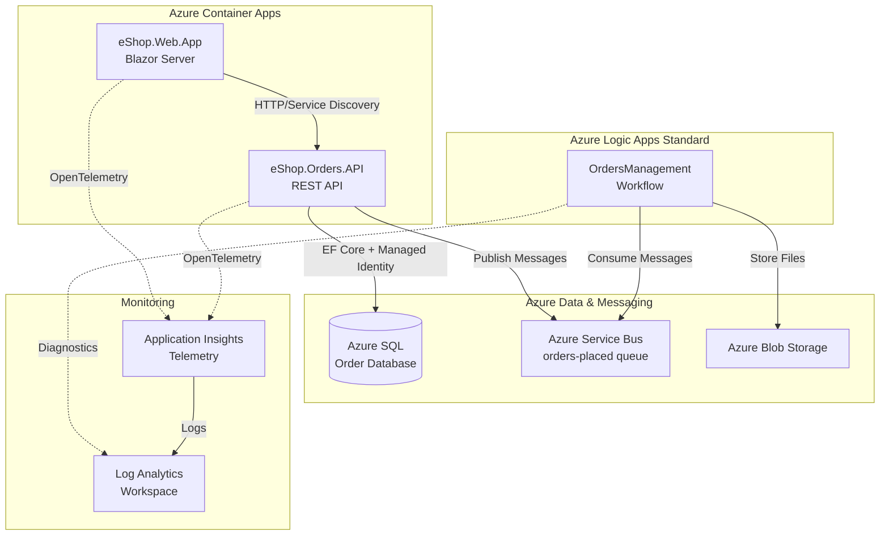

# Azure Logic Apps Monitoring Solution

> Enterprise-grade monitoring and order management system built with .NET Aspire and Azure Logic Apps Standard


---

## Description

The **Azure Logic Apps Monitoring Solution** is a cloud-native, distributed application that demonstrates enterprise-grade integration patterns for monitoring and managing Azure Logic Apps workflows. Built on .NET Aspire orchestration, it combines a RESTful Orders API, Blazor Server frontend, and Azure Logic Apps Standard workflows to create an end-to-end order processing system with comprehensive observability.

This solution addresses the challenge of building scalable, observable microservices with secure Azure integration. It eliminates the complexity of manual infrastructure configuration by using Infrastructure as Code (Bicep), automated deployment pipelines (GitHub Actions), and managed identities for zero-secret authentication across Azure services.

**Key differentiators:**

- **Zero-secrets architecture** using Azure Managed Identity for all service-to-service authentication
- **Full-stack observability** with OpenTelemetry, Application Insights, and distributed tracing
- **Production-ready patterns** including health checks, resilience policies, and automated database migrations
- **Developer-friendly** with local development support via Azure service emulators and .NET Aspire dashboard

**Target audience:** Cloud architects, DevOps engineers, and .NET developers building distributed systems on Azure with Logic Apps integration.

---

## Table of Contents

- [Features](#features)
- [Prerequisites](#prerequisites)
- [Installation](#installation)
- [Usage](#usage)
- [Project Structure](#project-structure)
- [Configuration](#configuration)
- [Development](#development)
- [Testing](#testing)
- [Deployment](#deployment)
- [Architecture](#architecture)
- [Troubleshooting](#troubleshooting)
- [Contributing](#contributing)
- [License](#license)

---

## Features

- **Distributed Microservices Architecture** – .NET Aspire orchestration with service discovery and automatic configuration
- **RESTful Orders API** – ASP.NET Core Web API with OpenAPI/Swagger documentation and Entity Framework Core persistence
- **Blazor Server Frontend** – Interactive web application with FluentUI components and real-time SignalR communication
- **Azure Logic Apps Workflows** – Stateful workflows for order processing with Service Bus and Blob Storage integration
- **Managed Identity Authentication** – Zero-secrets approach using Azure Managed Identity for SQL, Service Bus, and Storage
- **OpenTelemetry Observability** – Distributed tracing, metrics, and logging with Application Insights and OTLP exporters
- **Infrastructure as Code** – Complete Bicep templates for reproducible Azure deployments with modular architecture
- **GitHub Actions CI/CD** – Automated build, test, security scanning (CodeQL), and deployment pipelines with OIDC authentication
- **Database Migrations** – Entity Framework Core migrations with SQL Azure support and retry policies
- **Health Monitoring** – Kubernetes-compatible health and liveness endpoints for Container Apps

### Architecture Diagram



---

## Prerequisites

| Requirement                   | Version        | Purpose                                    |
| ----------------------------- | -------------- | ------------------------------------------ |
| **.NET SDK**                  | 10.0.100+      | Application runtime and build tools        |
| **Azure CLI**                 | 2.60.0+        | Azure resource management                  |
| **Azure Developer CLI (azd)** | 1.11.0+        | Infrastructure provisioning and deployment |
| **Docker Desktop**            | 20.10+         | Local development with service emulators   |
| **PowerShell**                | 7.0+ (Windows) | Deployment hooks execution                 |
| **Azure Subscription**        | Active         | Deployment target with Contributor role    |

### Azure Resource Requirements

- **Azure SQL Database** – Basic tier or higher
- **Azure Service Bus** – Standard tier (required for topics/subscriptions)
- **Azure Storage Account** – Standard LRS or higher
- **Azure Logic Apps Standard** – Workflow Standard plan
- **Azure Application Insights** – For telemetry collection

---

## Installation

### 1. Clone the Repository

```bash
git clone https://github.com/Evilazaro/Azure-LogicApps-Monitoring.git
cd Azure-LogicApps-Monitoring
```

### 2. Authenticate with Azure

```bash
# Login to Azure
az login

# Set default subscription
az account set --subscription "YOUR_SUBSCRIPTION_ID"

# Authenticate Azure Developer CLI
azd auth login
```

### 3. Initialize Azure Developer Environment

```bash
# Create new environment (e.g., 'dev')
azd env new dev

# Set required variables (prompted interactively)
# - Azure location (e.g., eastus2)
# - Resource group name
```

### 4. Provision Infrastructure and Deploy

```bash
# Provision Azure resources + deploy application (one command)
azd up
```

This command executes:

- **Preprovision hook:** Builds solution and runs tests
- **Infrastructure provisioning:** Creates all Azure resources via Bicep
- **Postprovision hook:** Configures secrets and generates test data
- **Predeploy hook:** Deploys Logic Apps workflows
- **Application deployment:** Deploys containers to Azure Container Apps

### 5. Verify Installation

```bash
# Get service endpoints
azd env get-values

# Test Orders API health
curl https://orders-api.YOUR_ENV.REGION.azurecontainerapps.io/health
```

---

## Usage

### Quick Start

Once deployed, access the web application:

```bash
# Get web app URL
azd env get-values | grep AZURE_CONTAINER_APPS_WEB_URL

# Open in browser
start https://web-app.YOUR_ENV.REGION.azurecontainerapps.io
```

The web application provides:

- Order browsing and search
- Real-time order status updates
- Integration with Orders API via service discovery

### Common Scenarios

#### Placing an Order via API

```bash
curl -X POST https://orders-api.YOUR_ENV.REGION.azurecontainerapps.io/api/orders \
  -H "Content-Type: application/json" \
  -d '{
    "id": "00000000-0000-0000-0000-000000000001",
    "customer": "John Doe",
    "total": 150.00,
    "status": "Pending",
    "products": [
      {
        "id": "00000000-0000-0000-0000-000000000010",
        "name": "Product A",
        "quantity": 2,
        "price": 75.00
      }
    ]
  }'
```

#### Retrieving All Orders

```bash
curl https://orders-api.YOUR_ENV.REGION.azurecontainerapps.io/api/orders \
  -H "Accept: application/json"
```

#### Checking Application Health

```bash
# Health check with dependency status
curl https://orders-api.YOUR_ENV.REGION.azurecontainerapps.io/health

# Liveness probe (minimal check)
curl https://orders-api.YOUR_ENV.REGION.azurecontainerapps.io/alive
```

### API Documentation

Access interactive Swagger UI at:

```
https://orders-api.YOUR_ENV.REGION.azurecontainerapps.io/swagger
```

Available endpoints:

- `POST /api/orders` – Create new order
- `GET /api/orders` – List all orders
- `GET /api/orders/{id}` – Get order by ID
- `DELETE /api/orders/{id}` – Delete order
- `DELETE /api/orders` – Delete all orders (with confirmation)
- `GET /health` – Health check with dependencies
- `GET /alive` – Liveness probe

---

## Project Structure

```
Azure-LogicApps-Monitoring/
├── app.sln                           # Solution file (8 projects)
├── azure.yaml                        # Azure Developer CLI configuration
├── global.json                       # .NET SDK version pinning (10.0.100)
├── LICENSE                           # MIT License
│
├── app.AppHost/                      # .NET Aspire orchestration host
│   ├── AppHost.cs                    # Service composition and Azure resource configuration
│   ├── app.AppHost.csproj            # Aspire.Hosting.AppHost SDK project
│   └── infra/                        # Container Apps deployment templates
│       ├── orders-api.tmpl.yaml      # Orders API container configuration
│       └── web-app.tmpl.yaml         # Web app container configuration
│
├── app.ServiceDefaults/              # Shared service configurations
│   ├── Extensions.cs                 # OpenTelemetry, health checks, resilience
│   └── CommonTypes.cs                # Shared DTOs (Order, Product, OrderStatus)
│
├── src/
│   ├── eShop.Orders.API/             # RESTful Orders API
│   │   ├── Program.cs                # Startup with EF Core, Service Bus, health checks
│   │   ├── Controllers/              # OrdersController, WeatherForecastController
│   │   ├── Data/                     # OrderDbContext, database seeding
│   │   ├── Handlers/                 # OrdersMessageHandler (Service Bus publisher)
│   │   ├── Services/                 # OrderService (business logic)
│   │   ├── Repositories/             # OrderRepository (data access)
│   │   ├── HealthChecks/             # Custom health checks (DB, Service Bus)
│   │   ├── Migrations/               # EF Core migrations (OrderDbV1)
│   │   └── MIGRATION_GUIDE.md        # EF Core adoption documentation
│   │
│   ├── eShop.Web.App/                # Blazor Server frontend
│   │   ├── Program.cs                # Startup with session, SignalR, circuit options
│   │   ├── Components/               # Razor components
│   │   │   ├── Pages/                # Home, Orders, Order Details pages
│   │   │   ├── Layout/               # MainLayout, NavMenu
│   │   │   └── Services/             # OrdersAPIService (typed HTTP client)
│   │   └── wwwroot/                  # Static assets (CSS, JS)
│   │
│   └── tests/                        # Test projects (xUnit)
│       ├── eShop.Orders.API.Tests/   # API unit and integration tests
│       ├── eShop.Web.App.Tests/      # Web app component tests
│       ├── app.AppHost.Tests/        # AppHost configuration tests
│       └── app.ServiceDefaults.Tests/ # Service defaults tests
│
├── infra/                            # Bicep infrastructure templates
│   ├── main.bicep                    # Entry point (subscription scope)
│   ├── main.parameters.json          # Environment-specific parameters
│   ├── types.bicep                   # Shared type definitions
│   ├── shared/                       # Cross-cutting resources
│   │   ├── identity/                 # Managed identity with role assignments
│   │   ├── monitoring/               # Log Analytics, Application Insights
│   │   ├── network/                  # VNet, subnets, NSGs
│   │   └── data/                     # SQL Server, databases
│   └── workload/                     # Application-specific resources
│       ├── main.bicep                # Container Apps, Logic Apps
│       ├── messaging/                # Service Bus namespace, queues, topics
│       ├── services/                 # Container Apps environment, apps
│       └── logic-app.bicep           # Logic Apps Standard configuration
│
├── workflows/                        # Azure Logic Apps Standard
│   └── OrdersManagement/
│       └── OrdersManagementLogicApp/
│           ├── OrdersPlacedProcess/  # Workflow triggered by Service Bus
│           ├── OrdersPlacedCompleteProcess/ # Order completion workflow
│           ├── connections.json      # Managed API connections (Service Bus, Blob)
│           ├── host.json             # Runtime configuration
│           └── parameters.json       # Workflow parameters
│
├── hooks/                            # Lifecycle automation scripts
│   ├── preprovision.*                # Pre-deployment validation
│   ├── postprovision.*               # Post-deployment configuration
│   ├── deploy-workflow.*             # Logic Apps deployment
│   ├── sql-managed-identity-config.* # SQL user creation for managed identity
│   └── Generate-Orders.*             # Test data generation
│
└── .github/
    └── workflows/
        ├── azure-dev.yml             # CD pipeline (azd provision + deploy)
        ├── ci-dotnet.yml             # CI pipeline trigger
        └── ci-dotnet-reusable.yml    # Reusable CI workflow (build, test, CodeQL)
```

---

## Configuration

### Environment Variables

The application uses .NET Aspire's automatic configuration via `AddServiceDefaults()`. No manual environment variables required for deployed apps (managed by AppHost).

### Local Development Configuration

For local development, create `appsettings.Development.json` files or use **User Secrets**:

```bash
# Navigate to Orders API project
cd src/eShop.Orders.API

# Set user secrets
dotnet user-secrets set "ConnectionStrings:OrderDb" "Server=(localdb)\\mssqllocaldb;Database=OrdersDb;Trusted_Connection=True;"
dotnet user-secrets set "ConnectionStrings:messaging" "Endpoint=sb://localhost;..."
```

### Azure Resource Configuration

Configured via azure.yaml and provisioned automatically:

| Resource                 | Configuration Key             | Purpose                           |
| ------------------------ | ----------------------------- | --------------------------------- |
| **SQL Server**           | `OrderDb` connection string   | Order data persistence            |
| **Service Bus**          | `messaging` connection string | Async order processing            |
| **Application Insights** | Auto-configured by Aspire     | Distributed tracing and telemetry |
| **Blob Storage**         | `AzureWebJobsStorage`         | Logic Apps runtime storage        |

### AppHost Configuration

Edit AppHost.cs to modify:

- Service references and dependencies
- Azure resource connections (SQL, Service Bus, Application Insights)
- Health check configurations
- Environment-specific settings

---

## Development

### Running Locally

#### Option 1: .NET Aspire Dashboard (Recommended)

```bash
# Start all services with Aspire orchestration
cd app.AppHost
dotnet run
```

Open **Aspire Dashboard**: `http://localhost:15888` (URL shown in console)

The dashboard provides:

- Real-time service status
- Distributed tracing visualization
- Logs aggregation
- Metrics explorer

#### Option 2: Individual Services

```bash
# Terminal 1: Orders API
cd src/eShop.Orders.API
dotnet run

# Terminal 2: Web App
cd src/eShop.Web.App
dotnet run
```

**Note:** This mode requires manual service discovery configuration.

### Local Prerequisites

To run locally without Azure, start emulators:

```bash
# Service Bus emulator (Docker)
docker run -d --name servicebus-emulator -p 5672:5672 mcr.microsoft.com/azure-messaging/servicebus-emulator:latest

# SQL Server (LocalDB - included with Visual Studio)
# Or Docker:
docker run -d --name sql-server -e 'ACCEPT_EULA=Y' -e 'SA_PASSWORD=YourStrong@Passw0rd' -p 1433:1433 mcr.microsoft.com/mssql/server:2022-latest
```

### Database Migrations

#### Create New Migration

```bash
cd src/eShop.Orders.API
dotnet ef migrations add MigrationName --context OrderDbContext
```

#### Apply Migrations

```bash
# Local database
dotnet ef database update --context OrderDbContext

# Azure SQL (automatically applied on first deployment via postprovision hook)
```

### Hot Reload

Hot reload is enabled by default for local development:

```bash
dotnet watch --project src/eShop.Orders.API
```

---

## Testing

### Run All Tests

```bash
# Run tests with coverage
dotnet test --configuration Debug \
  --results-directory ./src/tests/TestResults \
  --coverage \
  --coverage-output-format cobertura \
  --coverage-output coverage.cobertura.xml
```

### Run Specific Test Project

```bash
# Orders API tests
dotnet test src/tests/eShop.Orders.API.Tests

# Web App tests
dotnet test src/tests/eShop.Web.App.Tests
```

### Test Coverage Report

```bash
# Install ReportGenerator
dotnet tool install -g dotnet-reportgenerator-globaltool

# Generate HTML report
reportgenerator -reports:coverage.cobertura.xml -targetdir:coveragereport -reporttypes:Html

# Open report
start coveragereport/index.html
```

### Integration Tests

The solution includes integration tests that:

- Spin up in-memory databases via WebApplicationFactory
- Mock Azure Service Bus connections
- Verify controller endpoints, service logic, and health checks

---

## Deployment

### Automated Deployment (CI/CD)

The repository includes GitHub Actions workflows:

1. **CI Pipeline** (ci-dotnet-reusable.yml)
   - Triggers on PR and push
   - Builds solution, runs tests, generates coverage
   - Performs CodeQL security analysis

2. **CD Pipeline** (azure-dev.yml)
   - Triggers on push to `main` branch
   - Provisions infrastructure with Bicep
   - Deploys containers to Azure Container Apps
   - Configures SQL Managed Identity
   - Deploys Logic Apps workflows

**Required GitHub Secrets:**

- `AZURE_CLIENT_ID` – Service Principal ID
- `AZURE_TENANT_ID` – Azure AD Tenant ID
- `AZURE_SUBSCRIPTION_ID` – Target subscription

### Manual Deployment

#### Deploy Everything

```bash
azd up
```

#### Deploy Infrastructure Only

```bash
azd provision
```

#### Deploy Application Only

```bash
azd deploy
```

#### Deploy Logic Apps Workflows

```bash
# Windows
.\hooks\deploy-workflow.ps1 -Force -Verbose

# macOS/Linux
./hooks/deploy-workflow.sh --force --verbose
```

### Environment Management

```bash
# List environments
azd env list

# Switch environment
azd env select prod

# View environment variables
azd env get-values
```

---

## Architecture

### Technology Stack

- **Orchestration:** .NET Aspire 13.1
- **API Framework:** ASP.NET Core 10.0 (Minimal APIs + Controllers)
- **Frontend:** Blazor Server with FluentUI Components 4.13
- **Data Access:** Entity Framework Core 10.0 (SQL Server provider)
- **Messaging:** Azure Service Bus with Managed Identity
- **Workflows:** Azure Logic Apps Standard
- **Observability:** OpenTelemetry (OTLP + Azure Monitor)
- **Infrastructure:** Bicep (Azure Resource Manager)
- **CI/CD:** GitHub Actions with OIDC authentication

### Design Patterns

- **Service Discovery:** Aspire automatic service resolution
- **Resilience:** Polly retry, circuit breaker, timeout policies
- **Health Checks:** ASP.NET Core health endpoints with custom checks
- **Managed Identity:** Zero-secrets authentication for Azure services
- **Repository Pattern:** Clean separation between data access and business logic
- **Dependency Injection:** Built-in ASP.NET Core DI container

### Azure Services Used

| Service                       | Purpose                     | Tier              |
| ----------------------------- | --------------------------- | ----------------- |
| **Azure Container Apps**      | Microservices hosting       | Consumption       |
| **Azure SQL Database**        | Relational data storage     | Basic/Standard    |
| **Azure Service Bus**         | Async messaging             | Standard          |
| **Azure Storage Account**     | Blob storage (Logic Apps)   | Standard LRS      |
| **Azure Logic Apps Standard** | Workflow orchestration      | Workflow Standard |
| **Application Insights**      | APM and distributed tracing | Pay-as-you-go     |
| **Log Analytics**             | Centralized logging         | Pay-as-you-go     |
| **Azure Container Registry**  | Private container images    | Basic             |
| **Managed Identity**          | Service authentication      | N/A (free)        |

---

## Troubleshooting

### Local Development Issues

**Problem:** Service Bus connection fails locally

**Solution:** Ensure Service Bus emulator is running or update connection string:

```bash
docker ps | grep servicebus-emulator
# If not running:
docker start servicebus-emulator
```

**Problem:** SQL Server connection refused

**Solution:** Verify LocalDB or Docker SQL Server is running:

```bash
# LocalDB
sqllocaldb info mssqllocaldb
sqllocaldb start mssqllocaldb

# Docker
docker start sql-server
```

### Azure Deployment Issues

**Problem:** `azd provision` fails with "Managed Identity not found"

**Solution:** Ensure preprovision hook completed successfully. Check output:

```bash
azd provision --debug
```

**Problem:** Logic Apps workflows not triggering

**Solution:** Verify Service Bus connection authentication:

```bash
az logicapp show --name YOUR_LOGIC_APP --resource-group YOUR_RG
```

Check `parameters.json` has correct runtime URLs.

**Problem:** Container Apps crash on startup

**Solution:** Check Application Insights logs:

```bash
az monitor app-insights query \
  --app YOUR_APP_INSIGHTS \
  --analytics-query "traces | where severityLevel >= 3 | order by timestamp desc | take 50"
```

### Common Error Messages

| Error                                           | Cause                      | Solution                                  |
| ----------------------------------------------- | -------------------------- | ----------------------------------------- |
| `NU1301: Unable to load service index`          | NuGet feed authentication  | Run `azd auth login`                      |
| `Connection string 'OrderDb' is not configured` | Missing database reference | Verify `WithReference()` in AppHost.cs    |
| `HTTP 503 Service Unavailable`                  | Container Apps scaling     | Check Container Apps logs in Azure Portal |

---

## Contributing

Contributions are welcome! Please follow these guidelines:

1. **Fork the repository** and create a feature branch
2. **Follow coding standards:** Use `dotnet format` before committing
3. **Write tests:** Maintain or improve code coverage (target 80%+)
4. **Update documentation:** Reflect changes in README and inline comments
5. **Test deployments:** Verify `azd up` works end-to-end
6. **Submit Pull Request:** Include clear description and link related issues

For detailed contribution guidelines, see CONTRIBUTING.md (if available).

---

## License

This project is licensed under the **MIT License** – see LICENSE file for details.

**Copyright © 2025 Evilázaro Alves**

---

## Acknowledgments

- **Azure Developer CLI Team** – For the excellent `azd` tooling
- **.NET Aspire Team** – For revolutionizing distributed app development
- **Microsoft Identity Team** – For Managed Identity and zero-secrets architecture
- **OpenTelemetry Contributors** – For standardized observability

---

## Additional Resources

- **Azure Developer CLI Documentation:** https://learn.microsoft.com/azure/developer/azure-developer-cli/
- **.NET Aspire Documentation:** https://learn.microsoft.com/dotnet/aspire/
- **Azure Logic Apps Standard:** https://learn.microsoft.com/azure/logic-apps/logic-apps-overview
- **Azure Container Apps:** https://learn.microsoft.com/azure/container-apps/
- **OpenTelemetry .NET:** https://opentelemetry.io/docs/instrumentation/net/

---

**Repository:** https://github.com/Evilazaro/Azure-LogicApps-Monitoring
**Issues:** https://github.com/Evilazaro/Azure-LogicApps-Monitoring/issues
**Author:** Evilazaro ([@Evilazaro](https://github.com/Evilazaro))

```

```
