# Azure Logic Apps Monitoring


An end-to-end order management and monitoring solution built with .NET Aspire, Azure Logic Apps Standard, and Azure Container Apps — demonstrating enterprise-grade observability, event-driven workflows, and Infrastructure-as-Code deployment.

**Overview**

This solution addresses the challenge of monitoring and managing distributed order processing pipelines across Azure services. It combines a Blazor Server frontend, an ASP.NET Core REST API, Azure Logic Apps workflows, and Azure Service Bus messaging into a single .NET Aspire-orchestrated application with full OpenTelemetry observability.

The application processes customer orders through a multi-stage pipeline: the web frontend submits orders to the API, which persists them in Azure SQL and publishes events to Service Bus. Azure Logic Apps workflows subscribe to these events, process orders, and store results in Azure Blob Storage — providing a complete audit trail with success/error routing.

Unlike standalone monitoring dashboards, this solution embeds monitoring into the application architecture itself through Application Insights, Log Analytics, and distributed tracing — enabling teams to observe the full lifecycle of every order across all services.

## Table of Contents

- [Architecture](#-architecture)
- [Features](#-features)
- [Requirements](#-requirements)
- [Quick Start](#-quick-start)
- [Project Structure](#-project-structure)
- [Configuration](#-configuration)
- [Deployment](#-deployment)
- [Usage](#-usage)
- [Contributing](#-contributing)
- [License](#-license)

## 🏗️ Architecture

**Overview**

The solution uses a layered, event-driven architecture orchestrated by .NET Aspire. The AppHost configures service discovery, health checks, and Azure resource connections for all components. In local development, containers and emulators replace cloud services transparently.

Azure Logic Apps Standard provides the workflow engine that bridges Service Bus messaging with order processing and blob storage archival. All services communicate through managed identity authentication — no secrets are stored in code.

```mermaid
---
title: Azure Logic Apps Monitoring - Solution Architecture
config:
  theme: base
  themeVariables:
    fontSize: '16px'
  flowchart:
    htmlLabels: false
    curve: cardinal
---
flowchart TB
    accTitle: Azure Logic Apps Monitoring Solution Architecture
    accDescr: Event-driven architecture showing Blazor frontend, Orders API, Service Bus messaging, Logic Apps workflows, and Azure data services with full observability

    %% ═══════════════════════════════════════════════════════════════════════════
    %% AZURE / FLUENT ARCHITECTURE PATTERN v1.1
    %% (Semantic + Structural + Font + Accessibility Governance)
    %% ═══════════════════════════════════════════════════════════════════════════
    %% PHASE 1 - STRUCTURAL: TB direction explicit, 2-level nesting, 7 subgraphs, 9 nodes
    %% PHASE 2 - SEMANTIC: 5 semantic colors + 1 neutral (within 5+1 limit)
    %%   azureBlue: Frontend (web) | azureGreen: API (processing)
    %%   azureYellow: Messaging | azurePurple: Workflows/automation
    %%   azureTeal: Data storage | neutralGrey: Observability/monitoring
    %% PHASE 3 - FONT: Dark text #323130 on all light backgrounds (WCAG AA 4.5:1)
    %% PHASE 4 - ACCESSIBILITY: accTitle/accDescr present, icons on all 9 content nodes
    %% PHASE 5 - STANDARD: v1.1 format, 14 classDefs (complete palette), 7 style directives
    %% ═══════════════════════════════════════════════════════════════════════════

    %% Required classDef palette (ALL 14 - MANDATORY)
    classDef level1Group fill:#FFFFFF,stroke:#3F51B5,stroke-width:3px,color:#323130
    classDef level2Group fill:#C5CAE9,stroke:#3F51B5,stroke-width:2px,color:#323130
    classDef level3Group fill:#9FA8DA,stroke:#3F51B5,stroke-width:2px,color:#323130
    classDef level4Group fill:#7986CB,stroke:#3F51B5,stroke-width:1px,color:#323130
    classDef mainGroup fill:#FFFFFF,stroke:#3F51B5,stroke-width:3px,color:#323130
    classDef subGroup fill:#C5CAE9,stroke:#3F51B5,stroke-width:2px,color:#323130
    classDef azureBlue fill:#DEECF9,stroke:#004578,stroke-width:2px,color:#323130
    classDef azureGreen fill:#DFF6DD,stroke:#0B6A0B,stroke-width:2px,color:#323130
    classDef azureRed fill:#FFCDD2,stroke:#D32F2F,stroke-width:2px,color:#323130
    classDef azureYellow fill:#FFF9C4,stroke:#F57F17,stroke-width:2px,color:#323130
    classDef azureOrange fill:#FDE7E9,stroke:#A4262C,stroke-width:2px,color:#323130
    classDef azurePurple fill:#E7E2FA,stroke:#5B2F91,stroke-width:2px,color:#323130
    classDef azureTeal fill:#C8F0E7,stroke:#00666B,stroke-width:2px,color:#323130
    classDef neutralGrey fill:#F3F2F1,stroke:#605E5C,stroke-width:2px,color:#323130

    subgraph system["🏢 Azure Logic Apps Monitoring Solution"]
        direction TB

        subgraph frontend["🌐 Frontend Layer"]
            webapp["⚛️ Blazor Server<br/>(Fluent UI)"]:::azureBlue
        end

        subgraph api["⚙️ API Layer"]
            ordersapi["🔌 Orders API<br/>(ASP.NET Core)"]:::azureGreen
        end

        subgraph messaging["📨 Messaging Layer"]
            servicebus["📡 Azure Service Bus<br/>(Topics & Subscriptions)"]:::azureYellow
        end

        subgraph workflows["🔄 Workflow Layer"]
            logicapp["⚡ Logic Apps Standard<br/>(OrdersPlacedProcess)"]:::azurePurple
            logicapp2["⚡ Logic Apps Standard<br/>(OrdersPlacedCompleteProcess)"]:::azurePurple
        end

        subgraph data["🗄️ Data Layer"]
            sqldb[("💾 Azure SQL<br/>Database")]:::azureTeal
            blob[("📦 Azure Blob<br/>Storage")]:::azureTeal
        end

        subgraph observability["📊 Observability Layer"]
            appinsights["📈 Application Insights"]:::neutralGrey
            loganalytics["📋 Log Analytics"]:::neutralGrey
        end

        webapp -->|"REST API calls"| ordersapi
        ordersapi -->|"persists orders"| sqldb
        ordersapi -->|"publishes events"| servicebus
        servicebus -->|"triggers workflow"| logicapp
        logicapp -->|"processes via API"| ordersapi
        logicapp -->|"archives results"| blob
        logicapp2 -->|"cleans up blobs"| blob
        ordersapi -.->|"telemetry"| appinsights
        webapp -.->|"telemetry"| appinsights
        logicapp -.->|"diagnostics"| loganalytics
    end

    %% Subgraph styling (7 subgraphs = 7 style directives)
    style system fill:#FFFFFF,stroke:#3F51B5,stroke-width:3px
    style frontend fill:#DEECF9,stroke:#004578,stroke-width:2px
    style api fill:#DFF6DD,stroke:#0B6A0B,stroke-width:2px
    style messaging fill:#FFF9C4,stroke:#F57F17,stroke-width:2px
    style workflows fill:#E7E2FA,stroke:#5B2F91,stroke-width:2px
    style data fill:#C8F0E7,stroke:#00666B,stroke-width:2px
    style observability fill:#F3F2F1,stroke:#605E5C,stroke-width:2px
```



## ✨ Features

**Overview**

The solution delivers six core capabilities spanning order management, event-driven processing, enterprise observability, and automated infrastructure deployment. Every feature is backed by production-ready patterns including resilience policies, managed identity authentication, and comprehensive health checks.

| Feature                       | Description                                                                         | Benefits                                                                    |
| ----------------------------- | ----------------------------------------------------------------------------------- | --------------------------------------------------------------------------- |
| **Order Management**          | Full CRUD REST API with Swagger/OpenAPI docs, EF Core + Azure SQL persistence       | End-to-end order lifecycle with validation, distributed tracing per request |
| **Event-Driven Workflows**    | Azure Logic Apps triggered by Service Bus with success/error blob routing           | Automated order processing with audit trail and dead-letter handling        |
| **Blazor Server Frontend**    | Fluent UI design system with real-time order placement, batch creation, and listing | Modern UI with service discovery, session management, and health monitoring |
| **Full Observability**        | OpenTelemetry tracing + metrics, Application Insights, Log Analytics workspace      | Distributed tracing across all services, custom order processing metrics    |
| **.NET Aspire Orchestration** | AppHost with service discovery, health checks, and dual-mode resource config        | One `dotnet run` for local dev with emulators; same code deploys to Azure   |
| **Infrastructure-as-Code**    | Modular Bicep templates with VNet, managed identity, and diagnostic settings        | Repeatable deployments: `azd up` provisions and deploys everything          |

## 📋 Requirements

**Overview**

Local development uses .NET Aspire to run all services with containers and emulators, requiring only Docker and the .NET SDK. Azure deployment additionally requires Azure CLI and Azure Developer CLI for infrastructure provisioning.

| Category            | Requirements                                        | More Info                                                                                         |
| ------------------- | --------------------------------------------------- | ------------------------------------------------------------------------------------------------- |
| Runtime             | .NET SDK 10.0+                                      | [Download .NET](https://dotnet.microsoft.com/download)                                            |
| Container Runtime   | Docker Desktop (for local development)              | [Download Docker](https://www.docker.com/products/docker-desktop)                                 |
| Orchestration       | .NET Aspire 13.1+ (included via NuGet)              | [Aspire Docs](https://learn.microsoft.com/dotnet/aspire/)                                         |
| Azure CLI           | Azure CLI >= 2.60.0                                 | [Install Azure CLI](https://learn.microsoft.com/cli/azure/install-azure-cli)                      |
| Azure Developer CLI | azd >= 1.11.0                                       | [Install azd](https://learn.microsoft.com/azure/developer/azure-developer-cli/install-azd)        |
| IDE                 | Visual Studio 2022 18.x+ or VS Code with C# Dev Kit | [VS Code C# Dev Kit](https://marketplace.visualstudio.com/items?itemName=ms-dotnettools.csdevkit) |

## 🚀 Quick Start

### Local Development

1. **Clone the repository**

   ```bash
   git clone https://github.com/Evilazaro/Azure-LogicApps-Monitoring.git
   cd Azure-LogicApps-Monitoring
   ```

2. **Ensure Docker Desktop is running** (required for SQL Server and Service Bus emulators)

3. **Run the Aspire AppHost**

   ```bash
   dotnet run --project app.AppHost/app.AppHost.csproj
   ```

   This starts all services including:
   - **Orders API** at `https://localhost:<port>/swagger`
   - **Web App** at `https://localhost:<port>`
   - **SQL Server** container with persistent volume
   - **Service Bus** emulator
   - **Aspire Dashboard** at `https://localhost:18888` for observability

4. **Open the Aspire Dashboard** to see service health, distributed traces, and logs

### Deploy to Azure

1. **Authenticate**

   ```bash
   azd auth login
   ```

2. **Create an environment and deploy**

   ```bash
   azd env new my-env
   azd up
   ```

   This provisions all Azure infrastructure (Resource Group, Container Apps, SQL, Service Bus, Logic Apps, VNet, Monitoring) and deploys the application.

## 📁 Project Structure

```
├── app.AppHost/              # .NET Aspire orchestration host
│   └── AppHost.cs            # Service registration, Azure resource config
├── app.ServiceDefaults/      # Cross-cutting concerns (shared library)
│   ├── Extensions.cs         # OpenTelemetry, health checks, resilience, Service Bus
│   └── CommonTypes.cs        # Shared domain models (Order, OrderProduct)
├── src/
│   ├── eShop.Orders.API/     # ASP.NET Core REST API
│   │   ├── Controllers/      # OrdersController, WeatherForecastController
│   │   ├── Services/         # OrderService (business logic + metrics)
│   │   ├── Repositories/     # OrderRepository (EF Core data access)
│   │   ├── Handlers/         # Service Bus message handlers
│   │   ├── HealthChecks/     # ServiceBus + DbContext health checks
│   │   └── Migrations/       # EF Core SQL migrations
│   ├── eShop.Web.App/        # Blazor Server frontend
│   │   ├── Components/Pages/ # Home, PlaceOrder, ListAllOrders, ViewOrder
│   │   └── Shared/           # FluentDesignSystem configuration
│   └── tests/                # Unit and integration tests
│       ├── eShop.Orders.API.Tests/
│       ├── eShop.Web.App.Tests/
│       ├── app.ServiceDefaults.Tests/
│       └── app.AppHost.Tests/
├── workflows/
│   └── OrdersManagement/     # Azure Logic Apps workflow definitions
│       └── OrdersManagementLogicApp/
│           ├── OrdersPlacedProcess/         # Service Bus → API → Blob
│           └── OrdersPlacedCompleteProcess/ # Blob cleanup workflow
├── infra/                    # Bicep Infrastructure-as-Code
│   ├── main.bicep            # Entry point (subscription-level)
│   ├── shared/               # Identity, monitoring, networking, data
│   └── workload/             # Messaging, Container Apps, Logic Apps
├── hooks/                    # azd lifecycle scripts (preprovision, deploy-workflow, etc.)
├── .github/workflows/        # CI/CD pipelines
│   ├── ci-dotnet.yml         # CI: build, test, CodeQL analysis
│   └── azure-dev.yml         # CD: provision + deploy via azd
└── azure.yaml                # Azure Developer CLI configuration
```

## ⚙️ Configuration

**Overview**

The application uses a dual-mode configuration pattern: local development uses Docker containers and emulators while Azure deployment connects to managed cloud services — all controlled through the same AppHost code with configuration switches.

### Local Development

Local settings are managed via .NET user secrets. The AppHost automatically detects local mode and provisions containers:

```bash
# Initialize user secrets (if needed)
dotnet user-secrets init --project app.AppHost

# Configure Azure credentials for local hybrid scenarios
dotnet user-secrets set "Azure:TenantId" "<your-tenant-id>" --project app.AppHost
dotnet user-secrets set "Azure:ClientId" "<your-client-id>" --project app.AppHost
```

### Azure Deployment

Azure configuration is managed through `azd env` variables and Bicep parameters:

| Setting                          | Description                | Default                      |
| -------------------------------- | -------------------------- | ---------------------------- |
| `Azure:ResourceGroup`            | Target resource group name | Auto-generated by Bicep      |
| `Azure:ServiceBus:HostName`      | Service Bus namespace FQDN | `localhost` (emulator)       |
| `Azure:SqlServer:Name`           | Azure SQL server name      | `OrdersDatabase` (container) |
| `Azure:ApplicationInsights:Name` | App Insights resource name | Not set (disabled locally)   |

### Environment Variables

| Variable                                | Service    | Purpose                              |
| --------------------------------------- | ---------- | ------------------------------------ |
| `APPLICATIONINSIGHTS_CONNECTION_STRING` | All        | Application Insights telemetry       |
| `AZURE_TENANT_ID`                       | Orders API | Azure AD authentication (local dev)  |
| `MESSAGING_HOST`                        | Orders API | Service Bus namespace or `localhost` |
| `ConnectionStrings:OrderDb`             | Orders API | SQL Server connection string         |

## 🚢 Deployment

**Overview**

Deployment uses Azure Developer CLI (`azd`) with Bicep templates to provision a complete Azure environment. The CI/CD pipeline runs builds and tests on push, then provisions infrastructure and deploys on merge to `main`.

### Azure Resources Provisioned

| Resource                           | Purpose                                                   |
| ---------------------------------- | --------------------------------------------------------- |
| **Azure Container Apps**           | Hosts Orders API and Web App with auto-scaling            |
| **Azure Container Registry**       | Stores container images                                   |
| **Azure SQL Database**             | Order data persistence with managed identity auth         |
| **Azure Service Bus**              | Topic/subscription messaging between API and Logic Apps   |
| **Azure Logic Apps Standard**      | Workflow engine for order processing pipelines            |
| **Azure Blob Storage**             | Order processing results archival (success/error routing) |
| **Application Insights**           | Distributed tracing and metrics                           |
| **Log Analytics Workspace**        | Centralized logging and diagnostics                       |
| **Virtual Network**                | Network isolation with subnets for API and Logic Apps     |
| **User Assigned Managed Identity** | Passwordless authentication across all services           |

### CI/CD Pipeline

The repository includes two GitHub Actions workflows:

- **CI** (`ci-dotnet.yml`) — Builds on Ubuntu/Windows/macOS, runs tests with Cobertura coverage, checks code formatting, and performs CodeQL security analysis
- **CD** (`azure-dev.yml`) — Provisions infrastructure via `azd provision`, configures SQL managed identity, and deploys via `azd deploy` with OIDC authentication

### Manual Deployment

```bash
# Provision infrastructure only
azd provision

# Deploy application only
azd deploy

# Deploy Logic Apps workflows
./hooks/deploy-workflow.ps1 -Force -Verbose

# Generate sample orders for testing
./hooks/Generate-Orders.ps1 -Force -Verbose

# Tear down all resources
azd down
```

## 📖 Usage

### API Endpoints

The Orders API exposes the following endpoints (available at `/swagger` when running):

| Method   | Endpoint              | Description                           |
| -------- | --------------------- | ------------------------------------- |
| `POST`   | `/api/Orders`         | Place a new order                     |
| `POST`   | `/api/Orders/process` | Process an order (used by Logic Apps) |
| `GET`    | `/api/Orders`         | List all orders                       |
| `GET`    | `/api/Orders/{id}`    | Get order by ID                       |
| `DELETE` | `/api/Orders/{id}`    | Delete an order                       |
| `DELETE` | `/api/Orders`         | Delete all orders                     |

### Web Application Pages

| Page               | Route               | Description                    |
| ------------------ | ------------------- | ------------------------------ |
| Home               | `/`                 | Dashboard overview             |
| Place Order        | `/placeorder`       | Submit a single order          |
| Place Orders Batch | `/placeordersbatch` | Submit multiple orders at once |
| List All Orders    | `/listallorders`    | View all orders in the system  |
| View Order         | `/vieworder/{id}`   | Order detail view              |

### Logic Apps Workflows

| Workflow                        | Trigger                      | Action                                                                           |
| ------------------------------- | ---------------------------- | -------------------------------------------------------------------------------- |
| **OrdersPlacedProcess**         | Service Bus topic message    | Validates, calls Orders API `/process`, archives to blob (success/error routing) |
| **OrdersPlacedCompleteProcess** | Recurrence (every 3 seconds) | Lists processed blobs, retrieves metadata, deletes completed blobs               |

## 🤝 Contributing

**Overview**

Contributions are welcome. The project uses standard .NET development practices with automated quality gates enforced through CI.

1. Fork the repository
2. Create a feature branch (`git checkout -b feature/my-feature`)
3. Make changes and ensure all tests pass:
   ```bash
   dotnet build --configuration Debug
   dotnet test --configuration Debug --no-build
   ```
4. Commit with a descriptive message (`git commit -m 'Add feature: description'`)
5. Push to your fork and open a Pull Request

The CI pipeline automatically runs builds, tests (with coverage), code formatting analysis, and CodeQL security scanning on all PRs.

## 📜 License

This project is licensed under the [MIT License](LICENSE).

Copyright (c) 2025 Evilazaro Alves
