# Azure Logic Apps Monitoring Solution


A production-ready monitoring solution for Azure Logic Apps Standard that demonstrates enterprise patterns for order processing, event-driven architecture, and comprehensive observability using .NET Aspire orchestration.

**Overview**

This solution provides a complete reference implementation for building and monitoring cloud-native applications on Azure. It combines the power of .NET Aspire for local development and orchestration with Azure Container Apps for production deployment, enabling teams to develop, test, and deploy distributed applications with confidence.

The architecture implements an eShop order management system where orders placed through a Blazor web frontend flow through a REST API, persist to Azure SQL Database, and trigger Azure Logic Apps workflows via Azure Service Bus for asynchronous processing. Application Insights and Log Analytics provide end-to-end observability across all components.

This project serves as a learning resource and production template for organizations adopting Azure's cloud-native services with .NET. It demonstrates Infrastructure-as-Code with Bicep, GitHub Actions CI/CD with OIDC authentication, and managed identity patterns for secure service-to-service communication.

## 📑 Table of Contents

- [Architecture](#️-architecture)
- [Features](#-features)
- [Requirements](#-requirements)
- [Quick Start](#-quick-start)
- [Deployment](#-deployment)
- [Usage](#-usage)
- [Configuration](#-configuration)
- [Contributing](#-contributing)
- [License](#-license)

## 🏗️ Architecture

**Overview**

The solution follows a modern cloud-native architecture built on Azure services with .NET Aspire as the orchestration layer. This design prioritizes developer productivity during local development while maintaining production-grade patterns for deployment.

The architecture separates concerns into distinct layers: a Blazor web frontend for user interaction, a .NET 10 REST API for business logic and data access, Azure Service Bus for event-driven messaging, and Azure Logic Apps Standard for workflow automation. Each component integrates with Application Insights for distributed tracing and Log Analytics for centralized logging.

```mermaid
---
title: Azure Logic Apps Monitoring Architecture
config:
  theme: base
  flowchart:
    htmlLabels: false
---
flowchart TB
    accTitle: Azure Logic Apps Monitoring Solution Architecture
    accDescr: Shows the complete solution architecture including web frontend, orders API, Azure services, and Logic Apps workflow for order monitoring

    %% ═══════════════════════════════════════════════════════════════════════════
    %% STANDARD COLOR SCHEME v2.1 - Material Design Compliant
    %% ═══════════════════════════════════════════════════════════════════════════
    %% HIERARCHICAL: Level 1: #E8EAF6 (Indigo 50) - Main container
    %% SEMANTIC: Blue=#BBDEFB (Web), Green=#C8E6C9 (API), Orange=#FFE0B2 (Messaging)
    %%           Teal=#B2DFDB (Data), Purple=#E1BEE7 (Monitoring)
    %% ═══════════════════════════════════════════════════════════════════════════

    classDef level1Group fill:#E8EAF6,stroke:#3F51B5,stroke-width:3px,color:#000
    classDef mdBlue fill:#BBDEFB,stroke:#1976D2,stroke-width:2px,color:#000
    classDef mdGreen fill:#C8E6C9,stroke:#388E3C,stroke-width:2px,color:#000
    classDef mdOrange fill:#FFE0B2,stroke:#E64A19,stroke-width:2px,color:#000
    classDef mdTeal fill:#B2DFDB,stroke:#00796B,stroke-width:2px,color:#000
    classDef mdPurple fill:#E1BEE7,stroke:#7B1FA2,stroke-width:2px,color:#000

    subgraph system["🏢 Azure Logic Apps Monitoring Solution"]
        direction TB

        subgraph frontend["🌐 Web Frontend"]
            webapp["⚛️ eShop Web App<br/>(Blazor)"]:::mdBlue
        end

        subgraph api["⚙️ Orders API"]
            ordersapi["🛒 Orders REST API<br/>(.NET 10)"]:::mdGreen
        end

        subgraph data["🗄️ Data Layer"]
            sqldb[("💾 Azure SQL<br/>Database")]:::mdTeal
        end

        subgraph messaging["📨 Event Messaging"]
            servicebus["📬 Azure Service Bus<br/>(Topics/Subscriptions)"]:::mdOrange
        end

        subgraph workflows["🔄 Logic Apps Workflows"]
            logicapp["⚡ Order Processing<br/>Logic App"]:::mdOrange
            blob["📦 Blob Storage<br/>(Order Archives)"]:::mdTeal
        end

        subgraph monitoring["📊 Observability"]
            appinsights["📈 Application Insights"]:::mdPurple
            loganalytics["📋 Log Analytics"]:::mdPurple
        end

        webapp -->|"REST calls"| ordersapi
        ordersapi -->|"persists orders"| sqldb
        ordersapi -->|"publishes events"| servicebus
        servicebus -->|"triggers workflow"| logicapp
        logicapp -->|"archives orders"| blob
        ordersapi -->|"sends telemetry"| appinsights
        logicapp -->|"sends logs"| loganalytics
        webapp -->|"sends telemetry"| appinsights
    end

    %% SUBGRAPH STYLING (7 subgraphs = 7 style directives)
    style system fill:#E8EAF6,stroke:#3F51B5,stroke-width:3px
    style frontend fill:#BBDEFB,stroke:#1976D2,stroke-width:2px
    style api fill:#C8E6C9,stroke:#388E3C,stroke-width:2px
    style data fill:#B2DFDB,stroke:#00796B,stroke-width:2px
    style messaging fill:#FFE0B2,stroke:#E64A19,stroke-width:2px
    style workflows fill:#FFE0B2,stroke:#E64A19,stroke-width:2px
    style monitoring fill:#E1BEE7,stroke:#7B1FA2,stroke-width:2px

    %% Accessibility: WCAG AA verified (4.5:1 contrast ratio)
```



### Project Structure

```plaintext
├── app.AppHost/              # .NET Aspire orchestration host
├── app.ServiceDefaults/      # Shared OpenTelemetry and resilience patterns
├── src/
│   ├── eShop.Orders.API/     # REST API for order management
│   ├── eShop.Web.App/        # Blazor web frontend
│   └── tests/                # Unit and integration tests
├── workflows/
│   └── OrdersManagement/     # Azure Logic Apps workflow definitions
├── infra/                    # Bicep IaC templates
├── hooks/                    # azd lifecycle scripts
└── azure.yaml                # Azure Developer CLI configuration
```

## ✨ Features

**Overview**

This solution provides enterprise-grade capabilities designed for production workloads. Each feature has been implemented following Azure Well-Architected Framework principles, ensuring reliability, security, and operational excellence.

The features are organized into three categories: development experience (local debugging, Aspire dashboard), deployment automation (IaC, CI/CD), and runtime capabilities (observability, messaging). Together, they enable rapid development cycles while maintaining production-grade standards.

| Feature                          | Description                                                                                  | Benefits                                                                                       |
| -------------------------------- | -------------------------------------------------------------------------------------------- | ---------------------------------------------------------------------------------------------- |
| 🎯 **.NET Aspire Orchestration** | Unified local development with service discovery, health checks, and automatic configuration | Eliminates environment parity issues; developers can run the entire distributed system locally |
| 📊 **Distributed Tracing**       | OpenTelemetry integration with Application Insights for end-to-end request correlation       | Faster troubleshooting with complete request visibility across services                        |
| 📬 **Event-Driven Messaging**    | Azure Service Bus topics and subscriptions with dead-letter handling                         | Decoupled architecture with guaranteed message delivery and retry capabilities                 |
| ⚡ **Logic Apps Workflows**      | Azure Logic Apps Standard for order processing automation with blob archiving                | Visual workflow design with enterprise connectors and monitoring                               |
| 🔒 **Managed Identity**          | Azure AD authentication between all services with zero secrets in code                       | Enhanced security posture with automatic credential rotation                                   |
| 🏗️ **Infrastructure as Code**    | Complete Bicep templates for all Azure resources with modular design                         | Reproducible deployments across environments with version control                              |
| 🚀 **GitHub Actions CI/CD**      | OIDC-authenticated pipeline with build, test, security scanning, and deployment              | Secure DevOps with no stored secrets and automated quality gates                               |

## 📋 Requirements

**Overview**

The solution requires specific tooling versions to ensure compatibility with .NET Aspire and Azure Developer CLI features. These requirements apply to both local development and CI/CD pipeline execution.

All Azure resources are provisioned automatically via the included Bicep templates, so no manual Azure setup is required beyond having an active subscription with appropriate permissions.

| Category       | Requirements                                         | More Information                                                                                                                                                         |
| -------------- | ---------------------------------------------------- | ------------------------------------------------------------------------------------------------------------------------------------------------------------------------ |
| **Runtime**    | .NET SDK 10.0                                        | [Download .NET](https://dotnet.microsoft.com/download)                                                                                                                   |
| **CLI Tools**  | Azure CLI ≥2.60.0, Azure Developer CLI ≥1.11.0       | [Install Azure CLI](https://learn.microsoft.com/cli/azure/install-azure-cli), [Install azd](https://learn.microsoft.com/azure/developer/azure-developer-cli/install-azd) |
| **Containers** | Docker Desktop or compatible runtime                 | [Install Docker](https://docs.docker.com/get-docker/)                                                                                                                    |
| **Azure**      | Active Azure subscription with Contributor access    | [Create Azure Account](https://azure.microsoft.com/free/)                                                                                                                |
| **IDE**        | Visual Studio 2022 17.10+ or VS Code with C# Dev Kit | [Download VS](https://visualstudio.microsoft.com/), [VS Code](https://code.visualstudio.com/)                                                                            |

> ⚠️ **Note**: .NET Aspire requires Docker to be running for local development with emulators (SQL Server, Service Bus).

## 🚀 Quick Start

**Overview**

Get the solution running locally in under 5 minutes using .NET Aspire. The AppHost automatically configures SQL Server and Service Bus emulators, eliminating the need for Azure resources during development.

This workflow uses `azd` to restore dependencies, build the solution, and launch the Aspire dashboard where you can monitor all services in real-time.

```bash
# Clone the repository
git clone https://github.com/Evilazaro/Azure-LogicApps-Monitoring.git
cd Azure-LogicApps-Monitoring

# Restore and build
dotnet restore
dotnet build

# Run with .NET Aspire (starts all services locally)
dotnet run --project app.AppHost/app.AppHost.csproj
```

```plaintext
# Expected output:
Building...
info: Aspire.Hosting.DistributedApplication[0]
      Aspire version: 9.1.0
info: Aspire.Hosting.DistributedApplication[0]
      Distributed application starting.
info: Aspire.Hosting.DistributedApplication[0]
      Dashboard running at: https://localhost:17225
```

> 💡 **Tip**: Open the Aspire Dashboard URL to view real-time logs, traces, and metrics for all running services.

## 📦 Deployment

**Overview**

Deploy the complete solution to Azure using the Azure Developer CLI (`azd`). The deployment process provisions all infrastructure via Bicep templates and deploys the application to Azure Container Apps with a single command.

The deployment uses OIDC authentication with federated credentials, meaning no secrets are stored in your repository. Infrastructure provisioning takes approximately 10-15 minutes for the initial deployment.

### Prerequisites

1. Authenticate with Azure:

```bash
az login
azd auth login
```

2. Create a new environment:

```bash
azd env new dev
```

### Deploy to Azure

```bash
# Provision infrastructure and deploy application
azd up
```

```plaintext
# Expected output:
Packaging services (azd package)
Provisioning Azure resources (azd provision)
Deploying services to Azure (azd deploy)

SUCCESS: Your application was provisioned and deployed to Azure.
```

The deployment creates the following Azure resources:

- **Resource Group**: Contains all solution resources
- **Container Apps Environment**: Hosts the web app and API
- **Azure SQL Database**: Order data persistence
- **Service Bus Namespace**: Event messaging
- **Logic Apps Standard**: Workflow automation
- **Application Insights**: Telemetry and monitoring
- **Log Analytics Workspace**: Centralized logging

### CI/CD Pipeline

The repository includes a GitHub Actions workflow (`.github/workflows/azure-dev.yml`) for automated deployments:

1. Configure federated credentials in Azure Entra ID
2. Add repository secrets: `AZURE_CLIENT_ID`, `AZURE_TENANT_ID`, `AZURE_SUBSCRIPTION_ID`
3. Push to `main` branch to trigger deployment

## 💻 Usage

**Overview**

The solution exposes a REST API for order management and a Blazor web interface for user interaction. Once deployed, you can interact with the Orders API endpoints directly or use the web application.

All API endpoints include OpenAPI/Swagger documentation accessible at `/swagger` in development mode.

### API Endpoints

```bash
# Place a new order
curl -X POST https://<your-api-url>/api/Orders \
  -H "Content-Type: application/json" \
  -d '{
    "customerId": "customer-123",
    "products": [
      { "name": "Widget", "quantity": 2, "price": 29.99 }
    ]
  }'
```

```json
// Expected response:
{
  "id": "ord-abc123",
  "customerId": "customer-123",
  "status": "Placed",
  "total": 59.98,
  "createdAt": "2026-02-07T10:30:00Z"
}
```

### Order Processing Flow

1. **Order Placed**: API receives order and persists to SQL Database
2. **Event Published**: Order event sent to Service Bus topic
3. **Workflow Triggered**: Logic App subscription processes the event
4. **Order Archived**: Completed order stored in Blob Storage
5. **Telemetry Captured**: All operations traced in Application Insights

## 🔧 Configuration

**Overview**

The solution uses hierarchical configuration with environment-specific overrides. Local development settings are managed via `appsettings.Development.json` and user secrets, while Azure deployments use environment variables injected by Container Apps.

Configuration follows the Options pattern with strong typing and validation. Sensitive values like connection strings are automatically provided by .NET Aspire during local development and by managed identity in Azure.

### Environment Variables

```bash
# Azure Resource Configuration (set by azd provision)
AZURE_RESOURCE_GROUP=rg-orders-dev-eastus
AZURE_SQL_SERVER_NAME=sql-orders-dev
AZURE_SQL_DATABASE_NAME=OrderDb

# Application Insights
APPLICATIONINSIGHTS_CONNECTION_STRING=InstrumentationKey=...

# Service Bus
MESSAGING_SERVICEBUSHOSTNAME=sb-orders-dev.servicebus.windows.net
```

### Local Development Configuration

Create user secrets for local Azure authentication:

```bash
dotnet user-secrets set "Azure:TenantId" "<your-tenant-id>" --project src/eShop.Orders.API
dotnet user-secrets set "Azure:ClientId" "<your-client-id>" --project src/eShop.Orders.API
```

### Configuration Files

| File                           | Purpose                                   |
| ------------------------------ | ----------------------------------------- |
| `azure.yaml`                   | Azure Developer CLI project configuration |
| `global.json`                  | .NET SDK version pinning                  |
| `appsettings.json`             | Base application settings                 |
| `appsettings.Development.json` | Local development overrides               |
| `infra/main.parameters.json`   | Bicep deployment parameters               |

> 💡 **Tip**: Run `./hooks/check-dev-workstation.ps1` to validate your local development environment configuration.

## 🤝 Contributing

**Overview**

Contributions are welcome and appreciated. This project follows standard GitHub flow with pull requests, code review, and automated CI validation. All contributions must pass the automated test suite and code quality checks before merging.

The codebase follows .NET coding conventions with EditorConfig enforcement. We use conventional commits for clear change history and automated changelog generation.

### Development Workflow

1. Fork the repository
2. Create a feature branch: `git checkout -b feature/my-feature`
3. Make your changes with tests
4. Run validation: `dotnet test`
5. Commit with conventional format: `feat: add new feature`
6. Push and create a Pull Request

### Code Quality

- All code must pass `dotnet build` without warnings
- Unit tests required for new functionality
- Integration tests for API endpoints
- Code coverage maintained above 80%

### Running Tests

```bash
# Run all tests with coverage
dotnet test --configuration Debug --collect:"XPlat Code Coverage"
```

## 📝 License

This project is licensed under the MIT License - see the [LICENSE](LICENSE) file for details.

Copyright (c) 2025 Evilázaro Alves
