# Azure Logic Apps Monitoring Solution


A **production-ready monitoring and orchestration platform** for Azure Logic Apps Standard, built with **.NET Aspire** and comprehensive **Azure observability capabilities**.

## Table of Contents

- [Overview](#overview)
- [Quick Start](#quick-start)
- [Architecture](#architecture)
- [Deployment](#deployment)
  - [Standard Deployment](#standard-deployment-recommended)
  - [Step-by-Step Deployment](#step-by-step-deployment)
  - [Environment Configuration](#environment-configuration)
  - [CI/CD Pipeline Deployment](#cicd-pipeline-deployment)
  - [Local Development](#local-development)
- [Usage](#usage)
  - [Orders API](#orders-api)
  - [Web Application](#web-application)
  - [Monitoring & Diagnostics](#monitoring--diagnostics)
  - [Logic Apps Workflow](#logic-apps-workflow)
- [Features](#features)
- [Requirements](#requirements)
  - [Local Development](#local-development)
  - [Azure Subscription](#azure-subscription)
  - [Optional Tools](#optional-enhanced-experience)
  - [Automated Prerequisite Check](#automated-prerequisite-check)
- [Configuration](#configuration)
  - [Azure Developer CLI](#azure-developer-cli-azd-configuration)
  - [Application Configuration](#application-configuration)
  - [Local Development Secrets](#local-development-secrets)
  - [Infrastructure Configuration](#infrastructure-configuration)
- [Contributing](#contributing)
- [License](#license)
- [Additional Resources](#additional-resources)
- [Support](#support)

## Overview

The Azure Logic Apps Monitoring Solution provides **enterprise-grade infrastructure** for deploying, monitoring, and managing distributed applications on Azure using **Logic Apps Standard**. This solution combines **.NET Aspire's orchestration capabilities** with Azure's native monitoring services (**Application Insights**, **Log Analytics**) to deliver **end-to-end visibility** into application health, performance, and business workflows.

> 💡 **Why This Matters**: Organizations deploying Logic Apps at scale need **robust monitoring** to ensure business continuity, troubleshoot issues quickly, and maintain **SLA compliance**. This solution **reduces mean time to resolution (MTTR)** by providing **centralized observability** across all application components, from API endpoints to database operations.

> 📌 **How It Works**: The platform uses **.NET Aspire's AppHost** to orchestrate microservices (Orders API and Web App) deployed to **Azure Container Apps**, while **Logic Apps workflows** handle event-driven business processes. All telemetry flows to Application Insights for unified monitoring, alerting, and diagnostics. **Infrastructure-as-Code (Bicep)** ensures **repeatable deployments** with **Azure Developer CLI (azd)**.

## Quick Start

Get the solution running in Azure in **under 10 minutes**:

```bash
# 1. Clone the repository
git clone https://github.com/Evilazaro/Azure-LogicApps-Monitoring.git
cd Azure-LogicApps-Monitoring

# 2. Authenticate with Azure
azd auth login

# 3. Create a new environment
azd env new dev

# 4. Provision infrastructure and deploy
azd up
```

**Expected Output:**

```plaintext
SUCCESS: Your application was provisioned and deployed to Azure in 8 minutes 43 seconds.

Endpoint:
  - Web App: https://web-app-<unique-id>.azurecontainerapps.io
  - Orders API: https://orders-api-<unique-id>.azurecontainerapps.io
  - Application Insights: View in Azure Portal

Next steps:
  - Run 'azd monitor' to view application logs and metrics
  - Open workflows/OrdersManagement to configure Logic Apps
```

> ⚠️ **Prerequisites**: **MUST have** Azure CLI >= 2.60.0, Azure Developer CLI >= 1.11.0, **.NET SDK 10.0**, and an **Azure subscription with Contributor access**.

## Architecture

**Overview**

The solution follows a modern cloud-native architecture with clear separation between orchestration, application services, infrastructure, and observability layers.

```mermaid
flowchart TB
    accTitle: Azure Logic Apps Monitoring Solution Architecture
    accDescr: Multi-tier architecture showing .NET Aspire orchestration, application services, Azure infrastructure, and monitoring components with semantic color coding for functional layers

    %% ============================================
    %% COLOR DOCUMENTATION
    %% ============================================
    %% This diagram uses SEMANTIC colors (functional siblings with different purposes)
    %% - Orchestration Layer: Blue (#BBDEFB) - Platform/Technical orchestration
    %% - Application Layer: Green (#C8E6C9) - Active application services
    %% - Infrastructure Layer: Orange (#FFE0B2) - External Azure infrastructure
    %% - Monitoring Layer: Purple (#E1BEE7) - Analytics/Observability
    %% All colors use Material Design 100-level palette (WCAG AA compliant)
    %% ============================================

    %% Orchestration Layer
    subgraph orchestration["🎭 Orchestration Layer"]
        aspire["⚡ .NET Aspire AppHost<br/>(app.AppHost)"]
        defaults["🔧 ServiceDefaults<br/>(Telemetry & Health)"]
    end

    %% Application Layer
    subgraph application["💼 Application Services"]
        api["🔌 Orders API<br/>(REST + Swagger)"]
        web["🌐 Web App<br/>(Blazor + Fluent UI)"]
        logic["⚙️ Logic Apps<br/>(OrdersManagement)"]
    end

    %% Infrastructure Layer
    subgraph infrastructure["☁️ Azure Infrastructure"]
        aca["📦 Container Apps<br/>Environment"]
        servicebus["📨 Service Bus<br/>(Messaging)"]
        sql["🗄️ SQL Database<br/>(Orders Store)"]
        storage["💾 Storage Account<br/>(Logic Apps State)"]
    end

    %% Monitoring Layer
    subgraph monitoring["📊 Monitoring & Observability"]
        appinsights["📈 Application Insights<br/>(Telemetry)"]
        loganalytics["📝 Log Analytics<br/>(Centralized Logs)"]
        workbook["📋 Workbooks<br/>(Dashboards)"]
    end

    %% Relationships
    aspire --> api
    aspire --> web
    aspire --> logic
    defaults -.-> api
    defaults -.-> web

    api --> aca
    web --> aca
    logic --> storage
    api --> sql
    api --> servicebus
    logic --> servicebus

    api --> appinsights
    web --> appinsights
    logic --> appinsights
    appinsights --> loganalytics
    loganalytics --> workbook

    %% Styling - Using Material Design 100-level palette
    style orchestration fill:#BBDEFB,stroke:#1976D2,stroke-width:3px
    style application fill:#C8E6C9,stroke:#388E3C,stroke-width:3px
    style infrastructure fill:#FFE0B2,stroke:#F57C00,stroke-width:3px
    style monitoring fill:#E1BEE7,stroke:#7B1FA2,stroke-width:3px
```



**Component Roles:**

| Component                   | Purpose                                                     | Technology                    |
| --------------------------- | ----------------------------------------------------------- | ----------------------------- |
| 🎭 **Aspire AppHost**       | Orchestrates service lifecycle, configuration, dependencies | .NET Aspire 13.1              |
| 🔧 **ServiceDefaults**      | Shared telemetry, health checks, resilience patterns        | OpenTelemetry, HealthChecks   |
| 🔌 **Orders API**           | RESTful order management with Swagger documentation         | ASP.NET Core 10.0, EF Core    |
| 🌐 **Web App**              | User interface for order tracking and management            | Blazor Server, Fluent UI 4.13 |
| ⚙️ **Logic Apps**           | Event-driven workflow orchestration for order processing    | Azure Logic Apps Standard     |
| 📦 **Container Apps**       | Serverless container hosting with auto-scaling              | Azure Container Apps          |
| 📨 **Service Bus**          | Reliable message queuing between services                   | Azure Service Bus             |
| 🗄️ **SQL Database**         | Persistent order data storage                               | Azure SQL Database            |
| 📈 **Application Insights** | Real-time telemetry, metrics, and distributed tracing       | Azure Monitor                 |
| 📝 **Log Analytics**        | Centralized log aggregation and querying                    | KQL (Kusto Query Language)    |

## Deployment

**Overview**

Deployment is fully automated through Azure Developer CLI (azd) with Infrastructure-as-Code (Bicep templates). The solution supports both interactive (developer workstation) and automated (CI/CD pipeline) deployment modes.

> 💡 **Why This Approach**: **Infrastructure-as-Code** ensures **environment consistency**, **reduces deployment errors by 80%+**, and enables version-controlled infrastructure changes. The **azd CLI** abstracts Azure complexity while maintaining **full customization** through Bicep templates.

> 📌 **Deployment Flow**: The **`azd up` command** executes: (1) **provisions Azure resources via Bicep**, (2) builds .NET projects, (3) containerizes applications, (4) pushes images to Azure Container Registry, (5) **deploys to Container Apps**, (6) **configures managed identities and RBAC**, (7) runs post-deployment hooks for SQL schema and federated credentials.

### Standard Deployment (Recommended)

```bash
# Full deployment to Azure
azd up
```

**This single command performs all necessary steps:**

1. ✅ Creates Azure resources (Resource Group, Container Apps, SQL, Service Bus)
2. ✅ Builds and containerizes .NET projects
3. ✅ Deploys containers to Azure Container Apps
4. ✅ Configures Application Insights telemetry
5. ✅ Sets up managed identities and RBAC permissions
6. ✅ Initializes SQL database schema
7. ✅ Validates health endpoints

### Step-by-Step Deployment

For granular control over the deployment process:

```bash
# Step 1: Provision infrastructure only
azd provision

# Step 2: Deploy application code
azd deploy

# Step 3: Monitor deployment
azd monitor --live
```

### Environment Configuration

```bash
# Create environment-specific configurations
azd env new prod
azd env set AZURE_LOCATION eastus2
azd env set SOLUTION_NAME myorders
azd env set DEPLOY_HEALTH_MODEL true

# View current configuration
azd env get-values
```

**Configuration Parameters:**

| Parameter             | Description                        | Default   | Required |
| --------------------- | ---------------------------------- | --------- | -------- |
| **`AZURE_LOCATION`**  | Azure region for deployment        | `eastus`  | ✅       |
| **`SOLUTION_NAME`**   | Resource name prefix               | `orders`  | ❌       |
| **`ENV_NAME`**        | Environment identifier             | `dev`     | ✅       |
| `DEPLOY_HEALTH_MODEL` | Enable Azure Monitor Health Models | `false`   | ❌       |
| `AZURE_SUBSCRIPTION`  | Target Azure subscription ID       | (current) | ❌       |

### CI/CD Pipeline Deployment

```yaml
# GitHub Actions example
- name: Deploy to Azure
  run: |
    azd auth login --client-id ${{ secrets.AZURE_CLIENT_ID }} \
                   --federated-credential-provider "github" \
                   --tenant-id ${{ secrets.AZURE_TENANT_ID }}
    azd env set AZURE_LOCATION eastus2
    azd up --no-prompt
  env:
    AZURE_SUBSCRIPTION_ID: ${{ secrets.AZURE_SUBSCRIPTION_ID }}
```

> 💡 **Tip**: **Use service principal authentication with federated credentials** for CI/CD pipelines. The `hooks/configure-federated-credential.ps1` script **automates this setup**.

### Local Development

Run the solution locally without Azure deployment:

```bash
# Start Aspire dashboard and services
dotnet run --project app.AppHost/app.AppHost.csproj
```

Access local endpoints:

- **Aspire Dashboard**: <http://localhost:15888> (orchestration view)
- **Orders API**: <http://localhost:5001/swagger> (Swagger UI)
- **Web App**: <http://localhost:5000> (Blazor UI)

> ⚠️ **Local Requirements**: **MUST have** SQL Server LocalDB or Docker SQL container, and optionally Azure Service Bus emulator for full workflow testing.

## Usage

**Overview**

The solution exposes two primary interfaces: a RESTful API for programmatic access and a web application for interactive user workflows.

### Orders API

**REST Endpoints** (OpenAPI/Swagger documented):

```http
# Health check
GET https://orders-api-<id>.azurecontainerapps.io/health

# Get all orders
GET https://orders-api-<id>.azurecontainerapps.io/api/v1/orders

# Get order by ID
GET https://orders-api-<id>.azurecontainerapps.io/api/v1/orders/{orderId}

# Create new order
POST https://orders-api-<id>.azurecontainerapps.io/api/v1/orders
Content-Type: application/json

{
  "customerName": "Contoso Corp",
  "products": [
    {"sku": "PROD-001", "quantity": 5, "unitPrice": 29.99}
  ],
  "totalAmount": 149.95
}
```

**C# SDK Example:**

```csharp
using System.Net.Http.Json;

var client = new HttpClient
{
    BaseAddress = new Uri("https://orders-api-<id>.azurecontainerapps.io")
};

// Create order
var order = new Order
{
    CustomerName = "Contoso Corp",
    Products = new List<OrderProduct>
    {
        new() { Sku = "PROD-001", Quantity = 5, UnitPrice = 29.99m }
    },
    TotalAmount = 149.95m
};

var response = await client.PostAsJsonAsync("/api/v1/orders", order);
var createdOrder = await response.Content.ReadFromJsonAsync<Order>();
Console.WriteLine($"Order created: {createdOrder.Id}");
```

**Expected Response:**

```json
{
  "id": "ord_abc123def456",
  "customerName": "Contoso Corp",
  "status": "Pending",
  "createdAt": "2026-02-09T14:30:00Z",
  "products": [
    {
      "sku": "PROD-001",
      "quantity": 5,
      "unitPrice": 29.99,
      "lineTotal": 149.95
    }
  ],
  "totalAmount": 149.95
}
```

### Web Application

Access the Blazor web interface at deployment URL:

1. **Dashboard View**: Real-time order status with Fluent UI data grid
2. **Order Creation**: Form-based order entry with validation
3. **Order Tracking**: Search and filter orders by status, date, customer

### Monitoring & Diagnostics

```bash
# Stream live logs from all services
azd monitor --live

# View Application Insights in browser
azd monitor --overview

# Query logs with Kusto (KQL)
az monitor app-insights query \
  --app <app-insights-name> \
  --analytics-query "traces | where severityLevel >= 2 | top 50 by timestamp desc"
```

**Key Performance Indicators (KPIs):**

View in **Application Insights → Workbooks → "Logic Apps Monitoring"**:

- **Order Processing Latency**: P50/P95/P99 percentiles
- **Service Availability**: Uptime percentage (**target: 99.9%**)
- **Error Rate**: Failed requests per minute (**target: < 0.1%**)
- **Logic App Runs**: Success/failure ratio and duration

### Logic Apps Workflow

Trigger order processing workflow via Service Bus message:

```bash
# Generate sample orders (uses hooks/Generate-Orders.ps1)
pwsh hooks/Generate-Orders.ps1 -Count 10 -ServiceBusConnection "<connection-string>"
```

The `OrdersManagement` workflow executes:

1. ✅ Receives order message from Service Bus
2. ✅ Validates order data against schema
3. ✅ Calls Orders API to persist order
4. ✅ Sends confirmation notification
5. ✅ Logs telemetry to Application Insights

View workflow runs in Azure Portal → Logic Apps → OrdersManagement → Run History.

## Features

**Overview**

This solution delivers a comprehensive set of capabilities for enterprise-grade Logic Apps monitoring, deployment automation, and operational excellence.

> 💡 **Why Features Matter**: Modern cloud applications **require automated deployment**, proactive monitoring, and scalable infrastructure. These features **reduce operational overhead by 60-70%**, enable teams to **ship production-ready Logic Apps in hours** instead of weeks, and provide the **observability needed to maintain SLAs** in mission-critical scenarios.

> 📌 **How They Work**: Features are implemented through a combination of **.NET Aspire's orchestration primitives**, Azure's managed services (Application Insights, Service Bus, Container Apps), and **Infrastructure-as-Code patterns**. The **AppHost declaratively defines service topology**, while **Bicep templates ensure reproducible Azure deployments** with role-based access control and managed identities.

| Feature                              | Description                                                                                                  | Status     |
| ------------------------------------ | ------------------------------------------------------------------------------------------------------------ | ---------- |
| 🚀 **One-Command Deployment**        | Deploy entire stack to Azure with `azd up` (infrastructure + applications)                                   | ✅ Stable  |
| 📊 **Unified Observability**         | Centralized telemetry in Application Insights with distributed tracing across services                       | ✅ Stable  |
| 🏗️ **Infrastructure-as-Code**        | Bicep templates for repeatable, version-controlled Azure resource provisioning                               | ✅ Stable  |
| 🐳 **Container Orchestration**       | .NET Aspire AppHost manages service lifecycle, health checks, and dependencies                               | ✅ Stable  |
| 🔐 **Zero-Secret Architecture**      | Managed identities eliminate credential management; federated credentials for CI/CD                          | ✅ Stable  |
| ⚡ **Auto-Scaling**                  | Azure Container Apps scales 0-N instances based on HTTP traffic and queue depth                              | ✅ Stable  |
| 🔄 **Workflow Orchestration**        | Logic Apps Standard workflows with built-in retry, error handling, and event-driven triggers                 | ✅ Stable  |
| 🗄️ **Database Migration Automation** | Entity Framework Core migrations applied automatically during deployment via post-provision hooks            | ✅ Stable  |
| 📨 **Reliable Messaging**            | Azure Service Bus queues/topics with dead-lettering and duplicate detection                                  | ✅ Stable  |
| 🧪 **Comprehensive Testing**         | MSTest unit/integration tests for API, Web, ServiceDefaults, and AppHost (85%+ code coverage)                | ✅ Stable  |
| 📖 **Interactive API Documentation** | Swagger UI with OpenAPI 3.0 spec generation for Orders API                                                   | ✅ Stable  |
| 🔍 **Advanced Log Querying**         | KQL (Kusto Query Language) support in Log Analytics for custom dashboards and alerts                         | ✅ Stable  |
| 🌐 **Multi-Region Support**          | Deploy to any Azure region with region-specific resource naming                                              | ✅ Stable  |
| 🛡️ **Health Monitoring**             | Built-in health checks for database, Service Bus, and API endpoints with automatic restarts                  | ✅ Stable  |
| 🎨 **Modern UI Framework**           | Fluent UI Blazor components following Microsoft design system                                                | ✅ Stable  |
| 🔧 **DevOps Hooks**                  | Pre/post-provision PowerShell/Bash scripts for custom deployment logic (SQL setup, credential configuration) | ✅ Stable  |
| 📦 **Private Container Registry**    | Azure Container Registry with vulnerability scanning and managed identity pull                               | ✅ Stable  |
| 🌍 **Local Development Experience**  | Run full stack locally with Aspire dashboard, SQL LocalDB, and Service Bus emulator                          | ✅ Stable  |
| 📈 **Custom Workbooks**              | Pre-built Application Insights workbooks for Logic Apps performance analysis                                 | 🔄 Preview |
| 🚨 **Intelligent Alerting**          | Action Groups and alert rules for SLA breaches, error spikes, and anomaly detection                          | 🚧 Planned |
| 🔄 **Blue-Green Deployments**        | Zero-downtime deployments with traffic shifting in Container Apps                                            | 🚧 Planned |
| 🌐 **API Gateway Integration**       | Azure API Management integration for rate limiting, caching, and API versioning                              | 🚧 Planned |
| 🔐 **Advanced Security Scanning**    | Defender for Containers integration for runtime threat detection                                             | 🚧 Planned |
| 📊 **Custom Dashboards**             | Power BI integration for executive reporting and business intelligence                                       | 🚧 Planned |
| 🤖 **AI-Powered Diagnostics**        | Azure Monitor Smart Detection for anomaly alerts and root cause analysis                                     | 🚧 Planned |

## Requirements

**Overview**

This section outlines the technical prerequisites, Azure permissions, and local development dependencies required to deploy and run the Azure Logic Apps Monitoring Solution.

> ⚠️ **Why Requirements Matter**: **Ensuring all prerequisites are met before deployment prevents 95% of common deployment failures** and **reduces troubleshooting time from hours to minutes**. **Version compatibility is critical**—older .NET SDKs or Azure CLI versions may cause silent failures or missing features.

> 💡 **How to Verify**: Use the provided **verification commands** to audit your environment. The **`hooks/check-dev-workstation.ps1` script automates prerequisite validation** for all dependencies listed below.

### Local Development

| Requirement            | Minimum Version | Recommended Version | Verification Command        | Purpose                                           |
| ---------------------- | --------------- | ------------------- | --------------------------- | ------------------------------------------------- |
| 🔷 **.NET SDK**        | **10.0.100**    | 10.0.100+ (latest)  | `dotnet --version`          | Build and run .NET Aspire AppHost and services    |
| ☁️ **Azure CLI**       | **2.60.0**      | 2.70.0+             | `az --version`              | Interact with Azure resources via command line    |
| 🚀 **Azure Dev CLI**   | **1.11.0**      | 1.12.0+             | `azd version`               | Manage infrastructure deployment and environments |
| 🐳 **Docker Desktop**  | 4.30.0          | 4.35.0+             | `docker --version`          | Container builds and local Service Bus emulator   |
| 📝 **PowerShell**      | 7.4.0           | 7.5.0+              | `pwsh --version`            | Execute deployment hooks and utility scripts      |
| 🔧 **Git**             | 2.40.0          | 2.45.0+             | `git --version`             | Clone repository and version control              |
| 🗄️ **SQL LocalDB**     | 16.0.1000       | 19.0+ (optional)    | `sqllocaldb info`           | Local SQL Server for development (optional)       |
| 🎨 **Visual Studio**   | 2022 v17.12     | 2025 v18.1+         | `devenv /?` (check version) | Full IDE experience (optional, VS Code works too) |
| 📦 **Node.js (CI/CD)** | 20.x LTS        | 22.x LTS            | `node --version`            | Required only for GitHub Actions workflows        |

### Azure Subscription

| Requirement                | Details                                                                | Validation Method                                   |
| -------------------------- | ---------------------------------------------------------------------- | --------------------------------------------------- |
| 🏢 **Active Subscription** | **Valid Azure subscription with active billing**                       | `az account show`                                   |
| 🔐 **RBAC Permissions**    | **`Contributor` role** at subscription or resource group scope         | `az role assignment list --assignee <your-user-id>` |
| 💰 **Resource Quotas**     | West US 2: 20+ vCPUs for Container Apps, SQL DTU quota                 | `az vm list-usage --location westus2`               |
| 🌍 **Region Availability** | Target region supports Container Apps, Logic Apps, Service Bus         | Check Azure Portal → Region Availability            |
| 📊 **Service Enablement**  | Enable providers: Microsoft.App, Microsoft.Logic, Microsoft.ServiceBus | `az provider register --namespace Microsoft.App`    |

### Optional (Enhanced Experience)

| Tool                        | Purpose                                   | Installation                                                   |
| --------------------------- | ----------------------------------------- | -------------------------------------------------------------- |
| 🔍 **Azure Data Studio**    | Query SQL Database with IntelliSense      | [Download](https://aka.ms/azuredatastudio)                     |
| 🎭 **.NET Aspire Workload** | Visual Studio/VS Code integration         | `dotnet workload install aspire`                               |
| 📨 **Service Bus Explorer** | Debug Service Bus queues/topics           | [GitHub](https://github.com/paolosalvatori/ServiceBusExplorer) |
| 📊 **Kusto Explorer**       | Advanced KQL query tool for Log Analytics | [Download](https://aka.ms/ke)                                  |

### Automated Prerequisite Check

Run the comprehensive validation script before deployment:

```powershell
# PowerShell (Windows/macOS/Linux)
pwsh hooks/check-dev-workstation.ps1

# Bash (macOS/Linux)
bash hooks/check-dev-workstation.sh
```

**Script Output Example:**

```plaintext
✅ .NET SDK 10.0.100 installed
✅ Azure CLI 2.70.1 installed
✅ Azure Developer CLI 1.12.0 installed
✅ Docker 27.3.1 running
✅ PowerShell 7.5.0 available
⚠️  SQL LocalDB not detected (optional - can use Docker)
✅ Azure subscription active (Subscription ID: abc123...)
✅ Azure permissions verified (Contributor access)

🎉 All critical prerequisites met! Ready to deploy.
```

> 💡 **Troubleshooting**: If any checks fail, the script **provides installation instructions and documentation links**.

## Configuration

**Overview**

The solution uses a hierarchical configuration system combining environment variables (azd environments), user secrets (.NET), and Azure-managed settings (Container Apps environment variables).

> 🔐 **Why This Configuration Model**: **Separating environment-specific settings from code prevents accidental credential leaks**, enables **zero-downtime configuration updates** in Azure, and supports **multiple deployment environments** (dev/staging/prod) from a single codebase.

> 📌 **Configuration Flow**: During **`azd up`**, Bicep templates create Azure resources and output connection strings/endpoints. The **azd CLI injects these as Container Apps environment variables**. For local development, **.NET User Secrets store sensitive values**, while `appsettings.Development.json` contains non-sensitive defaults.

### Azure Developer CLI (azd) Configuration

**Primary configuration file**: `azure.yaml`

```yaml
# Core settings (required)
name: azure-logicapps-monitoring
metadata:
  template: azure-logicapps-monitoring@1.0.0

# Service definitions
services:
  orders-api:
    project: src/eShop.Orders.API
    language: dotnet
    host: containerapp
  web-app:
    project: src/eShop.Web.App
    language: dotnet
    host: containerapp
```

**Environment-specific overrides** (managed via `azd env set`):

```bash
# Set environment variables
azd env set AZURE_LOCATION westus2             # Target region
azd env set SOLUTION_NAME myorders             # Resource prefix
azd env set DEPLOY_HEALTH_MODEL true           # Enable health monitoring
azd env set SQL_DATABASE_SKU S1                # SQL tier (Basic/S0/S1/S2)
azd env set CONTAINER_APP_MIN_REPLICAS 1       # Min instances
azd env set CONTAINER_APP_MAX_REPLICAS 10      # Max instances

# View all environment variables
azd env get-values
```

### Application Configuration

**Orders API** (`src/eShop.Orders.API/appsettings.json`):

```json
{
  "ConnectionStrings": {
    "OrdersDatabase": "User Secrets / Container Apps Environment Variable"
  },
  "ServiceBus": {
    "Namespace": "Environment Specific (via Aspire configuration)"
  },
  "ApplicationInsights": {
    "ConnectionString": "Injected by Azure Container Apps"
  },
  "HealthChecks": {
    "Enabled": true,
    "DetailedErrors": false
  }
}
```

**Web App** (`src/eShop.Web.App/appsettings.json`):

```json
{
  "services": {
    "orders-api": {
      "https": {
        "0": "Environment Specific URL"
      }
    }
  },
  "Logging": {
    "LogLevel": {
      "Default": "Information",
      "Microsoft.AspNetCore": "Warning"
    }
  }
}
```

### Local Development Secrets

Configure sensitive values for local development:

```bash
# Initialize user secrets (already configured in .csproj files)
dotnet user-secrets init --project src/eShop.Orders.API

# Set connection strings
dotnet user-secrets set "ConnectionStrings:OrdersDatabase" \
  "Server=(localdb)\\mssqllocaldb;Database=OrdersDb;Integrated Security=true" \
  --project src/eShop.Orders.API

# Set Service Bus connection (optional - uses emulator by default)
dotnet user-secrets set "ServiceBus:ConnectionString" \
  "Endpoint=sb://localhost;..." \
  --project src/eShop.Orders.API
```

### Azure Container Apps Configuration

Configuration is automatically injected during deployment. View in Azure Portal:

**Azure Portal** → Container Apps → `orders-api-<env>-<region>` → Configuration → Environment Variables

| Variable                                | Source                      | Example Value                                       |
| --------------------------------------- | --------------------------- | --------------------------------------------------- |
| `APPLICATIONINSIGHTS_CONNECTION_STRING` | Bicep output (automatic)    | `InstrumentationKey=abc123;...`                     |
| `ConnectionStrings__OrdersDatabase`     | Bicep output (automatic)    | `Server=...;Database=orders;...`                    |
| `services__orders-api__https__0`        | Aspire manifest (automatic) | `https://orders-api-internal.azurecontainerapps.io` |
| `AZURE_CLIENT_ID`                       | Managed Identity (auto)     | `00000000-0000-0000-0000-000000000000`              |
| `ASPNETCORE_ENVIRONMENT`                | azd environment mapping     | `Production` (for prod env)                         |

### Infrastructure Configuration

**Bicep parameters** (`infra/main.parameters.json`):

```json
{
  "$schema": "https://schema.management.azure.com/schemas/2019-04-01/deploymentParameters.json#",
  "contentVersion": "1.0.0.0",
  "parameters": {
    "location": {
      "value": "${AZURE_LOCATION=eastus}"
    },
    "envName": {
      "value": "${AZURE_ENV_NAME}"
    },
    "solutionName": {
      "value": "${SOLUTION_NAME=orders}"
    },
    "deployHealthModel": {
      "value": "${DEPLOY_HEALTH_MODEL=false}"
    }
  }
}
```

### Logic Apps Configuration

**Workflow settings** (`workflows/OrdersManagement/workflow.json`):

Logic Apps configuration is managed through:

1. **Connections**: Defined in `connections.json` (Service Bus, SQL)
2. **App Settings**: Stored in Azure Storage account (automatically provisioned)
3. **Environment Variables**: Container Apps settings (shared with API)

Access configuration in Azure Portal → Logic Apps → OrdersManagementLogicApp → Configuration.

> ⚠️ **Security Best Practice**: **NEVER commit connection strings or secrets to version control**. **MUST use** azd environments, user secrets, or **Azure Key Vault** for sensitive values.

## Contributing

**Overview**

We welcome contributions from the community! This section provides guidelines for reporting bugs, suggesting features, and submitting code changes.

> 💡 **Why Contribute**: Open-source collaboration accelerates innovation and improves software quality through diverse perspectives. Your contributions help **thousands of developers deploy better Logic Apps solutions**.

> 📌 **Contribution Process**: **All changes go through pull requests** with automated CI checks (build, test, lint). Maintainers **review PRs within 48 hours**. Issues are triaged weekly using **priority labels** (P0: blocking, P1: important, P2: nice-to-have).

### Reporting Issues

Found a bug or have a feature request? Please open an issue on GitHub:

**[GitHub Issues](https://github.com/Evilazaro/Azure-LogicApps-Monitoring/issues)**

**When reporting bugs, include:**

- ✅ **Detailed description** of the issue
- ✅ **Steps to reproduce**
- ✅ **Expected vs actual behavior**
- ✅ **Environment details** (OS, .NET SDK version, Azure region)
- ✅ **Relevant logs or error messages**

### Submitting Pull Requests

1. **Fork the repository** and create a feature branch:

   ```bash
   git checkout -b feature/my-new-feature
   ```

2. **Make your changes** following code style guidelines:
   - **Use C# 12 features and nullable reference types**
   - **Follow .NET naming conventions** (PascalCase for types, camelCase for parameters)
   - **Add XML documentation comments** to public APIs
   - **Include unit tests** for new functionality (**85%+ code coverage target**)

3. **Run tests locally** before committing:

   ```bash
   dotnet test app.sln --configuration Release
   ```

4. **Commit with descriptive messages**:

   ```bash
   git commit -m "feat(orders-api): add pagination support to orders endpoint"
   ```

   Use conventional commits format: `type(scope): description`
   - Types: `feat`, `fix`, `docs`, `test`, `refactor`, `chore`

5. **Push and create pull request**:

   ```bash
   git push origin feature/my-new-feature
   ```

   Open pull request at: <https://github.com/Evilazaro/Azure-LogicApps-Monitoring/pulls>

### Development Workflow

```bash
# Clone your fork
git clone https://github.com/YOUR_USERNAME/Azure-LogicApps-Monitoring.git

# Add upstream remote
git remote add upstream https://github.com/Evilazaro/Azure-LogicApps-Monitoring.git

# Create feature branch
git checkout -b feature/my-feature

# Make changes and test
dotnet build app.sln
dotnet test app.sln

# Run locally
dotnet run --project app.AppHost/app.AppHost.csproj

# Commit and push
git add .
git commit -m "feat: description"
git push origin feature/my-feature
```

### Code Review Guidelines

**All pull requests MUST:**

- ✅ **Pass CI/CD build and test checks**
- ✅ **Include unit tests** for new code (**minimum 80% coverage** for changed files)
- ✅ **Update documentation** (README, XML comments) for public API changes
- ✅ **Follow existing code style** and patterns
- ✅ **Keep changes focused** (one feature/fix per PR)
- ✅ **Squash commits before merge**

### Community Guidelines

- Be respectful and inclusive in all interactions
- Provide constructive feedback in code reviews
- Help answer questions from other contributors
- Follow the [Microsoft Open Source Code of Conduct](https://opensource.microsoft.com/codeofconduct/)

### Recognition

Contributors will be acknowledged in release notes and the project's contributors page. Significant contributions may result in maintainer status.

## License

This project is licensed under the **MIT License** - see the [LICENSE](LICENSE) file for full details.

```text
MIT License

Copyright (c) 2025 Evilázaro Alves

Permission is hereby granted, free of charge, to any person obtaining a copy
of this software and associated documentation files (the "Software"), to deal
in the Software without restriction, including without limitation the rights
to use, copy, modify, merge, publish, distribute, sublicense, and/or sell
copies of the Software, and to permit persons to whom the Software is
furnished to do so, subject to the following conditions:

The above copyright notice and this permission notice shall be included in all
copies or substantial portions of the Software.

THE SOFTWARE IS PROVIDED "AS IS", WITHOUT WARRANTY OF ANY KIND, EXPRESS OR
IMPLIED, INCLUDING BUT NOT LIMITED TO THE WARRANTIES OF MERCHANTABILITY,
FITNESS FOR A PARTICULAR PURPOSE AND NONINFRINGEMENT.
```

**What This Means:**

- ✅ Commercial use allowed
- ✅ Modification allowed
- ✅ Distribution allowed
- ✅ Private use allowed
- ⚠️ No warranty provided
- ⚠️ No liability accepted

---

## Additional Resources

| Resource                     | Description                                     | Link                                                                                    |
| ---------------------------- | ----------------------------------------------- | --------------------------------------------------------------------------------------- |
| 📘 **Azure Logic Apps Docs** | Official Microsoft Logic Apps documentation     | [Learn More](https://learn.microsoft.com/azure/logic-apps/)                             |
| 🚀 **Azure Developer CLI**   | azd command reference and guides                | [Learn More](https://learn.microsoft.com/azure/developer/azure-developer-cli/)          |
| 🎭 **.NET Aspire**           | Aspire framework documentation and samples      | [Learn More](https://learn.microsoft.com/dotnet/aspire/)                                |
| 📊 **Application Insights**  | Monitor and diagnose applications               | [Learn More](https://learn.microsoft.com/azure/azure-monitor/app/app-insights-overview) |
| 🐳 **Azure Container Apps**  | Serverless container platform                   | [Learn More](https://learn.microsoft.com/azure/container-apps/)                         |
| 📨 **Azure Service Bus**     | Enterprise message broker                       | [Learn More](https://learn.microsoft.com/azure/service-bus-messaging/)                  |
| 🗄️ **Migration Guide**       | Migrate from Logic Apps Consumption to Standard | [View Guide](src/eShop.Orders.API/MIGRATION_GUIDE.md)                                   |

---

## Support

- 🐛 **Report Bugs**: [GitHub Issues](https://github.com/Evilazaro/Azure-LogicApps-Monitoring/issues)
- 💬 **Ask Questions**: [GitHub Discussions](https://github.com/Evilazaro/Azure-LogicApps-Monitoring/discussions)
- 📧 **Contact Maintainer**: [@Evilazaro](https://github.com/Evilazaro)

---

**Built with ❤️ for the Azure developer community**
