# Azure Logic Apps Monitoring Solution


---

## 📋 Overview

The **Azure Logic Apps Monitoring Solution** is a comprehensive, cloud-native reference implementation showcasing enterprise-grade observability patterns for Azure Logic Apps Standard workflows. This solution demonstrates best practices for building distributed systems with full telemetry visibility, event-driven architecture, and Infrastructure as Code.

**Why this project exists:**

- Provides a **production-ready reference architecture** for organizations implementing Azure Logic Apps monitoring
- Demonstrates **end-to-end distributed tracing** using OpenTelemetry with W3C Trace Context propagation
- Shows **event-driven patterns** with Azure Service Bus for decoupled, scalable message processing
- Enables **seamless local development** with .NET Aspire emulators that mirror Azure services

---

## ✨ Key Features

| Category                    | Features                                                                                                          |
| --------------------------- | ----------------------------------------------------------------------------------------------------------------- |
| **🔍 Observability**        | Distributed tracing across all services • Custom metrics and spans • Centralized logging • Health check endpoints |
| **📨 Event-Driven**         | Azure Service Bus topic/subscription • Asynchronous order processing • Dead-letter handling • Message archival    |
| **🏗️ Infrastructure**       | Modular Bicep templates • Subscription-scoped deployment • Managed identities • Azure Developer CLI integration   |
| **🚀 Developer Experience** | .NET Aspire orchestration • Local emulators for Azure services • Hot reload • Aspire Dashboard                    |
| **🔐 Security**             | Azure AD/Entra authentication • Managed identity • IP restrictions • Network isolation                            |

---

## 🏛️ Architecture

```mermaid
flowchart TB
 subgraph Presentation["🖥️ Presentation Layer"]
        WebApp["🌐 eShop.Web.App<br>Blazor Server + Fluent UI"]
  end
 subgraph Application["⚙️ Application Layer"]
        API["📡 eShop.Orders.API<br>ASP.NET Core REST API"]
        LogicApp["🔄 OrdersManagement<br>Logic Apps Standard"]
  end
 subgraph Platform["🏗️ Platform Layer"]
        Aspire["🎯 app.AppHost<br>.NET Aspire Orchestrator"]
        Defaults["📦 app.ServiceDefaults<br>Shared Cross-cutting Concerns"]
  end
 subgraph Data["💾 Data Layer"]
        SQL[("🗄️ Azure SQL Database<br>Order Persistence")]
        ServiceBus["📨 Azure Service Bus<br>ordersplaced Topic"]
        Storage["📁 Azure Storage<br>Workflow State"]
  end
 subgraph Observability["📊 Observability Layer"]
        AppInsights["📈 Application Insights<br>Distributed Tracing"]
        LogAnalytics["📋 Log Analytics<br>Centralized Logs"]
  end
    WebApp -- HTTP/REST --> API
    API -- EF Core --> SQL
    API -- AMQP --> ServiceBus
    ServiceBus -- Trigger --> LogicApp
    LogicApp -- HTTP --> API
    LogicApp -- Blob API --> Storage
    Aspire -. Orchestrates .-> WebApp & API
    Defaults -. Configures .-> WebApp & API
    WebApp -. OTLP .-> AppInsights
    API -. OTLP .-> AppInsights
    LogicApp -. Diagnostics .-> LogAnalytics

     WebApp:::presentation
     API:::application
     LogicApp:::application
     Aspire:::platform
     Defaults:::platform
     SQL:::data
     ServiceBus:::data
     Storage:::data
     AppInsights:::observability
     LogAnalytics:::observability
    classDef presentation fill:#e3f2fd,stroke:#1565c0,stroke-width:2px
    classDef application fill:#e8f5e9,stroke:#2e7d32,stroke-width:2px
    classDef platform fill:#fff3e0,stroke:#ef6c00,stroke-width:2px
    classDef data fill:#f3e5f5,stroke:#7b1fa2,stroke-width:2px
    classDef observability fill:#fce4ec,stroke:#c2185b,stroke-width:2px
    style Platform stroke:#000000,fill:#FFFFFF
    style Application stroke:#000000,fill:#FFFFFF
    style Data stroke:#000000,fill:#FFFFFF
    style Observability stroke:#000000,fill:#FFFFFF
```



> 📖 **Learn more:** See [Architecture Overview](docs/architecture/README.md) for detailed service inventory, data flows, and component interactions.

---

## 🛠️ Technology Stack

| Layer              | Technology                    | Version            | Purpose                         |
| ------------------ | ----------------------------- | ------------------ | ------------------------------- |
| **Runtime**        | .NET                          | 10.0               | Application runtime             |
| **Orchestration**  | .NET Aspire                   | 9.1.0 (SDK 13.1.0) | Service composition & local dev |
| **Web UI**         | Blazor Server                 | 10.0               | Interactive frontend            |
| **API**            | ASP.NET Core                  | 10.0               | REST API endpoints              |
| **Data Access**    | Entity Framework Core         | 9.0                | ORM for SQL Server              |
| **Database**       | Azure SQL Database            | Standard S1        | Order persistence               |
| **Messaging**      | Azure Service Bus             | Standard           | Event-driven messaging          |
| **Workflows**      | Azure Logic Apps Standard     | WS1                | Automated order processing      |
| **Compute**        | Azure Container Apps          | Consumption        | Serverless containers           |
| **Telemetry**      | OpenTelemetry + Azure Monitor | Latest             | Distributed tracing & metrics   |
| **Infrastructure** | Bicep                         | Latest             | Infrastructure as Code          |
| **Deployment**     | Azure Developer CLI (azd)     | ≥1.9.0             | End-to-end deployment           |

---

## 📋 Prerequisites

Before you begin, ensure you have the following tools installed:

| Tool                          | Minimum Version | Installation                                                                                   |
| ----------------------------- | --------------- | ---------------------------------------------------------------------------------------------- |
| **.NET SDK**                  | 10.0            | [Download](https://dotnet.microsoft.com/download/dotnet/10.0)                                  |
| **Docker Desktop**            | 4.x             | [Download](https://www.docker.com/products/docker-desktop)                                     |
| **Azure Developer CLI (azd)** | 1.9.0           | [Install Guide](https://aka.ms/azd-install)                                                    |
| **Azure CLI**                 | 2.50+           | [Install Guide](https://docs.microsoft.com/cli/azure/install-azure-cli)                        |
| **PowerShell**                | 7.0+            | [Install Guide](https://docs.microsoft.com/powershell/scripting/install/installing-powershell) |

**Verify your environment:**

```powershell
# Windows
./hooks/check-dev-workstation.ps1

# Linux/macOS
./hooks/check-dev-workstation.sh
```

> 📖 **Learn more:** See [check-dev-workstation documentation](docs/hooks/check-dev-workstation.md) for detailed validation steps.

---

## 🚀 Quick Start

### Option 1: Local Development with .NET Aspire

Run the complete solution locally with emulators for Azure services:

```powershell
# Clone the repository
git clone https://github.com/Evilazaro/Azure-LogicApps-Monitoring.git
cd Azure-LogicApps-Monitoring

# Restore dependencies
dotnet restore

# Run with .NET Aspire (starts all services + emulators)
dotnet run --project app.AppHost/app.AppHost.csproj
```

**Access the applications:**

| Service              | URL                     | Description                 |
| -------------------- | ----------------------- | --------------------------- |
| **Aspire Dashboard** | https://localhost:17225 | Service monitoring & traces |
| **Web App**          | https://localhost:5002  | Order management UI         |
| **Orders API**       | https://localhost:5001  | REST API + Swagger          |

### Option 2: Deploy to Azure

Deploy the complete solution to Azure with a single command:

```powershell
# Authenticate to Azure
azd auth login

# Initialize and deploy (first time)
azd up

# Or provision and deploy separately
azd provision    # Creates Azure infrastructure
azd deploy       # Deploys application code
```

**What gets deployed:**

- Azure Container Apps Environment with Orders API and Web App
- Azure SQL Database with managed identity authentication
- Azure Service Bus namespace with topics and subscriptions
- Azure Logic Apps Standard with automated workflows
- Application Insights and Log Analytics for observability

> 📖 **Learn more:** See [Deployment Architecture](docs/architecture/07-deployment-architecture.md) for detailed deployment topology and CI/CD guidance.

---

## 📁 Project Structure

```
Azure-LogicApps-Monitoring/
├── 📄 azure.yaml                    # Azure Developer CLI configuration
├── 📄 app.sln                       # .NET solution file
├── 📄 LICENSE                       # MIT License
│
├── 🎯 app.AppHost/                  # .NET Aspire orchestrator
│   ├── AppHost.cs                   # Service composition & wiring
│   └── infra/                       # Container Apps manifests
│
├── 📦 app.ServiceDefaults/          # Shared cross-cutting concerns
│   ├── Extensions.cs                # OpenTelemetry, resilience, health checks
│   └── CommonTypes.cs               # Shared DTOs and models
│
├── 📂 src/
│   ├── eShop.Orders.API/            # Orders REST API service
│   │   ├── Controllers/             # API endpoints
│   │   ├── Services/                # Business logic
│   │   ├── Repositories/            # Data access layer
│   │   └── Migrations/              # EF Core migrations
│   │
│   └── eShop.Web.App/               # Blazor Server frontend
│       ├── Components/Pages/        # Razor pages
│       └── Components/Services/     # API client services
│
├── 🔄 workflows/                    # Azure Logic Apps Standard
│   └── OrdersManagement/            # Order processing workflows
│
├── 🏗️ infra/                        # Bicep IaC templates
│   ├── main.bicep                   # Root orchestrator (subscription scope)
│   ├── shared/                      # Shared infrastructure modules
│   └── workload/                    # Application workload modules
│
├── 🔧 hooks/                        # azd lifecycle automation scripts
│   ├── preprovision.*               # Pre-deployment validation
│   ├── postprovision.*              # Post-deployment configuration
│   └── deploy-workflow.*            # Logic Apps deployment
│
└── 📚 docs/                         # Comprehensive documentation
    ├── architecture/                # TOGAF BDAT architecture docs
    │   └── adr/                     # Architecture Decision Records
    └── hooks/                       # Developer workflow documentation
```

---

## 📊 Observability

This solution implements comprehensive observability using **OpenTelemetry** with **Azure Monitor**, providing:

- **Distributed Tracing** — W3C Trace Context propagation across HTTP, Service Bus, and SQL
- **Custom Metrics** — Application-specific metrics for orders, processing times, and throughput
- **Structured Logging** — Correlated logs with trace and span context
- **Health Checks** — Readiness (`/health`) and liveness (`/alive`) endpoints

> 📖 **Learn more:** See [Observability Architecture](docs/architecture/05-observability-architecture.md) for detailed instrumentation patterns, metric definitions, and alerting configuration.

---

## 🔐 Security

The solution implements defense-in-depth security controls:

- **Managed Identity** — Passwordless authentication to Azure SQL, Service Bus, and Storage
- **Azure AD/Entra Integration** — RBAC-based access control
- **IP Restrictions** — Network-level access controls for all services
- **Secrets Management** — Azure Key Vault and .NET User Secrets for local development

> 📖 **Learn more:** See [Security Architecture](docs/architecture/06-security-architecture.md) and [IP Security Restrictions](docs/IP-SECURITY-RESTRICTIONS.md) for detailed security controls.

---

## 📚 Documentation

The [`docs/`](docs/) folder contains comprehensive documentation organized by audience and purpose:

| Section                    | Description                           | Start Here                                                           |
| -------------------------- | ------------------------------------- | -------------------------------------------------------------------- |
| **📖 Documentation Index** | Complete navigation and quick start   | [docs/README.md](docs/README.md)                                     |
| **🏗️ Architecture**        | TOGAF BDAT architecture documentation | [docs/architecture/README.md](docs/architecture/README.md)           |
| **📋 ADRs**                | Architecture Decision Records         | [docs/architecture/adr/README.md](docs/architecture/adr/README.md)   |
| **🔧 Hooks**               | Developer workflow and automation     | [docs/hooks/README.md](docs/hooks/README.md)                         |
| **🔒 Security**            | IP restrictions and network security  | [docs/IP-SECURITY-RESTRICTIONS.md](docs/IP-SECURITY-RESTRICTIONS.md) |

### Architecture Decision Records

| ADR                                                                | Decision                                     | Status      |
| ------------------------------------------------------------------ | -------------------------------------------- | ----------- |
| [ADR-001](docs/architecture/adr/ADR-001-aspire-orchestration.md)   | .NET Aspire for Service Orchestration        | ✅ Accepted |
| [ADR-002](docs/architecture/adr/ADR-002-service-bus-messaging.md)  | Azure Service Bus for Event-Driven Messaging | ✅ Accepted |
| [ADR-003](docs/architecture/adr/ADR-003-observability-strategy.md) | OpenTelemetry-Based Observability Strategy   | ✅ Accepted |

---

## 🔧 Developer Workflow

The solution uses **Azure Developer CLI (azd)** lifecycle hooks for automation:

| Hook              | Purpose                                    | Trigger                |
| ----------------- | ------------------------------------------ | ---------------------- |
| `preprovision`    | Validates prerequisites and clears secrets | Before `azd provision` |
| `postprovision`   | Configures secrets and generates test data | After `azd provision`  |
| `predeploy`       | Deploys Logic Apps workflows               | Before `azd deploy`    |
| `postinfradelete` | Purges soft-deleted resources              | After `azd down`       |

> 📖 **Learn more:** See [Hooks Overview](docs/hooks/README.md) and [Validation Workflow](docs/hooks/VALIDATION-WORKFLOW.md) for the complete developer workflow.

---

## 🤝 Contributing

Contributions are welcome! Please feel free to submit a Pull Request. For major changes, please open an issue first to discuss what you would like to change.

1. Fork the repository
2. Create your feature branch (`git checkout -b feature/AmazingFeature`)
3. Commit your changes (`git commit -m 'Add some AmazingFeature'`)
4. Push to the branch (`git push origin feature/AmazingFeature`)
5. Open a Pull Request

---

## 📄 License

This project is licensed under the MIT License - see the [LICENSE](LICENSE) file for details.

---

## 🙏 Acknowledgments

- [.NET Aspire](https://learn.microsoft.com/dotnet/aspire/) — Cloud-native application orchestration
- [Azure Logic Apps](https://learn.microsoft.com/azure/logic-apps/) — Workflow automation platform
- [OpenTelemetry](https://opentelemetry.io/) — Observability framework
- [Azure Developer CLI](https://learn.microsoft.com/azure/developer/azure-developer-cli/) — Developer workflow automation
- [Fluent UI Blazor](https://www.fluentui-blazor.net/) — Microsoft Fluent Design components

---

<div align="center">

**Made with ❤️ by [Evilazaro](https://github.com/Evilazaro) | Principal Cloud Solution Architect | Microsoft**

⭐ Star this repo if you find it helpful!

</div>
