# Azure Logic Apps Monitoring Solution

[](https://github.com/Evilazaro/Azure-LogicApps-Monitoring/actions/workflows/ci-dotnet.yml)
[](https://github.com/Evilazaro/Azure-LogicApps-Monitoring/actions/workflows/azure-dev.yml)
[](https://opensource.org/licenses/MIT)
[](https://dotnet.microsoft.com/)
[](https://azure.microsoft.com/)

An end-to-end monitoring solution for Azure Logic Apps Standard, built as an eShop order management system demonstrating cloud-native patterns with .NET Aspire orchestration, Azure Container Apps, Azure Logic Apps, Azure Service Bus, Azure SQL Database, and Application Insights.

## Features

**Overview**

This solution demonstrates enterprise-grade monitoring and observability for Azure Logic Apps Standard workflows integrated with a microservices architecture. It showcases real-world patterns for order processing, asynchronous messaging, distributed tracing, and automated workflow execution using Azure-native services.

| Feature                     | Description                                                                          |  Status   |
| :-------------------------- | :----------------------------------------------------------------------------------- | :-------: |
| 🌐 Order Management API     | RESTful API for order CRUD operations with batch processing and distributed tracing  | ✅ Stable |
| ⚛️ Blazor Server Frontend   | Interactive web application with Microsoft Fluent UI for placing and managing orders | ✅ Stable |
| 📨 Asynchronous Messaging   | Azure Service Bus topic/subscription pattern for decoupled order processing          | ✅ Stable |
| ⚙️ Logic Apps Workflows     | Stateful workflows triggered by Service Bus messages to process and track orders     | ✅ Stable |
| 📊 OpenTelemetry Monitoring | Distributed tracing, custom metrics, and structured logging via Application Insights | ✅ Stable |
| 🔒 Managed Identity Auth    | Passwordless authentication using Microsoft Entra ID across all Azure services       | ✅ Stable |
| 🏗️ Infrastructure as Code   | Modular Bicep templates for reproducible Azure deployments                           | ✅ Stable |
| 🧪 Cross-Platform Testing   | Comprehensive unit and integration tests with code coverage (Ubuntu, Windows, macOS) | ✅ Stable |

## Architecture

**Overview**

The solution uses .NET Aspire as the orchestration layer to coordinate a microservices application deployed to Azure Container Apps. Orders flow from the Blazor frontend through the REST API to Azure SQL Database, then asynchronously via Azure Service Bus to Logic Apps Standard workflows that process and track order completion.

```mermaid
---
title: Azure Logic Apps Monitoring - System Architecture
config:
  theme: base
  look: classic
  layout: dagre
  flowchart:
    htmlLabels: true
---
flowchart LR
    accTitle: Azure Logic Apps Monitoring System Architecture
    accDescr: End-to-end architecture showing the Blazor frontend, Orders API, Azure SQL Database, Service Bus messaging, Logic Apps workflows, Blob Storage, and Application Insights monitoring across shared and workload infrastructure

    %% ═══════════════════════════════════════════════════════════════════════════
    %% AZURE / FLUENT ARCHITECTURE PATTERN v1.1
    %% (Semantic + Structural + Font + Accessibility Governance)
    %% ═══════════════════════════════════════════════════════════════════════════
    %% PHASE 1 - STRUCTURAL: Direction explicit, flat topology, nesting ≤ 3
    %% PHASE 2 - SEMANTIC: Colors justified, max 5 semantic classes, neutral-first
    %% PHASE 3 - FONT: Dark text on light backgrounds, contrast ≥ 4.5:1
    %% PHASE 4 - ACCESSIBILITY: accTitle/accDescr present, icons on all nodes
    %% PHASE 5 - STANDARD: Governance block present, classDefs centralized
    %% ═══════════════════════════════════════════════════════════════════════════

    classDef core fill:#DEECF9,stroke:#0078D4,stroke-width:2px,color:#004578
    classDef data fill:#E1DFDD,stroke:#8378DE,stroke-width:2px,color:#5B5FC7
    classDef success fill:#DFF6DD,stroke:#107C10,stroke-width:2px,color:#0B6A0B
    classDef external fill:#FFF4CE,stroke:#986F0B,stroke-width:2px,color:#3B2C00
    classDef neutral fill:#FAFAFA,stroke:#8A8886,stroke-width:2px,color:#323130

    User["👤 End User"]:::external

    subgraph containerApps["🏢 Azure Container Apps"]
        direction LR
        WebApp["⚛️ Blazor Web App\nFluent UI Frontend"]:::core
        OrdersAPI["🌐 Orders API\nASP.NET Core"]:::core
    end

    subgraph sharedInfra["🗄️ Shared Infrastructure"]
        direction LR
        SqlDB[("🗄️ Azure SQL\nEntra ID Auth")]:::data
        ServiceBus["📨 Service Bus\nTopic: ordersplaced"]:::data
        BlobStorage["💾 Blob Storage\nOrder Tracking"]:::data
    end

    subgraph logicApps["⚙️ Logic Apps Standard"]
        direction LR
        ProcessWF["⚙️ OrdersPlacedProcess\nStateful Workflow"]:::success
        CompleteWF["⚙️ OrdersPlacedComplete\nCleanup Workflow"]:::success
    end

    AppInsights["📊 Application Insights\nOpenTelemetry"]:::neutral

    User -->|"Places orders"| WebApp
    WebApp -->|"REST API calls"| OrdersAPI
    OrdersAPI -->|"Persists orders"| SqlDB
    OrdersAPI -->|"Publishes messages"| ServiceBus
    ServiceBus -->|"Triggers workflow"| ProcessWF
    ProcessWF -->|"Calls /process"| OrdersAPI
    ProcessWF -->|"Stores results"| BlobStorage
    CompleteWF -->|"Cleans up blobs"| BlobStorage
    WebApp -.->|"Telemetry"| AppInsights
    OrdersAPI -.->|"Telemetry"| AppInsights
    ProcessWF -.->|"Telemetry"| AppInsights

    style containerApps fill:#F3F2F1,stroke:#0078D4,stroke-width:2px
    style sharedInfra fill:#F3F2F1,stroke:#8378DE,stroke-width:2px
    style logicApps fill:#F3F2F1,stroke:#107C10,stroke-width:2px
```



### Data Flow

1. **User** places an order through the **Blazor Web App** (Fluent UI)
2. Web App calls the **Orders API** via HTTP
3. Orders API persists the order to **Azure SQL Database** (Entra ID authentication)
4. Orders API publishes a message to **Azure Service Bus** topic `ordersplaced`
5. **Logic App** (`OrdersPlacedProcess`) triggers on the Service Bus message
6. Logic App calls the Orders API `/api/Orders/process` endpoint
7. Logic App stores the result as a blob in `/ordersprocessedsuccessfully` or `/ordersprocessedwitherrors`
8. **Logic App** (`OrdersPlacedCompleteProcess`) periodically cleans up processed blobs

## Quick Start

**Overview**

Get the solution running in Azure in three commands using the Azure Developer CLI (`azd`). The CLI handles infrastructure provisioning, secret configuration, sample data generation, and application deployment automatically.

### Prerequisites

| Requirement                                                                                           | Version   | Purpose                                              |
| :---------------------------------------------------------------------------------------------------- | :-------- | :--------------------------------------------------- |
| 🌐 [Azure CLI](https://learn.microsoft.com/cli/azure/install-azure-cli)                               | >= 2.60.0 | Azure resource management                            |
| 🔧 [Azure Developer CLI](https://learn.microsoft.com/azure/developer/azure-developer-cli/install-azd) | >= 1.11.0 | Infrastructure provisioning and deployment           |
| ⚙️ [.NET SDK](https://dotnet.microsoft.com/download/dotnet/10.0)                                      | 10.0.100  | Application build and runtime                        |
| 🐳 [Docker](https://docs.docker.com/get-docker/)                                                      | Latest    | Local development (SQL Server, Service Bus emulator) |

### Deploy to Azure

```bash
# Authenticate with Azure
azd auth login

# Create a new environment
azd env new <environment-name>

# Provision infrastructure and deploy application
azd up
```

**Expected output:**

```text
Packaging services (azd package)

  (✓) Done: Packaging service app

Provisioning Azure resources (azd provision)
  ...
  (✓) Done: Resource group: rg-orders-dev-<location>

Deploying services (azd deploy)
  (✓) Done: Deploying service app

SUCCESS: Your application was provisioned and deployed to Azure.
```

### Local Development

```bash
# Clone the repository
git clone https://github.com/Evilazaro/Azure-LogicApps-Monitoring.git
cd Azure-LogicApps-Monitoring

# Restore dependencies and build
dotnet restore
dotnet build

# Run with .NET Aspire (starts all services locally)
dotnet run --project app.AppHost/app.AppHost.csproj
```

> **Note**: Local development uses Docker containers for Azure SQL Server and the Azure Service Bus emulator. Ensure Docker is running before starting the application.

## Requirements

**Overview**

The solution requires Azure services for cloud deployment and uses Docker containers to emulate cloud dependencies during local development. All Azure service authentication uses Managed Identity (passwordless).

### Azure Services

| Service                           | Purpose                                  | Authentication              |
| :-------------------------------- | :--------------------------------------- | :-------------------------- |
| 🏢 Azure Container Apps           | Hosts Orders API and Web App             | Managed Identity            |
| 🗄️ Azure SQL Database             | Order data persistence                   | Entra ID (passwordless)     |
| 📨 Azure Service Bus              | Asynchronous messaging                   | Managed Identity            |
| ⚙️ Azure Logic Apps Standard      | Workflow processing                      | Managed Identity            |
| 💾 Azure Storage                  | Blob storage for processed orders        | Managed Identity            |
| 📊 Application Insights           | Telemetry and monitoring                 | Connection string (managed) |
| 🔒 User-Assigned Managed Identity | Cross-service authentication             | Microsoft Entra ID          |
| 🌐 Azure Container Registry       | Container image storage                  | Managed Identity            |
| 🔗 Azure Virtual Network          | Network isolation with private endpoints | N/A                         |

### Technology Stack

| Component        | Technology                                   | Version        |
| :--------------- | :------------------------------------------- | :------------- |
| ⚙️ Orchestration | .NET Aspire                                  | 13.1.0         |
| 🌐 Backend API   | ASP.NET Core Web API                         | .NET 10        |
| ⚛️ Frontend      | Blazor Server (Interactive SSR)              | .NET 10        |
| 🎨 UI Framework  | Microsoft Fluent UI for Blazor               | 4.13.2         |
| 🗄️ ORM           | Entity Framework Core (SQL Server)           | 10.0.2         |
| 📨 Messaging     | Azure.Messaging.ServiceBus                   | 7.20.1         |
| 🔒 Identity      | Azure.Identity (DefaultAzureCredential)      | 1.17.1         |
| 📊 Telemetry     | OpenTelemetry + Azure Monitor                | 1.15.0 / 1.5.0 |
| 🧪 Testing       | MSTest (Microsoft.Testing.Platform)          | Latest         |
| 🛡️ Resilience    | Polly (Microsoft.Extensions.Http.Resilience) | 10.2.0         |

## Configuration

**Overview**

The solution uses environment-based configuration with .NET User Secrets for local development and Azure-managed settings for cloud deployment. The `azd` lifecycle hooks automatically configure secrets after provisioning.

### Environment Variables

The following variables are set by `azd provision` and consumed by the application:

| Variable                                | Description                                          | Set By          |
| :-------------------------------------- | :--------------------------------------------------- | :-------------- |
| `AZURE_TENANT_ID`                       | Microsoft Entra ID tenant identifier                 | `azd provision` |
| `AZURE_CLIENT_ID`                       | Managed identity client ID                           | `azd provision` |
| `APPLICATIONINSIGHTS_CONNECTION_STRING` | Application Insights telemetry endpoint              | `azd provision` |
| `AZURE_SQL_SERVER`                      | Azure SQL Server FQDN                                | `azd provision` |
| `AZURE_SQL_DATABASE_NAME`               | Database name                                        | `azd provision` |
| `AZURE_SERVICEBUS_HOSTNAME`             | Service Bus namespace hostname                       | `azd provision` |
| `DEPLOYER_PRINCIPAL_TYPE`               | `User` for interactive, `ServicePrincipal` for CI/CD | `azd provision` |

### Local Development Configuration

Local secrets are managed via .NET User Secrets and configured automatically by the `postprovision` hook:

```bash
# Secrets are set automatically after provisioning
azd provision

# To manually configure secrets (after provisioning)
dotnet user-secrets set "ConnectionStrings:appInsights" "<connection-string>" --project app.AppHost
```

> **Tip**: Run `azd provision` once to set up all local secrets automatically. The `postprovision` hook handles SQL managed identity configuration, secret management, and sample data generation.

## Project Structure

**Overview**

The repository follows a modular structure separating application code, infrastructure templates, lifecycle hooks, and workflow definitions. The .NET Aspire AppHost orchestrates all projects and their dependencies.

```text
Azure-LogicApps-Monitoring/
├── app.AppHost/                    # .NET Aspire orchestrator (entry point)
│   ├── AppHost.cs                  # Service discovery, Azure resource configuration
│   ├── app.AppHost.csproj          # Project references and Aspire hosting packages
│   └── infra/                      # Container Apps deployment manifests
├── app.ServiceDefaults/            # Shared cross-cutting concerns
│   ├── Extensions.cs               # OpenTelemetry, health checks, resilience, Service Bus client
│   └── CommonTypes.cs              # Shared domain models (Order, OrderProduct, WeatherForecast)
├── src/
│   ├── eShop.Orders.API/           # ASP.NET Core REST API
│   │   ├── Controllers/            # OrdersController (CRUD + batch + process endpoints)
│   │   ├── Services/               # OrderService (business logic, custom metrics)
│   │   ├── Repositories/           # OrderRepository (EF Core + Azure SQL)
│   │   ├── Handlers/               # OrdersMessageHandler (Service Bus publisher)
│   │   ├── HealthChecks/           # Database and Service Bus health checks
│   │   └── Data/                   # EF Core DbContext, entity mappings
│   ├── eShop.Web.App/              # Blazor Server frontend
│   │   ├── Components/Pages/       # PlaceOrder, ListAllOrders, ViewOrder, PlaceOrdersBatch
│   │   ├── Components/Services/    # OrdersAPIService (typed HTTP client)
│   │   └── Components/Shared/      # FluentDesignSystem, PageHeader, LoadingCard
│   └── tests/                      # Test projects (4 test suites)
│       ├── app.AppHost.Tests/      # AppHost integration tests
│       ├── app.ServiceDefaults.Tests/
│       ├── eShop.Orders.API.Tests/ # API unit tests (controllers, services, handlers)
│       └── eShop.Web.App.Tests/    # Web app unit tests
├── workflows/
│   └── OrdersManagement/           # Logic Apps Standard workflow definitions
│       └── OrdersManagementLogicApp/
│           ├── OrdersPlacedProcess/        # Service Bus-triggered order processing
│           └── OrdersPlacedCompleteProcess/ # Recurrence-triggered cleanup
├── infra/                          # Bicep infrastructure templates
│   ├── main.bicep                  # Deployment entry point (subscription scope)
│   ├── shared/                     # Identity, monitoring, networking, data resources
│   └── workload/                   # Service Bus, Container Apps, Logic Apps
├── hooks/                          # azd lifecycle scripts (PowerShell + Bash)
│   ├── preprovision.*              # Build, test, and workstation validation
│   ├── postprovision.*             # Secret configuration and sample data generation
│   ├── deploy-workflow.*           # Logic Apps workflow deployment
│   └── Generate-Orders.*           # Sample order data generator
└── .github/workflows/              # CI/CD pipelines
    ├── ci-dotnet.yml               # CI: cross-platform build, test, CodeQL
    └── azure-dev.yml               # CD: OIDC auth, provision, deploy
```

## Testing

**Overview**

The solution includes four test projects providing unit and integration test coverage across all layers. Tests run cross-platform (Ubuntu, Windows, macOS) as part of the CI pipeline with code coverage reporting in Cobertura format.

### Test Suites

| Test Project                   | Scope       | Key Tests                                                                                  |
| :----------------------------- | :---------- | :----------------------------------------------------------------------------------------- |
| 🧪 `app.AppHost.Tests`         | Integration | Azure credentials, resource naming, Service Bus config, SQL config, environment validation |
| 🧪 `eShop.Orders.API.Tests`    | Unit        | OrdersController, OrderService, OrdersMessageHandler, OrderRepository, health checks       |
| 🧪 `eShop.Web.App.Tests`       | Unit        | OrdersAPIService, FluentDesignSystem, CommonTypes                                          |
| 🧪 `app.ServiceDefaults.Tests` | Unit        | Order/OrderProduct models, WeatherForecast, Extensions                                     |

### Running Tests

```bash
# Run all tests with coverage
dotnet test --configuration Debug --coverage --coverage-output-format cobertura

# Run a specific test project
dotnet test src/tests/eShop.Orders.API.Tests/eShop.Orders.API.Tests.csproj
```

## CI/CD

**Overview**

The solution uses GitHub Actions for continuous integration and continuous deployment. CI runs cross-platform builds with code coverage and CodeQL security scanning. CD deploys to Azure using OIDC federated credentials (no stored secrets).

### Pipelines

| Workflow                                                       | Trigger                           | Description                                          |
| :------------------------------------------------------------- | :-------------------------------- | :--------------------------------------------------- |
| ⚙️ [CI - .NET Build and Test](.github/workflows/ci-dotnet.yml) | Push to `main`, `feature/**`, PRs | Cross-platform build, test, code formatting, CodeQL  |
| 🚀 [CD - Azure Deployment](.github/workflows/azure-dev.yml)    | Push to `main`, manual dispatch   | OIDC auth, `azd provision`, SQL config, `azd deploy` |

### CI Pipeline Jobs

1. **Build** — Compiles solution on Ubuntu, Windows, and macOS
2. **Test** — Runs tests with Cobertura code coverage on all platforms
3. **Analyze** — Verifies code formatting against `.editorconfig`
4. **CodeQL** — Security vulnerability scanning (always enabled)
5. **Summary** — Aggregates results from all jobs

### CD Pipeline Jobs

1. **CI** — Runs the full CI pipeline (can be skipped)
2. **Deploy Dev** — OIDC authentication, `azd provision`, SQL managed identity configuration, `azd deploy`
3. **Summary** — Deployment report
4. **On-Failure** — Error handling and notification

## Security

**Overview**

The solution implements a zero-secrets architecture using Microsoft Entra ID Managed Identity for all service-to-service authentication. No passwords, connection strings, or API keys are stored in code or configuration files.

| Security Feature     | Implementation                                                |
| :------------------- | :------------------------------------------------------------ |
| 🔒 Authentication    | Microsoft Entra ID Managed Identity (user-assigned)           |
| 🗄️ SQL Database Auth | Entra ID-only authentication (password auth disabled)         |
| 📨 Service Bus Auth  | Managed Identity with role-based access                       |
| 💾 Storage Auth      | Managed Identity with role-based access                       |
| 🌐 Network Isolation | VNet integration with private endpoints and private DNS zones |
| 🔑 CI/CD Secrets     | OIDC federated credentials (no stored secrets in GitHub)      |
| 🏷️ Resource Tagging  | Solution, environment, cost center, owner, deployment date    |

## Contributing

**Overview**

Contributions are welcome. This project follows standard GitHub workflows for collaboration. Please ensure all tests pass and code formatting adheres to the `.editorconfig` before submitting a pull request.

### Getting Started

1. Fork the repository
2. Create a feature branch: `git checkout -b feature/your-feature`
3. Make changes and ensure tests pass: `dotnet test`
4. Verify code formatting: `dotnet format --verify-no-changes`
5. Commit changes: `git commit -m "feat: description of change"`
6. Push to your fork: `git push origin feature/your-feature`
7. Open a pull request against `main`

### Development Guidelines

- All source code changes must include corresponding unit tests
- Code must pass CodeQL security scanning
- Follow the existing project structure and naming conventions
- Use Managed Identity for any new Azure service integrations

## License

[MIT](./LICENSE) — Copyright (c) 2025 Evilazaro Alves
