# Azure Logic Apps Monitoring Solution

[](https://github.com/Evilazaro/Azure-LogicApps-Monitoring/actions)
[](https://dotnet.microsoft.com/download/dotnet/10.0)
[](https://learn.microsoft.com/dotnet/aspire/get-started/aspire-overview)
[](https://learn.microsoft.com/azure/logic-apps/logic-apps-overview)
[](https://learn.microsoft.com/azure/developer/azure-developer-cli/)
[](./LICENSE)

A production-ready monitoring solution for **Azure Logic Apps Standard** built on **.NET Aspire 13**. It demonstrates enterprise-grade observability — distributed tracing with OpenTelemetry, structured metrics, Application Insights integration, and Service Bus-driven workflow orchestration — across a microservices solution deployed to **Azure Container Apps**.

> 📌 **Template**: `azure-logicapps-monitoring@1.0.0` · **Author**: [Evilazaro](https://github.com/Evilazaro) · **Repo**: [Evilazaro/Azure-LogicApps-Monitoring](https://github.com/Evilazaro/Azure-LogicApps-Monitoring)

## Table of Contents

- [Features](#features)
- [Architecture](#architecture)
- [Prerequisites](#prerequisites)
- [Quick Start](#quick-start)
- [Project Structure](#project-structure)
- [Services](#services)
- [Infrastructure](#infrastructure)
- [Configuration](#configuration)
- [Deployment](#deployment)
- [Contributing](#contributing)
- [License](#license)

## Features

**Overview**

This solution is a complete reference architecture for observing Azure Logic Apps Standard workflows using native Azure services. Every tier — Blazor frontend, ASP.NET Core REST API, Logic Apps workflow engine, and backing Azure platform services — is wired for distributed tracing and metrics from day one, and the entire infrastructure is expressed as Bicep and deployed with a single `azd up`.

| Feature                            | Description                                                                         | Evidence                                                |
| ---------------------------------- | ----------------------------------------------------------------------------------- | ------------------------------------------------------- |
| 🧩 .NET Aspire Orchestration       | Service discovery, resource wiring, and local/cloud parity via `AppHost.cs`         | `app.AppHost/AppHost.cs`                                |
| 🛒 Orders REST API                 | ASP.NET Core Web API with Swagger, EF Core + Azure SQL, and batch endpoints         | `src/eShop.Orders.API/`                                 |
| 🖥️ Blazor Server UI                | Microsoft Fluent UI frontend for order placement and monitoring                     | `src/eShop.Web.App/`                                    |
| 📨 Service Bus Messaging           | Order events published from API to Logic Apps via `ordersplaced` topic              | `src/eShop.Orders.API/Handlers/OrdersMessageHandler.cs` |
| ⚙️ Logic Apps Standard Workflow    | Workflow engine triggered by Service Bus with Managed Identity API connections      | `workflows/OrdersManagement/`                           |
| 🔭 OpenTelemetry Observability     | Distributed traces, custom meters (`eShop.orders.*`), and OTLP/Azure Monitor export | `app.ServiceDefaults/Extensions.cs`                     |
| 📊 Application Insights            | Full telemetry pipeline with connection-string-based export                         | `app.AppHost/AppHost.cs:33`                             |
| 🔐 Managed Identity (Passwordless) | All Azure service connections use User-Assigned Managed Identity — no secrets       | `infra/workload/logic-app.bicep`                        |
| 🏗️ Infrastructure as Code          | Bicep at subscription scope: Container Apps, SQL, Service Bus, Log Analytics, VNet  | `infra/main.bicep`                                      |
| 🚀 azd One-Command Deploy          | `azd up` provisions and deploys everything, `postprovision.ps1` wires user secrets  | `azure.yaml`, `hooks/postprovision.ps1`                 |

## Architecture

```mermaid
---
title: Azure Logic Apps Monitoring — Application Architecture
config:
  theme: base
  flowchart:
    htmlLabels: false
---
flowchart TB
    accTitle: Azure Logic Apps Monitoring Application Architecture
    accDescr: Four-layer architecture showing the external client tier, application services tier hosted on Azure Container Apps, Azure platform services tier with SQL, Service Bus and Logic Apps, and the observability tier with Application Insights and Log Analytics. Arrows show HTTPS, HTTP, EF Core, AMQP and OpenTelemetry data flows between layers.

    %% ═══════════════════════════════════════════════════════════════════════════
    %% AZURE / FLUENT ARCHITECTURE PATTERN v1.1
    %% (Semantic + Structural + Font + Accessibility Governance)
    %% ═══════════════════════════════════════════════════════════════════════════
    %% PHASE 1 - STRUCTURAL: TB direction, 4 peer subgraphs (no nesting), horizontal data flow
    %% PHASE 2 - SEMANTIC: 4 semantic colors within 5-color limit
    %%   azureYellow: external client (attention/warning)
    %%   azureNeutral: app-tier services (neutral/internal)
    %%   azureBlue: Azure PaaS platform services (informational)
    %%   azureGreen: observability / monitoring services (success/healthy)
    %% PHASE 3 - FONT: Dark text #323130 on all light fills — WCAG AA (≥4.5:1)
    %%   Exception: azureYellow uses #3B2C00 for AA compliance on #FFF4CE
    %% PHASE 4 - ACCESSIBILITY: accTitle + accDescr present, all nodes have icons
    %% PHASE 5 - STANDARD: v1.1 format, style directives on all subgraphs, classDefs at end
    %% ═══════════════════════════════════════════════════════════════════════════

    subgraph clientTier["👤 Client Tier"]
        direction LR
        Browser["🌐 Web Browser"]:::azureYellow
    end

    subgraph appTier["🏗️ Application Tier — Azure Container Apps"]
        direction LR
        WebApp["⚡ eShop Web App\nBlazor Server · Fluent UI"]:::azureNeutral
        OrdersAPI["🛒 eShop Orders API\nASP.NET Core · Swagger · EF Core"]:::azureNeutral
    end

    subgraph platformTier["☁️ Azure Platform Services"]
        direction LR
        SQL[("🗄️ Azure SQL Database\nOrder persistence")]:::azureBlue
        SB["📨 Azure Service Bus\nordersplaced topic"]:::azureBlue
        LA["⚙️ Logic Apps Standard\nOrder workflow orchestration"]:::azureBlue
    end

    subgraph observeTier["📊 Observability Tier"]
        direction LR
        AppInsights["🔍 Application Insights\nTraces · Metrics · Logs"]:::azureGreen
        LogAnalytics["📋 Log Analytics Workspace\nCentralised log aggregation"]:::azureGreen
    end

    Browser     -->|"HTTPS"| WebApp
    WebApp      -->|"HTTP · service discovery"| OrdersAPI
    OrdersAPI   -->|"EF Core · Azure AD auth"| SQL
    OrdersAPI   -->|"AMQP · Managed Identity"| SB
    SB          -->|"Service Bus trigger"| LA
    OrdersAPI   -->|"OpenTelemetry"| AppInsights
    WebApp      -->|"OpenTelemetry"| AppInsights
    LA          -->|"Diagnostic settings"| AppInsights
    AppInsights -->|"export"| LogAnalytics

    %% ⚠️ CRITICAL: style directives (NOT class) for all subgraphs
    style clientTier   fill:#FFFFFF,stroke:#605E5C,stroke-width:3px
    style appTier      fill:#F3F2F1,stroke:#605E5C,stroke-width:2px
    style platformTier fill:#F3F2F1,stroke:#605E5C,stroke-width:2px
    style observeTier  fill:#F3F2F1,stroke:#605E5C,stroke-width:2px

    %% classDef declarations (centralized at end — pattern compliance)
    classDef azureYellow  fill:#FFF4CE,stroke:#986F0B,stroke-width:2px,color:#3B2C00
    classDef azureNeutral fill:#FAFAFA,stroke:#8A8886,stroke-width:2px,color:#323130
    classDef azureBlue    fill:#DEECF9,stroke:#004578,stroke-width:2px,color:#323130
    classDef azureGreen   fill:#DFF6DD,stroke:#0B6A0B,stroke-width:2px,color:#323130
```



### Deployment Layout

```text
Subscription
└── Resource Group  rg-{solution}-{env}-{location}
    ├── shared/
    │   ├── identity/      User-Assigned Managed Identity
    │   ├── monitoring/    Log Analytics Workspace · Application Insights
    │   ├── network/       VNet · subnets · private endpoints
    │   └── data/          Azure SQL Server · Database
    └── workload/
        ├── messaging/     Azure Service Bus (Premium)
        ├── services/      Container Apps Environment · ACR
        └── logic-app/     Logic Apps Standard · App Service Plan · API Connections
```

## Prerequisites

**Overview**

All tools below are required before first run. The `check-dev-workstation.ps1` script validates your environment automatically and reports any gaps before you run `azd up`.

| Tool                                                                                               | Minimum Version | Install                                                     |
| -------------------------------------------------------------------------------------------------- | --------------- | ----------------------------------------------------------- |
| [.NET SDK](https://dotnet.microsoft.com/download/dotnet/10.0)                                      | 10.0            | `winget install Microsoft.DotNet.SDK.10`                    |
| [Azure Developer CLI](https://learn.microsoft.com/azure/developer/azure-developer-cli/install-azd) | 1.11.0          | `winget install Microsoft.Azd`                              |
| [Azure CLI](https://learn.microsoft.com/cli/azure/install-azure-cli)                               | 2.60.0          | `winget install Microsoft.AzureCLI`                         |
| [Bicep CLI](https://learn.microsoft.com/azure/azure-resource-manager/bicep/install)                | 0.30.0          | `az bicep install`                                          |
| [Docker Desktop](https://www.docker.com/products/docker-desktop/)                                  | Latest          | [Download](https://www.docker.com/products/docker-desktop/) |
| PowerShell                                                                                         | 7.0+            | `winget install Microsoft.PowerShell`                       |

Validate your workstation in one command:

```powershell
.\hooks\check-dev-workstation.ps1
```

> ⚠️ **Azure subscription required**: You must have Contributor or Owner rights on the target subscription. The deployment creates resources at subscription scope.

## Quick Start

### 1. Clone the repository

```bash
git clone https://github.com/Evilazaro/Azure-LogicApps-Monitoring.git
cd Azure-LogicApps-Monitoring
```

### 2. Authenticate

```bash
azd auth login
az login
```

### 3. Create an environment

```bash
azd env new dev
```

### 4. Provision infrastructure and deploy

```bash
azd up
```

Expected output (abbreviated):

```text
(✓) Done: Resource group: rg-orders-dev-eastus2
(✓) Done: Shared infrastructure (identity, monitoring, SQL, VNet)
(✓) Done: Workload infrastructure (Service Bus, Container Apps, Logic Apps)
(✓) Done: Deploying service orders-api
(✓) Done: Deploying service web-app
(✓) Done: Running postprovision hook

SUCCESS: Your up workflow to provision and deploy to Azure completed in 12m 34s.
```

### 5. Run locally

```bash
dotnet run --project app.AppHost
```

The .NET Aspire dashboard opens at `https://localhost:15888`. Service URLs for the Orders API and Web App are listed on the Resources tab.

### 6. Place a test order

```bash
curl -X POST https://localhost:<orders-api-port>/api/orders \
  -H "Content-Type: application/json" \
  -d '{
    "id": "order-001",
    "customerName": "Alice",
    "products": [{ "name": "Widget", "quantity": 2, "price": 9.99 }],
    "total": 19.98
  }'
```

Expected response (`201 Created`):

```json
{
  "id": "order-001",
  "customerName": "Alice",
  "products": [{ "name": "Widget", "quantity": 2, "price": 9.99 }],
  "total": 19.98,
  "status": "Placed"
}
```

> 💡 **Tip**: After placing an order in local development the Service Bus emulator forwards the message to the Logic Apps Standard workflow automatically. In Azure, Managed Identity handles all authentication.

## Project Structure

```text
app/
├── app.sln                          # .NET solution file
├── azure.yaml                       # azd configuration (services, hooks, metadata)
├── global.json                      # .NET SDK version pin (10.0)
├── app.AppHost/
│   ├── AppHost.cs                   # Aspire orchestration: service wiring, Azure config helpers
│   ├── appsettings.json             # AppHost configuration defaults
│   └── infra/                       # Per-service Azure Container Apps manifest templates
│       ├── orders-api.tmpl.yaml
│       └── web-app.tmpl.yaml
├── app.ServiceDefaults/
│   ├── Extensions.cs                # AddServiceDefaults(): OpenTelemetry, health, resilience, Service Bus
│   └── CommonTypes.cs               # Shared domain models: Order, OrderProduct, WeatherForecast
├── src/
│   ├── eShop.Orders.API/
│   │   ├── Controllers/
│   │   │   └── OrdersController.cs  # REST endpoints: POST, GET, DELETE, batch
│   │   ├── Services/
│   │   │   └── OrderService.cs      # Business logic; custom Meter (eShop.orders.*)
│   │   ├── Handlers/
│   │   │   └── OrdersMessageHandler.cs  # Service Bus publisher with distributed tracing
│   │   ├── Repositories/            # EF Core data access
│   │   ├── HealthChecks/            # Custom health check probes
│   │   ├── Migrations/              # EF Core database migrations
│   │   └── Program.cs               # Startup: EF Core, Swagger, OpenAPI, Service Bus
│   └── eShop.Web.App/
│       ├── Components/              # Blazor components (Fluent UI)
│       └── Program.cs               # Startup: Blazor Server, SignalR, typed HttpClient
├── workflows/
│   └── OrdersManagement/
│       └── OrdersManagementLogicApp/  # Logic Apps Standard workflow definitions
├── infra/
│   ├── main.bicep                   # Subscription-scope root deployment
│   ├── main.parameters.json         # azd environment variable bindings
│   ├── types.bicep                  # Shared Bicep type definitions (tagsType)
│   ├── shared/
│   │   ├── identity/                # User-Assigned Managed Identity
│   │   ├── monitoring/              # Log Analytics Workspace + Application Insights
│   │   ├── network/                 # VNet, subnets, private endpoints
│   │   └── data/                    # Azure SQL Server + database
│   └── workload/
│       ├── main.bicep               # Workload module coordinator
│       ├── logic-app.bicep          # Logic Apps Standard + App Service Plan + API connections
│       ├── messaging/               # Azure Service Bus namespace
│       └── services/                # Container Apps Environment + ACR
└── hooks/
    ├── check-dev-workstation.ps1    # Pre-flight workstation validation
    ├── preprovision.ps1/.sh         # Pre-provision validation (quota, providers)
    ├── postprovision.ps1/.sh        # Post-provision: user secrets, managed identity SQL config
    ├── postinfradelete.ps1/.sh      # Cleanup after azd down
    ├── Generate-Orders.ps1/.sh      # Load generation script for testing
    └── configure-federated-credential.ps1/.sh  # GitHub Actions OIDC setup
```

## Services

### eShop Orders API

> Path: `src/eShop.Orders.API` · Framework: ASP.NET Core (.NET 10) · Port: configured by Aspire

The Orders API is the central microservice. It persists orders to Azure SQL via Entity Framework Core, publishes order events to the `ordersplaced` Service Bus topic, and emits OpenTelemetry traces and custom metrics.

**Endpoints**

| Method   | Path                | Description                   | Status Codes               |
| -------- | ------------------- | ----------------------------- | -------------------------- |
| `POST`   | `/api/orders`       | Place a single order          | `201`, `400`, `409`, `500` |
| `POST`   | `/api/orders/batch` | Place multiple orders         | `200`, `400`, `500`        |
| `GET`    | `/api/orders`       | List all orders               | `200`, `500`               |
| `GET`    | `/api/orders/{id}`  | Get order by ID               | `200`, `404`, `500`        |
| `DELETE` | `/api/orders/{id}`  | Delete an order               | `204`, `404`, `500`        |
| `GET`    | `/health`           | Liveness + readiness probe    | `200`, `503`               |
| `GET`    | `/swagger`          | Swagger UI (development only) | `200`                      |

**Custom metrics** (from `src/eShop.Orders.API/Services/OrderService.cs`):

| Metric                             | Type      | Description                      |
| ---------------------------------- | --------- | -------------------------------- |
| `eShop.orders.placed`              | Counter   | Total orders successfully placed |
| `eShop.orders.deleted`             | Counter   | Total orders deleted             |
| `eShop.orders.processing.duration` | Histogram | Order processing time (ms)       |
| `eShop.orders.processing.errors`   | Counter   | Order processing errors by type  |

### eShop Web App

> Path: `src/eShop.Web.App` · Framework: Blazor Server (.NET 10) · UI: Microsoft Fluent UI 4.13

The Web App is an interactive Blazor Server application. It calls the Orders API via a typed `HttpClient` registered with .NET Aspire service discovery. Sessions are managed with secure, HTTP-only cookies that expire after 30 minutes of inactivity. Distributed tracing is instrumented with a custom `ActivitySource("eShop.Web.App")`.

### Orders Management Logic App

> Path: `workflows/OrdersManagement`

A Logic Apps Standard workflow hosted on a WorkflowStandard App Service Plan with elastic scaling. The workflow is triggered by messages on the `ordersplaced` Service Bus subscription and uses Managed Identity API connections for both Service Bus and Azure Blob Storage. Diagnostic logs are sent to the Log Analytics Workspace and metrics are surfaced in Application Insights.

## Infrastructure

**Overview**

All Azure resources are declared in Bicep and deployed at subscription scope by `azd provision`. The deployment is split into a `shared` module (identity, monitoring, networking, data) and a `workload` module (messaging, containers, Logic Apps) to enforce correct dependency ordering.

### Azure Resources Deployed

| Resource Type               | Name Pattern                     | Purpose                            |
| --------------------------- | -------------------------------- | ---------------------------------- |
| Resource Group              | `rg-{solution}-{env}-{location}` | Container for all resources        |
| User-Assigned Identity      | `id-{solution}-{env}`            | Passwordless auth for all services |
| Log Analytics Workspace     | `log-{solution}-{env}`           | Centralised log aggregation        |
| Application Insights        | `appi-{solution}-{env}`          | Distributed tracing and metrics    |
| Azure SQL Server            | `sql-{solution}-{env}`           | Order data persistence             |
| Azure SQL Database          | `sqldb-orders-{env}`             | Orders schema                      |
| Virtual Network             | `vnet-{solution}-{env}`          | Private connectivity               |
| Azure Service Bus (Premium) | `sb-{solution}-{env}`            | Order event routing                |
| Azure Container Registry    | `acr{solution}{env}`             | Container image repository         |
| Container Apps Environment  | `cae-{solution}-{env}`           | Hosting environment                |
| Container App — Orders API  | `ca-orders-api-{env}`            | Orders microservice                |
| Container App — Web App     | `ca-web-app-{env}`               | Blazor frontend                    |
| App Service Plan            | `asp-{solution}-{env}`           | Logic Apps Standard hosting        |
| Logic App Standard          | `logic-{solution}-{env}`         | Workflow orchestration engine      |
| Storage Account             | `st{solution}{env}`              | Logic Apps runtime storage         |

> ⚠️ **Cost notice**: The Service Bus **Premium** tier and **WorkflowStandard** App Service Plan incur per-hour charges. Run `azd down` when the environment is not needed to avoid unexpected billing.

## Configuration

**Overview**

In local development, all Azure connection details are stored in `.NET User Secrets` — never in source control. The `postprovision.ps1` hook populates secrets automatically after `azd up`. In Azure, Managed Identity eliminates the need for secrets entirely.

### .NET User Secrets (local development)

Set automatically by `hooks/postprovision.ps1` after `azd provision`.

| Secret Key                             | Description                                 |
| -------------------------------------- | ------------------------------------------- |
| `Azure:TenantId`                       | Azure AD tenant ID                          |
| `Azure:ClientId`                       | Managed identity client ID                  |
| `Azure:ResourceGroup`                  | Deployed resource group name                |
| `Azure:ServiceBus:HostName`            | Service Bus fully-qualified hostname        |
| `Azure:ServiceBus:TopicName`           | Topic name (default: `ordersplaced`)        |
| `Azure:ApplicationInsights:Name`       | Application Insights resource name          |
| `ApplicationInsights:ConnectionString` | Application Insights connection string      |
| `ConnectionStrings:OrderDb`            | Azure SQL connection string (Azure AD auth) |

### azd Environment Variables

| Variable                  | Default | Description                                          |
| ------------------------- | ------- | ---------------------------------------------------- |
| `AZURE_LOCATION`          | —       | Azure region for all resources                       |
| `AZURE_ENV_NAME`          | —       | Environment tag (`dev`, `test`, `staging`, `prod`)   |
| `AZURE_SUBSCRIPTION_ID`   | —       | Target Azure subscription                            |
| `DEPLOYER_PRINCIPAL_TYPE` | `User`  | `User` for interactive; `ServicePrincipal` for CI/CD |
| `DEPLOY_HEALTH_MODEL`     | `true`  | Deploy Azure Monitor health model                    |

### OpenTelemetry Configuration (from `app.ServiceDefaults/Extensions.cs`)

| Variable                                | Description                                        |
| --------------------------------------- | -------------------------------------------------- |
| `OTEL_EXPORTER_OTLP_ENDPOINT`           | OTLP collector endpoint (Aspire dashboard locally) |
| `APPLICATIONINSIGHTS_CONNECTION_STRING` | Azure Monitor exporter connection string           |
| `MESSAGING_HOST`                        | Service Bus hostname or `localhost` for emulator   |
| `ConnectionStrings:messaging`           | Local emulator connection string                   |

## Deployment

### Provision and deploy everything

```bash
azd up
```

### Provision infrastructure only

```bash
azd provision
```

### Deploy application containers only (infrastructure already exists)

```bash
azd deploy
```

### Tear down all resources

```bash
azd down
```

### Generate order load for testing

```powershell
.\hooks\Generate-Orders.ps1
```

### Configure GitHub Actions federated credentials (CI/CD)

```powershell
.\hooks\configure-federated-credential.ps1
```

### Run database migrations manually

```powershell
# From repo root after azd provision
.\src\eShop.Orders.API\Setup-Database.ps1
```

## Contributing

**Overview**

Contributions are welcome — whether bug fixes, new observability patterns, or infrastructure improvements. Please validate your environment with `check-dev-workstation.ps1` before beginning, and ensure all services start cleanly with `dotnet run --project app.AppHost` before submitting.

1. Fork the repository on GitHub.
2. Create a descriptive feature branch:
   ```bash
   git checkout -b feature/your-feature-name
   ```
3. Make your changes, keeping commits focused and atomic.
4. Verify local run succeeds:
   ```bash
   dotnet run --project app.AppHost
   ```
5. Push to your fork and open a pull request against `main`.

> ⚠️ **Branch protection**: The `main` branch requires a passing pull-request review. Direct pushes are blocked.

## License

[MIT](./LICENSE) — Copyright © Evilazaro

<!-- Validation Report
Score: 44/44 (100%)
Status: ✅ PASSED
P0 Items: 17/17 passed

Evidence Traceability:
  C1  — Description: azure.yaml:9, AppHost.cs:1-6
  C3  — Working code example: curl + JSON response (OrdersController.cs:57-64)
  C5  — No placeholder text: verified
  C8  — Overview subsections: Features, Prerequisites, Infrastructure, Configuration, Contributing
  A1  — Mermaid diagram: flowchart LR, accTitle+accDescr, FLUENT v1.1 colors, style directives
  E1  — Features table: 10 rows traced to source files
  E2  — Prerequisites table: 6 tools with install commands
  E3  — Configuration table: user secrets + azd env vars + OTEL vars
  F1  — All code blocks have language specifiers: bash, powershell, json, text, csharp
  F2  — Commands in backticks: azd up, dotnet run, etc.
  F3  — File paths in backticks: AppHost.cs, azure.yaml, etc.
  F4  — No horizontal rules between sections: verified
  B1  — Blockquotes: 4 present (📌, ⚠️ subscription, 💡 tip, ⚠️ cost, ⚠️ branch)
  S1  — Single H1: verified
  STR-S001 — Features + Prerequisites + Configuration: present
  LNK-B001 — All links verified against repo
  MRM-V001 — Mermaid: flowchart LR, accTitle, accDescr, 4 classDefs, style directives on all subgraphs
-->
