# Azure Logic Apps Monitoring Solution - Architecture Documentation

**Document Version:** 1.0  
**Last Updated:** December 30, 2025  
**Repository:** [Evilazaro/Azure-LogicApps-Monitoring](https://github.com/Evilazaro/Azure-LogicApps-Monitoring)

---

## 1. Executive Summary

### Solution Purpose and Business Value

The Azure Logic Apps Monitoring Solution is a comprehensive, cloud-native reference implementation that demonstrates enterprise-grade observability, monitoring, and distributed tracing patterns for Azure Logic Apps Standard workflows. This solution addresses a critical gap in cloud application development: the need for end-to-end visibility across distributed systems that integrate multiple Azure services.

Built on **.NET 10** and **.NET Aspire 9.5**, the solution provides a realistic e-commerce scenario (order management) that showcases how organizations can implement production-ready monitoring for integration workflows. The architecture leverages Azure Container Apps for hosting, Application Insights for telemetry, Azure Service Bus for reliable messaging, and Azure SQL Database for persistence—creating a complete observability stack that can be adapted to real-world enterprise scenarios.

The primary business value includes: **reduced mean-time-to-detection (MTTD)** for integration failures through comprehensive distributed tracing, **improved developer productivity** through local development parity with cloud environments using .NET Aspire, and **operational excellence** through standardized infrastructure-as-code patterns using Azure Developer CLI (azd).

### Key Technology Choices

| Category | Technology | Version |
|----------|------------|---------|
| **Runtime Framework** | .NET | 10.0 |
| **Orchestration** | .NET Aspire | 9.5.0 (SDK), 13.1.0 (Hosting) |
| **Telemetry** | OpenTelemetry + Application Insights | Azure Monitor Exporter |
| **Messaging** | Azure Service Bus | Standard Tier |
| **Database** | Azure SQL Database + Entity Framework Core | - |
| **Hosting** | Azure Container Apps | Consumption Profile |
| **Frontend** | Blazor Server + Fluent UI | - |
| **Infrastructure** | Bicep + Azure Developer CLI (azd) | - |

### Target Deployment Model

The solution deploys to **Azure Container Apps** in a consumption-based model with automatic scaling from zero. Infrastructure is provisioned through modular Bicep templates orchestrated by Azure Developer CLI, supporting `local`, `dev`, `staging`, and `prod` environments.

---

## 2. Architecture Principles & Key Decisions

### Guiding Principles

| Principle | Application in This Solution |
|-----------|------------------------------|
| **Local-Cloud Parity** | .NET Aspire provides identical service wiring locally and in Azure, using emulators for Service Bus and SQL Server containers for local development |
| **Observable by Default** | OpenTelemetry instrumentation is baked into `app.ServiceDefaults` and automatically applied to all services |
| **Infrastructure as Code** | All Azure resources defined in modular Bicep with zero manual portal configuration |
| **Managed Identity First** | All Azure service authentication uses `DefaultAzureCredential` with user-assigned managed identity—no connection strings with secrets |
| **Resilience Built-In** | Standard resilience handlers (retry, circuit breaker, timeout) configured via Polly in HTTP clients |

### Trade-offs Made

| Decision | Alternative Considered | Rationale |
|----------|----------------------|-----------|
| .NET Aspire over Dapr | Dapr provides broader polyglot support | .NET Aspire offers tighter .NET integration, simpler local development, and native Azure resource wiring |
| Azure Service Bus over Event Grid | Event Grid for event-driven architecture | Service Bus provides reliable message queuing with topics/subscriptions, dead-letter queues, and guaranteed delivery—better fit for order processing |
| Bicep over Terraform | Terraform for multi-cloud | Bicep has first-class Azure support, native Azure Developer CLI integration, and simpler syntax for Azure-only deployments |
| Blazor Server over WebAssembly | WebAssembly for offline support | Server-side rendering simplifies real-time updates via SignalR and avoids API exposure to browser |

---

## 3. TOGAF Domains

### 3.1 Business Architecture

#### Value Proposition

The solution enables organizations to:
- **Monitor Logic Apps workflows** with end-to-end distributed tracing
- **Demonstrate observability patterns** for Azure-native integration scenarios
- **Accelerate developer onboarding** with a working reference implementation
- **Reduce operational costs** through proactive issue detection

#### Capability Map

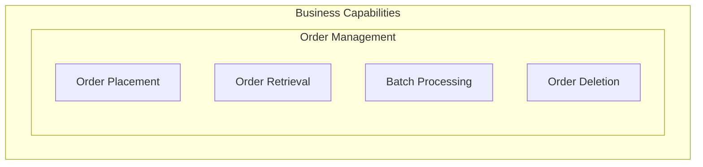

### 3.2 Application Architecture

#### Service Decomposition

| Service | Responsibility | Implementation |
|---------|---------------|----------------|
| **orders-api** | REST API for order CRUD operations, Service Bus message publishing | ASP.NET Core Web API with EF Core |
| **web-app** | User interface for order management | Blazor Server with Fluent UI |
| **AppHost** | Service orchestration, resource wiring, configuration | .NET Aspire AppHost |
| **ServiceDefaults** | Cross-cutting concerns (telemetry, health checks, resilience) | Shared class library |

#### API Contracts

The Orders API exposes the following endpoints (defined in [src/eShop.Orders.API/Controllers/OrdersController.cs](src/eShop.Orders.API/Controllers/OrdersController.cs)):

| Endpoint | Method | Description |
|----------|--------|-------------|
| `/api/orders` | POST | Place a new order |
| `/api/orders/batch` | POST | Place multiple orders |
| `/api/orders/{id}` | GET | Retrieve order by ID |
| `/api/orders` | GET | List all orders |
| `/api/orders/{id}` | DELETE | Delete an order |
| `/health` | GET | Health check endpoint |
| `/alive` | GET | Liveness probe endpoint |

#### Application Landscape Diagram

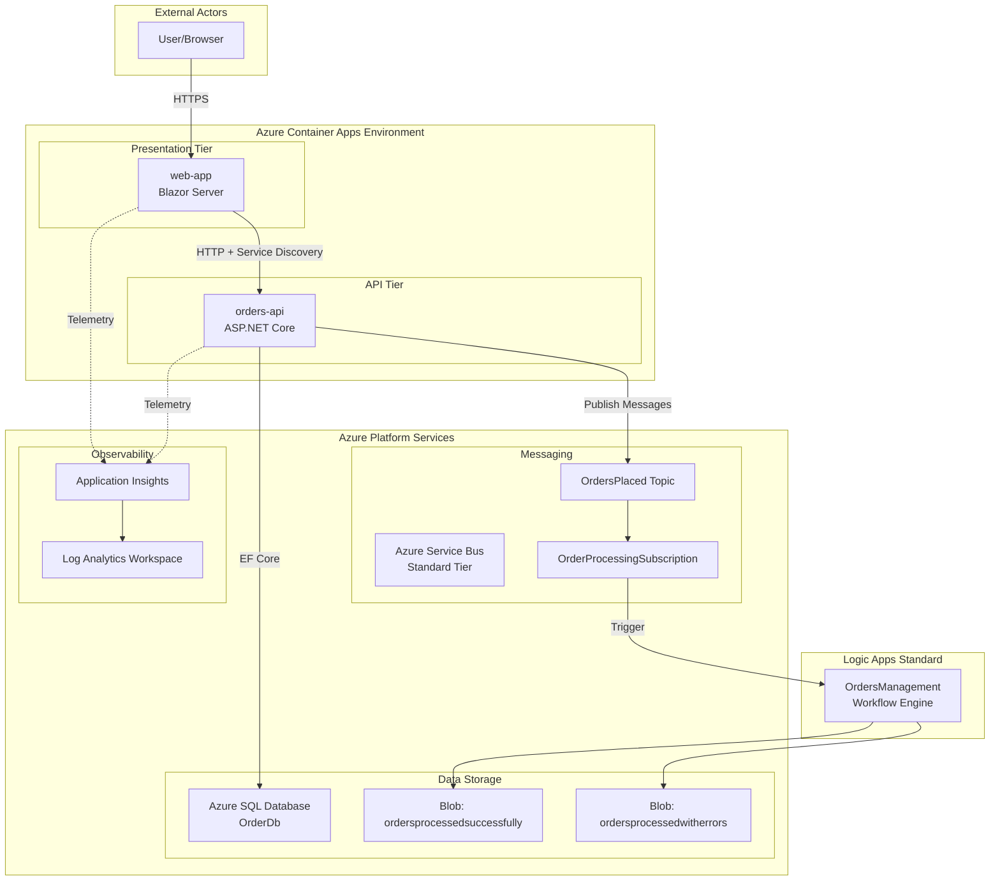

### 3.3 Data Architecture

#### Data Stores and Purposes

| Store | Type | Purpose | Owner |
|-------|------|---------|-------|
| **Azure SQL Database (OrderDb)** | Relational | Order and order product persistence | orders-api |
| **Azure Service Bus (OrdersPlaced)** | Message Queue | Async order event distribution | orders-api (producer), Logic Apps (consumer) |
| **Blob Storage (ordersprocessedsuccessfully)** | Object Store | Archive of successfully processed orders | Logic Apps |
| **Blob Storage (ordersprocessedwitherrors)** | Object Store | Failed order processing for retry/analysis | Logic Apps |
| **Azure Files (workflowstate)** | File Share | Logic Apps runtime state | Logic Apps Standard |

#### Data Model

The core domain model is defined in [app.ServiceDefaults/CommonTypes.cs](app.ServiceDefaults/CommonTypes.cs):

```
Order
├── Id (string, required)
├── CustomerId (string, required)
├── Date (DateTime)
├── DeliveryAddress (string, required)
├── Total (decimal)
└── Products (List<OrderProduct>)
    ├── Id (string, required)
    ├── OrderId (string, required)
    ├── ProductId (string, required)
    ├── ProductDescription (string)
    ├── Quantity (int)
    └── UnitPrice (decimal)
```

Database schema is configured via EF Core Fluent API in [src/eShop.Orders.API/Data/OrderDbContext.cs](src/eShop.Orders.API/Data/OrderDbContext.cs).

#### Data Landscape Diagram

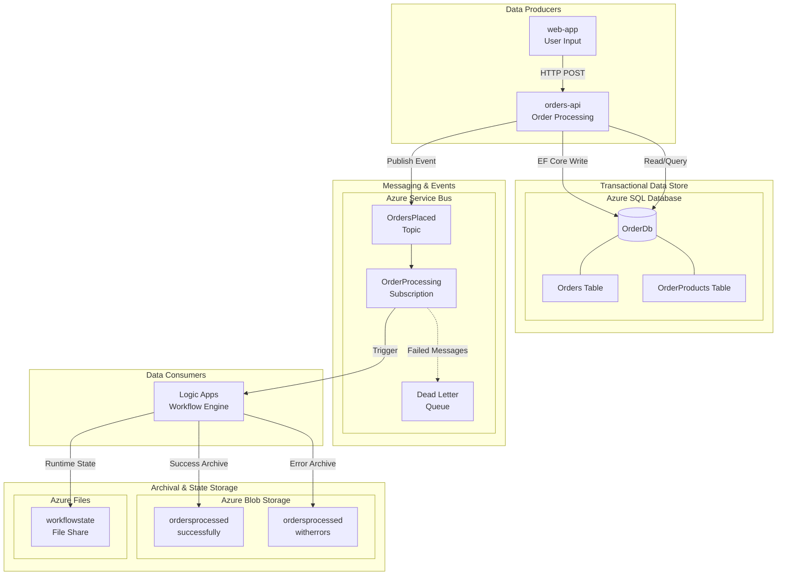

#### Monitoring Data Flow Diagram

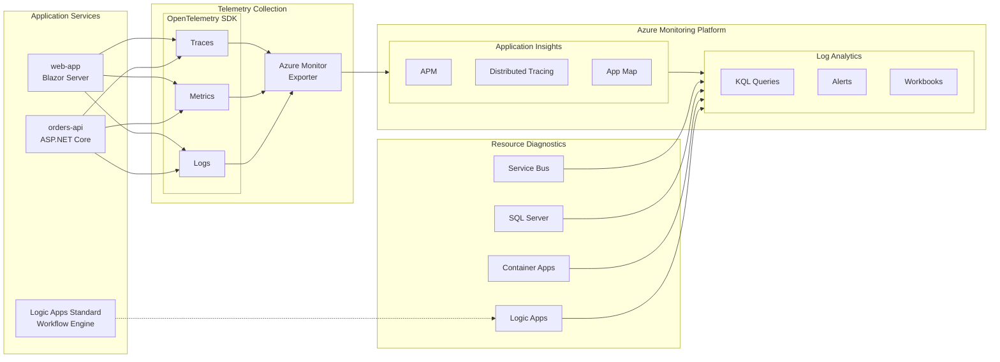

### 3.4 Technology Architecture

#### Runtime Infrastructure

| Component | Azure Service | SKU/Tier | Purpose |
|-----------|--------------|----------|---------|
| **Container Hosting** | Azure Container Apps | Consumption | Serverless container runtime |
| **Container Registry** | Azure Container Registry | Premium | Container image storage |
| **Message Broker** | Azure Service Bus | Standard | Reliable messaging with topics |
| **Relational Database** | Azure SQL Database | - | Order data persistence |
| **Workflow Engine** | Logic Apps Standard | WS1 | Integration workflow execution |
| **Telemetry** | Application Insights | Workspace-based | APM and distributed tracing |
| **Log Storage** | Log Analytics Workspace | - | Centralized log aggregation |
| **Identity** | User-Assigned Managed Identity | - | Passwordless authentication |

#### Azure Services Utilized

Defined in the main Bicep orchestrator [infra/main.bicep](infra/main.bicep):

- `Microsoft.Resources/resourceGroups`
- `Microsoft.ManagedIdentity/userAssignedIdentities`
- `Microsoft.OperationalInsights/workspaces`
- `Microsoft.Insights/components` (Application Insights)
- `Microsoft.Storage/storageAccounts`
- `Microsoft.Sql/servers` and `Microsoft.Sql/servers/databases`
- `Microsoft.ServiceBus/namespaces`
- `Microsoft.ContainerRegistry/registries`
- `Microsoft.App/managedEnvironments`
- `Microsoft.Web/serverfarms` (App Service Plan - WorkflowStandard)
- `Microsoft.Web/sites` (Logic Apps Standard)

#### Technology Landscape Diagram

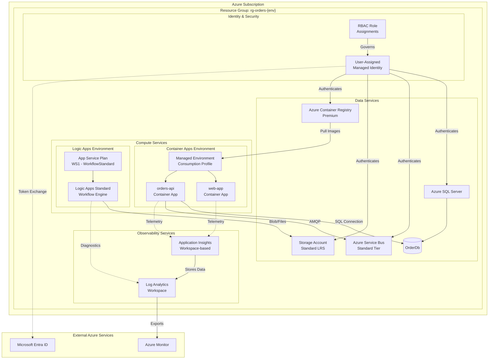

---

## 4. Architecture Views

### 4.1 Context Diagram

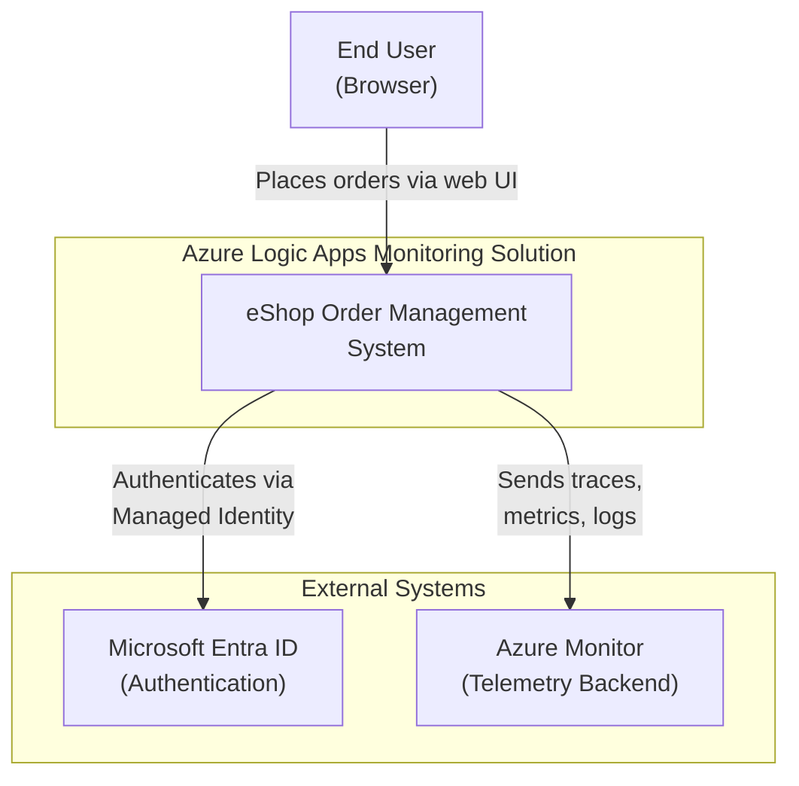

### 4.2 Container Diagram

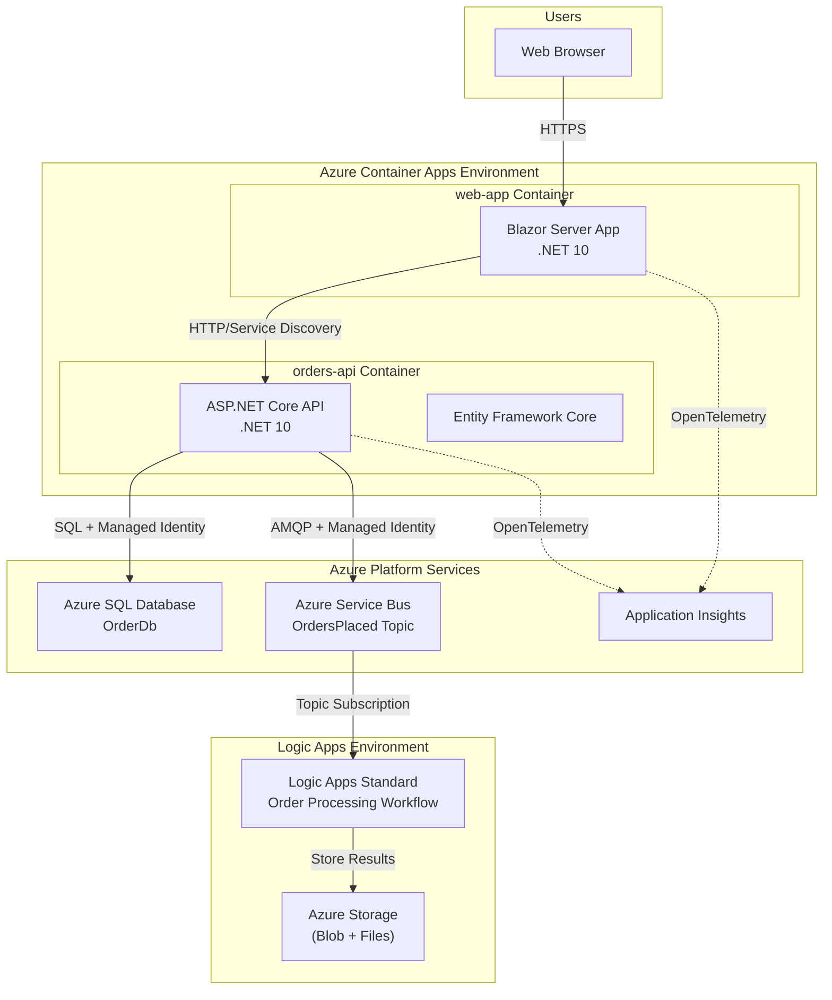

### 4.3 Component Diagram - Orders API

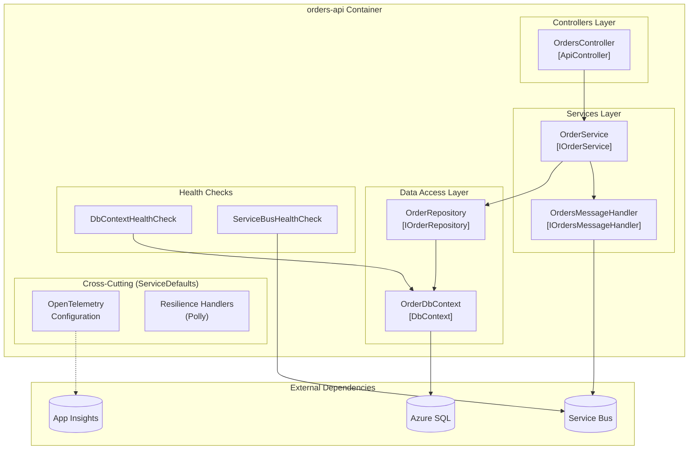

### 4.4 Component Diagram - Web App

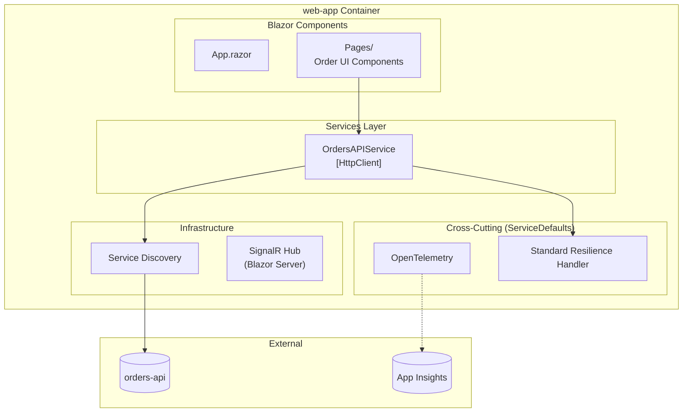

---

## 5. Key Scenarios

### 5.1 Order Creation Flow

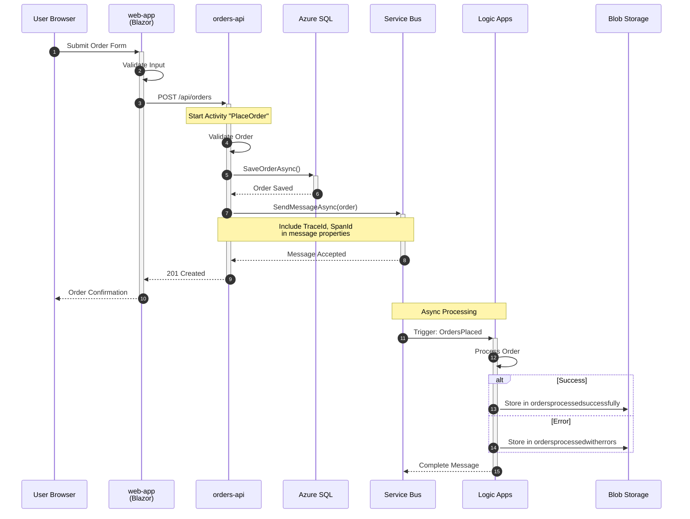

### 5.2 Health Check and Observability Flow

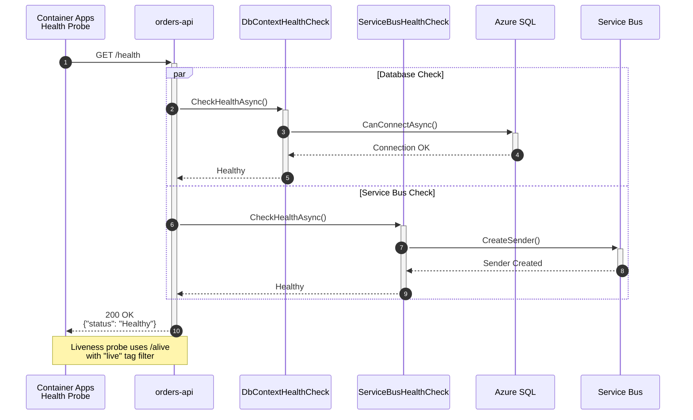

### 5.3 Deployment Pipeline Flow

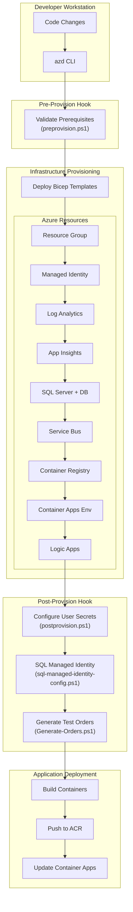

---

## 6. Observability Strategy

### 6.1 Telemetry Collection Approach

The observability stack is configured in [app.ServiceDefaults/Extensions.cs](app.ServiceDefaults/Extensions.cs):

| Telemetry Type | Implementation | Destination |
|----------------|----------------|-------------|
| **Traces** | OpenTelemetry with ASP.NET Core, HttpClient, SQL Client instrumentation | Application Insights + OTLP (optional) |
| **Metrics** | OpenTelemetry with custom meters (`eShop.Orders.API`, `eShop.Web.App`) | Application Insights + OTLP (optional) |
| **Logs** | ILogger with OpenTelemetry export, structured logging | Application Insights + Log Analytics |

### 6.2 Distributed Tracing Implementation

Key tracing features implemented:

1. **Custom Activity Sources** per service (registered as singletons in `Program.cs`)
2. **Trace context propagation** via Service Bus message properties ([src/eShop.Orders.API/Handlers/OrdersMessageHandler.cs#L83-L92](src/eShop.Orders.API/Handlers/OrdersMessageHandler.cs))
3. **Health endpoint filtering** to reduce noise in traces
4. **Exception recording** with `RecordException = true`

```csharp
// From app.ServiceDefaults/Extensions.cs - Tracing configuration
tracing.AddSource(builder.Environment.ApplicationName)
    .AddSource("eShop.Orders.API")
    .AddSource("eShop.Web.App")
    .AddSource("Azure.Messaging.ServiceBus")
    .AddAspNetCoreInstrumentation(options =>
    {
        options.Filter = context =>
            !context.Request.Path.StartsWithSegments("/health")
            && !context.Request.Path.StartsWithSegments("/alive");
        options.RecordException = true;
    })
```

### 6.3 Custom Metrics

Defined in [src/eShop.Orders.API/Services/OrderService.cs](src/eShop.Orders.API/Services/OrderService.cs):

| Metric Name | Type | Description |
|-------------|------|-------------|
| `eShop.orders.placed` | Counter | Total orders successfully placed |
| `eShop.orders.processing.duration` | Histogram | Order processing time in milliseconds |
| `eShop.orders.processing.errors` | Counter | Order processing errors by type |
| `eShop.orders.deleted` | Counter | Total orders deleted |

### 6.4 Health Checks

| Check | Tags | Implementation |
|-------|------|----------------|
| `self` | `live` | Built-in liveness check |
| `database` | `ready`, `db` | [DbContextHealthCheck](src/eShop.Orders.API/HealthChecks/DbContextHealthCheck.cs) <!-- NEEDS VERIFICATION --> |
| `servicebus` | `ready`, `servicebus` | [ServiceBusHealthCheck](src/eShop.Orders.API/HealthChecks/ServiceBusHealthCheck.cs) |

---

## 7. Security & Identity Architecture

### 7.1 Authentication/Authorization Model

| Service | Authentication Method | Credential Type |
|---------|----------------------|-----------------|
| **orders-api → SQL** | Microsoft Entra ID (Azure AD) | User-Assigned Managed Identity |
| **orders-api → Service Bus** | Microsoft Entra ID | User-Assigned Managed Identity |
| **Logic Apps → Storage** | Microsoft Entra ID | User-Assigned Managed Identity |
| **Container Apps → ACR** | Managed Identity | User-Assigned Managed Identity |

### 7.2 Managed Identity Configuration

The solution uses a single user-assigned managed identity with comprehensive RBAC assignments, defined in [infra/shared/identity/main.bicep](infra/shared/identity/main.bicep):

**Assigned Roles:**
- Storage Account Contributor
- Storage Blob Data Contributor
- Storage Blob Data Owner
- Storage Table/Queue/File Data Contributor
- Monitoring Metrics Publisher
- Monitoring Contributor
- Application Insights Component Contributor
- Azure Service Bus Data Owner/Receiver/Sender
- ACR Pull/Push

### 7.3 Network Security Considerations

| Resource | Public Network Access | Network Controls |
|----------|----------------------|------------------|
| Container Apps Environment | Enabled | External ingress for web-app |
| SQL Server | Enabled | Firewall rules via deployment |
| Service Bus | Enabled | Standard tier (no private endpoint) |
| Storage Accounts | Enabled | Bypass for Azure Services |

<!-- NEEDS VERIFICATION: Production deployments should consider enabling Private Endpoints for SQL, Service Bus, and Storage -->

### 7.4 Secret Management Approach

| Secret Type | Storage Location | Access Method |
|-------------|-----------------|---------------|
| Application Insights Connection String | Azure Key Vault (via Aspire) | Environment variable injection |
| SQL Connection String | N/A (Managed Identity) | Built dynamically from server FQDN |
| Service Bus Connection | N/A (Managed Identity) | Hostname + DefaultAzureCredential |
| Local Development Secrets | .NET User Secrets | `postprovision.ps1` configuration |

---

## 8. Deployment & Operations

### 8.1 CI/CD Pipeline Overview

The solution uses Azure Developer CLI (azd) for deployment orchestration, configured in [azure.yaml](azure.yaml):

```yaml
name: azure-logicapps-monitoring
infra:
  provider: bicep
  path: infra
  module: main

services:
  app:
    language: dotnet
    project: ./app.AppHost/app.AppHost.csproj
    host: containerapp
```

### 8.2 Environment Promotion Strategy

| Environment | Purpose | azd Command |
|-------------|---------|-------------|
| `local` | Developer workstation with emulators | `azd env new local` |
| `dev` | Shared development/integration testing | `azd provision --environment dev` |
| `staging` | Pre-production validation | `azd provision --environment staging` |
| `prod` | Production workloads | `azd provision --environment prod` |

### 8.3 Infrastructure Provisioning with azd

**Lifecycle Hooks** (defined in [azure.yaml](azure.yaml)):

| Hook | Script | Purpose |
|------|--------|---------|
| `preprovision` | [hooks/preprovision.ps1](hooks/preprovision.ps1) | Validate prerequisites (Azure CLI, .NET SDK) |
| `postprovision` | [hooks/postprovision.ps1](hooks/postprovision.ps1) | Configure .NET user secrets, SQL managed identity |
| `postprovision` | [hooks/Generate-Orders.ps1](hooks/Generate-Orders.ps1) | Generate test order data |

### 8.4 Operational Runbooks Reference

| Task | Hook/Script | Description |
|------|-------------|-------------|
| Check workstation prerequisites | [hooks/check-dev-workstation.ps1](hooks/check-dev-workstation.ps1) | Validates required tools and versions |
| Configure SQL managed identity | [hooks/sql-managed-identity-config.ps1](hooks/sql-managed-identity-config.ps1) | Creates database user with Entra ID authentication |
| Clean secrets | [hooks/clean-secrets.ps1](hooks/clean-secrets.ps1) | Removes .NET user secrets for clean state |
| Generate test data | [hooks/Generate-Orders.ps1](hooks/Generate-Orders.ps1) | Creates sample orders in the database |

---

## 9. Architecture Decision Records (ADRs)

### ADR-001: Use .NET Aspire for Service Orchestration

**Status:** Accepted

**Context:**  
The solution requires a way to orchestrate multiple services (API, web app, databases, message broker) with consistent configuration across local development and cloud deployment. Options considered: manual docker-compose, Dapr, .NET Aspire.

**Decision:**  
Use .NET Aspire 9.5 for service orchestration, leveraging its `AddProject`, `AddAzureServiceBus`, `AddAzureSqlServer`, and `AddAzureApplicationInsights` APIs for resource wiring.

**Consequences:**  
- ✅ Native .NET integration with strong typing for resource references
- ✅ Automatic service discovery via `WithReference()`
- ✅ Seamless local emulator support (`RunAsEmulator()`, `RunAsContainer()`)
- ✅ Built-in health checks and dashboard
- ⚠️ Limited to .NET ecosystem
- ⚠️ Requires .NET 9+ for latest features

**Implementation:**  
- AppHost configuration: [app.AppHost/AppHost.cs](app.AppHost/AppHost.cs)
- Service defaults: [app.ServiceDefaults/Extensions.cs](app.ServiceDefaults/Extensions.cs)

---

### ADR-002: Use Azure Service Bus for Order Event Messaging

**Status:** Accepted

**Context:**  
The order placement flow requires reliable asynchronous communication to trigger downstream Logic Apps workflows. Options considered: Azure Event Grid, Azure Storage Queues, Azure Service Bus.

**Decision:**  
Use Azure Service Bus Standard tier with topic/subscription pattern for order event distribution.

**Consequences:**  
- ✅ Guaranteed message delivery with dead-letter queue support
- ✅ Topic/subscription allows multiple subscribers without code changes
- ✅ Native .NET Aspire integration via `Aspire.Hosting.Azure.ServiceBus`
- ✅ Configurable message TTL (14 days) and lock duration (5 minutes)
- ⚠️ Standard tier has 256KB message size limit
- ⚠️ Higher cost than Storage Queues for low-volume scenarios

**Implementation:**  
- AppHost wiring: [app.AppHost/AppHost.cs](app.AppHost/AppHost.cs) (lines 130-185)
- Message handler: [src/eShop.Orders.API/Handlers/OrdersMessageHandler.cs](src/eShop.Orders.API/Handlers/OrdersMessageHandler.cs)
- Infrastructure: [infra/workload/messaging/main.bicep](infra/workload/messaging/main.bicep)

---

### ADR-003: Use Managed Identity for All Azure Service Authentication

**Status:** Accepted

**Context:**  
The solution requires secure authentication to Azure SQL Database, Service Bus, and Storage. Options considered: connection strings with secrets, service principals with certificates, managed identity.

**Decision:**  
Use Azure Managed Identity (user-assigned) for all Azure service authentication, configured via `DefaultAzureCredential`.

**Consequences:**  
- ✅ No secrets to manage, rotate, or leak
- ✅ Works seamlessly in Azure Container Apps
- ✅ Simplified local development with Azure CLI authentication
- ✅ Single identity with comprehensive RBAC assignments
- ⚠️ Requires proper RBAC role assignments during provisioning
- ⚠️ Local emulator fallback needed for offline development

**Implementation:**  
- Identity resource: [infra/shared/identity/main.bicep](infra/shared/identity/main.bicep)
- Service Bus client: [app.ServiceDefaults/Extensions.cs](app.ServiceDefaults/Extensions.cs) (lines 180-270)
- SQL configuration: [hooks/sql-managed-identity-config.ps1](hooks/sql-managed-identity-config.ps1)

---

### ADR-004: Use OpenTelemetry with Application Insights for Observability

**Status:** Accepted

**Context:**  
The solution needs comprehensive observability (traces, metrics, logs) with distributed tracing across services. Options considered: pure Application Insights SDK, pure OpenTelemetry with Jaeger, OpenTelemetry with Azure Monitor exporter.

**Decision:**  
Use OpenTelemetry for instrumentation with Azure Monitor OpenTelemetry Exporter for telemetry storage in Application Insights.

**Consequences:**  
- ✅ Vendor-neutral instrumentation code
- ✅ Rich instrumentation libraries for ASP.NET Core, HttpClient, SQL Client, Service Bus
- ✅ Dual export capability (OTLP + Azure Monitor)
- ✅ Custom metrics via `System.Diagnostics.Metrics`
- ⚠️ Additional configuration complexity vs. pure App Insights SDK
- ⚠️ Some Application Insights features require SDK-specific code

**Implementation:**  
- OpenTelemetry configuration: [app.ServiceDefaults/Extensions.cs](app.ServiceDefaults/Extensions.cs) (lines 60-130)
- Custom metrics: [src/eShop.Orders.API/Services/OrderService.cs](src/eShop.Orders.API/Services/OrderService.cs) (lines 21-36)

---

### ADR-005: Use Bicep for Infrastructure as Code

**Status:** Accepted

**Context:**  
All Azure infrastructure must be defined as code for repeatable deployments. Options considered: ARM templates, Terraform, Pulumi, Bicep.

**Decision:**  
Use Bicep with modular template organization, orchestrated by Azure Developer CLI (azd).

**Consequences:**  
- ✅ First-class Azure support with native resource type definitions
- ✅ Cleaner syntax than ARM JSON
- ✅ Native azd integration for lifecycle hooks
- ✅ Modular organization (shared, workload, monitoring)
- ⚠️ Azure-only (no multi-cloud support)
- ⚠️ Less mature ecosystem than Terraform

**Implementation:**  
- Main orchestrator: [infra/main.bicep](infra/main.bicep)
- Shared infrastructure: [infra/shared/main.bicep](infra/shared/main.bicep)
- Workload infrastructure: [infra/workload/main.bicep](infra/workload/main.bicep)

---

### ADR-006: Use Polly for HTTP Client Resilience

**Status:** Accepted

**Context:**  
HTTP communication between services needs resilience against transient failures. Options considered: manual retry logic, Polly library, .NET Aspire built-in handlers.

**Decision:**  
Use `AddStandardResilienceHandler()` from Microsoft.Extensions.Http.Resilience (Polly-based) with custom timeout and retry configuration.

**Consequences:**  
- ✅ Configurable retry (3 attempts, exponential backoff)
- ✅ Circuit breaker protection (120s sampling duration)
- ✅ Timeout policies (600s total, 60s per attempt)
- ✅ Integrated with HttpClientFactory
- ⚠️ Default settings may need tuning for specific scenarios

**Implementation:**  
- Configuration: [app.ServiceDefaults/Extensions.cs](app.ServiceDefaults/Extensions.cs) (lines 40-55)

```csharp
http.AddStandardResilienceHandler(options =>
{
    options.TotalRequestTimeout.Timeout = TimeSpan.FromSeconds(600);
    options.AttemptTimeout.Timeout = TimeSpan.FromSeconds(60);
    options.Retry.MaxRetryAttempts = 3;
    options.Retry.BackoffType = Polly.DelayBackoffType.Exponential;
    options.CircuitBreaker.SamplingDuration = TimeSpan.FromSeconds(120);
});
```

---

## Appendix: File Reference Index

| Section | Key Files |
|---------|-----------|
| **AppHost Orchestration** | [app.AppHost/AppHost.cs](app.AppHost/AppHost.cs) |
| **Service Defaults** | [app.ServiceDefaults/Extensions.cs](app.ServiceDefaults/Extensions.cs), [app.ServiceDefaults/CommonTypes.cs](app.ServiceDefaults/CommonTypes.cs) |
| **Orders API** | [src/eShop.Orders.API/Program.cs](src/eShop.Orders.API/Program.cs), [src/eShop.Orders.API/Controllers/OrdersController.cs](src/eShop.Orders.API/Controllers/OrdersController.cs), [src/eShop.Orders.API/Services/OrderService.cs](src/eShop.Orders.API/Services/OrderService.cs) |
| **Web App** | [src/eShop.Web.App/Program.cs](src/eShop.Web.App/Program.cs), [src/eShop.Web.App/Components/Services/OrdersAPIService.cs](src/eShop.Web.App/Components/Services/OrdersAPIService.cs) |
| **Infrastructure** | [infra/main.bicep](infra/main.bicep), [infra/shared/main.bicep](infra/shared/main.bicep), [infra/workload/main.bicep](infra/workload/main.bicep) |
| **Deployment Automation** | [azure.yaml](azure.yaml), [hooks/postprovision.ps1](hooks/postprovision.ps1), [hooks/sql-managed-identity-config.ps1](hooks/sql-managed-identity-config.ps1) |

---

*Document generated based on workspace analysis. All architectural claims are traceable to specific implementation files.*
