# TOGAF BDAT Model: Azure Logic Apps Monitoring Solution

## Project Overview

Enterprise organizations deploying Azure Logic Apps Standard at scale face critical operational challenges that directly impact cost efficiency and system reliability. Current deployments experience annual operating costs exceeding US$80,000 per environment, primarily driven by suboptimal workflow density, memory consumption spikes, and insufficient monitoring visibility. These challenges are exacerbated in scenarios involving long-running workflows (18–36 months) where traditional monitoring approaches fail to provide adequate observability into resource utilization patterns and business process execution.

This solution addresses these enterprise-scale challenges by implementing a comprehensive monitoring and governance framework aligned with the Azure Well-Architected Framework. The architecture establishes optimal hosting density patterns, implements distributed tracing across workflow executions, and provides real-time visibility into both technical performance metrics and business process outcomes. By leveraging Azure Monitor, Application Insights, and custom telemetry patterns, the solution enables organizations to maintain workflow stability while reducing operational costs through data-driven optimization decisions.

The TOGAF BDAT model presented here provides a structured enterprise architecture view that aligns business capabilities with technology implementation, ensuring scalability, maintainability, and governance across all architectural layers. This approach enables organizations to transition from reactive operational firefighting to proactive performance optimization and cost management.

---

## Business Architecture Layer

### Purpose
The Business Architecture layer defines the organizational capabilities, value streams, and business processes required to operate and monitor Azure Logic Apps at enterprise scale. It establishes the business case for monitoring investment and aligns technical implementation with organizational objectives around cost optimization, operational excellence, and business continuity.

### Key Capabilities
- **Workflow Governance**: Establish policies for workflow deployment density, resource allocation, and lifecycle management
- **Cost Management**: Enable cost visibility, chargeback models, and optimization recommendations
- **Operational Excellence**: Ensure 99.95%+ availability through proactive monitoring and incident response
- **Business Process Visibility**: Track end-to-end order processing, fulfillment, and customer experience metrics
- **Compliance & Audit**: Maintain audit trails for regulatory compliance and operational reviews

### Process (High-Level)
1. **Business Demand Management**: Capture requirements for new workflows and integration patterns
2. **Capacity Planning**: Assess workflow density requirements and resource provisioning
3. **Monitoring & Alerting**: Establish KPIs, SLAs, and automated response procedures
4. **Cost Optimization**: Continuous review of resource utilization and rightsizing recommendations
5. **Incident Management**: Structured response to performance degradation or failures

### Business Capability Map

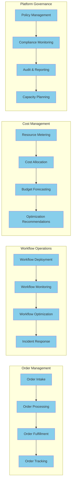

### Value Stream Map

```mermaid
flowchart LR
    V1[Customer Order Request] --> V2[Order Validation]
    V2 --> V3[Inventory Check]
    V3 --> V4[Payment Processing]
    V4 --> V5[Order Confirmation]
    V5 --> V6[Fulfillment Initiation]
    V6 --> V7[Shipment Tracking]
    V7 --> V8[Customer Notification]
    V8 --> V9[Order Completion]
    
    V10[Workflow Performance Monitoring] --> V11[Anomaly Detection]
    V11 --> V12[Root Cause Analysis]
    V12 --> V13[Optimization Action]
    V13 --> V14[Validation & Deployment]
    
    style V1 fill:#D3D3D3
    style V2 fill:#D3D3D3
    style V3 fill:#FFD700
    style V4 fill:#D3D3D3
    style V5 fill:#D3D3D3
    style V6 fill:#D3D3D3
    style V7 fill:#D3D3D3
    style V8 fill:#D3D3D3
    style V9 fill:#D3D3D3
    style V10 fill:#D3D3D3
    style V11 fill:#FFD700
    style V12 fill:#FFD700
    style V13 fill:#D3D3D3
    style V14 fill:#D3D3D3
```

**Key Value Stream Insights:**
- **Inventory Check** (V3): Critical bottleneck requiring real-time data access
- **Anomaly Detection** (V11): High-value step enabling proactive optimization
- **Root Cause Analysis** (V12): Reduces mean-time-to-resolution (MTTR) from hours to minutes

---

## Data Architecture Layer

### Purpose
The Data Architecture layer defines the structure, storage, flow, and governance of data across the monitoring solution. It ensures that telemetry, business events, and operational metrics are captured, processed, and stored in a manner that supports real-time decision-making, historical analysis, and regulatory compliance.

### Key Capabilities
- **Telemetry Collection**: Capture distributed traces, metrics, and logs from Logic Apps, APIs, and infrastructure
- **Event Streaming**: Process business events and operational signals in near-real-time
- **Master Data Management**: Maintain golden records for orders, customers, and workflow definitions
- **Data Lake Zones**: Implement Bronze/Silver/Gold data zones for raw ingestion, cleansing, and analytics-ready data
- **Data Governance**: Enforce data quality, retention policies, and access controls

### Process (High-Level)
1. **Data Ingestion**: Collect telemetry from multiple sources (Application Insights, Azure Monitor, custom instrumentation)
2. **Event Processing**: Transform and enrich events using stream processing (Azure Functions, Event Hubs)
3. **Data Storage**: Persist data in appropriate zones (Cosmos DB for operational, Azure Data Lake for analytics)
4. **Data Consumption**: Enable real-time dashboards, alerting, and batch analytics
5. **Data Lifecycle Management**: Archive or purge data based on retention policies

### Master Data Management (MDM)

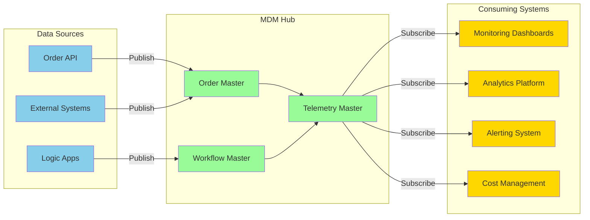

### Event-Driven Data Topology

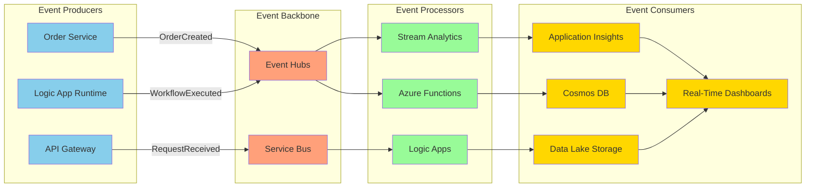

### Data Lake Architecture

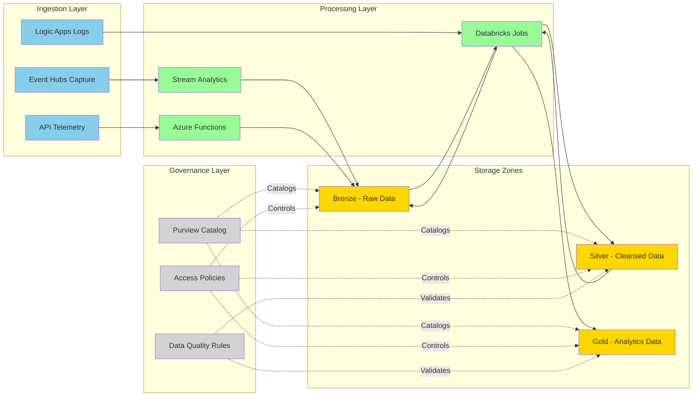

---

## Application Architecture Layer

### Purpose
The Application Architecture layer defines the structure, interactions, and deployment patterns of software components that implement monitoring, observability, and operational capabilities. It establishes microservices boundaries, event-driven patterns, and integration points that enable scalable, maintainable application delivery.

### Key Capabilities
- **API Management**: Expose RESTful endpoints for order processing and monitoring data access
- **Workflow Orchestration**: Execute long-running business processes using Azure Logic Apps
- **Event Processing**: React to business and operational events in near-real-time
- **Distributed Tracing**: Correlate requests across service boundaries using W3C Trace Context
- **Service Resilience**: Implement circuit breakers, retries, and fallback patterns

### Process (High-Level)
1. **API Request Handling**: Client requests routed through API Management / Gateway
2. **Service Execution**: Business logic executed in .NET services or Logic Apps
3. **Event Publication**: Services publish domain events to Event Hubs / Service Bus
4. **Asynchronous Processing**: Background workers process events and update state
5. **Telemetry Emission**: All components emit structured logs, metrics, and traces

### Microservices Architecture

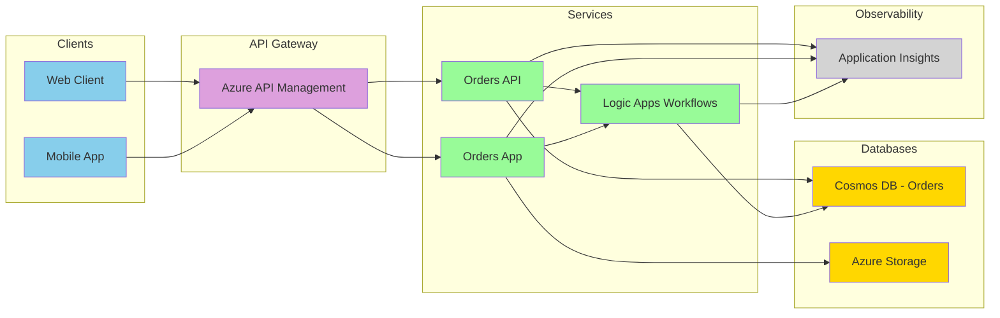

### Event-Driven Architecture (Topology)

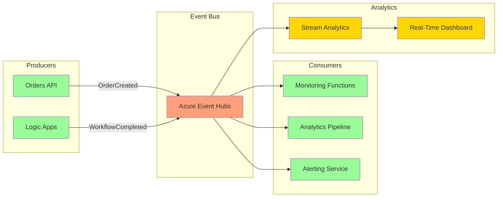

### Event-Driven Architecture (State Transitions)

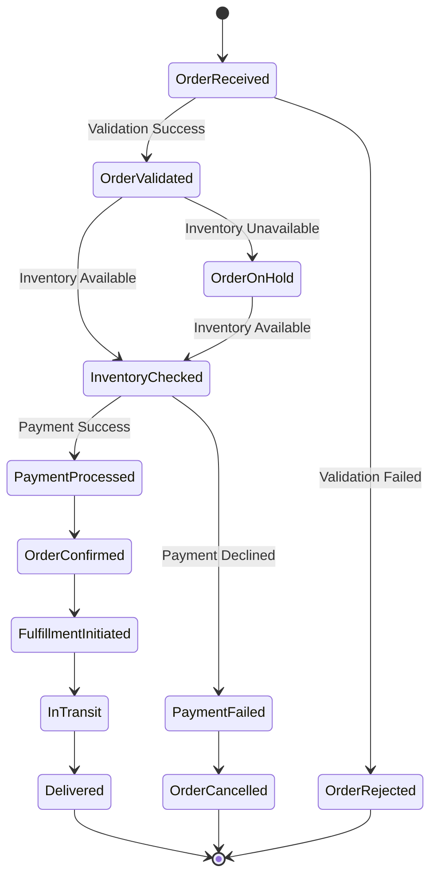

---

## Technology Architecture Layer

### Purpose
The Technology Architecture layer defines the infrastructure, platform services, runtime environments, and deployment models that host and operate the monitoring solution. It establishes patterns for cloud-native deployment, containerization, serverless execution, and platform engineering practices that enable scalability, reliability, and operational efficiency.

### Key Capabilities
- **Cloud-Native Infrastructure**: Leverage Azure PaaS services for managed operations
- **Container Orchestration**: Deploy services using Azure Container Apps with automatic scaling
- **Serverless Execution**: Run event-driven workloads using Azure Functions and Logic Apps
- **Infrastructure as Code**: Define all resources using Bicep templates with version control
- **Observability Platform**: Integrate Application Insights, Azure Monitor, and distributed tracing
- **Platform Engineering**: Establish golden paths, reusable templates, and self-service capabilities

### Process (High-Level)
1. **Infrastructure Provisioning**: Deploy Azure resources using Bicep templates
2. **Service Deployment**: Package and deploy applications using .NET Aspire and Azure Container Apps
3. **Runtime Management**: Monitor health, scale instances, and manage secrets
4. **Observability**: Collect and analyze telemetry from all layers
5. **Continuous Improvement**: Iterate on performance, cost, and reliability based on insights

### Cloud-Native Architecture

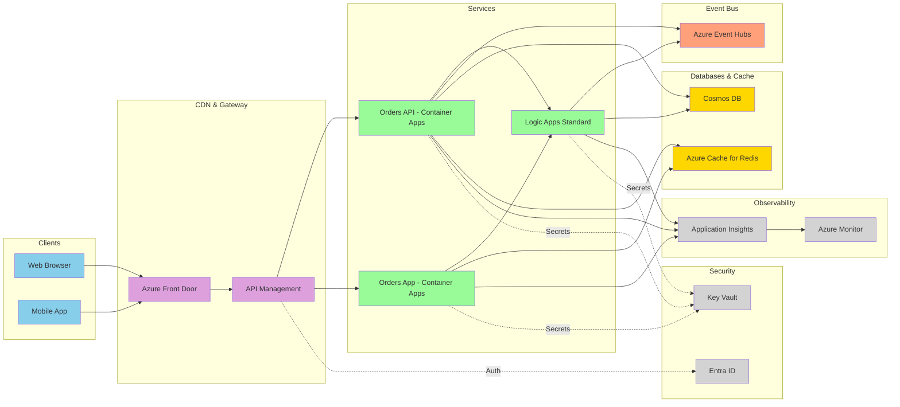

### Container-Based Architecture

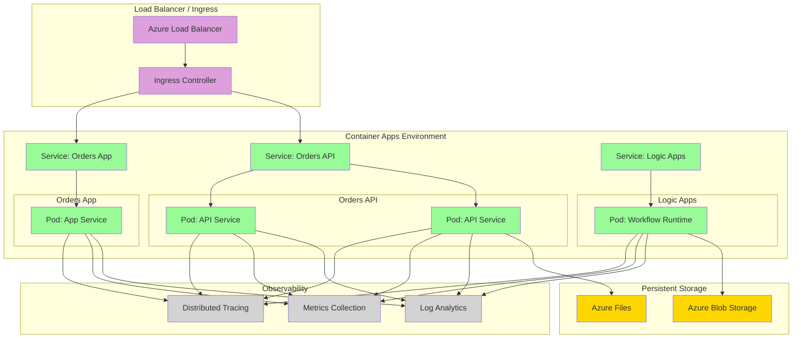

### Serverless Architecture

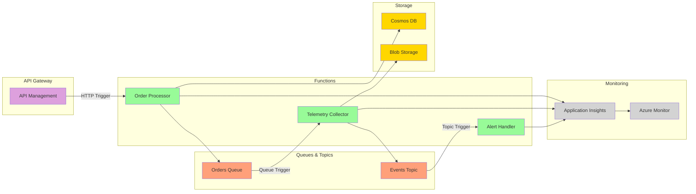

### Platform Engineering Architecture

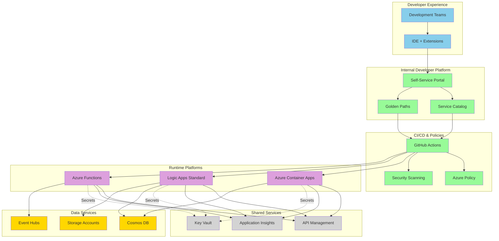

---

## Complete TOGAF BDAT Model

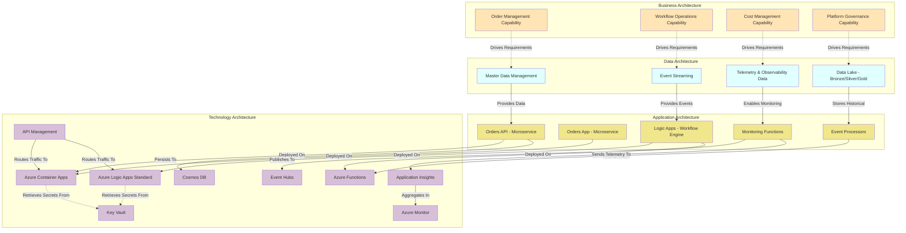

---

## Scalability Considerations

### Workflow Density Optimization
- **Target Density**: 50–100 workflows per Logic Apps Standard plan (WS1)
- **Memory Management**: Monitor memory consumption using Application Insights; implement workflow throttling when usage exceeds 85%
- **Compute Scaling**: Configure horizontal scaling rules based on queue depth and CPU utilization

### Cosmos DB Partitioning Strategy
- **Partition Key**: Use hierarchical partition keys (`/tenantId/orderId`) to overcome 20 GB logical partition limits
- **Indexing Policy**: Optimize for query patterns; exclude unnecessary paths to reduce RU consumption
- **Consistency Level**: Use Session consistency for 99.99% availability with bounded staleness for analytics workloads

### Event Hubs Throughput
- **Throughput Units**: Start with 5 TUs; enable auto-inflate for burst handling
- **Partition Strategy**: Distribute events across 16+ partitions using `orderId` as partition key
- **Capture**: Enable Event Hubs Capture to Azure Data Lake for cost-effective archival

### Monitoring and Alerting
- **Application Insights Sampling**: Use adaptive sampling (default 5 events/sec) to control costs while maintaining statistical accuracy
- **Log Analytics Retention**: Retain operational logs for 30 days; export to Data Lake for long-term analysis
- **Alerting Thresholds**: Set dynamic baselines using Azure Monitor smart detection for anomaly detection

---

## Governance and Compliance

### Azure Policy Enforcement
- **Naming Conventions**: Enforce resource naming standards using Azure Policy (`<env>-<service>-<region>`)
- **Tagging Requirements**: Require tags for `CostCenter`, `Owner`, `Environment`, `Criticality`
- **Region Restrictions**: Limit deployments to approved regions for data residency compliance

### Security Best Practices
- **Managed Identities**: Use system-assigned managed identities for all service-to-service authentication
- **Key Vault Integration**: Store all secrets, connection strings, and certificates in Azure Key Vault
- **Network Isolation**: Deploy services into VNet-integrated Container Apps with private endpoints for Cosmos DB and Storage

### Cost Management
- **Budgets and Alerts**: Configure monthly budgets with alerts at 50%, 75%, and 90% thresholds
- **Reserved Capacity**: Purchase Cosmos DB reserved capacity (1–3 years) for 30–50% cost savings
- **Autoscaling**: Implement autoscaling for Container Apps and Logic Apps to match demand patterns

---

## Actionable Insights

1. **Implement Distributed Tracing**: Use W3C Trace Context across all services to enable end-to-end correlation. Refer to [distributed tracing in .NET](https://learn.microsoft.com/dotnet/core/diagnostics/distributed-tracing).

2. **Optimize Logic Apps Density**: Consolidate workflows to 50–100 per plan; monitor memory using the [Logic Apps metrics](https://learn.microsoft.com/azure/logic-apps/monitor-logic-apps).

3. **Enable Application Insights Live Metrics**: Use [Live Metrics Stream](https://learn.microsoft.com/azure/azure-monitor/app/live-stream) for real-time visibility during deployment and incident response.

4. **Leverage Azure Advisor**: Review weekly recommendations for cost optimization, reliability, and performance improvements.

5. **Establish SLIs/SLOs**: Define Service Level Indicators (e.g., p95 latency < 500ms) and Objectives (99.9% availability) aligned with business requirements.

This TOGAF BDAT model provides a comprehensive enterprise architecture framework for deploying, monitoring, and governing Azure Logic Apps at scale while maintaining alignment with business objectives and operational excellence principles.