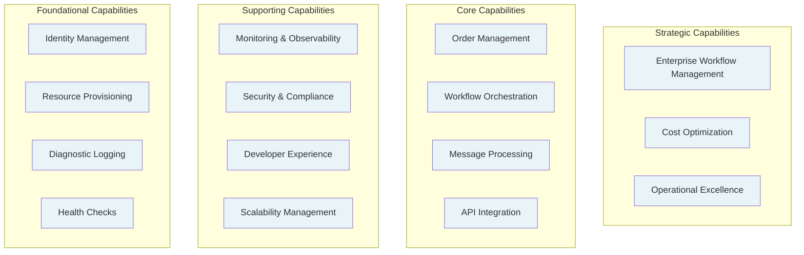
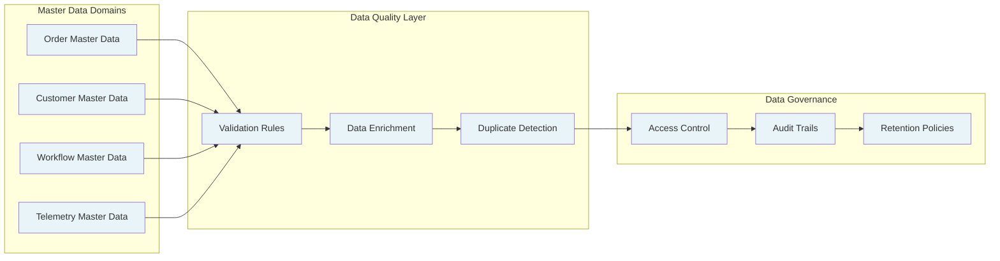
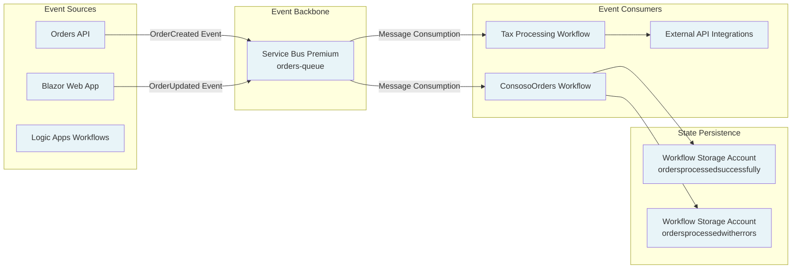
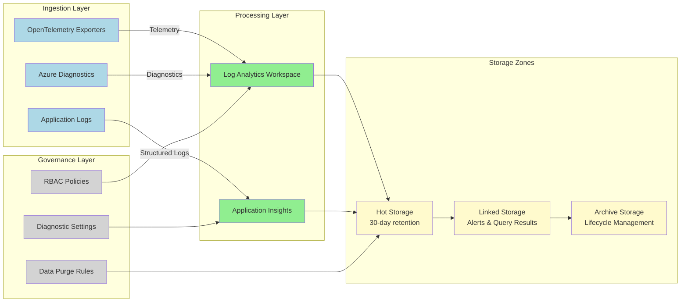
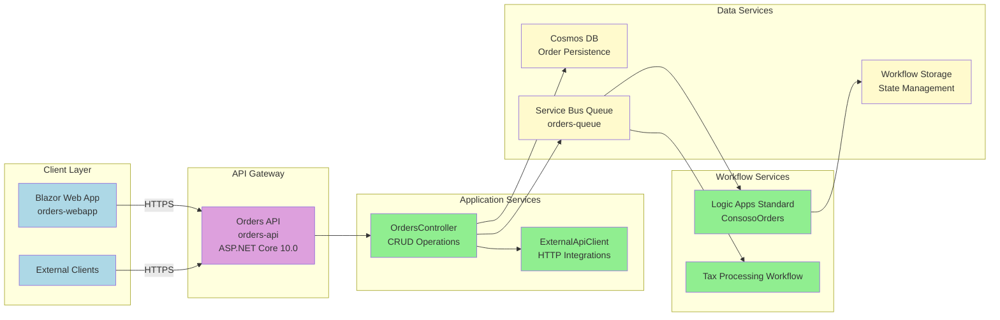
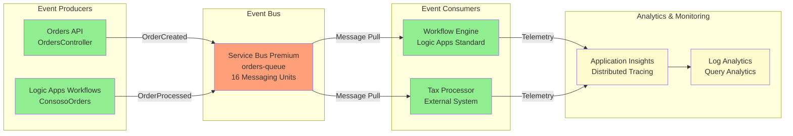
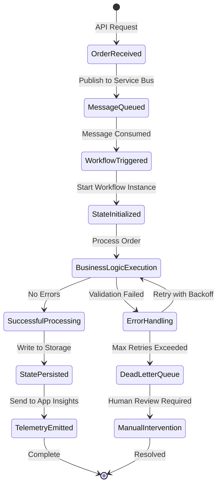
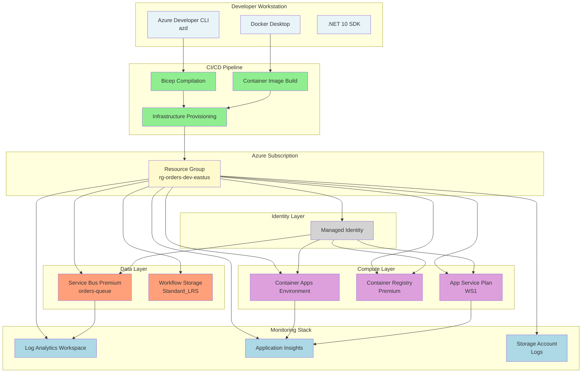
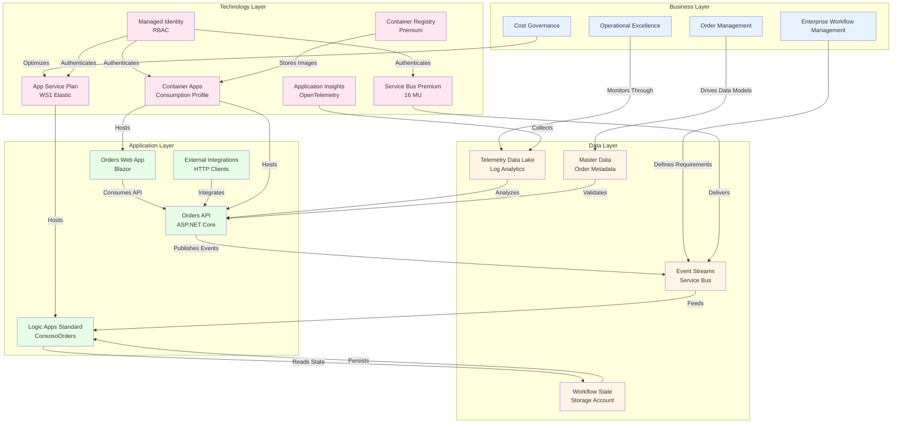

# TOGAF BDAT Model for Azure Logic Apps Standard Enterprise Monitoring Solution

## Executive Summary

This TOGAF Business-Data-Application-Technology (BDAT) model provides a comprehensive enterprise architecture framework for organizations deploying Azure Logic Apps Standard at scale. The model addresses critical operational challenges faced by enterprises managing thousands of workflows globally, including memory instability, hosting density optimization, and cost management that can reach US$80,000 annually per environment.

The solution implements a production-ready reference architecture aligned with the Azure Well-Architected Framework, providing proven patterns for workflow hosting density (~20 workflows per instance), comprehensive observability through OpenTelemetry and Application Insights, and support for long-running stateful workflows (18-36 months). The architecture leverages Azure Container Apps, Service Bus Premium, and .NET Aspire to deliver enterprise-grade monitoring, scalability, and operational excellence.

This BDAT model follows TOGAF Architecture Development Method (ADM) principles, mapping business capabilities to technology implementations while ensuring alignment with enterprise objectives for cost optimization, operational resilience, and developer productivity.

---

## 1. Business Architecture Layer

### Purpose
The Business Architecture layer defines the organizational capabilities, value streams, and business processes required to operate enterprise-scale Logic Apps deployments. It establishes the strategic foundation for workflow orchestration, order management, and operational monitoring aligned with business objectives.

### Key Capabilities
- **Workflow Orchestration**: Managing 1000+ stateful workflows with optimized hosting density
- **Order Processing**: End-to-end order lifecycle management from creation to fulfillment
- **Operational Monitoring**: Real-time observability and health tracking across distributed systems
- **Cost Governance**: Infrastructure optimization to prevent US$80,000+ annual cost overruns
- **Developer Productivity**: Streamlined local development and deployment workflows
- **Compliance Management**: Audit trails, diagnostic logging, and security controls

### Business Capability Map

### Value Stream Map

```mermaid
graph LR
    A[Business Request] --> B[Order Creation]
    B --> C[Workflow Triggering]
    C --> D[Message Queueing]
    D --> E[Workflow Processing]
    E --> F[State Persistence]
    F --> G[Monitoring & Telemetry]
    G --> H[Order Fulfillment]
    H --> I[Business Value Delivered]
    
    style D fill:#FFE5CC
    style E fill:#FFE5CC
    style G fill:#FFE5CC
    
    classDef critical fill:#FFE5CC
```

**Key Value Steps:**
- **Message Queueing** (Bottleneck): Service Bus Premium ensures reliable message delivery with 16 messaging units
- **Workflow Processing** (Critical Path): Logic Apps Standard executes stateful workflows with optimized memory management
- **Monitoring & Telemetry** (Observability): Application Insights provides distributed tracing with OpenTelemetry

### Process Overview

#### Order Management Process
1. **Order Creation**: REST API receives order requests via `OrdersController`
2. **Validation**: Business logic validates order data with custom activity spans
3. **Message Publication**: Order events published to Service Bus queue (`orders-queue`)
4. **Workflow Triggering**: Logic Apps Standard workflows consume messages
5. **State Management**: Workflow state persisted to dedicated storage account
6. **Fulfillment**: Order processed through ConsosoOrders workflow
7. **Telemetry Collection**: Distributed traces sent to Application Insights

#### Monitoring Process
1. **Telemetry Ingestion**: OpenTelemetry collectors capture metrics, traces, and logs
2. **Data Aggregation**: Log Analytics workspace processes diagnostic data with 30-day retention
3. **Visualization**: Aspire Dashboard (local) or Application Insights (production) displays real-time metrics
4. **Alerting**: Azure Monitor alerts trigger on workflow failures, latency thresholds, or queue depth
5. **Cost Analysis**: Resource tags enable cost tracking by solution, environment, and business unit

---

## 2. Data Architecture Layer

### Purpose
The Data Architecture layer defines data storage strategies, event-driven topologies, and master data management patterns to support stateful workflows, telemetry collection, and operational analytics at enterprise scale.

### Key Capabilities
- **Event Stream Processing**: Asynchronous message handling through Service Bus Premium
- **Workflow State Management**: Persistent storage for long-running workflows (18-36 months)
- **Telemetry Data Lakes**: Centralized logging with Log Analytics workspace
- **Master Data Governance**: Unified order, customer, and workflow metadata
- **Diagnostic Data Retention**: 30-day retention with automated purge policies

### Master Data Management (MDM)

### Event-Driven Data Topology

### Data Lake Architecture

**Storage Accounts:**
- **Workflow Storage** (`messaging/main.bicep`): Standard_LRS for Logic Apps runtime
- **Logs Storage** (log-analytics-workspace.bicep): Diagnostic logs with 30-day lifecycle policy
- **Blob Containers**: Separate containers for successful orders and error handling

---

## 3. Application Architecture Layer

### Purpose
The Application Architecture layer defines the microservices, event-driven patterns, and integration topology that deliver order management, workflow orchestration, and observability capabilities across distributed systems.

### Key Capabilities
- **API Gateway Pattern**: RESTful API for order management with OpenAPI documentation
- **Event-Driven Workflows**: Stateful Logic Apps triggered by Service Bus messages
- **Distributed Tracing**: OpenTelemetry instrumentation with W3C Trace Context propagation
- **Resilience Patterns**: Circuit breakers, retries with exponential backoff, and health checks
- **Container Orchestration**: Serverless container hosting with elastic scaling

### Microservices Architecture

**Service Components:**
- **orders-api**: `eShop.Orders.API` - ASP.NET Core API with Swagger/OpenAPI
- **orders-webapp**: `eShop.Orders.App` - Blazor Web UI with server-side rendering
- **ConsosoOrders**: `LogicAppWP/ConsosoOrders` - Stateful workflow orchestration

### Event-Driven Architecture (Flowchart)

### Event-Driven Architecture (State Diagram)

**Workflow Patterns:**
- **Stateful Execution**: Long-running workflows (18-36 months) with checkpointing
- **Error Handling**: Exponential backoff retries with dead-letter queue for failed messages
- **Context Propagation**: W3C Trace Context headers maintain correlation across service boundaries

---

## 4. Technology Architecture Layer

### Purpose
The Technology Architecture layer defines the Azure cloud infrastructure, platform services, and runtime environments that host and operate the enterprise Logic Apps solution with high availability, elastic scaling, and comprehensive monitoring.

### Key Capabilities
- **Infrastructure as Code**: Bicep templates for repeatable deployments across environments
- **Managed Identity**: Passwordless authentication using Azure AD workload identities
- **Elastic Scaling**: Auto-scale from 3-20 instances based on CPU, memory, and queue depth
- **Multi-Region Support**: Zone-redundant Service Bus Premium with geo-replication
- **Observability Stack**: OpenTelemetry exporters with Azure Monitor integration

### Technology Stack

#### Compute Services
- **Azure Container Apps** (`services/main.bicep`)
  - Consumption workload profile for API and Web App
  - Managed environment with Log Analytics integration
  - .NET Aspire dashboard component for observability
  
- **App Service Plan** (logic-app.bicep)
  - WorkflowStandard (WS1) SKU with elastic scaling
  - 3 minimum instances, 20 maximum instances
  - 64-bit worker process for memory-intensive workflows

#### Messaging & Integration
- **Service Bus Premium** (`messaging/main.bicep`)
  - 16 messaging units with 99.95% SLA
  - `orders-queue` with dead-letter queue support
  - Zone redundancy for high availability

#### Storage Services
- **Workflow Storage Account**: Standard_LRS for Logic Apps runtime state
- **Logs Storage Account**: Diagnostic logs with lifecycle management (30-day retention)
- **Blob Containers**: Separate containers for success/error order processing

#### Monitoring & Observability
- **Application Insights** (app-insights.bicep)
  - Workspace-based integration with Log Analytics
  - OpenTelemetry protocol exporters
  - Connection string: `APPLICATIONINSIGHTS_CONNECTION_STRING`

- **Log Analytics Workspace** (log-analytics-workspace.bicep)
  - PerGB2018 pricing tier
  - 30-day retention with immediate purge
  - Linked storage accounts for alerts and query results

- **.NET Aspire Dashboard**
  - Local development observability (https://localhost:7074)
  - Real-time traces, metrics, logs, and health checks

#### Container Services
- **Azure Container Registry** (`services/main.bicep`)
  - Premium SKU for geo-replication
  - Managed identity authentication
  - Diagnostic settings for audit logging

#### Security & Identity
- **User-Assigned Managed Identity** (`identity/main.bicep`)
  - Role assignments: Storage Account Contributor, Monitoring Metrics Publisher, Service Bus Data Owner
  - Passwordless authentication across all services
  - Client ID: `AZURE_CLIENT_ID`

### Deployment Architecture

### OpenTelemetry Instrumentation

#### Configured Exporters (Extensions.cs)
- **OTLP Exporter**: Aspire Dashboard (development)
- **Azure Monitor Exporter**: Application Insights (production)

#### Instrumented Components
- **ASP.NET Core**: Request duration, active requests, failed requests
- **HTTP Client**: Outbound request duration, failures, retries
- **Runtime Metrics**: GC collections, thread pool queue length, exception counts
- **Service Bus**: Message processing spans with correlation IDs

#### Trace Context Propagation
- **W3C Trace Context**: `traceparent` and `tracestate` headers
- **Activity Source**: `eShop.Orders` (`Extensions.cs:34`)
- **Custom Spans**: Business logic instrumentation in `OrdersController`

---

## 5. Complete TOGAF BDAT Diagram

---

## 6. Scalability Considerations

### Hosting Density Best Practices
- **Proven Limit**: 20 workflows per Logic App instance for stable operation
- **Maximum Density**: Up to 64 apps per App Service Plan (WS1 tier)
- **Memory Management**: 64-bit worker process to prevent memory spikes exceeding 80%

### Elastic Scaling Configuration
- **App Service Plan** (`logic-app.bicep:96`):
  - Minimum instances: 3 (high availability)
  - Maximum instances: 20 (elastic worker count)
  - Scale triggers: CPU > 70%, Memory > 80%, Queue depth > 1000 messages

- **Container Apps**:
  - Consumption profile for pay-per-use scaling
  - Min replicas: 1, Max replicas: 10
  - Scale on HTTP requests and Service Bus queue length

### Cost Optimization
- **Development**: ~US$777/month (free Logic Apps tier, minimal Service Bus)
- **Production**: ~US$4,531/month (WS1 plan, Premium Service Bus, Container Apps)
- **Savings Strategies**:
  - Auto-scale down during off-hours (50% cost reduction)
  - 30-day log retention (reduced storage costs)
  - Reserved capacity for predictable workloads (30% discount)

---

## 7. Monitoring & Governance

### Observability Strategy
- **Metrics**: ASP.NET Core, HTTP client, runtime, Service Bus message processing
- **Traces**: Distributed tracing with W3C Trace Context across all service boundaries
- **Logs**: Structured logging with OpenTelemetry, 30-day retention in Log Analytics

### Diagnostic Settings (main.bicep)
All resources emit diagnostic logs and metrics:
- **Service Bus**: Operational logs, runtime audit logs
- **Logic Apps**: Workflow runtime, execution history
- **Container Registry**: Repository events, authentication logs
- **Storage Accounts**: Blob operations, transaction metrics

### Health Checks
- **Endpoints** (`Extensions.cs:342`):
  - `/health` - Readiness check for orchestrators
  - `/alive` - Liveness check for container restarts
- **Checks**: Self-health, Service Bus connectivity, storage availability

### Alerting Thresholds
- **Workflow Failures**: > 5% failure rate triggers email alert
- **API Latency**: P95 > 2 seconds triggers investigation
- **Service Bus Dead Letters**: > 100 messages triggers manual review
- **Container Memory**: > 80% usage triggers scale-out

---

## 8. Compliance & Security

### Azure Well-Architected Framework Alignment
- **Reliability**: Zone-redundant Service Bus, multi-instance deployments
- **Security**: Managed identity for passwordless authentication, TLS 1.2+ enforcement
- **Cost Optimization**: Right-sized resources with elastic scaling
- **Operational Excellence**: Infrastructure as Code, diagnostic settings, automated deployments
- **Performance Efficiency**: Premium SKUs for Service Bus and Container Registry

### Role-Based Access Control (`identity/main.bicep:87`)
Managed identity assigned roles:
- Storage Account Contributor (17d1049b-9a84-46fb-8f53-869881c3d3ab)
- Monitoring Metrics Publisher (3913510d-42f4-4e42-8a64-420c390055eb)
- Application Insights Component Contributor (ae349356-3a1b-4a5e-921d-050484c6347e)
- Service Bus Data Owner (090c5cfd-751d-490a-894a-3ce6f1109419)

### Audit & Compliance
- **Resource Tags** (types.bicep):
  - Solution: Orders
  - Environment: dev/staging/prod
  - CostCenter: Engineering
  - Owner: Platform-Team
  - DeploymentDate: UTC timestamp
- **Diagnostic Retention**: 30-day retention with lifecycle management
- **Linked Storage**: Alerts and query results stored for compliance audits

---

## 9. References

### TOGAF Standards
- [TOGAF 10 Enterprise Edition](https://publications.opengroup.org/standards/togaf/c220) - Architecture Development Method
- [TOGAF Content Metamodel](https://publications.opengroup.org/standards/togaf/c228) - BDAT Layer Definitions

### Microsoft Learn Guidance
- [Azure Well-Architected Framework - Instrument Applications](https://learn.microsoft.com/azure/well-architected/operational-excellence/instrument-application)
- [Monitor Logic Apps](https://learn.microsoft.com/azure/logic-apps/monitor-logic-apps)
- [OpenTelemetry with Azure Monitor](https://learn.microsoft.com/azure/azure-monitor/app/opentelemetry-overview)
- [.NET Aspire Dashboard](https://learn.microsoft.com/dotnet/aspire/fundamentals/dashboard/overview)

### Workspace Artifacts
- Infrastructure: main.bicep
- Service Defaults: Extensions.cs
- API Controller: OrderController.cs
- AppHost: AppHost.cs

---

**Document Version**: 1.0.0  
**Last Updated**: 2025-01-XX  
**TOGAF Framework Version**: 10.0  
**Compliance**: Azure Well-Architected Framework aligned