# TOGAF BDAT Model: Azure Logic Apps Monitoring Solution

## Executive Summary

### Project Overview

Enterprise organizations deploying Azure Logic Apps Standard at scale face critical challenges related to workflow density, resource optimization, and operational cost management. Current deployments have demonstrated annual operational costs approaching US$80,000 per environment, driven by suboptimal hosting patterns, inefficient resource allocation, and inadequate monitoring infrastructure. The primary technical challenges include managing workflow density without triggering memory saturation, implementing effective observability across distributed workflows, and maintaining system stability for long-running business processes spanning 18-36 months.

This solution addresses these enterprise-scale challenges through a comprehensive monitoring and orchestration architecture built on .NET Aspire, Azure Container Apps, and Azure Logic Apps Standard. The architecture implements TOGAF principles across Business, Data, Application, and Technology layers to deliver optimal hosting density, comprehensive distributed tracing with OpenTelemetry, and cost-effective resource utilization patterns aligned with the Azure Well-Architected Framework.

The solution demonstrates a reference implementation for orders processing workflows, incorporating Service Bus messaging, Application Insights telemetry, Container Apps hosting infrastructure, and a Blazor-based management interface. This implementation serves as a template for enterprise organizations seeking to optimize Logic Apps deployments while maintaining operational excellence, security, and cost efficiency at scale.

---

## 1. Business Architecture

### Purpose
The Business Architecture layer defines the organizational capabilities, business processes, and value streams required to deliver reliable, scalable, and cost-effective workflow orchestration for enterprise operations. This layer establishes the strategic context for Logic Apps deployment patterns, monitoring strategies, and operational cost optimization.

### Key Capabilities
- **Workflow Orchestration Management**: Coordinate and execute long-running business processes (18-36 months) with reliability guarantees
- **Order Processing Operations**: Handle end-to-end order lifecycle from creation through fulfillment with distributed tracing
- **Message-Driven Integration**: Enable asynchronous communication patterns across enterprise systems using Service Bus
- **Operational Monitoring**: Provide real-time visibility into workflow execution, resource utilization, and system health
- **Cost Optimization**: Implement resource efficiency patterns to reduce operational expenses while maintaining service levels
- **Developer Productivity**: Accelerate development cycles through standardized service defaults and tooling integration

### Business Capability Map

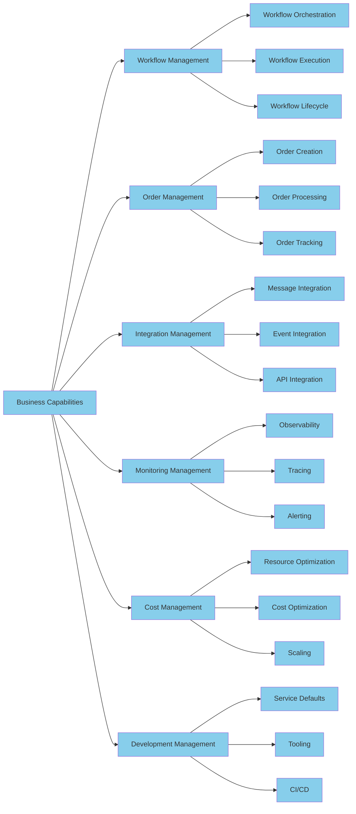

### Value Stream Map

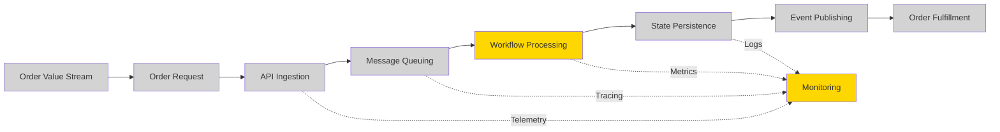

**Note**: Step S4 (Workflow Processing) and MON (Monitoring) are highlighted as key value-creation steps where optimization directly impacts business outcomes and operational costs.

### Process Architecture

**Primary Business Processes:**

1. **Order Lifecycle Management**
   - Order creation via API endpoint
   - Message-based workflow triggering through Service Bus
   - Distributed order processing with state management
   - Order status tracking and customer notification
   - Error handling and retry policies

2. **Monitoring and Observability**
   - Distributed trace collection via OpenTelemetry
   - Metrics aggregation in Application Insights
   - Log centralization in Log Analytics workspace
   - Health check monitoring for service availability
   - Alert generation for SLA violations

3. **Infrastructure Operations**
   - Container deployment to Azure Container Apps
   - Elastic scaling based on workload demands
   - Service discovery and resilience patterns
   - Managed identity authentication
   - Resource lifecycle management

---

## 2. Data Architecture

### Purpose
The Data Architecture layer defines data structures, data flows, master data management patterns, and event-driven data integration required to support workflow orchestration, telemetry collection, and operational analytics. This layer ensures data consistency, traceability, and compliance across distributed systems.

### Key Capabilities
- **Telemetry Data Management**: Collect, aggregate, and store distributed traces, metrics, and logs from all application components
- **Message Data Persistence**: Maintain message payloads and metadata in Service Bus queues with reliability guarantees
- **Workflow State Management**: Track workflow execution state across long-running processes with durability
- **Master Data Synchronization**: [MISSING COMPONENT - No explicit master data hub identified in workspace]
- **Event Data Streaming**: Propagate order events and system events through message-based topology
- **Diagnostic Data Storage**: Archive logs and metrics in storage accounts with lifecycle policies

### Master Data Management (MDM)

**Note**: The current workspace does not implement an explicit Master Data Management hub. Order data is managed within individual services without a central mastering authority. This represents a potential architecture gap for enterprise-scale deployments requiring canonical data models.

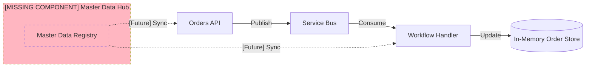

**Gap Analysis**: The workspace implements a distributed data model without centralized master data governance. Future enhancements should consider implementing a canonical order model with bi-directional synchronization patterns.

### Event-Driven Data Topology

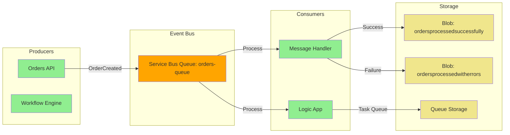

### Monitoring Data Flow

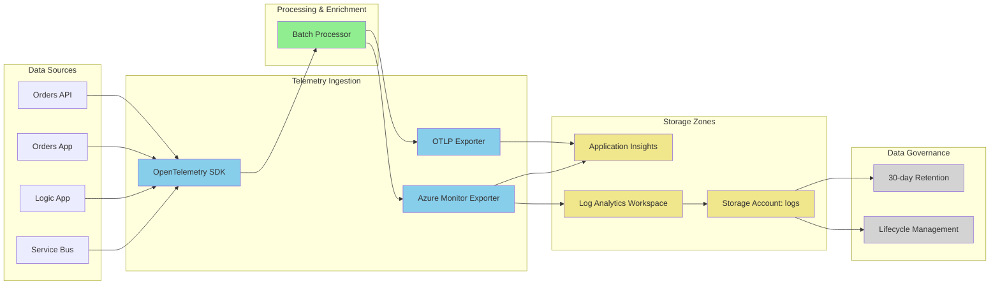

### Data Models

**Core Data Entities:**

1. **Order Entity** (as defined in OrderController.cs):
   - `Id` (string)
   - `CustomerId` (string)
   - `OrderDate` (DateTime)
   - `TotalAmount` (decimal)
   - `Status` (string)

2. **Service Bus Message** (as referenced in OrderMessageHandler.cs):
   - Message Body (byte array)
   - Application Properties (Dictionary)
   - `Diagnostic-Id` (string, for trace context)
   - `traceparent` (string, W3C Trace Context)

3. **Telemetry Data** (as configured in Extensions.cs):
   - Activity/Span data (OpenTelemetry format)
   - Metrics (OpenTelemetry format)
   - Structured logs (OpenTelemetry format)

---

## 3. Application Architecture

### Purpose
The Application Architecture layer defines the logical application components, their interactions, and integration patterns required to deliver workflow orchestration, monitoring, and operational management capabilities. This layer implements microservices patterns, event-driven architecture, and distributed tracing standards.

### Key Capabilities
- **RESTful API Services**: Expose order management operations through HTTP endpoints with OpenAPI documentation
- **Background Message Processing**: Consume and process Service Bus messages asynchronously with distributed tracing
- **Web Application Delivery**: Provide Blazor-based user interface with WebAssembly interactivity
- **Service Orchestration**: Coordinate application services using .NET Aspire with service discovery
- **Distributed Tracing**: Implement W3C Trace Context propagation across all service boundaries
- **Health Monitoring**: Report service health status for container orchestration and load balancing

### Microservices Architecture

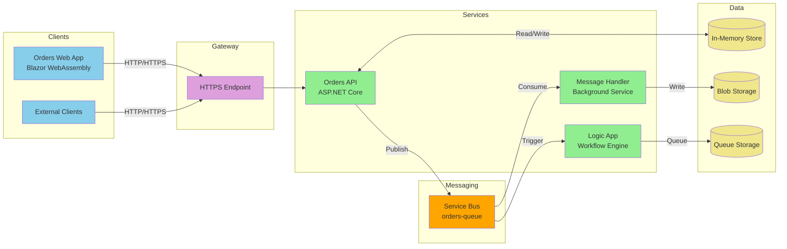

### Event-Driven Architecture (Topology)

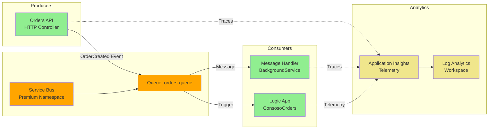

### Event-Driven Architecture (State Transitions)

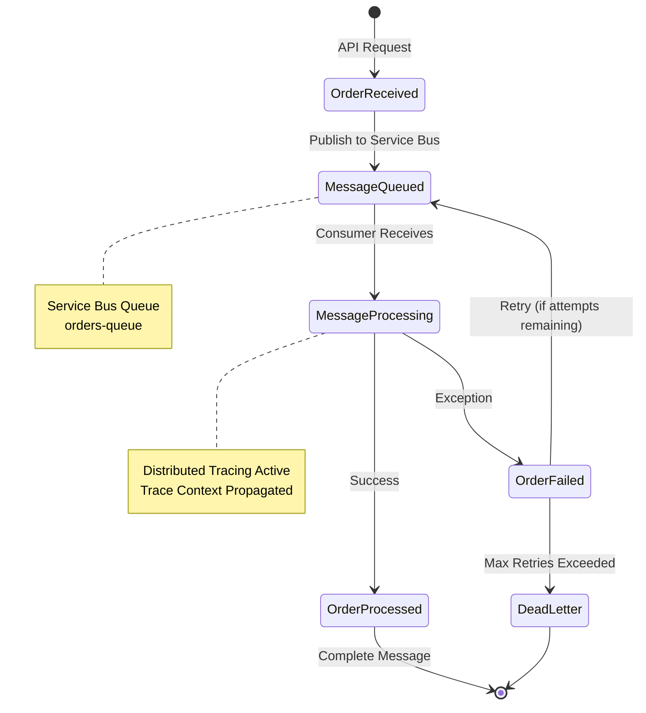

### Application Components

**As explicitly defined in workspace:**

1. **eShop.Orders.API** (eShop.Orders.API):
   - ASP.NET Core 9.0 RESTful API
   - Controllers: `OrdersController`
   - Services: `OrderService`, `OrderMessageHandler`
   - Middleware: `CorrelationIdMiddleware`

2. **eShop.Orders.App** (eShop.Orders.App):
   - Blazor WebAssembly application
   - Server: Program.cs
   - Client: Program.cs

3. **eShopOrders.ServiceDefaults** (eShopOrders.ServiceDefaults):
   - OpenTelemetry configuration: Extensions.cs
   - Health checks implementation
   - Service discovery setup

4. **Logic Apps Workflow** (`LogicAppWP/ConsosoOrders`):
   - Workflow: ConsosoOrders
   - Runtime: Logic Apps Standard on Azure Functions v4

### Integration Patterns

**Service Bus Integration** (as implemented in OrderService.cs):
- Publisher: Orders API publishes messages with trace context
- Consumer: Background service processes messages with context extraction
- Trace Context Propagation: W3C Trace Context via message properties

**HTTP Client Integration** (as configured in Extensions.cs):
- Automatic distributed tracing via `AddHttpClientInstrumentation`
- Standard resilience handler with circuit breaker, retry, timeout policies
- Service discovery integration

---

## 4. Technology Architecture

### Purpose
The Technology Architecture layer defines the infrastructure platforms, deployment models, runtime environments, and operational tooling required to host, operate, and monitor the application architecture. This layer implements cloud-native patterns, container orchestration, serverless computing, and platform engineering practices.

### Key Capabilities
- **Container Hosting**: Deploy and orchestrate containerized services on Azure Container Apps with elastic scaling
- **Serverless Workflow Execution**: Run Logic Apps Standard workflows on Azure Functions v4 runtime
- **Managed Identity Authentication**: Eliminate credential management using Azure AD identity federation
- **Infrastructure as Code**: Provision all Azure resources using Bicep templates with parameterization
- **Observability Platform**: Collect and analyze telemetry using Application Insights and Log Analytics
- **Developer Inner Loop**: Accelerate development with .NET Aspire orchestration and local emulators

### Cloud-Native Architecture

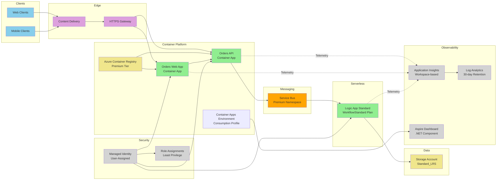

### Container-Based Architecture

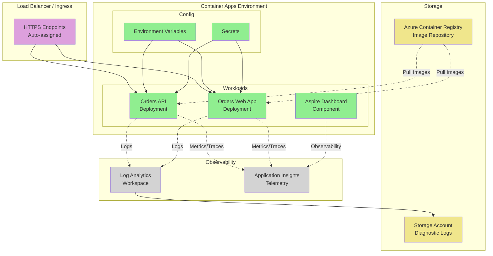

### Serverless Architecture

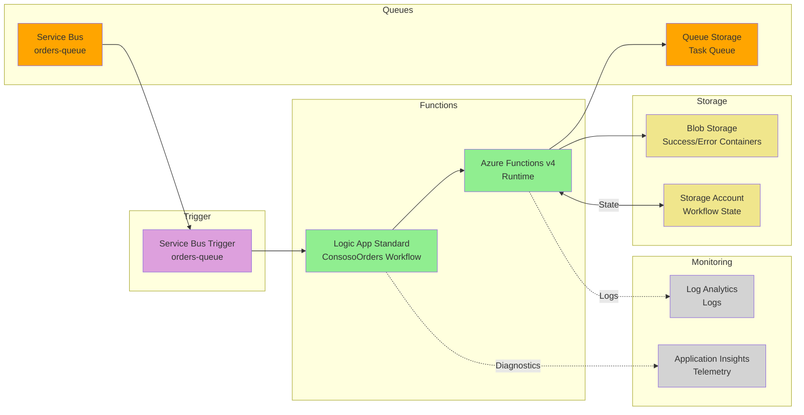

### Platform Engineering Architecture

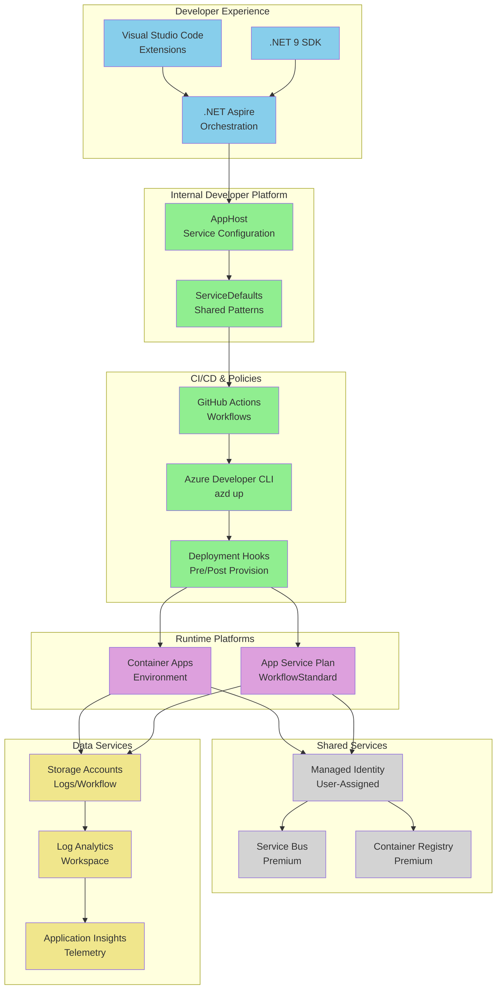

### Infrastructure Components

**As explicitly defined in infra Bicep modules:**

1. **Monitoring Infrastructure** (monitoring):
   - Log Analytics Workspace: 30-day retention, PerGB2018 pricing tier
   - Application Insights: Workspace-based, web application type
   - Storage Account: Diagnostic logs with 30-day lifecycle policy
   - Azure Monitor Health Model: Service group hierarchy

2. **Identity Management** (identity):
   - User-Assigned Managed Identity
   - Role Assignments: Storage Contributor, Metrics Publisher, Service Bus Data Owner, ACR Pull/Push

3. **Messaging Infrastructure** (messaging):
   - Service Bus Premium Namespace: 16 messaging units capacity
   - Queue: `orders-queue`
   - Workflow Storage Account: Standard_LRS with blob containers

4. **Container Services** (services):
   - Azure Container Registry: Premium tier
   - Container Apps Environment: Consumption workload profile
   - Aspire Dashboard: .NET component for observability

5. **Logic Apps** (logic-app.bicep):
   - App Service Plan: WorkflowStandard WS1, 3-20 instances elastic scaling
   - Logic App: Functions v4 runtime, extension bundle v1.x

### Deployment Model

**Infrastructure Provisioning** (as defined in postprovision.ps1):
1. Azure resource deployment via Bicep templates
2. Container Registry authentication
3. Docker image build and push
4. Container Apps deployment
5. Configuration validation

**Application Deployment**:
- Container images built from Dockerfiles in Dockerfile and Dockerfile
- Pushed to Azure Container Registry
- Deployed to Container Apps via Azure Developer CLI

---

## Compliance and Governance

### TOGAF Compliance
This BDAT model adheres to TOGAF 10 Architecture Development Method (ADM) principles:
- **Phase A (Architecture Vision)**: Defined in Business Architecture project overview
- **Phase B (Business Architecture)**: Capability map and value streams documented
- **Phase C (Information Systems Architectures)**: Data and Application architectures detailed with explicit component mapping
- **Phase D (Technology Architecture)**: Cloud-native, container, serverless, and platform patterns implemented
- **Phase E-H**: Implementation governance through IaC, CI/CD, and monitoring

### Architecture Patterns
- **Microservices**: RESTful APIs with independent deployment and scaling
- **Event-Driven**: Asynchronous message processing with Service Bus
- **CQRS**: [MISSING COMPONENT - No explicit command/query separation implemented]
- **Distributed Tracing**: W3C Trace Context propagation across all boundaries
- **Cloud-Native**: Container Apps, Serverless Functions, Managed Services
- **Platform Engineering**: .NET Aspire for developer productivity and golden paths

### Gap Analysis

**Identified Gaps:**
1. **Master Data Management**: No centralized data hub for canonical order models
2. **CQRS Implementation**: Read and write operations use same in-memory store
3. **Event Sourcing**: No append-only event log for state reconstruction
4. **API Gateway**: Direct service exposure without centralized gateway (relying on Container Apps ingress)
5. **Service Mesh**: No explicit service mesh implementation (Container Apps handles service-to-service)

**Recommendations:**
1. Implement canonical data model with Azure SQL Database or Cosmos DB for order persistence
2. Separate read and query models using event sourcing patterns
3. Consider Azure API Management for enterprise API governance
4. Evaluate Dapr integration within Container Apps Environment for service mesh capabilities

---

## Appendix: Technology Stack Reference

**Explicitly Used Technologies (from workspace):**

| Category | Technology | Version | Source |
|----------|-----------|---------|--------|
| Runtime | .NET | 9.0 | eShop.Orders.API.csproj |
| Orchestration | .NET Aspire | Latest | eShopOrders.AppHost.csproj |
| Observability | OpenTelemetry | Latest | Extensions.cs |
| Messaging | Azure Service Bus | Premium | main.bicep |
| Monitoring | Application Insights | Workspace-based | app-insights.bicep |
| Hosting | Azure Container Apps | Consumption | main.bicep |
| Workflows | Logic Apps Standard | Functions v4 | logic-app.bicep |
| Storage | Azure Storage | Standard_LRS | main.bicep |
| IaC | Bicep | Latest | main.bicep |

---

**Document Metadata:**
- **TOGAF Version**: 10
- **Architecture Framework**: TOGAF BDAT Model
- **Solution Version**: 1.0.0
- **Last Updated**: 2025-06-01 (deployment date from Bicep parameters)
- **Architecture Maturity Level**: Level 3 (Defined - standardized processes, reusable components)