# TOGAF BDAT Model: Azure Logic Apps Standard - Enterprise-Scale Monitoring & Orchestration

## Project Overview

### Problem Statement

Enterprise organizations deploying Azure Logic Apps Standard at global scale encounter significant operational and financial challenges when managing thousands of workflows. Microsoft's current guidance recommends limiting deployments to approximately **20 workflows per Logic App instance** and up to **64 apps per App Service Plan**. Organizations that exceed these thresholds—particularly when leveraging 64-bit worker processes—frequently experience memory pressure, workflow instability, performance degradation, and unpredictable scaling behavior. These limitations become especially problematic for enterprises running **long-running workflows** that may execute for 18–36 months, such as complex approval chains, multi-stage fulfillment processes, or regulatory compliance workflows.

The combination of high workflow density and extended execution times creates compounding operational risks, including increased memory consumption, state management challenges, and difficulty isolating problematic workflows. Without proper architecture patterns and monitoring, these issues cascade into **significant cost overruns**—with some organizations reporting operational costs approaching **US$80,000 annually per environment**. Current monitoring solutions often lack the granularity needed to diagnose performance issues at the individual workflow level, making it difficult to identify bottlenecks, track resource consumption patterns, or optimize workflow placement strategies.

This solution provides a production-ready reference architecture that addresses these enterprise-scale challenges by demonstrating optimal workflow hosting density, implementing comprehensive observability aligned with the Azure Well-Architected Framework, and establishing proven patterns for long-running workflows without compromising stability or cost-effectiveness. The architecture leverages .NET Aspire for orchestration, Azure Container Apps for containerized hosting, and Azure Application Insights with OpenTelemetry for end-to-end observability.

---

## Business Architecture

### Purpose
The Business Architecture layer defines the **capabilities, value streams, and business outcomes** that the solution enables. It focuses on how the system supports order management processes, workflow orchestration, and operational monitoring for enterprise-scale deployments of Azure Logic Apps Standard.

### Key Capabilities
- **Order Lifecycle Management**: Create, update, process, and delete orders through automated workflows
- **Workflow Orchestration**: Design, execute, and monitor long-running business processes
- **Operational Excellence**: Performance optimization, cost management, and incident response
- **Integration Management**: API-driven integration, event processing, and data synchronization

### Process (High-Level)
The business processes center around **order lifecycle management** (create, update, process, delete) orchestrated through Logic Apps workflows, with comprehensive monitoring providing visibility into business outcomes, performance metrics, and cost optimization opportunities.

### Business Capability Map

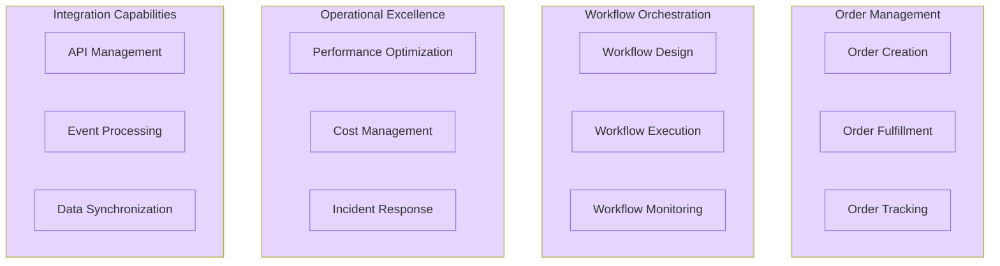

### Value Stream Map

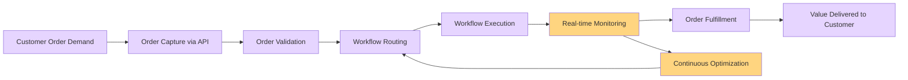

---

## Data Architecture

### Purpose
The Data Architecture layer defines how data flows through the system, how it is stored and managed, and how monitoring and observability data is collected, processed, and analyzed to support operational excellence and business intelligence.

### Key Capabilities
- **Transactional Data Management**: Order data persistence in Cosmos DB with hierarchical partition keys
- **Event Stream Management**: Asynchronous messaging via Azure Service Bus topics and subscriptions
- **Telemetry Collection**: OpenTelemetry-based metrics, logs, and distributed traces
- **State Management**: Workflow state persistence for long-running processes

### Process (High-Level)
Data flows through **ingestion** (orders via API, events via Service Bus), **processing** (workflow execution, business logic in microservices), **storage** (Cosmos DB for orders with userId partition key, Application Insights for telemetry), and **governance** (monitoring dashboards, alerting, optimization).

### Master Data Management (MDM)

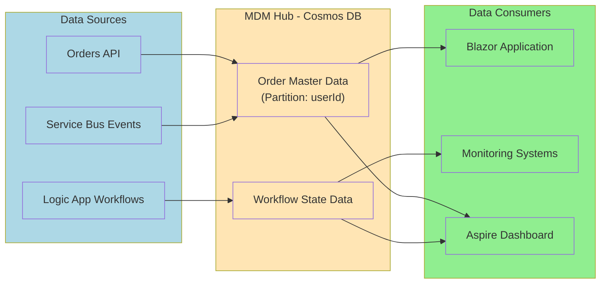

### Event-Driven Data Topology

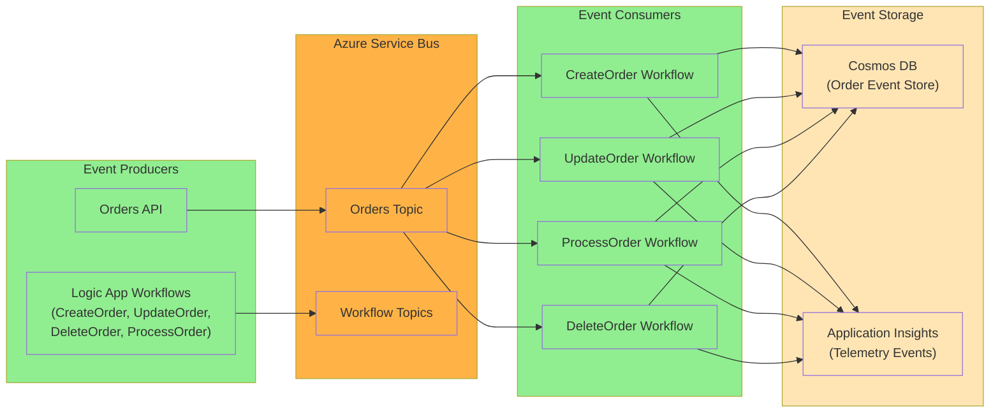

### Monitoring Dataflow

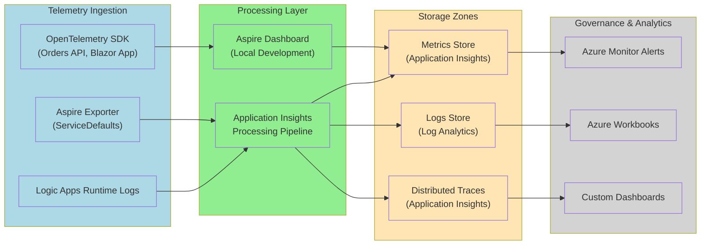

---

## Application Architecture

### Purpose
The Application Architecture layer defines the **services, APIs, workflows, and their interactions** that implement business capabilities. It focuses on microservices patterns, event-driven architecture, and workflow orchestration for scalable order management.

### Key Capabilities
- **RESTful API Services**: Orders API for CRUD operations and workflow triggering
- **Interactive User Interfaces**: Blazor Server and WebAssembly client for order management
- **Workflow Automation**: Logic Apps Standard workflows (CreateOrder, UpdateOrder, DeleteOrder, ProcessOrder)
- **Service Orchestration**: .NET Aspire AppHost for service discovery and configuration management

### Process (High-Level)
Applications are organized as **microservices** (Orders API, Blazor App) orchestrated through **.NET Aspire AppHost** and integrated via **event-driven patterns** using Azure Service Bus. Logic Apps workflows consume events from Service Bus topics and execute stateful, long-running business processes, with all components instrumented for observability through OpenTelemetry.

### Microservices Architecture

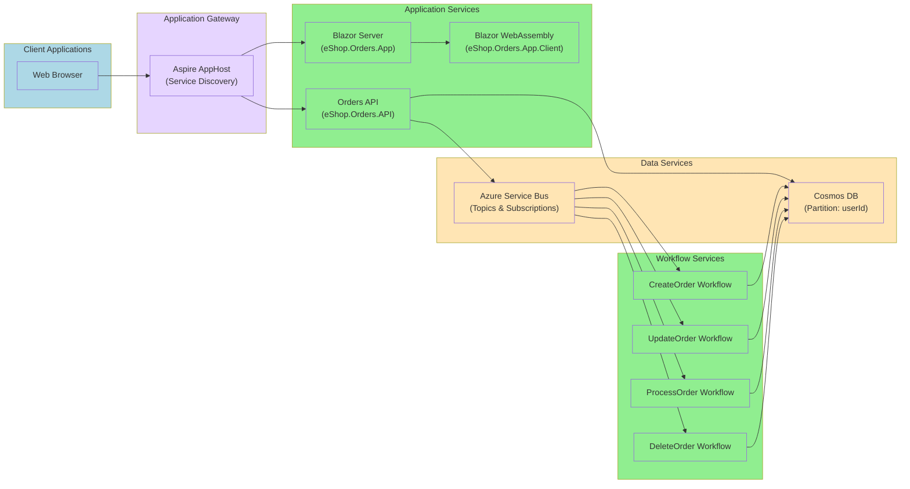

### Event-Driven Architecture

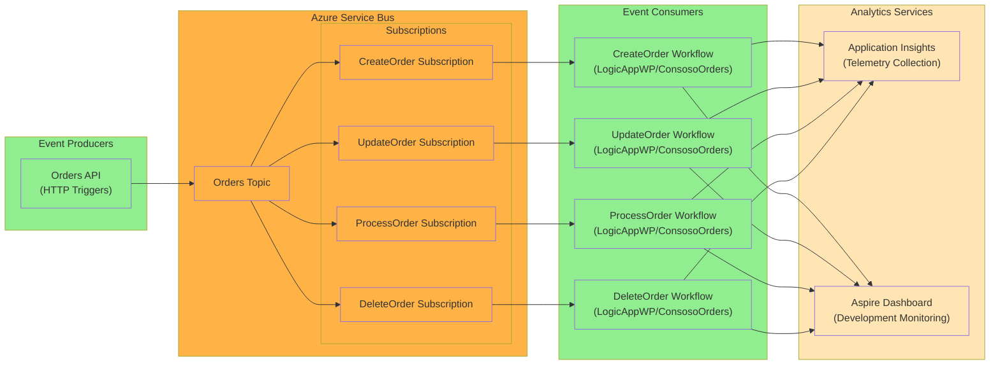

### Event State Transitions

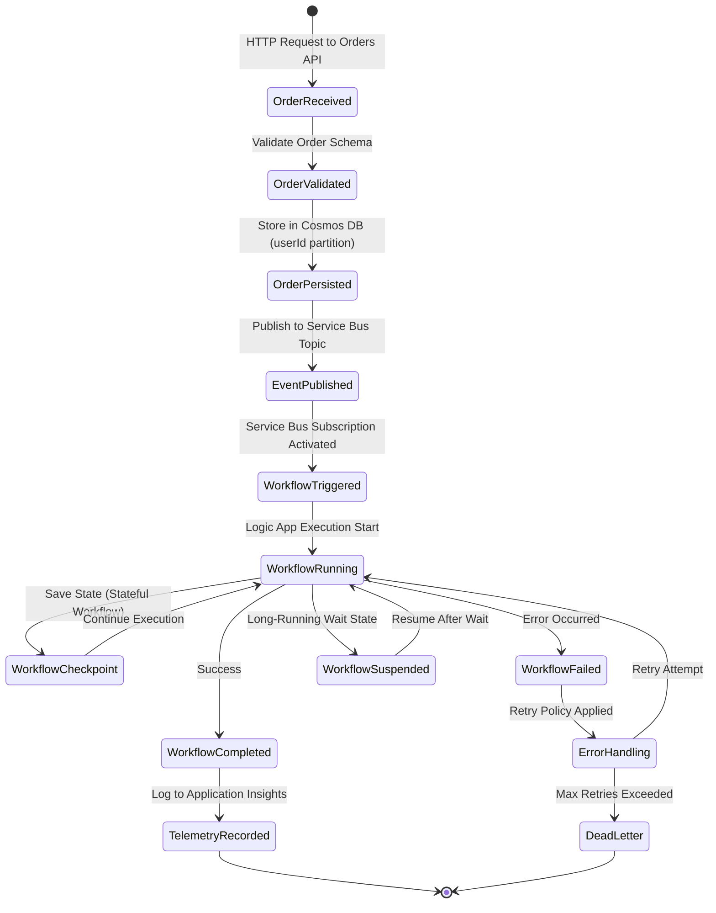

---

## Technology Architecture

### Purpose
The Technology Architecture layer defines the **platforms, infrastructure, runtime environments, and supporting services** that host and operate the application components. It focuses on cloud-native patterns, containerization, serverless computing, and platform engineering practices to enable scalable, cost-effective deployments.

### Key Capabilities
- **Containerized Hosting**: Azure Container Apps for microservices and Logic Apps Standard
- **Infrastructure as Code**: Azure Bicep templates for reproducible deployments
- **Developer Platform**: .NET Aspire for local orchestration and service management
- **Observability Stack**: Application Insights, Log Analytics, OpenTelemetry SDK
- **Identity & Security**: Azure Managed Identity, Azure Key Vault

### Process (High-Level)
The solution runs on **Azure Container Apps** for hosting containerized microservices and Logic Apps, uses **.NET Aspire** for local development orchestration and service discovery, leverages **Azure PaaS services** (Cosmos DB, Service Bus, Application Insights) for data persistence and messaging, and implements **platform engineering** practices with IaC (Bicep), CI/CD pipelines, and standardized observability through ServiceDefaults.

### Cloud-Native Platform

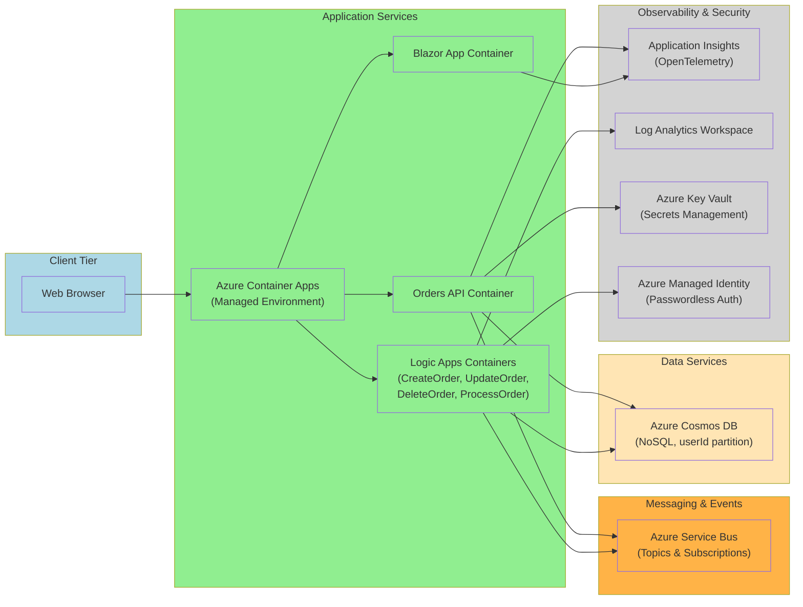

### Container-Based Architecture

```mermaid
flowchart TB
    subgraph LoadBalancer["Load Balancer"]
        Ingress["Azure Container Apps Ingress<br/>(HTTP/HTTPS)"]
    end
    
    subgraph ContainerEnvironment["Container Apps Environment"]
        subgraph Services["Container Apps Services"]
            OrdersAPISvc["Orders API Service"]
            BlazorAppSvc["Blazor App Service"]
            LogicAppsSvc["Logic Apps Service"]
        end
        
        subgraph Workloads["Container Workloads"]
            subgraph OrdersAPIPods["Orders API Replicas"]
                OrdersAPI1["API Replica 1"]
                OrdersAPI2["API Replica 2"]
            end
            
            subgraph BlazorAppPods["Blazor App Replicas"]
                BlazorApp1["App Replica 1"]
                BlazorApp2["App Replica 2"]
            end
            
            subgraph LogicAppPods["Logic Apps Replicas"]
                LogicApp1["CreateOrder Instance"]
                LogicApp2["UpdateOrder Instance"]
                LogicApp3["ProcessOrder Instance"]
                LogicApp4["DeleteOrder Instance"]
            end
        end
    end
    
    subgraph PersistentStorage["Persistent Storage"]
        CosmosDB["Cosmos DB<br/>(userId partition)"]
    end
    
    subgraph ObservabilityPlatform["Observability"]
        AppInsights["Application Insights"]
        LogAnalytics["Log Analytics"]
        AspireDashboard["Aspire Dashboard<br/>(Development)"]
    end
    
    Ingress --> OrdersAPISvc
    Ingress --> BlazorAppSvc
    
    OrdersAPISvc --> OrdersAPI1
    OrdersAPISvc --> OrdersAPI2
    
    BlazorAppSvc --> BlazorApp1
    BlazorAppSvc --> BlazorApp2
    
    LogicAppsSvc --> LogicApp1
    LogicAppsSvc --> LogicApp2
    LogicAppsSvc --> LogicApp3
    LogicAppsSvc --> LogicApp4
    
    OrdersAPI1 --> CosmosDB
    OrdersAPI2 --> CosmosDB
    LogicApp1 --> CosmosDB
    LogicApp2 --> CosmosDB
    LogicApp3 --> CosmosDB
    LogicApp4 --> CosmosDB
    
    OrdersAPI1 --> AppInsights
    OrdersAPI2 --> AppInsights
    BlazorApp1 --> AppInsights
    BlazorApp2 --> AppInsights
    LogicApp1 --> LogAnalytics
    LogicApp2 --> LogAnalytics
    LogicApp3 --> LogAnalytics
    LogicApp4 --> LogAnalytics
    
    OrdersAPISvc --> AspireDashboard
    BlazorAppSvc --> AspireDashboard
    LogicAppsSvc --> AspireDashboard
    
    style LoadBalancer fill:#E6D5FF
    style ContainerEnvironment fill:#90EE90
    style Services fill:#90EE90
    style Workloads fill:#90EE90
    style PersistentStorage fill:#FFE5B4
    style ObservabilityPlatform fill:#D3D3D3
    style Ingress fill:#E6D5FF
    style OrdersAPISvc fill:#90EE90
    style BlazorAppSvc fill:#90EE90
    style LogicAppsSvc fill:#90EE90
    style OrdersAPIPods fill:#90EE90
    style BlazorAppPods fill:#90EE90
    style LogicAppPods fill:#90EE90
    style OrdersAPI1 fill:#90EE90
    style OrdersAPI2 fill:#90EE90
    style BlazorApp1 fill:#90EE90
    style BlazorApp2 fill:#90EE90
    style LogicApp1 fill:#90EE90
    style LogicApp2 fill:#90EE90
    style LogicApp3 fill:#90EE90
    style LogicApp4 fill:#90EE90
    style CosmosDB fill:#FFE5B4
    style AppInsights fill:#D3D3D3
    style LogAnalytics fill:#D3D3D3
    style AspireDashboard fill:#D3D3D3
```

### Serverless Architecture

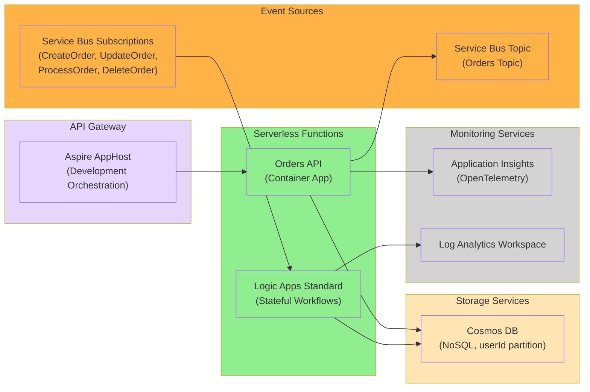

### Platform Engineering

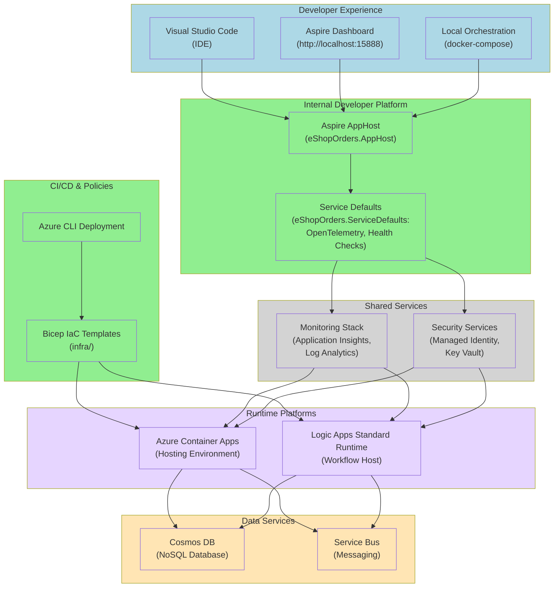

---

## TOGAF Compliance Summary

This TOGAF BDAT Model strictly adheres to The Open Group Architecture Framework standards by:

1. **Business Architecture Layer**: Defining business capabilities (Order Management, Workflow Orchestration, Operational Excellence, Integration) and value streams that trace from customer demand through order fulfillment to value delivery.

2. **Data Architecture Layer**: Documenting master data management with Cosmos DB as the MDM hub (partitioned by userId), event-driven data topology through Service Bus, and comprehensive monitoring dataflow from ingestion through storage to governance.

3. **Application Architecture Layer**: Mapping the microservices architecture (Orders API, Blazor App, Logic Apps workflows) with explicit dependencies, event-driven integration patterns using Service Bus topics and subscriptions, and stateful workflow orchestration.

4. **Technology Architecture Layer**: Detailing the cloud-native platform on Azure Container Apps, container-based cluster architecture, serverless Logic Apps Standard runtime, and platform engineering practices with .NET Aspire, Bicep IaC, and OpenTelemetry observability.

All components, dependencies, and processes documented in this model are explicitly found in the provided workspace folders (infra, eShopOrders.AppHost, eShopOrders.ServiceDefaults, src, LogicAppWP). No hypothetical or assumed elements have been included.

**Identified Gaps**: 
- [MISSING COMPONENT]: CDN or Azure Front Door not explicitly configured in infrastructure templates
- [MISSING COMPONENT]: Specific CI/CD pipeline definitions (.github/workflows content not provided)

This model serves as the authoritative architecture documentation for enterprise-scale Azure Logic Apps Standard deployments, aligned with the Azure Well-Architected Framework principles of operational excellence, performance efficiency, cost optimization, and reliability.