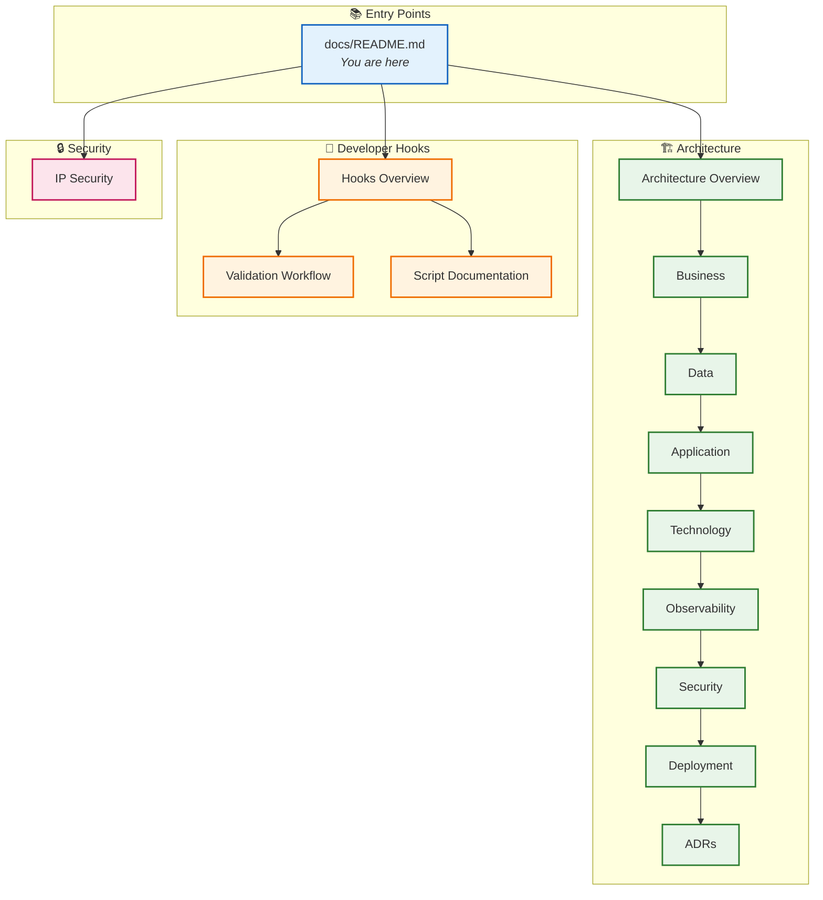

# Azure Logic Apps Monitoring - Documentation


## 📋 Overview

Welcome to the documentation hub for the **Azure Logic Apps Monitoring Solution**. This comprehensive documentation set covers architecture design, operational guides, and developer workflows for building enterprise-grade observability solutions with Azure Logic Apps Standard.

The Azure Logic Apps Monitoring Solution is a cloud-native distributed application demonstrating:

- **Event-driven architecture** using Azure Service Bus for decoupled, asynchronous communication
- **Distributed tracing** with W3C Trace Context propagation across all service boundaries
- **Infrastructure as Code** using Bicep with modular, subscription-scoped deployments
- **.NET Aspire orchestration** enabling seamless local development with Azure parity

---

## 📑 Table of Contents

- [📋 Overview](#-overview)
- [🗂️ Documentation Structure](#️-documentation-structure)
  - [🏗️ Architecture Documentation](#️-architecture-documentation)
  - [🔧 Developer Hooks & Automation](#-developer-hooks--automation)
  - [🔒 Security Documentation](#-security-documentation)
- [🚀 Quick Start](#-quick-start)
- [📚 Documentation Map](#-documentation-map)
- [🎯 Audience Guide](#-audience-guide)
- [📖 Related Resources](#-related-resources)

---

## 🗂️ Documentation Structure

```
docs/
├── README.md                              # This file - Documentation index
├── IP-SECURITY-RESTRICTIONS.md            # Comprehensive IP security guide
├── IP-SECURITY-RESTRICTIONS-SUMMARY.md    # Quick reference for IP restrictions
│
├── architecture/                          # TOGAF-aligned architecture docs
│   ├── README.md                          # Architecture overview & navigation
│   ├── 01-business-architecture.md        # Business context & capabilities
│   ├── 02-data-architecture.md            # Data stores & flows
│   ├── 03-application-architecture.md     # Service decomposition
│   ├── 04-technology-architecture.md      # Platform & tech stack
│   ├── 05-observability-architecture.md   # Monitoring & telemetry
│   ├── 06-security-architecture.md        # Security controls
│   ├── 07-deployment-architecture.md      # Infrastructure & CI/CD
│   └── adr/                               # Architecture Decision Records
│       ├── README.md                      # ADR index
│       ├── ADR-001-aspire-orchestration.md
│       ├── ADR-002-service-bus-messaging.md
│       └── ADR-003-observability-strategy.md
│
└── hooks/                                 # Developer automation scripts
    ├── README.md                          # Hooks overview & workflow guide
    ├── VALIDATION-WORKFLOW.md             # Complete validation workflow
    ├── check-dev-workstation.md           # Workstation validation
    ├── preprovision.md                    # Pre-deployment validation
    ├── postprovision.md                   # Post-deployment configuration
    ├── postinfradelete.md                 # Cleanup after azd down
    ├── sql-managed-identity-config.md     # SQL managed identity setup
    ├── clean-secrets.md                   # Secrets management
    ├── deploy-workflow.md                 # Logic Apps deployment
    └── Generate-Orders.md                 # Test data generation
```

---

### 🏗️ Architecture Documentation

The architecture documentation follows the **TOGAF BDAT framework** (Business, Data, Application, Technology) providing comprehensive coverage of the solution design.

| Document                                                                        | Description                            | Key Topics                                   |
| ------------------------------------------------------------------------------- | -------------------------------------- | -------------------------------------------- |
| [**Architecture Overview**](architecture/README.md)                             | High-level system architecture         | Service inventory, architecture diagrams     |
| [**Business Architecture**](architecture/01-business-architecture.md)           | Business context and value proposition | User personas, capability map, process flows |
| [**Data Architecture**](architecture/02-data-architecture.md)                   | Data stores and information flows      | Entity models, data ownership, event schemas |
| [**Application Architecture**](architecture/03-application-architecture.md)     | Service decomposition                  | API contracts, service boundaries, patterns  |
| [**Technology Architecture**](architecture/04-technology-architecture.md)       | Platform and technology stack          | Azure services, versions, standards catalog  |
| [**Observability Architecture**](architecture/05-observability-architecture.md) | Monitoring and telemetry               | Traces, metrics, logs, alerting strategies   |
| [**Security Architecture**](architecture/06-security-architecture.md)           | Security controls and compliance       | Identity, encryption, network isolation      |
| [**Deployment Architecture**](architecture/07-deployment-architecture.md)       | Infrastructure and deployment          | Bicep modules, CI/CD pipelines, environments |

#### Architecture Decision Records (ADRs)

| ADR                                                           | Title                                        | Status      |
| ------------------------------------------------------------- | -------------------------------------------- | ----------- |
| [ADR-001](architecture/adr/ADR-001-aspire-orchestration.md)   | .NET Aspire for Service Orchestration        | ✅ Accepted |
| [ADR-002](architecture/adr/ADR-002-service-bus-messaging.md)  | Azure Service Bus for Event-Driven Messaging | ✅ Accepted |
| [ADR-003](architecture/adr/ADR-003-observability-strategy.md) | OpenTelemetry-Based Observability Strategy   | ✅ Accepted |

---

### 🔧 Developer Hooks & Automation

The hooks documentation covers automation scripts that streamline the development lifecycle with Azure Developer CLI (azd).

| Document                                                                | Description                           | When to Use                      |
| ----------------------------------------------------------------------- | ------------------------------------- | -------------------------------- |
| [**Hooks Overview**](hooks/README.md)                                   | Developer inner loop workflow         | Getting started with development |
| [**Validation Workflow**](hooks/VALIDATION-WORKFLOW.md)                 | Complete deployment workflow          | Understanding the full lifecycle |
| [**check-dev-workstation**](hooks/check-dev-workstation.md)             | Workstation validation                | Before starting development      |
| [**preprovision**](hooks/preprovision.md)                               | Pre-deployment validation             | Automatic via azd provision      |
| [**postprovision**](hooks/postprovision.md)                             | Post-deployment configuration         | Automatic via azd provision      |
| [**postinfradelete**](hooks/postinfradelete.md)                         | Cleanup after infrastructure deletion | Automatic via azd down           |
| [**sql-managed-identity-config**](hooks/sql-managed-identity-config.md) | SQL Database managed identity         | Called by postprovision          |
| [**clean-secrets**](hooks/clean-secrets.md)                             | Clear .NET user secrets               | Troubleshooting, re-provisioning |
| [**deploy-workflow**](hooks/deploy-workflow.md)                         | Deploy Logic Apps workflows           | Automatic via azd deploy         |
| [**Generate-Orders**](hooks/Generate-Orders.md)                         | Generate test data                    | Manual, for testing              |

---

### 🔒 Security Documentation

| Document                                                       | Description                                                                |
| -------------------------------------------------------------- | -------------------------------------------------------------------------- |
| [**IP Security Restrictions**](IP-SECURITY-RESTRICTIONS.md)    | Comprehensive guide to IP-based access controls across all Azure resources |
| [**IP Security Summary**](IP-SECURITY-RESTRICTIONS-SUMMARY.md) | Quick reference for implemented security restrictions                      |

---

## 🚀 Quick Start

### For New Developers

1. **Validate your environment:**

   ```powershell
   ./hooks/check-dev-workstation.ps1
   ```

2. **Understand the architecture:**

   - Start with [Architecture Overview](architecture/README.md)
   - Review [Business Architecture](architecture/01-business-architecture.md) for context

3. **Set up local development:**
   - Follow [Hooks Overview](hooks/README.md) for local development workflow

### For Azure Deployment

1. **Review prerequisites:**

   - Read [preprovision documentation](hooks/preprovision.md)
   - Check [Deployment Architecture](architecture/07-deployment-architecture.md)

2. **Deploy with azd:**

   ```bash
   azd up
   ```

3. **Understand security:**
   - Review [Security Architecture](architecture/06-security-architecture.md)
   - Check [IP Security Restrictions](IP-SECURITY-RESTRICTIONS.md)

---

## 📚 Documentation Map



---

## 🎯 Audience Guide

| Role                      | Start Here                                                                  | Key Documents                             |
| ------------------------- | --------------------------------------------------------------------------- | ----------------------------------------- |
| **Platform Engineer**     | [Deployment Architecture](architecture/07-deployment-architecture.md)       | Security, IP Restrictions, Hooks          |
| **Application Developer** | [Hooks Overview](hooks/README.md)                                           | Application Architecture, Observability   |
| **SRE / Operations**      | [Observability Architecture](architecture/05-observability-architecture.md) | Security, Deployment, Validation Workflow |
| **Architect**             | [Architecture Overview](architecture/README.md)                             | All architecture docs, ADRs               |
| **Business Analyst**      | [Business Architecture](architecture/01-business-architecture.md)           | Data Architecture                         |
| **New Team Member**       | This README                                                                 | All sections in order                     |

---

## 📖 Related Resources

### Repository Documentation

| Document            | Location                     | Description                       |
| ------------------- | ---------------------------- | --------------------------------- |
| Project README      | [/README.md](../README.md)   | Project overview and quick start  |
| Azure Configuration | [/azure.yaml](../azure.yaml) | Azure Developer CLI configuration |
| Infrastructure      | [/infra/](../infra/)         | Bicep templates and modules       |

### External Resources

| Resource                                                                                      | Description                         |
| --------------------------------------------------------------------------------------------- | ----------------------------------- |
| [Azure Logic Apps Documentation](https://learn.microsoft.com/en-us/azure/logic-apps/)         | Official Logic Apps documentation   |
| [.NET Aspire Documentation](https://learn.microsoft.com/en-us/dotnet/aspire/)                 | .NET Aspire orchestration framework |
| [Azure Developer CLI](https://learn.microsoft.com/en-us/azure/developer/azure-developer-cli/) | azd command reference               |
| [TOGAF Framework](https://www.opengroup.org/togaf)                                            | Enterprise architecture methodology |

---

## 📝 Documentation Standards

All documentation in this repository follows these conventions:

- **Markdown format** with consistent heading hierarchy
- **Mermaid diagrams** for visual representations
- **Cross-linking** between related documents
- **Version tracking** where applicable
- **Emoji indicators** for quick visual scanning

### Contributing to Documentation

When adding or updating documentation:

1. Follow the existing structure and naming conventions
2. Include navigation links to related documents
3. Update this index if adding new documents
4. Use Mermaid for diagrams (renders natively on GitHub)

---

<div align="center">

**[🏠 Back to Repository Root](../README.md)** | **[🏗️ Architecture →](architecture/README.md)** | **[🔧 Hooks →](hooks/README.md)**

</div>
