# Azure Logic Apps Monitoring Solution - Documentation


---

## 📑 Table of Contents

- [📋 Overview](#-overview)
- [📁 Documentation Structure](#-documentation-structure)
- [🏗️ Architecture Documentation](#️-architecture-documentation)
- [🔄 DevOps Documentation](#-devops-documentation)
- [🪝 Developer Hooks Documentation](#-developer-hooks-documentation)
- [🔒 Security Documentation](#-security-documentation)
- [🚀 Quick Start](#-quick-start)
- [📊 Solution Architecture Overview](#-solution-architecture-overview)
- [📖 Additional Resources](#-additional-resources)
- [📝 Contributing](#-contributing)
- [📄 License](#-license)

---

## 📋 Overview

This folder contains comprehensive documentation for the **Azure Logic Apps Monitoring Solution** — a cloud-native reference architecture demonstrating enterprise-grade observability patterns for Azure Logic Apps Standard workflows. Built on **.NET Aspire** orchestration, this solution showcases end-to-end distributed tracing, centralized logging, and comprehensive metrics collection across a microservices-based order management system.

### ✨ Key Highlights

- **Unified Observability**: OpenTelemetry-based instrumentation with W3C Trace Context propagation
- **Event-Driven Architecture**: Azure Service Bus for reliable, asynchronous order event processing
- **Infrastructure as Code**: Bicep templates with Azure Developer CLI (`azd`) for repeatable deployments
- **Zero-Secret Authentication**: Managed Identity for all service-to-service communication

---

## 📁 Documentation Structure

| Folder/File                                                                | Description                                                                      |
| -------------------------------------------------------------------------- | -------------------------------------------------------------------------------- |
| [architecture/](architecture/README.md)                                    | Complete architecture documentation following enterprise architecture principles |
| [devops/](devops/README.md)                                                | CI/CD pipelines and DevOps practices documentation                               |
| [hooks/](hooks/README.md)                                                  | Developer inner loop workflow and automation scripts documentation               |
| [IP-SECURITY-RESTRICTIONS.md](IP-SECURITY-RESTRICTIONS.md)                 | Detailed IP security restrictions configuration guide                            |
| [IP-SECURITY-RESTRICTIONS-SUMMARY.md](IP-SECURITY-RESTRICTIONS-SUMMARY.md) | Quick reference for IP security restrictions                                     |
| [planoProjetoModernizacao.md](planoProjetoModernizacao.md)                 | Project modernization plan (Portuguese)                                          |

---

## 🏗️ Architecture Documentation

The [architecture/](architecture/README.md) folder contains detailed documentation covering all aspects of the solution architecture:

| Document                                                                          | Description                                                          |
| --------------------------------------------------------------------------------- | -------------------------------------------------------------------- |
| [01-business-architecture.md](architecture/01-business-architecture.md)           | Business context, capabilities, stakeholders, and value streams      |
| [02-data-architecture.md](architecture/02-data-architecture.md)                   | Data stores, domains, flows, and telemetry mapping                   |
| [03-application-architecture.md](architecture/03-application-architecture.md)     | Service catalog, API contracts, and service interactions             |
| [04-technology-architecture.md](architecture/04-technology-architecture.md)       | Platform services, technology standards, and Azure resource topology |
| [05-observability-architecture.md](architecture/05-observability-architecture.md) | Distributed tracing, metrics, logs, and alerting strategies          |
| [06-security-architecture.md](architecture/06-security-architecture.md)           | Authentication, authorization, network security, and compliance      |
| [07-deployment-architecture.md](architecture/07-deployment-architecture.md)       | Infrastructure as Code, CI/CD, and environment management            |
| [adr/](architecture/adr/README.md)                                                | Architecture Decision Records (ADRs)                                 |

### 📋 Architecture Decision Records

| ADR                                                           | Title                                 | Status   |
| ------------------------------------------------------------- | ------------------------------------- | -------- |
| [ADR-001](architecture/adr/ADR-001-aspire-orchestration.md)   | .NET Aspire for Service Orchestration | Accepted |
| [ADR-002](architecture/adr/ADR-002-service-bus-messaging.md)  | Azure Service Bus for Async Messaging | Accepted |
| [ADR-003](architecture/adr/ADR-003-observability-strategy.md) | OpenTelemetry with Azure Monitor      | Accepted |

---

## 🔄 DevOps Documentation

The [devops/](devops/README.md) folder contains CI/CD pipeline documentation:

| Document                                              | Description                                                              |
| ----------------------------------------------------- | ------------------------------------------------------------------------ |
| [azure-dev-workflow.md](devops/azure-dev-workflow.md) | CI/CD pipeline for provisioning and deployment using Azure Developer CLI |
| [ci-workflow.md](devops/ci-workflow.md)               | Build validation pipeline for pull requests                              |

### 🔐 Pipeline Security Features

- **OIDC Authentication**: Passwordless Azure auth via federated credentials
- **Least-Privilege Permissions**: Only required GitHub token permissions
- **Environment Protection**: GitHub Environments with approval workflows
- **Concurrency Control**: Prevents race conditions in deployments

---

## 🪝 Developer Hooks Documentation

The [hooks/](hooks/README.md) folder documents automation scripts for the development lifecycle:

| Script                        | Purpose                                        | Documentation                                   |
| ----------------------------- | ---------------------------------------------- | ----------------------------------------------- |
| `check-dev-workstation`       | Validate workstation prerequisites             | [📄 Docs](hooks/check-dev-workstation.md)       |
| `preprovision`                | Validate and prepare for deployment            | [📄 Docs](hooks/preprovision.md)                |
| `postprovision`               | Configure secrets after deployment             | [📄 Docs](hooks/postprovision.md)               |
| `sql-managed-identity-config` | Configure SQL Database managed identity access | [📄 Docs](hooks/sql-managed-identity-config.md) |
| `clean-secrets`               | Clear .NET user secrets                        | [📄 Docs](hooks/clean-secrets.md)               |
| `Generate-Orders`             | Generate sample order data                     | [📄 Docs](hooks/Generate-Orders.md)             |
| `deploy-workflow`             | Deploy Logic Apps Standard workflows           | [📄 Docs](hooks/deploy-workflow.md)             |
| `postinfradelete`             | Purge soft-deleted Logic Apps after `azd down` | [📄 Docs](hooks/postinfradelete.md)             |

All scripts support **cross-platform execution** with dual implementations in PowerShell (`.ps1`) and Bash (`.sh`).

---

## 🔒 Security Documentation

### 🛡️ IP Security Restrictions

| Document                                                                   | Description                                                              |
| -------------------------------------------------------------------------- | ------------------------------------------------------------------------ |
| [IP-SECURITY-RESTRICTIONS.md](IP-SECURITY-RESTRICTIONS.md)                 | Comprehensive guide for IP restrictions across all Azure resources       |
| [IP-SECURITY-RESTRICTIONS-SUMMARY.md](IP-SECURITY-RESTRICTIONS-SUMMARY.md) | Quick reference with default security posture and configuration examples |

### ⚙️ Default Security Posture

| Resource Type      | Default Action | Azure Services | VNet Access       |
| ------------------ | -------------- | -------------- | ----------------- |
| Container Apps     | Allow VNet     | Allowed        | 10.0.0.0/16       |
| Logic Apps         | Deny           | Allowed        | 10.0.0.0/16       |
| Container Registry | Deny           | Bypass         | Not Configured    |
| SQL Database       | Allow Azure    | Allowed        | Template Provided |
| Storage Account    | Deny           | Bypass         | Template Provided |

---

## 🚀 Quick Start

### 📦 Prerequisites

| Component            | Version   | Purpose                   |
| -------------------- | --------- | ------------------------- |
| .NET SDK             | 10.0+     | Application runtime       |
| Docker Desktop       | Latest    | Container orchestration   |
| .NET Aspire Workload | 9.5+      | Aspire orchestration      |
| Azure Developer CLI  | >= 1.11.0 | Unified deployment        |
| Azure CLI            | Latest    | Azure resource management |

### 🖥️ Development Modes

| Mode                  | Database             | Service Bus          | Monitoring           | Setup Time |
| --------------------- | -------------------- | -------------------- | -------------------- | ---------- |
| **Local Development** | SQL Server container | Service Bus emulator | Aspire Dashboard     | ~1 min     |
| **Azure Deployment**  | Azure SQL Database   | Azure Service Bus    | Application Insights | ~10 min    |

### 🎯 Getting Started

1. **Check prerequisites**: Run `hooks/check-dev-workstation.ps1` (Windows) or `hooks/check-dev-workstation.sh` (Linux/macOS)

2. **Local development**: Start with **.NET Aspire** using:

   ```bash
   dotnet run --project app.AppHost
   ```

3. **Azure deployment**: Use `azd up` for full infrastructure provisioning and deployment

> 📖 For detailed instructions, see the [Developer Inner Loop Workflow](hooks/README.md).

---

## 📊 Solution Architecture Overview

```mermaid
---
title: Solution Architecture Overview
---
flowchart TD
    %% ===== STYLE DEFINITIONS =====
    classDef primary fill:#4F46E5,stroke:#3730A3,color:#FFFFFF
    classDef secondary fill:#10B981,stroke:#059669,color:#FFFFFF
    classDef datastore fill:#F59E0B,stroke:#D97706,color:#000000
    classDef external fill:#6B7280,stroke:#4B5563,color:#FFFFFF,stroke-dasharray: 5 5
    classDef failed fill:#F44336,stroke:#C62828,color:#FFFFFF
    classDef trigger fill:#818CF8,stroke:#4F46E5,color:#FFFFFF
    classDef decision fill:#FFFBEB,stroke:#F59E0B,color:#000000
    classDef input fill:#F3F4F6,stroke:#6B7280,color:#000000

    %% ===== PRESENTATION LAYER =====
    subgraph Presentation["🖥️ Presentation Layer"]
        WebApp["🌐 eShop.Web.App<br/>Blazor Server"]
    end
    style Presentation fill:#EEF2FF,stroke:#4F46E5,stroke-width:2px,color:#1E1B4B

    %% ===== APPLICATION LAYER =====
    subgraph Application["⚙️ Application Layer"]
        OrdersAPI["📡 eShop.Orders.API<br/>ASP.NET Core"]
        LogicApp["🔄 OrdersManagement<br/>Logic Apps Standard"]
    end
    style Application fill:#ECFDF5,stroke:#10B981,stroke-width:2px,color:#064E3B

    %% ===== PLATFORM LAYER =====
    subgraph Platform["🏗️ Platform Layer"]
        AspireHost["🎯 app.AppHost<br/>.NET Aspire"]
        ServiceDefaults["📦 app.ServiceDefaults<br/>Cross-cutting Concerns"]
    end
    style Platform fill:#FFFBEB,stroke:#F59E0B,stroke-width:2px,color:#78350F

    %% ===== DATA LAYER =====
    subgraph DataLayer["💾 Data Layer"]
        SqlDb[("🗄️ Azure SQL<br/>OrderDb")]
        ServiceBus["📨 Azure Service Bus<br/>ordersplaced topic"]
        BlobStorage["📁 Azure Storage<br/>Workflow State"]
    end
    style DataLayer fill:#FAF5FF,stroke:#A855F7,stroke-width:2px,color:#4C1D95

    %% ===== OBSERVABILITY LAYER =====
    subgraph Observability["📊 Observability Layer"]
        AppInsights["📈 Application Insights"]
        LogAnalytics["📋 Log Analytics"]
    end
    style Observability fill:#FDF2F8,stroke:#EC4899,stroke-width:2px,color:#831843

    %% ===== PRIMARY DATA FLOW =====
    WebApp -->|"HTTP/REST"| OrdersAPI
    OrdersAPI -->|"EF Core"| SqlDb
    OrdersAPI -->|"AMQP"| ServiceBus
    ServiceBus -->|"Trigger"| LogicApp
    LogicApp -->|"HTTP Callback"| OrdersAPI
    LogicApp -->|"State Persistence"| BlobStorage

    %% ===== PLATFORM ORCHESTRATION =====
    AspireHost -.->|"Orchestrates"| WebApp
    AspireHost -.->|"Orchestrates"| OrdersAPI
    ServiceDefaults -.->|"Configures"| WebApp
    ServiceDefaults -.->|"Configures"| OrdersAPI

    %% ===== TELEMETRY FLOW =====
    WebApp -.->|"OTLP Traces"| AppInsights
    OrdersAPI -.->|"OTLP Traces"| AppInsights
    LogicApp -.->|"Diagnostics"| LogAnalytics
    AppInsights -->|"Export"| LogAnalytics

    %% ===== NODE CLASS ASSIGNMENTS =====
    class WebApp primary
    class OrdersAPI,LogicApp secondary
    class AspireHost,ServiceDefaults trigger
    class SqlDb,ServiceBus,BlobStorage datastore
    class AppInsights,LogAnalytics external
```



---

## 📖 Additional Resources

### 🔗 Azure Documentation

- [Azure Logic Apps Documentation](https://learn.microsoft.com/azure/logic-apps/)
- [Azure Developer CLI Documentation](https://learn.microsoft.com/azure/developer/azure-developer-cli/)
- [.NET Aspire Documentation](https://learn.microsoft.com/dotnet/aspire/)
- [OpenTelemetry Documentation](https://opentelemetry.io/docs/)

### 📂 Repository Structure

```text
├── app.AppHost/           # .NET Aspire orchestrator
├── app.ServiceDefaults/   # Shared cross-cutting concerns
├── src/
│   ├── eShop.Orders.API/  # Orders REST API
│   ├── eShop.Web.App/     # Blazor Server frontend
│   └── tests/             # Unit and integration tests
├── workflows/             # Logic Apps Standard workflows
├── infra/                 # Bicep infrastructure templates
├── hooks/                 # Automation scripts
└── docs/                  # Documentation (you are here)
```

---

## 📝 Contributing

When contributing to documentation:

1. Follow the existing document structure and formatting conventions
2. Include table of contents for documents longer than 3 sections
3. Use Mermaid diagrams for architecture visualizations
4. Add navigation links at the top of each document
5. Update this README when adding new documentation files

---

## 📄 License

This project is licensed under the **MIT License** — see the [LICENSE](../LICENSE) file for details.

---

> 💡 **Tip**: Navigate to specific documentation sections using the Table of Contents above.
