# Azure Logic Apps Monitoring Solution - Architecture Documentation

> **Document Version:** 1.0  
> **Last Updated:** December 2025  
> **Framework:** TOGAF BDAT (Business, Data, Application, Technology)  
> **Repository:** [Azure-LogicApps-Monitoring](https://github.com/Evilazaro/Azure-LogicApps-Monitoring)

---

## Table of Contents

1. [Business Architecture](#1-business-architecture)
2. [Application Architecture](#2-application-architecture)
3. [Data Architecture](#3-data-architecture)
4. [Technology Architecture](#4-technology-architecture)
5. [Architecture Views](#5-architecture-views)

---

## 1. BUSINESS ARCHITECTURE

### 1.1 Business Capability Map

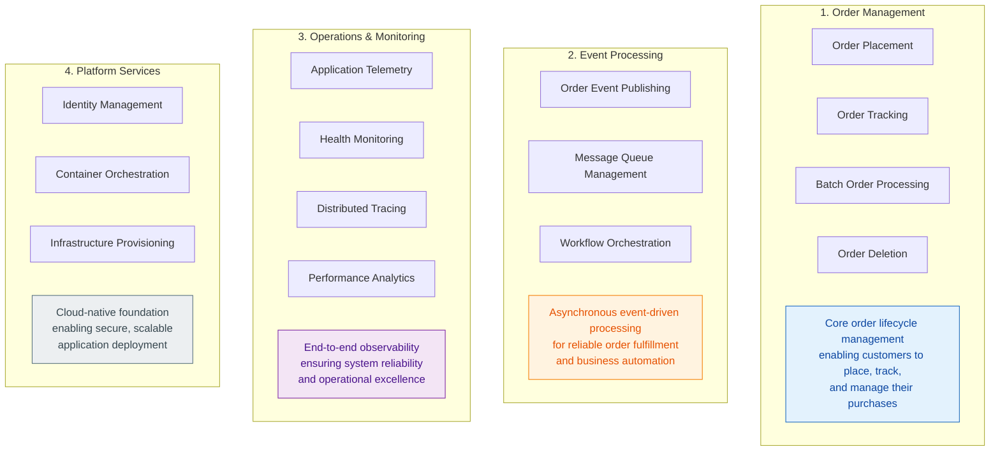

**Capability Domain Mapping:**

| # | Capability Domain | Description | Key Files |
|---|-------------------|-------------|-----------|
| 1 | **Order Management** | End-to-end order lifecycle from placement through fulfillment | [OrdersController.cs](../src/eShop.Orders.API/Controllers/OrdersController.cs), [OrderService.cs](../src/eShop.Orders.API/Services/OrderService.cs) |
| 2 | **Event Processing** | Pub/Sub messaging for decoupled order processing workflows | [OrdersMessageHandler.cs](../src/eShop.Orders.API/Handlers/OrdersMessageHandler.cs), [workflow.json](../workflows/OrdersManagement/OrdersManagementLogicApp/ProcessingOrdersPlaced/workflow.json) |
| 3 | **Operations & Monitoring** | Centralized observability with distributed tracing and metrics | [Extensions.cs](../app.ServiceDefaults/Extensions.cs), [app-insights.bicep](../infra/shared/monitoring/app-insights.bicep) |
| 4 | **Platform Services** | Managed identity, container hosting, and infrastructure automation | [AppHost.cs](../app.AppHost/AppHost.cs), [main.bicep](../infra/main.bicep) |

---

### 1.2 Business Process Flow

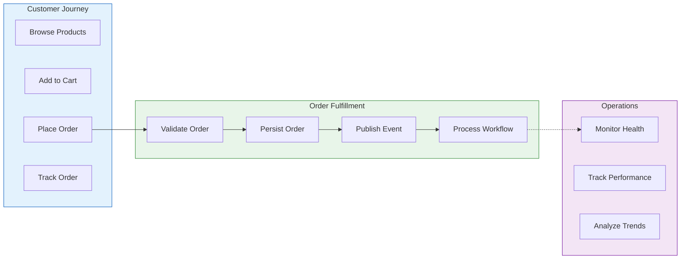

---

## 2. APPLICATION ARCHITECTURE

### 2.1 Application Landscape Diagram

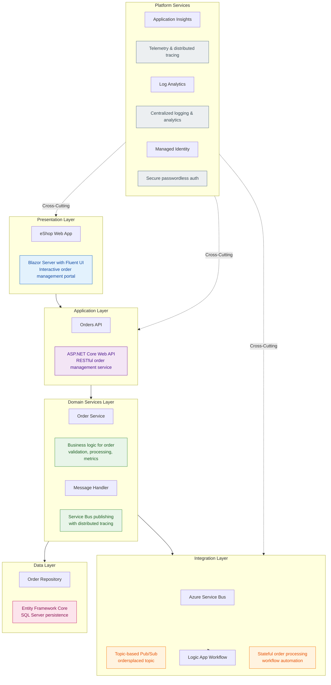

---

### 2.2 Service Catalog

| # | Service | Type | Technology Stack | Owner | Status |
|---|---------|------|------------------|-------|--------|
| 1 | **eShop.Web.App** | Frontend | Blazor Server, Fluent UI, .NET 10 | Platform Team | Active |
| 2 | **eShop.Orders.API** | Backend API | ASP.NET Core, EF Core, OpenAPI | Platform Team | Active |
| 3 | **app.ServiceDefaults** | Shared Library | OpenTelemetry, Health Checks, Resilience | Platform Team | Active |
| 4 | **app.AppHost** | Orchestrator | .NET Aspire 9.5, Azure Hosting | Platform Team | Active |
| 5 | **OrdersManagementLogicApp** | Workflow | Logic Apps Standard, Stateful | Platform Team | Active |

---

### 2.3 Service Details

#### 2.3.1 eShop Web Application

- **Purpose**: Interactive web portal for order management and tracking
- **Key Files**: 
  - [Program.cs](../src/eShop.Web.App/Program.cs) - Application bootstrap and DI configuration
  - [OrdersAPIService.cs](../src/eShop.Web.App/Components/Services/OrdersAPIService.cs) - HTTP client for Orders API
  - [Home.razor](../src/eShop.Web.App/Components/Pages/Home.razor) - Main dashboard page
- **Dependencies**: Orders API (HTTP), Service Defaults
- **Deployment**: Azure Container Apps

#### 2.3.2 Orders API

- **Purpose**: RESTful API for order CRUD operations with event publishing
- **Key Files**:
  - [Program.cs](../src/eShop.Orders.API/Program.cs) - Service configuration and middleware
  - [OrdersController.cs](../src/eShop.Orders.API/Controllers/OrdersController.cs) - API endpoints
  - [OrderService.cs](../src/eShop.Orders.API/Services/OrderService.cs) - Business logic
  - [OrderRepository.cs](../src/eShop.Orders.API/Repositories/OrderRepository.cs) - Data persistence
  - [OrdersMessageHandler.cs](../src/eShop.Orders.API/Handlers/OrdersMessageHandler.cs) - Service Bus publishing
- **Dependencies**: Azure SQL Database, Azure Service Bus, Application Insights
- **Deployment**: Azure Container Apps

#### 2.3.3 Service Defaults Library

- **Purpose**: Shared cross-cutting concerns including observability and resilience
- **Key Files**:
  - [Extensions.cs](../app.ServiceDefaults/Extensions.cs) - OpenTelemetry, health checks, Service Bus client
  - [CommonTypes.cs](../app.ServiceDefaults/CommonTypes.cs) - Shared domain models (Order, OrderProduct)
- **Dependencies**: OpenTelemetry, Azure.Identity, Polly
- **Deployment**: NuGet package reference

#### 2.3.4 App Host (Aspire Orchestrator)

- **Purpose**: Local development orchestration and Azure deployment configuration
- **Key Files**:
  - [AppHost.cs](../app.AppHost/AppHost.cs) - Service composition and resource wiring
- **Dependencies**: Aspire SDK, Azure hosting integrations
- **Deployment**: Development orchestrator / Azure Container Apps manifest

---

### 2.4 API Contracts

**Orders API Endpoints:**

| # | Endpoint | Method | Request Body | Response | Purpose |
|---|----------|--------|--------------|----------|---------|
| 1 | `/api/orders` | POST | `Order` JSON | `201 Created` with Order | Place a new order |
| 2 | `/api/orders/batch` | POST | `Order[]` JSON | `200 OK` with Order[] | Place multiple orders |
| 3 | `/api/orders` | GET | - | `200 OK` with Order[] | Retrieve all orders |
| 4 | `/api/orders/{id}` | GET | - | `200 OK` with Order | Retrieve order by ID |
| 5 | `/api/orders/{id}` | DELETE | - | `204 No Content` | Delete an order |
| 6 | `/health` | GET | - | `200 OK` | Readiness probe |
| 7 | `/alive` | GET | - | `200 OK` | Liveness probe |

**Request/Response Schema - Order:**

```json
{
  "id": "string (required, 1-100 chars)",
  "customerId": "string (required, 1-100 chars)",
  "date": "datetime (UTC)",
  "deliveryAddress": "string (required, 5-500 chars)",
  "total": "decimal (> 0)",
  "products": [
    {
      "id": "string (required)",
      "orderId": "string (required)",
      "productId": "string (required)",
      "productDescription": "string (required, 1-500 chars)",
      "quantity": "integer (>= 1)",
      "price": "decimal (> 0)"
    }
  ]
}
```

---

### 2.5 Integration Patterns

| # | Pattern | Implementation | Source | Target | Description |
|---|---------|----------------|--------|--------|-------------|
| 1 | **Pub/Sub** | Azure Service Bus Topics | Orders API | Logic App | Order placed events distributed to subscribers |
| 2 | **Service Discovery** | Aspire Service Discovery | Web App | Orders API | Automatic endpoint resolution |
| 3 | **Circuit Breaker** | Polly Resilience | Web App | Orders API | Fault tolerance with retry and timeout |
| 4 | **Repository** | EF Core | Order Service | SQL Database | Data access abstraction |
| 5 | **Health Checks** | ASP.NET Health Checks | All Services | Container Apps | Liveness and readiness probes |

---

### 2.6 Communication Flow Diagram

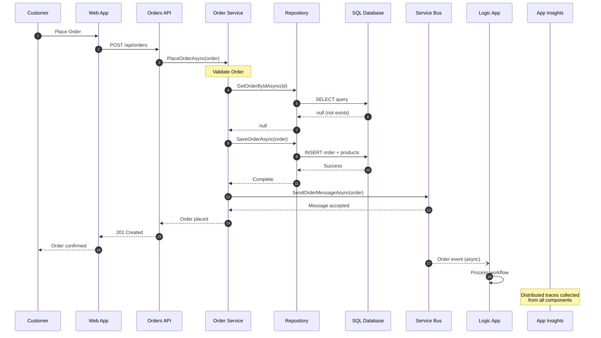

---

## 3. DATA ARCHITECTURE

### 3.1 Data Landscape Diagram

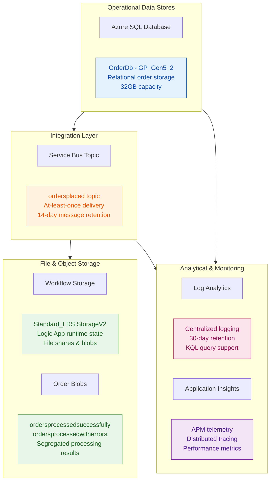

---

### 3.2 Data Store Catalog

| # | Store Name | Type | Technology | Purpose | SKU/Tier | Capacity | Redundancy | Retention | Owner |
|---|------------|------|------------|---------|----------|----------|------------|-----------|-------|
| 1 | **OrderDb** | Relational | Azure SQL | Order and product persistence | GP_Gen5_2 | 32GB | Zone optional | Permanent | Platform Team |
| 2 | **ordersplaced** | Messaging Topic | Service Bus Standard | Order event distribution | Standard | Auto | N/A | 14 days | Platform Team |
| 3 | **orderprocessingsub** | Messaging Subscription | Service Bus | Logic App consumption | Standard | Auto | N/A | 14 days | Platform Team |
| 4 | **Workflow Storage** | Object/File | Storage Account | Logic App runtime, blobs | Standard_LRS | Hot | LRS | Permanent | Platform Team |
| 5 | **Log Analytics** | Analytics | Log Analytics | Centralized logging | Per-GB | Auto | N/A | 30 days | Platform Team |
| 6 | **Application Insights** | APM | App Insights | Telemetry collection | Workspace-based | Auto | N/A | 90 days | Platform Team |

**Store Configuration Details:**

```yaml
# Azure SQL Database
Resource: Microsoft.Sql/servers/databases
Name: OrderDb
Configuration:
  sku: GP_Gen5_2 (General Purpose, Gen5, 2 vCores)
  maxSizeBytes: 34359738368 (32GB)
  collation: SQL_Latin1_General_CP1_CI_AS
  zoneRedundant: false
Connection:
  method: Managed Identity (Entra ID)
  authentication: azureADOnlyAuthentication: true

# Service Bus Namespace
Resource: Microsoft.ServiceBus/namespaces
Configuration:
  sku: Standard
  topics:
    - name: ordersplaced
      subscriptions:
        - name: orderprocessingsub
          maxDeliveryCount: 10
          lockDuration: PT5M
          defaultMessageTimeToLive: P14D
          deadLetteringOnMessageExpiration: true
Connection:
  method: Managed Identity
  endpoint: serviceBusEndpoint

# Workflow Storage Account
Resource: Microsoft.Storage/storageAccounts
Configuration:
  sku: Standard_LRS
  kind: StorageV2
  accessTier: Hot
  minimumTlsVersion: TLS1_2
  containers:
    - ordersprocessedsuccessfully
    - ordersprocessedwitherrors
  fileShares:
    - workflowstate (5TB quota)
```

---

### 3.3 Data Entity Model

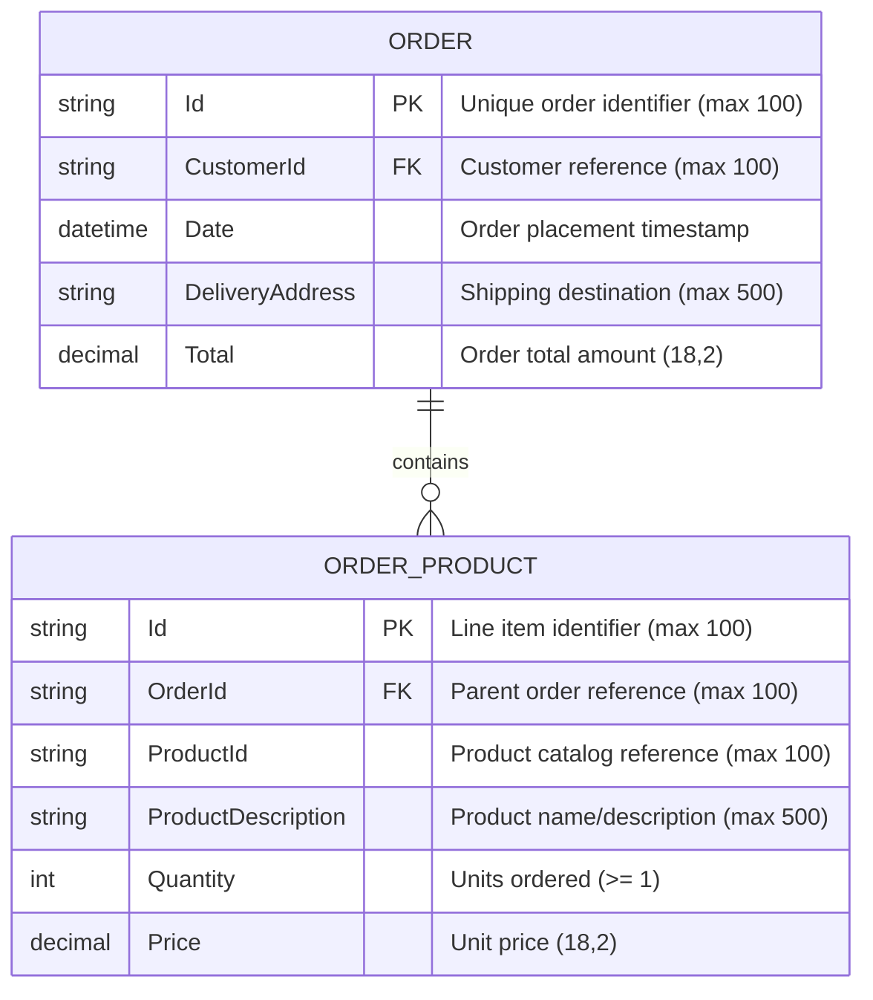

**Entity Catalog:**

| # | Entity | Description | Primary Key | Row Estimate | Growth Rate |
|---|--------|-------------|-------------|--------------|-------------|
| 1 | **Orders** | Customer order header with totals and delivery info | Id (string, 100) | 10K-100K | ~1K/month |
| 2 | **OrderProducts** | Line items with product details and pricing | Id (string, 100) | 50K-500K | ~5K/month |

---

### 3.4 Data Flow Diagram

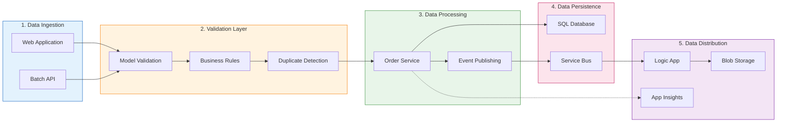

**Data Flow Matrix:**

| # | Source | Target | Data Type | Frequency | Volume | Sync/Async | Protocol |
|---|--------|--------|-----------|-----------|--------|------------|----------|
| 1 | Web App | Orders API | Order JSON | Real-time | 1-100/min | Sync | HTTPS |
| 2 | Orders API | SQL Database | Order Entity | Real-time | 1-100/min | Sync | TDS |
| 3 | Orders API | Service Bus | Order Message | Real-time | 1-100/min | Async | AMQP |
| 4 | Service Bus | Logic App | Order Event | Real-time | 1-100/min | Async | AMQP |
| 5 | Logic App | Blob Storage | Processed Order | Real-time | 1-100/min | Async | HTTPS |
| 6 | All Services | App Insights | Telemetry | Continuous | ~10K spans/min | Async | HTTPS |

---

### 3.5 Data Classification Table

| # | Data Category | Examples | Classification | PII | PHI | Encryption at Rest | Encryption in Transit | Access Control | Masking Required |
|---|---------------|----------|----------------|-----|-----|-------------------|----------------------|----------------|------------------|
| 1 | **Order Identifiers** | OrderId, CustomerId | Internal | ❌ | ❌ | TDE (SQL) | TLS 1.2 | RBAC | No |
| 2 | **Delivery Information** | DeliveryAddress | Confidential | ✅ | ❌ | TDE (SQL) | TLS 1.2 | RBAC + Row-level | Yes (logs) |
| 3 | **Financial Data** | Total, Price | Confidential | ❌ | ❌ | TDE (SQL) | TLS 1.2 | RBAC | No |
| 4 | **Product Details** | ProductDescription | Internal | ❌ | ❌ | TDE (SQL) | TLS 1.2 | RBAC | No |
| 5 | **Telemetry** | Traces, Metrics | Internal | ❌ | ❌ | Platform-managed | TLS 1.2 | RBAC | No |

**Classification Levels:**

| Level | Definition | Handling Requirements |
|-------|------------|----------------------|
| **Public** | No business impact if disclosed | Standard controls |
| **Internal** | Business use only, non-sensitive | Authentication required |
| **Confidential** | Significant impact if disclosed | Encryption + access logging |
| **Restricted** | Severe impact, regulatory requirements | Encryption + MFA + audit trail |

---

### 3.6 Data Governance

**Ownership Matrix:**

| # | Data Domain | Data Owner | Data Steward | Technical Owner | Review Cadence |
|---|-------------|------------|--------------|-----------------|----------------|
| 1 | **Orders** | Business Operations | Platform Team | Platform Team | Monthly |
| 2 | **Products** | Product Management | Platform Team | Platform Team | Monthly |
| 3 | **Telemetry** | Engineering | Platform Team | Platform Team | Quarterly |
| 4 | **Logs** | Engineering | Platform Team | Platform Team | Quarterly |

**Data Quality Rules:**

| # | Entity | Rule Name | Rule Description | Validation Type | Action on Failure |
|---|--------|-----------|------------------|-----------------|-------------------|
| 1 | Order | `ORD-001` | Order ID must be unique | Constraint | Reject (409 Conflict) |
| 2 | Order | `ORD-002` | Total must be greater than zero | Business | Reject (400 Bad Request) |
| 3 | Order | `ORD-003` | Must have at least one product | Business | Reject (400 Bad Request) |
| 4 | OrderProduct | `PROD-001` | Quantity must be at least 1 | Business | Reject (400 Bad Request) |
| 5 | OrderProduct | `PROD-002` | Price must be greater than zero | Business | Reject (400 Bad Request) |

**Retention Schedule:**

| # | Data Category | Retention Period | Archive Policy | Deletion Method | Legal Basis |
|---|---------------|------------------|----------------|-----------------|-------------|
| 1 | **Orders** | 7 years | Cold storage after 1 year | Soft delete | Business records |
| 2 | **Service Bus Messages** | 14 days | Auto-expire | Platform-managed | Operational |
| 3 | **Application Logs** | 30 days | N/A | Platform-managed | Operational |
| 4 | **Telemetry** | 90 days | N/A | Platform-managed | Operational |

**Data Lineage Diagram:**

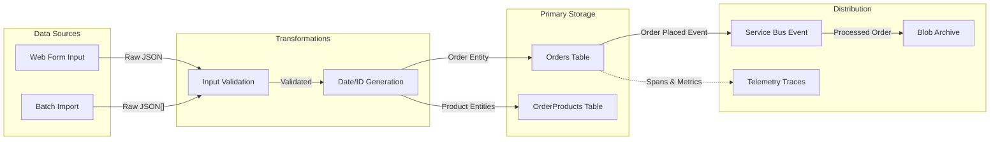

---

### 3.7 Integration Contracts

**Message Schemas:**

| # | Integration Point | Format | Schema Version | Schema Location | Validation |
|---|-------------------|--------|----------------|-----------------|------------|
| 1 | Service Bus - ordersplaced | JSON | v1.0 | [CommonTypes.cs](../app.ServiceDefaults/CommonTypes.cs) | Data Annotations |
| 2 | HTTP API - Orders | JSON | v1.0 | OpenAPI/Swagger | Model Binding |

**Service Bus Message Schema:**

```json
{
  "$schema": "http://json-schema.org/draft-07/schema#",
  "$id": "order-placed-message.json",
  "type": "object",
  "required": ["id", "customerId", "deliveryAddress", "total", "products"],
  "properties": {
    "id": {
      "type": "string",
      "minLength": 1,
      "maxLength": 100,
      "description": "Unique order identifier"
    },
    "customerId": {
      "type": "string",
      "minLength": 1,
      "maxLength": 100,
      "description": "Customer placing the order"
    },
    "date": {
      "type": "string",
      "format": "date-time",
      "description": "Order placement timestamp (UTC)"
    },
    "deliveryAddress": {
      "type": "string",
      "minLength": 5,
      "maxLength": 500,
      "description": "Shipping destination address"
    },
    "total": {
      "type": "number",
      "minimum": 0.01,
      "description": "Order total amount"
    },
    "products": {
      "type": "array",
      "minItems": 1,
      "items": {
        "$ref": "#/definitions/orderProduct"
      }
    }
  },
  "definitions": {
    "orderProduct": {
      "type": "object",
      "required": ["id", "orderId", "productId", "productDescription", "quantity", "price"],
      "properties": {
        "id": { "type": "string" },
        "orderId": { "type": "string" },
        "productId": { "type": "string" },
        "productDescription": { "type": "string", "maxLength": 500 },
        "quantity": { "type": "integer", "minimum": 1 },
        "price": { "type": "number", "minimum": 0.01 }
      }
    }
  }
}
```

**Message Properties:**

| Property | Value | Description |
|----------|-------|-------------|
| `ContentType` | application/json | Message body format |
| `MessageId` | {OrderId} | Idempotency key |
| `Subject` | OrderPlaced | Event type |
| `TraceId` | {ActivityTraceId} | Distributed trace correlation |
| `SpanId` | {ActivitySpanId} | Span correlation |
| `traceparent` | {W3C TraceContext} | OpenTelemetry propagation |

---

## 4. TECHNOLOGY ARCHITECTURE

### 4.1 Technology Stack

| # | Layer | Technology | Version | Purpose | License |
|---|-------|------------|---------|---------|---------|
| 1 | **Runtime** | .NET | 10.0 | Application framework | MIT |
| 2 | **Web Framework** | ASP.NET Core | 10.0 | API and web hosting | MIT |
| 3 | **UI Framework** | Blazor Server | 10.0 | Interactive web components | MIT |
| 4 | **UI Components** | Fluent UI Blazor | Latest | Design system | MIT |
| 5 | **ORM** | Entity Framework Core | 9.0 | Data access | MIT |
| 6 | **Orchestration** | .NET Aspire | 9.5 | Service composition | MIT |
| 7 | **Messaging** | Azure.Messaging.ServiceBus | Latest | Service Bus client | MIT |
| 8 | **Observability** | OpenTelemetry | Latest | Distributed tracing | Apache 2.0 |
| 9 | **Resilience** | Polly | Latest | Fault tolerance | BSD-3 |
| 10 | **IaC** | Bicep | Latest | Infrastructure as Code | MIT |
| 11 | **API Docs** | Swashbuckle | 10.1 | OpenAPI/Swagger | MIT |

---

### 4.2 Infrastructure Diagram

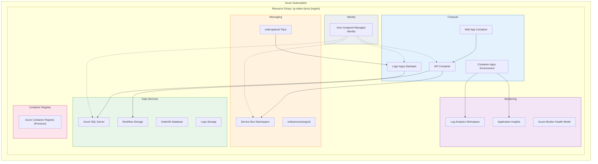

---

### 4.3 Deployment Architecture

| # | Component | Target | SKU | Scaling | Region |
|---|-----------|--------|-----|---------|--------|
| 1 | **Web App** | Container Apps | Consumption | 0-10 replicas | Configurable |
| 2 | **Orders API** | Container Apps | Consumption | 0-10 replicas | Configurable |
| 3 | **Logic App** | App Service Plan | WS1 (WorkflowStandard) | 3-20 elastic workers | Configurable |
| 4 | **SQL Database** | Azure SQL | GP_Gen5_2 | 2 vCores, 32GB | Configurable |
| 5 | **Service Bus** | Service Bus | Standard | Auto-managed | Configurable |
| 6 | **Container Registry** | ACR | Premium | Geo-replicated | Configurable |
| 7 | **Storage Accounts** | Storage | Standard_LRS | Auto | Configurable |
| 8 | **Log Analytics** | Log Analytics | Per-GB | Auto | Configurable |
| 9 | **Application Insights** | App Insights | Workspace-based | Auto | Configurable |

---

### 4.4 Security Architecture

**Authentication Flow:**

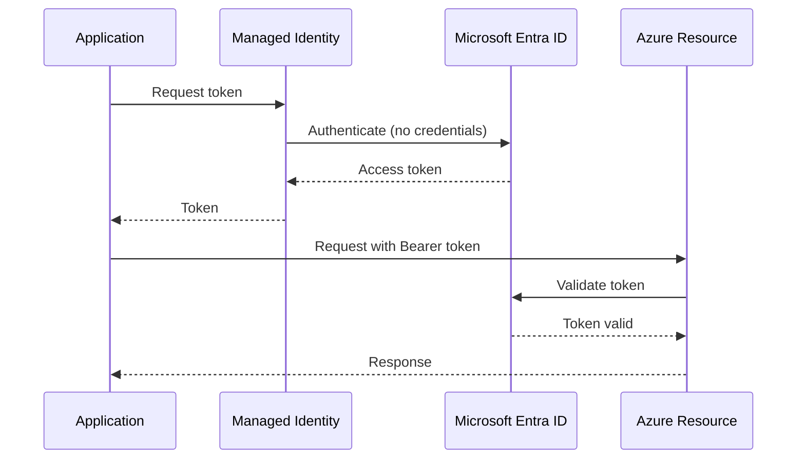

**Authorization Model (RBAC Roles):**

| # | Role | Principal | Scope | Purpose |
|---|------|-----------|-------|---------|
| 1 | **Storage Blob Data Contributor** | Managed Identity | Workflow Storage | Logic App blob access |
| 2 | **Azure Service Bus Data Sender** | Managed Identity | Service Bus | API message publishing |
| 3 | **Azure Service Bus Data Receiver** | Managed Identity | Service Bus | Logic App message consumption |
| 4 | **SQL DB Contributor** | Managed Identity | SQL Database | EF Core data access |
| 5 | **AcrPull** | Managed Identity | Container Registry | Container image pull |

**Network Security:**

| Resource | Public Access | Private Endpoint | NSG Rules |
|----------|---------------|------------------|-----------|
| Container Apps | Enabled (HTTPS) | Optional | Platform-managed |
| SQL Database | Enabled (Azure Services) | Optional | AllowAllWindowsAzureIps |
| Service Bus | Enabled | Optional | Platform-managed |
| Storage Account | Enabled | Optional | Allow Azure Services |

**Key Security Features:**
- ✅ Managed Identity (passwordless authentication)
- ✅ Entra ID-only SQL authentication
- ✅ TLS 1.2 minimum for all connections
- ✅ HTTPS-only traffic
- ✅ No shared keys in application code

---

## 5. ARCHITECTURE VIEWS

### 5.1 Deployment View

**CI/CD Pipeline:**

```mermaid
flowchart LR
    subgraph Development["Development"]
        Code["Source Code"]
        LocalTest["Local Testing"]
    end
    
    subgraph Build["Build Stage"]
        Restore["dotnet restore"]
        Compile["dotnet build"]
        Test["dotnet test"]
        Publish["dotnet publish"]
    end
    
    subgraph Package["Package Stage"]
        DockerBuild["Docker Build"]
        ACRPush["ACR Push"]
    end
    
    subgraph Deploy["Deploy Stage"]
        BicepValidate["Bicep Validate"]
        AzdProvision["azd provision"]
        AzdDeploy["azd deploy"]
    end
    
    subgraph Environments["Environments"]
        Dev["dev"]
        Staging["staging"]
        Prod["prod"]
    end
    
    Code --> LocalTest
    LocalTest --> Restore
    Restore --> Compile
    Compile --> Test
    Test --> Publish
    Publish --> DockerBuild
    DockerBuild --> ACRPush
    ACRPush --> BicepValidate
    BicepValidate --> AzdProvision
    AzdProvision --> AzdDeploy
    AzdDeploy --> Dev
    Dev --> Staging
    Staging --> Prod
```

**Infrastructure as Code Structure:**

```
infra/
├── main.bicep                    # Main orchestrator (subscription scope)
├── main.parameters.json          # Environment parameters
├── types.bicep                   # Shared type definitions
├── shared/
│   ├── main.bicep               # Shared infrastructure orchestrator
│   ├── identity/
│   │   └── main.bicep           # Managed identity
│   ├── monitoring/
│   │   ├── main.bicep           # Monitoring orchestrator
│   │   ├── log-analytics-workspace.bicep
│   │   ├── app-insights.bicep
│   │   └── azure-monitor-health-model.bicep
│   └── data/
│       └── main.bicep           # Storage and SQL
└── workload/
    ├── main.bicep               # Workload orchestrator
    ├── logic-app.bicep          # Logic Apps Standard
    ├── messaging/
    │   └── main.bicep           # Service Bus
    └── services/
        └── main.bicep           # Container Apps + ACR
```

---

### 5.2 Operational View

**Monitoring Components:**

| # | Component | Type | Dashboard | Alert Rules |
|---|-----------|------|-----------|-------------|
| 1 | **Application Insights** | APM | Application Map, Performance | Response time, failure rate |
| 2 | **Log Analytics** | Logging | Custom KQL queries | Error count, anomalies |
| 3 | **Aspire Dashboard** | Dev Observability | Traces, Metrics, Logs | Development only |
| 4 | **Azure Monitor Health Model** | Service Groups | Health hierarchy | Availability |

**Key Metrics:**

| Metric | Source | Threshold | Action |
|--------|--------|-----------|--------|
| `eShop.orders.placed` | Custom Counter | N/A | Track order volume |
| `eShop.orders.processing.duration` | Custom Histogram | >5s p99 | Investigate latency |
| `eShop.orders.processing.errors` | Custom Counter | >1% | Alert & investigate |
| HTTP response time | App Insights | >2s p95 | Scale or optimize |
| Database DTU | SQL Metrics | >80% | Scale up |

**Health Check Endpoints:**

| Endpoint | Purpose | Tags | Checks |
|----------|---------|------|--------|
| `/health` | Readiness probe | ready | Database, Service Bus |
| `/alive` | Liveness probe | live | Self-check |

---

### 5.3 Security View

**Security Controls Matrix:**

| # | Control Category | Control | Implementation | Status |
|---|------------------|---------|----------------|--------|
| 1 | **Identity** | Passwordless auth | Managed Identity | ✅ Implemented |
| 2 | **Identity** | Entra ID-only SQL | azureADOnlyAuthentication | ✅ Implemented |
| 3 | **Network** | TLS 1.2+ | minimumTlsVersion | ✅ Implemented |
| 4 | **Network** | HTTPS only | supportsHttpsTrafficOnly | ✅ Implemented |
| 5 | **Data** | Encryption at rest | TDE (SQL), SSE (Storage) | ✅ Platform-managed |
| 6 | **Data** | Encryption in transit | TLS 1.2 | ✅ Implemented |
| 7 | **Access** | RBAC | Role assignments | ✅ Implemented |
| 8 | **Logging** | Audit trail | Diagnostic settings | ✅ Implemented |
| 9 | **Secrets** | No hardcoded secrets | User Secrets + Managed Identity | ✅ Implemented |

**Compliance Mapping:**

| Framework | Relevant Controls | Coverage |
|-----------|------------------|----------|
| Azure Security Benchmark | Identity, Network, Data | Partial |
| OWASP Top 10 | Injection, Auth, Crypto | Addressed |
| CIS Azure | Logging, Network, Identity | Partial |

---

## Color Palette Reference

| Domain/Layer | Fill | Stroke | Text |
|--------------|------|--------|------|
| Presentation/UI | #e3f2fd | #1565c0 | #0d47a1 |
| Application/API | #f3e5f5 | #7b1fa2 | #4a148c |
| Domain/Business | #e8f5e9 | #388e3c | #1b5e20 |
| Integration/Events | #fff3e0 | #f57c00 | #e65100 |
| Data/Storage | #fce4ec | #c2185b | #880e4f |
| Platform/Cross-Cutting | #eceff1 | #546e7a | #37474f |

---

## Output Checklist

- [x] All tables have numbered (#) first column
- [x] All Mermaid diagrams have description nodes with styling
- [x] Business terminology used (not technical jargon)
- [x] File references use relative paths with links
- [x] Color coding is consistent across all diagrams
- [x] Capability maps show structure (no flow arrows)
- [x] Entity diagrams include PK/FK markers
- [x] Sequence diagrams show async vs sync
- [x] Classification tables include PII/PHI flags
- [x] Governance tables have ownership assignments

---

*Document generated following TOGAF BDAT framework and cloud-native documentation best practices.*
