# Azure Logic Apps Monitoring Solution - Architecture Documentation

**Version:** 1.0.0  
**Last Updated:** December 30, 2025  
**Framework:** TOGAF BDAT (Business, Data, Application, Technology)

---

## 1. Executive Summary

### Purpose and Business Value

The Azure Logic Apps Monitoring Solution is a comprehensive, cloud-native reference architecture demonstrating best practices for **observability, distributed tracing, and monitoring** in modern Azure applications. Built with **.NET 10, .NET Aspire 9.5, Azure Container Apps, and Application Insights**, this solution provides a fully instrumented e-commerce order management system that serves as both a functional application and a learning resource for cloud architects.

The solution addresses three critical enterprise needs: (1) **end-to-end distributed tracing** across microservices and messaging systems, enabling rapid root cause analysis; (2) **production-grade observability** with integrated metrics, logs, and traces flowing to Application Insights; and (3) **dual-mode development** supporting both local containerized development and Azure cloud deployment with zero code changes.

### Key Technology Choices

| Technology | Version | Rationale |
|------------|---------|-----------|
| .NET | 10.0 | Latest LTS framework with enhanced performance and cloud-native features |
| .NET Aspire | 9.5 | Modern orchestration with built-in observability, service discovery, and resilience |
| Azure Container Apps | Latest | Serverless containers with KEDA auto-scaling and Dapr integration |
| Azure Service Bus | Standard | Enterprise messaging with topic-based pub/sub for order events |
| Azure SQL Database | GP_Gen5_2 | Managed relational storage with Entra ID authentication |
| Application Insights | Workspace-based | Unified telemetry platform with Log Analytics integration |
| Blazor Server | .NET 10 | Interactive web UI with Fluent UI components and SignalR |

### Target Deployment Model

The solution deploys to **Azure Container Apps** using a serverless consumption model with automatic scaling from zero. Infrastructure is provisioned via **Azure Developer CLI (azd)** with modular Bicep templates, enabling consistent deployments across development, staging, and production environments.

---

## 2. Architecture Principles & Key Decisions

### Guiding Principles

1. **Observability-First Design**: Every service is instrumented with OpenTelemetry from inception, not retrofitted. Telemetry is a first-class concern implemented in [app.ServiceDefaults/Extensions.cs](app.ServiceDefaults/Extensions.cs).

2. **Infrastructure as Code**: All Azure resources are defined in Bicep templates under [infra/](infra/), ensuring repeatable, auditable deployments with no manual portal configurations.

3. **Managed Identity Everywhere**: Zero secrets in code or configuration. All Azure service authentication uses User-Assigned Managed Identity configured in [infra/shared/identity/main.bicep](infra/shared/identity/main.bicep).

4. **Local-Cloud Parity**: The same application code runs locally (with emulators/containers) and in Azure through .NET Aspire's configuration abstraction in [app.AppHost/AppHost.cs](app.AppHost/AppHost.cs).

5. **Separation of Concerns**: Clear layering with Controllers → Services → Repositories → Data patterns in [src/eShop.Orders.API/](src/eShop.Orders.API/).

### Key Architectural Decisions

| Decision | Choice | Trade-offs & Rationale |
|----------|--------|------------------------|
| **Orchestration** | .NET Aspire AppHost | Provides unified local dev experience with automatic service discovery, but requires .NET 10+ and Aspire workload installation |
| **Database** | Azure SQL with EF Core | Strong consistency and ACID guarantees for order transactions; higher cost than NoSQL but familiar to enterprise teams |
| **Messaging** | Service Bus Topics | Pub/sub pattern allows multiple subscribers; Standard tier limits throughput to ~1000 msg/sec but sufficient for reference implementation |
| **Authentication** | Entra ID Only | Enhanced security by eliminating SQL authentication; requires post-provisioning identity configuration via [hooks/sql-managed-identity-config.ps1](hooks/sql-managed-identity-config.ps1) |
| **Frontend** | Blazor Server | Rich interactivity with SignalR; server-side rendering avoids WASM download but requires persistent connection |
| **Container Registry** | Premium ACR | Supports geo-replication for production; higher cost justified by enhanced throughput and security features |

---

## 3. Architecture Domains

### 3.1 Business Architecture

The solution implements an **order management capability** demonstrating cloud-native monitoring patterns. Business value is delivered through transparent order processing with full audit trails.

#### Business Capability Map

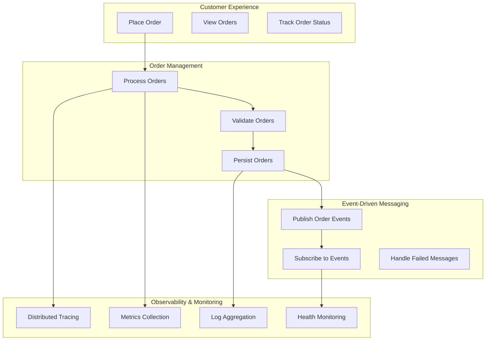

### 3.2 Application Architecture

The solution follows a **layered microservices architecture** with two primary services orchestrated by .NET Aspire.

#### Service Decomposition

| Service | Responsibility | Key Files |
|---------|----------------|-----------|
| **orders-api** | RESTful API for order CRUD operations, Service Bus publishing | [src/eShop.Orders.API/Program.cs](src/eShop.Orders.API/Program.cs) |
| **web-app** | Blazor Server frontend for order management UI | [src/eShop.Web.App/Program.cs](src/eShop.Web.App/Program.cs) |
| **AppHost** | .NET Aspire orchestrator managing service wiring | [app.AppHost/AppHost.cs](app.AppHost/AppHost.cs) |

#### API Contracts

The Orders API exposes the following endpoints defined in [src/eShop.Orders.API/Controllers/OrdersController.cs](src/eShop.Orders.API/Controllers/OrdersController.cs):

| Endpoint | Method | Purpose |
|----------|--------|---------|
| `/api/orders` | POST | Place single order |
| `/api/orders/batch` | POST | Place multiple orders |
| `/api/orders` | GET | List all orders |
| `/api/orders/{id}` | GET | Get order by ID |
| `/api/orders/{id}` | DELETE | Delete order |
| `/health` | GET | Health check endpoint |
| `/alive` | GET | Liveness probe endpoint |

#### Application Landscape

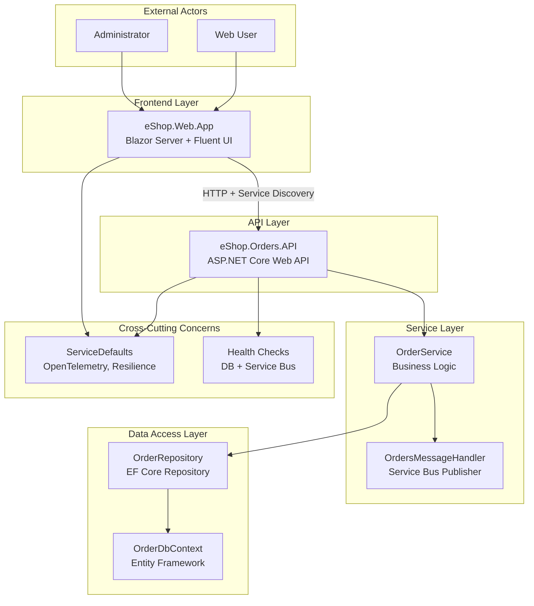

### 3.3 Data Architecture

#### Data Stores

| Store | Technology | Purpose | Configuration |
|-------|------------|---------|---------------|
| **OrderDb** | Azure SQL Database | Order and product persistence | GP_Gen5_2, 32GB, Entra-only auth |
| **Service Bus** | Azure Service Bus Standard | Order event messaging | `ordersplaced` topic with `orderprocessingsub` subscription |
| **Workflow Storage** | Azure Storage Account | Logic Apps runtime state | Standard_LRS, Hot tier |
| **Diagnostics Storage** | Azure Storage Account | Log archive and diagnostics | Standard_LRS with lifecycle management |

#### Entity Model

Defined in [src/eShop.Orders.API/data/Entities/](src/eShop.Orders.API/data/Entities/):

- **OrderEntity**: Id, CustomerId, Date, DeliveryAddress, Total, Products[]
- **OrderProductEntity**: Id, OrderId, ProductId, ProductDescription, Quantity, Price

#### Data Landscape

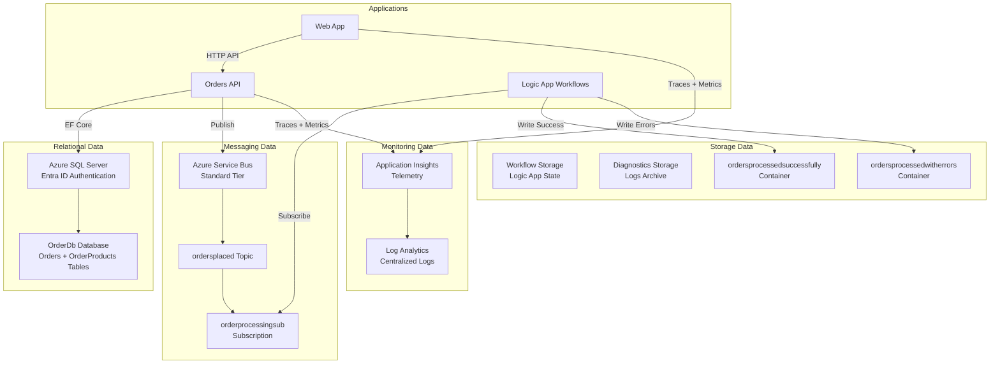

### 3.4 Technology Architecture

#### Runtime Infrastructure

| Component | Azure Service | SKU/Tier | Purpose |
|-----------|--------------|----------|---------|
| Container Hosting | Container Apps Environment | Consumption | Serverless container runtime |
| Container Images | Container Registry | Premium | Image storage with geo-replication |
| Web API Runtime | Container App | Consumption profile | orders-api hosting |
| Frontend Runtime | Container App | Consumption profile | web-app hosting |
| Workflow Engine | Logic Apps Standard | WS1 (WorkflowStandard) | Order processing workflows |

#### Technology Landscape

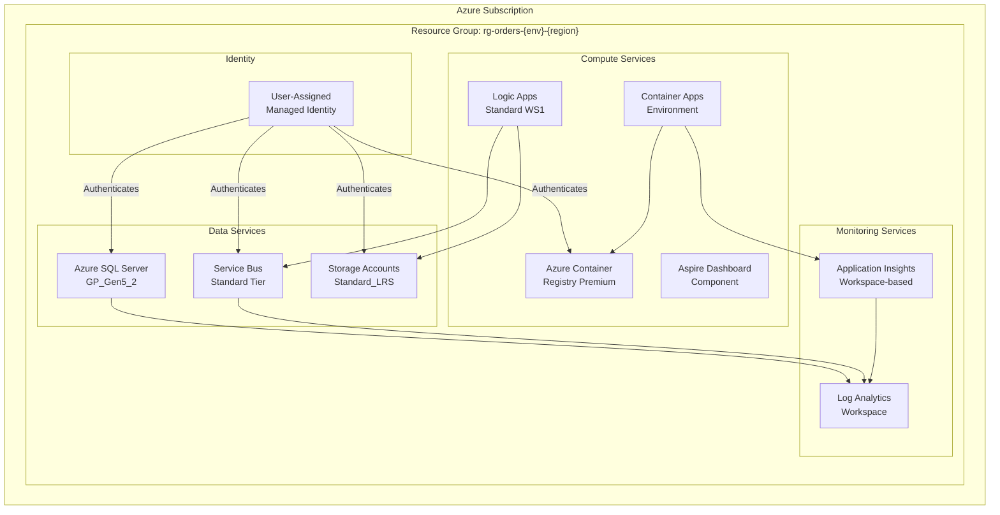

---

## 4. Architecture Views

### 4.1 Context Diagram

System boundaries showing external actors and integration points.

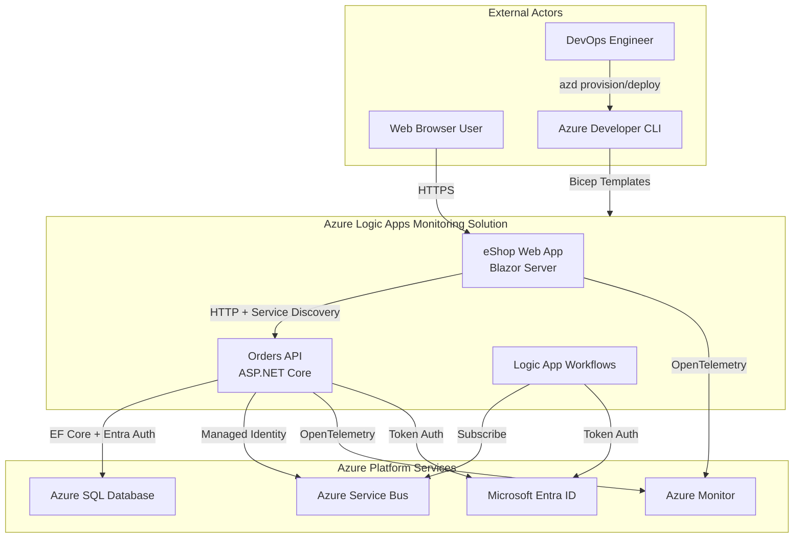

### 4.2 Container Diagram

Runtime deployable units and their interactions.

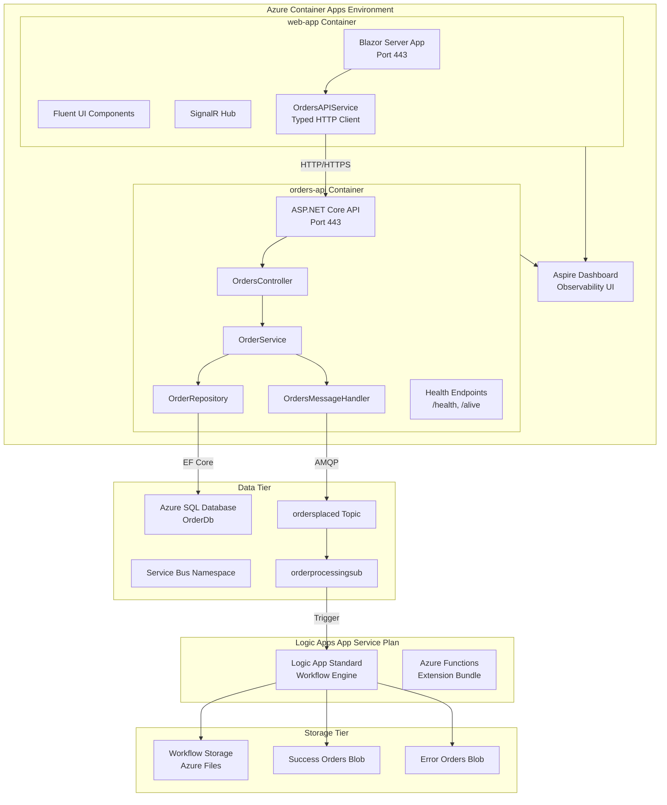

### 4.3 Component Diagram - Orders API

Internal structure of the Orders API service.

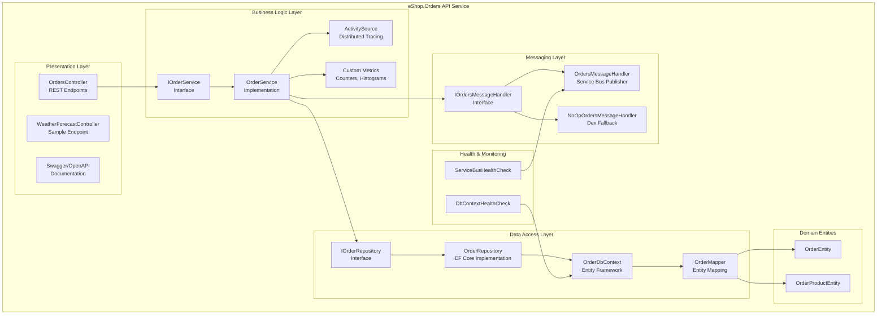

---

## 5. Key Scenarios

### 5.1 Order Creation Flow

Complete flow from user interaction through persistence and messaging.

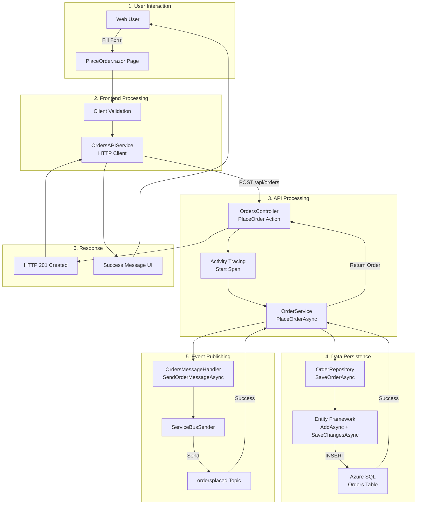

### 5.2 Health Check Flow

Health monitoring and observability data flow.

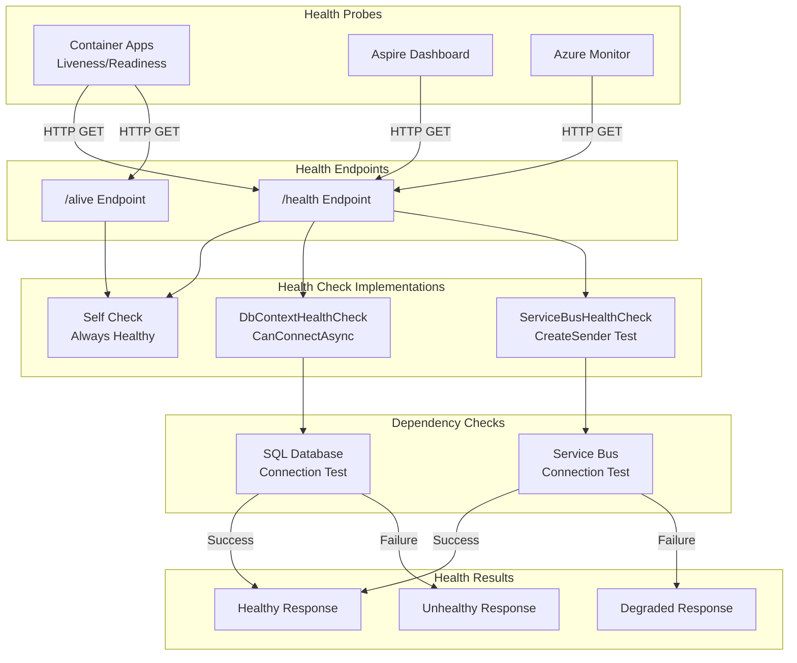

### 5.3 Deployment Pipeline Flow

Azure Developer CLI deployment automation.

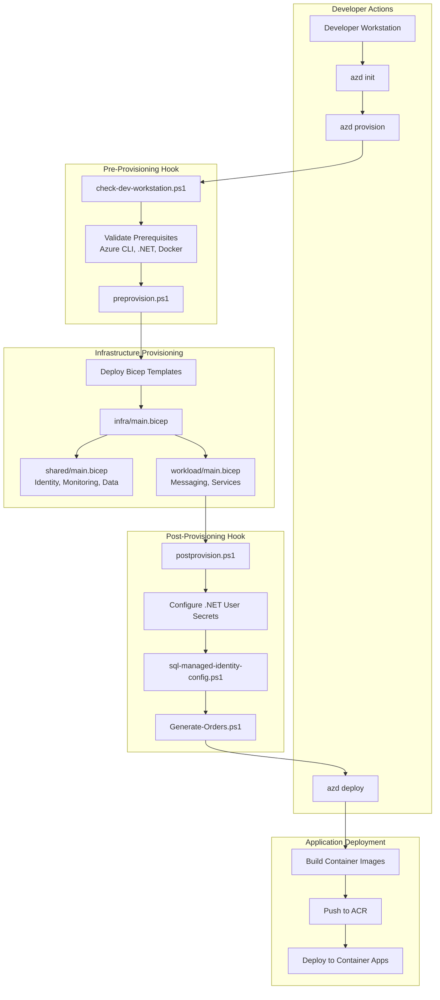

---

## 6. Observability Strategy

### Telemetry Collection Approach

The solution implements **comprehensive observability** using OpenTelemetry as the instrumentation standard, configured in [app.ServiceDefaults/Extensions.cs](app.ServiceDefaults/Extensions.cs).

#### Instrumentation Layers

| Layer | Instrumentation | Configuration |
|-------|-----------------|---------------|
| **HTTP Server** | ASP.NET Core | `AddAspNetCoreInstrumentation()` with request/response enrichment |
| **HTTP Client** | HttpClient | `AddHttpClientInstrumentation()` with exception recording |
| **Database** | SQL Client | `AddSqlClientInstrumentation()` with query recording |
| **Messaging** | Service Bus | Custom `ActivitySource` for message publish/receive |
| **Runtime** | .NET Runtime | `AddRuntimeInstrumentation()` for GC, thread pool metrics |

#### Custom Metrics

Defined in [src/eShop.Orders.API/Services/OrderService.cs](src/eShop.Orders.API/Services/OrderService.cs):

```
eShop.orders.placed          - Counter: Total orders successfully placed
eShop.orders.deleted         - Counter: Total orders deleted
eShop.orders.processing.duration - Histogram: Order processing time (ms)
eShop.orders.processing.errors   - Counter: Processing errors by type
```

### Distributed Tracing Implementation

Trace context propagation follows W3C Trace Context standard:

1. **HTTP Propagation**: Automatic via OpenTelemetry HTTP instrumentation
2. **Service Bus Propagation**: Manual via `ApplicationProperties` in [src/eShop.Orders.API/Handlers/OrdersMessageHandler.cs](src/eShop.Orders.API/Handlers/OrdersMessageHandler.cs):
   - `TraceId`, `SpanId`, `traceparent`, `tracestate` properties added to messages
3. **Activity Sources**: Named sources `eShop.Orders.API`, `eShop.Web.App`, `Azure.Messaging.ServiceBus`

### Log Aggregation

All logs flow to **Log Analytics Workspace** through two paths:

1. **Application Logs**: OpenTelemetry → Application Insights → Log Analytics
2. **Infrastructure Logs**: Diagnostic Settings → Log Analytics

Log enrichment includes:
- Trace correlation IDs
- Structured properties (OrderId, CustomerId, etc.)
- Request/response metadata

### Alerting Configuration

Health check endpoints enable Container Apps probes:

| Probe Type | Endpoint | Behavior |
|------------|----------|----------|
| Liveness | `/alive` | Returns 200 if process is running (tagged: `live`) |
| Readiness | `/health` | Returns 200 if all dependencies healthy (DB, Service Bus) |

---

## 7. Security & Identity Architecture

### Authentication/Authorization Model

The solution uses **Microsoft Entra ID** exclusively for authentication:

| Component | Authentication Method | Configuration |
|-----------|----------------------|---------------|
| Azure SQL | Entra-only (SQL auth disabled) | [infra/shared/data/main.bicep](infra/shared/data/main.bicep) - `azureADOnlyAuthentication: true` |
| Service Bus | Managed Identity | DefaultAzureCredential in [app.ServiceDefaults/Extensions.cs](app.ServiceDefaults/Extensions.cs) |
| Container Registry | Managed Identity | ACR Pull/Push roles assigned |
| Storage Accounts | Managed Identity | Blob, File, Queue, Table Data Contributor roles |

### Managed Identity Usage

A single **User-Assigned Managed Identity** is provisioned in [infra/shared/identity/main.bicep](infra/shared/identity/main.bicep) with the following role assignments:

| Role | Purpose |
|------|---------|
| Storage Account Contributor | Manage storage resources |
| Storage Blob Data Contributor/Owner | Read/write blob data |
| Storage Table/Queue/File Data Contributor | Access table, queue, file data |
| Monitoring Metrics Publisher | Publish custom metrics |
| Monitoring Contributor | Manage monitoring resources |
| Application Insights Component Contributor | Configure App Insights |
| Azure Service Bus Data Owner/Sender/Receiver | Full Service Bus access |
| ACR Pull/Push | Pull and push container images |

### Network Security Considerations

Current configuration prioritizes **ease of development** with public access enabled:

- SQL Server: `publicNetworkAccess: 'Enabled'` with Azure Services firewall rule
- Storage Accounts: `publicNetworkAccess: 'Enabled'` with `defaultAction: 'Allow'`
- Service Bus: Public network access enabled
- Container Apps: External ingress enabled

<!-- NEEDS VERIFICATION: Production hardening should include Private Endpoints and VNet integration -->

### Secret Management Approach

**Zero secrets in code**: All sensitive values are managed through:

1. **Azure Key Vault Integration**: Connection strings retrieved at runtime via Managed Identity
2. **.NET User Secrets**: Local development secrets configured by [hooks/postprovision.ps1](hooks/postprovision.ps1)
3. **Environment Variables**: Injected by Container Apps from Aspire configuration

Post-provisioning configures local secrets via:
```powershell
dotnet user-secrets set "Azure:ResourceGroup" $env:AZURE_RESOURCE_GROUP
dotnet user-secrets set "Azure:SqlServer:Name" $env:AZURE_SQL_SERVER_NAME
# ... additional secrets
```

---

## 8. Deployment & Operations

### Infrastructure Topology

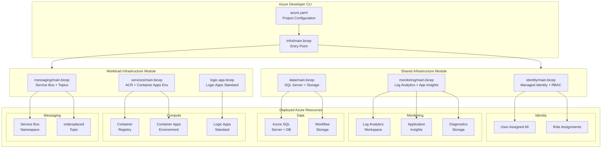

### Deployment Automation

The `azure.yaml` configuration orchestrates the full deployment lifecycle:

```yaml
hooks:
  preprovision:    # Validate prerequisites
  postprovision:   # Configure secrets, SQL identity, generate test data

services:
  app:
    host: containerapp
    project: ./app.AppHost/app.AppHost.csproj
```

### Operational Runbook

| Operation | Command | Description |
|-----------|---------|-------------|
| Initial Deploy | `azd up` | Full provision + deploy |
| Infrastructure Only | `azd provision` | Deploy Bicep without app |
| Application Only | `azd deploy` | Deploy containers to existing infra |
| Cleanup | `azd down` | Delete all resources |
| Local Development | `dotnet run --project app.AppHost` | Start with Aspire orchestration |

---

## Appendix: File Reference Index

| Category | Key Files |
|----------|-----------|
| **Orchestration** | [app.AppHost/AppHost.cs](app.AppHost/AppHost.cs), [azure.yaml](azure.yaml) |
| **Cross-Cutting** | [app.ServiceDefaults/Extensions.cs](app.ServiceDefaults/Extensions.cs), [app.ServiceDefaults/CommonTypes.cs](app.ServiceDefaults/CommonTypes.cs) |
| **API Implementation** | [src/eShop.Orders.API/Program.cs](src/eShop.Orders.API/Program.cs), [src/eShop.Orders.API/Controllers/OrdersController.cs](src/eShop.Orders.API/Controllers/OrdersController.cs) |
| **Frontend** | [src/eShop.Web.App/Program.cs](src/eShop.Web.App/Program.cs), [src/eShop.Web.App/Components/Services/OrdersAPIService.cs](src/eShop.Web.App/Components/Services/OrdersAPIService.cs) |
| **Infrastructure** | [infra/main.bicep](infra/main.bicep), [infra/shared/main.bicep](infra/shared/main.bicep), [infra/workload/main.bicep](infra/workload/main.bicep) |
| **Deployment Hooks** | [hooks/postprovision.ps1](hooks/postprovision.ps1), [hooks/sql-managed-identity-config.ps1](hooks/sql-managed-identity-config.ps1) |

---

*This document was generated based on analysis of workspace files as of December 30, 2025. All architectural claims are traceable to specific source files referenced throughout the document.*
