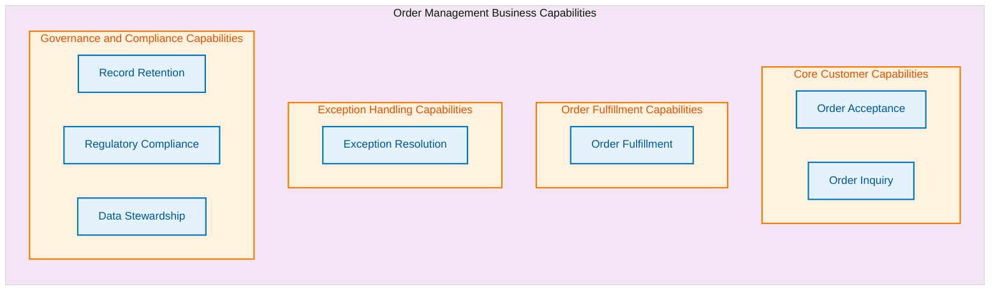
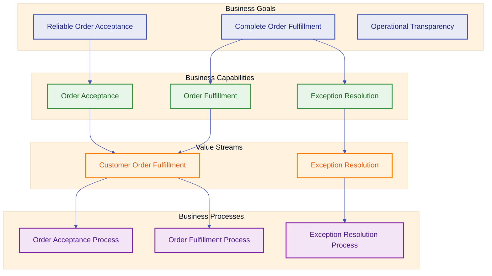

# Business Architecture

**Document Version:** 1.0  
**Last Updated:** January 8, 2026  
**Architecture Framework:** TOGAF 10  
**Architecture Phase:** Phase B - Business Architecture  
**Status:** Draft

---

## Executive Summary

This document defines the Business Architecture for an e-commerce order management solution. The architecture addresses the business need to process customer orders while maintaining operational transparency and regulatory compliance.

The architecture describes the business capabilities required to accept, fulfill, and manage customer orders throughout their lifecycle. It defines value streams from initial customer intent through order completion, supported by logical business processes and policies that ensure consistent order handling.

**Key Business Drivers:**

- Enable customers to place and track orders with confidence
- Ensure orders are processed completely and accurately
- Provide operational visibility into order status and exceptions
- Support business continuity and regulatory compliance
- Enable business growth through scalable order handling

**Scope:** This document covers the business architecture for order acceptance, fulfillment coordination, exception handling, and order lifecycle management. It excludes specific implementation technologies, system designs, and operational procedures.

---

## Business Context and Problem Statement

### Business Context

The organization operates in the e-commerce sector, serving customers who place orders for products through digital channels. Orders represent the primary revenue-generating transaction and require coordinated handling across multiple business functions.

### Business Problem

The business faces challenges in:

1. **Order Lifecycle Complexity:** Orders transition through multiple business states requiring coordination across functions
2. **Exception Management:** Order exceptions must be identified and resolved without disrupting customer experience
3. **Operational Transparency:** Business stakeholders require visibility into order status and business outcomes
4. **Regulatory Compliance:** Order records must be maintained according to regulatory retention and audit requirements
5. **Business Growth:** Order handling capacity must scale with business volume without proportional resource increases

### Business Opportunity

Implementing structured order management capabilities enables the business to:

- Increase customer satisfaction through reliable order fulfillment
- Reduce operational costs through coordinated exception handling
- Support strategic decision-making through business outcome visibility
- Ensure regulatory compliance through systematic record management
- Enable business expansion through scalable order handling capacity

---

## Stakeholders and Personas

### Primary Stakeholders

| Stakeholder Role                     | Interest                                   | Expectations                                                                   |
| ------------------------------------ | ------------------------------------------ | ------------------------------------------------------------------------------ |
| **Customers**                        | Order placement and fulfillment            | Reliable order acceptance, status transparency, order fulfillment              |
| **Customer Service Representatives** | Order inquiry and exception resolution     | Complete order visibility, clear exception context, resolution tools           |
| **Order Fulfillment Manager**        | Order completion and customer satisfaction | Accurate order information, exception prioritization, fulfillment coordination |
| **Business Operations Manager**      | Business performance and efficiency        | Order volume trends, exception rates, business outcome metrics                 |
| **Compliance Officer**               | Regulatory adherence                       | Complete audit trails, retention compliance, data governance                   |
| **Business Executives**              | Strategic direction and growth             | Business capability maturity, scalability readiness, investment priorities     |

### Customer Persona

**Name:** Digital Buyer  
**Context:** Places orders through digital channels  
**Goals:**

- Place orders quickly and accurately
- Receive confirmation of order acceptance
- Track order status transparently
- Receive notification of exceptions

**Pain Points:**

- Uncertainty about order status
- Lack of proactive exception notification
- Difficulty accessing order history

### Internal Persona

**Name:** Order Operations Specialist  
**Context:** Manages order lifecycle and resolves exceptions  
**Goals:**

- Identify exceptions requiring attention
- Access complete order context for resolution
- Coordinate fulfillment activities
- Report on business outcomes

**Pain Points:**

- Fragmented order information
- Unclear exception resolution procedures
- Limited visibility into business patterns

---

## Business Goals, Outcomes, and KPIs

### Strategic Business Goals

| Goal ID   | Business Goal                     | Business Outcome                       | KPI                                                                      |
| --------- | --------------------------------- | -------------------------------------- | ------------------------------------------------------------------------ |
| **BG-01** | Deliver reliable order acceptance | Customers trust order submission       | Customers confident in order acceptance, Customer satisfaction sustained |
| **BG-02** | Enable complete order fulfillment | Orders progress to completion          | Orders reach completion, Fulfillment within customer expectations        |
| **BG-03** | Provide operational transparency  | Stakeholders understand business state | Exceptions addressed promptly, Audit readiness maintained                |
| **BG-04** | Ensure regulatory compliance      | Business meets legal obligations       | Audit trails complete, Retention obligations met                         |
| **BG-05** | Support business growth           | Order capacity scales with demand      | Capacity grows with business, Efficiency improves with scale             |

### Derived Business Objectives

- **Customer Experience:** Customers receive consistent, transparent order handling
- **Operational Excellence:** Order exceptions are resolved systematically and efficiently
- **Business Intelligence:** Stakeholders access timely, accurate business outcome information
- **Risk Management:** Business operations comply with regulatory and policy requirements
- **Strategic Agility:** Order handling capacity adapts to changing business demands

---

## Business Capability Map

### Capability Model Overview

Business capabilities represent **what the business does** to create value, independent of how it is organized or what systems are used. Capabilities are stable over time and survive organizational or technological change.

### Capability Definitions

#### Core Customer Capabilities

**Order Acceptance**

- **Definition:** Accept customer orders and confirm business commitment to fulfill
- **Business Value:** Generates revenue and establishes customer relationship
- **Maturity Level:** Established

**Order Inquiry**

- **Definition:** Provide customers and stakeholders with order status and history
- **Business Value:** Builds customer trust and reduces support burden
- **Maturity Level:** Established

#### Order Fulfillment Capabilities

**Order Fulfillment**

- **Definition:** Fulfill customer orders according to business commitments
- **Business Value:** Delivers customer value and realizes revenue
- **Maturity Level:** Established

#### Exception Handling Capabilities

**Exception Resolution**

- **Definition:** Resolve order exceptions to enable continued fulfillment
- **Business Value:** Recovers revenue and maintains customer satisfaction
- **Maturity Level:** Developing

#### Governance and Compliance Capabilities

**Record Retention**

- **Definition:** Retain business records according to regulatory and business requirements
- **Business Value:** Supports compliance and business continuity
- **Maturity Level:** Established

**Regulatory Compliance**

- **Definition:** Comply with legal and regulatory requirements
- **Business Value:** Maintains operating license and reduces business risk
- **Maturity Level:** Established

**Data Stewardship**

- **Definition:** Steward business information as a strategic asset
- **Business Value:** Enables trustworthy business decisions and protects customer data
- **Maturity Level:** Developing

---

## Business Value Streams

Value streams represent the progression of value realization from the customer or business perspective. Each stage represents a **value state**, not an activity.

### Primary Value Stream: Customer Order Fulfillment

**Value Stream Stages:**

1. **Order Intent**

   - **Value:** Customer has articulated purchase intent
   - **Stakeholder:** Customer
   - **Trigger:** Customer initiates order

2. **Order Accepted**

   - **Value:** Business commitment established
   - **Stakeholder:** Customer, Business
   - **Outcome:** Binding business obligation in place

3. **Order Confirmed**

   - **Value:** Order accuracy assured
   - **Stakeholder:** Customer, Fulfillment
   - **Outcome:** Customer confidence in order details

4. **Customer Value Delivery**

   - **Value:** Customer possesses ordered products
   - **Stakeholder:** Customer
   - **Outcome:** Customer need met

5. **Revenue Recognition**
   - **Value:** Business revenue recognized and obligations discharged
   - **Stakeholder:** Business, Compliance
   - **Outcome:** Business value captured

### Secondary Value Stream: Exception Resolution

**Value Stream Stages:**

1. **Exception Awareness**

   - **Value:** Business awareness of order requiring attention
   - **Stakeholder:** Operations
   - **Outcome:** Exception visibility established

2. **Exception Context**

   - **Value:** Business understanding of exception context and impact
   - **Stakeholder:** Operations, Customer Service
   - **Outcome:** Resolution path clear

3. **Order Continuity**

   - **Value:** Order path to fulfillment restored
   - **Stakeholder:** Customer, Operations
   - **Outcome:** Customer impact minimized

4. **Revenue Preservation**
   - **Value:** Business revenue preserved through exception handling
   - **Stakeholder:** Customer, Business
   - **Outcome:** Revenue and customer satisfaction maintained

---

## Business Processes (Logical Only)

Business processes describe the logical sequence of business decisions and activities required to realize value. Processes are technology-agnostic and describe **business intent**, not implementation mechanics.

### Process 1: Order Acceptance Process

**Purpose:** Accept customer orders and establish business commitment to fulfill.

**Participants:** Customer, Order Management, Customer Service

**Intent Progression:**

1. **Customer Intent:** Business position regarding purchase intent
2. **Information Sufficiency:** Business position regarding order completeness
3. **Obligation Commitment:** Business position establishing fulfillment obligation

### Process 2: Order Fulfillment Process

**Purpose:** Execute business commitment to fulfill customer orders.

**Participants:** Order Management, Fulfillment, Customer Service

**Intent Progression:**

1. **Obligation Activation:** Business position activating fulfillment commitment
2. **Value Transfer:** Business position regarding customer value delivery
3. **Obligation Discharge:** Business position regarding commitment completion
4. **Revenue:** Business position recognizing economic exchange

### Process 3: Exception Resolution Process

**Purpose:** Enable order continuation through exception management.

**Participants:** Order Management, Customer Service, Fulfillment, Compliance

**Intent Progression:**

1. **Exception Visibility:** Business position regarding order impediment awareness
2. **Recovery Viability:** Business position regarding continuation feasibility
3. **Continuation Decision:** Business position determining order path forward

---

## Business Rules and Policies

Business rules define the constraints, policies, and decision criteria that govern business behavior. Rules ensure consistent, compliant business operations.

### Order Acceptance Rules

| Rule ID    | Rule Statement                                                | Rationale                                           | Enforcement |
| ---------- | ------------------------------------------------------------- | --------------------------------------------------- | ----------- |
| **BR-001** | All orders must contain customer identification               | Enable order fulfillment and customer communication | Mandatory   |
| **BR-002** | All orders must specify product and quantity                  | Define business obligation                          | Mandatory   |
| **BR-003** | Orders must be confirmed within business commitment timeframe | Maintain customer trust                             | Mandatory   |
| **BR-004** | Incomplete orders must request customer clarification         | Ensure accurate fulfillment                         | Mandatory   |

### Order Fulfillment Rules

| Rule ID    | Rule Statement                                     | Rationale                       | Enforcement |
| ---------- | -------------------------------------------------- | ------------------------------- | ----------- |
| **BR-005** | Order status must reflect current business state   | Enable stakeholder visibility   | Mandatory   |
| **BR-006** | Order changes require customer confirmation        | Maintain customer consent       | Mandatory   |
| **BR-007** | Order completion requires fulfillment confirmation | Ensure obligations met          | Mandatory   |
| **BR-008** | Completed orders must be recorded permanently      | Support compliance and analysis | Mandatory   |

### Exception Management Rules

| Rule ID    | Rule Statement                                             | Rationale                                  | Enforcement |
| ---------- | ---------------------------------------------------------- | ------------------------------------------ | ----------- |
| **BR-009** | Exceptions must be recognized promptly                     | Minimize customer impact                   | Mandatory   |
| **BR-010** | Exception resolution must be attempted before cancellation | Preserve revenue and customer satisfaction | Mandatory   |
| **BR-011** | Exceptions must be communicated to affected stakeholders   | Enable coordinated resolution              | Mandatory   |
| **BR-012** | Exceptions and resolutions must be recorded                | Support analysis and compliance            | Mandatory   |

### Compliance and Governance Rules

| Rule ID    | Rule Statement                                             | Rationale                                    | Enforcement |
| ---------- | ---------------------------------------------------------- | -------------------------------------------- | ----------- |
| **BR-013** | Order records must be retained per regulatory requirements | Ensure legal compliance                      | Mandatory   |
| **BR-014** | Audit records must be complete and immutable               | Support regulatory examination               | Mandatory   |
| **BR-015** | Customer data must be protected per privacy regulations    | Maintain customer trust and legal compliance | Mandatory   |
| **BR-016** | Business metrics must be calculated from complete data     | Ensure decision quality                      | Mandatory   |

### Business Policy Statements

**Order Management Policy**

- The business commits to transparent, reliable order handling
- Customers receive communication of order status and exceptions
- Orders are fulfilled according to stated business commitments
- Exception resolution prioritizes customer satisfaction and revenue preservation

**Compliance Policy**

- All business activities comply with applicable regulations
- Complete audit trails are maintained for all business transactions
- Customer data is protected according to privacy requirements
- Business records are retained per regulatory requirements

**Operational Excellence Policy**

- Business processes are designed for consistency and efficiency
- Exceptions are managed systematically to minimize customer impact
- Business outcomes are measured to enable continuous improvement
- Stakeholders have access to timely, accurate business information

---

## Business Information Concepts (Ubiquitous Language)

This section defines the core business information concepts that form the ubiquitous language of the order management domain. These concepts are stable business abstractions independent of implementation.

### Core Business Entities

**Order**

- **Definition:** A customer request for products that establishes a business obligation to fulfill
- **Attributes:** Order identifier, customer information, order date, product details, quantities, order status, business commitments
- **Business Significance:** Represents primary revenue transaction and customer relationship
- **Lifecycle:** Created (acceptance), Active (fulfillment), Completed, Cancelled (exception)

**Customer**

- **Definition:** An individual or entity who places orders
- **Attributes:** Customer identifier, contact information, order history, preferences
- **Business Significance:** Represents buyer in business relationship
- **Relationship:** Places orders, receives notifications, provides inquiry requests

**Product**

- **Definition:** An item offered for purchase
- **Attributes:** Product identifier, description, business terms
- **Business Significance:** Represents sellable inventory and business offering
- **Relationship:** Included in orders, subject to fulfillment

**Order Status**

- **Definition:** The current state of an order in its business lifecycle
- **Values:** Submitted, Accepted, Confirmed, In Fulfillment, Fulfilled, Completed, Cancelled, Exception
- **Business Significance:** Communicates order progression and enables stakeholder coordination
- **Transitions:** Governed by business processes and policies

**Exception**

- **Definition:** An order condition requiring special attention or resolution
- **Attributes:** Exception type, order context, business impact, resolution status, resolution actions
- **Business Significance:** Represents deviation from normal fulfillment requiring intervention
- **Lifecycle:** Recognized, Assessed, Under Resolution, Resolved, Unresolved

### Business Relationship Concepts

**Order Fulfillment**

- **Definition:** The business activity of completing order obligations
- **Scope:** Includes coordination, status management, and completion confirmation
- **Participants:** Fulfillment functions, order management, customer service

**Exception Resolution**

- **Definition:** The business activity of addressing order exceptions
- **Scope:** Includes exception recognition, assessment, resolution actions, and outcome recording
- **Participants:** Order management, customer service, fulfillment, compliance

**Audit Record**

- **Definition:** An immutable record of business transactions and decisions
- **Purpose:** Support regulatory compliance, business analysis, and accountability
- **Characteristics:** Complete, accurate, immutable, retained per policy

### Business Outcome Concepts

**Business Metric**

- **Definition:** A quantitative measure of business performance
- **Examples:** Order acceptance rate, fulfillment time, exception rate, customer satisfaction
- **Purpose:** Enable performance assessment and strategic decision-making

**Business Trend**

- **Definition:** A pattern in business outcomes over time
- **Purpose:** Identify opportunities for improvement or risks requiring attention
- **Usage:** Strategic planning, capacity planning, risk management

---

## Scope, Assumptions, and Constraints

### In-Scope

This business architecture encompasses:

1. **Order Lifecycle Management**

   - Order acceptance from customers
   - Order fulfillment coordination
   - Order completion and recording

2. **Exception Management**

   - Exception recognition and assessment
   - Exception resolution and recovery
   - Exception communication to stakeholders

3. **Compliance and Governance**

   - Audit record management
   - Regulatory compliance requirements
   - Data governance policies

### Out-of-Scope

The following are explicitly excluded from this business architecture:

1. **Product Management:** Product catalog, pricing, and inventory management
2. **Payment Processing:** Financial transactions and payment handling
3. **Shipping and Logistics:** Physical product movement and carrier coordination
4. **Marketing and Sales:** Customer acquisition and promotion management
5. **Customer Relationship Management:** Comprehensive customer lifecycle beyond order context

### Business Assumptions

| Assumption ID | Assumption Statement                                                        | Impact if Invalid                              |
| ------------- | --------------------------------------------------------------------------- | ---------------------------------------------- |
| **A-001**     | Customers have digital access to place orders                               | Alternate channels required                    |
| **A-002**     | Order fulfillment is performed by existing business functions               | Fulfillment capabilities must be established   |
| **A-003**     | Regulatory requirements are stable and documented                           | Compliance capabilities require adjustment     |
| **A-004**     | Customers expect order status visibility                                    | Business processes must provide status updates |
| **A-005**     | Business growth will not fundamentally change order management capabilities | Architecture requires reassessment             |

### Business Constraints

| Constraint ID | Constraint Statement                                            | Impact                                         |
| ------------- | --------------------------------------------------------------- | ---------------------------------------------- |
| **C-001**     | Order records must be retained per regulatory requirements      | Storage and lifecycle management required      |
| **C-002**     | Customer data must be protected per privacy regulations         | Data governance and access controls required   |
| **C-003**     | Business operations must continue during exceptional conditions | Business continuity planning required          |
| **C-004**     | Order handling capacity must scale with business volume         | Scalability is architectural requirement       |
| **C-005**     | Business stakeholders require operational transparency          | Reporting and visibility capabilities required |

### Boundaries

**Organizational Boundaries:**

- Order management interacts with fulfillment, customer service, and compliance functions
- Clear accountability for order lifecycle from acceptance through completion
- Defined escalation paths for exceptions requiring cross-functional resolution

**Information Boundaries:**

- Order information is shared with authorized stakeholders based on role
- Customer data is protected according to privacy requirements
- Audit records are immutable and retained independently

**Process Boundaries:**

- Order acceptance is the entry point to order management
- Order completion is the exit point from order management
- Exception resolution may involve external coordination but remains within order management accountability

---

## Non-Functional Business Requirements

Non-functional requirements define quality attributes and constraints from a business perspective. Requirements are expressed in business terms understandable by non-technical stakeholders.

### Customer Experience Requirements

| Req ID      | Requirement                                                       | Business Rationale                                     | Measurement                                                     |
| ----------- | ----------------------------------------------------------------- | ------------------------------------------------------ | --------------------------------------------------------------- |
| **NFR-001** | Order acceptance must be confirmed with customer-acceptable speed | Maintain customer confidence and reduce abandonment    | Customer confidence maintained, Abandonment minimized           |
| **NFR-002** | Order status must be available to customers on demand             | Enable customer self-service and reduce support burden | Customer self-service enabled, Support burden reduced           |
| **NFR-003** | Exception notifications must reach stakeholders                   | Maintain customer confidence and stakeholder awareness | Customer confidence maintained, Stakeholder awareness sustained |
| **NFR-004** | Order inquiry must provide complete, accurate information         | Build customer trust and reduce support escalations    | Customer trust maintained, Escalations minimized                |

### Operational Excellence Requirements

| Req ID      | Requirement                                                           | Business Rationale                             | Measurement                                                              |
| ----------- | --------------------------------------------------------------------- | ---------------------------------------------- | ------------------------------------------------------------------------ |
| **NFR-005** | Exception resolution must occur within business-acceptable timeframes | Minimize customer impact and revenue loss      | Customer impact minimized, Revenue protected                             |
| **NFR-006** | Order fulfillment coordination must handle business volume            | Maintain cost predictability and profitability | Cost predictability maintained, Profitability sustained                  |
| **NFR-007** | Business outcomes must be visible to stakeholders                     | Support stakeholder decision confidence        | Stakeholder decision confidence sustained, Management visibility assured |
| **NFR-008** | Exception patterns must inform improvement decisions                  | Support continuous operational improvement     | Improvement confidence sustained, Action priorities clear                |

### Compliance and Governance Requirements

| Req ID      | Requirement                                                | Business Rationale                                   | Measurement                                                 |
| ----------- | ---------------------------------------------------------- | ---------------------------------------------------- | ----------------------------------------------------------- |
| **NFR-009** | Audit records must be complete and immutable               | Ensure regulatory compliance and support examination | Audit integrity assured, Examination readiness maintained   |
| **NFR-010** | Order records must be retained per regulatory requirements | Meet legal obligations and avoid penalties           | Retention obligations met, Regulatory confidence maintained |
| **NFR-011** | Customer data must be protected throughout order lifecycle | Maintain customer trust and regulatory compliance    | Data protection assured, Customer trust preserved           |
| **NFR-012** | Business policies must be enforced consistently            | Ensure predictable business behavior and compliance  | Policy adherence sustained, Business predictability assured |

### Business Continuity Requirements

| Req ID      | Requirement                                                                    | Business Rationale                                 | Measurement                                                   |
| ----------- | ------------------------------------------------------------------------------ | -------------------------------------------------- | ------------------------------------------------------------- |
| **NFR-013** | Order acceptance must remain available during business hours                   | Prevent revenue loss and customer frustration      | Revenue protected, Customer access assured                    |
| **NFR-014** | Order information must be protected from loss                                  | Ensure business continuity and customer confidence | Business continuity maintained, Customer confidence preserved |
| **NFR-015** | Business operations must recover from disruptions within acceptable timeframes | Minimize business impact and customer disruption   | Business impact minimized, Customer disruption limited        |
| **NFR-016** | Critical business functions must continue during partial disruptions           | Maintain revenue and customer service              | Revenue maintained, Customer service sustained                |

### Scalability and Growth Requirements

| Req ID      | Requirement                                                       | Business Rationale                                          | Measurement                                                         |
| ----------- | ----------------------------------------------------------------- | ----------------------------------------------------------- | ------------------------------------------------------------------- |
| **NFR-017** | Order handling capacity must scale with business volume           | Support business growth without proportional cost increases | Business growth supported, Cost structure predictability maintained |
| **NFR-018** | New business requirements must be accommodated without disruption | Enable business agility and competitive response            | Business agility maintained, Competitive responsiveness sustained   |
| **NFR-019** | Business intelligence must scale with information volume          | Maintain decision quality as business grows                 | Decision quality sustained, Stakeholder confidence maintained       |

---

## Traceability Matrix (Goals ↔ Capabilities ↔ Value Streams ↔ Processes)

This matrix ensures architectural alignment from business goals through execution, enabling impact analysis and investment prioritization.

### Goals to Capabilities Mapping

| Goal                                  | Capabilities Required                                     | Capability Maturity                    | Investment Priority |
| ------------------------------------- | --------------------------------------------------------- | -------------------------------------- | ------------------- |
| **BG-01: Reliable Order Acceptance**  | Order Acceptance                                          | Established                            | High                |
| **BG-02: Complete Order Fulfillment** | Order Fulfillment, Exception Resolution                   | Established / Developing               | High                |
| **BG-03: Operational Transparency**   | Record Retention                                          | Established                            | Medium              |
| **BG-04: Regulatory Compliance**      | Record Retention, Regulatory Compliance, Data Stewardship | Established / Established / Developing | High                |
| **BG-05: Business Growth**            | All capabilities require scalability                      | Varies                                 | Medium              |

### Capabilities to Value Streams Mapping

| Capability           | Primary Value Stream       | Value Stage Enabled                                           |
| -------------------- | -------------------------- | ------------------------------------------------------------- |
| Order Acceptance     | Customer Order Fulfillment | Order Intent → Business Commitment                            |
| Order Fulfillment    | Customer Order Fulfillment | Business Commitment → Value Transfer → Revenue                |
| Exception Resolution | Exception Resolution       | Exception Awareness → Order Continuity → Revenue Preservation |
| Record Retention     | Both                       | Supports all stages with compliance evidence                  |

### Value Streams to Processes Mapping

| Value Stream                   | Business Processes Required                         |
| ------------------------------ | --------------------------------------------------- |
| **Customer Order Fulfillment** | Order Acceptance Process, Order Fulfillment Process |
| **Exception Resolution**       | Exception Resolution Process                        |

### Processes to Business Rules Mapping

| Process                          | Governing Business Rules       |
| -------------------------------- | ------------------------------ |
| **Order Acceptance Process**     | BR-001, BR-002, BR-003, BR-004 |
| **Order Fulfillment Process**    | BR-005, BR-006, BR-007, BR-008 |
| **Exception Resolution Process** | BR-009, BR-010, BR-011, BR-012 |

### NFRs to Capabilities Mapping

| NFR Category                  | Capabilities Affected                                     | Priority    |
| ----------------------------- | --------------------------------------------------------- | ----------- |
| **Customer Experience**       | Order Acceptance, Order Inquiry                           | High        |
| **Operational Excellence**    | Order Fulfillment, Exception Resolution                   | Medium-High |
| **Compliance and Governance** | Record Retention, Regulatory Compliance, Data Stewardship | High        |
| **Business Continuity**       | All capabilities require continuity considerations        | High        |
| **Scalability and Growth**    | All capabilities require scalability considerations       | Medium      |

### Complete Traceability View

---

## Risks and Open Questions

### Business Risks

| Risk ID   | Risk Description                                                           | Impact | Likelihood | Mitigation Strategy                                                              |
| --------- | -------------------------------------------------------------------------- | ------ | ---------- | -------------------------------------------------------------------------------- |
| **R-001** | Exception resolution capabilities may not scale with business volume       | High   | Medium     | Invest in exception pattern identification and automated resolution guidance     |
| **R-002** | Regulatory requirements may change requiring architecture adjustment       | Medium | Medium     | Design compliance capabilities for flexibility and maintain regulatory awareness |
| **R-003** | Customer expectations for order visibility may exceed current capabilities | Medium | High       | Prioritize customer-facing notification and inquiry capabilities                 |
| **R-004** | Business growth may require capabilities not currently defined             | Medium | Medium     | Regular architecture review and capability maturity assessment                   |
| **R-005** | Cross-functional coordination for exception resolution may be unclear      | High   | Medium     | Define clear accountability and escalation procedures                            |

### Open Business Questions

| Question ID | Question                                                               | Stakeholder         | Decision Required By        |
| ----------- | ---------------------------------------------------------------------- | ------------------- | --------------------------- |
| **Q-001**   | What is the business-acceptable timeframe for exception resolution?    | Operations Manager  | Architecture implementation |
| **Q-002**   | Which stakeholders require notification of exceptions?                 | Business Executives | Process design              |
| **Q-003**   | What business intelligence is required for strategic decisions?        | Business Executives | Reporting capability design |
| **Q-004**   | What customer communication is required for different exception types? | Customer Service    | Exception process design    |
| **Q-005**   | What are the specific regulatory retention requirements by order type? | Compliance Officer  | Data lifecycle design       |

### Architecture Assumptions Requiring Validation

| Assumption                                                                  | Validation Method        | Responsible Party        | Timeline            |
| --------------------------------------------------------------------------- | ------------------------ | ------------------------ | ------------------- |
| Current exception rate is acceptable baseline                               | Historical data analysis | Operations Manager       | Pre-implementation  |
| Customer satisfaction is not significantly impacted by current capabilities | Customer survey          | Customer Service Manager | Pre-implementation  |
| Existing fulfillment functions can integrate with order management          | Capability assessment    | Fulfillment Manager      | Architecture design |
| Compliance requirements are fully documented                                | Regulatory review        | Compliance Officer       | Pre-implementation  |
| Business intelligence requirements are stable                               | Stakeholder interviews   | Business Executives      | Requirements phase  |

---

## Appendix: Diagram Legend and Notation

### Mermaid Diagram Standards

All diagrams in this document follow consistent notation and styling:

**Diagram Types Used:**

- Business Context Diagrams: Show business actors and boundaries
- Capability Maps: Show business capabilities and groupings
- Value Stream Diagrams: Show value progression and stakeholder value realization
- Process Flow Diagrams: Show logical business process flows

**Node Types and Colors:**

| Node Type           | Color                  | Purpose                                    |
| ------------------- | ---------------------- | ------------------------------------------ |
| Business Actor      | Light Blue (#e3f2fd)   | External parties interacting with business |
| Business Capability | Light Blue (#e3f2fd)   | Stable business capabilities               |
| Value Stage         | Light Green (#e8f5e9)  | Value realization states                   |
| Process Step        | Light Blue (#e1f5fe)   | Business process activities                |
| Decision Point      | Light Orange (#fff3e0) | Business decision points                   |
| Exception/Alert     | Light Orange (#fff3e0) | Exception handling elements                |
| Boundary            | Light Orange (#fff3e0) | Logical groupings and boundaries           |
| Terminal            | Light Purple (#f3e5f5) | Process start/end points                   |
| Note                | Light Gray             | Additional context                         |

**Relationship Types:**

- **Solid Arrow (→):** Direct flow or dependency
- **Dashed Arrow (- ->):** Indirect relationship or influence
- **Labeled Arrow:** Describes nature of relationship or value realized

### Reading the Diagrams

**Capability Maps:**

- Top-to-bottom or left-to-right represents conceptual grouping
- Subgraphs group related capabilities
- No dependencies shown (capabilities are stable and independent)

**Value Streams:**

- Left-to-right represents time progression
- Each node is a value state, not an activity
- Arrows describe value realized

**Process Flows:**

- Top-to-bottom represents sequence
- Diamond shapes are decision points
- No loops or retry logic (business intent only)
- Rounded rectangles are start/end points

### Diagram Interpretation Principles

1. **Abstraction Level:** All diagrams show business-level concepts only
2. **Technology Independence:** No technology or implementation implied
3. **Stability:** Concepts shown are stable across organizational and technical change
4. **Stakeholder Audience:** Diagrams are understandable by non-technical business stakeholders
5. **Single Concern:** Each diagram addresses one architectural concern

---

## Document Control

### Version History

| Version | Date            | Author                     | Changes                   |
| ------- | --------------- | -------------------------- | ------------------------- |
| 1.0     | January 8, 2026 | Business Architecture Team | Initial document creation |

### Review and Approval

| Role                 | Name      | Status         | Date            |
| -------------------- | --------- | -------------- | --------------- |
| Business Architect   | [Pending] | Draft          | January 8, 2026 |
| Enterprise Architect | [Pending] | Pending Review | -               |
| Business Sponsor     | [Pending] | Pending Review | -               |
| Compliance Officer   | [Pending] | Pending Review | -               |

### Related Documents

- **Data Architecture (Phase C):** [To be developed]
- **Application Architecture (Phase C):** [To be developed]
- **Technology Architecture (Phase D):** [To be developed]
- **Architecture Roadmap:** [To be developed]
- **Implementation and Migration Plan:** [To be developed]

---

**END OF DOCUMENT**
