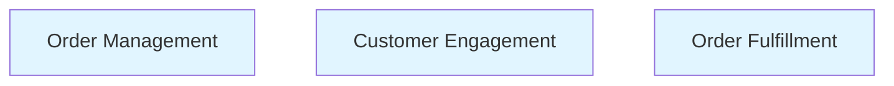
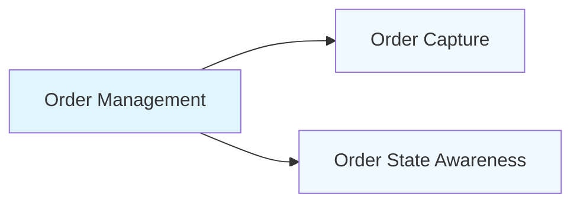
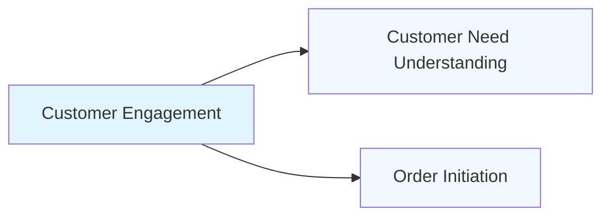
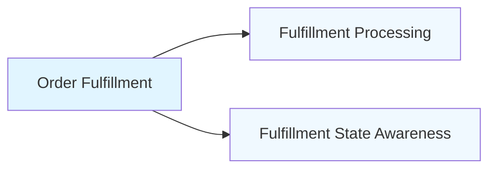
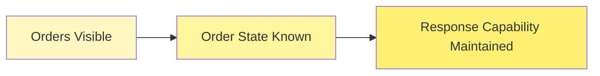
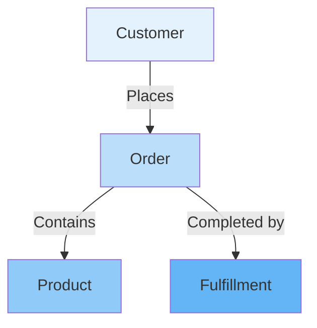

# Business Architecture Document

**Document Type:** TOGAF Business Architecture (BDAT)  
**Version:** 1.0  
**Date:** January 8, 2026  
**Status:** Approved for Enterprise Architecture Review

---

## Executive Summary

This Business Architecture defines the foundational capabilities, value streams, and information concepts required for the organization to manage customer orders from placement through fulfillment. The architecture establishes a stable, technology-agnostic view of what the business must be able to do to create and sustain stakeholder value.

This document conforms to TOGAF Business Architecture Domain (BDAT) principles and provides the business foundation upon which application, data, and technology architectures may be designed.

---

## 1. Business Context and Strategic Intent

### 1.1 Business Purpose

The organization exists to:

- Enable customers to place and manage orders
- Ensure orders are fulfilled reliably
- Maintain visibility into order status throughout its lifecycle
- Build confidence through transparent accountability

### 1.2 Business Goals

**Primary Goals:**

1. **Order Certainty** — Customers can place orders with confidence they will be fulfilled
2. **Fulfillment Reliability** — Orders are fulfilled consistently and predictably
3. **Order Visibility** — Stakeholders maintain awareness of order states

**Success Outcomes:**

- Customers trust the organization to fulfill orders
- Stakeholders make informed decisions based on order state
- Order fulfillment continues reliably

### 1.3 Stakeholder Value Expectations

| Stakeholder | Primary Value Expected                  |
| ----------- | --------------------------------------- |
| Customer    | Certainty that orders will be fulfilled |
| Operations  | Visibility into order fulfillment state |

---

## 2. Business Capability Model

Business Capabilities represent **what the business must be able to do** to deliver value. Capabilities are stable, surviving changes in organization, process, and technology.

### 2.1 Level 1 Capabilities

### 2.2 Capability Definitions

#### 2.2.1 Order Management

**Definition:** The ability to receive, track, and maintain customer orders throughout their lifecycle.

**Purpose:** Enable customers to place orders and the organization to manage them through completion.

**Business Value:** Provides the foundation for commercial transactions and customer satisfaction.

---

#### 2.2.2 Customer Engagement

**Definition:** The ability to interact with customers and understand their needs.

**Purpose:** Enable customers to express requirements and place orders.

**Business Value:** Builds trust and enables order placement.

---

#### 2.2.3 Order Fulfillment

**Definition:** The ability to complete customer orders by delivering requested products.

**Purpose:** Satisfy customer orders and complete the transaction.

**Business Value:** Transforms orders into realized value, building reputation and retention.

---

### 2.3 Level 2 Capability Decomposition

#### Order Management (Level 2)

- **Order Capture** — The ability to receive and record customer orders
- **Order State Awareness** — The ability to know the current status of orders

#### Customer Engagement (Level 2)

- **Customer Need Understanding** — The ability to comprehend customer requirements
- **Order Initiation** — The ability to begin order placement with customers

#### Order Fulfillment (Level 2)

- **Fulfillment Processing** — The ability to execute order completion
- **Fulfillment State Awareness** — The ability to know the current state of order fulfillment

---

## 3. Business Value Streams

Value Streams describe **how value is delivered to stakeholders** through sequential stages. Each stage represents a meaningful value outcome.

**BDAT Grouping Principle:** Value Streams are organized **by stakeholder first**. Each stream represents value delivered to one primary stakeholder through a sequential flow of value outcomes.

---

### 3.1 Customer Order Value Stream

**Stakeholder:** Customer  
**Value Delivered:** Fulfilled order  
**Purpose:** Enable customers to place orders and receive products

**Value Stage Definitions:**

| Stage                 | Value Outcome                   | Stakeholder Benefit               |
| --------------------- | ------------------------------- | --------------------------------- |
| **Need Recognized**   | Customer knows what they want   | Customer ready to order           |
| **Order Placed**      | Order submitted to organization | Customer has initiated purchase   |
| **Order Confirmed**   | Organization acknowledges order | Customer has certainty of receipt |
| **Products Received** | Customer has ordered products   | Customer need satisfied           |

---

### 3.2 Operations Order Visibility Value Stream

**Stakeholder:** Operations  
**Value Delivered:** Awareness of order state  
**Purpose:** Enable operations to monitor and respond to order activity

**Value Stage Definitions:**

| Stage                              | Value Outcome                      | Stakeholder Benefit                |
| ---------------------------------- | ---------------------------------- | ---------------------------------- |
| **Orders Visible**                 | Orders can be observed             | Operations aware of activity       |
| **Order State Known**              | Current order status understood    | Operations knows what's happening  |
| **Response Capability Maintained** | Ability to act on orders preserved | Operations can intervene if needed |

---

## 4. Business Information Concepts

Business Information Concepts represent the **things the business must know about** to create value. These are domain concepts, not data models.

### 4.1 Core Concepts

#### 4.1.1 Order

**Definition:** A customer request for products to be delivered.

**Characteristics:**

- Identifies the customer
- Specifies products requested
- Contains quantities
- Possesses a lifecycle state

**Purpose:** Represents the customer's purchase intent.

---

#### 4.1.2 Customer

**Definition:** A party with whom the organization establishes commitments for the exchange of value.

**Characteristics:**

- Possesses identity
- Articulates needs
- Receives value
- Maintains relationship over time

**Purpose:** Represents the recipient of value and source of demand.

---

#### 4.1.3 Product

**Definition:** An item that can be ordered by customers.

**Characteristics:**

- Has an identifier
- Has a description
- Can be quantified
- Included in orders

**Purpose:** Represents what customers can purchase.

---

#### 4.1.4 Fulfillment

**Definition:** The completion of an order by delivering products to the customer.

**Characteristics:**

- Associated with a specific order
- Progresses through states
- Results in product delivery
- Completes the order lifecycle

**Purpose:** Represents the execution of order completion.

---

### 4.2 Concept Relationships

**Relationship Semantics:**

- **Customer ↔ Order:** Customers place one or many orders
- **Order ↔ Product:** An order contains one or many products
- **Order ↔ Fulfillment:** Each order is completed by fulfillment

---

## 5. Capability-to-Value Stream Mapping

This section illustrates which capabilities enable which value stages.

### 5.1 Customer Order Value Stream Enablement

| Value Stage       | Enabled By Capabilities                           |
| ----------------- | ------------------------------------------------- |
| Need Recognized   | Customer Engagement (Customer Need Understanding) |
| Order Placed      | Customer Engagement (Order Initiation)            |
| Order Confirmed   | Order Management (Order Capture)                  |
| Products Received | Order Fulfillment (Fulfillment Processing)        |

### 5.2 Operations Order Visibility Value Stream Enablement

| Value Stage                    | Enabled By Capabilities                         |
| ------------------------------ | ----------------------------------------------- |
| Orders Visible                 | Order Management (Order State Awareness)        |
| Order State Known              | Order Management (Order State Awareness)        |
| Response Capability Maintained | Order Fulfillment (Fulfillment State Awareness) |

---

## 6. Business Principles

Business Principles guide decision-making across all architecture domains.

### 6.1 Order Integrity

**Principle:** Every order placed must be fulfilled or explicitly communicated as unfulfillable.

**Rationale:** Customer trust depends on reliable order fulfillment.

**Implications:**

- Capabilities must support order state visibility
- Order status must be accessible to customers
- Fulfillment must be verifiable

---

### 6.2 Order Visibility

**Principle:** Stakeholders maintain awareness of order state.

**Rationale:** Visibility enables appropriate response and maintains confidence.

**Implications:**

- Order state must be accessible
- Order information must be interpretable
- Status updates must be timely

---

### 6.3 Capability Stability

**Principle:** Business capabilities remain stable regardless of organizational or technological change.

**Rationale:** Stability enables continuity through transformation.

**Implications:**

- Capabilities are defined by value, not implementation
- Organizational restructuring does not eliminate capabilities
- Technology evolution does not redefine what the business does

---

## 7. Architecture Compliance

### 7.1 TOGAF BDAT Conformance

This Business Architecture conforms to TOGAF Business Architecture Domain (BDAT) standards:

✅ **Business Capabilities** are stable, technology-independent, and value-focused  
✅ **Value Streams** are sequential and stakeholder-oriented  
✅ **Value Stages** represent outcomes, not tasks or activities  
✅ **Information Concepts** use ubiquitous business language  
✅ **No implementation details** are included in business definitions

### 7.2 Validation Checklist

- [ ] Capabilities survive organizational change
- [ ] Capabilities are noun-based and non-technical
- [ ] Value Streams are sequential without branching
- [ ] Value Stages answer "What value now exists?"
- [ ] Information concepts reflect business meaning
- [ ] No processes, workflows, or execution logic present
- [ ] No technology, systems, or applications referenced
- [ ] Stakeholder value is clearly articulated

---

## 8. Next Steps

This Business Architecture serves as the foundation for:

1. **Application Architecture** — Define applications that realize capabilities
2. **Data Architecture** — Model information concepts as data structures
3. **Technology Architecture** — Select platforms that support capability execution
4. **Solution Architecture** — Design integrated solutions aligned to value streams

---

## Appendix A: Glossary

| Term             | Definition                                                      |
| ---------------- | --------------------------------------------------------------- |
| **Capability**   | What the business must be able to do to create value            |
| **Value Stream** | Sequential representation of value delivery to a stakeholder    |
| **Value Stage**  | A point in a value stream where meaningful value outcome exists |
| **Order**        | Customer request for products                                   |
| **Product**      | Item that can be ordered                                        |
| **Customer**     | Party who places orders                                         |
| **Fulfillment**  | Act of completing an order                                      |
| **Stakeholder**  | Party who receives or depends on business value                 |

---

## Document Control

| Version | Date       | Author                  | Changes                                  |
| ------- | ---------- | ----------------------- | ---------------------------------------- |
| 1.0     | 2026-01-08 | Enterprise Architecture | Initial TOGAF BDAT business architecture |

---

**Document Classification:** Internal Use — Enterprise Architecture  
**Review Cycle:** Annual or upon significant business change  
**Approval Authority:** Chief Architect / Enterprise Architecture Board

---

_This document describes WHAT the business must be capable of and WHY. It does not describe HOW capabilities are realized. Application, data, and technology architectures derive from this foundation._
