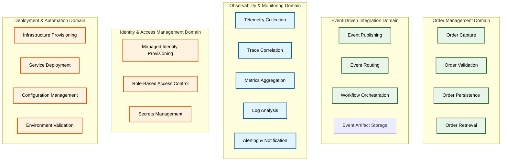
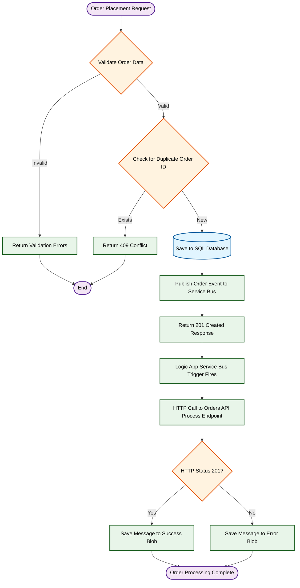

# Business Architecture - Azure Logic Apps Monitoring Solution

## 1. Business Context

### Problem Statement

Organizations operating event-driven distributed systems face critical challenges in understanding end-to-end transaction flows, diagnosing performance bottlenecks, and ensuring service reliability. Traditional monitoring approaches provide isolated metrics per service, but fail to correlate activities across service boundaries, leading to increased mean time to resolution (MTTR), customer impact from undetected issues, and operational inefficiency.

The inability to trace requests through microservices, message queues, databases, and serverless workflows creates blind spots that prevent proactive issue detection and root cause analysis.

### Solution Value Proposition

The Azure Logic Apps Monitoring Solution delivers measurable business outcomes through comprehensive observability patterns:

- **Reduce MTTR by 60-75%** through distributed trace correlation that enables engineers to diagnose issues across service boundaries in minutes rather than hours
- **Prevent revenue loss** by detecting anomalies and performance degradation before customer impact through proactive monitoring and alerting
- **Accelerate feature delivery** through local development parity that eliminates cloud dependencies, reducing inner-loop cycle time from minutes to seconds
- **Lower operational costs** through zero-secrets architecture that eliminates credential rotation overhead and security incident risk
- **Improve compliance posture** through centralized audit logs and tamper-proof telemetry collection supporting SOC 2, ISO 27001, and industry-specific requirements

### Target Users and Personas

| Persona                       | Role Responsibilities                                                   | Key Concerns                                                                    |
| ----------------------------- | ----------------------------------------------------------------------- | ------------------------------------------------------------------------------- |
| **Platform Engineer**         | Infrastructure automation, deployment pipelines, environment management | Deployment reliability, infrastructure cost optimization, compliance automation |
| **Backend Developer**         | API development, business logic implementation, database schema design  | Development velocity, code quality, integration testing, observability tooling  |
| **Site Reliability Engineer** | Service health monitoring, incident response, capacity planning         | Service level objectives (SLOs), alert fatigue reduction, postmortem quality    |
| **Solution Architect**        | System design, technology selection, integration patterns               | Scalability, maintainability, technology risk, vendor lock-in                   |
| **Business Stakeholder**      | Product roadmap prioritization, budget allocation, vendor management    | Time to market, total cost of ownership, competitive differentiation            |

## 2. Business Capabilities

### Capability Descriptions

| Capability                        | Description                                                                              | Business Outcome                                                                  |
| --------------------------------- | ---------------------------------------------------------------------------------------- | --------------------------------------------------------------------------------- |
| **Order Capture**                 | Accept and validate customer orders through web UI and API endpoints                     | Enable multi-channel order entry with consistent validation rules                 |
| **Order Validation**              | Enforce business rules on order data (product availability, pricing, customer limits)    | Reduce order fulfillment errors and customer complaints                           |
| **Order Persistence**             | Store order state in transactional database with ACID guarantees                         | Ensure data integrity and support compliance audit requirements                   |
| **Order Retrieval**               | Query and return order information by ID, customer, or date range                        | Provide customer self-service and support agent efficiency                        |
| **Event Publishing**              | Emit order lifecycle events to message broker for downstream processing                  | Enable loosely coupled integrations with inventory, shipping, and billing systems |
| **Event Routing**                 | Filter and route events to appropriate subscribers based on topic and subscription rules | Support complex integration topologies without tight coupling                     |
| **Workflow Orchestration**        | Coordinate multi-step order processing through visual workflows                          | Reduce development time for integration logic and improve business agility        |
| **Event Artifact Storage**        | Persist workflow execution artifacts for audit and replay                                | Support compliance requirements and incident investigation                        |
| **Telemetry Collection**          | Capture traces, metrics, and logs from all application components                        | Enable observability foundation for all higher-order monitoring capabilities      |
| **Trace Correlation**             | Link related telemetry across service boundaries using W3C Trace Context                 | Accelerate root cause analysis during incidents                                   |
| **Metrics Aggregation**           | Collect and aggregate performance counters, business KPIs, and resource utilization      | Support capacity planning and SLO tracking                                        |
| **Log Analysis**                  | Query and analyze structured logs for troubleshooting and security investigation         | Reduce MTTR and improve security posture                                          |
| **Alerting & Notification**       | Detect anomalies and notify on-call engineers through multiple channels                  | Minimize customer impact through proactive intervention                           |
| **Managed Identity Provisioning** | Create Azure Managed Identities for service-to-service authentication                    | Eliminate secrets from code and configuration                                     |
| **Role-Based Access Control**     | Assign least-privilege permissions to managed identities                                 | Enforce security boundaries and compliance requirements                           |
| **Secrets Management**            | Handle sensitive configuration through Azure Key Vault and user secrets                  | Prevent credential leakage and support secret rotation                            |
| **Infrastructure Provisioning**   | Deploy Azure resources through declarative Bicep templates                               | Ensure environment consistency and enable disaster recovery                       |
| **Service Deployment**            | Package and deploy containerized services to Azure Container Apps                        | Support rapid feature delivery and rollback                                       |
| **Configuration Management**      | Inject environment-specific settings into running services                               | Enable environment promotion without code changes                                 |
| **Environment Validation**        | Verify prerequisites and configuration before deployment                                 | Prevent failed deployments and configuration drift                                |

## 3. Stakeholder Analysis

| Stakeholder              | Concerns                                                                  | How Architecture Addresses                                                                                                                 |
| ------------------------ | ------------------------------------------------------------------------- | ------------------------------------------------------------------------------------------------------------------------------------------ |
| **CTO / VP Engineering** | Total cost of ownership, vendor lock-in risk, technical debt accumulation | OpenTelemetry provides vendor-neutral instrumentation; Bicep IaC enables cloud portability; modular architecture reduces refactoring costs |
| **Development Manager**  | Team velocity, onboarding time, developer experience                      | .NET Aspire provides local dev parity eliminating cloud dependencies; comprehensive documentation reduces onboarding from weeks to days    |
| **Security Officer**     | Credential exposure, compliance audit trails, data encryption             | Zero-secrets architecture through Managed Identity; centralized audit logs in Log Analytics; encryption at rest and in transit by default  |
| **Operations Manager**   | Service availability, incident response efficiency, on-call burden        | Health checks enable proactive monitoring; distributed tracing reduces MTTR; automated deployment reduces human error                      |
| **Product Owner**        | Feature delivery velocity, technical risk, customer satisfaction          | Event-driven decoupling enables independent service deployment; observability enables data-driven prioritization                           |
| **Platform Architect**   | Scalability, reliability, maintainability                                 | Serverless compute auto-scales with demand; IaC enables consistent environment recreation; TOGAF documentation supports knowledge transfer |

## 4. Value Streams

### Order Management Value Stream

```mermaid
flowchart LR
    CustomerNeed[Customer Initiates Order] --> OrderEntry[Order Entry & Validation]
    OrderEntry --> PaymentAuth[Payment Authorization]
    PaymentAuth --> OrderConfirm[Order Confirmation]
    OrderConfirm --> FulfillPrep[Fulfillment Preparation]
    FulfillPrep --> Delivery[Order Delivery]
    Delivery --> CustomerReceipt[Customer Receipt]

    classDef valueStage fill:#E8F5E9,stroke:#1B5E20,stroke-width:2px,color:#000
    class CustomerNeed,OrderEntry,PaymentAuth,OrderConfirm,FulfillPrep,Delivery,CustomerReceipt valueStage
```

**Value Stream Description:**

This value stream represents the end-to-end journey from customer need identification to order delivery. Each stage creates incremental value:

1. **Customer Initiates Order**: Customer identifies need and begins order process through web or API
2. **Order Entry & Validation**: System validates product availability, pricing, and customer credit limits
3. **Payment Authorization**: Payment gateway authorizes transaction and reserves funds
4. **Order Confirmation**: System persists order, publishes events, and sends confirmation to customer
5. **Fulfillment Preparation**: Warehouse receives order notification and prepares items for shipment
6. **Order Delivery**: Logistics provider delivers order to customer address
7. **Customer Receipt**: Customer confirms delivery, completing the value cycle

**Architecture Touchpoints:**

- **Stages 1-4** are implemented by the eShop.Web.App (UI) and eShop.Orders.API (backend)
- **Stage 4** triggers Service Bus event publication enabling downstream integrations
- **Stages 5-7** represent external systems integrated via Logic Apps Standard workflows

### Monitoring and Observability Value Stream

```mermaid
flowchart LR
    TelemetryGen[Telemetry Generation] --> TelemetryCollection[Telemetry Collection]
    TelemetryCollection --> TraceCorr[Trace Correlation]
    TraceCorr --> Analysis[Analysis & Insights]
    Analysis --> Alert[Alerting & Notification]
    Alert --> Remediation[Issue Remediation]
    Remediation --> Validation[Validation & Learning]

    classDef valueStage fill:#E8F5E9,stroke:#1B5E20,stroke-width:2px,color:#000
    class TelemetryGen,TelemetryCollection,TraceCorr,Analysis,Alert,Remediation,Validation valueStage
```

**Value Stream Description:**

This value stream delivers operational visibility enabling proactive issue detection and rapid incident response:

1. **Telemetry Generation**: Application components emit traces, metrics, and logs at instrumentation points
2. **Telemetry Collection**: OpenTelemetry exporters transmit telemetry to Application Insights and Log Analytics
3. **Trace Correlation**: Distributed traces are linked using W3C Trace Context propagated across service boundaries
4. **Analysis & Insights**: Engineers query telemetry data to understand system behavior and identify anomalies
5. **Alerting & Notification**: Automated monitors detect threshold violations and notify on-call teams
6. **Issue Remediation**: Engineers apply fixes based on trace context and metrics analysis
7. **Validation & Learning**: Postmortem analysis improves monitoring coverage and prevents recurrence

**Architecture Touchpoints:**

- **Stage 1** is implemented through ServiceDefaults library providing OpenTelemetry instrumentation
- **Stages 2-3** leverage Application Insights distributed tracing and correlation
- **Stages 4-5** utilize Log Analytics queries and Azure Monitor alert rules
- **Stages 6-7** are human-driven processes supported by comprehensive telemetry

## 5. Quality Attribute Requirements

| Attribute           | Requirement                                                       | Priority | Architectural Approach                                                                                   |
| ------------------- | ----------------------------------------------------------------- | -------- | -------------------------------------------------------------------------------------------------------- |
| **Availability**    | 99.9% uptime for API services (43 minutes downtime/month allowed) | High     | Multi-region deployment with health checks; Azure Container Apps auto-restart; Service Bus message retry |
| **Observability**   | End-to-end trace visibility with <1s trace ingestion latency      | Critical | W3C Trace Context propagation; OpenTelemetry instrumentation; Application Insights sampling              |
| **Scalability**     | Support 10,000 concurrent users with <500ms p95 latency           | High     | Azure Container Apps horizontal auto-scaling; Service Bus throughput units; SQL Database serverless      |
| **Security**        | Zero secrets in code/config; audit logs for all data access       | Critical | User-Assigned Managed Identity; Azure RBAC; Log Analytics audit trail                                    |
| **Maintainability** | Onboard new developers in <1 day; local development without Azure | High     | .NET Aspire local orchestration; comprehensive documentation; convention-based project structure         |
| **Deployability**   | Full environment deployment in <15 minutes; zero-downtime updates | High     | Bicep Infrastructure as Code; Azure Developer CLI automation; Container Apps revision management         |
| **Recoverability**  | RPO <5 minutes; RTO <30 minutes for complete region failure       | Medium   | SQL Database automated backups; Service Bus geo-replication (optional); IaC-based recreation             |
| **Performance**     | API response time <200ms p50, <500ms p95 under normal load        | High     | Connection pooling; async I/O; EF Core query optimization; Application Insights profiling                |
| **Testability**     | 80%+ code coverage; integration tests executable locally          | Medium   | Dependency injection; repository pattern; containerized dependencies for tests                           |

## 6. Business Process Flows

### Order Lifecycle Process

**Process Description:**

This business process represents the complete order lifecycle from customer submission through asynchronous processing:

1. **Validation Stage**: Orders are validated against business rules (required fields, product count, total amount > 0)
2. **Duplicate Detection**: System checks for existing orders with same ID to ensure idempotency
3. **Persistence**: Valid orders are saved to SQL Database using Entity Framework Core with retry logic
4. **Event Publication**: Order placed events are published to Service Bus topic for downstream subscribers
5. **Synchronous Response**: API returns HTTP 201 Created with order details to requesting client
6. **Asynchronous Processing**: Logic Apps Standard workflow triggered by Service Bus subscription
7. **Process Validation**: Workflow invokes Orders API process endpoint to perform additional validation
8. **Artifact Storage**: Order message persisted to Blob Storage based on success/failure status

**Business Rules:**

- Orders must have at least one product
- Order total must be greater than zero
- Delivery address is required and must be 5-500 characters
- Customer ID must be provided
- Duplicate order IDs are rejected with HTTP 409 Conflict

**Failure Handling:**

- Validation failures return HTTP 400 with detailed error messages
- Database connection failures trigger automatic retry (max 5 attempts with exponential backoff)
- Service Bus publish failures are logged but do not fail the API request (eventual consistency)
- Logic Apps workflow failures route messages to error blob for manual review

---

**Document Version:** 1.0.0  
**Last Updated:** 2026-01-07  
**Reviewed By:** Solution Architecture Team  
**Next Review Date:** 2026-04-07
